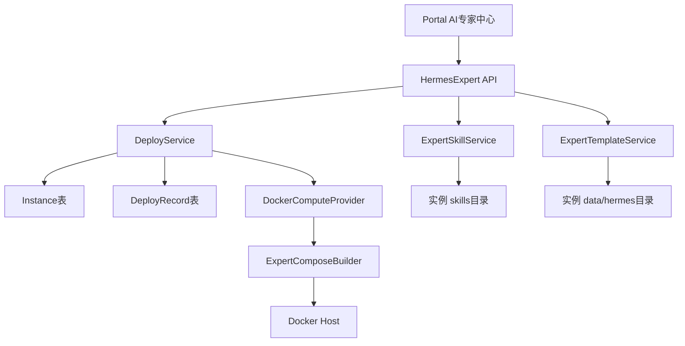

# team_v3.0_agent-expert 实施计划

## 方向校验
本需求服务于“人和 AI 共同经营”：把脚本部署的 Hermes 专家服务纳入 DeskClaw 团队版的统一实例生命周期、能力包管理、日志与 WebUI 访问，降低团队维护 AI 专家的门槛。实现上坚持 CE 产线边界，不引入 EE License、市场、计费或多租户商业能力。

## 前端表现变化

### 1. AI 专家中心
**总结**: 原来 Hermes 专家服务只能通过脚本部署 -> 现在 Portal 中新增统一入口管理专家实例、模板和技能。

**元素级变化**:
- 左侧/顶部导航: 新增“AI 专家中心”入口，包含“专家实例”“专家模板”“技能管理”“部署记录”。
- 专家实例列表: 新增卡片/表格，展示实例名称、Profile、专家模板、Runtime、状态、WebUI 地址、端口、Hindsight Bank、创建时间和操作按钮。
- 操作按钮: 新增“打开 WebUI”“查看日志”“重启”“停止”“启动”“管理技能”“删除”。运行中实例显示可打开 WebUI；异常实例显示可操作错误提示。
- 空状态: 无专家实例时显示“还没有专家服务，请创建 writer 或 finance 专家”，并提供创建按钮。

**改动后**:
```text
┌─ AI 专家中心 ──────────────────────────────┐
│ [创建专家实例]                             │
│                                            │
│ 专家实例                                   │
│ ┌ writer ─ running ─ WebUI: localhost:8787 ┐ │
│ │ Template writer | Bank hermes-writer     │ │
│ │ [打开 WebUI] [日志] [技能] [重启]         │ │
│ └──────────────────────────────────────────┘ │
│ ┌ finance ─ stopped ─ WebUI: localhost:8788┐ │
│ │ [启动] [日志] [技能] [删除]              │ │
│ └──────────────────────────────────────────┘ │
└────────────────────────────────────────────┘
```

### 2. 创建专家实例页
**总结**: 原来创建实例是通用 AI 员工表单 -> 现在新增专家专用创建向导，默认选择 `hermes-webui-expert`（Hermes 专家服务运行时）和 Docker 集群。

**元素级变化**:
- 基础信息区域: 新增实例名称、Profile、专家模板选择，模板含 base/writer/finance。
- 运行环境区域: 新增 Docker Host/Cluster、镜像版本、WebUI 端口自动/手动选项。
- 记忆配置区域: 新增 Hindsight API URL（Hindsight 外部记忆接口地址）和 Bank ID 自动/手动选项。
- 模型配置区域: 复用现有 LLM Key（大模型密钥）配置组件。
- 高级配置区域: 新增环境变量、存储目录、初始化 Obsidian Vault、安装默认技能包开关。
- 提交行为: 创建后进入现有部署进度页；部署成功后回到专家实例详情并展示 WebUI 地址和一次性密码提示。

**改动后**:
```text
┌─ 创建 Hermes 专家服务 ─────────────────────┐
│ 基础信息                                   │
│ 名称 [writer]  Profile [writer]            │
│ 模板 [writer v0.1.0 ▼]                     │
│                                            │
│ 运行环境                                   │
│ Cluster [Docker Local ▼] 镜像 [latest ▼]    │
│ WebUI 端口 (● 自动) (○ 手动 [8787])         │
│                                            │
│ 记忆配置                                   │
│ Hindsight API URL [____________]            │
│ Bank ID (● 自动 hermes-writer)              │
│                                            │
│ [创建并部署]                               │
└────────────────────────────────────────────┘
```

### 3. 实例级技能管理页
**总结**: 原来 `/hermes/skills` 管理全局 Hermes Skill 注册表 -> 现在专家实例详情中新增“技能”页，管理该实例 `skills/` 目录下的能力包。

**元素级变化**:
- 实例详情侧边栏: 当 runtime 支持专家技能时新增“技能”导航项。
- 技能列表: 展示技能名称、slug、version、enabled 状态、requires_restart、来源、安装时间。
- 安装入口: 新增内置技能包安装、zip 上传、私有 Git 安装三种入口。
- 状态变化: 禁用技能后从 enabled 变 disabled；安装需要重启的技能后显示 pending_restart 标签和“重启实例”引导。
- 错误状态: manifest 解析失败时展示可操作错误，说明缺少 `SKILL.md`、`manifest.json` 或字段格式错误。

**改动后**:
```text
┌─ writer / 技能 ────────────────────────────┐
│ [安装内置技能] [上传 zip] [从私有 Git 安装] [重新扫描] │
│                                            │
│ slug                  version   状态        │
│ writer-outline        0.1.0     enabled     │
│ finance-summary       0.1.0     disabled    │
│ datasheet-parser      0.2.0     pending_restart │
└────────────────────────────────────────────┘
```

## 架构方案
采用“独立专家 API + 复用现有实例生命周期”的方案。



关键取舍：
- 不新增大规模专家实例表，MVP 复用 `Instance.advanced_config` 保存 expert/webui/hindsight/skills/compose 元数据。
- 新增 `app/api/hermes_experts.py`，避免污染通用 `/deploy` 请求，但内部调用 `deploy_service.deploy_instance()` 复用 SSE（服务端推送）部署进度。
- 实例级技能管理与现有 `app/api/hermes_skill` 全局技能注册表分离，只复用 manifest 解析、目录扫描和包校验思路。

## 主要文件与职责

### 后端 Runtime 与 Docker
- `[nodeskclaw-backend/app/services/runtime/registries/runtime_registry.py](nodeskclaw-backend/app/services/runtime/registries/runtime_registry.py)` — 新增 `hermes-webui-expert` 的 `RuntimeSpec`（运行时规格）和能力开关。
- `[nodeskclaw-backend/app/core/config.py](nodeskclaw-backend/app/core/config.py)` — 新增 Hermes 私有仓库、专家镜像、Hindsight、端口池、数据根目录配置项。
- `[nodeskclaw-backend/app/services/docker_constants.py](nodeskclaw-backend/app/services/docker_constants.py)` — 支持专家专用端口池和数据根目录读取。
- `[nodeskclaw-backend/app/services/runtime/compute/docker_provider.py](nodeskclaw-backend/app/services/runtime/compute/docker_provider.py)` — 当 `config.runtime == "hermes-webui-expert"` 时委托专家 Compose Builder，保留现有 OpenClaw/Hermes 逻辑。

### 后端专家服务
- `[nodeskclaw-backend/app/services/hermes_expert/schemas.py](nodeskclaw-backend/app/services/hermes_expert/schemas.py)` — 定义模板、实例、技能、安装请求和响应 schema。
- `[nodeskclaw-backend/app/services/hermes_expert/expert_template_service.py](nodeskclaw-backend/app/services/hermes_expert/expert_template_service.py)` — 列出模板、读取模板详情、注入 base + 专家模板、占位符替换、备份旧文件。
- `[nodeskclaw-backend/app/services/hermes_expert/expert_skill_service.py](nodeskclaw-backend/app/services/hermes_expert/expert_skill_service.py)` — 管理实例 `skills/` 目录，支持列表、详情、安装内置包、上传 zip、启用/禁用、删除、重新扫描、写 `.index.json`。
- `[nodeskclaw-backend/app/services/hermes_expert/expert_compose_builder.py](nodeskclaw-backend/app/services/hermes_expert/expert_compose_builder.py)` — 生成 `docker-compose.yml` 和 `.env`，写入 WebUI、Hindsight、数据目录、healthcheck、平台 `linux/amd64`。
- `[nodeskclaw-backend/app/services/hermes_expert/expert_filesystem.py](nodeskclaw-backend/app/services/hermes_expert/expert_filesystem.py)` — 统一路径校验、zip 解压安全校验、备份目录、原子写入，防止路径穿越。
- `[nodeskclaw-backend/app/services/hermes_expert/expert_manifest.py](nodeskclaw-backend/app/services/hermes_expert/expert_manifest.py)` — 解析 `manifest.json` 与 `SKILL.md`，返回用户可读错误。

### 后端资源包与 API
- `[nodeskclaw-backend/app/resources/hermes_webui_expert/](nodeskclaw-backend/app/resources/hermes_webui_expert/)` — 新增 Dockerfile、compose 模板、base/writer/finance 模板、内置 skill-bundles，并写 README。
- `[nodeskclaw-backend/app/api/hermes_experts.py](nodeskclaw-backend/app/api/hermes_experts.py)` — 新增专家模板、专家实例、实例操作、技能管理 API。
- `[nodeskclaw-backend/app/api/router.py](nodeskclaw-backend/app/api/router.py)` — 注册 `/hermes-experts` 路由。
- `[nodeskclaw-backend/app/services/deploy_service.py](nodeskclaw-backend/app/services/deploy_service.py)` — 增加专家 Docker 部署步骤名称、端口池/advanced_config 写入、专家实例后置步骤，保持通用部署兼容。

### Portal 前端
- `[nodeskclaw-portal/src/router/hermes.ts](nodeskclaw-portal/src/router/hermes.ts)` — 增加专家中心路由。
- `[nodeskclaw-portal/src/api/hermes/experts.ts](nodeskclaw-portal/src/api/hermes/experts.ts)` — 新增专家中心 API 封装。
- `[nodeskclaw-portal/src/views/hermes/ExpertInstancesView.vue](nodeskclaw-portal/src/views/hermes/ExpertInstancesView.vue)` — 专家实例列表。
- `[nodeskclaw-portal/src/views/hermes/CreateExpertInstanceView.vue](nodeskclaw-portal/src/views/hermes/CreateExpertInstanceView.vue)` — 专家创建向导。
- `[nodeskclaw-portal/src/views/hermes/ExpertTemplatesView.vue](nodeskclaw-portal/src/views/hermes/ExpertTemplatesView.vue)` — 专家模板列表与详情。
- `[nodeskclaw-portal/src/views/hermes/ExpertInstanceSkillsView.vue](nodeskclaw-portal/src/views/hermes/ExpertInstanceSkillsView.vue)` — 实例级技能管理。
- `[nodeskclaw-portal/src/views/InstanceLayout.vue](nodeskclaw-portal/src/views/InstanceLayout.vue)` — runtime 能力支持时显示“技能”页。
- `[nodeskclaw-portal/src/utils/runtimeCapabilities.ts](nodeskclaw-portal/src/utils/runtimeCapabilities.ts)` — 扩展专家技能能力位。
- `[nodeskclaw-portal/src/i18n/locales/zh-CN.ts](nodeskclaw-portal/src/i18n/locales/zh-CN.ts)` 与 `[nodeskclaw-portal/src/i18n/locales/en-US.ts](nodeskclaw-portal/src/i18n/locales/en-US.ts)` — 新增全部用户可见文案。

### 测试与文档
- `[nodeskclaw-backend/tests/test_runtime_registry_display.py](nodeskclaw-backend/tests/test_runtime_registry_display.py)` — 覆盖新 runtime 展示与能力。
- `[nodeskclaw-backend/tests/test_docker_provider_paths.py](nodeskclaw-backend/tests/test_docker_provider_paths.py)` — 覆盖专家 compose 路径和数据目录。
- `[nodeskclaw-backend/tests/test_hermes_expert_template_service.py](nodeskclaw-backend/tests/test_hermes_expert_template_service.py)` — 覆盖模板注入、占位符替换、备份。
- `[nodeskclaw-backend/tests/test_hermes_expert_skill_service.py](nodeskclaw-backend/tests/test_hermes_expert_skill_service.py)` — 覆盖 skill manifest、zip 安全、启用/禁用、pending_restart。
- `[nodeskclaw-backend/tests/test_hermes_experts_api.py](nodeskclaw-backend/tests/test_hermes_experts_api.py)` — 覆盖 API 权限、runtime 校验、创建请求转换。
- `[nodeskclaw-portal/src/utils/runtimeCapabilities.test.ts](nodeskclaw-portal/src/utils/runtimeCapabilities.test.ts)` — 覆盖专家技能能力位。
- `[nodeskclaw-backend/README.md](nodeskclaw-backend/README.md)` — 补充 Hermes Expert 配置项和本地 Docker 前置条件。
- `ee/docs/` 相关设计文档 — 同步后端架构、页面线框图、PRD 说明，避免代码和设计不一致。

## 实施步骤

### 阶段 1：后端运行时骨架
1. 在 `runtime_registry.py` 添加 `hermes-webui-expert`，设置 `gateway_port=8787`、`health_probe_path=/health`、`has_web_ui=True`、`supports_channel_plugins=False`、`data_dir_container_path=/data/hermes`。
2. 扩展 `RuntimeProductCapabilities`，新增 `expert_skills` 或复用更准确命名的能力位，让 Portal 能决定是否显示实例技能管理页。
3. 在 `config.py` 增加 PRD 要求的 Hermes 专家配置项，默认值不得包含公开 Hermes GitHub 地址或真实凭据。
4. 增加 runtime registry 单测，确认 `/api/v1/engines` 返回 Hermes 专家服务。

### 阶段 2：资源包与模板服务
1. 创建 `app/resources/hermes_webui_expert/README.md`、`Dockerfile`、`docker-compose.template.yml`、`expert-templates/base`、`expert-templates/writer`、`expert-templates/finance`、`skill-bundles/default`。
2. `Dockerfile` 只使用 build args 和环境变量引用私有仓库，不写死公开 URL，不写 token。
3. 实现 `ExpertTemplateService`，模板注入流程为：校验模板 -> 创建数据目录 -> 备份已有文件 -> 注入 base -> 注入专家模板 -> 替换占位符 -> 创建 workspace/obsidian/skills/sessions/logs/webui -> 写注入记录。
4. 增加模板服务单测，覆盖 `__PROFILE__`、`__INSTANCE_ID__`、`__HINDSIGHT_BANK_ID__` 等占位符。

### 阶段 3：专家 Compose 与 Docker 部署
1. 实现 `ExpertComposeBuilder`，从 `InstanceComputeConfig.advanced_config` 和 settings 生成 `.env` 与 `docker-compose.yml`。
2. 修改 `DockerComputeProvider.create_instance()`，当 runtime 为 `hermes-webui-expert` 时调用专家 builder，并使用容器名 `hermes-<profile>`、服务名 `hermes-webui`。
3. 保持现有 `destroy_instance()`、`get_status()`、`get_logs()`、`restart_instance()` 可处理专家容器；如容器名不同，统一通过 `ComputeHandle.extra.container_name` 读取。
4. 调整 Docker health probe 使用 runtime 的 `/health`。
5. 增加 Docker provider 单测，覆盖 compose 内容、`linux/amd64`、不挂载 Docker socket、不写入 Git token。

### 阶段 4：专家 API 与部署编排
1. 新增 `/api/v1/hermes-experts/templates` 和 `/api/v1/hermes-experts/templates/{template_slug}`。
2. 新增 `/api/v1/hermes-experts/instances` 创建接口，将专家请求转换为 `DeployRequest(runtime="hermes-webui-expert", compute_provider=docker cluster, advanced_config.expert/webui/hindsight/skills/compose)`。
3. 创建接口内部调用 `deploy_service.deploy_instance()` 并启动 `execute_deploy_pipeline()`，复用现有部署进度页。
4. 新增专家实例列表接口，从 `Instance` 过滤 `runtime == "hermes-webui-expert"`，解析 `advanced_config` 返回 profile、template、webui_url、hindsight_bank_id。
5. 新增 start/stop/restart/delete/logs/health 接口，复用 `instance_service` 中已有生命周期能力，删除仍走软删除和 compute 清理。
6. 注册 `app/api/hermes_experts.py` 到 `api/router.py`。
7. 增加 API 单测，覆盖组织成员权限、非专家 runtime 拒绝、Docker 集群校验、返回 deploy_id 和 instance_id。

### 阶段 5：实例级技能管理
1. 实现 `ExpertSkillService`，所有操作限定到该实例的 `data/hermes/skills` 目录。
2. 支持内置 bundle 安装，来源为 `app/resources/hermes_webui_expert/skill-bundles`。
3. 支持 zip 上传，必须校验压缩包大小、路径穿越、顶层目录结构、`SKILL.md`、`manifest.json`。
4. 支持私有 Git 安装，凭据只通过后端 Secret/配置引用，不返回前端、不写入 manifest、不写日志。
5. 启用/禁用通过修改 `manifest.json.enabled` 完成；`requires_restart=true` 时返回 `pending_restart`。
6. 删除技能使用文件目录删除，但实例数据库仍不物理删除；操作结果记录在技能安装日志或 `.index.json` 中。
7. 增加单测覆盖 manifest 解析失败、启用/禁用、重扫、pending_restart 和路径安全。

### 阶段 6：Portal 专家中心
1. 新增 `src/api/hermes/experts.ts`，封装模板、实例、生命周期、技能 API。
2. 在 `router/hermes.ts` 新增 `/hermes/experts`、`/hermes/experts/create`、`/hermes/experts/templates`、`/instances/:id/expert-skills` 或等价路由。
3. 实现专家实例列表，空状态提供创建引导，错误状态提供可操作提示。
4. 实现专家创建向导，复用现有模型配置交互，但只暴露专家需要的字段。
5. 实现实例级技能管理页，支持安装内置包、上传 zip、私有 Git 安装、启用/禁用、删除、重扫。
6. 更新 `InstanceLayout.vue`，当 runtime 能力包含专家技能时显示“技能”。
7. 全部用户可见文案接入 i18n，不新增硬编码中文。

### 阶段 7：配置、文档、验证
1. 更新 `nodeskclaw-backend/README.md`，说明 Hermes 专家配置项、Docker 前置条件、私有仓库凭据处理方式。
2. 更新 `ee/docs/` 中相关 PRD、后端架构、页面线框图，记录专家中心黑盒体验和 API 边界。
3. 检查 Gene/Skill 同步：本次涉及 Agent 行为与技能包管理，需要核对 `nodeskclaw-backend/app/data/gene_templates/` 是否有 Hermes 专家相关模板需要同步；如有，更新模板版本并提醒推送 DeskHub。
4. 运行后端单测：`uv run pytest tests/test_runtime_registry_display.py tests/test_docker_provider_paths.py tests/test_hermes_expert_template_service.py tests/test_hermes_expert_skill_service.py tests/test_hermes_experts_api.py`。
5. 运行后端 lint：`uv run ruff check .`。
6. 运行 Portal 类型/构建验证：`npm run build` 或项目已有类型检查命令。
7. 不主动执行 Docker build、docker push、deploy 脚本；只在用户明确授权部署时再执行。

## 关键风险与约束
- 私有仓库资产缺口：如果本地没有 `copilot-docker` 的真实模板和技能包，先落地可运行的最小 base/writer/finance 骨架，再由你提供私有资产后替换。
- 凭据安全：Git token、Registry password、WebUI password 不进入 compose、`.env`、日志、前端响应长期保存；WebUI 密码只在创建成功时展示一次，重置另做接口。
- Docker 安全：Hermes 专家容器只挂载 `/data/hermes`，禁止挂载宿主机根目录、用户 Home、Docker socket。
- 数据模型：MVP 不新增专家实例表；如后续需要复杂审计、技能安装历史查询，再引入独立表和 Alembic 迁移。
- 兼容性：不覆盖现有 `runtime=hermes`，不改变现有 `/hermes/skills` 全局技能注册表语义。

## 自检清单
- PRD 的 Runtime、资源包、模板、Compose、Hindsight、技能管理、API、Portal、配置、验收标准均有对应任务。
- 所有代码定位均使用文件和函数/职责锚点，没有使用行号。
- 前端表现变化已用用户视角描述，并包含元素级变化和 UI 简图。
- 未引入 EE 商业能力、公开市场、计费或多租户商业管控。
- 未计划执行部署、Docker build/push 或破坏性操作。