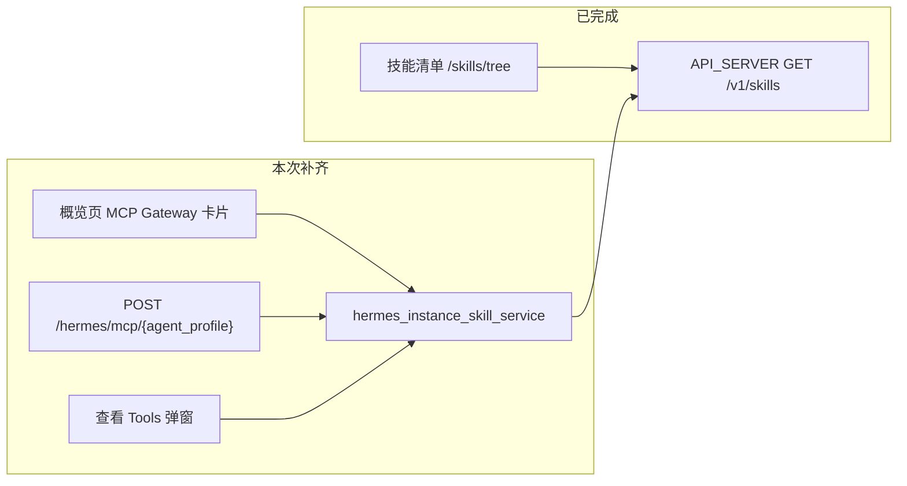

# Agent Detail MCP Gateway 补齐计划

## 差距分析（已完成 vs 未做）

### 已完成（[hermes_实例skills数据源hotfix 计划](.cursor/plans/hermes_实例skills数据源hotfix_743b6aa3.plan.md)）

| 项 | 状态 |
|---|---|
| `HermesApiServerClient.list_skills()` | 已实现 |
| `profile_skill_inventory_service` 改 API_SERVER 数据源 | 已实现（逻辑内联，无独立 service） |
| `/skills/tree` 端点 + 错误码 | 已实现 |
| 技能页「实例 Skills / 本地 Profile 技能管理」文案 | 已实现 |
| 技能页轻量 MCP 信息栏（状态 + 说明 + count + 刷新） | 已实现 |
| API_SERVER 错误引导 + 重试 | 已实现 |

### PRD 未实现（本次补齐）

| 项 | PRD 章节 | 现状 |
|---|---|---|
| `hermes_instance_skill_service.py`（共享获取/缓存） | 7.2 / B2 | 不存在；逻辑在 [profile_skill_inventory_service.py](nodeskclaw-backend/app/services/hermes_external/profile_skill_inventory_service.py) |
| `POST /api/v1/hermes/mcp/{agent_profile}` JSON-RPC | 7.4 / B4 | 仅有全局 [POST /hermes/mcp](nodeskclaw-backend/app/api/mcp_skill_gateway/router.py) 与 [POST /hermes/mcp](nodeskclaw-backend/app/api/hermes_skill/mcp_router.py)，**无 per-agent 路由** |
| `tools/list`（API_SERVER skills + can_list + tool schema） | 7.5 / B5 | 现有 [McpToolMapper](nodeskclaw-backend/app/services/hermes_skill/mcp_tool_mapper.py) 走 DB `HermesSkill` 安装记录，**非 API_SERVER /v1/skills** |
| `tools/call`（chat/completions） | 7.6 / B6 | 未实现 per-agent 路径 |
| 30s 实例 skills 缓存 | 7.8 | 未实现 |
| tools/call 审计 | 7.5 / B7 | 未接入 per-agent 链路（可复用 [log_mcp_call](nodeskclaw-backend/app/services/mcp_skill_gateway/audit_service.py)） |
| **概览页完整 MCP Gateway 卡片** | 8.2 / F1 | [AgentDetailView.vue](nodeskclaw-portal/src/views/hermes/AgentDetailView.vue) 概览仅有 docker/runtime 信息，**无 MCP 卡片** |
| 复制 Endpoint / 查看 Tools / 诊断 | 8.2 / F5 | 未实现 |
| default-only 提示文案 | 8.1 / F3 | 技能页有部分说明，缺 PRD 完整拆分提示 |



## 范围边界

- **范围内**：`/hermes/agents/{agent_profile}` 详情页 MCP Gateway（概览完整卡片 + 技能页精简栏联动）、per-agent MCP JSON-RPC、实例 Skills 共享服务与缓存、Tools 查看弹窗、诊断入口
- **范围外**：`HermesMcpGatewayConfig` / `HermesMcpSkillCache` 新表（PRD 11 标为可选；首版用内存 TTL 缓存 + 复用 `HermesAgentInstance`）、概览页以外的全局 MCP 网关改造、profile 级 MCP 暴露

## 前端表现变化

### 1. Agent Detail 概览页 - 新增完整 MCP Gateway 卡片

**总结**: 概览页从「仅显示 docker/runtime 信息」→ 新增完整 MCP Gateway 管理卡片

**元素级变化**:
- MCP Gateway 卡片: **新增**，位于概览 tab 顶部或 runtime 信息卡下方
- 状态徽标: `enabled / disabled / offline / unconfigured / unauthorized`（依据 API_SERVER 与绑定记录计算）
- 暴露范围: 固定文案「instance default skills」
- Skills 来源: `Hermes API_SERVER /v1/skills`
- Endpoint: 显示 `/api/v1/hermes/mcp/common-writer` + **复制按钮**
- Tools 数量 + 最近刷新时间: **新增**
- 操作按钮: **刷新 Skills**、**复制 MCP Endpoint**、**查看 Tools**、**诊断**（诊断跳转已有 `/hermes/agents/{profile}/diagnostics`）
- API_SERVER 离线: 卡片显示 `无法连接 Hermes API_SERVER，MCP Gateway 暂不可用` + 重试

**改动后（概览页）**:
```
┌─ common-writer 概览 ─────────────────────┐
│ ┌─ MCP Gateway ────────────────────────┐ │
│ │ 状态: enabled    暴露: default skills │ │
│ │ 来源: API_SERVER /v1/skills           │ │
│ │ Endpoint: /api/v1/hermes/mcp/common-writer [复制] │
│ │ Tools: 86    最近刷新: 2026-xx-xx       │ │
│ │ [刷新] [查看 Tools] [诊断]              │ │
│ └──────────────────────────────────────┘ │
│ ... 现有 docker/runtime 信息 ...          │
└──────────────────────────────────────────┘
```

### 2. 技能清单页 - 精简信息栏联动概览

**总结**: 保留现有轻量信息栏，增加「前往概览查看 MCP Gateway」链接，不重复完整卡片

**元素级变化**:
- 顶部 MCP 信息栏: **保留**现有 online/说明/count/刷新
- 新增链接: 「查看 MCP Gateway 详情」→ 切换/跳转概览 tab
- default-only 提示: **新增** PRD F3 文案（writer-zh/researcher 需独立 container）
- 完整 Endpoint 复制 / 查看 Tools: **不在此页重复**，由概览页承担

### 3. 查看 MCP Tools 弹窗（概览页触发）

**总结**: 新增弹窗展示当前用户可见的 MCP Tools 列表及授权状态

**元素级变化**:
- 弹窗: **新增**，列 Tool Name / Skill ID / Category / Description / can_list / can_invoke
- 空状态: 无授权 skills 时提示「当前账号无可查看的 MCP Tools」

## 后端改动

### 步骤 1：新增 `hermes_instance_skill_service.py`

新建 [nodeskclaw-backend/app/services/hermes_external/hermes_instance_skill_service.py](nodeskclaw-backend/app/services/hermes_external/hermes_instance_skill_service.py)

- 核心函数 `list_instance_skills(agent_profile, *, force_refresh=False) -> HermesInstanceSkillList`
- 从 `HermesDockerBindingService` 取绑定记录 → `parse_env_file` 取 `API_SERVER_KEY` → `HermesApiServerClient.list_skills()`
- 内存 TTL 缓存（默认 30s，key: `hermes_instance_skills:{agent_profile}`），`force_refresh=True` 或 TTL 过期时重拉
- 返回 PRD 7.2 结构：`agent_profile`、`source_mode=api_server_default`、`total`、`skills[]`、`warnings[]`、`last_refreshed_at`
- **不缓存 API_SERVER_KEY**

### 步骤 2：重构 `profile_skill_inventory_service` 复用 instance service

[profile_skill_inventory_service.py](nodeskclaw-backend/app/services/hermes_external/profile_skill_inventory_service.py) 中 API 拉取逻辑改为调用 `list_instance_skills()`，仅负责 profile 存在校验、keyword 过滤、category 分组、映射为 `ProfileSkillTreeResponse`。**对外 `/skills/tree` 行为不变**。

### 步骤 3：新增 `hermes_agent_mcp_gateway_service.py`

新建 [nodeskclaw-backend/app/services/hermes_external/hermes_agent_mcp_gateway_service.py](nodeskclaw-backend/app/services/hermes_external/hermes_agent_mcp_gateway_service.py)

- **Tool 命名**: `hermes_{agent_slug}__{skill_slug}`（agent_slug: 小写、`-` 保留，PRD 7.5）
- **tools/list**: `list_instance_skills` → `HermesSkillAuthorizationService.can_list` 过滤 → 转 MCP tool schema（固定 `prompt` + 可选 `context` inputSchema，metadata 含 `agent_profile/skill_id/category/source`）
- **tools/call**: 解析 tool name → 校验 URL `agent_profile` 一致 → 确认 skill 存在于 instance list → `can_invoke` → `POST /v1/chat/completions`（model 取自 env `API_SERVER_MODEL_NAME`）
- **profile 参数**: 请求 params 含 `profile` 时返回 `profile_not_supported`（400）
- **admin/operator**: 授权校验走现有 [hermes_skill_authorization_service.py](nodeskclaw-backend/app/services/hermes_skill/hermes_skill_authorization_service.py)（含 v5.1 已修复的 user/agent grant）
- **审计**: `tools/call` 调用 [log_mcp_call](nodeskclaw-backend/app/services/mcp_skill_gateway/audit_service.py)，记录 `agent_profile/skill_id/latency/status`（不记完整 prompt）

### 步骤 4：新增 Schema

新建 [nodeskclaw-backend/app/schemas/hermes_instance_skill.py](nodeskclaw-backend/app/schemas/hermes_instance_skill.py)：
- `HermesInstanceSkillItem`、`HermesInstanceSkillListResponse`
- `HermesMcpGatewayStatusResponse`（enabled、status、endpoint、expose_scope、skills_count、tools_count、last_refreshed_at、warnings）
- `HermesMcpToolItem`（tool_name、skill_id、category、description、can_list、can_invoke）

### 步骤 5：新增 API 路由

在 [agents_bind_router.py](nodeskclaw-backend/app/api/hermes_skill/agents_bind_router.py) 或新建 `agent_mcp_gateway_router.py` 并挂到 [hermes_skill/router.py](nodeskclaw-backend/app/api/hermes_skill/router.py)：

| 方法 | 路径 | 用途 |
|---|---|---|
| GET | `/hermes/agents/{agent_profile}/mcp-gateway` | 概览卡片状态（org member JWT） |
| GET | `/hermes/agents/{agent_profile}/mcp-tools` | Tools 弹窗（含当前用户 can_list/can_invoke） |
| POST | `/hermes/mcp/{agent_profile}` | JSON-RPC：`initialize` / `ping` / `tools/list` / `tools/call` |

鉴权：
- Portal 读接口：`require_org_member` + `hermes_agent:view`
- MCP JSON-RPC：复用 [dispatch_authenticated](nodeskclaw-backend/app/services/mcp_skill_gateway/handler.py) 的 org member 鉴权模式（与现有 `/hermes/mcp` 一致）；**首版不支持匿名**

错误码（复用已有 + 新增）：
- `errors.hermes.api_server_not_configured`（409）
- `errors.hermes.api_server_offline`（503）
- `errors.hermes.api_server_unauthorized`（403）
- `errors.hermes.profile_not_supported`（400）
- `errors.hermes.skill_not_found` / `errors.hermes.skill_permission_denied` / `errors.hermes.mcp_tool_name_invalid` / `errors.hermes.chat_completion_failed`

### 步骤 6：后端测试

新建 [nodeskclaw-backend/tests/hermes_skill/test_hermes_agent_mcp_gateway.py](nodeskclaw-backend/tests/hermes_skill/test_hermes_agent_mcp_gateway.py)，覆盖 PRD 16 核心用例：
- instance skills 从 API_SERVER 获取 / 需 gateway_url+key
- mcp tools/list 返回 API_SERVER skills 并按 can_list 过滤
- tools/call 校验 skill 存在 + can_invoke + 调 chat_completions
- 拒绝 profile 参数
- API_SERVER 离线不 fallback 本地目录
- **mock 验证不调用 docker exec**

## 前端改动

### 步骤 7：API 层

扩展 [nodeskclaw-portal/src/api/hermes/agentInstances.ts](nodeskclaw-portal/src/api/hermes/agentInstances.ts)（或新建 `agentMcpGateway.ts`）：
- `getHermesMcpGatewayStatus(agentProfile)`
- `listHermesMcpTools(agentProfile, { forceRefresh? })`

### 步骤 8：新增 `AgentMcpGatewayCard.vue`

新建 [nodeskclaw-portal/src/views/hermes/AgentMcpGatewayCard.vue](nodeskclaw-portal/src/views/hermes/AgentMcpGatewayCard.vue)
- 拉取 `mcp-gateway` 状态
- 展示 PRD 8.2 字段 + 复制 Endpoint（`navigator.clipboard` + toast）
- 刷新 / 查看 Tools / 诊断（调用已有 `getHermesAgentDiagnostics`）
- 错误态与重试

### 步骤 9：新增 `McpToolsDialog.vue`

新建 [nodeskclaw-portal/src/views/hermes/McpToolsDialog.vue](nodeskclaw-portal/src/views/hermes/McpToolsDialog.vue)
- 表格展示 tool 列表（F5 字段）
- loading / empty / error 态

### 步骤 10：集成到 Agent Detail

[AgentDetailView.vue](nodeskclaw-portal/src/views/hermes/AgentDetailView.vue) 概览 tab 顶部插入 `<AgentMcpGatewayCard :agent-profile-name="agent.profile_name" />`

[AgentProfileSkillTreeView.vue](nodeskclaw-portal/src/views/hermes/AgentProfileSkillTreeView.vue)：
- 保留精简信息栏
- 新增 default-only 提示（F3）+ 「查看 MCP Gateway 详情」emit 给父组件切换 tab

[AgentDetailView.vue](nodeskclaw-portal/src/views/hermes/AgentDetailView.vue) 监听 emit，`switchTab('overview')`

### 步骤 11：i18n

[zh-CN.ts](nodeskclaw-portal/src/i18n/locales/zh-CN.ts) / [en-US.ts](nodeskclaw-portal/src/i18n/locales/en-US.ts) 补：
- `hermes.agents.mcpGateway.*`（卡片字段、按钮、状态、复制成功/失败）
- `hermes.agents.mcpTools.*`（弹窗列名、空状态）
- `hermes.profiles.skills.defaultOnlyNotice`（F3）
- `errors.hermes.profile_not_supported` 等新增错误码

## 验证

```bash
# 后端
cd nodeskclaw-backend
uv run pytest tests/hermes_skill/test_hermes_agent_mcp_gateway.py tests/hermes_skill/test_profile_skill_inventory.py -q
uv run ruff check app/services/hermes_external/hermes_instance_skill_service.py app/services/hermes_external/hermes_agent_mcp_gateway_service.py

# 前端
cd nodeskclaw-portal
vue-tsc -b
```

手工验收（common-writer）：
1. 概览页 MCP 卡片显示 Endpoint、Tools 数量、复制成功
2. 「查看 Tools」弹窗列出 API_SERVER skills（经授权过滤）
3. `POST /api/v1/hermes/mcp/common-writer` + `tools/list` 与 API_SERVER `/v1/skills` 数量一致（过滤后 ≤ N）
4. 技能页精简栏可跳转概览；`?profile=researcher` 时 MCP 仍暴露 common-writer default skills
