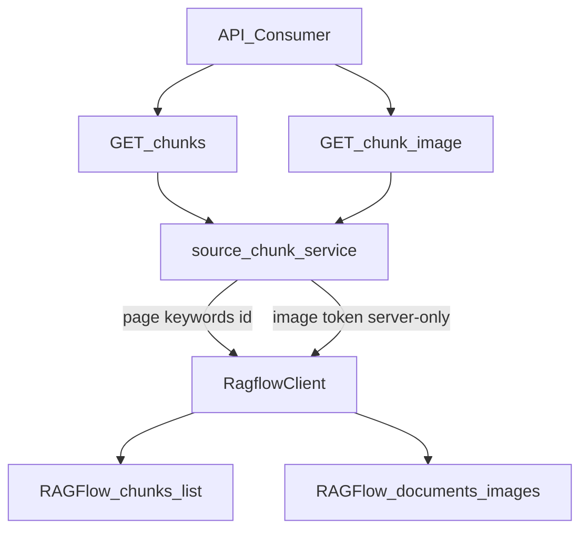

# Chunk Gateway v1.1 分页一致性 + Image Proxy 实现计划

> **For agentic workers:** REQUIRED SUB-SKILL: Use `subagent-driven-development`（推荐）按 task 执行。Steps 使用 checkbox 跟踪。
>
> **commit_policy:** `post_review`（Todo 完成禁止 commit；Implementation commit 须 Review PASS + Verification PASS）

**Goal:** 在 v1.0 Chunk Thin Gateway 之上，让 Consumer 拿到**请求回显**的真实分页页、`has_image` 布尔投影，以及受 ACL/version guard 约束的 Chunk 图片字节；不暴露 Provider `image_id`/`img_id`。

**Architecture:** 复用 `source_chunk_service` → `RagflowRuntimeAdapter` → `RagflowClient`。List 强制 `page`/`page_size` 请求回显；`_normalize_chunk` 投影 `has_image`。Image：`list_document_chunks_page(..., id=chunk_id)` 解析 token → `get_document_image`（固定 origin、`follow_redirects=false`、超时继承 `RAGFLOW_TIMEOUT_SECONDS`、MIME allowlist、20MiB Content-Length 先拒 + 流式 abort）→ `Response` 原样字节。

**Tech Stack:** FastAPI、Pydantic、httpx/`RagflowClient`、pytest、`contracts/frontend/v1.0.0`。

**Spec:** [docs_knowledge/PRD-NODESKCLAW-KNOWLEDGE-CHUNK-GATEWAY-v1.1-PAGINATION-IMAGE.md](docs_knowledge/PRD-NODESKCLAW-KNOWLEDGE-CHUNK-GATEWAY-v1.1-PAGINATION-IMAGE.md)（`status=APPROVED_FOR_PLAN`；grilling Q1–Q13；bound HEAD `74ebfeb3`）



## 前端表现变化

**总结**: 本仓 **nodeskclaw-portal / EE Admin 无 UI 改动**。外部 Consumer（如 smc-copilot DocumentDetail）对接更新后的 `contracts/frontend/v1.0.0` 后，才能显示 Chunk 是否有图并拉图；本 Plan **不改** smc-copilot UI。

**元素级变化**:
- Knowledge HTTP：`GET .../chunks` 响应每项 **新增** `has_image`（默认 false）；`page`/`page_size` 从「可能跟 Provider」变为 **始终等于请求值**
- Knowledge HTTP：`GET .../chunks/{chunk_id}/image?file_version_id=` — **新增**二进制图（200 + allowlist MIME；无 `Content-Disposition: attachment`）
- frontend contract v1.0.0：schema/MATRIX/OpenAPI — **additive**；Portal/Admin 按钮表单文案：**无变化**

**改动后（API 合同视角）**:
```text
GET  /api/v1/source-files/{id}/chunks?page&page_size&keywords
     → items[].has_image; page/page_size = request echo; total = provider
GET  /api/v1/source-files/{id}/chunks/{chunk_id}/image?file_version_id=
     → image/png|jpeg|webp|gif; Cache-Control: private, max-age=300
```

## Global Constraints（Plan Agent MUST NOT 改写）

- RAGFlow = Chunk/Image SOT；nodeskclaw = Thin Gateway only；无 Chunk/Image ORM
- Public DTO **禁止** `image_id`/`img_id`/`dataset_id`/`document_id`/provider URL
- List/Image：`FilePermission.read`（+ 既有 KB read via `get_source_file`）
- Image resolve：**仅**同 document `list + id=`；miss → 404 `KNOWLEDGE_CHUNK_NOT_FOUND`，image fetch=0
- 字节：合法 `Content-Length` > 20MiB → 413 不读 body；否则流式累计超限 abort+413；禁止先整包再判
- MIME allow：png/jpeg/webp/gif；拒 SVG/HTML/XML/JS；缺 Content-Type → 415
- `follow_redirects=false`；3xx → Provider 失败路径；超时 = `RAGFLOW_TIMEOUT_SECONDS`
- 无 `Content-Disposition: attachment`；合同仍 additive 进 `v1.0.0`（不新开 1.1.0）
- Golden：钉死 `dataset=956a88c8…` / `document=fe656706…`；缺带图映射 → **整闸 BLOCKED**；禁止盲扫碰撞换文档
- 执行前核对 `git rev-parse HEAD` 与 PRD `implementation_head_sha`；若已前进须先更新 PRD SHA 或记录 impact
- **禁止 Todo 完成即 commit**（post_review）

## 文件结构

**修改**
- [nodeskclaw-knowledge/app/schemas/knowledge.py](nodeskclaw-knowledge/app/schemas/knowledge.py) — `SourceFileChunkOut.has_image: bool = False`
- [nodeskclaw-knowledge/app/services/chunk_errors.py](nodeskclaw-knowledge/app/services/chunk_errors.py) — image/not_found error_code；413/415 factories
- [nodeskclaw-knowledge/app/integrations/ragflow/client.py](nodeskclaw-knowledge/app/integrations/ragflow/client.py) — `id=` 参数；page echo；`get_document_image`
- [nodeskclaw-knowledge/app/runtime/ragflow.py](nodeskclaw-knowledge/app/runtime/ragflow.py) — thin wrappers
- [nodeskclaw-knowledge/app/services/source_chunk_service.py](nodeskclaw-knowledge/app/services/source_chunk_service.py) — has_image 投影；list 请求回显；`get_source_file_chunk_image`
- [nodeskclaw-knowledge/app/api/source_files.py](nodeskclaw-knowledge/app/api/source_files.py) — image GET route（对齐 download 的 `Response` 模式，**不加** attachment）
- [nodeskclaw-knowledge/scripts/frontend_contract_spec.py](nodeskclaw-knowledge/scripts/frontend_contract_spec.py) — `has_image`；F17 binary；禁 `image_id`/`img_id`
- [nodeskclaw-knowledge/contracts/frontend/v1.0.0/*](nodeskclaw-knowledge/contracts/frontend/v1.0.0/) — regenerate
- [nodeskclaw-knowledge/contracts/frontend/v1.0.0/FRONTEND-INTEGRATION.md](nodeskclaw-knowledge/contracts/frontend/v1.0.0/FRONTEND-INTEGRATION.md)

**测试（扩展/新建）**
- [nodeskclaw-knowledge/tests/test_source_file_chunk_schemas.py](nodeskclaw-knowledge/tests/test_source_file_chunk_schemas.py)
- [nodeskclaw-knowledge/tests/test_ragflow_chunk_client.py](nodeskclaw-knowledge/tests/test_ragflow_chunk_client.py)
- [nodeskclaw-knowledge/tests/test_source_chunk_service.py](nodeskclaw-knowledge/tests/test_source_chunk_service.py)
- [nodeskclaw-knowledge/tests/test_source_chunks_api.py](nodeskclaw-knowledge/tests/test_source_chunks_api.py)
- [nodeskclaw-knowledge/tests/ragflow_contract/test_chunk_contract.py](nodeskclaw-knowledge/tests/ragflow_contract/test_chunk_contract.py) — multi-page + image Golden

**复用（禁止重写）**
- `resolve_active_runtime_document` / `list_source_file_chunks` 权限链
- `download` 路由的 `Response(content=..., media_type=...)` 模式（Image **省略** Content-Disposition）
- `chunk_errors` / `ApiResponse` / `frontend_contract.py generate|check`

---

### Task 1: Schema `has_image` + image error keys

```yaml
id: t1-schema-errors
requirement_refs: [REQ-IMG-001, REQ-IMG-003, Q2/Q5/Q7/Q8]
acceptance_refs: [A-IMG-001, A-IMG-004, A-IMG-005, A-NEG-002]
files_or_symbols:
  - app/schemas/knowledge.py SourceFileChunkOut
  - app/services/chunk_errors.py
implementation_goal: additive has_image；补齐 image/not_found error_code
```

- [ ] `SourceFileChunkOut` 增加 `has_image: bool = False`
- [ ] `chunk_not_found` 补 `details.error_code=KNOWLEDGE_CHUNK_NOT_FOUND`
- [ ] 新增：`chunk_image_not_found`（404）、`chunk_image_type_unsupported`（415）、`chunk_image_too_large`（413）——用 `AppException`/`NotFoundError` 挂 `message_key` + `error_code`
- [ ] 单测：schema dump 含 `has_image`；禁止键含 `image_id`/`img_id`

---

### Task 2: RagflowClient — page echo、`id=`、`get_document_image`

```yaml
id: t2-ragflow-client
requirement_refs: [REQ-PAGE-001, REQ-INT-001, REQ-INT-002, Q1/Q6/Q7/Q11/Q12]
acceptance_refs: [A-PAGE-001..003, A-INT-001/002, A-NEG-005]
files_or_symbols:
  - app/integrations/ragflow/client.py
  - tests/test_ragflow_chunk_client.py
```

- [ ] `list_document_chunks_page(..., id: str | None = None)`：非空则传 query `id`；**返回** `page`/`page_size` **恒为请求参数**（忽略 Provider 回写；仍用 Provider `total`）
- [ ] 不破坏既有 `list_document_chunks() -> list`
- [ ] 新增 `get_document_image(provider_image_token) ->` 内部结构（至少 `content: bytes`, `content_type: str`）：
  - path **仅** `/api/v1/documents/images/{token}`（相对 `base_url`；拒绝对 URL）
  - 显式 `follow_redirects=False`；3xx → map `chunk_provider_unavailable`（或 contract_invalid）；超时 = `self.timeout`
  - 若 `Content-Length` 可解析且 `> 20971520` → 不读 body，抛 too_large
  - 否则 stream/iter bytes，累计超限 abort → too_large
  - Content-Type 取主类型；不在 allowlist 或缺省 → type_unsupported
- [ ] MockTransport 单测：id 透传、page echo、CL 超限、MIME 拒绝、3xx 不跟随

---

### Task 3: Runtime adapter thin wrappers

```yaml
id: t3-runtime-adapter
requirement_refs: [REQ-INT-001, REQ-INT-002]
acceptance_refs: [A-COMPAT-001]
files_or_symbols:
  - app/runtime/ragflow.py
```

- [ ] `read_document_chunks_page` 增加可选 `id=` 转发
- [ ] `get_document_image` thin wrapper
- [ ] 保持既有 list/PATCH wrappers 行为

---

### Task 4: `source_chunk_service` — 投影、回显、Image 流程

```yaml
id: t4-source-chunk-service
requirement_refs: [REQ-PAGE-001, REQ-IMG-001, REQ-IMG-002, REQ-OBS-001, Q1/Q4/Q5/Q6]
acceptance_refs: [A-PAGE-*, A-IMG-001..003, A-SEC-001, A-NEG-001..003]
files_or_symbols:
  - app/services/source_chunk_service.py
  - tests/test_source_chunk_service.py
```

- [ ] `_normalize_chunk`：非空 `image_id` **或** `img_id` → `has_image=True`；否则 False；**永不**把 token 写入 DTO
- [ ] `list_source_file_chunks`：`SourceFileChunkPageOut.page/page_size` = **validated request**（即使 client 已 echo，service 再钉死）
- [ ] 新增 `get_source_file_chunk_image(db, member, source_file_id, chunk_id, file_version_id)`：
  1. `resolve_active_runtime_document`（read ACL）
  2. `file_version_id == active` 否则 409 / image fetch=0
  3. `list_document_chunks_page(..., id=chunk_id, page=1, page_size=1)`；未命中或 id 不匹配 → 404 NOT_FOUND / fetch=0
  4. 无 image token → 404 IMAGE_NOT_FOUND / fetch=0
  5. `get_document_image(token)` → 返回 bytes + mime
- [ ] 日志：chunk_id digest（SHA256 前 12 hex）、mime、byte_count；禁 keyword/content/token/Authorization
- [ ] TDD：has_image 投影；stale version；chunk miss 时 mock image 调用次数=0

---

### Task 5: HTTP route — Chunk Image GET

```yaml
id: t5-http-route
requirement_refs: [REQ-IMG-002, REQ-IMG-003, Q4/Q8]
acceptance_refs: [A-IMG-002..005, A-SEC-001]
files_or_symbols:
  - app/api/source_files.py
  - tests/test_source_chunks_api.py
```

- [ ] `GET /{source_file_id}/chunks/{chunk_id}/image?file_version_id=` → `Response`：`media_type`、`Cache-Control: private, max-age=300`、**无** Content-Disposition attachment
- [ ] 非 JSON envelope（对齐 F10 download）
- [ ] API 测试：200 路径 headers；403 无 read；409 stale；404 miss；响应体非 JSON 信封

---

### Task 6: Frontend contract v1.0.0 additive

```yaml
id: t6-frontend-contract
requirement_refs: [REQ-CONTRACT-001, Q2]
acceptance_refs: [A-CONTRACT-001, A-NEG-006]
files_or_symbols:
  - scripts/frontend_contract_spec.py
  - contracts/frontend/v1.0.0/*
  - FRONTEND-INTEGRATION.md
```

- [ ] `source-file-chunk` 增加 `has_image` boolean required
- [ ] `PROVIDER_RUNTIME_ID_KEYS` 增加 `image_id`/`img_id`
- [ ] F15 notes：请求回显 page/page_size；total=provider
- [ ] 新增 F17：`GET .../chunks/{chunk_id}/image`，`envelope=binary`，notes：file_version_id guard；MIME/20MiB；无 provider ids
- [ ] `uv run python scripts/frontend_contract.py generate && check`；更新 FRONTEND-INTEGRATION.md
- [ ] `pytest tests/test_frontend_contract_v100.py`

---

### Task 7: Live Golden — multi-page + image（钉死文档）

```yaml
id: t7-golden-live
requirement_refs: [REQ-PAGE-002, Golden Consumer, Q3]
acceptance_refs: [A-PAGE-004, A-IMG-002, Release Gate]
files_or_symbols:
  - tests/ragflow_contract/test_chunk_contract.py
```

- [ ] 扩展 contract 测试（`RAGFLOW_CONTRACT_TEST=1`）：
  - Page1/Page2 size=10：items 计数、total、稳定数据下 id 集合不重叠
  - keyword filtered total 证明
  - 用 PRD 钉死的 `golden_ragflow_document_id=fe656706…`（经 SourceFileVersion 映射或 client 直连 provider 层）：至少一 chunk `has_image` 路径 + image GET 200 + allowlist MIME + 0&lt;bytes≤20MiB
  - stale `file_version_id` → 409 且 image 调用=0（service 层 mock 或 API）
- [ ] **若无法映射到带图 SourceFile / 文档无图 → 整闸 BLOCKED**（不得盲扫其他 dataset/doc）
- [ ] Evidence：RAGFlow version、implementation SHA、dataset/doc ids、source_file_id 映射

---

### Task 8: Review + Verification + post_review commit

```yaml
id: t8-review-verify-commit
requirement_refs: [Release Gate, A-COMPAT-001]
acceptance_refs: [full required AC set]
```

- [ ] `requesting-code-review` 缺陷优先
- [ ] `verification-before-completion`：`uv run pytest`（非 contract）全绿；contract 仅在授权连现网时跑
- [ ] 静态：无新 Chunk/Image ORM/migration；无 public `image_id`
- [ ] **仅此时** implementation commit（`--author=SMC-Copilot <smc-copilot@smart-core.com>`；禁止 `git add .`；禁止 Co-authored-by）

## 执行顺序

1 → 2 → 3 → 4 → 5 → 6；7 需现网可与 6 并行；8 最后。

## 非目标（执行期禁止）

暴露 image_id；接受 dataset/document/provider URL；本地图片 SOT；SVG 代理；Content-Disposition attachment；新开 contract `v1.1.0`；盲扫碰撞换 Golden 文档；Todo 完成即 commit。
