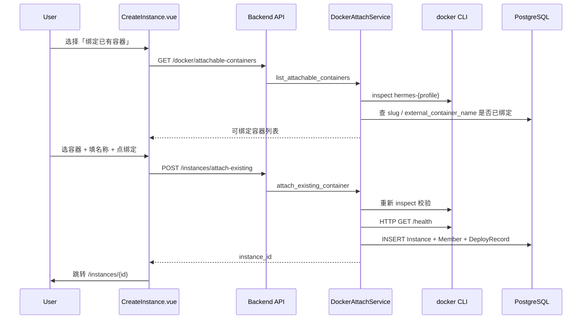

# Docker 容器绑定功能实施计划

## 前端表现变化

### 1. AI 员工创建页 — 创建方式切换

**总结**: 创建页从「只有新建部署」变为「新建部署 / 绑定已有 Docker 容器」二选一，默认仍为新建部署。

**元素级变化**:
- 创建方式单选区域: **新增**，位于页面基本信息区顶部（名称输入框之前），两个选项「新建部署」「绑定已有 Docker 容器」
- 绑定模式可见性: 仅当已选集群为 `compute_provider=docker` 时显示「绑定已有 Docker 容器」选项；K8s 集群时只显示「新建部署」
- 绑定模式表单: **隐藏** 工作引擎选择（固定 `hermes-webui-expert`）、镜像版本、规格预设、存储配置、LLM 配置步骤
- 绑定模式表单: **新增**「扫描容器」按钮、容器列表表格、选中容器高亮
- 绑定模式名称输入: 保留 AI 员工名称输入；slug 由选中容器的 `profile` 自动确定，**隐藏** slug 手动编辑与随机后缀
- 提交按钮: 绑定模式下文案从「部署」变为「绑定」；loading 态使用 `attachingContainer`
- 健康检查警告: 容器 `status=running` 但 `health_status!=healthy` 时，列表行显示警告文案，不阻止绑定

**改动前**（创建页）:
```
┌─ 创建 AI 员工 ─────────────────────┐
│ 名称 [________]                     │
│ 标识 [slug]-[随机后缀]              │
│ 工作引擎 [OpenClaw] [Hermes Expert] │
│ 镜像版本 / 规格 / 存储 ...          │
│              [下一步] [部署]        │
└─────────────────────────────────────┘
```

**改动后**（绑定模式）:
```
┌─ 创建 AI 员工 ─────────────────────┐
│ 创建方式: (○)新建部署 (●)绑定容器   │
│ Docker 集群 [local-docker ▼]        │
│ [扫描容器]                          │
│ ┌ profile │ 容器名 │ 状态 │ 端口 ─┐│
│ │ writer  │hermes-w│running│ 8787 ││
│ └─────────────────────────────────┘│
│ 名称 [写作专家________]             │
│              [绑定]                 │
└─────────────────────────────────────┘
→ 成功后跳转 /instances/{id}（不进部署进度页）
```

### 2. AI 员工详情页 — 删除确认文案

**总结**: 绑定型 AI 员工删除时，提示从「容器将被永久删除」变为「仅移除管理记录，不停止/删除容器」。

**元素级变化**:
- 删除确认弹窗影响列表: 当 `advanced_config.attach_mode=external` 且 `external_lifecycle=false` 时，**替换** Docker 删除影响文案为 PRD 指定提示
- 其余删除流程（按钮、确认/取消）不变

---

## 架构与数据流



---

## 阶段一：后端 Schema 与 Service

### 1.1 新增 Schema

文件: [`nodeskclaw-backend/app/schemas/docker_attach.py`](nodeskclaw-backend/app/schemas/docker_attach.py)

按 PRD 定义:
- `AttachableContainerInfo` — 扫描结果字段
- `AttachExistingInstanceRequest` — 绑定请求体
- `AttachExistingInstanceResponse` — `{ instance_id: str }`

复用已有 slug 校验: [`expert_filesystem.validate_profile_slug`](nodeskclaw-backend/app/services/hermes_expert/expert_filesystem.py) 的 `SLUG_PATTERN`（`^[a-z][a-z0-9-]{1,62}$`）。

### 1.2 新增 Service

文件: [`nodeskclaw-backend/app/services/docker_attach_service.py`](nodeskclaw-backend/app/services/docker_attach_service.py)

**`list_attachable_containers(db, cluster_id, org_id, runtime)`**:
1. 校验 `cluster.compute_provider == "docker"` 且 `status == connected`
2. 校验 `runtime == "hermes-webui-expert"`
3. 遍历 [`DOCKER_DATA_DIR`](nodeskclaw-backend/app/services/docker_constants.py) 一级子目录作为 `profile`
4. 对每个 profile 构造 `container_name = f"hermes-{profile}"`，执行 `docker inspect`（参考 [`DockerComputeProvider.get_status`](nodeskclaw-backend/app/services/runtime/compute/docker_provider.py) 的 subprocess 模式）
5. 容器不存在 → 跳过（不返回 `missing` 行）
6. 解析: `image`、`status`、`health_status`（inspect Health.State）、`host_port`/`container_port`（Ports 映射，默认 8787）、`data_dir`、`compose_path`
7. 查 DB 判断是否 `already_attached`:
   - 同 org 下 `instances.slug == profile` 且未软删
   - 或 `advanced_config.external_container_name == container_name`（JSON 字段解析）
8. 返回列表

**`attach_existing_container(db, user, req, org_id)`**:
1. 权限: 与部署接口一致，要求组织成员（[`portal/deploy.py`](nodeskclaw-backend/app/api/portal/deploy.py) 同等校验）
2. 重新 `docker inspect`，校验容器存在且 `status == running`
3. 校验 `container_name == f"hermes-{profile}"`
4. 校验 slug 未被占用、容器未被绑定（409）
5. HTTP 探测 `http://localhost:{host_port}/health` → `health_status`（失败不阻止，记 `unknown`）
6. 写入 `Instance`（字段按 PRD §8）:
   - `slug = profile`（无随机后缀）
   - `namespace = f"docker-{profile}"`
   - `status = running`
   - `service_type = docker`
   - `ingress_domain = f"localhost:{host_port}"`
   - `image_version` 从 image tag 提取，无 tag 则 `latest`
   - `env_vars`: `DOCKER_HOST_PORT`、`NODESKCLAW_INSTANCE_ID`（创建后回填）、gateway token 按 [`deploy_service.deploy_instance`](nodeskclaw-backend/app/services/deploy_service.py) 惯例生成
   - `advanced_config`: `attach_mode=external`、`external_lifecycle=false`、`external_dir`、`external_container_name`、`compose_path`、`expert`、`webui`
7. 创建 `InstanceMember(role=admin)`
8. 创建 `DeployRecord(action=create, status=success, finished_at=now)` — 不走部署管道
9. 审计: `hooks.emit("operation_audit", action="instance.attach_existing_container", ...)`
10. 返回 `instance_id`

**不改动**: [`deploy_service.deploy_instance`](nodeskclaw-backend/app/services/deploy_service.py)、[`DockerComputeProvider.create_instance`](nodeskclaw-backend/app/services/runtime/compute/docker_provider.py)、Hermes 新建部署流程。

### 1.3 新增 API 路由

文件: [`nodeskclaw-backend/app/api/docker_attach.py`](nodeskclaw-backend/app/api/docker_attach.py)

| 方法 | 路径 | 说明 |
|------|------|------|
| GET | `/docker/attachable-containers` | query: `cluster_id`, `runtime`（默认 `hermes-webui-expert`） |
| POST | `/instances/attach-existing` | body: `AttachExistingInstanceRequest` |

注册到 [`nodeskclaw-backend/app/api/router.py`](nodeskclaw-backend/app/api/router.py) 的 `api_router`（Portal 公共 API 前缀 `/api/v1`）。

错误码约定:
- 404: 容器不存在
- 409: slug 或容器重复绑定
- 400: 容器未 running、集群非 docker、runtime 不支持

---

## 阶段二：删除保护

修改 [`instance_service.finalize_instance_deletion_once`](nodeskclaw-backend/app/services/instance_service.py):

在 `compute_provider != "k8s"` 分支调用 `_destroy_non_k8s_instance` **之前**，解析 `instance.advanced_config`:
- 若 `attach_mode == "external"` 且 `external_lifecycle == false` → **跳过** `destroy_instance`，直接 `_soft_delete_instance_records`

新增辅助函数 `_is_external_attach_instance(instance) -> bool` 集中判断，避免散落魔法字符串。

---

## 阶段三：前端 Portal

### 3.1 创建页

文件: [`nodeskclaw-portal/src/views/CreateInstance.vue`](nodeskclaw-portal/src/views/CreateInstance.vue)

新增状态（按 PRD）:
```ts
const createMode = ref<'deploy' | 'attach'>('deploy')
const attachableContainers = ref<AttachableContainerInfo[]>([])
const selectedAttachContainer = ref<AttachableContainerInfo | null>(null)
const scanningContainers = ref(false)
const attachingContainer = ref(false)
```

关键逻辑:
- `createMode === 'attach'` 时: 固定 `selectedRuntime = 'hermes-webui-expert'`；`watch(selectedCluster)` 在非 docker 集群时自动回退 `createMode = 'deploy'`
- 扫描: `GET /docker/attachable-containers?cluster_id=...&runtime=hermes-webui-expert`
- 列表: 隐藏 `status=missing`；`already_attached=true` 行禁用选择；`status!=running` 禁用绑定
- 提交: `POST /instances/attach-existing`，成功后 `router.push(/instances/${instanceId})`
- `handleDeploy` 与现有步骤 **完全不变**

### 3.2 详情页删除文案

文件: [`nodeskclaw-portal/src/views/InstanceDetail.vue`](nodeskclaw-portal/src/views/InstanceDetail.vue)

- 从 instance API 响应解析 `advanced_config`（`InstanceDetail` schema 已含此字段）
- 新增 computed `isExternalAttach`
- 删除弹窗: `isExternalAttach` 时显示 `instanceDetail.deleteImpactExternalAttach` 替代 `deleteImpactDocker`

### 3.3 i18n

文件: [`nodeskclaw-portal/src/i18n/locales/zh-CN.ts`](nodeskclaw-portal/src/i18n/locales/zh-CN.ts)、[`en-US.ts`](nodeskclaw-portal/src/i18n/locales/en-US.ts)

新增 `createInstance.*` 词条（创建方式、扫描、绑定、容器列表列头、健康警告）和 `instanceDetail.deleteImpactExternalAttach`。

---

## 阶段四：测试

文件: [`nodeskclaw-backend/tests/test_docker_attach.py`](nodeskclaw-backend/tests/test_docker_attach.py)

覆盖 PRD §16 用例（mock `docker inspect` subprocess 与 HTTP health probe）:
1. 正常绑定 → Instance/Member/DeployRecord 写入正确
2. 重复绑定 → 409
3. 容器不存在 → 404
4. 容器 exited → 400
5. 删除保护 → `finalize_instance_deletion_once` 不调用 `destroy_instance`

---

## 阶段五：文档

按 docs-first 规则，实现前/同步更新:
- `ee/docs/后端架构设计.md` — 新增两个 API 端点与 `advanced_config.attach_mode` 语义
- [`nodeskclaw-backend/README.md`](nodeskclaw-backend/README.md) — 补充 `DOCKER_DATA_DIR` 与容器绑定说明

---

## 风险与约束

| 项 | 说明 |
|----|------|
| 同机 Docker | PRD 明确不处理跨服务器绑定；扫描依赖后端进程可访问的 `docker` CLI |
| Windows 开发机 | `DOCKER_DATA_DIR` 需显式配置（与现有 Docker 部署一致） |
| slug 冲突 | 绑定模式 slug=profile，与 Hermes 新建部署共用 org 级唯一约束 |
| Admin 前端 | PRD 范围仅 Portal，Admin 创建页不改 |
| Gene/Skill | 本功能不修改 Agent 行为，无需更新 Gene 模板 |

---

## 实施顺序

1. `docker_attach.py` schema
2. `docker_attach_service.py` service
3. `docker_attach.py` route + router 注册
4. `instance_service.py` 删除保护
5. `CreateInstance.vue` + i18n
6. `InstanceDetail.vue` 删除文案
7. 单元测试 + 手工验收（PRD §18 十条）
