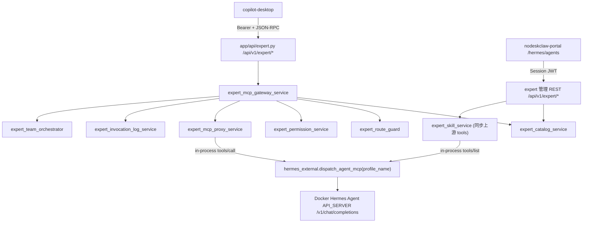

# Expert MCP Gateway v6.0 实施方案

## 范围

- **本轮实施**：PRD Phase 1（数据模型 + Expert Gateway）、Phase 2（portal `/hermes/agents` 改造）、Phase 4（专家日志）、Phase 5（专家团队建表 + 同步编排）。
- **不在本轮**：Phase 3 copilot-desktop 适配 —— 该仓库不在当前工作区。后端会按 PRD 契约把接口备好，Desktop 由其仓库另行接入。
- **设计决策**（已确认）：Desktop 调用 `/api/v1/expert/*` 用 `resolve_mcp_user` Bearer 鉴权（同时支持用户 JWT 与 `ndsk_mcp_` Client Token）；转发用**进程内**调用现有 `dispatch_agent_mcp`，不走 HTTP 回环；不引入 HermesTask / 队列 / worker。

## 命名与 PRD 字面差异（按项目约定）

- 表名用复数：`experts` / `expert_skills` / `expert_teams` / `expert_team_members` / `expert_invocation_logs`（PRD 写单数）。
- 权限码统一 `expert_skill:invoke`（PRD §9.3.2 出现的 `expert:invoke` 视为同义，最终用 `expert_skill:invoke`）。
- 唯一约束一律用 Partial Unique Index（`postgresql_where=text("deleted_at IS NULL")`），不用 `UniqueConstraint`。
- `agent_alias`/`agent_profile` 在底层对应 `HermesAgentInstance.profile_name`；`expert.hermes_agent_id` 外键指向 `hermes_agent_instances.id`。

## 架构



## 前端表现变化

### 1. Portal `/hermes/agents` 列表页 - Agent 卡片新增专家能力

**总结**：每张 Hermes Agent 卡片从「仅展示运行时/MCP Gateway/Router 状态」-> 新增「专家状态徽标 + 设置为专家/查看能力/发布/下架/查看日志」一组专家操作。

**元素级变化**：
- 专家状态 Badge：**新增**，取值「未设置为专家 / 已设置未发布 / 已发布到 Desktop / 已禁用」，置于卡片状态 Badge 行尾。
- 「设置为专家」按钮：**新增**，未设置专家时显示；点击打开专家配置 Sheet（抽屉）。
- 「编辑专家 / 查看能力 / 发布 / 下架 / 查看日志」按钮：**新增**，已设置专家后替换「设置为专家」按钮组。
- 公开能力 / 可调用能力计数（如 `3/8`、`2/8`）与「最近调用 N 次/24h」：**新增**，已发布专家时在卡片展示。
- 专家配置 Sheet（右侧抽屉，复用 `ui/sheet`）：**新增**，字段 expert_slug、display_name、description、category、tags、avatar、sort_order、published、enabled。
- 专家能力配置 Sheet/Dialog：**新增**，含「同步 Tools」按钮、能力表格（上游 Tool Name / 能力名 / 描述 / Public 开关 / Call Enabled 开关 / 风险等级下拉 / 审批模式下拉 / stale 标记）。
- 交互规则：`public=false` 时 `call_enabled` 开关 -> 自动置 false 且禁用（PRD §7.3 非法态纠正）。

**改动前**（卡片操作行）：
```
┌─ 生文专家 (common-writer) ─────────────────────────┐
│ [Docker:running][API:online][Agent:ok][Runtime:ready]│
│ [MCP Gateway: env_synced] [Router: synced]           │
│ [授权网关][同步Router][打开WebUI][刷新][测试][诊断][详情]│
└──────────────────────────────────────────────────────┘
```

**改动后**：
```
┌─ 生文专家 (common-writer) ─────────────────────────┐
│ [Docker:running][API:online][Agent:ok][Runtime:ready]│
│ [MCP Gateway: env_synced] [Router: synced]           │
│ [专家: 已发布到 Desktop]  公开 3/8  可调用 2/8        │
│ 最近调用 20 次 / 24h                                  │
│ [编辑专家][查看能力][下架][查看日志]                  │
│ [授权网关][同步Router][打开WebUI][刷新][测试][诊断][详情]│
└──────────────────────────────────────────────────────┘
```

### 2. Portal 新增 `/hermes/expert-logs` 专家调用日志页

**总结**：**新增**一个专家调用日志页面（列表 + 详情抽屉）。

**元素级变化**：
- 路由 `/hermes/expert-logs`（name `HermesExpertLogs`）+ 左侧导航项「专家日志」：**新增**。
- 日志列表表格（复用 `ui/table`）：列含 调用时间、专家名称、专家 slug、能力名称、调用用户、状态徽标、耗时、请求摘要、错误码、操作（查看详情）。
- 过滤区：expert_slug、skill_name、status、user_id、时间范围、关键词。
- 详情抽屉（`ui/sheet`）：基础信息 / 请求信息（脱敏 payload、prompt 预览、client 信息）/ 响应信息（preview、content_type、size）/ 错误信息（code、message、detail）。

```
┌─ 专家调用日志 ─────────────────────────────────────┐
│ [专家▾][能力▾][状态▾][用户▾][时间范围] [搜索]        │
│ 时间        专家      能力        用户   状态  耗时  │
│ 06-27 13:01 生文专家  报告写作    张三   完成  3.2s ▸│
│ 06-27 12:40 生文专家  推广文案    李四   失败  -    ▸│
└────────────────────────────────────────────────────┘
点击 ▸ -> 右侧详情抽屉
```

### 3. Portal 专家团队（Phase 5，最小可用）

**总结**：**新增**专家团队管理入口（建队、加成员、发布），团队作为一个特殊 slug 在 Desktop 可调用。本轮提供后端编排 + 基础管理页，UI 可后续增强。

---

## 后端实施

### 数据模型（`app/models/`，均继承 `BaseModel`，软删除 + UUID）

- `expert.py` -> `Expert`：`org_id`、`hermes_agent_id`(FK `hermes_agent_instances.id`)、`expert_slug`、`display_name`、`description`、`category`、`tags`(JSONB)、`avatar`、`published`、`enabled`、`sort_order`、`created_by`、`updated_by`。Partial Unique Index `(org_id, expert_slug)`。
- `expert_skill.py` -> `ExpertSkill`：`org_id`、`expert_id`、`skill_name`、`upstream_tool_name`、`display_name`、`description`、`input_schema`(JSONB)、`public`、`call_enabled`、`risk_level`、`approval_mode`、`output_formats`(JSONB)、`sort_order`、`stale`、`last_synced_at`、`created_by`、`updated_by`。Partial Unique Index `(org_id, expert_id, skill_name)` 与 `(org_id, expert_id, upstream_tool_name)`。
- `expert_team.py` -> `ExpertTeam`：`org_id`、`team_slug`、`display_name`、`description`、`category`、`tags`、`avatar`、`orchestration_mode`、`published`、`enabled`、`sort_order`。Partial Unique Index `(org_id, team_slug)`。
- `expert_team_member.py` -> `ExpertTeamMember`：`org_id`、`team_id`、`expert_id`、`role`、`responsibility`、`order_no`、`required`。
- `expert_invocation_log.py` -> `ExpertInvocationLog`：PRD §7.6 全字段（`expert_id`/`expert_skill_id`/`expert_team_id`/`expert_slug`/`skill_name`/`upstream_tool_name`/`agent_alias`/`request_id`/`jsonrpc_id`/`status`/`request_payload`/`request_prompt_preview`/`response_preview`/`response_content_type`/`response_size_bytes`/`error_code`/`error_message`/`error_detail`/`started_at`/`finished_at`/`duration_ms`/`client_source`/`client_version`/`client_device_id`）+ Phase 5 `parent_invocation_id`、`invocation_type`(默认 `expert_skill`)。索引 `(org_id, created_at)`、`(org_id, expert_id)`、`(org_id, status)`。
- `HermesAgentInstance` 增列 `expert_enabled BOOLEAN DEFAULT false`（仅后台卡片快速显示用）。
- 全部模型在 `app/models/__init__.py` 追加 import（autogenerate 必需）。

### Alembic 迁移

- `cd nodeskclaw-backend && uv run alembic revision --autogenerate -m "v6.0 expert mcp gateway 数据模型"`，Review：确认 Partial Unique Index 的 `postgresql_where`、`expert_enabled` 增列、JSONB 默认值。禁止手写 revision ID。

### Schema（`app/schemas/`）

- `expert.py`、`expert_skill.py`、`expert_mcp.py`（JSON-RPC 请求/响应 + tool descriptor + annotations）、`expert_log.py`。复用现有 `ApiResponse` 包装与错误契约。

### 服务层（`app/services/expert_gateway/`）

- `expert_catalog_service.py`：expert/team CRUD、发布前置校验（PRD §8.6：Agent running / api online / callable / runtime ready / mcp env / router / slug / display_name / 至少一个 public skill）、published catalog 查询（过滤 `published & enabled & 权限`）。
- `expert_skill_service.py`：`sync_tools(expert)` -> 进程内 `dispatch_agent_mcp(method=tools/list)` 解析 `result.tools[]` -> upsert ExpertSkill（新建则建候选；存在则更新 `input_schema`/`description` + `last_synced_at`，不覆盖用户设的 `display_name`/`public`/`call_enabled`；上游已移除标 `stale=true`）；public/call_enabled 写入时强制 `public=false -> call_enabled=false`。
- `expert_health_service.py`：聚合 published experts + runtime readiness，30s 缓存（`EXPERT_HEALTH_CACHE_TTL`）。
- `expert_mcp_gateway_service.py`：`dispatch_root`（`/expert/mcp`：initialize、tools/list 专家清单）与 `dispatch_expert`（`/expert/mcp/{slug}`：initialize、tools/list 能力、tools/call）。专家清单/能力 descriptor 带 `annotations`（PRD §9.2.2 / §9.3.1）。
- `expert_mcp_proxy_service.py`：构造上游 body `{method: tools/call, params:{name: upstream_tool_name, arguments}}` -> 进程内 `dispatch_agent_mcp(db, org_id, user_id, profile_name, body)` -> 解析 `result`/`error`，超时与上游错误映射为 `EXPERT_UPSTREAM_TIMEOUT`/`EXPERT_UPSTREAM_MCP_ERROR`。
- `expert_invocation_log_service.py`：create(started)/complete/fail/reject；脱敏 `request_payload`（去 token/Authorization）、`request_prompt_preview`、`response_preview`（截断 4000 字符）；后台查询（过滤 + 分页）。
- `expert_permission_service.py`：封装 `expert:view` / `expert_skill:view` / `expert_skill:invoke`（Desktop）与 `expert:manage` / `expert_skill:manage` / `expert_log:view` / `expert_log:detail`（后台），底层走 `PermissionChecker.has_permission`。
- `expert_route_guard.py`：拦截 route override 字段（PRD §10 黑名单），命中返回 `EXPERT_ROUTE_OVERRIDE_FORBIDDEN`（JSON-RPC -32602）并写 rejected 日志。
- `expert_team_service.py` / `expert_team_orchestrator.py`：team CRUD + 顺序调用成员 expert skill -> 收集结果 -> 合并 Markdown -> 写父子 invocation log（Phase 5）。
- `errors.py`：EXPERT_* 错误码（PRD §13）+ JSON-RPC code 映射 + `mcp_success`/`mcp_error_v2` 风格构造器（参考 `mcp_skill_gateway/errors.py`）。

### 权限码（`app/services/hermes_skill/permission_checker.py`）

- 在 `_ROLE_PERMISSIONS` 各角色追加：admin/operator 增 `expert:manage`、`expert_skill:manage`、`expert_log:view`、`expert_log:detail`、`expert:view`、`expert_skill:view`、`expert_skill:invoke`；member/workspace_manager 增 `expert:view`、`expert_skill:view`、`expert_skill:invoke`；viewer 增 `expert:view`、`expert_skill:view`。

### API（`app/api/expert.py`）+ 路由注册

- Desktop MCP（Bearer，`resolve_mcp_user`）：`GET /expert/health`、`POST /expert/mcp`、`POST /expert/mcp/{expert_slug}`。
- 后台管理（Session，`require_org_member` + 权限）：experts CRUD（设置为专家/编辑/发布/下架）、`POST /expert/experts/{id}/sync-tools`、expert_skills 列表/更新（public/call_enabled/risk/approval）、`GET /expert/admin/invocation-logs`、`GET /expert/admin/invocation-logs/{id}`、teams CRUD/members。
- 在 `app/api/router.py` 的 `api_router` 追加 `include_router(expert_router, prefix="/expert", tags=["Expert MCP Gateway"])`（portal 与 Desktop 同走 `/api/v1`）。

### 配置（`app/core/config.py`）

- `EXPERT_HEALTH_CACHE_TTL=30`、`EXPERT_RESPONSE_PREVIEW_MAX_CHARS=4000`、`EXPERT_UPSTREAM_TIMEOUT_SECONDS`（与 Hermes 调用对齐）。

---

## 前端实施（`nodeskclaw-portal`）

- `src/api/hermes/expertCatalog.ts`：新增管理 API 封装（experts CRUD、sync-tools、expert_skills 更新、invocation-logs 查询、teams）。
- `src/views/hermes/AgentsView.vue`：卡片新增专家状态 Badge + 专家操作按钮组；新增 `ExpertConfigSheet.vue`（设置/编辑专家）、`ExpertSkillsSheet.vue`（能力同步 + public/call_enabled/risk/approval 配置，复用 `ui/sheet`、`ui/table`、`ui/switch`、`ui/dropdown-menu`）。
- `src/views/hermes/ExpertLogsView.vue` + `src/router/hermes.ts` 新增 `/hermes/expert-logs`（name `HermesExpertLogs`）+ `App.vue` 导航项。日志列表参考 `SkillsView`，详情抽屉参考 `TasksView` 的 Sheet 用法。
- 专家团队基础管理页（Phase 5，最小：建队/加成员/发布）。
- i18n：`src/i18n/locales/{zh-CN,en-US}.ts` 新增 `hermes.expertCatalog.*`、`hermes.expertLogs.*`、`hermes.expertTeam.*`、`nav.hermesExpertLogs`；错误码经 `errors.expert.*` 走 `resolveApiErrorMessage`。禁止硬编码中文 UI 文案。

---

## 文档回写（实现 + review 通过后）

- `docs/backend/index.md`：能力域新增「Expert MCP Gateway」段、API 前缀表增 `/api/v1/expert`、权限模型表增 `expert:*` 码、核心数据实体表增 expert 系列模型。
- 新增 `docs/backend/expert_mcp_gateway.md` 模块专文（接口契约、数据模型、转发链路、日志、团队编排）。
- 评估 Gene/Skill 同步规则：本次不改 Agent 运行时行为，预计无需更新 Gene 模板（在 PR 说明确认）。

---

## 风险与注意

- 进程内 `dispatch_agent_mcp` 的 tools/call 内部仍走 `HermesSkillAuthorizationService.can_invoke`（按 org 角色）；Desktop 服务账号用户需具备相应角色，否则上游 403。MVP 阶段在 `expert_permission_service` 层先做 `expert_skill:invoke` 校验，并在文档标注上游 authz 依赖。
- `dispatch_agent_mcp` tools/call 要求 `arguments.prompt` 非空；Expert Gateway 透传 Desktop 的 `arguments`（已过 route guard），需保证 `prompt` 存在，否则返回 `EXPERT_INVALID_JSONRPC`/参数错误。
- 上游 `tools/call` 实际是 `chat/completions` 注入 requested_skill（非真实 skill 端点），返回为文本；Expert Gateway 按 MCP `content[]` 文本结果封装，符合 PRD §9.3.2 返回形态。