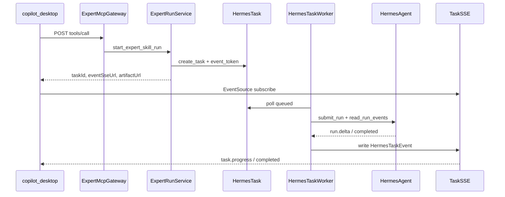

# Expert MCP Gateway v6.2 实时任务流改造

## 现状与目标

**现状（v6.1）**：[`expert_mcp_gateway_service.py`](nodeskclaw-backend/app/services/expert_gateway/expert_mcp_gateway_service.py) 中 `_call_expert_skill` / `_call_team_upstream_skill` 同步调用 [`ExpertMcpProxyService.call_upstream_tool`](nodeskclaw-backend/app/services/expert_gateway/expert_mcp_proxy_service.py)，阻塞等待完整报告，**不创建 HermesTask**（见 [`docs/backend/expert_mcp_gateway.md`](docs/backend/expert_mcp_gateway.md)）。

**目标（v6.2）**：默认 `event_stream` 模式，`tools/call` 立即返回 `taskId` / `eventSseUrl` / `artifactUrl`；Worker 通过 `route_type=expert_agent_event_stream` 复用 [`HermesAgentAdapter`](nodeskclaw-backend/app/services/hermes_skill/hermes_agent_adapter.py) 的 `/v1/runs` + `/events`；Desktop/Portal 统一订阅 `GET /api/v1/hermes/tasks/{task_id}/events`。



**范围**：NoDeskClaw 后端 + Portal 专家日志页；copilot-desktop TaskWindow 对接仅提供契约说明（另仓实现）。

---

### 前端表现变化

#### 1. copilot-desktop 任务窗口（契约层，本仓不实现）

**总结**：专家调用从「等完整报告返回」变为「立即打开任务窗口 + 实时 SSE 流」

**元素级变化**:
- 调用专家后：立即弹出 TaskWindow（任务窗口），不再长时间 loading 等待 MCP 同步响应
- TaskHeader（任务头）：显示 `queued` → `running` → `completed/failed` 状态流转
- EventTimeline（事件时间线）：实时追加 `task.started`、`task.progress`（阶段消息/进度条）、`task.artifact.ready`、`task.completed`
- ArtifactPanel（成果面板）：任务完成后从 `artifactUrl` 拉取 Markdown/PDF 等成果
- TaskActions（任务操作）：支持取消（`POST .../cancel`）、重试（`POST .../retry`）

**改动前**:
```
用户输入 prompt → 调用 MCP → [长时间等待] → 一次性显示完整报告
```

**改动后**:
```
用户输入 prompt → 调用 MCP → 立即进入 TaskWindow
  → SSE 实时追加阶段事件
  → 右侧成果逐步出现
  → 完成后展示最终报告
```

#### 2. Portal 专家日志页 - 任务关联信息

**总结**：管理员调用日志从「仅显示同步调用结果」变为「可追踪关联 HermesTask 与流式模式」

**元素级变化**:
- 日志列表 [`ExpertLogsView.vue`](nodeskclaw-portal/src/views/hermes/ExpertLogsView.vue)：新增 **任务编号**（`taskNo`）、**流式模式**（`streamMode`）列；`started` 态且 `stream_mode=event_stream` 时显示 `running` 样式
- 日志详情抽屉：新增 **任务 ID**、**事件 URL**、**成果 URL**、**Hermes Run ID** 字段；`taskId` 存在时提供跳转 Hermes 任务详情的链接（若 Portal 已有 Hermes 任务页则链过去，否则展示可复制文本）
- 状态列：`event_stream` 模式下任务进行中显示 running，完成后由 Worker 回写 completed/failed

**改动后示意**:
```
┌─ 专家调用日志 ─────────────────────────────────────┐
│ 专家 slug │ skill │ 状态 │ 流式模式 │ 任务编号      │
│ call-prep │ ...   │ running │ event_stream │ TASK-xxx │
└────────────────────────────────────────────────────┘
详情抽屉新增: taskId / eventUrl / artifactUrl / hermesRunId
```

---

## 技术实施步骤

### 步骤 1：数据模型与 Schema 迁移

**文件**：
- [`expert_invocation_log.py`](nodeskclaw-backend/app/models/expert_invocation_log.py)
- [`expert_log.py`](nodeskclaw-backend/app/schemas/expert_log.py)
- Alembic autogenerate 新迁移

**新增字段**（PRD §9.1）：
`task_id`, `task_no`, `event_url`, `artifact_url`, `hermes_run_id`, `stream_mode`

**索引**：`ix_expert_invocation_logs_task_id`, `ix_expert_invocation_logs_stream_mode`

**ExpertInvocationLogService 扩展**：
- `attach_task(log, task, stream_mode="event_stream")` — 创建任务后写入关联
- `sync_from_task(task_id)` — Worker 完成/失败时按 `task_id` 回写 `status` / `response_preview` / `hermes_run_id` / `duration_ms`
- `mark_started_async(log, ...)` — `orchestration_mode` 改为 `agent_event_stream`

---

### 步骤 2：新增 ExpertRunService

**新文件**：[`expert_run_service.py`](nodeskclaw-backend/app/services/expert_gateway/expert_run_service.py)

**参考模板**：[`mcp_tool_mapper.py`](nodeskclaw-backend/app/services/hermes_skill/mcp_tool_mapper.py) 的 `_build_async_event_response` + [`task_service.create_task`](nodeskclaw-backend/app/services/hermes_skill/task_service.py)

**核心方法**：
```python
class ExpertRunService:
    async def start_expert_skill_run(org_id, user_id, expert, skill, arguments, *, headers, log) -> StartExpertRunResult
    async def start_team_skill_run(org_id, user_id, team, skill, arguments, *, headers, log) -> StartExpertRunResult
    async def _build_expert_route_snapshot(...)  # route_type=expert_agent_event_stream
    async def _build_team_route_snapshot(...)    # catalog_kind=expert_team + team 元数据
    async def _build_mcp_accepted_result(...)    # structuredContent 契约（PRD §7.1.4）
```

**HermesTask 写入规范**（PRD §7.2.4 / §9.2 / §9.3）：
- `client_context.source = "expert_mcp_gateway"`，含 `catalog_kind/slug/expert_id/skill_id/desktop.conversation_id`
- `routing_metadata.route_snapshot.route_type = "expert_agent_event_stream"`
- `routing_metadata.output_policy.artifact_mode = "pull_only"`
- `timeout_seconds` 取自 `EXPERT_UPSTREAM_TIMEOUT_SECONDS`（默认 900，可按 PRD 建议 1800 评估）
- `TaskEventTokenService.create_token` 生成 SSE token；新增配置项 `EXPERT_EVENT_TOKEN_TTL_SECONDS`（默认 7200，PRD §7.2.5 要求 2 小时）

**错误码**（[`errors.py`](nodeskclaw-backend/app/services/expert_gateway/errors.py) 新增）：`EXPERT_EVENT_STREAM_CREATE_FAILED`, `EXPERT_TASK_CREATE_FAILED`, `EXPERT_EVENT_TOKEN_CREATE_FAILED`

---

### 步骤 3：改造 ExpertMcpGatewayService

**文件**：[`expert_mcp_gateway_service.py`](nodeskclaw-backend/app/services/expert_gateway/expert_mcp_gateway_service.py)

**Run Mode 解析**（PRD §7.1.3）：
```python
def _resolve_run_mode(headers) -> "event_stream" | "sync_legacy"
# header: X-NoDeskClaw-Expert-Run-Mode，默认 event_stream
```

**改造点**：
| 方法 | event_stream（默认） | sync_legacy（调试） |
|------|---------------------|---------------------|
| `_call_expert_skill` | `ExpertRunService.start_expert_skill_run` → accepted MCP result | 保留现有 `ExpertMcpProxyService` 同步路径 |
| `_call_team_upstream_skill` | `ExpertRunService.start_team_skill_run` | 保留现有同步路径 |
| `gateway_sequential` | **本版保持 sync_legacy 行为**（PRD §6.2 MVP：完整多成员流留后续）；tools/list 标注 `memberStream: true` 预留 | 不变 |

**MCP 返回结构**（PRD §7.1.4）：
- `structuredContent`: `invocationId`, `taskId`, `taskNo`, `status`, `kind`, `slug`, `skillName`, `orchestrationMode`, `eventUrl`, `eventToken`, `eventSseUrl`, `artifactUrl`, `artifactMode`, `streaming`, `stream`
- Gateway 版本号更新为 `v6.2`

**tools/list streaming 标注**（PRD §7.5 / §11.6）：
- `_list_catalog_tools()` 与 `build_tool_descriptor`（[`expert_skill_service.py`](nodeskclaw-backend/app/services/expert_gateway/expert_skill_service.py)、[`expert_team_skill_service.py`](nodeskclaw-backend/app/services/expert_gateway/expert_team_skill_service.py)）增加：
  `callMode: "async_sse"`, `streaming: true`, `eventStream: {transport, authMode, resume}`, `artifactMode: "pull_only"`, `resultMode: "task_result"`
- 团队 upstream_skill 额外：`memberStream: true`

---

### 步骤 4：HermesTaskWorker 新增 expert_agent_event_stream 分支

**文件**：[`hermes_task_worker.py`](nodeskclaw-backend/app/services/hermes_skill/hermes_task_worker.py)

在 `_execute_task` 的 `hermes_api_server` 判断后增加：
```python
if route_snapshot.get("route_type") == "expert_agent_event_stream":
    await self._execute_expert_agent_event_stream_task(...)
    return
```

**实现策略**（避免重复代码）：
- 抽取现有默认 Agent 分支（L188–361）为 `_execute_agent_run_stream(task, route_snapshot, *, metadata_enricher)` 
- `_execute_expert_agent_event_stream_task` 调用共享逻辑，并在写入 event 时注入 expert/team 元数据

**执行流程**（PRD §7.3.4）：
1. 校验 `hermes_agent_instance_id` / runtime ready
2. `HERMES_RUN_STARTED` → `adapter.submit_run` → 保存 `hermes_run_id` → `HERMES_RUN_CREATED`
3. `adapter.read_run_events` → `HermesRunStateResolver.convert_hermes_event` → 注入 metadata → `event_service.write_event`
4. `TaskEventPublisher.publish_progress` 驱动 SSE
5. 完成时：`_scan_artifacts` + `publish_completed_with_result`
6. **回写 ExpertInvocationLog**：`ExpertInvocationLogService.sync_from_task(task.id)`

**Expert 元数据注入**（PRD §7.4.2）：在 delta/progress payload 附加：
```json
{
  "expert": {"kind", "slug", "display_name"},
  "team": {"slug", "displayName", "memberSlug", "memberRole"},
  "agent": {"agent_profile", "hermes_agent_instance_id"}
}
```
团队 upstream MVP：team 元数据来自 `route_snapshot`，member 信息暂由 upstream Agent skill 输出或 route_snapshot 预留字段。

---

### 步骤 5：Task SSE Formatter 增强

**文件**：[`task_event_stream_formatter.py`](nodeskclaw-backend/app/services/hermes_skill/task_event_stream_formatter.py)

**改动**：
- `build_sse_data` 在 `task.progress` 时透传 `expert` / `team` / `agent` / `tool_call` / `delta`
- `task.artifact.ready` 透传完整 artifact 信息
- `task.completed` 确保 `artifacts` / `artifact_mode` / `kb_status`
- 支持 `mcp_event` 为 `team.member.*` 的事件名（PRD §7.4.3；MVP 阶段 team 事件也可走 `task.progress` + `team.step`）

---

### 步骤 6：取消 / 重试（复用现有 API）

现有 [`HermesAgentAdapter.cancel_run`](nodeskclaw-backend/app/services/hermes_skill/hermes_agent_adapter.py) 与 Task cancel/retry API 已支持 `hermes_run_id`。

**验证点**：
- Expert 任务的 cancel 能取消远端 run 并输出 terminal SSE
- Retry 保留 `routing_metadata.route_snapshot`，新 task 生成新 token；ExpertRunService 或 retry handler 写入 `parent_invocation_id`

---

### 步骤 7：Portal 专家日志页

**文件**：
- [`ExpertLogsView.vue`](nodeskclaw-portal/src/views/hermes/ExpertLogsView.vue)
- [`expertCatalog.ts`](nodeskclaw-portal/src/api/hermes/expertCatalog.ts) 类型定义
- i18n：[`zh-CN.ts`](nodeskclaw-portal/src/i18n/locales/zh-CN.ts) / `en-US.ts`

**改动**：
- 列表增加 `taskNo`、`streamMode` 列
- 详情抽屉展示 `taskId`、`eventUrl`、`artifactUrl`、`hermesRunId`
- 新增 i18n 词条（如 `hermes.expertLogs.taskNo`、`streamMode`、`eventUrl`）

---

### 步骤 8：测试

**新增测试文件**（PRD §11.7）：
- `tests/expert_gateway/test_expert_run_service.py` — task 创建、routing_metadata、token 生成
- `tests/expert_gateway/test_expert_mcp_event_stream.py` — tools/call 默认 async、sync_legacy 兼容、route override 拒绝
- `tests/hermes_skill/test_task_sse_expert_events.py` — SSE payload 含 expert/team 元数据

**参考现有测试**：
- [`test_mcp_tool_mapper_async_event.py`](nodeskclaw-backend/tests/hermes_skill/test_mcp_tool_mapper_async_event.py)
- [`test_task_events_sse.py`](nodeskclaw-backend/tests/hermes_skill/test_task_events_sse.py)

**关键断言**：
1. `tools/call` 响应 < 1s（不阻塞 upstream）
2. `routing_metadata.route_snapshot.route_type == "expert_agent_event_stream"`
3. Worker 分支正确处理并写入 progress 事件
4. invocation log 关联 `task_id`
5. `sync_legacy` header 仍走同步路径

---

### 步骤 9：文档更新

- 更新 [`docs/backend/expert_mcp_gateway.md`](docs/backend/expert_mcp_gateway.md)：v6.2 异步模式、HermesTask 集成、header 兼容、调用链图
- 在文档中补充 copilot-desktop 对接契约（PRD §8 / §10 摘要）

---

## 不在本版范围

- copilot-desktop TaskWindow UI 实现（另仓）
- `gateway_sequential` 完整多成员异步编排（仅保留 sync + member event 结构预留）
- Gene/Skill 模板同步（v6.1 已评估无需变更）
- `openclaw-channel-nodeskclaw` 无改动

---

## 推荐 commit 拆分

1. `feat(expert): ExpertInvocationLog 增加 task 关联字段与迁移`
2. `feat(expert): 新增 ExpertRunService 异步任务启动`
3. `feat(expert): ExpertMcpGateway 默认 event_stream 模式`
4. `feat(hermes): Worker 支持 expert_agent_event_stream 路由`
5. `feat(hermes): Task SSE 透传 expert/team 元数据`
6. `feat(portal): 专家日志页展示 task 关联信息`
7. `test(expert): v6.2 event stream 单元测试`
8. `docs(backend): 更新 Expert MCP Gateway v6.2 说明`
