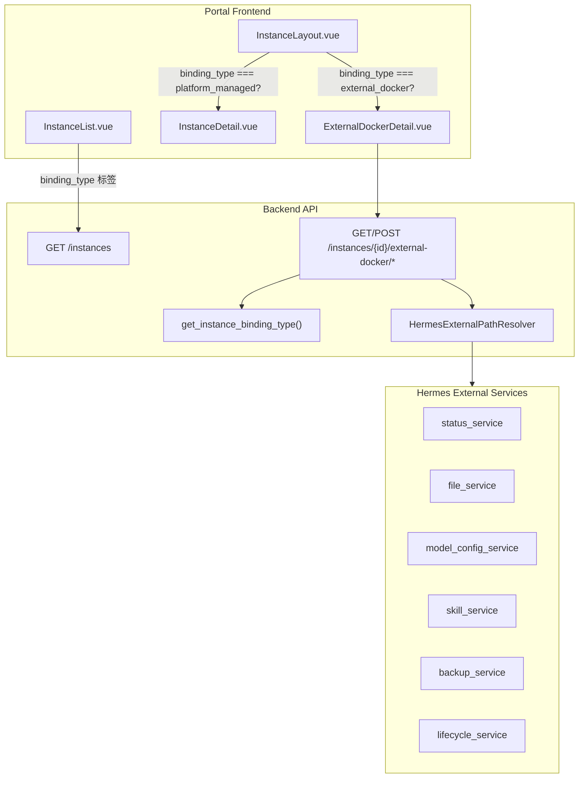

# External Docker Hermes 实例管理模块实施 Plan

## 前端表现变化

### 1. Portal AI 员工列表页 - 绑定类型标签

**总结**: AI 员工列表每行新增"绑定类型"标签，区分"平台部署"和"外部绑定"

**元素级变化**:
- 绑定类型标签: **新增**，紧跟在 compute_provider 标签后面，外部绑定显示蓝色标签"外部绑定"，平台部署显示灰色标签"平台部署"
- 列表状态文字: 无变化，沿用当前 DB 状态

**改动后**:
```
┌─ AI 员工列表 ──────────────────────────────────────────┐
│ 黄晓琪    Docker  [外部绑定]   运行中    2026-06-13    │
│ 专业生文  Docker  [平台部署]   不可访问  2026-06-12    │
│ 测试助手  K8s     [平台部署]   运行中    2026-06-10    │
└────────────────────────────────────────────────────────┘
```

### 2. Portal 实例详情页 - 分流入口

**总结**: 点击外部绑定实例进入新建的 ExternalDockerDetail 页面，平台部署实例保持原 InstanceDetail 页面不变

**元素级变化**:
- InstanceLayout.vue 侧边导航: binding_type === "external_docker" 时切换为外部 Docker 专用导航项
- 详情页主内容区: 外部绑定实例渲染 ExternalDockerDetail 组件，包含概览/运行状态/模型配置/技能/文件/备份/WebUI 访问模块
- 删除按钮: 外部绑定实例显示"解除绑定"（非"删除"），确认弹窗文案说明不会删除容器和目录
- 原 InstanceDetail: 平台部署实例不受影响，保持原状

**改动后**（外部绑定实例详情页）:
```
┌─ 黄晓琪  [运行中] ────────────────────────────────────┐
│ ┌──────────┐ ┌─────────────────────────────────────┐  │
│ │ 概览    ◀│ │ 绑定类型: 外部绑定                  │  │
│ │ 运行状态  │ │ 容器名: hermes-huang-xiaoqi         │  │
│ │ 模型配置  │ │ Profile: huang-xiaoqi               │  │
│ │ 技能      │ │ WebUI: http://host:8789             │  │
│ │ 文件      │ │ Hermes 数据目录: /data/.../hermes    │  │
│ │ 备份      │ │ 管理模式: managed_compose            │  │
│ │          │ │                                     │  │
│ │          │ │ [打开 WebUI] [复制密码] [同步状态]  │  │
│ │          │ │ [启动] [停止] [重启] [解除绑定]     │  │
│ └──────────┘ └─────────────────────────────────────┘  │
└────────────────────────────────────────────────────────┘
```

### 3. WebUI 密码脱敏

**总结**: 外部绑定实例的 WebUI 密码默认脱敏显示，提供"复制密码"按钮

**元素级变化**:
- 密码字段: 默认显示 `************`，不明文展示
- 复制密码按钮: **新增**，点击后调用 POST API 获取密码并复制到剪贴板
- 复制成功反馈: 按钮短暂变为 Check 图标

---

## 技术架构

### 数据流



### 新增文件清单

**后端** (`nodeskclaw-backend/app/services/hermes_external/`):

- `__init__.py`
- `binding_type.py` -- `get_instance_binding_type()` 推导函数 + label 映射
- `path_resolver.py` -- `HermesExternalPathResolver` + `HermesExternalPaths` dataclass
- `status_service.py` -- Docker inspect + WebUI health + display_status 计算
- `file_service.py` -- workspace/system scope 文件列表 + 路径安全校验
- `model_config_service.py` -- config.yaml YAML 解析 + 敏感字段脱敏
- `skill_service.py` -- skills/skill-inbox/tools/plugins 目录扫描
- `backup_service.py` -- 列出 + 创建 tar.gz 备份
- `lifecycle_service.py` -- start/stop/restart/detach/logs，禁止 down -v 和 rm

**后端 API 路由** (`nodeskclaw-backend/app/api/external_docker.py`):

- 新建一个 router，挂载到 `/api/v1/instances/{id}/external-docker/`
- 端点: status, webui-access, webui-password, model-config, skills, files, backups, start, stop, restart, detach, logs

**后端 Schema** (`nodeskclaw-backend/app/schemas/external_docker.py`):

- 各接口的 Request/Response Pydantic model

**前端** (`nodeskclaw-portal/src/`):

- `views/ExternalDockerDetail.vue` -- 外部绑定实例详情主组件
- `views/external-docker/ExternalDockerOverview.vue` -- 概览 + 生命周期操作
- `views/external-docker/ExternalDockerStatus.vue` -- 运行状态模块
- `views/external-docker/ExternalDockerModelConfig.vue` -- 模型配置模块
- `views/external-docker/ExternalDockerSkills.vue` -- 技能模块
- `views/external-docker/ExternalDockerFiles.vue` -- 文件模块
- `views/external-docker/ExternalDockerBackups.vue` -- 备份模块

---

## 实施步骤

### Phase 1: 后端核心骨架

#### BE-1: binding_type 推导 + API 字段注入

**文件**: 新建 `nodeskclaw-backend/app/services/hermes_external/__init__.py` 和 `binding_type.py`

`binding_type.py` 实现 `get_instance_binding_type(instance)` 函数，逻辑与 PRD 第 6.2 节一致：
- `advanced_config.attach_mode == "external"` -> `external_docker`
- `lifecycle_mode in ["managed_compose", "managed_container"] && paths.host_data_dir` -> `external_docker`
- `external_container_name` 存在 -> `external_docker`
- 默认 -> `platform_managed`

**文件**: 修改 [nodeskclaw-backend/app/schemas/instance.py](nodeskclaw-backend/app/schemas/instance.py)

`InstanceInfo` 新增两个字段:
- `binding_type: str = "platform_managed"`
- `binding_type_label: str = ""`

在 `_fill_display_status` validator 中调用 `get_instance_binding_type` 填充。

**文件**: 修改 [nodeskclaw-backend/app/services/instance_service.py](nodeskclaw-backend/app/services/instance_service.py)

`list_instances()` 和 `get_instance_detail()` 中，在构建 `InstanceInfo` 后注入 `binding_type` 和 `binding_type_label`。

#### BE-2: HermesExternalPathResolver

**文件**: 新建 `nodeskclaw-backend/app/services/hermes_external/path_resolver.py`

实现 `HermesExternalPaths` dataclass（PRD 第 9.3 节）和 `HermesExternalPathResolver.resolve(instance)` 方法。

路径解析优先级（PRD 第 9.4 节）:
1. `advanced_config.paths.host_data_dir` 存在 -> 直接使用
2. fallback: `DOCKER_DATA_DIR / profile / "data" / "hermes"`

Docker Env 文件优先级:
1. `paths.docker_env_file`
2. `paths.env_file`
3. `host_data_dir.parent.parent / ".env"`

目录创建策略按 PRD 第 9.5 节执行。

#### BE-3: External Docker API 路由

**文件**: 新建 `nodeskclaw-backend/app/api/external_docker.py`

**文件**: 新建 `nodeskclaw-backend/app/schemas/external_docker.py`

新增 `external_docker_router`，前缀 `/instances/{instance_id}/external-docker`，所有端点先通过 `get_instance_binding_type` 校验 binding_type 是否为 `external_docker`。

**文件**: 修改 [nodeskclaw-backend/app/api/router.py](nodeskclaw-backend/app/api/router.py)

注册新路由到 `api_router` 和 `admin_router`。

### Phase 2: 后端 6 个子服务

#### BE-4: status_service

实现 `get_status(instance)`:
- `docker inspect --format '{{json .State}}' <container_name>`
- WebUI health probe（`/health` 端点）
- 状态规则映射（PRD 第 13.3 节）

#### BE-5: file_service

实现 `list_files(instance, scope, path)`:
- scope=workspace -> `host_data_dir/workspace`（自动创建）
- scope=system -> `host_data_dir`
- 路径安全校验：`resolved_path.resolve()` 必须在 `allowed_root` 内

#### BE-6: model_config_service

实现 `get_model_config(instance)`:
- 读取 `host_data_dir/config.yaml`
- PyYAML 解析
- 敏感字段脱敏（api_key, secret_key, access_token, authorization, password, token）

#### BE-7: skill_service

实现 `list_skills(instance)`:
- 扫描 skills、skill-inbox（兼容 skills-inbox）、tools、plugins 目录
- 返回各目录下的子目录/文件列表

#### BE-8: backup_service

实现 `list_backups(instance)` 和 `create_backup(instance)`:
- 备份目标: `host_data_dir`
- 输出目录: `host_data_dir/backups`
- 排除 backups 自身和上级 .env
- 格式: `backup-{timestamp}.tar.gz`

#### BE-9: lifecycle_service

实现 start/stop/restart/detach/logs:
- 优先 `docker compose -f <compose_file> --env-file <env_file> -p <project>` 系列命令
- fallback: `docker start/stop/restart <container_name>`
- detach: 仅调用 `instance_service.finalize_instance_deletion_once`（已有逻辑会跳过 Docker 销毁，只软删除 DB 记录）
- logs: `docker logs --tail N <container_name>`
- **严禁**: down -v, rm, 删除文件

### Phase 3: 前端改造（Portal）

#### FE-1: InstanceInfo 接口 + 列表标签

**文件**: 修改 [nodeskclaw-portal/src/views/InstanceList.vue](nodeskclaw-portal/src/views/InstanceList.vue)

- `InstanceInfo` 接口新增 `binding_type?: string`
- 列表行中 compute_provider 标签后新增 binding_type 标签
- i18n 词条: `bindingType.external_docker` = "外部绑定", `bindingType.platform_managed` = "平台部署"

#### FE-2: InstanceLayout 分流 + 导航切换

**文件**: 修改 [nodeskclaw-portal/src/views/InstanceLayout.vue](nodeskclaw-portal/src/views/InstanceLayout.vue)

- `InstanceBasic` 接口新增 `binding_type?: string`, `advanced_config?: string`
- provide `instanceBindingType` 给子组件
- `navItems` 根据 binding_type 区分：external_docker 使用独立导航（概览、运行状态、模型配置、技能、文件、备份）
- 路由层面复用现有 path，但在 `InstanceLayout` 的子路由中通过 `binding_type` 动态切换组件

**文件**: 修改 [nodeskclaw-portal/src/router/index.ts](nodeskclaw-portal/src/router/index.ts)

新增路由条目（作为 `/instances/:id` 的 children）:
- `external-docker` -> ExternalDockerDetail.vue（概览 + 生命周期）
- `external-docker/status` -> ExternalDockerStatus.vue
- `external-docker/model-config` -> ExternalDockerModelConfig.vue
- `external-docker/skills` -> ExternalDockerSkills.vue
- `external-docker/files` -> ExternalDockerFiles.vue
- `external-docker/backups` -> ExternalDockerBackups.vue

或者更简洁的方案：不新增路由，InstanceLayout 检测到 external_docker 时直接在原有路由名下渲染对应的 external-docker 组件（通过 `v-if` 切换）。

#### FE-3: ExternalDockerDetail 概览组件

**文件**: 新建 `nodeskclaw-portal/src/views/ExternalDockerDetail.vue`

展示 PRD 第 12 节内容（容器名、Profile、WebUI 地址、Docker Env 文件、Hermes 数据目录等）。

包含生命周期操作按钮（启动/停止/重启/解除绑定）和 WebUI 访问（密码脱敏 + 复制密码）。

#### FE-4: 各子模块组件

- `ExternalDockerStatus.vue` -- 调用 `/external-docker/status` 展示 Docker 状态 + WebUI Health
- `ExternalDockerModelConfig.vue` -- 调用 `/external-docker/model-config` 展示模型配置
- `ExternalDockerSkills.vue` -- 调用 `/external-docker/skills` 展示技能列表
- `ExternalDockerFiles.vue` -- 调用 `/external-docker/files` 展示文件，支持 scope 切换
- `ExternalDockerBackups.vue` -- 调用 `/external-docker/backups` 展示备份列表 + 创建备份

#### FE-5: 删除 -> 解除绑定

**文件**: 修改 ExternalDockerDetail.vue 中的删除按钮

- 文案: "解除绑定"
- 确认弹窗: "该操作只会解除 NoDeskClaw 与该 Docker 实例的绑定，不会删除 Docker 容器，也不会删除宿主机目录。"
- 调用: `POST /instances/{id}/external-docker/detach`

### Phase 4: i18n 词条

**文件**: Portal i18n locale 文件（zh-CN, en）

新增所有 external-docker 相关词条，包括:
- 绑定类型标签
- 各模块标题和字段名
- 错误提示
- 确认弹窗文案

---

## 关键约束（来自 PRD 第 28 节）

- 不重构原平台部署实例流程
- 不修改 docker-compose.yml / create-instance.sh / up-instance.sh
- 不删除原 InstanceFileService / DockerComputeProvider
- 外部绑定实例新增服务必须是增量实现
- 外部绑定实例所有路径必须从 `advanced_config.paths.host_data_dir` 派生
- 外部绑定实例删除时**只解除绑定**，不删除容器和目录

## 已有代码可复用

- `_is_external_attach_instance()` in [instance_service.py](nodeskclaw-backend/app/services/instance_service.py) -- 已有 attach_mode 判断逻辑，新 `get_instance_binding_type` 可参考
- `ExpertInstanceService.detach()` in [expert_instance_service.py](nodeskclaw-backend/app/services/hermes_expert/expert_instance_service.py) -- 已有 detach 逻辑，lifecycle_service 可直接调用
- `DockerInstanceLayout` / `layout_to_advanced_config()` in [docker_instance_layout_resolver.py](nodeskclaw-backend/app/services/docker_instance_layout_resolver.py) -- PathResolver 可参考其路径解析模式
- `DockerComputeProvider.get_status()` / `get_logs()` in [docker_provider.py](nodeskclaw-backend/app/services/runtime/compute/docker_provider.py) -- status_service 可参考 docker inspect 调用
- InstanceDetail.vue 中的 `isExternalAttach` computed -- 前端已有类似判断逻辑
