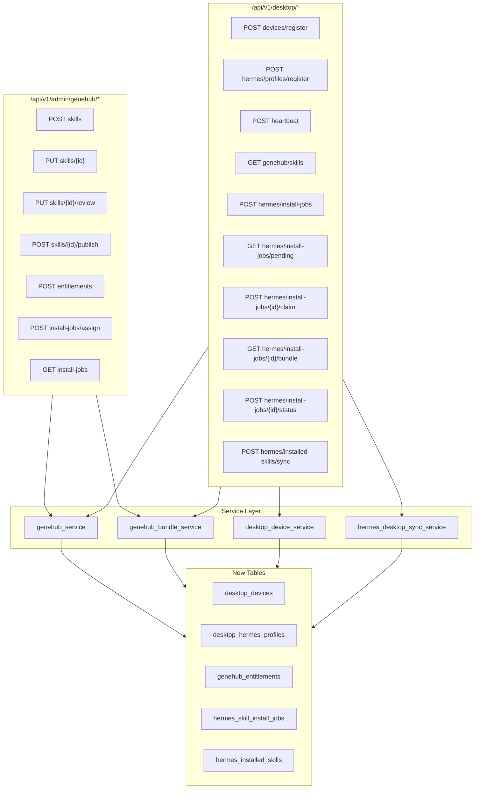

# GeneHub Hermes Skill Registry 实施计划

版本号：`team_v3.2_genehub-hermes-skill-registry`

## 前端表现变化

本次改动无前端表现变化。全部改动为 nodeskclaw-backend 服务端 API，Desktop UI 由 copilot-desktop 独立 PRD 负责。

---

## 架构总览



---

## Task 1：新增数据模型 + Alembic Migration

### 新建 5 个 Model 文件

遵循现有 `BaseModel` 模式（UUID pk + `created_at` / `updated_at` / `deleted_at` + `soft_delete()`），所有唯一约束使用 Partial Unique Index。

| 文件 | 类名 | 表名 | 关键约束 |
|------|------|------|----------|
| `app/models/desktop_device.py` | `DesktopDevice` | `desktop_devices` | `uq_desktop_devices_user_fingerprint_active(user_id, device_fingerprint)` |
| `app/models/desktop_hermes_profile.py` | `DesktopHermesProfile` | `desktop_hermes_profiles` | `uq_desktop_hermes_profiles_device_profile_active(desktop_device_id, profile_name)` |
| `app/models/genehub_entitlement.py` | `GeneHubEntitlement` | `genehub_entitlements` | 组合索引 `(gene_id)` + `(org_id, target_type, target_id)` |
| `app/models/hermes_skill_install_job.py` | `HermesSkillInstallJob` | `hermes_skill_install_jobs` | 组合索引 `(org_id, user_id, status)` + `(profile_id, status)` + `(gene_id)` |
| `app/models/hermes_installed_skill.py` | `HermesInstalledSkill` | `hermes_installed_skills` | `uq_hermes_installed_skills_profile_slug_active(profile_id, gene_slug)` |

每个文件内定义对应的状态 Enum（`DeviceStatus`、`ProfileStatus`、`EntitlementTargetType`、`EntitlementPermission`、`InstallJobType`、`InstallJobStatus`、`InstallMode`、`InstalledSkillStatus`），与 PRD 第 6 章对齐。

### 注册模型

修改 [app/models/__init__.py](nodeskclaw-backend/app/models/__init__.py)，新增 5 条 import。

### 生成 Alembic 迁移

```bash
cd nodeskclaw-backend
uv run alembic revision --autogenerate -m "add genehub desktop tables"
```

Review 生成的迁移文件，确认：
- Partial Unique Index 的 `postgresql_where` 正确
- 普通索引的 `WHERE deleted_at IS NULL` 条件正确
- FK 引用 `organizations.id`、`users.id`、`genes.id`、`desktop_devices.id`、`desktop_hermes_profiles.id` 均正确

---

## Task 2：新增 Schemas

新建 [app/schemas/genehub.py](nodeskclaw-backend/app/schemas/genehub.py)，定义以下 Pydantic v2 schemas：

**Admin 请求/响应：**
- `AdminGeneHubSkillCreate` — name, slug, description, short_description, category, tags, version, skill_content, scripts, compatibility, visibility, is_published；slug/skill_name 加 `field_validator` 正则校验
- `AdminGeneHubSkillUpdate` — 与 Create 同字段但全部 Optional
- `AdminGeneHubSkillReview` — action(`approve`/`reject`), reason
- `GeneHubEntitlementTarget` — target_type, target_id, permissions, profile_scope
- `GeneHubEntitlementGrant` — gene_id, targets: list[GeneHubEntitlementTarget]
- `AdminInstallJobAssign` — gene_slug, version, target_type, target_ids, profile_name, job_type
- `AdminInstallJobInfo` — 响应 schema（id, user_id, status, gene_slug 等），`from_attributes=True`

**Desktop 请求/响应：**
- `DesktopDeviceRegister` — device_name, device_fingerprint, os_type, os_version, app_version
- `DesktopHermesProfileRegister` — desktop_device_id, profile_name, hermes_home, runtime_version, gateway_url, gateway_port, capabilities
- `DesktopHeartbeat` — desktop_device_id, profiles
- `DesktopSelfServiceInstallJobCreate` — profile_id, gene_slug, version, job_type
- `DesktopInstallJobStatusUpdate` — status, install_path, gene_version, message, error_code, error_message, client_report
- `DesktopInstalledSkillItem` — skill_name, gene_slug, gene_version, install_path, status
- `DesktopInstalledSkillSync` — profile_id, skills: list[DesktopInstalledSkillItem]
- `DesktopSkillInfo` — gene_id, slug, name, description, version, category, tags, permissions, installed_status, update_available
- `DesktopPendingJobInfo` — job_id, job_type, gene_slug, gene_version, skill_name, status

---

## Task 3：新增环境变量

修改 [app/core/config.py](nodeskclaw-backend/app/core/config.py) 的 `Settings` 类，在 Skill Registries 区块下新增：

```python
GENEHUB_BUNDLE_SIGNING_SECRET: str = ""
GENEHUB_BUNDLE_SIGNATURE_ENABLED: bool = True
GENEHUB_DESKTOP_SYNC_ENABLED: bool = True
```

启动时校验：如果 `GENEHUB_BUNDLE_SIGNATURE_ENABLED=True` 但 `GENEHUB_BUNDLE_SIGNING_SECRET` 为空，`logger.warning` 警告。

---

## Task 4：实现 genehub_bundle_service.py

新建 [app/services/genehub_bundle_service.py](nodeskclaw-backend/app/services/genehub_bundle_service.py)。

**核心函数：**

| 函数 | 职责 |
|------|------|
| `validate_manifest(manifest: dict)` | 校验 schema_version、slug、version、name、compatibility、skill.name/content、install.hermes_desktop 必填 |
| `validate_skill_name(name: str)` | 正则 `^[A-Za-z0-9][A-Za-z0-9._-]{0,127}$`，禁止 `.`/`..`/`.hidden`/含 `/\` |
| `build_manifest_from_skill(data: AdminGeneHubSkillCreate) -> dict` | 从创建请求构建 GeneHub Manifest v1 JSON |
| `build_hermes_desktop_bundle(db, *, gene_id, version=None) -> dict` | 从 Gene 记录构建 Bundle JSON |
| `sanitize_bundle_paths(files: dict) -> dict` | 校验 files 中无绝对路径、无 `../` |
| `_calculate_sha256(data: str) -> str` | SHA256 哈希 |
| `_sign_bundle(bundle_json: str, secret: str) -> dict` | HMAC-SHA256 签名 |

Bundle 格式严格遵循 PRD 第 8 章 `genehub.bundle.v1` schema。

---

## Task 5：实现 genehub_service.py

新建 [app/services/genehub_service.py](nodeskclaw-backend/app/services/genehub_service.py)。

**核心函数：**

| 函数 | 职责 |
|------|------|
| `create_skill(db, *, org_id, user_id, data)` | 创建 Gene 记录（source=manual, source_registry=local, review_status=pending_admin, is_published=false），调用 bundle service 构建 manifest |
| `update_skill(db, *, gene_id, org_id, data)` | 更新 Gene；已 published 的重置为 is_published=false, review_status=pending_admin |
| `review_skill(db, *, gene_id, org_id, user_id, action, reason)` | approve/reject，记审计 |
| `publish_skill(db, *, gene_id, org_id, user_id)` | 要求 review_status=approved，设 is_published=true，生成 manifest_hash |
| `grant_entitlements(db, *, org_id, gene_id, targets, created_by)` | 批量创建 GeneHubEntitlement，幂等（同 gene+target+permission 不重复创建） |
| `resolve_user_gene_permissions(db, *, org_id, user_id, gene_id, profile_name=None) -> set[str]` | 按 user > role > department > organization 优先级解析权限并集 |
| `list_desktop_visible_skills(db, *, org_id, user_id, profile_id, keyword, category, tag)` | 查询用户有权可见的 Desktop Hermes Skill，联查 installed_status |
| `create_assign_jobs(db, *, org_id, gene_slug, version, target_type, target_ids, profile_name, job_type, requested_by)` | 管理员批量分配安装任务 |
| `create_self_service_job(db, *, org_id, user_id, profile_id, gene_slug, version, job_type)` | 用户自助创建安装任务 |

**权限校验链路**（PRD 第 9 章）：

```
Gene 可见 = (published + approved + 同 org 或 public + hermes desktop compatible + 有 view/install entitlement)
Gene 可安装 = (可见 + install entitlement + device 属于用户 + profile 属于 device)
```

---

## Task 6：实现 hermes_desktop_sync_service.py + desktop_device_service.py

PRD 建议的 `desktop_device_service.py` 和 `hermes_desktop_sync_service.py` 合并为两个文件。

### desktop_device_service.py

新建 [app/services/desktop_device_service.py](nodeskclaw-backend/app/services/desktop_device_service.py)：

| 函数 | 职责 |
|------|------|
| `register_device(db, *, org_id, user_id, data)` | 幂等注册（同 user+fingerprint upsert） |
| `register_profile(db, *, org_id, user_id, data)` | 幂等注册（同 device+profile_name upsert），注册后尝试绑定 user-level pending jobs |
| `heartbeat(db, *, user_id, device_id, profiles)` | 更新 device/profile last_seen_at，返回服务端配置 |

### hermes_desktop_sync_service.py

新建 [app/services/hermes_desktop_sync_service.py](nodeskclaw-backend/app/services/hermes_desktop_sync_service.py)：

| 函数 | 职责 |
|------|------|
| `get_pending_jobs(db, *, org_id, user_id, profile_id)` | 返回 pending jobs，自动绑定 user-level 无 profile 的 job |
| `claim_job(db, *, user_id, job_id)` | pending -> claimed，更新 claimed_at，幂等 |
| `update_job_status(db, *, user_id, job_id, data)` | 状态流转（downloading/validating/installing/installed/failed）；installed 时写 hermes_installed_skills；uninstall 完成时标记 uninstalled |
| `sync_installed_skills(db, *, org_id, user_id, profile_id, skills)` | Desktop 启动时校准，unmanaged skill 标记但不强制卸载 |

---

## Task 7：新增 Admin API Router

新建 [app/api/admin_genehub.py](nodeskclaw-backend/app/api/admin_genehub.py)，定义 `router = APIRouter(prefix="/genehub")`：

| 方法 | 路径 | 依赖 | 调用 |
|------|------|------|------|
| POST | `/skills` | `require_org_role("admin")` + `get_current_org` | `genehub_service.create_skill` |
| PUT | `/skills/{gene_id}` | 同上 | `genehub_service.update_skill` |
| PUT | `/skills/{gene_id}/review` | 同上 | `genehub_service.review_skill` |
| POST | `/skills/{gene_id}/publish` | 同上 | `genehub_service.publish_skill` |
| POST | `/entitlements` | 同上 | `genehub_service.grant_entitlements` |
| POST | `/install-jobs/assign` | 同上 | `genehub_service.create_assign_jobs` |
| GET | `/install-jobs` | 同上 | 列表查询 |

在 [app/api/router.py](nodeskclaw-backend/app/api/router.py) 的 `admin_router` 部分注册：
```python
admin_router.include_router(
    admin_genehub_router,
    dependencies=[Depends(require_org_role("admin"))],
    tags=["GeneHub Admin"],
)
```

完整路径为 `/api/v1/admin/genehub/*`。

---

## Task 8：新增 Desktop API Router

新建 [app/api/desktop_genehub.py](nodeskclaw-backend/app/api/desktop_genehub.py)，定义 `router = APIRouter(prefix="/desktop")`：

| 方法 | 路径 | 依赖 | 调用 |
|------|------|------|------|
| POST | `/devices/register` | `get_current_user` + `get_current_org` | `desktop_device_service.register_device` |
| POST | `/hermes/profiles/register` | 同上 | `desktop_device_service.register_profile` |
| POST | `/heartbeat` | 同上 | `desktop_device_service.heartbeat` |
| GET | `/genehub/skills` | 同上 | `genehub_service.list_desktop_visible_skills` |
| POST | `/hermes/install-jobs` | 同上 | `genehub_service.create_self_service_job` |
| GET | `/hermes/install-jobs/pending` | 同上 | `hermes_desktop_sync_service.get_pending_jobs` |
| POST | `/hermes/install-jobs/{job_id}/claim` | 同上 | `hermes_desktop_sync_service.claim_job` |
| GET | `/hermes/install-jobs/{job_id}/bundle` | 同上 | `genehub_bundle_service.build_hermes_desktop_bundle` |
| POST | `/hermes/install-jobs/{job_id}/status` | 同上 | `hermes_desktop_sync_service.update_job_status` |
| POST | `/hermes/installed-skills/sync` | 同上 | `hermes_desktop_sync_service.sync_installed_skills` |

Desktop API 使用 `get_current_user`（JWT Bearer）+ `get_current_org`（组织上下文），**不使用** `require_org_role`（普通员工即可调用）。每个端点内部校验 device/profile/job 归属当前用户。

在 [app/api/router.py](nodeskclaw-backend/app/api/router.py) 的 `api_router` 部分注册：
```python
api_router.include_router(desktop_genehub_router, tags=["Desktop GeneHub"])
```

完整路径为 `/api/v1/desktop/*`。

---

## Task 9：错误码定义

在 service 层使用现有异常类，新增 `message_key` 与 PRD 第 13 章错误码对齐：

| 错误码 | 异常 | message_key |
|--------|------|-------------|
| GENEHUB_SKILL_NOT_FOUND | `NotFoundError` | `errors.genehub.skill_not_found` |
| GENEHUB_SKILL_NOT_PUBLISHED | `BadRequestError` | `errors.genehub.skill_not_published` |
| GENEHUB_SKILL_NOT_APPROVED | `BadRequestError` | `errors.genehub.skill_not_approved` |
| GENEHUB_PERMISSION_DENIED | `ForbiddenError` | `errors.genehub.permission_denied` |
| GENEHUB_INVALID_MANIFEST | `BadRequestError` | `errors.genehub.invalid_manifest` |
| GENEHUB_INVALID_SKILL_NAME | `BadRequestError` | `errors.genehub.invalid_skill_name` |
| GENEHUB_INVALID_BUNDLE_PATH | `BadRequestError` | `errors.genehub.invalid_bundle_path` |
| GENEHUB_BUNDLE_SIGN_FAILED | `BadRequestError` | `errors.genehub.bundle_sign_failed` |
| DESKTOP_DEVICE_NOT_FOUND | `NotFoundError` | `errors.desktop.device_not_found` |
| DESKTOP_PROFILE_NOT_FOUND | `NotFoundError` | `errors.desktop.profile_not_found` |
| DESKTOP_PROFILE_FORBIDDEN | `ForbiddenError` | `errors.desktop.profile_forbidden` |
| INSTALL_JOB_NOT_FOUND | `NotFoundError` | `errors.genehub.install_job_not_found` |
| INSTALL_JOB_ALREADY_RUNNING | `ConflictError` | `errors.genehub.install_job_already_running` |
| INSTALL_JOB_INVALID_STATUS | `BadRequestError` | `errors.genehub.install_job_invalid_status` |
| INSTALL_JOB_PERMISSION_DENIED | `ForbiddenError` | `errors.genehub.install_job_permission_denied` |

---

## Task 10：测试

新建测试文件于 `nodeskclaw-backend/tests/`：

| 文件 | 覆盖范围 |
|------|----------|
| `test_genehub_admin_create_publish.py` | 创建 Skill、审核、发布、更新后重置状态 |
| `test_genehub_entitlements.py` | 授权 organization/user、幂等、权限解析 |
| `test_desktop_device_profile_register.py` | 设备注册幂等、Profile 注册幂等、heartbeat |
| `test_desktop_skill_visibility.py` | 有权用户可见、无权用户不可见、非 hermes-desktop 不返回 |
| `test_desktop_install_job_flow.py` | 自助 job 创建 -> pending -> claim -> download bundle -> installed |
| `test_genehub_bundle_security.py` | 非法 skill_name 拒绝、非法 bundle path 拒绝、签名校验 |

测试模式：复用 `conftest.py` 的 `client` fixture + `setup_db` autouse fixture。覆盖 `get_current_user` 依赖注入测试用户。

---

## Task 11：文档更新

- 更新 [nodeskclaw-backend/README.md](nodeskclaw-backend/README.md)：新增 GeneHub 相关环境变量说明
- 更新 [wiki/nodeskclaw-backend.md](wiki/nodeskclaw-backend.md)：新增 GeneHub API 章节

---

## 兼容性保障

- **不修改**现有 `genes` 表结构，只新增引用
- **不修改**现有 `/api/v1/genes` 市场 API
- **不修改**现有 `/api/v1/instances/{id}/genes/install` 安装 API
- **不修改**现有 `HermesGeneInstallAdapter` / `RegistryAggregator`
- **不修改**现有 `hermes_skill/` 模块

---

## 执行顺序

严格按 PRD 第 18 章要求：Model + Migration -> Schemas -> Config -> Bundle Service -> GeneHub Service -> Desktop Sync Service -> Admin Router -> Desktop Router -> 接入主 Router -> 测试 -> 文档。

每完成一个 Task 立即提交 commit。
