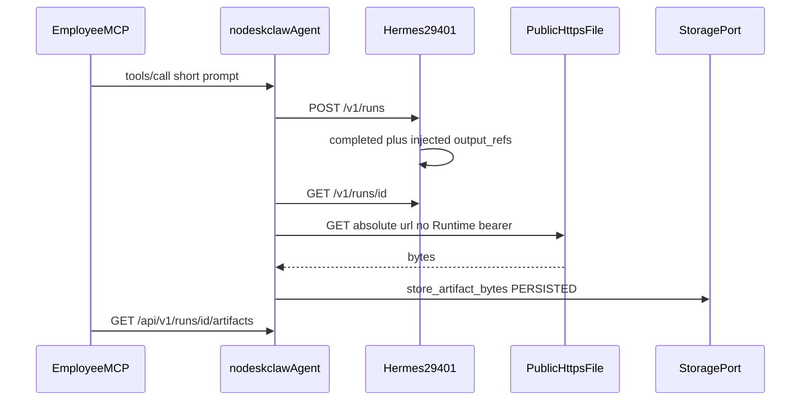

# Live Spike：Hermes 终态注入公网 output_refs

`commit_policy: post_review`。本 spike **不改 git、不改 hermes-image、不扩 RM-20、不加 `/v1/runs/{id}/files`**。只在 `192.168.102.247` 的 Docker Hermes 容器里做可撤回注入，证明方案 B 的 Agent 半边。

操作面已确认：**Docker 宿主 `192.168.102.247`，API Server 宿主端口 29401**。执行时用 `docker ps` 按 `0.0.0.0:29401->` 定位容器，禁止盲猜容器名。

## 前端表现变化

本次改动无前端代码变化。

若 spike 成功：员工已有 Run 产物列表会从「通常只有 `result.txt`」变成「多一条由 `output_refs` ingest 的文件」（名称如 `spike-output-ref.txt`），下载仍走现有 `GET /api/v1/runs/{id}/artifacts/{id}/download`，不新增按钮/Tab/弹窗。

若失败：UI 与现在相同。

## 为什么必须重启容器

Hermes 已把 [`gateway/platforms/api_server.py`](https://github.com/NousResearch/hermes-agent/blob/v2026.8.31/gateway/platforms/api_server.py) 载入进程。只改磁盘上的 `.py` **不会**改变正在跑的 `GET /v1/runs/{id}`。`_set_run_status` 在 `status=completed` 时目前只写 `output` / `usage` / `last_event`，没有 `output_refs`。

因此流程是：备份文件 → 打补丁 → **重启容器** → 验证 → **恢复原文件** → 再重启。`docker restart` 会保留可写层，不恢复文件就撤不掉。

临时代理（把宿主 29401 指到注入层）作为备选：仅当「改 site-packages + 重启」不可行时使用。默认走容器内补丁，避免改 Docker port 映射。



## 注入形状（冻结）

completed 的 status JSON 增加：

```json
"output_refs": [
  {
    "name": "spike-output-ref.txt",
    "content_type": "text/plain",
    "url": "<preflight通过的公网https绝对URL>",
    "required": true
  }
]
```

`url` 必须公网 `https://`。禁止 `192.168/10/172`：[`nodeskclaw-agent/app/services/hermes_engine.py`](nodeskclaw-agent/app/services/hermes_engine.py) 的 `_output_url_access` 会把非 gateway 私网判 `blocked`。公网拉取会去掉 Runtime Bearer。

预选 URL（执行前必须从 **Agent 进程所在主机** `curl -I` 得到 200，否则换源）：`https://www.rfc-editor.org/rfc/rfc1149.txt`。若公司代理拦外网，先修 Agent 出网再注入，禁止改用内网 URL 冒充公网。

注入窗口内 **所有** Native completed run 都会带同一条 ref。窗口尽量短；不要跑双公司画像长任务。

## 执行步骤

1. **只读定位**（宿主 `192.168.102.247`）
   - `docker ps --format "{{.ID}} {{.Names}} {{.Ports}}"` 找到 `29401->8642`（或实际内部 `API_SERVER_PORT`）的容器
   - `docker exec <id> python -c "import gateway.platforms.api_server as m; print(m.__file__)"` 得到 `api_server.py` 路径
   - 从 Agent 主机对预选 URL 做 `curl -I`；失败则停止

2. **备份 + 补丁 + 重启**
   - `docker cp` 把原 `api_server.py` 拷到宿主 `api_server.py.spike-bak`
   - 在 `_set_run_status` 里：当 `status == "completed"` 且尚未有 `output_refs` 时写入上面的数组
   - `docker restart <id>`（API Server 会短中断）
   - 确认 `GET /health` 恢复；用任意旧 run 或新 run 的 GET status 看到 `output_refs`（新 completed 才有）

3. **最短员工 Run**
   - 走现有 Backend `user_jwt` `tools/call`，工具仍用 live 已绑定的 Runtime Skill
   - prompt 必须短（例如只要求回复一句话），**禁止**再跑「两家公司报告」
   - 等到 Native `completed` 后立刻核对：
     - Hermes `GET :29401/v1/runs/{runtime_run_id}` 含 `output_refs[0].url`
     - 员工 `GET /api/v1/runs/{run_id}/artifacts` 出现 `spike-output-ref.txt`（或 `_safe_output_name` 后的 basename）
     - 该条目可 download，且 **不是** 27 字节 `"hermes native run completed"` 的 `result.txt`
     - SSE 有 `artifact.persisted`，payload **没有** `download_url`

4. **撤回**
   - 把 `.spike-bak` `docker cp` 回原路径
   - 再 `docker restart <id>`
   - 新 completed run 的 GET status **不再**含 `output_refs`
   - 备份文件留在宿主，不进 git

5. **判据（三选一，决定下一 Plan）**
   - ingest + 下载成功：方案 B 的 Agent 半边成立 → 再开实现 Plan（插件上传 + `_set_run_status` merge，仍不加 `/files`）
   - status 有 `output_refs` 但无产物 / 日志 `blocked`：出网或 SSRF → 先修 Agent 到公网的连通，或将来给文件服务器 origin allowlist
   - Native 已 completed 但没走到 persist：过早终态或 Adapter 没把 GET body 交给 `_persist_declared_outputs` → 实现 Plan 必须含终态门禁

## 明确不做

- 不 `git commit` / 不改 [`.cursor/plans/rm-20_skill-run-v160-rich-runtime-events-and-artifacts.plan.md`](.cursor/plans/rm-20_skill-run-v160-rich-runtime-events-and-artifacts.plan.md)
- 不给 API Server 加 files 路由
- 不扫 `/data/hermes/workspace`
- 不把公网 URL 投影给员工 SSE
- 不在回复或 evidence 里写 `API_SERVER_KEY` / JWT
- 不 `docker rm`、不改生产 compose 持久配置（除非代理备选且你另行确认）

## 风险

- 重启 Hermes 会使进行中 Native run 中断；注入前确认没有重要 in-flight 任务
- 可写层补丁在「只 restart 不恢复文件」时会残留；撤回清单必须执行
- Agent 主机若不能访问公网 HTTPS，spike 会得到假阴性
