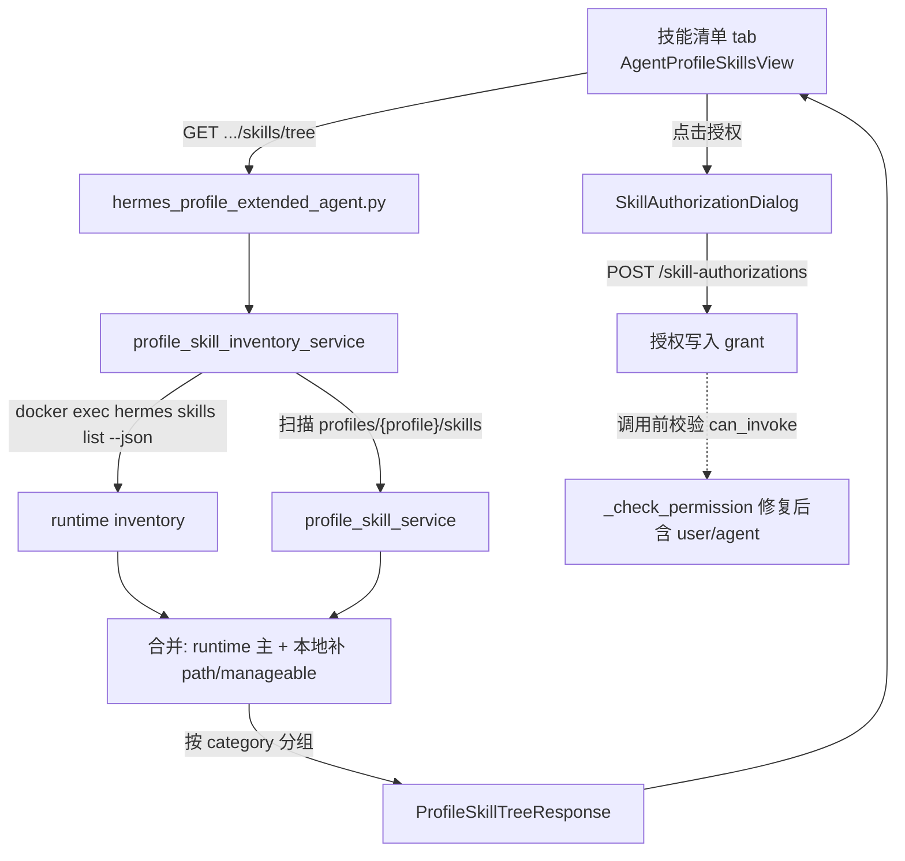

# Hermes Agent Detail Skill 管理优化（team_v5.1）

按 PRD `docs_prd/team_v5.1_Hermes-Detail-Skill.md` 实施。后端从「目录扫描」升级为「runtime inventory + 本地目录补充」双数据源，前端在技能清单 tab 增加完整 skill tree 与快捷授权入口，并修复 user/agent 授权校验缺失。

## 关键决策（已与用户确认）

- runtime skills 解析：**JSON 优先**（`hermes -p {profile} skills list --json`），失败回退表格解析，再失败回退本地目录扫描。
- 授权 grant：**暂不加 scope 字段**，按全局 `skill_id` 授权（不动数据模型，无 Alembic 迁移）。

## 数据流



---

## 前端表现变化

### 1. Agent Detail「技能清单」tab — 新增完整技能树视图

**总结**: 技能清单从「只列 profile 本地目录扫描出的技能（表格）」改为「顶部视图切换：技能总览（runtime 完整树）/ 本地技能管理（保留原表格 CRUD）」，默认进入技能总览树。

**元素级变化**:
- 视图切换分段控件: **新增**，两个选项「技能总览」「本地技能管理」，默认选中「技能总览」
- 统计卡片区: **新增**（仅技能总览），展示 总技能数 / 已启用 / 可管理 / builtin / github / local / clawhub 计数
- 搜索框: **新增**，即时按 name/slug/description/category/source/trust/status 过滤
- 过滤开关: **新增**「仅显示可管理」「仅显示本地」「展开全部」「收起全部」
- 分组树: **新增**，按 category 分组（如 RESEARCH / UNCATEGORIZED），每组可折叠，显示组内数量
- skill item: **新增** source badge（builtin/github/clawhub/local/profile）、trust badge（builtin/trusted/community/local）、status badge（enabled/disabled）
- skill item 操作按钮: 「查看」（全部可见）、「授权」（admin/operator 可见）、「启用/禁用」「删除」（仅 `manageable=true` 且有权限时显示）
- fallback 警告条: **新增**，当后端 `source_mode=profile_only_fallback` 时顶部显示黄色提示「无法读取 Hermes runtime skills，已降级显示 profile 本地技能」
- 授权弹窗（SkillAuthorizationDialog）: **新增**，点击 skill 「授权」按钮打开
- 本地技能管理视图: 保留现有上传 zip / Git 安装 / 内置安装 / 重新扫描 / 启用 / 禁用 / 删除，**不改动**

**改动前**（技能清单 tab）:
```
当前 Profile: researcher
路径: /data/.../profiles/researcher/skills
[内置包名] [安装内置] [上传zip] [Git仓库] [Git安装] [重新扫描]
┌─ 名称 ── 来源 ── 状态 ── 路径 ── 操作 ─┐
│ writer-outline  profile  已启用  ...  [禁用][删除] │
└────────────────────────────────────────┘
（只能看到 profile 本地目录的少量技能）
```

**改动后**（技能清单 tab）:
```
[ 技能总览 ] [ 本地技能管理 ]          ← 新增视图切换

── 技能总览（默认） ──────────────────────
[搜索技能...] [刷新] [仅可管理] [仅本地] [展开全部] [收起全部]
┌ 总技能数 86 │ 已启用 86 │ 可管理 12 ┐  ← 新增统计卡
└ builtin 55 │ github 4 │ local 10 │ clawhub 1 ┘

RESEARCH (10)
  [enabled] arxiv        builtin/builtin   [查看][授权]
  [enabled] blogwatcher  builtin/builtin   [查看][授权]
UNCATEGORIZED (9)
  [enabled] writer-outline  local/local    [查看][授权][禁用][删除]
  [enabled] pdf            clawhub/community [查看][授权]

── 本地技能管理（切换后） ────────────────
（完全保留改动前的上传/安装/启用/禁用/删除表格）
```

**授权弹窗（新增）**:
```
┌─ 授权 Skill: arxiv ─────────────────┐
│ 所属 Agent: common-writer            │
│ 所属 Profile: researcher             │
│ 授权对象类型: [用户▼] (用户/角色/组织/Agent) │
│ 授权对象:     [输入 subject_id_____] │
│ 权限:                                 │
│   [x] 可查看 can_list                 │
│   [x] 可调用 can_invoke               │
│   [ ] 可安装 can_install              │
│   [ ] 可管理 can_manage               │
│              [取消] [确认授权]         │
└──────────────────────────────────────┘
提交后 toast: 已授权用户 {subject} 调用 skill: arxiv
```

---

## 后端改动

### B1. 新增 schema `app/schemas/profile_skill_inventory.py`

定义 `ProfileSkillInventoryItem` / `ProfileSkillGroup` / `ProfileSkillTreeResponse`，字段对齐 PRD 9.1-9.3（`source`/`trust`/`status`/`enabled`/`manageable`/`path`/`has_skill_md`/`can_*`/`source_mode`/`warnings`/`groups`）。

### B2. 新增 service `app/services/hermes_external/profile_skill_inventory_service.py`

核心函数 `async def list_full_skill_inventory(agent_profile, profile, host_data_dir, container_name)`，职责：
- 复用 `lifecycle_service._run_cmd` 的 `asyncio.create_subprocess_exec` 模式（参数数组化，禁 shell 拼接，超时 15s）执行 runtime 命令：
  - 优先 `docker exec {container} hermes -p {profile} skills list --json`
  - 回退 `docker exec {container} python -m hermes_cli.main -p {profile} skills list`（含表格解析）
  - 再回退 `source_mode=profile_only_fallback` + warnings，仅扫描本地目录
- 解析归一化（PRD 7.4）：空 category→`uncategorized`；enabled/disabled→bool；builtin/github/clawhub→`manageable=false`；local/profile→`manageable=true`
- 合并本地目录（复用 [profile_skill_service.list_profile_skills](nodeskclaw-backend/app/services/hermes_external/profile_skill_service.py)）：同名 skill 保留 runtime 的 `source/trust/status/category`，补充本地 `path/manageable/has_skill_md`，并赋 `can_enable/can_disable/can_delete`
- 按 category 分组，计算 `total/enabled_count/manageable_count`，`can_authorize=true`

### B3. 新增 API 路由

在 [hermes_profile_extended_agent.py](nodeskclaw-backend/app/api/hermes_profile_extended_agent.py) 增 `GET /agents/{agent_profile}/profiles/{profile}/skills/tree`：
- 权限 `hermes_agent:view`（沿用现有 `PermissionChecker.require_permission`）
- 通过 `_host_dir_from_agent` 拿 `host_data_dir`，通过 `record.container_name` 拿容器名（仅用绑定实例的 container，禁止用户传入）
- 透传 query：`keyword?/include_builtin?/include_local?/include_profile?`
- 异常：profile 不存在→404 `profile_not_found`；容器未运行→409 `container_not_running`；CLI 失败→降级返回 200 + warnings（不阻塞）

### B4. 修复授权校验 bug（PRD 5.3 / 7.7）

改 [hermes_skill_authorization_service.py](nodeskclaw-backend/app/services/hermes_skill/hermes_skill_authorization_service.py) `_check_permission`，补 `subject_type=user`（和可选 `agent`）grant 校验。`can_list/can_invoke/_check_permission` 增可选 `agent_id: str | None = None` 参数（向后兼容现有 `mcp_tool_mapper.py`/`hermes_client_service.py` 调用），顺序：

```python
# admin/operator 已在 can_* 入口 bypass
if await self._user_grant_allows(org_id, user_id, skill_db_id, perm, now):  # legacy member 表
    return True
if await self._subject_grant_allows(org_id, "user", user_id, skill_id, perm, now):  # 新增：修复 user grant
    return True
if role and await self._subject_grant_allows(org_id, "role", role, skill_id, perm, now):
    return True
if agent_id and await self._subject_grant_allows(org_id, "agent", agent_id, skill_id, perm, now):  # 新增
    return True
return await self._subject_grant_allows(org_id, "org", org_id, skill_id, perm, now)
```

### B5. 后端测试 `tests/hermes_skill/`

新增：`test_list_skill_tree_from_runtime`、`test_list_skill_tree_fallback_to_profile_dir`、`test_merge_runtime_and_profile_local_skill`、`test_user_subject_grant_can_invoke`、`test_role_subject_grant_can_invoke`、`test_org_subject_grant_can_invoke`、`test_permission_denied_without_grant`（mock `asyncio.create_subprocess_exec` 与 DB grant）。

---

## 前端改动

### F1. API 方法与类型

在 [agentProfiles.ts](nodeskclaw-portal/src/api/hermes/agentProfiles.ts) 新增 `ProfileSkillTreeResponse/Group/InventoryItem` 类型 + `listProfileSkillTree(agentProfileName, targetProfile, params?)`。授权复用现有 [authorizations.ts](nodeskclaw-portal/src/api/hermes/authorizations.ts) 的 `createAuthorization`。

### F2. 新增组件（`src/views/hermes/`，与现有同级，无 components 子目录）

- `AgentProfileSkillTreeView.vue`：统计卡 + 搜索 + 过滤开关 + 分组折叠树 + fallback 警告条；前端即时搜索（保留分组、隐藏空组）
- `SkillAuthorizationDialog.vue`：subject_type 用自定义 button dropdown（**禁原生 select**，遵守下拉框规则），subject_id 输入，4 个权限 checkbox，调 `createAuthorization`
- `SkillSourceBadge.vue` / `SkillTrustBadge.vue` / `SkillStatusBadge.vue`：色彩区分来源/信任/状态

### F3. 集成进技能清单 tab

改 [AgentProfileSkillsView.vue](nodeskclaw-portal/src/views/hermes/AgentProfileSkillsView.vue)：顶部加视图切换分段控件，默认渲染 `AgentProfileSkillTreeView`，切换到「本地技能管理」时渲染现有上传/安装/CRUD 区块（原逻辑整体保留）。按钮显隐按 `manageable`/角色控制；图标统一用 `lucide-vue-next`（**禁 emoji**）。

### F4. i18n

在 [zh-CN.ts](nodeskclaw-portal/src/i18n/locales/zh-CN.ts) 和 [en-US.ts](nodeskclaw-portal/src/i18n/locales/en-US.ts) 的 `hermes.profiles.skills.*` 下补词条（视图切换、统计卡、搜索、过滤、badge、授权弹窗、fallback 提示、空/错误状态），命名小写点分、命名参数插值。

---

## 验收对照（PRD 12）

- 技能总览树展示 runtime 完整 skills（arxiv/pdf/writer-outline 等），含 source/trust/status/category
- 搜索 arxiv/power/research/builtin 命中正确，空组隐藏
- skill item 授权 → `/hermes/skill-authorizations` 出现记录 → 普通用户可见且可调用 → 未授权用户调用返回 403 → admin/operator 不受限
- 旧 profile 本地技能 上传/Git/创建/克隆/导出/导入/启用/禁用/删除 全部不破坏
- Hermes CLI 失败时降级显示 + 警告条，不阻塞页面

## 风险

- runtime CLI 真实输出格式未经实机验证：JSON 优先 + 表格回退 + 目录回退三级兜底降低风险；上线后需用真实 container 验证解析。
- 后端需对 Hermes container 有 `docker` CLI 访问权限（与现有 `lifecycle_service` 一致前提）。
