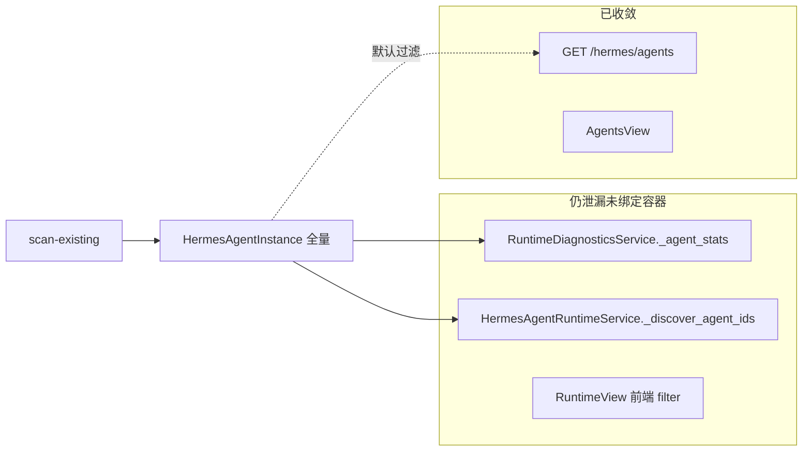
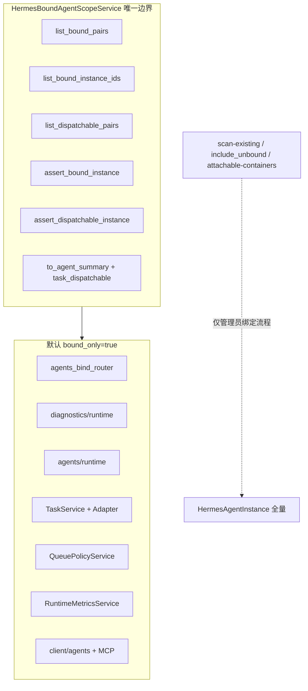

# Hermes v4.5.3 模块统一已绑定实例边界

## 北极星校验

本改动直接服务「人和 AI 共同经营」：Hermes 模块的操作对象应是 **AI 员工（Instance）**，不是 Docker 扫描记录。统一边界可避免用户在 Runtime/Diagnostics 里误把未绑定容器当可协作对象，任务也只能下发给真实员工。

## 现状与根因

v4.5.2 已在 [`hermes_docker_binding_service.py`](nodeskclaw-backend/app/services/hermes_external/hermes_docker_binding_service.py) 实现 `list_bound_pairs()` / `list_instances_for_api(include_unbound=False)`，[`AgentsView.vue`](nodeskclaw-portal/src/views/hermes/AgentsView.vue) 默认只列已绑定员工。

**未收敛的泄漏点**（依据 PRD §10 与代码）：



- [`runtime_diagnostics_service.py`](nodeskclaw-backend/app/services/hermes_skill/runtime_diagnostics_service.py) 的 `_agent_stats()` 仍调用 `binding.list_instances()`，把未绑定 profile（如 heyejuan）写入 `diagnostics.agents`
- [`hermes_agent_runtime_service.py`](nodeskclaw-backend/app/services/hermes_skill/hermes_agent_runtime_service.py) 的 `_discover_agent_ids()` 合并 skill installation + 任意 `instance_id` 非空的 HermesAgentInstance，未校验 `external_docker`
- [`RuntimeView.vue`](nodeskclaw-portal/src/views/hermes/RuntimeView.vue) 用 `source === 'docker_bind' || gateway_url` 做客户端过滤，属于 PRD 明确禁止的模式
- 任务链路（[`task_service.py`](nodeskclaw-backend/app/services/hermes_skill/task_service.py)、[`hermes_agent_adapter.py`](nodeskclaw-backend/app/services/hermes_skill/hermes_agent_adapter.py)、[`mcp_tool_mapper.py`](nodeskclaw-backend/app/services/hermes_skill/mcp_tool_mapper.py)）缺少 bound/dispatchable 断言
- Copilot Desktop 走 [`client_router.py`](nodeskclaw-backend/app/api/hermes_skill/client_router.py) → [`agent_alias_resolver.list_available_agents()`](nodeskclaw-backend/app/services/hermes_skill/agent_alias_resolver.py)，逻辑与 bound scope 不一致

## 目标架构



---

### 前端表现变化

#### 1. Hermes Runtime 页（`/hermes/runtime`）

**总结**：统计与列表从「含未绑定 Docker 容器」改为「仅已绑定 AI 员工 Runtime」

**元素级变化**:
- 顶部统计卡片（全部/Ready/Degraded 等）：数量只计已绑定员工，不再包含 heyejuan 等扫描容器
- Agent 列表区：每条显示 `employee_name`（员工名）+ `profile_name / container_name` 副标题（若后端补充字段）
- 移除前端 `source === 'docker_bind' || gateway_url` 过滤逻辑，直接展示后端 `diagnostics.agents`

**改动前**（含未绑定容器）:
```
Runtime 统计: 全部 5 | Ready 2 | ...
列表: heyejuan (missing HERMES_GATEWAY_PORT)
      common-writer (ready)
```

**改动后**:
```
Runtime 统计: 全部 1 | Ready 1 | ...
列表: 生文专家
      common-writer / hermes-common-writer
```

#### 2. Hermes Diagnostics 页（`/hermes/diagnostics`）

**总结**：Agent 诊断区不再展示未绑定容器的配置错误

**元素级变化**:
- `diagnostics.agents` 列表：只含已绑定 AI 员工；未绑定容器的 `missing HERMES_GATEWAY_PORT` 等错误消失
- Agent 行标题优先显示 `employee_name`，`agent_id` 展示 `instances.id`（UUID）而非 profile_name

#### 3. Hermes Tasks / Queue / Metrics / Installations 等

**总结**：默认列表与统计不再包含孤儿 `agent_id`（历史 profile 名、未绑定容器 ID）

**元素级变化**:
- 任务列表：默认只显示 `agent_id` 属于已绑定 Instance 的任务
- 队列统计、失败 Top Agents：同样收敛到 bound instance ids
- 安装记录等 agent 维度列表：默认过滤到 bound ids

#### 4. Copilot Desktop Agent 选择器（`/hermes/client/agents`）

**总结**：Desktop 只能看到已绑定且 `task_dispatchable=true` 的员工

**元素级变化**:
- 列表项增加/透出 `task_dispatchable` 字段
- 不可调用 Runtime 的已绑定员工不出现在任务下发选择器（管理页仍可见）

#### 5. Hermes Agents 页（`/hermes/agents`）

**总结**：v4.5.2 已完成，v4.5.3 仅补充 `task_dispatchable` 字段展示（可选 Badge）

**本次改动无前端表现变化**（Agents 列表逻辑已在 v4.5.2 落地）

---

## 后端实施步骤

### Phase 1：新增 `HermesBoundAgentScopeService`

**位置**：新建 [`nodeskclaw-backend/app/services/hermes_external/hermes_bound_agent_scope_service.py`](nodeskclaw-backend/app/services/hermes_external/hermes_bound_agent_scope_service.py)

**内容**：
- 实现 PRD §8.2 六个方法；`list_bound_pairs` 逻辑从 `HermesDockerBindingService.list_bound_pairs` **迁移**（binding service 改为委托 scope，避免双份实现）
- `to_agent_summary(record, instance)` 基于现有 `to_api_dict()` 扩展，新增 `task_dispatchable: bool`（PRD §8.4：gateway online + callable + ready + API key）
- `assert_bound_instance` / `assert_dispatchable_instance` 抛出带 `error_code` + `message_key` 的 `BadRequestError`（PRD §13，建议 message_key：`errors.hermes.agent_not_bound`、`errors.hermes.agent_not_dispatchable` 等）

**同步**：
- [`hermes_agent_instance.py`](nodeskclaw-backend/app/schemas/hermes_skill/hermes_agent_instance.py) schema 增加 `task_dispatchable: bool = False`
- [`agents_bind_router.py`](nodeskclaw-backend/app/api/hermes_skill/agents_bind_router.py) 列表/详情响应走 scope `to_agent_summary`

### Phase 2：收敛 Runtime + Diagnostics（最高优先级，修复用户可见 bug）

**[`runtime_diagnostics_service.py`](nodeskclaw-backend/app/services/hermes_skill/runtime_diagnostics_service.py)**：
- `_agent_stats()` 改为 `scope.list_bound_pairs()` 构建 agents 列表
- 返回字段补齐：`instance_id`、`employee_name`、`binding_type`、`is_bound`、`task_dispatchable`；`agent_id` 统一为 `instance.id`
- `_recent_failed_tasks()` 默认只含 `agent_id IN bound_instance_ids`（或 `agent_id IS NULL` 的历史任务按 PRD 排除孤儿 id）
- `get_runtime_diagnostics(org_id, *, include_unbound=False)` 增加参数

**[`diagnostics_router.py`](nodeskclaw-backend/app/api/hermes_skill/diagnostics_router.py)**：
- 增加 `include_unbound: bool = False`；非 `hermes_agent:manage` 强制 false（与 v4.5.2 agents 列表门控一致）

**[`hermes_agent_runtime_service.py`](nodeskclaw-backend/app/services/hermes_skill/hermes_agent_runtime_service.py)**：
- `list_runtime_states(org_id, *, bound_only=True)` 默认只发现 `scope.list_bound_instance_ids()`
- `_discover_agent_ids` 拆为 `_discover_bound_agent_ids`（走 scope）与保留 skill-installation 路径仅 `bound_only=False` 管理员调试用

**[`agents_runtime_router.py`](nodeskclaw-backend/app/api/hermes_skill/agents_runtime_router.py)**：
- `GET /agents/runtime` 增加 `bound_only=true` 查询参数（默认 true）
- `GET/POST /agents/{agent_id}/*` 所有写操作与详情：`scope.assert_bound_instance()` 前置校验

### Phase 3：任务下发硬校验

**[`hermes_agent_adapter.py`](nodeskclaw-backend/app/services/hermes_skill/hermes_agent_adapter.py)**：
- `submit_run()` 前 `assert_dispatchable_instance`
- `cancel_run()` / `read_run_events()` / `get_run()` 前 `assert_bound_instance`

**[`task_service.py`](nodeskclaw-backend/app/services/hermes_skill/task_service.py)**：
- `create_task()` 在 `agent_id` 非空时 `assert_bound_instance`；若任务将立即执行（worker 路径），在 worker 侧已有 adapter 校验，create 阶段至少 bound 校验

**[`mcp_tool_mapper.py`](nodeskclaw-backend/app/services/hermes_skill/mcp_tool_mapper.py)**：
- MCP 创建任务入口同步 bound/dispatchable 校验

**[`hermes_queue_policy_service.py`](nodeskclaw-backend/app/services/hermes_skill/hermes_queue_policy_service.py)**：
- `can_enqueue()` 对 `agent_id` 增加 bound 检查
- `get_queue_stats()` / `list_queue_tasks()` 默认 `agent_id IS NULL OR agent_id IN bound_ids`

### Phase 4：Queue / Metrics / Skill 维度列表

| 服务/路由 | 改动 |
|-----------|------|
| [`task_service.list_tasks`](nodeskclaw-backend/app/services/hermes_skill/task_service.py) | 默认 `agent_id IS NULL OR agent_id IN bound_ids` |
| [`hermes_runtime_metrics_service.py`](nodeskclaw-backend/app/services/hermes_skill/hermes_runtime_metrics_service.py) | Top agents / 聚合按 bound ids 过滤 |
| [`installations_router.py`](nodeskclaw-backend/app/api/hermes_skill/installations_router.py) | 列表默认 `agent_id IN bound_ids` |
| [`imports_router.py`](nodeskclaw-backend/app/api/hermes_skill/imports_router.py) | 同上（若有 agent 维度） |
| [`authorizations_router.py`](nodeskclaw-backend/app/api/hermes_skill/authorizations_router.py) | subject 为 agent 时按 bound 过滤（若列表含 agent subject） |

### Phase 5：Copilot Desktop / Client API

**[`agent_alias_resolver.py`](nodeskclaw-backend/app/services/hermes_skill/agent_alias_resolver.py)** + [`hermes_client_service.py`](nodeskclaw-backend/app/services/hermes_skill/hermes_client_service.py)**：
- `list_available_agents()` 改为基于 `scope.list_dispatchable_pairs()`（Desktop 任务选择）或 `list_bound_pairs()`（列表展示）+ 计算 `task_dispatchable`
- 移除直接遍历全量 `HermesAgentInstance` 的宽口径逻辑
- PRD 写的 `GET /api/copilot-desktop/hermes/agents` 当前不存在；**复用现有** `GET /api/v1/hermes/client/agents`，行为对齐即可

### Phase 6：明确不改 / 延后项

按 PRD「不改范围」与 MVP 建议 **本轮不实现**：
- `GET /hermes/docker-pool`（管理员容器池继续用 `include_unbound=true` + 现有 [`GET /docker/attachable-containers`](nodeskclaw-backend/app/api/docker_attach.py)）
- copilot-docker 部署脚本、Profile 配置管理
- AI 专家中心（[`ExpertInstancesView.vue`](nodeskclaw-portal/src/views/hermes/ExpertInstancesView.vue) 走独立 `hermes-experts` API，与 Docker 绑定池无关；若后续需收敛再单独立项）

---

## 前端实施步骤

### API 层

[`agentInstances.ts`](nodeskclaw-portal/src/api/hermes/agentInstances.ts)：
- 增加 `task_dispatchable?: boolean` 类型字段
- 新增 `listBoundHermesAgents({ dispatchableOnly?, refresh? })` 封装（内部仍调 `GET /hermes/agents`，`dispatchableOnly` 时前端过滤或后端加 `dispatchable_only` 查询参数——**推荐后端加可选参数**避免前端二次过滤）

[`diagnostics.ts`](nodeskclaw-portal/src/api/hermes/diagnostics.ts)：
- Agent 诊断项类型补充 `employee_name`、`is_bound`、`task_dispatchable`

### 页面

| 页面 | 改动 |
|------|------|
| [`RuntimeView.vue`](nodeskclaw-portal/src/views/hermes/RuntimeView.vue) | 删除 `dockerAgents` 客户端 filter；直接用 `diagnostics.agents`；统计基于后端数据 |
| [`DiagnosticsView.vue`](nodeskclaw-portal/src/views/hermes/DiagnosticsView.vue) | Agent 行展示 `employee_name \|\| agent_id`；信任后端过滤 |
| [`TasksView.vue`](nodeskclaw-portal/src/views/hermes/TasksView.vue) / [`QueueView.vue`](nodeskclaw-portal/src/views/hermes/QueueView.vue) / [`MetricsView.vue`](nodeskclaw-portal/src/views/hermes/MetricsView.vue) / [`InstallationsView.vue`](nodeskclaw-portal/src/views/hermes/InstallationsView.vue) | 无需客户端 bound 过滤（后端默认收敛）；可选将 agent_id 列改为显示员工名（从 bound agents 映射） |
| [`AgentsView.vue`](nodeskclaw-portal/src/views/hermes/AgentsView.vue) | 可选展示 `task_dispatchable` Badge |

### i18n

[`zh-CN.ts`](nodeskclaw-portal/src/i18n/locales/zh-CN.ts) / [`en-US.ts`](nodeskclaw-portal/src/i18n/locales/en-US.ts)：
- Runtime/Diagnostics 副标题改为「已绑定 AI 员工」语义
- 新增 `errors.hermes.agent_not_bound` 等词条（与后端 message_key 对齐）

---

## 测试计划

| 测试文件 | 覆盖点 |
|----------|--------|
| 新建 `test_hermes_bound_agent_scope_service.py` | bound/dispatchable 判定边界（无 instance_id、binding_type 非 external_docker、gateway 缺失、runtime 非 ready） |
| 扩展 `test_runtime_diagnostics_api.py` | `_agent_stats` 不含未绑定 profile |
| 扩展 `test_agent_runtime_service.py` | `bound_only=true` 只返回 bound ids；未绑定 agent_id 调 runtime API 返回 `HERMES_AGENT_NOT_BOUND` |
| 扩展 `test_hermes_agent_adapter.py` | submit_run 拒绝未绑定/不可分发 |
| 扩展 `test_hermes_agents_bound_filter.py` | `task_dispatchable` 字段存在 |

验收用例对齐 PRD §15 Case 2–5（Runtime/Diagnostics 不显示 heyejuan；task.agent_id=profile_name 拒绝；Desktop 只返回 dispatchable）。

---

## 文档

- 更新 [`nodeskclaw-backend/README.md`](nodeskclaw-backend/README.md) Hermes API 章节：说明 `HermesBoundAgentScopeService`、默认 bound-only 接口列表、`include_unbound` / `bound_only` 参数
- `ee/docs/` 若本地存在则同步后端架构设计；不存在则仅 CE README

---

## 实施顺序建议

1. Scope 服务 + 异常码 + schema（基础设施）
2. RuntimeDiagnostics + RuntimeService + routers（修复最明显泄漏）
3. Adapter + Task + Queue + Metrics（任务安全）
4. Client/Desktop agents
5. 前端 Runtime/Diagnostics + API 类型
6. 测试 + README
