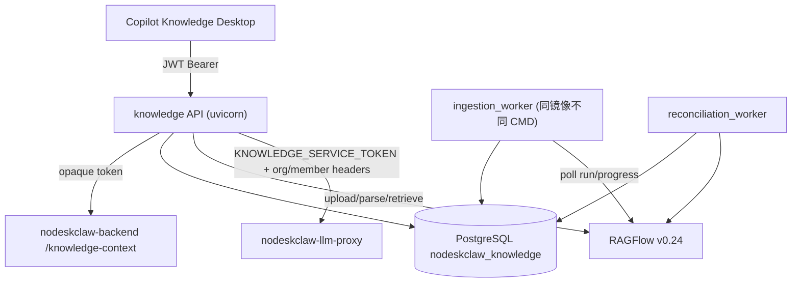

# nodeskclaw-knowledge v1.1 实施计划

## 前端表现变化

本次改动为纯后端服务（nodeskclaw-knowledge / nodeskclaw-backend / nodeskclaw-llm-proxy / docker-compose），无前端表现变化。Desktop Remote 接入（T11，copilot-knowledge 仓库）不在本轮范围。

## 已确认决策

- 范围：T01-T10 + T12 + T13（服务端全量），不含 T11 Desktop
- LLM Proxy 契约：llm-proxy 新增 env `KNOWLEDGE_SERVICE_TOKEN`，Knowledge 服务端持有；请求头携带 `X-NoDeskClaw-Org-Id` / `X-NoDeskClaw-Member-Id` / `X-NoDeskClaw-Knowledge-Session-Id`；llm-proxy 按 org_id+provider 查 `OrgLlmKey` 走 Working Plan 额度，用量归因 `attribution_source=knowledge`
- 包含 backend 配套修改（knowledge-context 改 `get_current_user`）与 llm-proxy 配套修改，各成独立 commit

## 总体架构

## T01 — v1.1 Schema（Alembic 002）

修改 [nodeskclaw-knowledge/app/models](nodeskclaw-knowledge/app/models)：

- `knowledge_base.py`：+`acl_version`(int,默认1)、`last_synced_at`、`last_error`、`tags`(JSONB)
- `source_file.py`：+`acl_version`
- `source_file_version.py`：+`ragflow_run`、`ragflow_progress`(float)、`ragflow_progress_msg`、`chunk_count`、`token_count`、`process_duration`
- `knowledge_set.py`：+`acl_version`、`retrieval_config`(JSONB，默认 PRD §30 结构)、`last_used_at`、`usage_count`
- `ingestion_job.py`：+`attempt_count`、`max_attempts`、`next_run_at`、`lease_owner`、`lease_until`、`last_polled_at`、`finished_at`
- 新增模型：`knowledge_set_acl.py`、`chat_session.py`、`chat_message.py`、`chat_citation.py`、`audit_log.py`（字段按 PRD §23/39/40/41/67）
- `enums.py`：`IngestionJobStatus` 增加 `parse_dispatched`；新增 `SetPermission`(read/use/update/delete/manage/manage_acl)、`AnswerMode`(concise/detailed/structured)、`AuditAction`（§68 全集）
- 全部软删除 + Partial Unique Index；`alembic revision --autogenerate -m "knowledge v1.1 runtime"` 生成 002 并 review

## T02 — Auth Hardening

- backend（独立 commit）：[nodeskclaw-backend/app/api/auth.py](nodeskclaw-backend/app/api/auth.py) `knowledge-context` 从 `get_current_user_unchecked` 改为 `get_current_user`（must_change_password 账号拒绝）
- knowledge：[app/core/deps.py](nodeskclaw-knowledge/app/core/deps.py) 移除 `decode_token` 本地校验，token 视为 opaque credential 直接调 backend；缓存 key 改 `sha256(token)`（TTL 默认仍 0）；[app/core/config.py](nodeskclaw-knowledge/app/core/config.py) 移除 `JWT_SECRET`/`JWT_ALGORITHM` 强依赖（保留可选）；[app/core/security.py](nodeskclaw-knowledge/app/core/security.py) 删除或降级为可选
- BackendClient 改 lifespan 托管共享 `httpx.AsyncClient`（[app/main.py](nodeskclaw-knowledge/app/main.py) lifespan 创建/关闭，deps 从 app.state 取）

## T03 — ACL v1.1

- [app/schemas/knowledge.py](nodeskclaw-knowledge/app/schemas/knowledge.py)：ACL 输入全部改 Enum/Literal，非法值 422
- Subject 校验（PRD §65）：member 须属当前 org（调 backend context 或接受 member_id 列表校验）、role 仅 member/operator/admin、organization 仅当前 org_id
- KnowledgeSet ACL：新 service `knowledge_set_acl_service.py` + API `knowledge-sets/{id}/acl`；Owner 全权限且不可被 ACL 锁死（§25）
- Role 模板映射（§26）：Viewer/Editor/Manager → granular ACL 展开；visibility（private/department/organization）作为 ACL 模板生成（§27）
- bind/unbind KB 接口改要求 `MANAGE`（[app/api/knowledge_sets.py](nodeskclaw-knowledge/app/api/knowledge_sets.py)，§29）
- ACL 增删时对应资源 `acl_version += 1`（§66）
- 不提升原则（§28）：Set USE → KB READ → File READ 三层独立校验，在 permission_service 落地

## T04 — RAGFlow Adapter v1.1

- [app/integrations/ragflow/models.py](nodeskclaw-knowledge/app/integrations/ragflow/models.py)：`RagflowDocument` +run/progress/progress_msg/chunk_count/token_count/process_duration；`RagflowChunk` +document_name/positions/term_similarity/vector_similarity/highlight
- [app/integrations/ragflow/client.py](nodeskclaw-knowledge/app/integrations/ragflow/client.py)：`update_document` 支持 `enabled`（禁用旧版本文档）；`retrieve` 支持 `vector_similarity_weight`/`rerank_id`/`cross_languages`/`top_n`；新增 `system_health()`（GET /v1/system/healthz）
- 改共享 `AsyncClient`：client 不再每次请求新建，由 lifespan 注入（§63）

## T05 — Ingestion Worker（P0 Gate）

- 新增 [app/workers/ingestion_worker.py](nodeskclaw-knowledge/app/workers/ingestion_worker.py)：`python -m app.workers.ingestion_worker` 启动；PG Job Leasing `FOR UPDATE SKIP LOCKED`（§9）；poll 间隔 2-5s，网络异常指数退避（2/4/8/16/30s，连续 5 次上限），仅 `run=FAIL` 才判失败（§10）
- RAGFlow 状态映射（§7）：UNSTART→parse_dispatched、RUNNING→parsing、DONE→validating、FAIL→failed、CANCEL→cancelled；同步 progress/chunk_count 等运行时字段
- [app/services/ingestion_service.py](nodeskclaw-knowledge/app/services/ingestion_service.py) 重构：upload 流程到 `parse_dispatched` 即止，不再同步 activate；DONE 后 worker 执行 validating（metadata 一致性 + chunk_count>0）→ 蓝绿激活
- Upload API（[app/api/source_files.py](nodeskclaw-knowledge/app/api/source_files.py)）：改流式/spooled 上传，`KNOWLEDGE_UPLOAD_MAX_MB=200`，上传前校验大小/MIME/文件名/UPLOAD 权限/KB active（§11）
- 新增 [app/api/ingestion_jobs.py](nodeskclaw-knowledge/app/api/ingestion_jobs.py)：list（status/kb_id/source_file_id/created_by 过滤）/get/retry/cancel（§12）

## T06 — Active Version Security（P0 Gate）

- [app/services/chunk_security_service.py](nodeskclaw-knowledge/app/services/chunk_security_service.py) 重写（§14/15/16）：
  - Batch resolve：收集所有 document_id → 一次 `WHERE ragflow_document_id IN (...)` 加载 Version+SourceFile → `ActiveDocumentMap` O(1) 检查
  - 安全链：document_id → Version → SourceFile → `version.id == source_file.active_version_id` 否则 DROP → File ACL
  - Metadata 一致性：chunk 的 `nk_source_file_id`/`nk_file_version_id` 与本地 registry 不一致 → DROP + 写安全审计（METADATA_MISMATCH）
  - unknown document → DROP + 告警
- 蓝绿切换（§17）：本地事务 `active_version_id=v2 + v2.active + v1.superseded` 提交后，best-effort `enabled=0` 禁用 RAGFlow v1；本地 active check 为最终 authority（§18）
- KB 删除（§21）：ACTIVE→DELETING（阻止 upload/retrieval）→ RAGFlow delete → DELETED；失败留 DELETING 由 reconciliation 重试
- SourceFile 删除（§22）：同样 DELETING 流程，可恢复可审计
- KB PATCH（§20）：name/description 先同步 RAGFlow `update_dataset` 成功才本地 commit；已有文档后禁止改 embedding_model

## T07 — Retrieval Planner（P0 Gate）

- 新增 [app/services/retrieval_planner.py](nodeskclaw-knowledge/app/services/retrieval_planner.py)：`AccessPlan` → `RetrievalPlan`，按 KB 拆 Slice（`full_dataset` / `filtered_documents`），支持 Full+Partial 混合（§32/33）
- 新增 [app/services/retrieval_merge_service.py](nodeskclaw-knowledge/app/services/retrieval_merge_service.py)：并行执行 slice（asyncio.gather）→ cleaner → 按 chunk_id+document_id 去重 → `final_score = similarity × set_item.weight` → DESC 排序 → top_n（§34/35/31）
- [app/services/retrieval_service.py](nodeskclaw-knowledge/app/services/retrieval_service.py) 重写：读取 KnowledgeSet `retrieval_config`，请求 `options` 只允许覆盖 top_n/similarity_threshold 等，禁止覆盖 dataset_ids/document_ids（§36）
- Citation 增强（§37）：返回 document_name/positions/term_similarity/vector_similarity/page（无法解析为 null，禁止伪造）
- `retrieval_audit` 增强字段落库：status/plan_kind/ragflow_call_count/error_code/三层 chunk 计数/latency_ms（§69），仍只存 query_hash

## T08 — Reconciliation

- 新增 [app/workers/reconciliation_worker.py](nodeskclaw-knowledge/app/workers/reconciliation_worker.py) + [app/services/reconciliation_service.py](nodeskclaw-knowledge/app/services/reconciliation_service.py)：周期检查 superseded-but-enabled → disable；DELETED SourceFile 残留 RAGFlow 文档 → 补删；DELETING KB → 重试删除；metadata drift 检测并告警（§19）

## T09 — Desktop Data API

- 新增 [app/api/dashboard.py](nodeskclaw-knowledge/app/api/dashboard.py)：`GET /dashboard`，统计严格按当前 Member 权限范围（§49）
- KB list 增强（§50）：page/page_size/q/status + document_count/chunk_count/owner/visibility/tags/last_synced_at/last_error；KB detail 禁止返回 RAGFlow API Key 等内部字段（§51）
- 全局 `GET /source-files`（§52）：q/knowledge_base_id/parse_status/mime_type 过滤，仅 READ 范围
- SourceFile detail（§53）、Version API（§54）、KnowledgeSet detail（§56，含 retrieval_config/weights/usage_count/last_used_at）
- 统一分页契约 `{data:{items,total,page,page_size}}`（§74），适用 KB/Set/SourceFile/IngestionJob/ChatSession/Audit
- 新增 [app/api/audit.py](nodeskclaw-knowledge/app/api/audit.py) 审计查询 + [app/services/audit_service.py](nodeskclaw-knowledge/app/services/audit_service.py)，§68 事件在各 service 埋点

## T10 — Secure Chat

- 新增 [app/integrations/llm_proxy/](nodeskclaw-knowledge/app/integrations/llm_proxy)（client/models/exceptions）：`POST {LLM_PROXY_URL}/{provider}/v1/chat/completions`，Bearer `KNOWLEDGE_SERVICE_TOKEN` + org/member/session headers，SSE 流式消费
- 新增服务：[app/services/chat_service.py](nodeskclaw-knowledge/app/services/chat_service.py)（session 仅 owner 可访问）、[app/services/context_builder.py](nodeskclaw-knowledge/app/services/context_builder.py)（仅 SafeChunks 构造 `[Source N]` 上下文，§45）
- Pipeline（§42）：Session ACL → Set USE → Secure Retrieval → SafeChunks → Context → LLM → Citation 与本轮 SafeChunkSet 匹配校验（LLM 返回的 [N] 不可直接信任）→ 持久化 message+citations
- Answer Mode 系统 Prompt 映射（§46）
- 新增 [app/api/chat.py](nodeskclaw-knowledge/app/api/chat.py)：sessions CRUD + messages list + `POST .../messages` SSE（事件：retrieval_started/retrieval_completed/generation_started/delta/citation/message_completed/error，§47/58）
- Citation 原文件访问走现有 download 端点重新鉴权（§59，已有 re-auth，补历史 citation 场景测试）
- Set `usage_count`/`last_used_at` 在 retrieval/chat 时更新

## llm-proxy 配套（独立 commit）

- [nodeskclaw-llm-proxy/app/config.py](nodeskclaw-llm-proxy/app/config.py)：+`KNOWLEDGE_SERVICE_TOKEN`
- [nodeskclaw-llm-proxy/app/proxy.py](nodeskclaw-llm-proxy/app/proxy.py)：token 命中 knowledge credential 时走服务身份分支——从 `X-NoDeskClaw-Org-Id` 查 `OrgLlmKey`（org + provider，走 Working Plan 额度），用量归因 `attribution_source="knowledge"`，session header 透传记录；不查 Instance、不伪装 proxy_token

## T12 — Deployment

- 根目录 [docker-compose.yml](docker-compose.yml)：新增 `nodeskclaw-knowledge`（API）与 `nodeskclaw-knowledge-worker`（同镜像，`command: python -m app.workers.ingestion_worker`，reconciliation 以 `--with-reconciliation` 或独立 service）
- 新增 `docker/postgres-init/01-create-knowledge-db.sql` 创建 `nodeskclaw_knowledge` 库并挂到 postgres service（§72）
- 单一 migration 策略（§73）：entrypoint 执行 `alembic upgrade head`，移除 [app/main.py](nodeskclaw-knowledge/app/main.py) lifespan 自动迁移（避免 API/Worker 双入口竞争）
- Health（§70）：`/health/live`（进程存活）+ `/health/ready`（DB + RAGFlow `/v1/system/healthz` + backend 连通性）
- `.env.example` 同步新增配置项

## T13 — Tests

按 PRD §80-83 新增（mock RAGFlow/LLM Proxy，集成层用真实 PostgreSQL + contract mock server）：

- Ingestion：dispatch 不立即 ACTIVE / RUNNING 保持 parsing / DONE 才 activate / FAIL、CANCEL 不切 active_version
- Version：v2 parsing 期间 v1 仍 active；v2 DONE 后切换
- Chunk Cleaner：superseded/unknown/metadata mismatch/unauthorized 四种 DROP
- KnowledgeSet：无 MANAGE bind 403 / 有 USE 无 KB READ 0 chunk / embedding 不同 bind 400
- Retrieval Planner：Full+Full / Full+Partial / Partial+Partial / Full+NoAccess / NoAccess only
- 安全回归：ACL revoke 即时生效 / version leakage（旧 doc 仍 enabled 也被 cleaner DROP）/ cross-org 404/403 / 历史 citation 撤权后 403
- LLM 安全：mock LLM proxy 断言 denied chunk 不出现在 prompt（P0）

## 验证

- `cd nodeskclaw-knowledge && uv sync && uv run pytest && uv run ruff check .`
- `uv run alembic upgrade head`（需可用 DATABASE_URL）
- backend/llm-proxy 各自 `ruff check` + 相关测试
- 更新 `lat.md/` 知识图谱锚点（新增 worker/chat/planner 等 section）后 `lat check`
- 每个 Task 完成即独立 commit（只 add 本次改动文件）；backend、llm-proxy、docker-compose 改动各成独立 commit