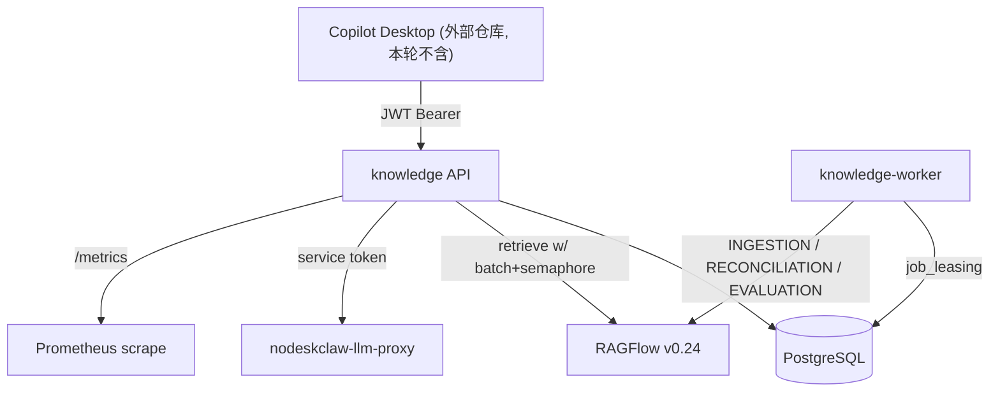

# nodeskclaw-knowledge v1.2 实施计划

## 前端表现变化

本次改动为纯后端服务（nodeskclaw-knowledge），无前端表现变化。T12 Desktop Remote（copilot-knowledge 仓库，不在本工作区）经确认不在本轮范围。

## 已确认决策

- **范围**：T01-T11 + T13 测试（服务端全量）；T12 Desktop 与真实 Desktop E2E 排除
- **Evaluation 执行**：按 PRD §63 统一任务表方向——新增通用 Job Leasing 模块 `app/workers/job_leasing.py`（抽象 `FOR UPDATE SKIP LOCKED` 租赁），`knowledge_evaluation_runs` 表自带 lease 字段（attempt_count/lease_owner/lease_until/next_run_at）作为 Evaluation 的 Job 表；现有 `ingestion_jobs` 表不迁移数据，但 leasing 逻辑重构为共用同一模块。worker 进程增加 evaluation 循环（不拆独立 Deployment）
- **迁移策略**：遵循仓库规则"Model 变更同 commit 带 autogenerate 迁移"，按 Task 生成多个 revision（当前 head `e220c8d0ee88`），最终在部署侧仍是单一 `alembic upgrade head`
- **Profile 与旧 retrieval_config 关系**：迁移时为每个 KnowledgeSet 用现有 `retrieval_config` 播种一条 ACTIVE Profile v1；之后检索只读 ACTIVE Profile，`retrieval_config` 字段保留但不再作为运行时权威

## 现状审计摘要（vs PRD）

基于代码探查，关键缺口：Set List 无 ACL 过滤（返回全组织）、KB/Set/SourceFile 列表无分页契约、全局 SourceFile API 缺失、Dashboard 双计数（RetrievalAudit+ChatMessage）且 chat_count 无 org/member 过滤、Chat 路径 usage_count 加两次、Chat 历史取最早 20 条、权限判断全面 N+1、Slice 失败静默（gather 后 continue）、无 failure_policy/分批/并发限制、Metadata/Archive/Profile/Playground/Evaluation/Trace/Citation resolve/Metrics 全部缺失。

## 总体架构

## T01 — v1.1 Contract Fix（P0 Gate A）

- [app/services/knowledge_set_service.py](nodeskclaw-knowledge/app/services/knowledge_set_service.py)：`list_knowledge_sets` 增加 Owner/READ/USE ACL 过滤（对齐 KB list 做法，T02 再批量化）
- 统一分页：KB / Set / KB-scoped SourceFile 列表改返回 `PaginatedResponse`（[app/schemas/common.py](nodeskclaw-knowledge/app/schemas/common.py) 已有 `PageData`），参数统一 `page/page_size/q/sort_by/sort_order`；**total 必须权限过滤后统计**；修复 ingestion_jobs 当前"先 total 后过滤"的顺序错误
- 全局 `GET /api/v1/source-files`：过滤器 `q/knowledge_base_id/parse_status/status/mime_type/owner_member_id/tags/created_from/created_to`，过滤顺序 Org→KB ACL→File ACL→Filter→Pagination
- [app/services/dashboard_service.py](nodeskclaw-knowledge/app/services/dashboard_service.py)：`weekly_query_count = COUNT(retrieval_audits)`（按 member_id+org_id+7 天），删除 ChatMessage 计数
- `retrieval_audits` + `origin` 列（direct_retrieval/chat/agent/evaluation），Retrieve 与 Chat 各自写入正确 origin；同步生成迁移
- usage_count：删除 [app/services/chat_service.py](nodeskclaw-knowledge/app/services/chat_service.py) 中的重复累加，仅 RetrievalService 成功完成后 +1
- Chat 历史：[app/services/chat_service.py](nodeskclaw-knowledge/app/services/chat_service.py) / [app/services/context_builder.py](nodeskclaw-knowledge/app/services/context_builder.py) 改 `ORDER BY created_at DESC LIMIT N` 取回后反转为时间正序；新增 token 感知裁剪（config: `CHAT_HISTORY_MAX_MESSAGES=20`、`CHAT_HISTORY_MAX_TOKENS`），裁剪时优先保住 Knowledge Context，逐条丢弃最旧历史

## T02 — Permission Snapshot

- 新增 [app/services/permission_snapshot_service.py](nodeskclaw-knowledge/app/services/permission_snapshot_service.py)：一次批量加载 member 在 org 内的 KB/File/Set ACL（各一条 `IN (...)` 查询），生成 `PermissionSnapshot{member, kb_permissions, file_permissions, set_permissions}`，提供 O(1) `has_kb/file/set_permission`
- 改造消费方：KB/Set/SourceFile 列表、Dashboard、Retrieval Planner `build_access_plan`、ingestion job 可见性过滤——消除 N+1

## T03 — Retrieval Reliability（P0 Gate B）

- [app/services/retrieval_planner.py](nodeskclaw-knowledge/app/services/retrieval_planner.py)：Partial KB 的 `document_ids` 按 `RETRIEVAL_DOCUMENT_BATCH_SIZE=500` 拆成多个 Slice
- 新增 `RetrievalSliceResult{knowledge_base_id, dataset_id, status, latency_ms, candidate_count, safe_count, error_code}`；[app/services/retrieval_merge_service.py](nodeskclaw-knowledge/app/services/retrieval_merge_service.py) 用 `asyncio.Semaphore(RETRIEVAL_MAX_PARALLEL_SLICES=8)` 限流，不再静默吞异常，逐 slice 产出 SliceResult
- 执行状态语义：`SUCCESS / DEGRADED / FAILED / DENIED / EMPTY`；`retrieval_failure_policy` 进 Set 配置，默认 `fail_closed`——任一变体 slice 失败 → 503 `errors.knowledge.retrieval_unavailable`；`degraded` 模式返回 `status=degraded` + diagnostics
- Chat 联动：degraded 时 SSE 增加 `retrieval_degraded` 事件并在回答中明确提示"部分知识源当前不可用"；fail_closed 时 Chat 不调用 LLM
- `retrieval_audits` + `execution_status/successful_slice_count/failed_slice_count`（可与 T01 的 origin 合并为一个迁移）
- 新错误键（§53 本轮涉及部分）：`errors.knowledge.retrieval_partial_failure`、`errors.knowledge.retrieval_unavailable`

## T04 — Metadata Domain（Gate C 前半）

- 模型：`source_files` + `metadata`(JSONB) + `metadata_revision`(int) + `archived_at`；`knowledge_bases` + `metadata_schema`(JSONB)；生成迁移
- 新增 [app/services/metadata_service.py](nodeskclaw-knowledge/app/services/metadata_service.py)：schema 校验（string/number/boolean/date/enum/multi_enum、required、options），保留字保护——客户端写入任何 `nk_*` key → 422 `errors.knowledge.metadata_invalid`；ACL 字段永不进入 metadata
- 上传流程接入校验（[app/api/source_files.py](nodeskclaw-knowledge/app/api/source_files.py) upload 前置 Validate，必填缺失/非法 enum → 422）
- API：`GET/PUT /knowledge-bases/{id}/metadata-schema`、`GET/PATCH /source-files/{id}/metadata`

## T05 — RAGFlow Metadata Sync（Gate C 后半）

- 入库时 biz_* 映射：本地 metadata → RAGFlow document `meta_fields`（`biz_<key>`），同时写 `nk_metadata_revision`；nk_* 系统字段维持现有注入逻辑
- PATCH metadata：本地事务 → 更新 Active Version 对应 RAGFlow document meta_fields → 成功才 commit，`metadata_revision += 1`
- Retrieval metadata filter：请求 `filters{key:[values]}` → metadata schema 校验 → Planner 在已授权文档集合上按本地 metadata 过滤候选 → 再调 RAGFlow（Metadata Filter ≠ ACL，ACL 独立执行）
- Reconciliation 升级（[app/services/reconciliation_service.py](nodeskclaw-knowledge/app/services/reconciliation_service.py)）：对比本地 `metadata_revision` vs RAGFlow `nk_metadata_revision`，drift → LOCAL_WINS 重写 RAGFlow → 验证 → 审计标记 REPAIRED

## T06 — Source Lifecycle

- `POST /source-files/{id}/archive` / `unarchive`（要求 UPDATE/MANAGE）：archive → RAGFlow `enabled=0` + `archived_at`，不参与新 Retrieval；历史 Citation 仍可解析；unarchive 反向恢复
- `POST /source-files/{id}/versions/{version_id}/activate`（版本回滚）：校验目标版本解析有效 → RAGFlow 目标版本 enabled=1 → 本地事务切 `active_version_id` + 旧版本 superseded → best-effort 禁用旧版本 RAGFlow 文档；切换期间 Chunk Cleaner 仍只认 `active_version_id`（§43）；非法版本 400 `errors.knowledge.version_not_activatable`；对 archived 文件操作报 `errors.knowledge.source_file_archived` 场景按语义接入
- KnowledgeSet disabled 强制：Retrieval/Chat/新建 Session 拒绝（403），MANAGE/历史 Chat 查看/配置编辑/Evaluation 放行——在 retrieval_service 与 chat_service 入口加状态闸

## T07 — Retrieval Profile

- 新表 `knowledge_retrieval_profiles`（id/knowledge_set_id/version/config/status/created_by_member_id/created_at/activated_at），软删除 + Partial Unique Index（set+version）；迁移并用现有 `retrieval_config` 播种 ACTIVE v1
- 新增 [app/services/retrieval_profile_service.py](nodeskclaw-knowledge/app/services/retrieval_profile_service.py) + API：create（新 DRAFT，版本号递增）/update（仅 DRAFT）/publish（DRAFT→ACTIVE，旧 ACTIVE→ARCHIVED，事务内完成）/rollback（指定历史版本复制为新 DRAFT 再 publish）；config 结构按 PRD §29（含 failure_policy、context_max_chunks/chars）
- retrieval_service 运行时改读 ACTIVE Profile；非 ACTIVE 引用报 `errors.knowledge.profile_not_active`

## T08 — Retrieval Playground + Trace

- 新表 `knowledge_retrieval_traces`：query_hash、profile_version、slice 状态、document_id/source_file_id/chunk_id、similarity、weighted_score、filter_reason、latency；默认不存全文，`DEBUG_CONTENT_LOGGING=true` 才短期记录（§34）
- 新增 [app/services/retrieval_trace_service.py](nodeskclaw-knowledge/app/services/retrieval_trace_service.py)，在 planner/merge/cleaner 管线埋点
- `POST /api/v1/retrieval/playground`（KnowledgeSet MANAGE）：支持指定 profile_id + include_trace，返回 plan/timing(acl_ms/ragflow_ms/security_ms/merge_ms/total_ms)/results/filter_summary(candidates/unauthorized/superseded/metadata_mismatch/returned)（§32）

## T09 — Evaluation（Gate D）

- 新表 4 张：`knowledge_evaluation_sets/cases/runs/results`（§35-38）；runs 表带 lease 字段作为 Evaluation Job 表
- 新增 [app/workers/job_leasing.py](nodeskclaw-knowledge/app/workers/job_leasing.py)：通用 `FOR UPDATE SKIP LOCKED` 租赁抽象，ingestion_worker 重构复用；worker 增加 evaluation 循环
- 新增 [app/services/evaluation_service.py](nodeskclaw-knowledge/app/services/evaluation_service.py) + `evaluation_runner.py`：逐 case 走真实 Retrieval 管线（origin=evaluation，不污染 Dashboard 用户口径），计算 Hit@K / Recall@K / MRR / Expected Source Hit / Latency；**No Unauthorized Source 必须 100%，否则整个 Run 直接 FAIL**
- API：Evaluation Set/Case CRUD、`POST /evaluation/runs`（异步）、`GET /evaluation/runs`（统一分页）/results、`POST /evaluation/compare`（两 Profile 对比：Hit@8/MRR/平均延迟/Empty rate/Degraded rate，§39）
- 错误键：`errors.knowledge.evaluation_failed`

## T10 — Citation v1.2

- [app/services/chat_service.py](nodeskclaw-knowledge/app/services/chat_service.py) 持久化 citation 时补存 `page`/`positions`（模型字段已存在，当前 payload 遗漏）
- 新增 [app/services/citation_service.py](nodeskclaw-knowledge/app/services/citation_service.py) + `GET /api/v1/citations/{citation_id}`：返回 citation metadata + 当前权限状态 + 当前 SourceFile 状态，`{accessible:false, reason:"permission_revoked"|"archived"|"deleted"...}`；文件访问仍走 download 端点重新鉴权，历史 citation 不作为权限凭证（§47）

## T11 — Observability

- `/metrics`（prometheus_client，Prometheus exposition）：http/ragflow/retrieval(总量、时长、degraded、failed)/security_chunks_dropped{reason}/ingestion/llm(tokens) 指标按 §48-49 埋点
- Correlation ID 中间件：生成/透传 request_id，贯穿 query_id/session_id/message_id/job_id + member_id/org_id 的结构化日志；严禁记录 Bearer Token/RAGFlow Key/LLM Token/文档内容（§50）
- `reconciliation_runs` 表：每轮记录 checked/drifted/repaired/failed；reconciliation 失败接 `errors.knowledge.reconciliation_failed`
- `.env.example` 同步：`RETRIEVAL_DOCUMENT_BATCH_SIZE`、`RETRIEVAL_MAX_PARALLEL_SLICES`、`CHAT_HISTORY_MAX_MESSAGES`、`CHAT_HISTORY_MAX_TOKENS`、`DEBUG_CONTENT_LOGGING` 等

## T13 — Tests（按 PRD §71）

在 [nodeskclaw-knowledge/tests/](nodeskclaw-knowledge/tests) 新增/扩展（mock RAGFlow/LLM Proxy，真实 PG 走现有测试基座）：

- ACL：Set list 不泄漏无 READ/USE 对象；pagination total 不泄漏不可见资源
- Retrieval：Full+Partial / Partial+Partial；slice timeout → fail_closed(503) / → degraded；5000 document_ids 自动分批；并发上限生效
- Metadata：非法 enum → 422；客户端写 nk_* → 422；biz metadata 写入 RAGFlow；drift → repair(REPAIRED)
- Version：v3 active 回滚 v2 → v2 active/v3 superseded；RAGFlow v3 残留 enabled → Cleaner DROP
- Evaluation：expected source present → Hit@K；absent → fail；unauthorized source 返回 → 安全 FAIL
- Chat：仅最近历史进 context；token 超限自动裁剪旧历史；citation 保存 page/positions；degraded → 明确提示；usage_count 仅 +1；Dashboard 不双计数
- 回归：现有 v1.1 测试全绿

## 验证

- `cd nodeskclaw-knowledge && uv sync && uv run pytest && uv run ruff check .`
- `uv run alembic upgrade head`（需可用 DATABASE_URL）
- 更新 `lat.md/architecture/knowledge.md`、`lat.md/domain/knowledge-objects.md`（新增 Profile/Evaluation/Trace/Metadata/Lifecycle 等 section 与源码锚点）后 `lat check`
- 每个 Task 完成即独立 commit（只 add 本次改动文件）；commit message 遵循 `<type>(knowledge): <中文>` 规范