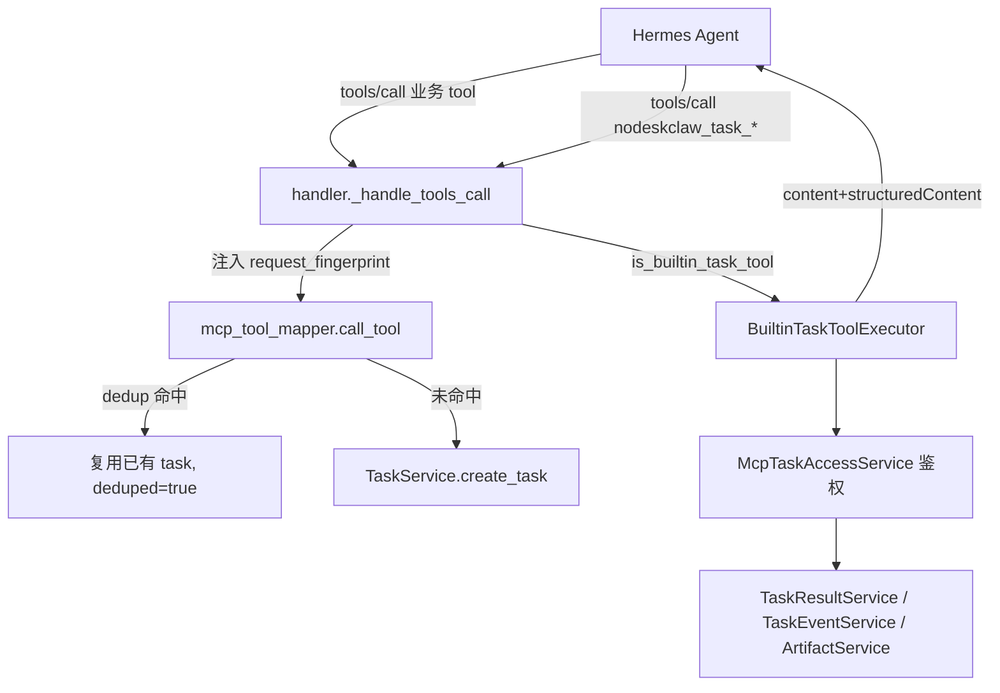

# NoDeskClaw v5.7 — MCP Gateway Task/Pull 工具实施

按 PRD [docs_prd/team_v5.7_mcp-gateway-task.md](docs_prd/team_v5.7_mcp-gateway-task.md) 全量实施。后端复用现有 service，不经 HTTP 自调用 REST。无 DB migration（dedup 走 `client_context.request_fingerprint` JSONB 查询）。

## 前端表现变化

本次改动无前端表现变化（不改 Hermes WebUI，不改 NoDeskClaw Portal）。仅后端 MCP Gateway 能力扩展与 Router Skill 模板（SKILL.md 文本）更新。PRD 第 23 节列出的 Portal 可选增强本次不做。

## 关键现状（已确认）

- MCP 入口：[handler.py](nodeskclaw-backend/app/services/mcp_skill_gateway/handler.py) `dispatch()` → `_handle_tools_list` / `_handle_tools_call`，已带 `auth_ctx: McpAuthContext`。
- `McpAuthContext`（[auth.py](nodeskclaw-backend/app/services/mcp_skill_gateway/auth.py)）已含 `auth_type / mcp_client_token_id / profile / workspace_id / scopes / allowed_skills / hermes_agent_id`。仅缺 token_prefix，需补 `mcp_client_token_prefix`（dataclass 字段，无 migration）。
- 业务任务创建在 [mcp_tool_mapper.py](nodeskclaw-backend/app/services/hermes_skill/mcp_tool_mapper.py) `call_tool()` → `TaskService.create_task(client_context=...)`。
- 可复用：`TaskService.get_task`、`TaskEventService.get_events`、`TaskResultService.get_result`（已返回 timeline/server_artifacts/artifact_status/kb_status/artifact_mode=pull_only）、`ArtifactService.preview/download/get_artifact`、`ServerArtifactService.to_server_artifact_dict`。
- MCP 响应辅助：[errors.py](nodeskclaw-backend/app/services/mcp_skill_gateway/errors.py) `mcp_success / mcp_error_v2 / map_app_error`，错误码表 `_ERROR_CODES` / `_MESSAGE_KEY_MAP`。
- 审计：`SkillAuditLogger(db).log(action=..., target_id=..., org_id=..., actor_id=..., details=...)`。

## 数据流

## 实施步骤

### 1. 配置项（[config.py](nodeskclaw-backend/app/core/config.py)）
在 Hermes Task 段附近新增（沿用现有 `bool`/`int` 模式）：
`MCP_TASK_TOOLS_ENABLED=True`、`MCP_TASK_WAIT_ENABLED=True`、`MCP_TASK_WAIT_MAX_SECONDS=60`、`MCP_TASK_PREVIEW_MAX_CHARS=50000`、`MCP_TASK_DEDUP_ENABLED=True`、`MCP_TASK_DEDUP_WINDOW_SECONDS=600`。

### 2. 内置工具定义（新增 `builtin_task_tools.py`）
定义 `BUILTIN_TASK_TOOLS`（6 个 tool 的 name/description/inputSchema/annotations，input schema 按 PRD 第 8-13 节），并提供：
- `is_builtin_task_tool(name) -> bool`
- `list_builtin_task_tool_descriptors() -> list[dict]`（按 `MCP_TASK_TOOLS_ENABLED` / `MCP_TASK_WAIT_ENABLED` 过滤；task_wait 仅在 wait 开启时返回）。

### 3. Task/Artifact 访问鉴权（新增 `mcp_task_access_service.py`）
- `assert_can_access_task(task_id, auth_ctx) -> HermesTask`：校验 org 一致、未软删；`user_jwt` 走 `PermissionChecker.require_permission(hermes_task:view)`；`mcp_client_token` 校验 `client_context.mcp_client_token_id == auth_ctx.mcp_client_token_id`，历史任务 fallback（`user_id` / `client_context.hermes_agent_id` / `profile_id`），并校验 `tool_name ∈ allowed_skills`（allowed_skills 为空=不限）。失败抛 `ForbiddenError("...", "errors.task.forbidden")`，不存在抛 `NotFoundError("...", "errors.task.not_found")`。
- `assert_can_access_artifact(artifact_id, auth_ctx) -> HermesArtifact`：org 一致 + 未软删 + 其 `task_id` 通过 `assert_can_access_task`。

### 4. 执行器（新增 `builtin_task_tool_executor.py`）
`BuiltinTaskToolExecutor(db).call(tool_name, arguments, auth_ctx) -> dict`（返回 MCP result：`content`[text 中文摘要] + `structuredContent` + `isError`）。各工具：
- `nodeskclaw_task_timeline`：access → `TaskEventService.get_events` → items + `next_action`（PRD 8.4 状态映射）。
- `nodeskclaw_task_result`：access → `TaskResultService.get_result` → 包装 `ready/next_action/message/poll_after_seconds`；failed/timeout/cancelled 返回 `error` 块。
- `nodeskclaw_task_artifacts`：access → `task.server_artifacts`（空则 materialized 动态生成）；`server_only=false` 时附 discovery artifacts（不含 host path/object_key）。
- `nodeskclaw_artifact_preview`：access artifact → `ArtifactService.preview` → 按 `max_chars`（受 `MCP_TASK_PREVIEW_MAX_CHARS` 上限）截断，二进制返回 `preview_unsupported`。
- `nodeskclaw_artifact_download_info`：access artifact → 返回 download_url + `requires_portal_auth=true` + suggested_workspace_path（v5.7 不启用 signed）。
- `nodeskclaw_task_wait`：循环 `asyncio.sleep(poll_interval)` 至 completed 或超时（受 `MCP_TASK_WAIT_MAX_SECONDS` 限制），复用 result 逻辑。
每次调用写 `SkillAuditLogger` 审计（PRD 第 22 节 action：`mcp.task.timeline.viewed` 等），details 不含完整 token。

### 5. 错误码映射（[errors.py](nodeskclaw-backend/app/services/mcp_skill_gateway/errors.py)）
`_MESSAGE_KEY_MAP` 新增 `errors.task.not_found → MCP_TOOL_NOT_FOUND`、`errors.task.forbidden → MCP_TOOL_PERMISSION_DENIED`、`errors.artifact.not_found → MCP_TOOL_NOT_FOUND`、`errors.artifact.forbidden → MCP_TOOL_PERMISSION_DENIED`。

### 6. handler 接入（[handler.py](nodeskclaw-backend/app/services/mcp_skill_gateway/handler.py)）
- `_handle_tools_list`：`MCP_TASK_TOOLS_ENABLED` 时把 `list_builtin_task_tool_descriptors()` 合并进返回（对 `mcp_client_token` 也可见，不受 `allowed_skills` 过滤）。
- `_handle_tools_call`：在 genehub/hermes/mapper 分支前加 `is_builtin_task_tool` 分支 → `BuiltinTaskToolExecutor.call(...)` → `mcp_success` 包装；异常走 `map_app_error`。并让内置 task 工具豁免 `mcp_client_token` 的 `allowed_skills` 拒绝（623-627 行附近）。task 查询工具不创建 HermesTask。
- client_context 增强：新增 `_build_mcp_client_context(headers, auth_ctx)`，在 header 基础上合并 `source="mcp_skill_gateway"`、`auth_type`、`mcp_client_token_id`、`mcp_client_token_prefix`、`hermes_agent_id`、`mcp_profile`、`mcp_workspace_id`、`mcp_client_name`（不写完整 token/Authorization）。

### 7. McpAuthContext 增强（[auth.py](nodeskclaw-backend/app/services/mcp_skill_gateway/auth.py)）
dataclass 新增 `mcp_client_token_prefix: str | None`，`resolve_mcp_client_token` 用 `record.token_prefix` 填充。

### 8. Dedup 防护（新增 `mcp_task_dedup_service.py` + 改 `call_tool`）
- `build_mcp_task_dedup_key(org_id, auth_ctx_ctx, tool_name, arguments)`：`sha256(org_id + token_id/prefix/user_id/hermes_agent_id + tool_name + canonical_json(arguments))`。
- `find_dedupe_task(org_id, fingerprint)`：查 `hermes_tasks` org_id + status∈(queued/accepted/running/completed) + `created_at > now-window` + `client_context->>'request_fingerprint' == fingerprint`（JSONB），取最近一条。
- handler 计算 fingerprint 注入 `client_context["request_fingerprint"]`；`mcp_tool_mapper.call_tool` 在 `create_task` 前若 `MCP_TASK_DEDUP_ENABLED` 且命中则返回已有任务（`deduped=true`，结构同正常返回），并审计 `mcp.task.dedup.hit`；新建则审计 `mcp.task.dedup.created`。

### 9. Router Skill 模板（[router_skill_template_service.py](nodeskclaw-backend/app/services/hermes_agents/router_skill_template_service.py)）
`render_router_skill_md()`：弱化旧「调用完成后直接输出业务结果」，新增「异步任务处理规则」「最终结果展示规则」（PRD 17.2/17.3 原文），明确禁止重复调用业务 tool、禁止猜测 localhost/8080/8642/REST、必须用 `nodeskclaw_task_timeline/result/artifacts` + `nodeskclaw_artifact_preview`。注意保持 `FORBIDDEN_CONTENT_FRAGMENTS` 校验通过（不含 token 字样）。

### 10. 测试（新增 4 个测试文件）
`tests/services/mcp_skill_gateway/test_builtin_task_tools.py`、`test_mcp_task_access_service.py`、`test_mcp_task_dedup.py`、`tests/api/test_mcp_task_tools.py`，覆盖 PRD 第 26 节：tools/list 含新工具、timeline、result（running/completed/failed）、preview 截断、跨 token 403、dedup 命中只建一个 task。

## 验证
`uv run ruff check .` + `uv run pytest tests/services/mcp_skill_gateway/ tests/api/test_mcp_task_tools.py -q`。

## 范围外 / 后续运维（不写代码）
- Router Skill 同步到已安装 Hermes Agent（PRD Task 9 / 28.2）：实施后由用户走 `mcp-skill-router/sync` 重新同步。
- 部署/重启 backend、端到端验证（PRD 第 28 节）。
- 涉及 Agent 行为/Skill 文本变更，按工作区规则评估 Gene/Skill 同步（Router Skill 走 `McpSkillRouterService`，非 gene 路径）。