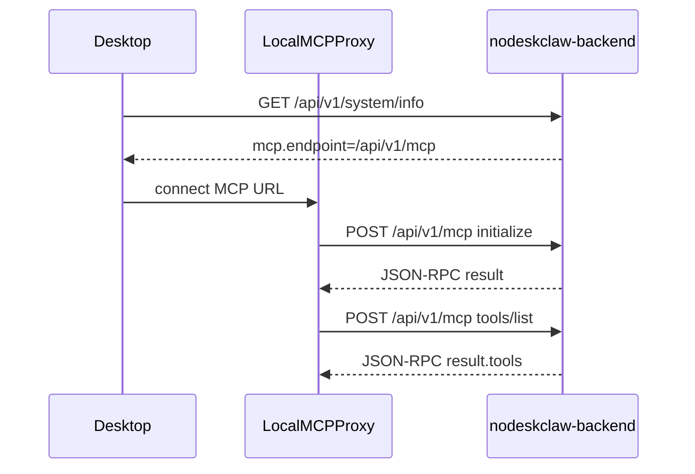

# MCP Skill Gateway Backend 修复计划

## 背景与根因

依据 [docs_prd/v6.4.1_hotfix_mcp-backend-desktop.md](docs_prd/v6.4.1_hotfix_mcp-backend-desktop.md) 与代码调研：

- Desktop 期望调用 **`POST /api/v1/mcp`**（JSON-RPC 裸响应），但 backend **不存在该路由**。
- 现有最接近实现是 [`nodeskclaw-backend/app/api/hermes_skill/mcp_router.py`](nodeskclaw-backend/app/api/hermes_skill/mcp_router.py)（路径为 `/api/v1/hermes/mcp`），已有 `tools/list` + `McpToolMapper` 权限过滤，但缺少 `initialize`、结构化 `error.data.errorCode`、以及认证失败时的 JSON-RPC 格式响应。
- 另一套 [`nodeskclaw-backend/app/api/gateway/proxy_router.py`](nodeskclaw-backend/app/api/gateway/proxy_router.py) 是**实例上游 MCP 代理**（需 `instance_id`、响应包在 `{code, message, data}`），语义与 Desktop Skill Gateway 不同，**不应复用**。



---

### 前端表现变化

本次改动无前端表现变化（纯 backend API；Desktop UI / Local MCP Proxy 不在本仓库范围）。

---

## 实现策略

**新建独立 MCP Skill Gateway 模块**，将 JSON-RPC 协议层与 Hermes 业务层解耦；`/api/v1/hermes/mcp` 委托同一 handler，避免双份逻辑（符合同源逻辑同步规则）。

权限链路 PRD 术语 `mcp_skill` / `mcp_tool` 在代码中对应：
- `HermesSkill`（`is_mcp_exposed`、`tool_name`、`input_schema`）
- `OrgMemberSkillGrant`（`can_list` / `can_invoke`）
- `HermesSkillInstallation`（`status=installed`）
- `PermissionChecker`（`skill:view` / `skill:invoke`）

现有 [`McpToolMapper.list_tools()`](nodeskclaw-backend/app/services/hermes_skill/mcp_tool_mapper.py) 已实现 FR-BE-005 核心过滤，**直接复用**。

---

## 改动清单

### 1. 新增 MCP Skill Gateway 服务层

**新建** `nodeskclaw-backend/app/services/mcp_skill_gateway/`：

| 文件 | 职责 |
|------|------|
| `errors.py` | 定义 PRD 错误码常量与 `_mcp_error(id, error_code, reason)` 工厂，确保 `error.data.errorCode` 存在 |
| `auth.py` | 从 `Authorization: Bearer` 解析 JWT，返回 `(user, org)` 或 `MCP_UNAUTHORIZED`；**不抛 HTTPException** |
| `session.py` | 轻量 initialize 会话（进程内 `dict`，key=`user_id:org_id`）；`initialize` 写入，`tools/list` 可选校验 |
| `handler.py` | JSON-RPC 分发：`initialize` / `tools/list` / `tools/call`（call 可委托现有 mapper，hotfix 范围以 list 为主） |

**错误码映射**（FR-BE-006）：

| errorCode | JSON-RPC code |
|-----------|---------------|
| MCP_UNAUTHORIZED | -32001 |
| MCP_FORBIDDEN | -32003 |
| MCP_INITIALIZE_REQUIRED | -32010 |
| MCP_TOOLS_LIST_FAILED | -32011 |
| MCP_GATEWAY_REQUEST_FAILED | -32012 |
| MCP_METHOD_NOT_FOUND | -32601 |
| MCP_INVALID_REQUEST | -32600 |
| MCP_INTERNAL_ERROR | -32603 |

**日志**：每次错误 `logger.warning` 记录 `errorCode`、`userId`、`orgId`、`method`（FR-BE-006）。

**initialize 响应**（FR-BE-003）：
- `protocolVersion`: `"2025-06-18"`
- `capabilities.tools.listChanged`: `true`
- `serverInfo.name`: `"nodeskclaw-mcp-skill-gateway"`
- `serverInfo.version`: `settings.APP_VERSION`

**tools/list 策略**（FR-BE-004/005）：
- 有 token、有组织上下文：调用 `McpToolMapper.list_tools(org.id, user.id)`
- 无 skill 授权：返回 `{"tools": []}`（不用 generic failed）
- 权限不足（非组织成员）：`MCP_FORBIDDEN`
- 内部异常：`MCP_TOOLS_LIST_FAILED`（带 reason，禁止 `"MCP gateway request failed"` 裸文案）

> **initialize 门禁**：PRD 错误表含 `MCP_INITIALIZE_REQUIRED`，但 `tools/list` 验收未强制先 initialize。hotfix 采用**宽松模式**：`tools/list` 不强制 initialize（优先保证 Desktop 联调通过）；`initialize` 仍正常写入 session 供后续严格化。

---

### 2. 新增 API 路由

**新建** [`nodeskclaw-backend/app/api/mcp_skill_gateway/router.py`](nodeskclaw-backend/app/api/mcp_skill_gateway/router.py)：

- `POST /mcp` — 读取 raw body，手动认证，调用 `handler.dispatch()`，返回 **裸 JSON-RPC dict**（非 `{code, message, data}` 包装）
- `GET /mcp/health` — 返回 `{"status": "ok"}`

**修改** [`nodeskclaw-backend/app/api/router.py`](nodeskclaw-backend/app/api/router.py)：
- `api_router.include_router(mcp_skill_gateway_router, tags=["MCP Skill Gateway"])`

**认证要点**（FR-BE-002）：
- endpoint **不使用** `Depends(require_org_member)`（会抛 REST 格式 401）
- 在 handler 内调用 `auth.resolve_mcp_user()`，无/无效 token 返回：

```json
{
  "jsonrpc": "2.0",
  "id": "<from body>",
  "error": {
    "code": -32001,
    "message": "MCP_UNAUTHORIZED",
    "data": { "errorCode": "MCP_UNAUTHORIZED", "reason": "Missing or invalid Authorization header" }
  }
}
```

---

### 3. system/info 增加 MCP descriptor

**修改** [`nodeskclaw-backend/app/api/router.py`](nodeskclaw-backend/app/api/router.py) 的 `system_info()`（FR-BE-001）：

在现有 `{edition, version, features}` 同级新增 `mcp` 字段（**保持现有扁平结构**，不引入 `success/data` 包装，避免破坏 Desktop 已可用的 `/system/info` 解析）：

```python
"mcp": {
    "enabled": True,
    "name": "Coding MCP Gateway",
    "transport": "streamable_http",
    "endpoint": "/api/v1/mcp",
    "healthEndpoint": "/api/v1/mcp/health",
    "requiresAuth": True,
    "protocolVersion": "2025-06-18",
}
```

---

### 4. 同源逻辑：Hermes MCP 路由委托

**修改** [`nodeskclaw-backend/app/api/hermes_skill/mcp_router.py`](nodeskclaw-backend/app/api/hermes_skill/mcp_router.py)：
- 将现有 inline 逻辑替换为调用 `mcp_skill_gateway.handler.dispatch()`
- 保持 `/api/v1/hermes/mcp` 向后兼容，行为与 `/api/v1/mcp` 一致

---

### 5. 测试

**新建** `nodeskclaw-backend/tests/mcp_skill_gateway/`：

| 测试 | 覆盖 |
|------|------|
| `test_system_info_mcp_descriptor.py` | FR-BE-001 |
| `test_mcp_auth.py` | 无 token / 无效 token → MCP_UNAUTHORIZED |
| `test_mcp_initialize.py` | FR-BE-003 |
| `test_mcp_tools_list.py` | 有授权返回 tools、无授权返回 `[]`、不同用户结果不同 |
| `test_mcp_errors.py` | 非法 jsonrpc、未知 method → 结构化 errorCode |

复用现有 [`tests/hermes_skill/test_mcp_tools_list.py`](nodeskclaw-backend/tests/hermes_skill/test_mcp_tools_list.py) 对 `McpToolMapper` 的覆盖，gateway 层测试聚焦协议与认证。

---

### 6. 文档

- **EE 设计文档**（按 docs-first-workflow）：更新 `ee/docs/后端架构设计.md` 新增 MCP Skill Gateway 章节（endpoint、错误码、权限链）。若本地无 `ee/` 仓库，实现阶段提醒用户同步 EE 文档。
- **验收脚本**：在 PRD 同目录或 `nodeskclaw-backend/README.md` 追加 §4 验收 curl 命令（Windows `^` 转义版 + bash 版）。

---

## 不在本次范围

按 PRD §6：Desktop UI、Electron IPC、Local MCP Proxy 生命周期、Hermes Agent 本地配置、Desktop tools 缓存。

`/api/v1/gateway/mcp` 实例代理行为不变。

---

## 验收标准（与 PRD §4 对齐）

1. `GET /api/v1/system/info` → `mcp.endpoint` 存在，`transport=streamable_http`
2. `POST /api/v1/mcp` + 有效 token + `initialize` → 返回 `protocolVersion` + `serverInfo`
3. `POST /api/v1/mcp` + 有效 token + `tools/list` → `result.tools` 为数组（非 null）
4. 无 Authorization → `error.data.errorCode=MCP_UNAUTHORIZED`，非 generic failed
5. 后端日志含 `errorCode` / `userId` / `orgId` / `method`

---

## 风险与注意点

- **响应格式**：MCP endpoint 必须返回裸 JSON-RPC；不可走 gateway proxy 的 `{code, message, data}` 包装。
- **Accept 头**：PRD 要求 `Accept: application/json, text/event-stream`；hotfix 先以 JSON 响应满足联调，SSE 流式可作为后续迭代。
- **多 Agent 协作**：提交时只 `git add` 本次 MCP gateway 相关文件，避免混入 `wiki/`、`docs_prd/` 等待跟踪文件。
