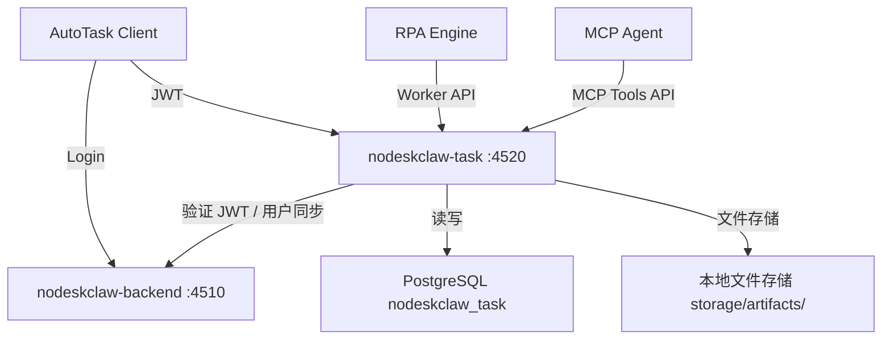
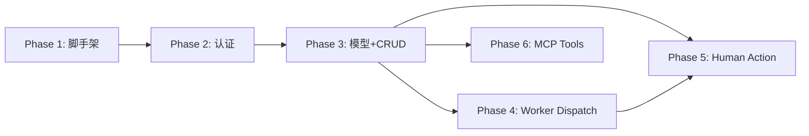

# nodeskclaw-task 后端项目实施计划

## 前端表现变化

本次改动为纯后端新项目搭建，无前端表现变化。前端（AutoTask Client）对接将在后续迭代中进行。

## 架构概览



## 技术基线

复用 `nodeskclaw-backend` 的技术栈和模式：

- Python 3.12 + FastAPI + SQLAlchemy asyncio + asyncpg + Alembic
- pydantic-settings 管理配置（`.env`）
- [BaseModel](nodeskclaw-backend/app/models/base.py)：UUID pk + timestamps + soft delete
- [AppException](nodeskclaw-backend/app/core/exceptions.py)：`error_code` + `message_key` + `message` 三字段错误契约
- JWT 校验复用 `python-jose`，共享 `JWT_SECRET` / `JWT_ALGORITHM`
- 独立数据库 `nodeskclaw_task`，独立 Alembic 迁移链

---

## Phase 1：项目脚手架

创建 `nodeskclaw-task/` 目录，完整的 FastAPI 项目骨架。

### 文件清单

```
nodeskclaw-task/
  pyproject.toml          # 依赖：fastapi, uvicorn, sqlalchemy[asyncio], asyncpg,
                          #        python-jose[cryptography], pydantic-settings, httpx,
                          #        alembic, email-validator
  alembic.ini             # 复制 backend 的，改 script_location
  alembic/
    env.py                # 异步迁移，参考 backend/alembic/env.py
    versions/             # 空
  app/
    __init__.py
    main.py               # FastAPI app, lifespan, CORS, /health
    core/
      __init__.py
      config.py           # Settings(BaseSettings)：DATABASE_URL, JWT_SECRET,
                          #   JWT_ALGORITHM, NODESKCLAW_BACKEND_URL, ARTIFACT_STORAGE,
                          #   ARTIFACT_LOCAL_DIR, CORS_ORIGINS, PORT=4520
      deps.py             # engine, async_session_factory, get_db
      security.py         # decode_token, get_current_user (JWT-only, 无登录)
      exceptions.py       # AppException 层级，复用 backend 模式
      middleware.py        # NoCacheAPIMiddleware
    models/
      __init__.py          # 集中导入所有模型
      base.py              # Base, BaseModel (UUID + timestamps + soft_delete)
    schemas/
      __init__.py
    services/
      __init__.py
    api/
      __init__.py
      router.py            # api_router + worker_api_router，/health
    startup/
      __init__.py
      seed.py              # mock JSON 种子导入（Phase 3 填充）
  tests/
    __init__.py
  .env.example
```

### 关键决策

- `pyproject.toml` 不引入 `kubernetes-asyncio`、`cryptography`、`langgraph` 等 backend 专有依赖，保持精简
- `app/main.py` 的 lifespan 只做：自动迁移 + 种子导入 + 日志配置
- `/health` 端点返回 `{"status": "ok"}`
- 开发端口 4520，API 前缀 `/api/v1/autotask`

### 验收

- `uv run uvicorn app.main:app --port 4520` 可启动
- `GET /health` 返回 ok
- `alembic upgrade head` 可执行（空迁移链）

---

## Phase 2：认证集成

### 2.1 JWT 校验（`app/core/security.py`）

从 `Authorization: Bearer <token>` 读取 token，使用共享的 `JWT_SECRET` + `JWT_ALGORITHM` 解码：

```python
# 关键逻辑（参考 nodeskclaw-backend/app/core/security.py 的 decode_token）
payload = jwt.decode(token, settings.JWT_SECRET, algorithms=[settings.JWT_ALGORITHM])
# 校验 type == "access"
# 读取 sub 作为 user_id
```

### 2.2 用户缓存表（`app/models/user_cache.py`）

```python
class UserCache(BaseModel):
    __tablename__ = "autotask_user_cache"
    user_id: Mapped[str]        # nodeskclaw-backend 的 user.id
    name: Mapped[str]
    email: Mapped[str | None]
    current_org_id: Mapped[str | None]
    org_role: Mapped[str | None]
    is_super_admin: Mapped[bool]
    synced_at: Mapped[datetime]
```

### 2.3 用户同步（`app/services/user_sync.py`）

- 首次请求：本地无缓存 -> 调用 `NODESKCLAW_BACKEND_URL + /api/v1/auth/me`（带原始 JWT）
- 写入 `autotask_user_cache`
- 缓存超过 10 分钟后台刷新
- `get_current_user` 依赖注入返回 `UserCache` 对象

### 2.4 权限检查（`app/core/security.py`）

- `require_tenant_access`：确认用户属于该 tenant（org_id）
- `require_permission`：结合 `PortalAccessGrant` 检查具体权限（Phase 3 模型就绪后接入）

### 验收

- 无 token -> 401
- 错误 token -> 401
- 有效 nodeskclaw JWT -> 通过，返回用户信息
- `current_org_id` 可被正确识别

---

## Phase 3：核心模型与 CRUD

### 3.1 数据模型（`app/models/`）

按 PRD 第 6 章定义，创建 17 张表（含索引）：

| 模型文件 | 表名 | 核心字段 |
|---------|------|---------|
| `portal_account.py` | `portal_accounts` | tenant_id, entity_type, portal_url, login_account |
| `portal_access_grant.py` | `portal_access_grants` | portal_account_id, subject_type, subject_id, permissions |
| `workflow_template.py` | `workflow_templates` | tenant_id, code, status, input_schema, business_steps |
| `workflow_template_version.py` | `workflow_template_versions` | template_id, version, snapshot |
| `workflow_binding.py` | `workflow_bindings` | portal_account_id, workflow_template_id, rpa_flow_id |
| `automation_task.py` | `automation_tasks` | tenant_id, status(状态机), priority, input, progress |
| `task_message.py` | `task_messages` | task_id, role, content |
| `rpa_run.py` | `rpa_runs` | task_id, status, rpa_worker_id, lease_id |
| `step_run.py` | `step_runs` | run_id, step_id, status |
| `run_event.py` | `run_events` | run_id, type, level, message, payload |
| `artifact.py` | `artifacts` | tenant_id, task_id, run_id, type, storage_key |
| `human_action.py` | `human_actions` | task_id, run_id, type, status |
| `rpa_worker.py` | `rpa_workers` | worker_type, status, capabilities |
| `worker_lease.py` | `worker_leases` | task_id, worker_id, lease_expires_at |
| `rpa_component.py` | `rpa_components` | name, type, config |
| `autotask_setting.py` | `autotask_settings` | key, value |
| `audit_log.py` | `audit_logs` | actor_id, action, resource_type, resource_id |

唯一约束使用 Partial Unique Index（`postgresql_where=text("deleted_at IS NULL")`）。

### 3.2 任务状态机（`app/services/task_state_machine.py`）

```
DRAFT -> READY -> QUEUED -> LEASED -> RUNNING
                                       |-> WAITING_HUMAN -> HUMAN_OPERATING -> SUCCESS_MANUAL / RUNNING / FAILED
                                       |-> SUCCESS
                                       |-> PARTIAL_SUCCESS
                                       |-> FAILED
                                       |-> CANCELLED
```

用 dict 定义合法状态转换矩阵，`transition(task, target_status)` 方法校验并执行转换。

### 3.3 Schemas（`app/schemas/`）

每个模型对应 Create / Update / Response schema（Pydantic v2），遵循 `error_code + message_key + message` 错误契约。

### 3.4 CRUD API（`app/api/`）

按 PRD 第 8 章实现所有 Client REST API，路由前缀 `/api/v1/autotask`：

- `dashboard.py` - GET `/dashboard/summary`
- `portal_accounts.py` - CRUD + test-open + access-grants
- `workflow_templates.py` - CRUD + enable/disable
- `workflow_bindings.py` - CRUD + enable/disable
- `tasks.py` - CRUD + submit/start/cancel/retry/mark-success-manual + 关联查询
- `task_messages.py` - 任务消息
- `rpa_runs.py` - Run 查看 + events + step-runs
- `human_actions.py` - pending/open/confirm/cancel
- `artifacts.py` - 列表/详情/download-url/upload-url
- `rpa_workers.py` - 列表/详情

### 3.5 Alembic 初始迁移

模型全部就绪后执行 `uv run alembic revision --autogenerate -m "初始化 AutoTask 全量表"`。

### 验收

- 所有 CRUD 端点可通过 Postman/curl 测试
- 创建任务写入数据库
- 任务详情可读取关联 workflow / portal / run / event

---

## Phase 4：Worker Dispatch（`app/api/rpa_dispatch.py`）

按 PRD 第 9 章实现 RPA Worker API，路由前缀 `/api/v1/autotask/worker-api`：

| 端点 | 功能 |
|------|------|
| `POST /workers/register` | Worker 注册（upsert） |
| `POST /workers/{workerId}/heartbeat` | 心跳续约 |
| `POST /tasks/lease` | 任务领取（原子锁 + lease 记录） |
| `POST /tasks/{taskId}/lease/renew` | 续租 |
| `POST /runs/{runId}/events` | 上报事件 |
| `POST /runs/{runId}/artifacts` | 上报 Artifact |
| `POST /runs/{runId}/finish` | 完成 Run |

### 关键实现

- **任务领取**：`SELECT ... FOR UPDATE SKIP LOCKED` 原子领取，防止重复分配
- **Lease 机制**：`worker_leases` 表记录 lease_id + expires_at，超时自动释放
- **事件上报**：写入 `run_events` 表，触发任务状态机流转
- **Artifact 上报**：写入 `artifacts` 元数据，文件存储到 `storage/artifacts/{tenantId}/{taskId}/{runId}/`

### 验收

- Worker 可注册和心跳
- Worker 可领取 QUEUED 任务，任务变 LEASED -> RUNNING
- 重复 Worker 不会拿到同一任务
- 事件上报后前端可看到
- Run finish 后任务状态正确流转

---

## Phase 5：Human Action

### 服务层（`app/services/human_action_service.py`）

- RPA 或业务规则触发 `WAITING_HUMAN` 时，自动创建 `HumanAction` 记录
- 用户 open -> 任务变 `HUMAN_OPERATING`
- 用户 confirm -> 根据类型决定变 `SUCCESS_MANUAL` 或恢复 `RUNNING`
- 用户 cancel -> 任务变 `FAILED` 或保持 `WAITING_HUMAN`

### 验收

- `WAITING_HUMAN` 任务出现在 pending 列表
- 用户 open 后任务变 `HUMAN_OPERATING`
- 用户 confirm 后任务变 `SUCCESS_MANUAL` 或恢复 `RUNNING`

---

## Phase 6：MCP Tools API（`app/api/mcp.py`）

按 PRD 第 10 章实现 MCP 接口，路由前缀 `/api/v1/autotask/mcp`：

| Tool | 功能 |
|------|------|
| `autotask.portal.search` | 搜索 Portal Account |
| `autotask.portal.get` | 获取 Portal 详情 |
| `autotask.workflow.list` | 列出工作流模板 |
| `autotask.task.create` | 创建任务 |
| `autotask.task.get` | 获取任务详情 |
| `autotask.task.get_status` | 获取任务状态 |
| `autotask.task.list_messages` | 列出任务消息 |
| `autotask.human_action.list_pending` | 列出待人工操作 |
| `autotask.human_action.confirm` | 确认人工操作 |
| `autotask.artifact.list` | 列出产物 |

MCP 接口走 `tools/list` + `tools/call` 标准协议，必须验证 JWT 或 service token，不绕过 `PortalAccessGrant`。

---

## Phase 0（贯穿）：Seed 数据

`app/startup/seed.py` 支持从 mock JSON 导入种子数据。在 lifespan 中幂等执行。

---

## 实施顺序与依赖关系



Phase 1-3 是串行依赖，Phase 4/5/6 在 Phase 3 完成后可并行推进（但 Phase 5 依赖 Phase 4 的状态机扩展）。
