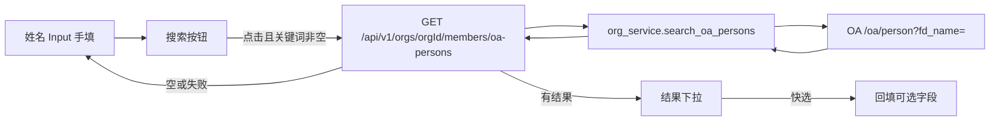

# 快速创建成员：姓名手填 + OA 搜索快选

## 现状（以当前组件为准）

[`CreateHumanMemberDialog.vue`](nodeskclaw-portal/src/components/members/CreateHumanMemberDialog.vue) 全部字段都是手工录入：

- 第 136 行：`name` 是普通 `Input`，没有搜索、没有下拉
- 工号 / 邮箱 / 用户名 / 部门 / 岗位 各自独立输入
- 同弹窗里「默认密码」已是 **输入框 + 小按钮**（生成密码），姓名搜索复用这个布局，不要改成输入即查的 combobox

校验仍只要求姓名、邮箱、默认密码非空；OA 搜索不是提交前置条件。

## 前端表现变化

### 1. 成员管理 - 快速创建人类成员弹窗

**总结**: 姓名仍可手填；右侧新增「搜索」小按钮，用当前姓名关键词查 OA；有结果时下拉快选并回填其它字段；无结果或报错不锁表单，用户继续手填。

**元素级变化**:
- 姓名输入框: **保持**可编辑文本框（不改成只能选下拉）
- 「搜索」按钮: **新增**，紧贴姓名输入框右侧，样式对齐「生成密码」outline 小按钮
- 搜索按钮 loading: 请求中显示旋转图标并 disabled，防止连点
- 结果下拉: **新增**，仅在本次搜索成功且 `data.length > 0` 时出现；选项展示「姓名 + 工号」
- 选中某条: 关闭下拉；回填姓名/工号/邮箱/用户名/部门/岗位；回填后这些字段**仍可改**
- 接口空数组: 不弹出选项列表；toast 提示未找到；姓名及后续字段保持现状，可继续手填
- 接口报错 / OA 未配置: toast 提示（含下一步指引）；不清空已填内容；不禁用任何输入和「创建」
- 工号/邮箱/用户名/部门/岗位: 仍是普通输入框，不是搜索入口
- 不在输入过程中自动请求（无 debounce 即查）

**改动前**:
```
姓名   [________________]
工号   [________________]
邮箱   [________________]
用户名 [________________]
密码   [________] [生成密码]
...
```

**改动后**:
```
姓名   [王冬辉________] [搜索]
       ┌──────────────────────┐   <- 仅搜索成功且有结果时
       │ 王冬辉  SMC-SZ-HR21007 │
       │ 王冬    SMC-SZ-HR21008 │
       └──────────────────────┘
工号   [SMC-SZ-HR21007]           <- 快选后自动填，仍可改
邮箱   [wangdonghui@...]
用户名 [smc-sz-hr21007]            <- fd_no 全小写
部门   [IT部]
岗位   [开发经理]
```

空结果或报错时没有下拉，整表仍可手填后点「创建」。

## 技术设计

浏览器不能直连 OA `http://` 人员接口（CORS + HTTPS mixed content）。后端 BFF 代理，OA 地址走环境变量，不写死在前端。



### 交互规则

1. 点击搜索：用 `name.trim()` 作为 `q`；为空则 toast 提示先输入姓名，不发请求
2. 有结果：打开下拉，不改当前表单，直到用户点选
3. 点选：按映射表赋值，然后关下拉
4. 空结果 / 失败：关下拉（或不打开）、toast、表单可继续编辑并提交
5. 关闭弹窗或再次搜索：清掉上一次下拉列表，避免旧结果误选

### 字段映射（仅快选后）

- `employeeNo` = `fd_no`
- `name` = `fd_name`
- `email` = `fd_email`
- `username` = `fd_no.toLowerCase()`（保留数字和连字符，仅转小写）
- `department` = `fd_department`
- `jobTitle` = `fd_staff`

手机号等未映射字段不展示、不入库。手填路径不走这张映射表。

### 后端

- Settings 增加 `OA_PERSON_API_URL`（人员搜索完整 URL）。未配置时返回 `error_code` + `message_key=errors.org.oa_person_not_configured`，文案指引去配环境变量。前端把它当普通失败 toast，不锁表单。
- 新接口：`GET /api/v1/orgs/{org_id}/members/oa-persons?q=`，权限与创建成员相同（`require_org_admin`）。
- `q` 为空或纯空白：返回空列表，不打 OA。
- Service 用 httpx 请求 `{OA_PERSON_API_URL}?fd_name={q}`，校验 `code == 1`，映射精简 DTO（`fd_no` / `fd_name` / `fd_email` / `fd_department` / `fd_staff`），不回传手机号。
- OA 超时/非 200/`code != 1`：统一失败契约。
- 单测 mock httpx：映射、空查询、未配置 URL、上游失败。

改动文件：
- [`nodeskclaw-backend/app/core/config.py`](nodeskclaw-backend/app/core/config.py)
- [`nodeskclaw-backend/app/api/organizations.py`](nodeskclaw-backend/app/api/organizations.py)
- [`nodeskclaw-backend/app/services/org_service.py`](nodeskclaw-backend/app/services/org_service.py)
- 组织成员 schemas
- 测试

### 前端

不把姓名换成 combobox。在现有姓名行复用密码行的 `flex gap-2` 布局。

- 修改 [`CreateHumanMemberDialog.vue`](nodeskclaw-portal/src/components/members/CreateHumanMemberDialog.vue)：
  - 姓名：`Input` + `Button`（搜索）
  - 本地状态：`oaResults`、`oaSearching`、`oaDropdownOpen`
  - 点击搜索调用 store；成功有数据则展开自定义 button 列表（禁止原生 select）
  - `onSelect` 按映射表赋值
- [`memberManagement.ts`](nodeskclaw-portal/src/stores/memberManagement.ts)：`searchOaPersons(q)` 调后端，不直连 OA
- 若下拉 UI 超过十几行，可抽 [`OaPersonResultList.vue`](nodeskclaw-portal/src/components/members/OaPersonResultList.vue)；否则留在弹窗内
- i18n：搜索按钮、请先输入姓名、未找到人员、搜索失败、OA 未配置

### 文档

- backend README 补充 `OA_PERSON_API_URL`
- 实现后更新 `lat.md/` 并跑 `lat check`

## 范围外

- 不做输入即查 / debounce 自动搜索
- 不改「邀请成员」流程
- 不把 OA 手机号写入成员资料
- 不在前端写死 OA 域名
- 搜索失败不阻止点「创建」
