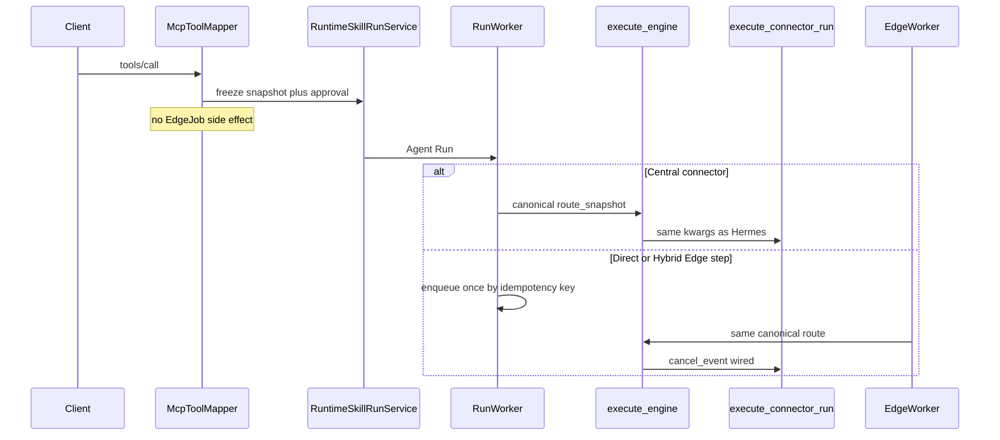

# RM-05 Connector Runtime Execution Closure 实施计划

Canonical 落盘路径：[`.cursor/plans/rm-05_connector_runtime_execution.plan.md`](rm-05_connector_runtime_execution.plan.md)

`commit_policy: post_review`。执行顺序：`Execute -> Review -> Verification -> Commit Implementation`。Todo 完成不得 commit。跨边界流非 None，且含 REPLACE / Integration Hotspot / Secret-Trust，Execute 前必须 `smc-plan-review` PASS。

## 前端表现变化

本次改动无前端表现变化。不改 Portal / Admin / Work 页面、按钮、文案或路由。员工仍只通过 Backend Catalog / `tools/call` / Run API 调用 Connector。

## Approved PRD

[Approved PRD](../../docs_agent/prd-v1.6.4-connector-runtime-execution-closure.md)

## Scope

- In: 冻结 Connector Route Snapshot；统一 AgentEnginePort 到 REST/MCP/DB Adapter；Direct/Hybrid 单次 EdgeJob 派发；服务端强制审批；SecretRef opaque ID 不被脱敏破坏；Central 公网默认 / Edge Trust Allowlist；可证明的 DB 只读；取消进入 Adapter；经真实 Port 的自动化验证；`lat.md` 同步。
- Out: 新 Connector 服务、第二 Run 状态机、Work 前端、RM-06 Session/ContextBuilder、RM-07 Edge Identity、RM-08/09 合同、RM-10 OpenTelemetry、宣称 RM-04 Docker/多 Central/MinIO/Newman 两连跑已完成。
- Production Owner inherited from PRD: Backend Connector/Catalog/SkillRelease（C02/C03/C04/C05/C09）；Agent Engine Port + Connector Adapter（C01/C06/C07/C08）；Agent Run Worker（C03）；Agent Run/Event Fencing KEEP（C08）；Backend Contract Package KEEP（C10）。

Plan 级冻结（不改 PRD 语义）:

- Canonical Connector route 是顶层含 `connector_kind` / tool / placement / `connector_secret_ref_id` / network_policy / 非明文 config 的冻结对象；Agent 持久化可继续放在 `snapshot.runtime_policy`，但 Central/Edge 传给 Port 时只传该对象，禁止「完整 Snapshot 再嵌套 runtime_policy」第二种读法。
- Direct Edge：Central 仍可 claim（`placement.role=edge` 不再被 SQL 排除到无人认领），但 `_execute` 不本地调用 Adapter，只经既有 `/api/v1/internal/edge/jobs/enqueue` 以 `idempotency_key=run_id:attempt_id:generation:step_id` 请求一次。
- Mapper `_call_connector_tool` 在 `RuntimeSkillRunService.start` 后不得 `EdgeJob()` / `db.add`。
- Trust Zone/Allowlist 冻结进 Snapshot（复用 `instance.config` JSONB），不加列、不新建 Policy 服务。
- `execute_engine` 签名 KEEP；Adapter 对齐为 `route_snapshot`/`org_id`/`cancel_event`。
- Skill Run v1.0/v1.1/v1.2 目录/Tag/checksum KEEP；不新增公共合同字段。



## Grounding Evidence Ledger

| Change ID | Target | Baseline State | Symbol / Entry Resolution | Caller / Callee Evidence | Existing Reuse Search | Result |
|---|---|---|---|---|---|---|
| C01 | `nodeskclaw-agent/app/services/connector_router.py#execute_connector_run` | CONFLICT at `8ed46fc3` | Port 传 `route_snapshot`/`org_id`/`cancel_event`；Adapter 只收 `snapshot` | `RunWorker#_execute` / `EdgeWorker#_execute_job` -> `execute_engine` -> Adapter | Hermes Adapter 已用同款 kwargs；对齐签名即可，不新建 Port | PASS |
| C02 | `nodeskclaw-backend/app/services/hermes_skill/runtime_skill_run_service.py#RuntimeSkillRunService#_resolve_placement` | CONFLICT at `8ed46fc3` | 只返回 `role/engine`；无 `connector_bindings` 描述符 | Mapper/outbox -> Agent `build_snapshot`；Worker `build_hybrid_step_plan` 读 bindings | 扩展现有 `_resolve_placement`/`_enrich_route_snapshot`；不新建 Snapshot Service | PASS |
| C03 | `nodeskclaw-backend/app/services/hermes_skill/mcp_tool_mapper.py#McpToolMapper#_call_connector_tool` | CONFLICT at `8ed46fc3` | `start()` 后直建 `EdgeJob` | 与 Worker enqueue 平行；`EdgeNodeService.enqueue_edge_job` 已幂等 | REMOVE Mapper 副作用；复用既有 enqueue 端点 | PASS |
| C04 | `nodeskclaw-backend/app/services/hermes_skill/runtime_skill_run_service.py#RuntimeSkillRunService#_enqueue_agent_run_outbox` | PARTIAL at `8ed46fc3` | `requires_approval` 只读 `client_context` | Catalog 已投影 `requiresApproval`；`create_run` 已支持 `WAITING_APPROVAL` | 服务端 max 策略写入 outbox；不新建审批 Owner | PASS |
| C05 | `nodeskclaw-agent/app/services/run_service.py#_sanitize_sensitive_keys` | CONFLICT at `8ed46fc3` | 键名含 `secret` 整段 `[REDACTED]` | `build_snapshot` 调它；Adapter/`SecretStore` 需 opaque ID | 白名单保留 `*_secret_ref_id`；`ConnectorService` 拒明文 config | PASS |
| C06 | `nodeskclaw-agent/app/services/connector_router.py#_validate_ssrf` | PARTIAL at `8ed46fc3` | 字面 IP 私网全拒；非 IP 主机跳过；无 Trust Zone | Adapter REST/MCP 调用；Edge 合法内网被误杀 | Snapshot 冻结 allowlist；`getaddrinfo` + 每跳复核；不新建 Policy 服务 | PASS |
| C07 | `nodeskclaw-agent/app/services/connector_router.py#execute_connector_run` | PARTIAL at `8ed46fc3` | `SELECT/WITH` 前缀；忽略只读事务失败；AUTOCOMMIT | 仅 Adapter DB 分支 | 同一方法内证明只读事务 + 单语句/写 CTE 拒绝 | PASS |
| C08 | `nodeskclaw-agent/app/services/connector_router.py#execute_connector_run` | PARTIAL at `8ed46fc3` | 不接收 `cancel_event` | Worker/Edge 已产生 cancel；`append_event`/`aggregate_run_terminal` 已有 Fencing | Adapter 接入 cancel；迟到终态 KEEP 既有 Fencing | PASS |

## Requirement Coverage Ledger

| Requirement | Source | Obligation | Classification | Change IDs | Todo | Verification IDs | Evidence Class | Blocking |
|---|---|---|---|---|---|---|---|---|
| AC-01 | AC | 通过公共 Connector Tool 创建 Central REST、MCP 或 DB Run 后，AgentEnginePort 必须进入对应 Adapter 并产生标准 progress/terminal（进度/终态）事件；不得因 `snapshot/route_snapshot/org_id/cancel_event` 参数不一致返回未处理 TypeError（类型错误）或 500。 | BEHAVIOR | C01 | T2 | V02 | INTEGRATION | yes |
| AC-02 | AC | 相同冻结 Route Snapshot 经 Central Worker 和 Edge Worker 消费时，Connector kind、Tool、目标、SecretRef、Placement 和策略语义一致；多包一层、少一层或缺少必需字段必须在外部调用前返回稳定失败。 | BEHAVIOR | C01<br>C02 | T2<br>T3 | V02<br>V03 | INTEGRATION | yes |
| AC-03 | AC | 客户端在 `tools/call.arguments`、control args（控制参数）或 `client_context` 中提交 URL、DB URL、认证 Header、Secret、`_routing`、`_execution`、`route_config`、Edge Node 或 Placement 时，不能覆盖服务端冻结路由；拒绝保持稳定、无敏感信息。 | SECURITY | C02<br>C09 | T3 | V03 | INTEGRATION | yes |
| AC-04 | AC | Direct Edge Connector 创建一个 Agent-owned Run 后，同一 `run_id + step_id + run_generation` 只能产生一个有效 EdgeJob；MCP Mapper 不得平行派发，重复消息通过既有幂等/Fencing 收敛。 | LIFECYCLE | C03 | T3 | V03 | INTEGRATION | yes |
| AC-05 | AC | Published SkillRelease 同时绑定 Central 与 Edge Connector 时，冻结 Snapshot 必须包含每个有效 Binding 的执行描述符；Agent 先完成满足依赖的 Central Step，再派发目标 Edge Step，并由既有终态聚合器在所有 required step（必需步骤）满足后写唯一终态。 | LIFECYCLE | C02<br>C03 | T3 | V03 | INTEGRATION | yes |
| AC-06 | AC | Binding、Instance、Tool 或 Edge Node 跨组织、已软删除、未激活、未公开或不属于该 Published Release 时，Run 创建/派发必须 fail-closed，且不得回读可变工作副本补齐。 | SECURITY | C02<br>C09 | T3 | V03 | INTEGRATION | yes |
| AC-07 | AC | 服务端 Connector 元数据要求审批时，未批准 Run 稳定处于 `WAITING_APPROVAL`，无 Connector 外部调用或 EdgeJob；批准后只派发一次。客户端传 `requires_approval=false` 或更宽松 `approvalMode` 不能绕过。 | LIFECYCLE | C04 | T3 | V03 | INTEGRATION | yes |
| AC-08 | AC | 服务端策略不要求审批时，客户端可以请求更严格的服务端审批，但不能选择绕过 Agent Approval 状态机的客户端私有模式；最终有效策略和来源可审计。 | SECURITY | C04 | T3 | V03 | INTEGRATION | yes |
| AC-09 | AC | 有效 SecretRef ID 经 Run Snapshot 到 Central/Edge Agent 后仍保持原值并在本地解析；Snapshot、事件、结果、Artifact、日志和错误中不存在明文。引用缺失、错节点、错组织或无法解析时，不发送 HTTP/MCP 请求、不建立 DB 连接。 | SECURITY | C05 | T1 | V01 | INTEGRATION | yes |
| AC-10 | AC | Connector Instance config 中包含明文 Authorization、Token、Password、API Key 或 URL userinfo（用户信息）时，创建/更新或发布门禁必须拒绝并返回稳定错误；使用 SecretRef 与显式占位符的配置可冻结。 | SECURITY | C05 | T1 | V01 | UNIT | yes |
| AC-11 | AC | Central 对公共 HTTPS 允许目标可执行；未配置 Edge Trust Policy（边缘信任策略）时私网目标继续拒绝。Edge 只有在冻结 Allowlist 匹配协议、解析地址和端口时可访问内网 MCP/REST，客户端参数不能新增目标。 | SECURITY | C06 | T2 | V02 | UNIT | yes |
| AC-12 | AC | 云元数据、link-local、未授权 loopback、DNS 解析到禁止网段以及重定向到禁止目标均被拒绝；失败响应不得泄漏 Secret 或完整内部连接信息。 | SECURITY | C06 | T2 | V02 | UNIT | yes |
| AC-13 | AC | DB Connector 拒绝 `WITH ... DELETE/UPDATE/INSERT`、多语句、DDL/DML 和事务控制；只读事务设置失败时不执行用户 SQL。合法参数化 `SELECT`/只读 CTE 在超时和行数上限内返回结果。 | SECURITY | C07 | T2 | V02 | UNIT | yes |
| AC-14 | AC | Run Cancel、Edge lease（租约）抢占或 Delivery Generation 失效时，Connector Adapter 收到取消信号并停止可取消操作；之后到达的 completed/result 事件不能推进 Step 或 Run 终态。 | LIFECYCLE | C08 | T2 | V02 | INTEGRATION | yes |
| AC-15 | AC | Central 与 Edge Connector 对成功、上游 4xx/5xx、超时、取消、SecretRef 失败、策略拒绝和 DB 只读拒绝产生一致的标准事件与安全错误；同一来源事件重放不产生第二终态或第二 Artifact。 | LIFECYCLE | C08 | T2 | V02<br>V03 | INTEGRATION | yes |
| AC-16 | AC | 自动化验证必须从 Backend `tools/call` 进入真实 AgentEnginePort，而不是只直调 Adapter 或完全 mock（模拟）执行入口；同时证明既有组织隔离、软删除、Catalog 门禁、Route Override 拒绝和 Skill Run v1.0/v1.1/v1.2 冻结合同无回归。 | EVIDENCE | C01<br>C02<br>C03<br>C04<br>C05<br>C06<br>C07<br>C08<br>C09<br>C10 | T1<br>T2<br>T3 | V02<br>V03<br>V04 | INTEGRATION | yes |
| DOD-01 | DOD | C01 至 C10 均有正向、拒绝、取消和幂等验证；至少覆盖 Direct Central REST/MCP/DB、Direct Edge Connector 和 Skill-bound Hybrid Connector 三类调用。 | EVIDENCE | C01<br>C02<br>C03<br>C04<br>C05<br>C06<br>C07<br>C08<br>C09<br>C10 | T1<br>T2<br>T3 | V01<br>V02<br>V03<br>V04 | INTEGRATION | yes |
| DOD-02 | DOD | AgentEnginePort、Central Worker 与 Edge Worker 只消费一个规范 Route Snapshot 语义；旧的多层解释和 Mapper 平行 EdgeJob 派发已移除，未新增第二执行 Owner。 | SCOPE | C01<br>C02<br>C03 | T2<br>T3 | V03<br>V05 | DIFF_SCOPE | yes |
| DOD-03 | DOD | 审批、SecretRef、网络 Trust Policy 和 DB read-only 门禁均在外部副作用前 fail-closed；验证输出不含明文 Secret。 | SECURITY | C04<br>C05<br>C06<br>C07 | T1<br>T2<br>T3 | V01<br>V02<br>V03 | INTEGRATION | yes |
| DOD-04 | DOD | 面向 smc-copilot 的当前可交付 `SKILL-RUN-CONTRACT v1.2.1` 必须通过生成、完整性与 release（发布）校验。历史 v1.0/v1.1/v1.2 发布物不由 RM-05 原地改写，但其既有校验和不作为本阶段阻断门禁；如需表达新的公共字段，必须返回 Architecture/Roadmap 创建独立合同 Item，不能在 RM-05 原地扩展。 | CONTRACT | C10 | - | V04 | CONTRACT_RELEASE | yes |
| DOD-05 | DOD | Review（审查）与 Verification（验证）均 PASS，真实 implementation commit（实施提交）和证据写入 Roadmap 后，RM-05 才可进入 `DONE`。 | EVIDENCE | - | - | V01<br>V02<br>V03<br>V04<br>V05 | CONTRACT_RELEASE | yes |
| DOD-06 | DOD | Connector Runtime 的 Backend/Agent Owner、Snapshot、审批、SecretRef、网络和取消边界同步到 `lat.md`，且 `lat check` 通过。 | EVIDENCE | C02<br>C03<br>C04<br>C05<br>C06<br>C08 | T3 | V05 | DOCUMENT_SEMANTIC | yes |

## Lifecycle Closure Matrix

| Journey | Requirements | Trigger | Nonterminal State | Success Writer | Failure / Cancel Writer | Evidence IDs |
|---|---|---|---|---|---|---|
| Direct Edge single dispatch | AC-04 | Agent-owned Connector Run with `placement.role=edge` | QUEUED/PREPARING then WAITING_EDGE | `RunWorker#_execute` enqueue once via idempotency key; Edge completes through existing event ingest | Mapper no longer creates EdgeJob; enqueue/idempotency returns existing job; cancel/lease preempt sets Adapter cancel | V03 |
| Hybrid binding steps | AC-05 | Published SkillRelease with central+edge bindings | persisted step_plan; central RUNNING then edge DISPATCHED | `build_hybrid_step_plan` + `persist_step_plan`; enqueue edge steps; `aggregate_run_terminal` unique terminal | missing frozen binding descriptors fail-closed before side effects; stale edge events rejected by fencing | V03 |
| Server-enforced approval | AC-07<br>AC-08 | tools/call with Connector metadata | WAITING_APPROVAL | Agent `create_run`/`approve` remain approval SoT after server-derived `requires_approval` | unapproved path produces no Adapter call and no EdgeJob; client cannot lower policy | V03 |
| Cancel-safe connector result | AC-14<br>AC-15 | Run cancel, lease preempt, or delivery generation invalid | RUNNING/CANCELLING | existing `append_event` + `aggregate_run_terminal` remain unique terminal writers | Adapter stops cancellable IO; late completed/result cannot advance step/run terminal | V02<br>V03 |

## Contract / Data Flow Closure Matrix

| Flow | Requirements | Producer | Transport / Schema | Consumer | Required Fields | Validation Owner | Failure Mapping | Retry / Idempotency Identity | Evidence IDs |
|---|---|---|---|---|---|---|---|---|---|
| Frozen connector route | AC-01<br>AC-02<br>AC-03<br>AC-06 | `McpToolMapper#_call_connector_tool` + `RuntimeSkillRunService` freeze | outbox JSON `route_snapshot` -> Agent `snapshot.runtime_policy` | `RunWorker#_execute` / `EdgeWorker#_execute_job` -> `execute_engine` | `connector_kind`, tool, placement, `connector_secret_ref_id` (nullable), network_policy/allowlist, non-plaintext config | Backend freeze + Agent fail-closed on missing/cross-org/inactive | missing/extra nesting/client override rejected before external call | `run_id` + `snapshot_hash` | V02<br>V03 |
| Single EdgeJob dispatch | AC-04<br>AC-05 | `RunWorker#_execute` enqueue only | Backend `POST /internal/edge/jobs/enqueue` + `EdgeJob` row | `EdgeWorker#_execute_job` | `run_id`, `attempt_id`, `step_id`, `run_generation`, `edge_node_id`, frozen snapshot | `EdgeNodeService.enqueue_edge_job` idempotency | Mapper parallel create removed; duplicate key returns existing job | `run_id:attempt_id:generation:step_id` | V03 |
| Effective approval policy | AC-07<br>AC-08 | server Connector/Catalog metadata max client request | outbox `requires_approval` + Agent Run status | Agent approval state machine | `requires_approval`, auditable policy source | Backend derive; Agent owns WAITING_APPROVAL transitions | unapproved = no network/DB/EdgeJob | `run_id` + approval decision | V03 |
| SecretRef local resolve | AC-09<br>AC-10 | Backend SecretRef ID in frozen route; Agent `SecretStore` | opaque ID in snapshot only | Adapter injects plaintext at request time | `connector_secret_ref_id` preserved; no plaintext in snapshot/events | sanitize allowlist + ConnectorService plaintext reject | unresolved/wrong scope = no HTTP/MCP/DB | `secret_ref_id` + org/node scope | V01<br>V02 |

## Verification Ledger

| Verification ID | Level | Entry Point / Command | Oracle | Negative / Regression | Evidence Output | Environment | Blocking |
|---|---|---|---|---|---|---|---|
| V01 | INTEGRATION | `cd nodeskclaw-backend; uv run pytest tests/connector/test_connector_service.py -q --junitxml=../artifacts/rm05/v01-backend-secretref.xml` then `cd nodeskclaw-agent; uv run pytest tests/test_run_service.py -q --junitxml=../artifacts/rm05/v01-agent-sanitize.xml` | opaque `connector_secret_ref_id` survives snapshot sanitize; plaintext Authorization/Token/Password/API Key/URL userinfo rejected on create/update | redact of real secrets still occurs; prepare_snapshot does not persist plaintext into events | `artifacts/rm05/v01-secretref.txt` | local pytest | yes |
| V02 | INTEGRATION | `cd nodeskclaw-agent; uv run pytest tests/test_connector_router.py tests/test_hermes_engine.py -q --junitxml=../artifacts/rm05/v02-port-adapter.xml` | `execute_engine(engine=connector, ...)` reaches Adapter without TypeError; progress/terminal events emitted; DNS/private/allowlist/DB readonly/cancel negatives fail-closed | direct-only Adapter tests insufficient alone; metadata/link-local/unauthorized loopback rejected; cancel stops IO | `artifacts/rm05/v02-port-adapter.txt` | local pytest | yes |
| V03 | INTEGRATION | `cd nodeskclaw-backend; uv run pytest tests/hermes_skill/test_mcp_tool_mapper_runtime_skill.py tests/hermes_skill/test_mcp_tools_list.py -q --junitxml=../artifacts/rm05/v03-backend-dispatch.xml` then `cd nodeskclaw-agent; uv run pytest tests/test_worker.py -q --junitxml=../artifacts/rm05/v03-worker.xml` | Mapper creates Run/freeze only; no parallel EdgeJob; Direct Edge enqueues once; hybrid bindings frozen; approval cannot be lowered | route override rejected; cross-org/soft-deleted/inactive fail-closed; client `requires_approval=false` ignored when server requires true | `artifacts/rm05/v03-dispatch-approval.txt` | local pytest | yes |
| V04 | CONTRACT_RELEASE | `cd nodeskclaw-backend; uv run python scripts/contracts.py check --family skill-run --version 1.2.1 --release` | 当前可交付 v1.2.1 的生成物、manifest、SHA256SUMS 与 release tag 校验通过 | 缺失或篡改 v1.2.1 manifest/schema/fixture 必须失败；历史 v1.0/v1.1/v1.2 不作为本阶段阻断门禁 | `artifacts/rm05/v04-contracts.txt` | local Python | yes |
| V05 | DOCUMENT | `lat check` | Connector Runtime Owner/Snapshot/approval/SecretRef/network/cancel boundaries documented | dangling refs or stale dual-dispatch wording fail | `artifacts/rm05/v05-lat-check.txt` | local lat | yes |

## Immediate Read

- `docs_agent/prd-v1.6.4-connector-runtime-execution-closure.md`
- `nodeskclaw-agent/app/services/engine_port.py#execute_engine`
- `nodeskclaw-agent/app/services/connector_router.py#execute_connector_run`
- `nodeskclaw-agent/app/services/run_service.py#_sanitize_sensitive_keys`
- `nodeskclaw-backend/app/services/hermes_skill/mcp_tool_mapper.py#McpToolMapper#_call_connector_tool`
- `nodeskclaw-agent/app/services/worker.py#RunWorker#_execute`

## Triggered Read

- If Trust Allowlist shape is unclear from existing `instance.config`: read `nodeskclaw-backend/app/models/connector/instance.py#ConnectorInstance` and keep JSONB-only freeze.
- If Direct Edge claim SQL interaction surprises: read `nodeskclaw-agent/app/services/worker.py#RunWorker#_claim_one` and adjust only within T3.
- If Edge plaintext injection still persists into events: read `nodeskclaw-agent/app/services/edge_worker.py#EdgeWorker#_prepare_snapshot` and confine plaintext to Adapter call site.
- Otherwise: do not read

## Change Matrix

| Change ID | File / Symbol | Kind | Action | Existing Owner | Todo Owner | Target State | PRD Capability | New File? |
|---|---|---|---|---|---|---|---|---|
| C01 | `nodeskclaw-agent/app/services/connector_router.py#execute_connector_run` | PROD | MODIFY | Agent Connector Adapter | T2 | accept `route_snapshot`/`org_id`/`cancel_event`; treat route as canonical flat object | Unified Connector Engine Adapter | no |
| C01 | `nodeskclaw-agent/tests/test_hermes_engine.py` | TEST | MODIFY | Agent Test Suite | T2 | real `execute_engine` connector dispatch + fail-closed | Unified Connector Engine Adapter | no |
| C01 | `nodeskclaw-agent/tests/test_connector_router.py` | TEST | MODIFY | Agent Test Suite | T2 | Adapter kwargs align with Port | Unified Connector Engine Adapter | no |
| C02 | `nodeskclaw-backend/app/services/hermes_skill/runtime_skill_run_service.py#RuntimeSkillRunService#_resolve_placement` | PROD | REPLACE | Backend SkillRelease | T3 | freeze executable `connector_bindings` descriptors with placement | Canonical Connector Route Snapshot | no |
| C02 | `nodeskclaw-backend/app/services/hermes_skill/runtime_skill_run_service.py#RuntimeSkillRunService#_enrich_route_snapshot` | PROD | MODIFY | Backend SkillRelease | T3 | connector catalog skips Hermes gateway/credential enrichment | Canonical Connector Route Snapshot | no |
| C02 | `nodeskclaw-agent/app/services/worker.py#RunWorker#_execute` | PROD | REPLACE | Agent Run Worker | T3 | Connector and Hermes both pass canonical `runtime_policy` as `route_snapshot` | Canonical Connector Route Snapshot | no |
| C02 | `nodeskclaw-agent/app/services/worker.py#build_hybrid_step_plan` | PROD | MODIFY | Agent Run Worker | T3 | consume frozen binding descriptors only | Canonical Connector Route Snapshot | no |
| C02 | `nodeskclaw-agent/app/services/worker.py#RunWorker#_execute` | PROD | REMOVE | Agent Run Worker | T3 | remove full-snapshot vs nested dual interpretation for Connector | Canonical Connector Route Snapshot | no |
| C03 | `nodeskclaw-backend/app/services/hermes_skill/mcp_tool_mapper.py#McpToolMapper#_call_connector_tool` | PROD | REPLACE | Backend MCP Gateway | T3 | freeze route + create Agent Run only | Single Dispatch Ownership | no |
| C03 | `nodeskclaw-backend/app/services/hermes_skill/mcp_tool_mapper.py#McpToolMapper#_call_connector_tool` | PROD | REMOVE | Backend MCP Gateway | T3 | remove post-start parallel `EdgeJob` create | Single Dispatch Ownership | no |
| C03 | `nodeskclaw-agent/app/services/worker.py#needs_edge_jobs` | PROD | MODIFY | Agent Run Worker | T3 | `placement.role=edge` also requires enqueue | Single Dispatch Ownership | no |
| C03 | `nodeskclaw-agent/app/services/worker.py#RunWorker#_claim_one` | PROD | MODIFY | Agent Run Worker | T3 | Direct Edge claimable for orchestration without local Adapter execution | Single Dispatch Ownership | no |
| C03 | `nodeskclaw-agent/app/services/edge_worker.py#EdgeWorker#_execute_job` | PROD | MODIFY | Agent Edge Worker | T3 | consume same canonical route via Port | Single Dispatch Ownership | no |
| C03 | `nodeskclaw-backend/tests/hermes_skill/test_mcp_tool_mapper_runtime_skill.py` | TEST | MODIFY | Backend tests | T3 | assert no Mapper EdgeJob side effect; freeze route | Single Dispatch Ownership | no |
| C03 | `nodeskclaw-agent/tests/test_worker.py` | TEST | MODIFY | Agent tests | T3 | Direct Edge single enqueue + hybrid descriptors | Single Dispatch Ownership | no |
| C04 | `nodeskclaw-backend/app/services/hermes_skill/mcp_tool_mapper.py#McpToolMapper#_call_connector_tool` | PROD | MODIFY | Backend Catalog Owner | T3 | derive effective approval from server metadata | Server-enforced Approval | no |
| C04 | `nodeskclaw-backend/app/services/hermes_skill/runtime_skill_run_service.py#RuntimeSkillRunService#_enqueue_agent_run_outbox` | PROD | MODIFY | Backend RuntimeSkillRun | T3 | persist server-derived `requires_approval`; client can only tighten | Server-enforced Approval | no |
| C05 | `nodeskclaw-backend/app/services/connector/connector_service.py#ConnectorService#create_instance` | PROD | MODIFY | Backend Connector | T1 | reject plaintext auth fields / URL userinfo | SecretRef-safe Execution | no |
| C05 | `nodeskclaw-backend/app/services/connector/connector_service.py#ConnectorService#update_instance` | PROD | MODIFY | Backend Connector | T1 | same plaintext reject on update | SecretRef-safe Execution | no |
| C05 | `nodeskclaw-agent/app/services/run_service.py#_sanitize_sensitive_keys` | PROD | MODIFY | Agent Run | T1 | preserve opaque `*_secret_ref_id` / `secret_ref_id` | SecretRef-safe Execution | no |
| C05 | `nodeskclaw-agent/app/services/edge_worker.py#EdgeWorker#_prepare_snapshot` | PROD | MODIFY | Agent Edge Worker | T1 | do not persist resolved plaintext into snapshot/events | SecretRef-safe Execution | no |
| C05 | `nodeskclaw-backend/tests/connector/test_connector_service.py` | TEST | MODIFY | Backend tests | T1 | plaintext reject positives/negatives | SecretRef-safe Execution | no |
| C05 | `nodeskclaw-agent/tests/test_run_service.py` | TEST | MODIFY | Agent tests | T1 | secret_ref_id survives sanitize | SecretRef-safe Execution | no |
| C06 | `nodeskclaw-agent/app/services/connector_router.py#_validate_ssrf` | PROD | MODIFY | Agent Connector Adapter | T2 | DNS resolve + redirect recheck + Edge allowlist from frozen policy | Controlled Network Access | no |
| C07 | `nodeskclaw-agent/app/services/connector_router.py#execute_connector_run` | PROD | MODIFY | Agent Connector Adapter | T2 | provable readonly txn; reject write CTE/multi-statement; honor limits | Read-only DB Execution | no |
| C08 | `nodeskclaw-agent/app/services/connector_router.py#execute_connector_run` | PROD | MODIFY | Agent Connector Adapter | T2 | honor `cancel_event`; stop cancellable IO | Cancellation-safe Result | no |
| C09 | `nodeskclaw-backend/app/services/hermes_skill/mcp_tool_mapper.py#McpToolMapper#list_tools` | PROD | KEEP | Backend MCP Gateway | - | org isolation, soft-delete, public/active, route override reject unchanged | Connector Domain/Catalog | no |
| C10 | `nodeskclaw-backend/contracts/skill-run/v1.2.1/` | PROD | KEEP | Backend Contract Package | - | 当前可交付 v1.2.1 通过 release 校验；本阶段不改写历史发布物 | Published Skill Run contract | no |
| C02 | `lat.md/architecture/skill-agent.md` | DOC | MODIFY | lat.md | T3 | document canonical snapshot + single dispatch | DOD-06 | no |
| C02 | `lat.md/decisions/skill-platform-execution.md` | DOC | MODIFY | lat.md | T3 | document approval/SecretRef/network/cancel boundaries | DOD-06 | no |
| C02 | `lat.md/architecture/architecture.md` | DOC | MODIFY | lat.md | T3 | link Connector Runtime closure | DOD-06 | no |

## Implementation Decisions

| Change ID | Strategy | Root-Cause / Reuse Evidence | Why This Is Minimum |
|---|---|---|---|
| C01 | MODIFY_EXISTING | `execute_engine` already passes Hermes-compatible kwargs; Adapter signature is the only mismatch | Align Adapter kwargs and flat route consumption; no new Port/layer |
| C02 | MODIFY_EXISTING | `_resolve_placement` and Worker `_execute` already own placement/route handoff; dual path is the root cause | Freeze descriptors in existing Backend methods; Worker always passes `runtime_policy`; REMOVE dual interpretation without new Snapshot service |
| C03 | MODIFY_EXISTING | Mapper post-start `EdgeJob()` duplicates Worker enqueue; `EdgeNodeService.enqueue_edge_job` already idempotent | REMOVE Mapper side effect; extend `needs_edge_jobs`/`_claim_one`/`_execute` for Direct Edge once |
| C04 | MODIFY_EXISTING | Catalog already exposes `requiresApproval`; outbox reads only `client_context` | Derive effective policy at Mapper/RunService; Agent approval SoT unchanged |
| C05 | MODIFY_EXISTING | `_sanitize_sensitive_keys` over-redacts ref IDs; `ConnectorService` writes free JSONB config | Allowlist opaque ref keys; reject plaintext in existing create/update; stop Edge prepare from persisting secrets |
| C06 | MODIFY_EXISTING | `_validate_ssrf` already gates REST/MCP; missing DNS/allowlist | Extend existing validator with frozen Snapshot policy; no Policy service |
| C07 | MODIFY_EXISTING | DB branch already in `execute_connector_run` | Strengthen same branch with real readonly proof and statement guards |
| C08 | MODIFY_EXISTING | Workers already create `cancel_event`; Adapter ignores it | Thread cancel into Adapter; keep existing fencing writers |

## Write Ownership Ledger

| Todo | Owns Changes | Writes | Reads | Depends On | Parallel Safe |
|---|---|---|---|---|---|
| T1 | C05 | `nodeskclaw-backend/app/services/connector/connector_service.py#ConnectorService#create_instance`<br>`nodeskclaw-backend/app/services/connector/connector_service.py#ConnectorService#update_instance`<br>`nodeskclaw-agent/app/services/run_service.py#_sanitize_sensitive_keys`<br>`nodeskclaw-agent/app/services/edge_worker.py#EdgeWorker#_prepare_snapshot`<br>`nodeskclaw-backend/tests/connector/test_connector_service.py`<br>`nodeskclaw-agent/tests/test_run_service.py` | - | - | no |
| T2 | C01<br>C06<br>C07<br>C08 | `nodeskclaw-agent/app/services/connector_router.py#execute_connector_run`<br>`nodeskclaw-agent/app/services/connector_router.py#_validate_ssrf`<br>`nodeskclaw-agent/tests/test_connector_router.py`<br>`nodeskclaw-agent/tests/test_hermes_engine.py` | `nodeskclaw-agent/app/services/run_service.py#_sanitize_sensitive_keys`<br>`nodeskclaw-agent/app/services/engine_port.py#execute_engine` | T1 | no |
| T3 | C02<br>C03<br>C04 | `nodeskclaw-backend/app/services/hermes_skill/mcp_tool_mapper.py#McpToolMapper#_call_connector_tool`<br>`nodeskclaw-backend/app/services/hermes_skill/runtime_skill_run_service.py#RuntimeSkillRunService#_resolve_placement`<br>`nodeskclaw-backend/app/services/hermes_skill/runtime_skill_run_service.py#RuntimeSkillRunService#_enrich_route_snapshot`<br>`nodeskclaw-backend/app/services/hermes_skill/runtime_skill_run_service.py#RuntimeSkillRunService#_enqueue_agent_run_outbox`<br>`nodeskclaw-agent/app/services/worker.py#build_hybrid_step_plan`<br>`nodeskclaw-agent/app/services/worker.py#needs_edge_jobs`<br>`nodeskclaw-agent/app/services/worker.py#RunWorker#_claim_one`<br>`nodeskclaw-agent/app/services/worker.py#RunWorker#_execute`<br>`nodeskclaw-agent/app/services/edge_worker.py#EdgeWorker#_execute_job`<br>`nodeskclaw-backend/tests/hermes_skill/test_mcp_tool_mapper_runtime_skill.py`<br>`nodeskclaw-agent/tests/test_worker.py`<br>`lat.md/architecture/skill-agent.md`<br>`lat.md/decisions/skill-platform-execution.md`<br>`lat.md/architecture/architecture.md` | `nodeskclaw-agent/app/services/connector_router.py#execute_connector_run`<br>`nodeskclaw-agent/app/services/engine_port.py#execute_engine`<br>`nodeskclaw-backend/app/services/connector/edge_node_service.py#EdgeNodeService#enqueue_edge_job`<br>`nodeskclaw-backend/app/api/internal_edge.py#enqueue_edge_job_endpoint`<br>`nodeskclaw-agent/app/services/edge_worker.py#EdgeWorker#_prepare_snapshot` | T1<br>T2 | no |

## Integration Hotspots

| File | Owner Todo | Reason |
|---|---|---|
| `nodeskclaw-agent/app/services/connector_router.py` | T2 | Adapter signature, SSRF/Trust, DB readonly, cancel single writer |
| `nodeskclaw-backend/app/services/hermes_skill/mcp_tool_mapper.py` | T3 | Connector call freeze, approval derive, REMOVE parallel EdgeJob single writer |
| `nodeskclaw-agent/app/services/worker.py` | T3 | claim/execute/hybrid/enqueue orchestration single writer |
| `nodeskclaw-agent/tests/test_worker.py` | T3 | Worker tests single writer |
| `nodeskclaw-agent/tests/test_connector_router.py` | T2 | Adapter tests single writer |
| `nodeskclaw-agent/tests/test_hermes_engine.py` | T2 | Port dispatch tests single writer |

## Generated Outputs Ledger

None

## Todo T1 — SecretRef opaque 保留与明文准入

**Owns Changes**
- C05

**Goal**

Snapshot 中的 `connector_secret_ref_id` 保持可解析；Connector Instance 明文认证字段在创建/更新被拒；Edge prepare 不把明文写回可持久化 snapshot/event。

**Immediate anchors**
- `nodeskclaw-agent/app/services/run_service.py#_sanitize_sensitive_keys`
- `nodeskclaw-backend/app/services/connector/connector_service.py#ConnectorService#create_instance`
- `nodeskclaw-agent/app/services/edge_worker.py#EdgeWorker#_prepare_snapshot`

**Changes**
- sanitize 白名单保留 `secret_ref_id` / `*_secret_ref_id`，继续红acted 其它敏感键
- `create_instance`/`update_instance` 拒绝 Authorization/Token/Password/API Key/URL userinfo 明文
- `_prepare_snapshot` 不把解析后的 Authorization/DB URL 写回持久化 snapshot；明文仅 Adapter 调用时注入

**Stop conditions**
- [ ] opaque SecretRef 经 `build_snapshot` 仍为原值
- [ ] 明文 config 创建/更新返回稳定错误
- [ ] V01 通过

**Triggered reads**
- If publish gate also freezes config: only extend existing ConnectorService validation path
- Otherwise: none

## Todo T2 — 统一 Adapter、网络、DB 只读与取消

**Owns Changes**
- C01
- C06
- C07
- C08

**Goal**

`execute_engine` 可进入 Connector Adapter；Central/Edge 网络策略与 DB 只读可证明；取消可停止可取消 IO。

**Immediate anchors**
- `nodeskclaw-agent/app/services/connector_router.py#execute_connector_run`
- `nodeskclaw-agent/app/services/connector_router.py#_validate_ssrf`
- `nodeskclaw-agent/app/services/engine_port.py#execute_engine`

**Changes**
- Adapter 签名对齐 Port；`route_snapshot` 为规范 flat route；缺字段 fail-closed
- SSRF：`getaddrinfo`、每跳复核；Central 拒私网；Edge 仅匹配冻结 allowlist；元数据永久拒绝
- DB：只读事务失败不执行用户 SQL；拒写 CTE/多语句；超时与行数上限
- 接收 `cancel_event` 并停止可取消 HTTP/MCP/DB
- 测试必须经 `execute_engine` 覆盖 connector 成功与 fail-closed

**Stop conditions**
- [ ] Port->Adapter 无 TypeError，有 progress/terminal
- [ ] DNS/私网/allowlist/DB/cancel 负向证据齐全
- [ ] V02 通过

**Triggered reads**
- If httpx cancel API needs alternate pattern: stay inside Adapter file
- Otherwise: none

## Todo T3 — 冻结 Snapshot、单次派发与服务端审批

**Owns Changes**
- C02
- C03
- C04

**Goal**

Mapper 只冻结并创建 Agent Run；Direct/Hybrid Edge 由 Worker 单次 enqueue；审批由服务端派生且不可降级；文档同步。

**Immediate anchors**
- `nodeskclaw-backend/app/services/hermes_skill/mcp_tool_mapper.py#McpToolMapper#_call_connector_tool`
- `nodeskclaw-backend/app/services/hermes_skill/runtime_skill_run_service.py#RuntimeSkillRunService#_resolve_placement`
- `nodeskclaw-agent/app/services/worker.py#RunWorker#_execute`

**Changes**
- REMOVE Mapper 平行 EdgeJob；冻结 route（无 Hermes gateway 污染）
- `_resolve_placement` 冻结 `connector_bindings` 执行描述符
- Worker：统一传 `runtime_policy`；Direct Edge claim-to-enqueue once；hybrid 依赖既有 step plan
- 服务端 approval max 写入 outbox `requires_approval`
- 更新 `lat.md` 边界；扩展 Mapper/Worker 测试

**Stop conditions**
- [ ] Mapper 不再 `db.add(EdgeJob)`
- [ ] 同一 `run_id+step_id+run_generation` 只有一个有效 EdgeJob
- [ ] 客户端无法降低审批；V03/V04/V05 通过

**Triggered reads**
- If enqueue payload fields drift: read `enqueue_edge_job_endpoint` only
- Otherwise: none

## Verification

```bash
cd nodeskclaw-backend; uv run pytest tests/connector/test_connector_service.py -q --junitxml=../artifacts/rm05/v01-backend-secretref.xml
cd nodeskclaw-agent; uv run pytest tests/test_run_service.py -q --junitxml=../artifacts/rm05/v01-agent-sanitize.xml
cd nodeskclaw-agent; uv run pytest tests/test_connector_router.py tests/test_hermes_engine.py -q --junitxml=../artifacts/rm05/v02-port-adapter.xml
cd nodeskclaw-backend; uv run pytest tests/hermes_skill/test_mcp_tool_mapper_runtime_skill.py tests/hermes_skill/test_mcp_tools_list.py -q --junitxml=../artifacts/rm05/v03-backend-dispatch.xml
cd nodeskclaw-agent; uv run pytest tests/test_worker.py -q --junitxml=../artifacts/rm05/v03-worker.xml
cd nodeskclaw-backend; uv run python scripts/contracts.py check --family skill-run --version 1.2.1 --release
lat check
```

- AC mapping: V01->AC-09/10；V02->AC-01/11/12/13/14/15；V03->AC-02..08/16；V04->AC-16/DOD-04；V05->DOD-02/06
- Expected: Port 真实进入 Adapter；单次 Edge 派发；审批不可降级；当前可交付 v1.2.1 release 校验通过；无明文泄漏
- Negative/regression: route override、跨组织/软删除、私网无 allowlist、写 CTE、取消后迟到 completed、Mapper 平行 EdgeJob 不复现

## Completion Gate

| Exit State | Allowed When | Blocking Evidence |
|---|---|---|
| IMPLEMENTED_AND_PROVEN | all Requirement Coverage Ledger blocking verifications produced agreed evidence outputs | V01,V02,V03,V04,V05 evidence output retained |
| IMPLEMENTED_NOT_PROVEN | implementation exists but one or more blocking evidence outputs are missing | pending verification named |
| BLOCKED | environment or dependency prevents proof | blocker recorded |
| RETURN_PRD | approved owner or boundary conflicts with APPROVED PRD | PRD revision requested |
