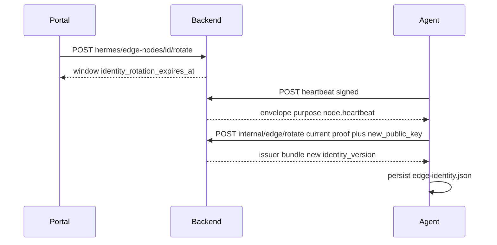

# RM-07 Edge Control Channel 安全闭环

Canonical 落盘路径：`.cursor/plans/rm-07_edge-control-channel-security.plan.md`（`plan_id: RM-07`，`plan_contract: smc.plan.v3.4`，`commit_policy: post_review`）。旧 PASS 审查指向同名文件，但工作区已不存在该 Plan，本项按 **CREATE**（`PLAN_NOT_FOUND`），禁止再造第二份 wrapper。

下游只走 `smc-plan-delivery`。Todo 完成不得 commit。implementation commit 与 Roadmap DONE 分离。

`source_revision: AD-SKILL-AGENT-V16@1.7.0/RM-07`。批准事实取 Stage PRD [`docs_agent/prd-v1.6.8-edge-control-channel-security-closure.md`](docs_agent/prd-v1.6.8-edge-control-channel-security-closure.md)（`APPROVED`）。`grounded_commit: 3d5df57920b856a080f65f2e85d70c28c033fa3b`。生产路径已在祖先 `84472daf` / `d994b3de` 落地，本 Plan **不重写** 既有 enroll/auth/封套，只补缺口。

## 前端表现变化

#### 1. Portal Hermes Edge 节点页（`/hermes/edge-nodes`）

**总结**: 「轮换」从“点一下就当完成”改为“先开窗口，列表显示待 Edge Agent 提交新公钥，直到窗口结束或绑定完成”。

**元素级变化**:
- 状态徽标: 仅 `online/stale/disabled/pending` -> 当 `identity_rotation_expires_at` 未过期时 **新增** `rotating`（轮换中）徽标（黄/警示色），文案走 i18n
- 「轮换」按钮: 窗口进行中 -> **disabled**，hover 说明“等待 Edge Agent 完成绑定”
- 表格: **新增**「轮换截止」列或状态旁过期时间；无窗口时显示 —
- Toast: 保持现有“轮换窗口已开启…”；窗口过期仍未完成时列表回到原状态，**不**假装已换钥
- 登记弹窗 / 一次性 bootstrap 复制: **不变**（已有过期时间与一次性警告）

**改动前**（运营者点轮换后）:
```
┌─ Edge 节点 ─────────────────────────────┐
│ 名称     状态      心跳     操作         │
│ edge-1   online    刚刚     [禁用][轮换][撤销] │
└─────────────────────────────────────────┘
-> Toast: 轮换窗口已开启
-> 列表仍显示 online，看不出待绑定
```

**改动后**:
```
┌─ Edge 节点 ─────────────────────────────┐
│ 名称     状态        轮换截止      操作   │
│ edge-1   rotating    15:32        [禁用][轮换 disabled][撤销] │
│          轮换中                         │
└─────────────────────────────────────────┘
-> Toast: 轮换窗口已开启，Edge Agent 将用当前身份提交新公钥
```

## Scope

- In: 签名心跳提示轮换窗口；Agent 用当前身份 `POST /internal/edge/rotate` 完成换钥并持久化 `edge-identity.json`；Portal 展示待定轮换；补齐 AC 自动化 oracle（登记复用/过期、撤销、双向有效、篡改、重放、乱序、错节点、重启后消费记录、Delivery Generation 回归、Public 合同字节不变）。
- Out: 重写已落地的 `_authenticate_edge` / `sign_command_envelope` / enroll；RM-04 Newman / 全量 Postman 改 `X-Edge-Token`；RM-08/RM-09/RM-10；改写 `contracts/skill-run/v1.2.1`～`v1.4.0`；Agent 入站端口；KMS/Vault；把 `delivery_generation` 当身份协议。
- KEEP: C05 Delivery Generation；C07 Public 合同；C08 唯一 Run/Event Owner。`COMMAND_PURPOSES` 现有四类（`job.claim` / `install.desired` / `artifact.on_demand` / `job.cancel.check`）保持；仅 **新增** `node.heartbeat`。

Plan 级冻结:
- 禁止无封套 `rotation_required` 驱动 Agent 状态机（与既有审查一致）。
- 轮换窗口内旧身份仍可证明 `POST /rotate`；完成后 `identity_version` 递增，旧版本请求 fail-closed。
- Nonce 表继续 append-only、全表 unique，本阶段不软删。
- 长期 `X-Edge-Token` 不得回到生产鉴权。



## 已落地（本 Plan 视为 KEEP，禁止回退）

- Backend: [`EdgeControlChannel`](nodeskclaw-backend/app/services/connector/edge_control_channel.py)、[`_authenticate_edge`](nodeskclaw-backend/app/api/internal_edge.py)、[`enroll_edge_node`](nodeskclaw-backend/app/api/internal_edge.py) / [`rotate_edge_identity`](nodeskclaw-backend/app/api/internal_edge.py)、[`EdgeNodeService.register/bind_identity/start_rotation/complete_rotation/revoke_node`](nodeskclaw-backend/app/services/connector/edge_node_service.py)、[`EdgeControlNonce`](nodeskclaw-backend/app/models/connector/edge_control_nonce.py)、Alembic `f7a8b9c0d1e2_edge_control_identity_and_nonce.py`。Job/安装/on-demand/cancel-check 已 `_sign_command`。
- Agent: [`EdgeControlChannel.sign_request_headers` / `verify_command_envelope`](nodeskclaw-agent/app/services/edge_control_channel.py)、[`EdgeWorker._ensure_enrolled`](nodeskclaw-agent/app/services/edge_worker.py)、claim/install/on-demand/cancel 已验签。
- Portal: 登记一次性 bootstrap、disable/enable/rotate/revoke 按钮与 i18n 已存在。

## 缺口（本 Plan 要修）

- Agent **零** `rotate` 调用；运营者 `start_rotation` 后窗口空转，AC-02 未闭环。
- [`edge_heartbeat`](nodeskclaw-backend/app/api/internal_edge.py) 仍返回裸 `{node_id,status}`，Agent 无法安全得知窗口。
- [`EdgeNodeRead`](nodeskclaw-backend/app/schemas/connector/__init__.py) 无 `identity_rotation_expires_at`，列表无法显示待定。
- 测试缺：rotate E2E、bootstrap 过期、错节点命令、跨重启消费、unsigned cancel 不得 `cancel_event.set()`、Public 目录相对 grounded_commit 空 diff。

## Change / Todo 切分

**T1 — 签名心跳与运营者可读轮换窗 [C03, C06]**  
WRITE_OWNER: `internal_edge.py#edge_heartbeat`、两边 `COMMAND_PURPOSES`、`EdgeNodeRead`。心跳响应改为 `_sign_command(..., purpose="node.heartbeat")`，payload 含 `status` 与 `identity_rotation_expires_at`（无窗口则 null）。列表 API 投影该时间戳。禁止改 Delivery Generation 谓词。

**T2 — Agent 完成轮换 [C02, C04]**  
Depends On T1。WRITE_OWNER: `edge_worker.py` + agent `EdgeControlChannel`。验签心跳后若窗口有效：生成本地新钥、`POST /internal/edge/rotate`、`apply_bind_response` 落盘。重启后只接受已消费 Nonce/Seq 状态。禁止 Settings 默认签发者、禁止从命令封套安装未知公钥。

**T3 — Portal 轮换待定态 [C01 运营者面]**  
Depends On T1。WRITE_OWNER: [`EdgeNodesView.vue`](nodeskclaw-portal/src/views/hermes/EdgeNodesView.vue)、[`connectors.ts` EdgeNode 类型](nodeskclaw-portal/src/api/hermes/connectors.ts)、zh-CN/en-US `hermes.edgeNodes.*`。无新页面。

**T4 — AC-08 阻断 oracle [C01–C08]**  
补测试到既有 `test_edge_control_channel.py` / `test_edge_worker.py` / `test_edge_internal.py`；V-REL：`git diff --exit-code 3d5df579 -- nodeskclaw-backend/contracts/skill-run`。不跑 RM-04 Newman，不改 Postman 作为本项出口。

**T5 — lat.md**  
同步 [[lat.md/architecture/backend.md#Edge Control Channel]]、Agent Worker 轮换完成、Portal 待定态；`lat check` PASS。

## Verification（阻断）

- V01 登记：一次性 bootstrap 绑定成功；复用/过期/错节点/禁用拒绝且无有效身份。
- V02 轮换：窗口内 Agent 完成换钥；窗口后旧身份与静态 Token 均 403；审计无秘密。
- V03 请求证明：缺签/过期/重放 Nonce/乱序 Seq/摘要不匹配 fail-closed。
- V04 命令封套：四类既有 purpose + heartbeat；unsigned cancel 不得置位取消。
- V05 重启：identity 文件恢复后已消费命令不执行。
- V06 Delivery Generation：陈旧代次续租/事件仍拒绝（回归现有测试）。
- V07 Public 合同：v1.2.1～v1.4.0 相对 grounded_commit 空 diff。
- V08 lat check。

不要求 RM-18 式 `user_jwt` live；跨重启用本地 Secret Store fixture。不把 Postman 里残留的 `X-Edge-Token` 当本项 FAIL（记入 RM-04 债务）。

## 禁止

- 第二份 `.plan.md` / 开放 Agent 入站 / 引入 KMS
- 把 Internal 封套写进 Public Skill Run
- `git tag -f`、Todo 完成即 commit、把 Roadmap 与 implementation 打进同一 commit
