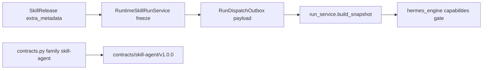

# RM-08 Shared Agent Execution Contract 实施计划

Canonical 落盘路径：[`.cursor/plans/rm-08_shared-agent-execution-contract.plan.md`](rm-08_shared-agent-execution-contract.plan.md)

`commit_policy: post_review`。下游只走 `smc-plan-delivery`。Todo 完成不得 commit。implementation commit 与 Roadmap DONE 分离。禁止第二份 `.plan.md`。禁止 `git tag -f`。

批准事实取 Stage PRD [`docs_agent/prd-v1.6.17-shared-agent-execution-contract.md`](../../docs_agent/prd-v1.6.17-shared-agent-execution-contract.md)（`APPROVED` / review PASS / `approved_at: 2026-09-08T11:20:00Z`）。生产代码基线 `grounded_commit: 29006c0d6dfaeab5543b6951aa7b095c9edc656c`。其后独立 docs commit：`c3e22076`（PRD）与 `76bb35ee`（Roadmap `IN_PRD`）。

## 前端表现变化

本次改动无前端表现变化。不改 Portal / Admin / Work 页面、按钮、文案或路由。Internal 合同不对员工 UI 暴露。

## Approved PRD

[Approved PRD](../../docs_agent/prd-v1.6.17-shared-agent-execution-contract.md)

## Scope

- In: Internal Bundle `contracts/skill-agent/v1.0.0/` 与 annotated tag `skill-agent-contract-v1.0.0`；扩展既有 `contracts.py` family `skill-agent`；Backend 从 Published SkillRelease 冻结 `delegation_topology` ∈ {`single_agent`,`runtime_delegated`} 与版本化 capability reference 到 Outbox；Agent `build_snapshot` 分列持久化 Topology 与 `placement`；`runtime_delegated` Capability 不匹配 → `RUNTIME_CAPABILITY_UNAVAILABLE`；非法/`platform_multi_agent` → `EXECUTION_TOPOLOGY_NOT_SUPPORTED`；可选 Trace 枚举属性；自动化 oracle 与 `lat.md`。
- Out: Platform Multi-Agent / Child Run / 第二 Snapshot Store；Hybrid 映射为 Delegation；`gateway_sequential` 当作 `runtime_delegated`；改写 Public `skill-run` v1.2.1～v1.4.0；提前 READY RM-09；RM-16 live Hermes 内部委派实跑作为本项唯一出口；Portal/Admin/Work UI。
- KEEP: Public 三版只读；Agent 唯一终态 Owner；EnginePort 仅 hermes/connector；RM-06 context 与 RM-07 封套；RM-09 BACKLOG Depends On RM-08。

Plan 级冻结:

- 缺省 Topology 只能是 `single_agent`，不得默认为 `runtime_delegated`。
- Topology ≠ Placement ≠ Engine。客户端/`client_context`/Edge 裸负载不得覆盖 Topology 或 capability reference。
- Capability / Topology 门禁 fail-closed；观测 fail-open。禁止降级 `single_agent`、ChatCompletion 或 `gateway_sequential`。
- Internal 不得进入任何 Public SHA256SUMS。`RUNTIME_CAPABILITY_MISSING`（版本/能力地板）与 `RUNTIME_CAPABILITY_UNAVAILABLE`（Topology 引用不匹配）分列。

## Domain Activation Ledger

None

## Grounding Evidence Ledger

| Change ID | Target | Baseline State | Symbol / Entry Resolution | Caller / Callee Evidence | Existing Reuse Search | Result |
|---|---|---|---|---|---|---|
| C01 | `nodeskclaw-backend/contracts/skill-run/v1.2.1` | EXISTS frozen Public at `29006c0d` | v1.2.1～v1.4.0 tags 已发布；SHA256SUMS 无 Internal | Contract Package KEEP | 禁止改写；相对 grounded_commit 空 diff | PASS |
| C02 | `nodeskclaw-agent/app/services/run_service.py#append_event` | EXISTS Event SoT | 无 Child Run；`subagent.*` → `internal.runtime.trace` | Worker / Public 投影 | KEEP；不得升级成员 Run | PASS |
| C03 | `nodeskclaw-agent/app/services/engine_port.py#execute_engine` | EXISTS hermes/connector only | 未知 engine fail-closed；无 `multi_agent` | RunWorker / EdgeWorker | KEEP；Topology 不是新 engine | PASS |
| C04 | `nodeskclaw-agent/app/services/context_revalidate.py#revalidate_execution_context` | EXISTS RM-06 | Edge 执行前复核 `execution_context` | EdgeWorker#_execute_job | KEEP 字段集合 | PASS |
| C05 | `nodeskclaw-agent/app/services/edge_control_channel.py#COMMAND_PURPOSES` | EXISTS RM-07 | nonce/seq/验签后才副作用 | EdgeControlChannel#verify_command_envelope | KEEP 封套 | PASS |
| C06 | `nodeskclaw-backend/contracts/skill-agent/v1.0.0/` | MISSING | 仓库无 `contracts/skill-agent/` | 将由 C07 生成 | 不手写分叉目录；不混入 Public | PASS |
| C07 | `nodeskclaw-backend/scripts/contracts.py#main` | EXISTS family 仅 work-expert/skill-run/all | argparse `--family` 无 skill-agent；`generate_skill_run_contracts` / `check_contracts` 已有 checksum/LF/release 模式 | CLI generate/check | MODIFY 同一生成器；GENERATED_ENTRYPOINT 产出 C06 | PASS |
| C08 | `nodeskclaw-backend/app/services/hermes_skill/runtime_skill_run_service.py#RuntimeSkillRunService#_enqueue_agent_run_outbox` | PARTIAL | body 有 placement/route/execution_context；无 Topology | start → outbox；`_resolve_release_meta` 读 SkillRelease | 服务器冻结；忽略客户端 Topology | PASS |
| C08 | `nodeskclaw-backend/app/services/hermes_skill/skill_release_service.py#SkillReleaseService#publish` | EXISTS extra_metadata JSONB | publish 已写 annotations/supportsAttachments；无 Topology 校验 | skills_router publish | 发布时规范化允许枚举，不新建 Release 服务 | PASS |
| C09 | `nodeskclaw-agent/app/services/run_service.py#build_snapshot` | PARTIAL | 已写 placement/runtime_policy/execution_context；无 Topology | create_run / CreateRunRequest | 同一 Snapshot Owner 增列 | PASS |
| C10 | `nodeskclaw-agent/app/services/hermes_engine.py#execute_hermes_run` | PARTIAL | `RUNTIME_CAPABILITY_MISSING` 用于 probe/地板；无 Topology 专用码 | execute_engine → hermes | 同 Adapter 增码；不新增 Engine | PASS |
| C11 | `docs_agent/roadmaps/ROADMAP-SKILL-AGENT-V16.md` | RM-09 BACKLOG Depends On RM-08 | Roadmap 表 RM-09 仍 BACKLOG | 治理 KEEP | 本项不得 READY RM-09 | PASS |
| C12 | `docs_agent/evidence/rm08-verification.md` | MISSING | 尚无 `skill-agent-contract-v1.0.0` tag | git tags at `29006c0d` | 实施后 annotated tag + 出口证据 | PASS |
| C13 | `nodeskclaw-agent/app/services/execution_observability.py#ALLOWED_TRACE_ATTRS` | EXISTS 明确排除 topology | `test_execution_observability.py` 断言键被丢弃 | observe_stage / bind_from_snapshot | 改为可选合同枚举；禁止 metric label | PASS |

## Requirement Coverage Ledger

| Requirement | Source | Obligation | Classification | Change IDs | Todo | Verification IDs | Evidence Class | Blocking |
|---|---|---|---|---|---|---|---|---|
| AC-01 | AC | 存在完整 `nodeskclaw-backend/contracts/skill-agent/v1.0.0/` Internal Bundle，含 ExecutionSnapshot、`delegation_topology` 枚举、`placement` 正交描述、capability reference、OpenAPI、TypeScript 与 fixtures。 | CONTRACT | C06; C07 | T1 | V01 | CONTRACT_RELEASE | yes |
| AC-02 | AC | Internal Bundle 无 Public Consumer 专属路径混入；Public `skill-run` v1.2.1～v1.4.0 SHA256SUMS 不出现 `skill-agent/` 或新 Internal 文件。 | CONTRACT | C01; C06 | T1 | V02 | DIFF_SCOPE | yes |
| AC-03 | AC | `python nodeskclaw-backend/scripts/contracts.py generate --family skill-agent --version 1.0.0` 与 `check --family skill-agent --version 1.0.0` 通过；`--family skill-run` 行为不因本项改变冻结目录。 | CONTRACT | C07 | T1 | V01 | CONTRACT_RELEASE | yes |
| AC-04 | AC | Internal SHA256SUMS 为 UTF-8 LF-only；listed == actual（排除 SHA256SUMS 自身）；tamper/extra/CRLF 使 check 失败。 | CONTRACT | C07 | T1 | V01 | CONTRACT_RELEASE | yes |
| AC-05 | AC | Backend 入队后 Agent 可见的冻结输入含服务器决定的 `delegation_topology`；客户端覆盖组织、Run、Topology 或 capability reference 失败关闭或被忽略且不生效。 | SECURITY | C08 | T2 | V03 | UNIT | yes |
| AC-06 | AC | Agent ExecutionSnapshot 持久化 Topology 与 `placement` 为分列字段；同一 Snapshot 可同时表达 Hybrid placement 与 `single_agent` topology。 | BEHAVIOR | C09 | T3 | V04 | UNIT | yes |
| AC-07 | AC | `runtime_delegated` 且 Capability 缺失/不匹配时执行失败，错误码 `RUNTIME_CAPABILITY_UNAVAILABLE`，Run 不得以成功终态关闭，不得改 Topology 后重试为 `single_agent`。 | NEGATIVE | C09; C10 | T3 | V05 | UNIT | yes |
| AC-08 | AC | 请求 `platform_multi_agent` 或非法枚举时错误码 `EXECUTION_TOPOLOGY_NOT_SUPPORTED`，不得回退 `gateway_sequential`。 | NEGATIVE | C10 | T3 | V06 | UNIT | yes |
| AC-09 | AC | 无 Child Run、无成员级 Public 事件、无 `engine=multi_agent`；`subagent.*` 仍只进 `internal.runtime.trace`。 | SCOPE | C02; C03 | T3 | V07 | UNIT | yes |
| AC-10 | AC | `git diff --exit-code <grounded_commit> -- nodeskclaw-backend/contracts/skill-run/v1.2.1 nodeskclaw-backend/contracts/skill-run/v1.3.0 nodeskclaw-backend/contracts/skill-run/v1.4.0` 为空（实施后相对本 grounded_commit 的 Public 冻结目录无改写）。 | CONTRACT | C01 | T5 | V02 | DIFF_SCOPE | yes |
| AC-11 | AC | 存在 annotated tag `skill-agent-contract-v1.0.0`；`check --family skill-agent --version 1.0.0 --release` 在 tag 指向 freeze commit 时通过；禁止 `git tag -f`。 | RELEASE | C12 | T5 | V08 | CONTRACT_RELEASE | yes |
| AC-12 | AC | Trace 可包含可选合同枚举 `delegation_topology`；该值不得作为 metric label；缺失不阻断已授权 `single_agent` 执行。 | BEHAVIOR | C13 | T4 | V09 | UNIT | yes |
| AC-13 | AC | Roadmap 上 RM-09 在本项 DONE 前保持 BACKLOG 且 Depends On RM-08。 | SCOPE | C11 | - | V10 | DOCUMENT_SEMANTIC | yes |
| AC-14 | AC | RM-06 Context 复核与 RM-07 封套验签回归仍 PASS；Internal 合同不把秘密写入 Snapshot。 | SECURITY | C04; C05 | - | V11 | UNIT | yes |
| DOD-01 | DOD | AC-01 至 AC-14 的 Provider/Agent 侧验证证据已留存。 | EVIDENCE | C06; C07; C08; C09; C10; C12; C13 | T5 | V01; V02; V03; V04; V05; V06; V07; V08; V09; V10; V11; V12 | UNIT | yes |
| DOD-02 | DOD | Internal `v1.0.0` 已由单一生成链发布；Public 三版未改写；未新增第三个服务或第二 Snapshot Store。 | SCOPE | C01; C06; C07 | T1 | V01; V02 | CONTRACT_RELEASE | yes |
| DOD-03 | DOD | Capability / Topology 失败关闭有自动化 oracle；无静默降级。 | NEGATIVE | C09; C10 | T3 | V05; V06 | UNIT | yes |
| DOD-04 | DOD | Review 与 Verification 均 PASS；真实 implementation commit 写入 Roadmap 后 RM-08 才可 `DONE`（Roadmap DONE 属 Plan Delivery，非本 PRD 治理轮次出口）。 | RELEASE | C12 | T5 | V08; V12 | DOCUMENT_SEMANTIC | yes |
| DOD-05 | DOD | `lat.md` 将 Runtime Delegation 从「目标状态」更新为已发布 Internal 合同与失败关闭语义，且 `lat check` 通过。 | RELEASE | C12 | T5 | V12 | DOCUMENT_SEMANTIC | yes |

## Lifecycle Closure Matrix

| Journey | Requirements | Trigger | Nonterminal State | Success Writer | Failure / Cancel Writer | Evidence IDs |
|---|---|---|---|---|---|---|
| Publish and freeze topology | AC-05; AC-13 | SkillReleaseService.publish | draft extra_metadata; published freeze | Backend writes allowed enum + capability reference into extra_metadata and Outbox | illegal enum rejected at publish/enqueue; client overlay ignored | V03 |
| Snapshot persist | AC-06; AC-14 | Agent create_run / build_snapshot | snapshot hash pending persist | run_service.build_snapshot writes topology beside placement | secrets stripped by existing sanitize; no second store | V04; V11 |
| Runtime delegated capability gate | AC-07; AC-08; DOD-03 | execute_hermes_run after version floor | capabilities probed; native run not started | matching capability continues existing native path | RUNTIME_CAPABILITY_UNAVAILABLE or EXECUTION_TOPOLOGY_NOT_SUPPORTED; run.failed; no topology rewrite retry | V05; V06 |
| Observability optional attr | AC-12 | bind_from_snapshot / observe_stage | trace attrs partial | allowlisted enum recorded | non-enum dropped; metric labels reject topology; missing does not fail single_agent | V09 |

## Contract / Data Flow Closure Matrix

| Flow | Requirements | Producer | Transport / Schema | Consumer | Required Fields | Validation Owner | Failure Mapping | Retry / Idempotency Identity | Evidence IDs |
|---|---|---|---|---|---|---|---|---|---|
| Internal bundle | AC-01; AC-03; AC-04 | contracts.py generate family skill-agent | contracts/skill-agent/v1.0.0 SHA256SUMS UTF-8 LF | check --family skill-agent | manifest; snapshot schema; topology enum; placement orthogonality; capability reference; OpenAPI; TypeScript; fixtures | contracts.py check | tamper/extra/CRLF fail check; no silent overwrite of skill-run | backendCommit + version 1.0.0 | V01 |
| Public isolation | AC-02; AC-10 | Contract Package KEEP | Public skill-run SHA256SUMS | release consumers | no skill-agent/ paths | git diff vs 29006c0d | any Public rewrite fails | frozen tags v1.2.1-v1.4.0 | V02 |
| Topology freeze | AC-05 | SkillReleaseService.publish + _enqueue_agent_run_outbox | RunDispatchOutbox.payload | Agent CreateRunRequest | delegation_topology; optional runtime_capability_ref; placement unchanged | Backend RuntimeSkillRunService | client topology ignored; org/run still fail-closed | run_id + dispatch_id | V03 |
| Snapshot persist | AC-06 | build_snapshot | ExecutionSnapshot JSON | Run store / Hermes gate | delegation_topology column beside placement | Agent run_service | missing defaults single_agent; secrets sanitized | snapshot_hash | V04 |
| Capability gate | AC-07; AC-08 | hermes_engine execute_hermes_run | GET /v1/capabilities | Native Run start | version floor then topology capability reference | hermes_engine | UNAVAILABLE vs MISSING vs NOT_SUPPORTED; no engine swap | attempt_id + generation | V05; V06 |

## Acceptance Claim Ledger

| Claim ID | Requirement | Observable Fact | Blocking | Prior Evidence | Prior Result | Evidence Action | Invalidation Reason | Verification IDs |
|---|---|---|---|---|---|---|---|---|
| CLM-01 | AC-01 | Internal `contracts/skill-agent/v1.0.0/` Bundle 完整且含 Topology/placement/capability 描述 | yes | 仓库无该目录 at 29006c0d | UNKNOWN | NEW_EVIDENCE | - | V01 |
| CLM-02 | AC-02 | Public v1.2.1～v1.4.0 SHA256SUMS 无 skill-agent 路径 | yes | docs_agent/evidence/rm11-verification.md | UNKNOWN | NEW_EVIDENCE | - | V02 |
| CLM-03 | AC-03 | generate/check --family skill-agent --version 1.0.0 通过且 skill-run family 冻结目录不变 | yes | contracts.py --family choices | UNKNOWN | NEW_EVIDENCE | - | V01 |
| CLM-04 | AC-04 | Internal SHA256SUMS UTF-8 LF；tamper/extra/CRLF 使 check 失败 | yes | skill-run checker 模式 | UNKNOWN | NEW_EVIDENCE | - | V01 |
| CLM-05 | AC-05 | Outbox 含服务器冻结 Topology；客户端覆盖不生效 | yes | _enqueue_agent_run_outbox at 29006c0d | UNKNOWN | NEW_EVIDENCE | - | V03 |
| CLM-06 | AC-06 | Snapshot 分列持久化 Topology 与 Hybrid placement | yes | build_snapshot at 29006c0d | UNKNOWN | NEW_EVIDENCE | - | V04 |
| CLM-07 | AC-07 | runtime_delegated 且 Capability 不匹配时 RUNTIME_CAPABILITY_UNAVAILABLE 且不降级 | yes | hermes_engine RUNTIME_CAPABILITY_MISSING | UNKNOWN | NEW_EVIDENCE | - | V05 |
| CLM-08 | AC-08 | platform_multi_agent/非法枚举 → EXECUTION_TOPOLOGY_NOT_SUPPORTED | yes | 无该错误码 | UNKNOWN | NEW_EVIDENCE | - | V06 |
| CLM-09 | AC-09 | 无 Child Run、无 engine=multi_agent；subagent 仍 internal.runtime.trace | yes | engine_port + event SoT | UNKNOWN | NEW_EVIDENCE | - | V07 |
| CLM-10 | AC-10 | Public v1.2.1～v1.4.0 相对 29006c0d 空 diff | yes | RM-11/17/18 冻结目录 | UNKNOWN | NEW_EVIDENCE | - | V02 |
| CLM-11 | AC-11 | annotated tag skill-agent-contract-v1.0.0 且 check --release 通过 | yes | git tags | UNKNOWN | NEW_EVIDENCE | - | V08 |
| CLM-12 | AC-12 | Trace 允许合同枚举 topology；不得作 metric label | yes | tests/test_execution_observability.py | PASS | TARGETED_RERUN | C13 将 allowlist 从拒绝改为可选枚举 | V09 |
| CLM-13 | AC-13 | RM-09 仍 BACKLOG 且 Depends On RM-08 | yes | ROADMAP-SKILL-AGENT-V16.md | UNKNOWN | NEW_EVIDENCE | - | V10 |
| CLM-14 | AC-14 | RM-06 复核与 RM-07 封套回归 PASS；Snapshot 无秘密 | yes | docs_agent/evidence/rm06-verification.md 与 rm07-verification.md | PASS | TARGETED_RERUN | 本项改 enqueue/snapshot 邻接路径，须证明复核与封套未被削弱 | V11 |
| CLM-15 | DOD-01 | AC-01 至 AC-14 证据留存 | yes | - | UNKNOWN | NEW_EVIDENCE | - | V01; V02; V03; V04; V05; V06; V07; V08; V10; V12 |
| CLM-16 | DOD-02 | 单一生成链；无第三服务；Public 未改写 | yes | - | UNKNOWN | NEW_EVIDENCE | - | V01; V02 |
| CLM-17 | DOD-03 | 失败关闭 oracle 无静默降级 | yes | - | UNKNOWN | NEW_EVIDENCE | - | V05; V06 |
| CLM-18 | DOD-04 | Review/Verification PASS；Roadmap DONE 另 commit | yes | - | UNKNOWN | NEW_EVIDENCE | - | V08; V12 |
| CLM-19 | DOD-05 | lat.md Runtime Delegation 已落地且 lat check 通过 | yes | lat.md/architecture/skill-agent.md#Runtime Delegation Boundary | UNKNOWN | NEW_EVIDENCE | - | V12 |

## Live Scenario Matrix

| Scenario ID | Claim IDs | Verification IDs | Subject / Fixture | Required Capabilities | Preconditions | Stimulus | Oracle | Environment ID |
|---|---|---|---|---|---|---|---|---|

## Live Environment Matrix

| Environment ID | Required Env Vars | Preflight Command | Fault Driver Env | Candidate Mode | Candidate Probe |
|---|---|---|---|---|---|

## Verification Ledger

| Verification ID | Claim IDs | Level | Acceptance Mode | Entry Point / Command | Oracle | Negative / Regression | Evidence Policy | Environment | Evidence Action | Blocking |
|---|---|---|---|---|---|---|---|---|---|---|
| V01 | CLM-01; CLM-03; CLM-04; CLM-15; CLM-16 | CONTRACT_RELEASE | LOCAL | python nodeskclaw-backend/scripts/contracts.py generate --family skill-agent --version 1.0.0 ; python nodeskclaw-backend/scripts/contracts.py check --family skill-agent --version 1.0.0 | generate 后 check PASS；Bundle 含 snapshot schema、topology 枚举、placement 正交、capability reference、OpenAPI、TypeScript、fixtures | tamper/extra/CRLF 使 check 失败；generate --family skill-run 不改写冻结 Public 目录 | LOCAL_TRANSIENT | local | NEW_EVIDENCE | yes |
| V02 | CLM-02; CLM-10; CLM-15; CLM-16 | DIFF_SCOPE | LOCAL | git diff --exit-code 29006c0d6dfaeab5543b6951aa7b095c9edc656c -- nodeskclaw-backend/contracts/skill-run/v1.2.1 nodeskclaw-backend/contracts/skill-run/v1.3.0 nodeskclaw-backend/contracts/skill-run/v1.4.0 | 空 diff；上述版本 SHA256SUMS 无 skill-agent/ | 任何 Public 文件改写失败 | REPO_SUMMARY | local git | NEW_EVIDENCE | yes |
| V03 | CLM-05; CLM-15 | UNIT | LOCAL | uv --directory nodeskclaw-backend run pytest tests/hermes_skill/test_runtime_skill_run_agent_enqueue.py tests/hermes_skill/test_skill_lifecycle_and_mcp.py -q -k "topology or delegation or enqueue" | Outbox payload 含服务器冻结 delegation_topology；缺省 single_agent | 客户端 client_context 覆盖 Topology/capability reference 不生效；org/run 覆盖仍失败关闭 | LOCAL_TRANSIENT | local | NEW_EVIDENCE | yes |
| V04 | CLM-06; CLM-15 | UNIT | LOCAL | uv --directory nodeskclaw-agent run pytest tests/test_run_service.py -q -k "snapshot or topology or placement" | Snapshot 同时含 Hybrid placement 与 single_agent topology 分列字段 | Topology 写入 placement 或第二份 snapshot store 失败 | LOCAL_TRANSIENT | local | NEW_EVIDENCE | yes |
| V05 | CLM-07; CLM-15; CLM-17 | UNIT | LOCAL | uv --directory nodeskclaw-agent run pytest tests/test_hermes_engine.py -q -k "unavailable or topology or capability" | runtime_delegated 且 capabilities 不匹配 → error_code RUNTIME_CAPABILITY_UNAVAILABLE；run 非成功终态 | 改写 Topology 为 single_agent 后重试成功则失败；误用 RUNTIME_CAPABILITY_MISSING 代替 UNAVAILABLE 则失败 | LOCAL_TRANSIENT | local | NEW_EVIDENCE | yes |
| V06 | CLM-08; CLM-15; CLM-17 | UNIT | LOCAL | uv --directory nodeskclaw-agent run pytest tests/test_hermes_engine.py tests/test_run_service.py -q -k "topology_not_supported or platform_multi_agent" | platform_multi_agent/非法枚举 → EXECUTION_TOPOLOGY_NOT_SUPPORTED | 回退 gateway_sequential 或 hermes engine 成功则失败 | LOCAL_TRANSIENT | local | NEW_EVIDENCE | yes |
| V07 | CLM-09; CLM-15 | UNIT | LOCAL | uv --directory nodeskclaw-agent run pytest tests/test_hermes_engine.py -q -k "execute_engine or subagent or multi_agent" | execute_engine 仍仅 hermes/connector；无 multi_agent；subagent 不创建 Child Run | 新增 engine=multi_agent 分支失败 | LOCAL_TRANSIENT | local | NEW_EVIDENCE | yes |
| V08 | CLM-11; CLM-15; CLM-18 | CONTRACT_RELEASE | LOCAL | git tag -l skill-agent-contract-v1.0.0 ; python nodeskclaw-backend/scripts/contracts.py check --family skill-agent --version 1.0.0 --release | annotated tag 存在且指向 freeze commit；check --release PASS | git tag -f 禁止；lightweight tag 失败 | REPO_SUMMARY | local git | NEW_EVIDENCE | yes |
| V09 | CLM-12 | UNIT | LOCAL | uv --directory nodeskclaw-agent run pytest tests/test_execution_observability.py -q -k "delegation or allowlist or topology" | 合同枚举可进 Trace attrs；非枚举仍拒；record_metric 不以 delegation_topology 为 label | 缺失枚举阻断 single_agent 执行则失败 | LOCAL_TRANSIENT | local | TARGETED_RERUN | yes |
| V10 | CLM-13; CLM-15 | DOCUMENT_SEMANTIC | LOCAL | python -c "p=__import__('pathlib').Path('docs_agent/roadmaps/ROADMAP-SKILL-AGENT-V16.md'); rows=[ln for ln in p.read_text(encoding='utf-8').splitlines() if ln.find(' RM-09 ')>=0 and ln.startswith(chr(124))]; assert len(rows)==1 and 'BACKLOG' in rows[0] and 'RM-08' in rows[0]" | RM-09 行仍 BACKLOG 且 Depends On 含 RM-08 | RM-09 READY/IN_PRD/DONE 失败 | REPO_SUMMARY | local | NEW_EVIDENCE | yes |
| V11 | CLM-14 | UNIT | LOCAL | uv --directory nodeskclaw-agent run pytest tests/test_edge_control_channel.py tests/test_edge_worker.py -q -k "envelope or revalidate or command_seq or nonce" | 既有封套与 context 复核断言 PASS | Snapshot 出现 token/DSN 失败 | LOCAL_TRANSIENT | local | TARGETED_RERUN | yes |
| V12 | CLM-15; CLM-18; CLM-19 | DOCUMENT_SEMANTIC | LOCAL | lat check | lat check PASS；Runtime Delegation Boundary 不再只写目标状态 | lat 仍称未发布 Internal 合同则失败 | REPO_SUMMARY | local | NEW_EVIDENCE | yes |

## Immediate Read

- `nodeskclaw-backend/scripts/contracts.py#main`
- `nodeskclaw-backend/scripts/contracts.py#check_contracts`
- `nodeskclaw-backend/scripts/contracts.py#generate_skill_run_contracts`
- `nodeskclaw-backend/app/services/hermes_skill/runtime_skill_run_service.py#RuntimeSkillRunService#_enqueue_agent_run_outbox`
- `nodeskclaw-backend/app/services/hermes_skill/runtime_skill_run_service.py#RuntimeSkillRunService#_resolve_release_meta`
- `nodeskclaw-backend/app/services/hermes_skill/skill_release_service.py#SkillReleaseService#publish`
- `nodeskclaw-agent/app/schemas.py#CreateRunRequest`
- `nodeskclaw-agent/app/services/run_service.py#build_snapshot`
- `nodeskclaw-agent/app/services/hermes_engine.py#execute_hermes_run`
- `nodeskclaw-agent/app/services/hermes_engine.py#_feature_set`
- `nodeskclaw-agent/app/services/engine_port.py#execute_engine`
- `nodeskclaw-agent/app/services/execution_observability.py#ALLOWED_TRACE_ATTRS`
- `lat.md/architecture/skill-agent.md#Runtime Delegation Boundary`

## Triggered Read

- If SkillRelease.requirements already carries topology-like keys: `nodeskclaw-backend/app/models/hermes_skill/skill_release.py#HermesSkillRelease` read-only shape; freeze still via extra_metadata, do not add a column unless publish cannot store the enum
- If Agent CreateRunRequest cannot accept unknown outbox keys: extend `nodeskclaw-agent/app/schemas.py#CreateRunRequest` only with optional topology/capability_ref fields
- If capabilities JSON lacks a stable feature set for the frozen reference: `nodeskclaw-agent/app/services/hermes_engine.py#_feature_set` plus fixture caps body; still fail-closed, do not infer
- If Internal OpenAPI needs a Backend Pydantic model: add a small Internal schema module under existing hermes_skill schemas; do not publish it into Public skill-run
- Otherwise: do not read

## Change Matrix

| Change ID | File / Symbol | Kind | Action | Existing Owner | Todo Owner | Target State | PRD Capability | New File? |
|---|---|---|---|---|---|---|---|---|
| C01 | `nodeskclaw-backend/contracts/skill-run/v1.2.1` | PROD | KEEP | Backend Skill Run Contract Package | - | Public 三版字节不变 | Public Skill Run v1.2.1～v1.4.0 | no |
| C02 | `nodeskclaw-agent/app/services/run_service.py#append_event` | PROD | KEEP | Agent Run/Event 域 | - | 无 Child Run | Agent Run/Event/Terminal Owner | no |
| C03 | `nodeskclaw-agent/app/services/engine_port.py#execute_engine` | PROD | KEEP | Agent Execution Plane | - | 无 multi_agent engine | Placement 与 Hybrid Step Plan | no |
| C04 | `nodeskclaw-agent/app/services/context_revalidate.py#revalidate_execution_context` | PROD | KEEP | Backend Runtime Skill Run | - | 复核语义不变 | RM-06 Context Descriptor | no |
| C05 | `nodeskclaw-agent/app/services/edge_control_channel.py#COMMAND_PURPOSES` | PROD | KEEP | Edge Control Channel | - | 封套不变 | RM-07 Edge Envelope | no |
| C06 | `nodeskclaw-backend/contracts/skill-agent/v1.0.0/` | PROD | ADD | Backend Contract Package | T1 | 完整 Internal Bundle | Internal SKILL-AGENT-CONTRACT v1.0.0 Bundle | yes |
| C07 | `nodeskclaw-backend/scripts/contracts.py#main` | PROD | MODIFY | scripts/contracts.py | T1 | family skill-agent generate/check | Generator / Checker family skill-agent | no |
| C07 | `nodeskclaw-backend/scripts/contracts.py#check_contracts` | PROD | MODIFY | scripts/contracts.py | T1 | skill-agent checksum/LF/release | Generator / Checker family skill-agent | no |
| C08 | `nodeskclaw-backend/app/services/hermes_skill/runtime_skill_run_service.py#RuntimeSkillRunService#_enqueue_agent_run_outbox` | PROD | MODIFY | Backend Runtime Skill Run | T2 | Outbox 含冻结 Topology | Backend Topology / capability freeze | no |
| C08 | `nodeskclaw-backend/app/services/hermes_skill/runtime_skill_run_service.py#RuntimeSkillRunService#_resolve_release_meta` | PROD | MODIFY | Backend Runtime Skill Run | T2 | 从 Published Release 解析 Topology | Backend Topology / capability freeze | no |
| C08 | `nodeskclaw-backend/app/services/hermes_skill/skill_release_service.py#SkillReleaseService#publish` | PROD | MODIFY | Backend Skill Release | T2 | 发布时规范化允许枚举 | Backend Topology / capability freeze | no |
| C09 | `nodeskclaw-agent/app/services/run_service.py#build_snapshot` | PROD | MODIFY | Agent Run 域 | T3 | Snapshot 分列持久化 Topology | Agent Snapshot persist + fail-closed | no |
| C09 | `nodeskclaw-agent/app/schemas.py#CreateRunRequest` | PROD | MODIFY | Agent Run 域 | T3 | 可选接收冻结字段 | Agent Snapshot persist + fail-closed | no |
| C10 | `nodeskclaw-agent/app/services/hermes_engine.py#execute_hermes_run` | PROD | ADD | Agent Hermes Adapter | T3 | Topology 失败码可观察 | 稳定错误码 | no |
| C11 | `docs_agent/roadmaps/ROADMAP-SKILL-AGENT-V16.md` | DOC | KEEP | Roadmap | - | RM-09 仍 BACKLOG | RM-09 / Public Release Lane 边界 | no |
| C12 | `docs_agent/evidence/rm08-verification.md` | DOC | ADD | Repository Acceptance Assets | T5 | 出口证据 | 发布身份与证据 | yes |
| C12 | `lat.md/architecture/skill-agent.md#Runtime Delegation Boundary` | DOC | MODIFY | lat.md | T5 | 目标状态改为已发布合同 | 发布身份与证据 | no |
| C13 | `nodeskclaw-agent/app/services/execution_observability.py#ALLOWED_TRACE_ATTRS` | PROD | MODIFY | Agent Execution Observability | T4 | 可选合同枚举 | Optional Trace topology attr | no |

## Implementation Decisions

| Change ID | Strategy | Root-Cause / Reuse Evidence | Why This Is Minimum |
|---|---|---|---|
| C06 | GENERATED_ENTRYPOINT | 无 contracts/skill-agent；skill-run 已有 generate+SHA256SUMS 模式 | 禁止手写分叉目录；由 C07 同一生成链写出 |
| C07 | MODIFY_EXISTING | contracts.py#main family choices 仅 work-expert/skill-run/all | 扩展既有 CLI，不新增第二生成器 |
| C08 | MODIFY_EXISTING | _enqueue_agent_run_outbox 已冻结 placement/context；publish 已写 extra_metadata | 同一 Owner 增列，不新建 Snapshot Store 或 Release 服务 |
| C09 | MODIFY_EXISTING | build_snapshot 已持久化 placement 分列字段 | 同一函数增 Topology，不新建 Snapshot 服务 |
| C10 | MODIFY_EXISTING | execute_hermes_run 已有 _failed + RUNTIME_CAPABILITY_MISSING | 同 Adapter 增加专用错误码，不新增 engine |
| C12 | MINIMAL_NEW | 无 skill-agent-contract-v1.0.0 tag；lat 仍写目标状态 | 本地 annotated tag + 既有 lat 段落，不新建 wiki 树 |
| C13 | MODIFY_EXISTING | ALLOWED_TRACE_ATTRS 已排除该键；RM-10 测试覆盖 | 扩展同一 allowlist，不新建 Trace Store |

## Write Ownership Ledger

| Todo | Owns Changes | Writes | Reads | Depends On | Parallel Safe |
|---|---|---|---|---|---|
| T1 | C06; C07 | `nodeskclaw-backend/contracts/skill-agent/v1.0.0/` ; `nodeskclaw-backend/scripts/contracts.py#main` ; `nodeskclaw-backend/scripts/contracts.py#check_contracts` | `nodeskclaw-backend/scripts/contracts.py#generate_skill_run_contracts` | - | no |
| T2 | C08 | `nodeskclaw-backend/app/services/hermes_skill/runtime_skill_run_service.py#RuntimeSkillRunService#_enqueue_agent_run_outbox` ; `nodeskclaw-backend/app/services/hermes_skill/runtime_skill_run_service.py#RuntimeSkillRunService#_resolve_release_meta` ; `nodeskclaw-backend/app/services/hermes_skill/skill_release_service.py#SkillReleaseService#publish` | `nodeskclaw-backend/contracts/skill-agent/v1.0.0/` | T1 | no |
| T3 | C09; C10 | `nodeskclaw-agent/app/services/run_service.py#build_snapshot` ; `nodeskclaw-agent/app/schemas.py#CreateRunRequest` ; `nodeskclaw-agent/app/services/hermes_engine.py#execute_hermes_run` | `nodeskclaw-agent/app/services/engine_port.py#execute_engine` ; `nodeskclaw-backend/app/services/hermes_skill/runtime_skill_run_service.py#RuntimeSkillRunService#_enqueue_agent_run_outbox` | T1; T2 | no |
| T4 | C13 | `nodeskclaw-agent/app/services/execution_observability.py#ALLOWED_TRACE_ATTRS` | `nodeskclaw-backend/contracts/skill-agent/v1.0.0/` | T1 | no |
| T5 | C12 | `docs_agent/evidence/rm08-verification.md` ; `lat.md/architecture/skill-agent.md#Runtime Delegation Boundary` | `docs_agent/roadmaps/ROADMAP-SKILL-AGENT-V16.md` | T1; T2; T3; T4 | no |

## Integration Hotspots

None

## Generated Outputs Ledger

| Output | Producer Todo | Generator | Consumers | Checked By |
|---|---|---|---|---|
| `nodeskclaw-backend/contracts/skill-agent/v1.0.0/` | T1 | `python nodeskclaw-backend/scripts/contracts.py generate --family skill-agent --version 1.0.0` | T2 field names; T3 snapshot shape; T4 enum | `check --family skill-agent --version 1.0.0` |

## New File Justification

| Change ID | File | Necessity | Owner Impact |
|---|---|---|---|
| C06 | `nodeskclaw-backend/contracts/skill-agent/v1.0.0/` | Internal 合同必须有不可变目录与 SHA256SUMS；Public skill-run 不得承载 | 仍由 contracts.py 单一生成链 Owner 写出 |
| C12 | `docs_agent/evidence/rm08-verification.md` | AC/DoD 出口证据必须可引用；不得混入 implementation 与 Roadmap DONE | T5 只写本项证据，不改其他 Item 证据 |

## Todo T1 — Internal Bundle 与 contracts.py family skill-agent

**Owns Changes**
- C06
- C07

**Goal**
扩展既有 `contracts.py`，生成并校验 Internal `SKILL-AGENT-CONTRACT v1.0.0`，且不改写 Public skill-run 冻结目录。

**Immediate anchors**
- `nodeskclaw-backend/scripts/contracts.py#main`
- `nodeskclaw-backend/scripts/contracts.py#check_contracts`

**Changes**
- 为 generate/check 增加 family `skill-agent` 与 version `1.0.0`；`--family all` 不得静默覆盖 skill-run 冻结目录。
- 生成 manifest、SHA256SUMS（UTF-8 LF）、ExecutionSnapshot schema、`delegation_topology` 枚举、`placement` 正交描述、capability reference、OpenAPI、TypeScript、synthetic fixtures；拒绝秘密与私有绝对路径。
- check 覆盖 listed==actual、tamper/extra/CRLF 失败；`--release` 校验 annotated tag 名 `skill-agent-contract-v1.0.0`（tag 本体由 T5 创建）。

**Stop conditions**
- [ ] `generate` 与 `check --family skill-agent --version 1.0.0` 通过
- [ ] Public skill-run v1.2.1～v1.4.0 相对 grounded_commit 无改写

**Triggered reads**
- None unless a listed trigger becomes true

## Todo T2 — Backend Topology 与 capability freeze

**Owns Changes**
- C08

**Goal**
Published SkillRelease 声明并在入队时由服务器冻结 Topology 与 capability reference；客户端不能覆盖。

**Immediate anchors**
- `nodeskclaw-backend/app/services/hermes_skill/runtime_skill_run_service.py#RuntimeSkillRunService#_enqueue_agent_run_outbox`
- `nodeskclaw-backend/app/services/hermes_skill/skill_release_service.py#SkillReleaseService#publish`

**Changes**
- publish 将 `delegation_topology` 规范到 `{single_agent, runtime_delegated}`；未声明则 `single_agent`；`runtime_delegated` 必须带版本化 capability reference。
- `_resolve_release_meta` / `_enqueue_agent_run_outbox` 把冻结字段写入 payload；忽略 `client_context` 中的 Topology/capability overlay；org/run 覆盖继续失败关闭。
- Connector catalog_kind 路径缺省 `single_agent`，不得默认为 `runtime_delegated`。

**Stop conditions**
- [ ] 入队测试证明服务器冻结生效且客户端覆盖无效

**Triggered reads**
- None unless a listed trigger becomes true

## Todo T3 — Snapshot 持久化与 Topology 失败关闭

**Owns Changes**
- C09
- C10

**Goal**
Agent Snapshot 分列持久化冻结 Topology；Capability 不匹配与非法 Topology 失败关闭，且不新增 engine。

**Immediate anchors**
- `nodeskclaw-agent/app/services/run_service.py#build_snapshot`
- `nodeskclaw-agent/app/services/hermes_engine.py#execute_hermes_run`

**Changes**
- `CreateRunRequest` 增加可选 `delegation_topology` 与 capability reference；`build_snapshot` 写入与 `placement` 分列的字段；Hybrid placement + `single_agent` 可共存。
- 在版本地板之后：`runtime_delegated` 对照 `GET /v1/capabilities`；不匹配 → `RUNTIME_CAPABILITY_UNAVAILABLE`，不得改写 Topology 后重试。
- 非法枚举 / `platform_multi_agent` → `EXECUTION_TOPOLOGY_NOT_SUPPORTED`；不得回退 `gateway_sequential`。
- 保持 `RUNTIME_CAPABILITY_MISSING` 仅用于既有 probe/地板失败。
- 不修改 `execute_engine` 的 hermes/connector 分派；不创建 Child Run。

**Stop conditions**
- [ ] Snapshot 分列字段测试 PASS
- [ ] UNAVAILABLE 与 NOT_SUPPORTED oracle PASS，且不降级 engine

**Triggered reads**
- None unless a listed trigger becomes true

## Todo T4 — Optional Trace topology 枚举属性

**Owns Changes**
- C13

**Goal**
合同枚举可作为受限 Trace 属性；不得作为 metric label；缺失不阻断 `single_agent`。

**Immediate anchors**
- `nodeskclaw-agent/app/services/execution_observability.py#ALLOWED_TRACE_ATTRS`

**Changes**
- allowlist 纳入 `delegation_topology`；只接受合同枚举字符串。
- 更新既有「拒绝该键」测试为「枚举可进 / 非枚举仍拒 / metric label 拒绝」。
- 观测失败继续 fail-open。

**Stop conditions**
- [ ] V09 allowlist 测试 PASS

**Triggered reads**
- None unless a listed trigger becomes true

## Todo T5 — Tag、Public 空 diff、回归与 lat.md

**Owns Changes**
- C12

**Goal**
在 freeze commit 上创建 annotated tag，留下出口证据，并把 lat Runtime Delegation 从目标状态改为已发布合同；RM-09 保持 BACKLOG。

**Immediate anchors**
- `docs_agent/evidence/rm08-verification.md`
- `lat.md/architecture/skill-agent.md#Runtime Delegation Boundary`

**Changes**
- implementation Review/Verification PASS 后创建 annotated tag `skill-agent-contract-v1.0.0` 指向 freeze commit；禁止 `git tag -f`；不 push。
- 跑 V01–V12，写入 `docs_agent/evidence/rm08-verification.md`。
- 更新 lat Runtime Delegation Boundary（及必要交叉链接）为已发布 Internal 合同与失败关闭语义；`lat check`。
- 确认 Roadmap RM-09 仍 BACKLOG；本 Todo 不把 RM-08 标 DONE。

**Stop conditions**
- [ ] annotated tag + check --release PASS
- [ ] Public 空 diff、RM-09 BACKLOG、lat check PASS

**Triggered reads**
- None unless a listed trigger becomes true

## Verification

Run all blocking Verification Ledger entries through `smc-plan-delivery/scripts/evidence.py`.

## Completion Gate

| Exit State | Allowed When | Blocking Evidence |
|---|---|---|
| IMPLEMENTED_AND_PROVEN | all Cursor todos completed; completion audit FRESH PASS; implementation review FRESH PASS; all blocking Verification FRESH PASS; durable Evidence Manifest FRESH | V01 V02 V03 V04 V05 V06 V07 V08 V09 V10 V11 V12 via SMC evidence ledger + durable Evidence Manifest |
| IMPLEMENTED_NOT_PROVEN | implementation exists but proof is pending/stale | pending/stale gate IDs |
| BLOCKED | environment/dependency prevents proof | blocker record |
| RETURN_PRD | approved owner/boundary conflicts | PRD revision request |
