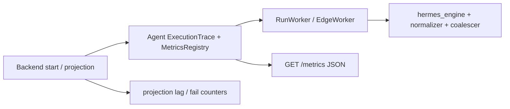

# RM-10 Agent 执行 Trace 与运行指标 实施计划

Canonical 落盘路径：[`.cursor/plans/rm-10_agent-observability-trace-and-metrics.plan.md`](rm-10_agent-observability-trace-and-metrics.plan.md)

`commit_policy: post_review`。下游只走 `smc-plan-delivery`。Todo 完成不得 commit。implementation commit 与 Roadmap DONE 分离。本项 **不** 声明 `acceptance_contract`（LOCAL only，无 LIVE）。

批准事实取 Stage PRD [`docs_agent/prd-v1.6.9-agent-observability-trace-and-metrics.md`](../../docs_agent/prd-v1.6.9-agent-observability-trace-and-metrics.md)（`APPROVED`）与 A1 §21 / §27.3。`grounded_commit: 53c9c1817c4e8619cead1eb2db1c1078ee4ec8fb`。

生产路径已有 `execution_observability.py`、JSON `/metrics`、部分 Worker/Edge 插桩与 Backend `request_trace_id` handoff。本 Plan **不重写** 该 Owner，只补缺口。禁止引入 OTel/Prometheus；禁止改写 Public Skill Run 合同；禁止第二份 `.plan.md`。

## 前端表现变化

本次改动无前端表现变化。不改 Portal / Admin / Work 页面、按钮、文案或路由。Agent 内部 `GET /metrics` 为 JSON 观测面，不对员工 UI 暴露。

## Approved PRD

[Approved PRD](../../docs_agent/prd-v1.6.9-agent-observability-trace-and-metrics.md)

## Scope

- In: A1 §21 Runtime correlation 进 `ExecutionTrace`；补齐 `run_queue_wait_seconds` 与 claim/connector/edge/artifact 完整 outcome；Hermes Native 路径 Runtime 指标（start latency、stream duration、delta/coalesce、tool pairing、approval wait、stop、disconnect/reconcile/interrupted）；Backend 投影落后/失败计数（AD 27.3）；敏感属性/低基数标签；fail-open；自动化 oracle；`lat.md` 同步。
- Out: OTel / Prometheus client；独立遥测 DB / 第二 Event Store；Collector 强制部署；改写 Public `contracts/skill-run/v1.2.1`～`v1.4.0`；实现 `delegation_topology` / Runtime Delegation / Platform Multi-Agent；RM-04 Newman；Portal 观测仪表盘。
- KEEP: C06 既有 Run/Event fencing；C07 Public Contract；C08 `delegation_topology`（RM-08 前不产生/不推断）。C02 handoff 已落地，本 Plan 对 handoff 路径 KEEP；投影可观察性在同一 C02 Backend Owner 下 MODIFY。

Plan 级冻结:

- Agent 仍是 Trace/Metrics 唯一执行事实 Owner；观测 fail-open，业务授权/安全门 fail-closed。
- 指标标签禁止 Run/Attempt/Session/Node UUID 与用户输入；Runtime 关联 id 只进 Trace/日志属性，不进 metric labels。
- `correlation_confidence` / unpaired tool 只进 Internal Trace + metrics，不进 Public SSE。
- 禁止把 metrics 写回 Run/Event/Job 状态机。
- 不新增第三方观测依赖；继续 in-process registry + JSON `/metrics`。

## Domain Activation Ledger

None

## Grounding Evidence Ledger

| Change ID | Target | Baseline State | Symbol / Entry Resolution | Caller / Callee Evidence | Existing Reuse Search | Result |
|---|---|---|---|---|---|---|
| C01 | `nodeskclaw-agent/app/services/execution_observability.py#ALLOWED_TRACE_ATTRS` | EXISTS at `53c9c181`; A1 §21 runtime keys MISSING | allowlist 无 runtime_type / runtime_run_id / correlation_confidence 等 | `bind_from_snapshot`；`run_service.get_runtime_binding` | 扩展同一 allowlist 与 ContextVar Trace；不新建 Trace Store | PASS |
| C01 | `nodeskclaw-agent/app/services/execution_observability.py#bind_from_snapshot` | EXISTS; runtime binding PARTIAL | 主要绑定 run/attempt/session；未稳定注入 A1 §21 Runtime Binding | Worker claim/execute 调用 `bind_from_snapshot` | 从 Attempt binding 填充可选缺失字段 | PASS |
| C02 | `nodeskclaw-backend/app/schemas/hermes_skill/runtime_skill_run.py#normalize_request_trace_id` | EXISTS; handoff DONE | opaque id 规范化已落地 | `RuntimeSkillRunService.start` | KEEP 回归；客户端不可覆盖冻结归属 | PASS |
| C02 | `nodeskclaw-backend/app/services/hermes_skill/run_projection_updater_service.py#RunProjectionUpdaterService` | EXISTS; projection fail log-only | PROJECTION_SYNC_FAILED 仅日志；无低基数 counter | `RunProjectionWorker._run_once` | 在既有 service 内计 lag/fail；不新建遥测 DB | PASS |
| C03 | `nodeskclaw-agent/app/services/worker.py#RunWorker` | EXISTS; queue wait metric DEFINED unused | run_queue_wait_seconds 定义存在但无生产 observe；claim outcome 不完整 | `_claim_one` / `_execute` | 补 observe-only 钩子 | PASS |
| C03 | `nodeskclaw-agent/app/services/edge_worker.py#EdgeWorker` | EXISTS; partial metrics | Edge claim/lease/spool 观测不全 | `_claim_job` / `_execute_job` / `_flush_spool` | 同 Worker 模式补 outcome | PASS |
| C03 | `nodeskclaw-agent/app/services/connector_router.py#execute_connector_run` | EXISTS; partial metrics | connector outcome 不全 | RunWorker / EdgeWorker 调用 | 补成功/失败/取消类别 | PASS |
| C03 | `nodeskclaw-agent/app/services/run_service.py#add_artifact` | EXISTS; partial metrics | artifact 生命周期 outcome 不全 | Worker / Edge upload 路径 | 补 observe-only | PASS |
| C04 | `nodeskclaw-agent/app/services/execution_observability.py#METRIC_DEFINITIONS` | EXISTS; A1 §21 runtime metrics MISSING | 无 runtime_start_seconds 等 Hermes 指标名 | `record_metric` / `GET /metrics` | 扩展定义表；不引入 prometheus-client | PASS |
| C04 | `nodeskclaw-agent/app/services/hermes_engine.py#execute_hermes_run` | EXISTS; zero observability hooks | 无 execution_observability 引用 | RunWorker engine 路径 | observe-only 插桩 | PASS |
| C04 | `nodeskclaw-agent/app/services/native_event_normalizer.py#normalize_native_event` | EXISTS; zero observability hooks | delta/tool pairing 未计量 | `hermes_engine._emit_ingested` | 同文件插桩 | PASS |
| C04 | `nodeskclaw-agent/app/services/assistant_delta_coalescer.py#AssistantDeltaCoalescer` | EXISTS; zero observability hooks | coalesce 未计量 | normalizer / engine 路径 | 同文件插桩 | PASS |
| C05 | `nodeskclaw-agent/app/services/execution_observability.py#_sanitize_attr_value` | EXISTS; label sanitize PARTIAL | 敏感键与 UUID label 拒绝已有；需覆盖新 runtime attrs 与日志合并 | `bind_from_snapshot` / `record_metric` | 扩展 trace_log_extra；fail-open 保持 | PASS |
| C06 | `nodeskclaw-agent/app/services/run_service.py#append_event` | EXISTS fencing | generation / lease 栅栏已存在 | Worker / Event SoT | KEEP；观测不得驱动状态机 | PASS |
| C07 | `nodeskclaw-backend/contracts/skill-run/` | EXISTS public bundles | v1.2.1～v1.4.0 已发布 | Contract Package | KEEP；相对 grounded_commit 空 diff | PASS |
| C08 | `delegation_topology` | MISSING until RM-08 | Snapshot/Runtime 无该字段 | RM-08 Shared Agent Execution Contract | KEEP；禁止推断 | PASS |

## Requirement Coverage Ledger

| Requirement | Source | Obligation | Classification | Change IDs | Todo | Verification IDs | Evidence Class | Blocking |
|---|---|---|---|---|---|---|---|---|
| AC-01 | AC | 每个已处理的 Central、Direct Edge 或 Hybrid Run 都有一个受控执行 Trace，能关联既有 runid、attemptid、sessionid、skillreleaseid、Step、Generation 以及可用 edgenodeid、Connector、Artifact 标识；重试、取消、旧代和 Spool 重放不创建第二个 Run/Event 事实。 | BEHAVIOR | C01 | T1 | V01 | UNIT | yes |
| AC-02 | AC | Backend Runtime 向 Agent 传递的关联上下文经验证和最小化；客户端、Connector 或 Edge 不能借其伪造或覆盖组织、用户、Run、Attempt、Node、Release 或授权边界。缺失/无效上下文只产生受控局部 Trace，不改变业务执行语义。 | BEHAVIOR | C02 | T4 | V02 | UNIT | yes |
| AC-03 | AC | Agent 暴露稳定、低基数的队列/认领、排队和执行时延、成功/失败/取消、Connector、EdgeJob、租约、Spool 重放和 Artifact 指标；每项均有固定单位、语义和有限标签，且可由自动化测试验证。 | CONTRACT | C03; C04 | T2; T3 | V03 | UNIT | yes |
| AC-04 | AC | Central、Direct Edge 与 Hybrid 的 Connector 调用、EdgeJob 认领/续租/抢占、Artifact 生命周期和取消路径在同一执行 Trace 中可区分阶段和结果；观测不改变既有 Delivery/Run/Attempt/Step 栅栏。 | BEHAVIOR | C03 | T2 | V04 | UNIT | yes |
| AC-05 | AC | Trace、指标、日志和导出载荷不包含 Prompt、模型响应全文、SecretRef、Token、签名、请求/响应正文、Artifact 字节、内部路径、原始异常或用户控制的无限制标签；高基数 Run/Attempt/Session/Node UUID 不得作为指标标签。 | SECURITY | C05 | T1 | V05 | UNIT | yes |
| AC-06 | AC | 指标读取、Trace 采样、导出或 Collector 不可达时，已授权执行继续完成；观测故障有受限诊断且不会新增 Event、改变终态、重试 Job 或阻止 Connector/Edge/Artifact 副作用。 | LIFECYCLE | C04; C05 | T1; T3 | V06 | UNIT | yes |
| AC-07 | AC | Trace/metrics 不能创建、认领、恢复、取消或重放 Run/Event/EdgeJob，也不能成为最终结果、租约或授权的判断依据；既有 Agent Run/Event Owner 与 Backend/Agent 边界不变。 | LIFECYCLE | C06 | - | V07 | UNIT | yes |
| AC-08 | AC | Public Skill Run Contract v1.0.0–v1.2.1 的目录字节和语义保持不变；Internal Trace/metrics 不进入外部 Work Consumer Bundle。 | CONTRACT | C07 | - | V08 | DIFF_SCOPE | yes |
| AC-09 | AC | RM-08 未完成时不产生或推断 delegationtopology；RM-08 以后若合同提供该字段，Agent 只将其作为可选、受限关联属性，不实现成员级 Trace、Child Run 或 Platform Multi-Agent。 | SCOPE | C08 | - | V09 | UNIT | yes |
| AC-10 | AC | 自动化验证覆盖 Central/Direct Edge/Hybrid 成功与失败、取消、旧代、租约抢占、Spool 重放、Artifact、Trace 上下文篡改、敏感属性排除、指标低基数、观测故障 fail-open、Public Contract 不变和不产生第二事件事实。 | EVIDENCE | C01; C02; C03; C04; C05; C06; C07; C08 | T5 | V01; V02; V03; V04; V05; V06; V07; V08; V09; V10 | UNIT | yes |
| DOD-01 | DOD | C01–C08 均有正向、失败、取消、旧代、重放、Edge/Connector/Artifact 与观测故障证据，且失败证据证明不改变 Run/Event/Job/Artifact 业务状态。 | EVIDENCE | C01; C02; C03; C04; C05; C06; C07; C08 | T5 | V01; V02; V03; V04; V05; V06; V07; V08; V09; V10 | UNIT | yes |
| DOD-02 | DOD | Agent 是 Trace/metrics 的唯一执行事实 Owner；Backend 只做受限上下文传递或公共投影。未新增独立遥测数据库、第二 Event Store、第二终态裁决者或强制外部 Collector。 | SCOPE | C01; C02; C04 | T1; T3; T4 | V03; V10 | DOCUMENT_SEMANTIC | yes |
| DOD-03 | DOD | 指标语义、单位、有限标签、敏感信息排除和 fail-open 行为有自动化测试；指标与导出负载不含秘密或高基数用户数据。 | CONTRACT | C04; C05 | T1; T3 | V03; V05; V06 | UNIT | yes |
| DOD-04 | DOD | Review 与 Verification 均 PASS，真实 implementation commit 和验证证据写入 Roadmap 后，RM-10 才可标记 DONE。 | RELEASE | C07 | - | V08; V10 | DOCUMENT_SEMANTIC | yes |
| DOD-05 | DOD | 实施后的 Trace/metrics Owner、可观测边界、指标合同和验证证据同步至 lat.md，且 lat check 通过。 | RELEASE | C04 | T3 | V10 | DOCUMENT_SEMANTIC | yes |

## Lifecycle Closure Matrix

| Journey | Requirements | Trigger | Nonterminal State | Success Writer | Failure / Cancel Writer | Evidence IDs |
|---|---|---|---|---|---|---|
| Queue claim to execute | AC-03; AC-06 | Worker claim then execute | claimed; execute started; metrics pending flush | RunWorker observe-only writes registry | observe hook fail-open; Run terminal unchanged | V03; V06 |
| Connector edge artifact stages | AC-04; AC-07 | connector call / edge claim / artifact add | stage in-flight under same Trace | Worker/Edge/Connector/Artifact observe-only | cancel/old-generation rejected by existing fencing; metrics do not claim | V04; V07 |
| Hermes runtime stream | AC-01; AC-03; AC-06 | execute_hermes_run with binding | streaming; approval wait; coalesce | hermes/normalizer/coalescer observe-only; Trace runtime attrs via T1 APIs | disconnect/reconcile/interrupted counters; unpaired tool metric; no Public SSE leak | V01; V03; V06 |
| Backend projection sync | AC-02; AC-06 | RunProjectionUpdaterService.sync_task_projection | cursor advancing | Backend low-cardinality lag/fail counters | sync fail increments fail counter; does not rewrite Agent SoT | V02; V10 |

## Contract / Data Flow Closure Matrix

| Flow | Requirements | Producer | Transport / Schema | Consumer | Required Fields | Validation Owner | Failure Mapping | Retry / Idempotency Identity | Evidence IDs |
|---|---|---|---|---|---|---|---|---|---|
| Trace handoff | AC-02 | Backend RuntimeSkillRunService.start | internal enqueue payload request_trace_id | Agent bind_from_snapshot | opaque request_trace_id; org/run ownership frozen server-side | normalize_request_trace_id | invalid id degraded local trace; no auth bypass | enqueue idempotency unchanged | V02 |
| Execution Trace attrs | AC-01; AC-05 | Agent Attempt runtime binding | in-process ContextVar ExecutionTrace | Worker/Hermes/logs | runtime_type; runtime_version; runtime_run_id; runtime_session_id; runtime_idempotency_key; tool_call_id; correlation_confidence optional | ALLOWED_TRACE_ATTRS + sanitize | missing optional; sensitive dropped | attempt_id + generation | V01; V05 |
| Runtime metrics export | AC-03; AC-06 | MetricsRegistry | GET /metrics JSON | operators / tests | stable names; finite labels; definitions block | METRIC_DEFINITIONS + label sanitize | snapshot fail-open empty metrics; run continues | process-local registry | V03; V06 |
| Projection counters | AC-02; DOD-02 | RunProjectionUpdaterService | in-process Backend counters / logs | operators / tests | reason/outcome enum only | Backend projection owner | fail counter on PROJECTION_SYNC_FAILED; no Agent status writeback | task_id sync cursor | V02; V10 |

## Verification Ledger

| Verification ID | Level | Entry Point / Command | Oracle | Negative / Regression | Evidence Policy | Environment | Blocking |
|---|---|---|---|---|---|---|---|
| V01 | UNIT | uv --directory nodeskclaw-agent run pytest tests/test_execution_observability.py tests/test_worker.py -q -k "trace or bind or runtime" | Trace attrs include allowlisted A1 §21 runtime keys when binding present | forged delegation_topology write rejected | LOCAL_TRANSIENT | local | yes |
| V02 | UNIT | uv --directory nodeskclaw-backend run pytest tests/hermes_skill/test_task_request_snapshot.py tests/hermes_skill/test_runtime_skill_run_agent_enqueue.py tests/hermes_skill -q -k "request_trace or projection" | invalid request_trace_id degraded; valid passthrough; projection fail counter assertable | client override of org/run still fail-closed | LOCAL_TRANSIENT | local | yes |
| V03 | UNIT | uv --directory nodeskclaw-agent run pytest tests/test_execution_observability.py tests/test_hermes_engine.py -q -k "metric or queue or runtime_" | registry or /metrics includes queue wait and runtime metric samples; labels subset of contract | UUID used as label rejected | LOCAL_TRANSIENT | local | yes |
| V04 | UNIT | uv --directory nodeskclaw-agent run pytest tests/test_edge_worker.py tests/test_connector_router.py tests/test_run_service.py -q -k "metric or spool or artifact or connector" | connector/edge/artifact outcomes distinguishable | observation mutates job status fails | LOCAL_TRANSIENT | local | yes |
| V05 | UNIT | uv --directory nodeskclaw-agent run pytest tests/test_execution_observability.py -q -k "sensitive or label or sanitize" | Prompt/Secret redacted; high-cardinality labels rejected | plaintext secret in snapshot fails | LOCAL_TRANSIENT | local | yes |
| V06 | UNIT | uv --directory nodeskclaw-agent run pytest tests/test_execution_observability.py tests/test_worker.py -q -k "fail_open or observe_error" | hook exception leaves Run terminal unchanged | observe exception aborts execution fails | LOCAL_TRANSIENT | local | yes |
| V07 | UNIT | uv --directory nodeskclaw-agent run pytest tests/test_worker.py tests/test_run_service.py -q -k "lease or generation or fence" | existing fencing regression PASS | observation bypasses generation fails | LOCAL_TRANSIENT | local | yes |
| V08 | CONTRACT_RELEASE | git diff --exit-code 53c9c1817c4e8619cead1eb2db1c1078ee4ec8fb -- nodeskclaw-backend/contracts/skill-run | empty diff vs grounded_commit | any public contract file change fails | REPO_SUMMARY | local git | yes |
| V09 | UNIT | uv --directory nodeskclaw-agent run pytest tests/test_execution_observability.py -q -k "delegation or allowlist" | allowlist excludes delegation_topology | inferred topology fails | LOCAL_TRANSIENT | local | yes |
| V10 | UNIT | uv --directory nodeskclaw-backend run pytest tests/hermes_skill -q -k projection; lat check | projection fail counter assertable; lat check PASS | silent projection failure fails | LOCAL_TRANSIENT | local | yes |

## Immediate Read

- `nodeskclaw-agent/app/services/execution_observability.py#ALLOWED_TRACE_ATTRS`
- `nodeskclaw-agent/app/services/execution_observability.py#bind_from_snapshot`
- `nodeskclaw-agent/app/services/execution_observability.py#METRIC_DEFINITIONS`
- `nodeskclaw-agent/app/services/run_service.py#get_runtime_binding`
- `nodeskclaw-agent/app/services/worker.py#RunWorker`
- `nodeskclaw-agent/app/services/edge_worker.py#EdgeWorker`
- `nodeskclaw-agent/app/services/connector_router.py#execute_connector_run`
- `nodeskclaw-agent/app/services/hermes_engine.py#execute_hermes_run`
- `nodeskclaw-agent/app/services/native_event_normalizer.py#normalize_native_event`
- `nodeskclaw-agent/app/services/assistant_delta_coalescer.py#AssistantDeltaCoalescer`
- `nodeskclaw-agent/app/main.py#metrics`
- `nodeskclaw-backend/app/schemas/hermes_skill/runtime_skill_run.py#normalize_request_trace_id`
- `nodeskclaw-backend/app/services/hermes_skill/run_projection_updater_service.py#RunProjectionUpdaterService`
- `lat.md/architecture/skill-agent.md`

## Triggered Read

- If Attempt runtime binding columns lack A1 §21 keys: `nodeskclaw-agent/app/services/run_service.py#persist_runtime_binding` read-only shape; extend bind mapping only
- If Hermes approval wait cannot be timed without status coupling: `nodeskclaw-agent/app/services/hermes_engine.py#respond_runtime_approval` read-only; observe wait duration only
- If Backend projection has no in-process counter pattern: mirror Agent record_metric shape locally inside the same service module; do not add OTel
- Otherwise: do not read

## Change Matrix

| Change ID | File / Symbol | Kind | Action | Existing Owner | Todo Owner | Target State | PRD Capability | New File? |
|---|---|---|---|---|---|---|---|---|
| C01 | `nodeskclaw-agent/app/services/execution_observability.py#ALLOWED_TRACE_ATTRS` | PROD | MODIFY | Agent Execution Plane | T1 | A1 §21 runtime keys allowlisted | Execution Trace correlation | no |
| C01 | `nodeskclaw-agent/app/services/execution_observability.py#bind_from_snapshot` | PROD | MODIFY | Agent Execution Plane | T1 | bind fills runtime_* and correlation_confidence | Execution Trace correlation | no |
| C01 | `nodeskclaw-agent/app/services/execution_observability.py#ExecutionTrace` | PROD | MODIFY | Agent Execution Plane | T1 | attrs carry runtime correlation | Execution Trace correlation | no |
| C01 | `nodeskclaw-agent/app/services/run_service.py#get_runtime_binding` | PROD | MODIFY | Agent Run/Event | T1 | binding read supplies runtime fields to bind | Execution Trace correlation | no |
| C01 | `nodeskclaw-agent/tests/test_execution_observability.py` | TEST | MODIFY | Agent Execution Plane tests | T1 | trace/bind/runtime coverage | Execution Trace correlation | no |
| C02 | `nodeskclaw-backend/app/schemas/hermes_skill/runtime_skill_run.py#normalize_request_trace_id` | PROD | KEEP | Backend Runtime Skill Run | - | handoff regression frozen | Trace context handoff | no |
| C02 | `nodeskclaw-backend/app/services/hermes_skill/runtime_skill_run_service.py#RuntimeSkillRunService` | PROD | KEEP | Backend Runtime Skill Run | - | start still issues opaque request_trace_id | Trace context handoff | no |
| C02 | `nodeskclaw-backend/app/services/hermes_skill/run_projection_updater_service.py#RunProjectionUpdaterService` | PROD | MODIFY | Backend Runtime Skill Run | T4 | lag/fail low-cardinality counters | Trace context handoff / AD 27.3 | no |
| C02 | `nodeskclaw-backend/tests/hermes_skill/test_runtime_skill_run_agent_enqueue.py` | TEST | MODIFY | Backend Runtime Skill Run tests | T4 | handoff + projection counter coverage | Trace context handoff | no |
| C03 | `nodeskclaw-agent/app/services/worker.py#RunWorker` | PROD | MODIFY | Agent Execution Plane | T2 | queue wait + claim/execute outcomes | Instrumentation | no |
| C03 | `nodeskclaw-agent/app/services/edge_worker.py#EdgeWorker` | PROD | MODIFY | Agent Execution Plane | T2 | edge claim/lease/spool outcomes | Instrumentation | no |
| C03 | `nodeskclaw-agent/app/services/connector_router.py#execute_connector_run` | PROD | MODIFY | Agent Execution Plane | T2 | connector outcomes complete | Instrumentation | no |
| C03 | `nodeskclaw-agent/app/services/run_service.py#add_artifact` | PROD | MODIFY | Agent Run/Event | T2 | artifact lifecycle outcomes | Instrumentation | no |
| C03 | `nodeskclaw-agent/tests/test_worker.py` | TEST | MODIFY | Agent Worker tests | T2 | queue/claim metric coverage | Instrumentation | no |
| C03 | `nodeskclaw-agent/tests/test_edge_worker.py` | TEST | MODIFY | Agent Edge tests | T2 | edge outcome coverage | Instrumentation | no |
| C03 | `nodeskclaw-agent/tests/test_connector_router.py` | TEST | MODIFY | Agent Connector tests | T2 | connector outcome coverage | Instrumentation | no |
| C04 | `nodeskclaw-agent/app/services/execution_observability.py#METRIC_DEFINITIONS` | PROD | MODIFY | Agent Execution Plane | T3 | A1 §21 runtime metric names frozen | Runtime metrics contract | no |
| C04 | `nodeskclaw-agent/app/main.py#metrics` | PROD | MODIFY | Agent Execution Plane | T3 | JSON export includes new definitions | Runtime metrics contract | no |
| C04 | `nodeskclaw-agent/app/services/hermes_engine.py#execute_hermes_run` | PROD | MODIFY | Agent Execution Plane | T3 | start/stream/stop/approval/disconnect metrics | Runtime metrics contract | no |
| C04 | `nodeskclaw-agent/app/services/native_event_normalizer.py#normalize_native_event` | PROD | MODIFY | Agent Execution Plane | T3 | delta/tool pairing metrics | Runtime metrics contract | no |
| C04 | `nodeskclaw-agent/app/services/assistant_delta_coalescer.py#AssistantDeltaCoalescer` | PROD | MODIFY | Agent Execution Plane | T3 | coalesce metrics | Runtime metrics contract | no |
| C04 | `nodeskclaw-agent/tests/test_hermes_engine.py` | TEST | MODIFY | Agent Hermes tests | T3 | runtime metric sample coverage | Runtime metrics contract | no |
| C04 | `lat.md/architecture/skill-agent.md` | DOC | MODIFY | Architecture wiki | T3 | document observability contract | Runtime metrics contract | no |
| C05 | `nodeskclaw-agent/app/services/execution_observability.py#_sanitize_attr_value` | PROD | MODIFY | Agent Execution Plane | T1 | sensitive exclude + safe log extras | Trace/log safety | no |
| C05 | `nodeskclaw-agent/app/services/execution_observability.py#fail_open` | PROD | MODIFY | Agent Execution Plane | T1 | observe faults do not abort business | Trace/log safety | no |
| C06 | `nodeskclaw-agent/app/services/run_service.py#append_event` | PROD | KEEP | Agent Run/Event | - | fencing unchanged | Existing fencing | no |
| C07 | `nodeskclaw-backend/contracts/skill-run/` | PROD | KEEP | Backend Contract Package | - | empty diff vs grounded_commit | Public contract | no |
| C08 | `delegation_topology` | PROD | KEEP | Backend Contract Package (RM-08) | - | not produced or inferred | Delegation topology | no |

## Implementation Decisions

| Change ID | Strategy | Root-Cause / Reuse Evidence | Why This Is Minimum |
|---|---|---|---|
| C01 | MODIFY_EXISTING | ExecutionTrace ContextVar and Attempt runtime binding already exist at grounded_commit | Extend allowlist/bind only; no Trace Store / OTel |
| C02 | MODIFY_EXISTING | handoff helpers already exist; projection failures are log-only today | KEEP handoff paths; add counters inside existing projection service |
| C03 | MODIFY_EXISTING | Worker/Edge/Connector/Artifact already call partial observe_stage / record_metric | Fill missing observes at existing lifecycle boundaries |
| C04 | MODIFY_EXISTING | METRIC_DEFINITIONS + JSON /metrics already ship without Prometheus | Add runtime metric names and Hermes-path observes only |
| C05 | MODIFY_EXISTING | sanitize/fail_open already gate labels and observe errors | Extend for new attrs and trace_log_extra; no new middleware service |

## Write Ownership Ledger

| Todo | Owns Changes | Writes | Reads | Depends On | Parallel Safe |
|---|---|---|---|---|---|
| T1 | C01; C05 | `nodeskclaw-agent/app/services/execution_observability.py#ALLOWED_TRACE_ATTRS`; `nodeskclaw-agent/app/services/execution_observability.py#bind_from_snapshot`; `nodeskclaw-agent/app/services/execution_observability.py#ExecutionTrace`; `nodeskclaw-agent/app/services/execution_observability.py#_sanitize_attr_value`; `nodeskclaw-agent/app/services/execution_observability.py#fail_open`; `nodeskclaw-agent/app/services/run_service.py#get_runtime_binding`; `nodeskclaw-agent/tests/test_execution_observability.py` | `nodeskclaw-agent/app/services/run_service.py#persist_runtime_binding` | - | no |
| T2 | C03 | `nodeskclaw-agent/app/services/worker.py#RunWorker`; `nodeskclaw-agent/app/services/edge_worker.py#EdgeWorker`; `nodeskclaw-agent/app/services/connector_router.py#execute_connector_run`; `nodeskclaw-agent/app/services/run_service.py#add_artifact`; `nodeskclaw-agent/tests/test_worker.py`; `nodeskclaw-agent/tests/test_edge_worker.py`; `nodeskclaw-agent/tests/test_connector_router.py` | `nodeskclaw-agent/app/services/execution_observability.py#METRIC_DEFINITIONS`; `nodeskclaw-agent/app/services/execution_observability.py#bind_from_snapshot` | T1; T3 | no |
| T3 | C04 | `nodeskclaw-agent/app/services/execution_observability.py#METRIC_DEFINITIONS`; `nodeskclaw-agent/app/main.py#metrics`; `nodeskclaw-agent/app/services/hermes_engine.py#execute_hermes_run`; `nodeskclaw-agent/app/services/native_event_normalizer.py#normalize_native_event`; `nodeskclaw-agent/app/services/assistant_delta_coalescer.py#AssistantDeltaCoalescer`; `nodeskclaw-agent/tests/test_hermes_engine.py`; `lat.md/architecture/skill-agent.md` | `nodeskclaw-agent/app/services/execution_observability.py#bind_from_snapshot`; `nodeskclaw-agent/app/services/run_service.py#get_runtime_binding` | T1 | no |
| T4 | C02 | `nodeskclaw-backend/app/services/hermes_skill/run_projection_updater_service.py#RunProjectionUpdaterService`; `nodeskclaw-backend/tests/hermes_skill/test_runtime_skill_run_agent_enqueue.py` | `nodeskclaw-backend/app/schemas/hermes_skill/runtime_skill_run.py#normalize_request_trace_id` | T1 | no |
| T5 | - | - | `nodeskclaw-backend/contracts/skill-run/`; `lat.md/architecture/skill-agent.md`; `nodeskclaw-agent/tests/test_execution_observability.py` | T1; T2; T3; T4 | no |

## Integration Hotspots

| File | Owner Todo | Reason |
|---|---|---|
| nodeskclaw-agent/app/services/hermes_engine.py | T3 | Single writer for Hermes runtime metric hooks |

## Generated Outputs Ledger

| Source Change | Generator Owner | Generated Outputs | Command | Drift Check |
|---|---|---|---|---|
| - | - | none | - | - |

## New File Justification

None — all targets modify existing modules; no new production files.

## Todo T1 — Runtime Binding 进 ExecutionTrace 与安全日志属性

**Owns Changes**
- C01
- C05

**Goal**
A1 §21 Runtime Binding 字段进入 ExecutionTrace allowlist 与 bind 路径；日志可安全附带当前 Trace；metric labels 仍禁止 UUID。

**Immediate anchors**
- `nodeskclaw-agent/app/services/execution_observability.py#ALLOWED_TRACE_ATTRS`
- `nodeskclaw-agent/app/services/execution_observability.py#bind_from_snapshot`
- `nodeskclaw-agent/app/services/run_service.py#get_runtime_binding`

**Changes**
- 扩展 allowlist：runtime_type、runtime_version、runtime_run_id、runtime_session_id、runtime_idempotency_key、tool_call_id、correlation_confidence（可选缺失）
- bind_from_snapshot / Attempt binding 读路径填充；增加 trace_log_extra() 供 logger 安全合并
- 禁止把上述 id 放进 metric labels；单测覆盖 sanitize 与 fail-open

**Stop conditions**
- [ ] V01 / V05 / V09 聚焦用例 PASS
- [ ] 不引入 OTel / 第二 Trace Store

**Triggered reads**
- If Attempt binding shape lacks keys: read persist_runtime_binding only
- Otherwise: do not read

## Todo T2 — 队列时延与 Worker/Edge/Connector/Artifact 完整 outcome

**Owns Changes**
- C03

**Goal**
补齐生命周期指标缺口：run_queue_wait_seconds 实际观测；claim/connector/edge/artifact 完整 outcome。

**Immediate anchors**
- `nodeskclaw-agent/app/services/worker.py#RunWorker`
- `nodeskclaw-agent/app/services/edge_worker.py#EdgeWorker`
- `nodeskclaw-agent/app/services/connector_router.py#execute_connector_run`
- `nodeskclaw-agent/app/services/run_service.py#add_artifact`

**Changes**
- created 到 claim 观测 run_queue_wait_seconds
- claim/connector/edge/artifact 补全 outcome；全部 observe-only、fail-open
- 扩展对应单测

**Stop conditions**
- [ ] V03 / V04 / V06 聚焦用例 PASS
- [ ] 观测不改变 job/run 状态机

**Triggered reads**
- None

## Todo T3 — Hermes/Normalizer/Coalescer A1§21 Runtime 指标

**Owns Changes**
- C04

**Goal**
冻结并实现 A1 §21 Runtime 指标名；Hermes Native 路径写入样本；/metrics JSON 导出包含新定义；binding 后经 T1 API 刷新 Trace runtime 字段；同步 lat.md。

**Immediate anchors**
- `nodeskclaw-agent/app/services/execution_observability.py#METRIC_DEFINITIONS`
- `nodeskclaw-agent/app/services/hermes_engine.py#execute_hermes_run`
- `nodeskclaw-agent/app/services/native_event_normalizer.py#normalize_native_event`
- `nodeskclaw-agent/app/services/assistant_delta_coalescer.py#AssistantDeltaCoalescer`
- `nodeskclaw-agent/app/main.py#metrics`
- `lat.md/architecture/skill-agent.md`

**Changes**
- 新增低基数指标：runtime_start_seconds、runtime_stream_seconds、runtime_message_delta_total、runtime_assistant_coalesced_total、runtime_tool_start_total、runtime_tool_complete_total、runtime_tool_unpaired_total、runtime_approval_wait_seconds、runtime_stop_seconds、runtime_disconnect_total、runtime_reconcile_total、runtime_interrupted_total
- Hermes/normalizer/coalescer observe-only 插桩；不改 Event SoT 语义
- 扩展 test_hermes_engine.py 样本断言；更新 lat.md Execution Observability 节

**Stop conditions**
- [ ] V01 / V03 / V10 含 Runtime 样本与 lat check PASS
- [ ] 不引入 prometheus-client

**Triggered reads**
- If approval wait timing needs status read: respond_runtime_approval read-only
- Otherwise: do not read

## Todo T4 — Backend 投影落后/失败指标（AD 27.3）

**Owns Changes**
- C02

**Goal**
投影失败/落后可观察；request_trace_id handoff 仅 KEEP 回归。

**Immediate anchors**
- `nodeskclaw-backend/app/services/hermes_skill/run_projection_updater_service.py#RunProjectionUpdaterService`
- `nodeskclaw-backend/app/schemas/hermes_skill/runtime_skill_run.py#normalize_request_trace_id`

**Changes**
- 低基数 projection lag/fail counter；标签仅 reason/outcome 有限枚举
- 不把 Backend 变成 Agent Trace Owner；不改 Public enqueue 形状
- 扩展 enqueue/projection 相关单测

**Stop conditions**
- [ ] V02 / V10 投影断言 PASS

**Triggered reads**
- If counter helper needed: keep inside same service module
- Otherwise: do not read

## Todo T5 — AC oracle、Public 合同空 diff、lat.md

**Owns Changes**
- -

**Goal**
阻断 Verification 全绿；Public 合同相对 grounded_commit 空 diff；确认 lat.md 与 lat check 已由 T3 写入后可验证；确认 C06/C07/C08 KEEP 边界。

**Immediate anchors**
- `nodeskclaw-agent/tests/test_execution_observability.py`
- `nodeskclaw-backend/contracts/skill-run/`
- `lat.md/architecture/skill-agent.md`

**Changes**
- 汇总执行 V01–V10；git diff --exit-code 对 Public 合同
- 本 Todo 不拥有生产/文档写集；发现 lat 缺口则回退 T3
- 确认 C06/C07/C08 KEEP 边界未被破坏

**Stop conditions**
- [ ] V01–V10 PASS
- [ ] V08 empty diff
- [ ] lat check PASS

**Triggered reads**
- None

## Verification

Run all blocking Verification Ledger entries through smc-plan-delivery/scripts/evidence.py under LOCAL Evidence Policy only. No LIVE / FAULT / EXTERNAL acceptance contract. After Review PASS + Verification PASS, create implementation commit separately from Roadmap RM-10 DONE.

## Completion Gate

| Exit State | Allowed When | Blocking Evidence |
|---|---|---|
| IMPLEMENTED_AND_PROVEN | all Cursor todos completed; completion audit FRESH PASS; implementation review FRESH PASS; all blocking Verification FRESH PASS; durable Evidence Manifest FRESH | V01 V02 V03 V04 V05 V06 V07 V08 V09 V10 plus durable Evidence Manifest |
| IMPLEMENTED_NOT_PROVEN | implementation exists but proof is pending/stale | pending/stale gate IDs |
| BLOCKED | local toolchain missing or Verification cannot run | preflight/blocker record |
| RETURN_PRD | approved owner/boundary conflicts such as requiring OTel/Prometheus or Public contract rewrite | PRD revision request |
