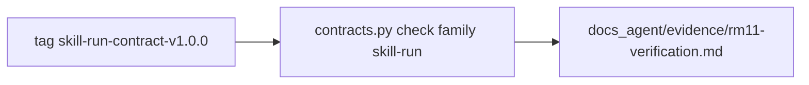

# RM-11 P0 合同导出实施计划

**SUPERSEDED（已废止，禁止执行）。** AD-SKILL-AGENT-V16 v1.3.0 将 RM-11 的 Work 出口改为 `SKILL-RUN-CONTRACT v1.2.1`。本文件描述的 v1.0.0 KEEP-only 证据工作不得继续。后继以新 Stage PRD `docs_agent/prd-v1.6.6-cumulative-public-consumer-contract.md` 生成新 Plan。

模式 **CREATE**。目标路径尚不存在： [`.cursor/plans/rm-11_p0-consumer-contract-export.plan.md`](.cursor/plans/rm-11_p0-consumer-contract-export.plan.md)。不得覆盖其它 `.plan.md`。

`commit_policy: post_review`。顺序：`Execute -> Review -> Verification -> Commit Implementation`。Todo 完成不得 commit。Roadmap `DONE` 必须另开独立 docs commit。

用户确认后，先把本内容落成带表格的 SMC v3.2 文件并跑校验；校验通过后再执行唯一 Todo T1。

## 前端表现变化

本次改动无前端表现变化。不改 Portal / Admin / Work 页面、按钮、文案或路由。员工公共面仍是 Backend `/api/v1/mcp` 与 `/api/v1/runs/*`。

## Approved PRD

[docs_agent/prd-v1.6.5-p0-consumer-contract-export.md](docs_agent/prd-v1.6.5-p0-consumer-contract-export.md)

- `status: APPROVED`，`review_verdict: PASS`
- `source_revision: AD-SKILL-AGENT-V16@1.2.0/RM-11`
- `grounded_commit: 21bdc38afc44a780659f3d589daf37bdf6c47328`（Plan 必须原样继承，converge 未改）
- `grounding_source: committed_baseline`

## Scope

- In: Provider 侧证明 tag `skill-run-contract-v1.0.0` 身份、LF `SHA256SUMS`、P0 产物集完整；把核验结果写入本仓 evidence。
- Out: 不 generate / 改写 `contracts/skill-run/v1.0.0/`；不移动 tag；不打第二套 P0 tag；不补矩阵 PARTIAL（逐端点错误映射 / 同源 / 重连 / 轮询，留给 RM-09）；Work UI、IPC、`consumer-lock.json`、`smc-copilot` 导入测试不是本仓 DONE。
- Production Owner: Bundle 仍归 Backend Contract Package；C10 Owner 是 Repository Acceptance Assets（仓库验收资产），不是第二合同包。Agent 仍是 Run 事实源。



## Grounding（仅非 KEEP）

C10 是唯一 ADD。基线 `21bdc38` 上 `docs_agent/evidence/` 已有 rm01/rm02/rm03，**没有** `rm11-verification.md`（`git show 21bdc38:docs_agent/evidence/rm11-verification.md` 不存在）。

复用、不新写生产代码：

- [`nodeskclaw-backend/scripts/contracts.py#_check_skill_run_contracts`](nodeskclaw-backend/scripts/contracts.py) 已校验 v1.0.0 checksum + fixtures；CLI 已有 `check --family skill-run`（argparse `choices` 含 `skill-run`）
- **禁止** `check --release`：`_validate_skill_run_release` 要求 tag 指向当前 HEAD，冻结后 HEAD 已前进，该开关会误失败
- **禁止** `generate --family skill-run --version 1.0.0`
- [`tests/contracts/test_contracts_check.py`](nodeskclaw-backend/tests/contracts/test_contracts_check.py) 已断言 P0 公共面文件集
- 证据格式复用 [`docs_agent/evidence/rm01-verification.md`](docs_agent/evidence/rm01-verification.md)
- Tag peel 目标：`3e345519bcfa606553893234b59fb607ee57ac8a`；manifest `backendCommit` 仍为实现提交 `6afab6fb`（I/R 祖先关系，不要当成 peel）

C01–C09 KEEP 不进 Grounding Ledger，但必须进 Change Matrix（Requirement Coverage 会引用这些 Change ID）。Matrix 的 Capability / Target State **不要**写「鉴权 / 安全 / auth / security」，以免 assessor 误判 `SECURITY_OR_TRUST_BOUNDARY`。AC-09 的 SECURITY 分类只写在 Coverage Ledger。

## Requirement Coverage（摘要）

每条 AC/DOD 各一行，Obligation 必须与 PRD 原文一致（validator 会 `normalize_requirement` 比对）。全部 `Blocking=yes`，Todo 均为 T1（T1 只写证据，不改 KEEP 文件）。

- AC-01 / AC-02 -> C01 -> V01 `CONTRACT_RELEASE`
- AC-03 / AC-04 -> C02 -> V02 `CONTRACT_RELEASE`
- AC-05 / AC-06 -> C03 -> V03 `CONTRACT_RELEASE`
- AC-07 -> C05 -> V03
- AC-08 -> C04 -> V03
- AC-09 -> C06 -> V03（Classification=`SECURITY`）
- AC-10 -> C07 -> V03
- AC-11 -> C08 -> V03
- AC-12 -> C09 -> V02 + V04（Classification=`OPERATIONS`）
- AC-13 / DOD-01 -> C10 -> V06 `DOCUMENT_SEMANTIC`
- AC-14 -> C01–C10 -> V05 `DIFF_SCOPE`

Lifecycle Closure Matrix: **None**（PRD 无 State and Concurrency Invariants，Coverage 无 LIFECYCLE）。

Contract / Data Flow Closure Matrix: **None**（C10 不新增跨进程合同流；只记录已发布 Bundle）。因此 assessor 可为 `NOT_REQUIRED`，不必 `smc-plan-review`。

Generated Outputs Ledger: **None**（不跑 generate）。

## Change Matrix（落盘时用表）

KEEP 行：`Todo Owner = -`，`New File? = no`。

- C01 KEEP [`constants.py#SKILL_RUN_TAG_NAME`](nodeskclaw-backend/app/schemas/skill_run/constants.py) 与 [`v1.0.0/manifest.json`](nodeskclaw-backend/contracts/skill-run/v1.0.0/manifest.json)
- C02 KEEP [`SHA256SUMS`](nodeskclaw-backend/contracts/skill-run/v1.0.0/SHA256SUMS)（当前清单无 `consumer-lock.json`）
- C03 KEEP `mcp/tools-list.response.schema.json`（`capabilityKind` const `"skill"` 且 required）与 `mcp/tools-call.response.schema.json`（`structuredContent.run_id` required）
- C04 KEEP `http/endpoint-matrix.json` 的 `sseReplay.header=Last-Event-ID` 与 public-run / result / run-event
- C05 KEEP 同一 matrix 的 `idempotency`（header / scope / ttlSeconds / 409 / replay original `run_id`）
- C06 KEEP `fixtures/auth-tenant-denial.json`（Matrix 文案写 tenant-denial fixture，避免触发安全关键词）
- C07 KEEP artifact list / descriptor / download schema
- C08 KEEP `capabilities/unsupported.schema.json`（approval / attachments = unsupported）
- C09 KEEP `scripts/contracts.py#check_contracts` 与 `#_check_skill_run_contracts`
- C10 ADD DOC **yes** [`docs_agent/evidence/rm11-verification.md`](docs_agent/evidence/rm11-verification.md) — Todo T1

## Implementation Decision

C10 `MINIMAL_NEW`：现有 check / pytest / git 已能证明 KEEP；缺口只是 RM-11 证据文件。不新增服务、测试 harness、依赖或合同目录。

## Write Ownership

- T1 拥有 C10
- Writes: `docs_agent/evidence/rm11-verification.md`
- Reads: `-`
- Depends On: `-`
- Parallel Safe: `no`
- Integration Hotspots: None
- New File Justification: 现有 `rm01/rm02/rm03-verification.md` 是其它 Item 的证据 SOT，不能混写；Acceptance Assets 惯例是每 Item 一份 `rmNN-verification.md`

## Todo T1 — 留下 Provider 侧 P0 导出核验证据

**Owns Changes:** C10

**Immediate anchors**

- `docs_agent/prd-v1.6.5-p0-consumer-contract-export.md`
- `nodeskclaw-backend/scripts/contracts.py#_check_skill_run_contracts`
- `nodeskclaw-backend/contracts/skill-run/v1.0.0/SHA256SUMS`
- `docs_agent/evidence/rm01-verification.md`（格式模板，只读）

**Changes**

运行下列验证，把命令、退出码、oracle 与负向结果写入 `docs_agent/evidence/rm11-verification.md`。证据通过条件不得引用 Work / `smc-copilot` 路径。

**Stop conditions**

- 证据文件存在且覆盖 AC-01 至 AC-14
- 未改 `contracts/skill-run/v1.0.0/`、未 `generate` v1.0.0、未 `check --release`、未移动 tag
- 工作树相对 tag peel 的 v1.0.0 diff 为空

**Triggered reads**

- 若 `check --family skill-run` 失败：只读 `_validate_checksums`，判定发布物损坏；禁止 generate 或新建平行目录
- 若 `git diff 3e345519 HEAD -- nodeskclaw-backend/contracts/skill-run/v1.0.0` 非空：停在 `RETURN_PRD`，不得改写字节
- 否则不读 Gateway / Agent / Work

## Verification Ledger（落盘命令）

V01 Tag 身份（AC-01/AC-02）

- `git show-ref --dereference skill-run-contract-v1.0.0`
- `git rev-parse "refs/tags/skill-run-contract-v1.0.0^{}"`
- `git cat-file -t refs/tags/skill-run-contract-v1.0.0`
- Oracle: peeled = `3e345519bcfa606553893234b59fb607ee57ac8a`；annotated tag；仅一条 `skill-run-contract-v1.0.0`
- Evidence: `artifacts/rm11-v01-tag.txt`

V02 Checksum + 损坏失败关闭（AC-03/AC-04/AC-12 正向）

- 读 `SHA256SUMS` 原始字节：无 `\r`；路径唯一；不含 `consumer-lock.json`；每个 listed 文件 sha256 匹配
- `cd nodeskclaw-backend && uv run python scripts/contracts.py check --family skill-run`
- Oracle: 打印 `SKILL-RUN-CONTRACT check passed`
- Negative: 把 v1.0.0 **拷到临时目录** 后改坏一条 digest 或删 listed 文件，调用 `_validate_checksums` 必须 `SystemExit`。禁止改工作树内真文件
- Evidence: `artifacts/rm11-v02-check.txt`

V03 Schema / matrix KEEP 字段（AC-05–AC-11）

- Python 读取 tag 树或工作树（二者 v1.0.0 必须一致）中的 JSON：`capabilityKind` const skill；`run_id` required；idempotency scope/TTL/409/replay；`Last-Event-ID`；三份 artifact schema 存在；unsupported；`fixtures/auth-tenant-denial.json` 存在
- Evidence: `artifacts/rm11-v03-schema.txt`

V04 既有 pytest（AC-12 表面完整性）

- `cd nodeskclaw-backend && uv run pytest tests/contracts/test_contracts_check.py --junitxml=../artifacts/rm11-v04.xml`
- Oracle: 退出码 0；P0 公共面文件在，内部 Edge/snapshot schema 不在 v1.0.0
- Evidence: `artifacts/rm11-v04.xml`

V05 字节不变（AC-14）

- `git diff --exit-code 3e345519bcfa606553893234b59fb607ee57ac8a HEAD -- nodeskclaw-backend/contracts/skill-run/v1.0.0`
- Oracle: 空 diff。本 Item 不写 `v1.1.0/` / `v1.2.0/`
- Evidence: `artifacts/rm11-v05-diff.txt`

V06 证据文件本身（AC-13 / DOD-01）

- 打开 `docs_agent/evidence/rm11-verification.md`
- Oracle: 记录 V01–V05；无 Work 源码路径作为通过条件；未声称 RM-04/RM-05 完成
- Evidence: 该 markdown 自身

## Completion Gate

- `IMPLEMENTED_AND_PROVEN`：V01–V06 证据均留存
- `IMPLEMENTED_NOT_PROVEN`：文件写了但命令未跑完
- `BLOCKED`：本机无 git tag 或无法跑 `uv`
- `RETURN_PRD`：tag peel 变了或 v1.0.0 字节已漂

## 落盘后必跑（Execute 前）

```bash
python .agents/skills/smc-plan-from-approved-prd-ponytail/scripts/validate_generation_integrity.py .cursor/plans/rm-11_p0-consumer-contract-export.plan.md
python .agents/skills/smc-plan-validator/scripts/validate_plan.py .cursor/plans/rm-11_p0-consumer-contract-export.plan.md
python .agents/skills/smc-plan-review/scripts/assess_plan_review.py .cursor/plans/rm-11_p0-consumer-contract-export.plan.md
```

期望：前两个 PASS；assessor `NOT_REQUIRED`（Contract Matrix 为 None，且 Matrix 文案避开安全关键词）。
