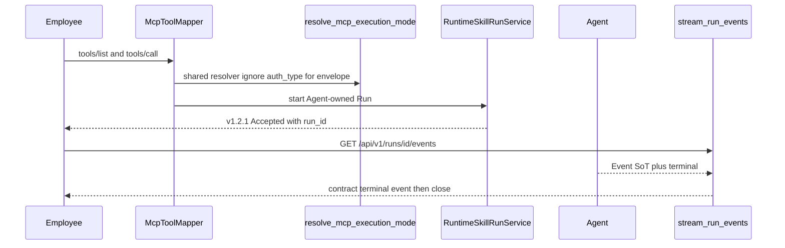

# RM-12 v1.2.1 员工公共面符合性实施计划

Canonical 落盘路径：[`.cursor/plans/rm-12_v121_public_conformance.plan.md`](rm-12_v121_public_conformance.plan.md)

本文件是同一 `plan_id: RM-12` 的 REVISE：历史 C01–C10 已在旧 grounded commit `630da4e9` 交付并 KEEP；本版只实施 APPROVED PRD `1.7.0` 的 C11–C15。`commit_policy: post_review`。下游只走 `smc-plan-delivery`。

批准事实只取 `grounded_commit` `81babaebae7c7a1400db5be6139633af47bf5161`。A1 增补文档 frontmatter 仍为 `PROPOSED`，不回退本 PRD，也不把 HermesTaskWorker 删除写入本项 WRITE_OWNER。

## 前端表现变化

本次改动无前端表现变化。不改 Portal / Admin / Work 页面、按钮、文案或路由。员工仍只通过既有 Catalog、`tools/call` 与 `/api/v1/runs/*` 使用 Skill Run；本项只修正 Backend 对冻结合同的可观察符合。

## Approved PRD

[Approved PRD](../../docs_agent/prd-v1.6.10-skill-run-v121-public-conformance.md)

## Scope

- In: 禁止 `auth_type` 决定员工 Runtime Skill 的公共信封与执行模式；`tools/list` 与 `tools/call` 共用同一 resolver；员工 `tools/call` 只返回冻结 v1.2.1 Accepted（`run_id` + `/api/v1/runs/*`）；HermesTask 降为内部投影且投影失败可观察；Public SSE 四类终态先投递合同事件再关闭；PC-10 至 PC-14 使用真实 `user_jwt` 证据。
- Out: 改写 `contracts/skill-run/v1.2.1/` 或 tag；RM-09 / 新合同版本；RM-13 Native Bridge；RM-14 Coalescer；RM-15 Approval/Cancel 全闭环；新建 Idempotency Service、第二 Event Store、第二终态 Owner、Acceptance Service；删除 HermesTask 表或 HermesTaskWorker；删除 Workspace ACL；仓外 Work 前端构建；把 fixture PASS 当作 DONE。
- Production Owner inherited from PRD: MCP Gateway（C11/C12 出口与 Catalog）；Runtime Skill Run KEEP C07 装配 Accepted；Skill Run API（C14 SSE；C13 内部投影）；Contract Package KEEP（C08）；Workspace ACL + Agent Event/终态 KEEP（C09）。

Plan 级冻结（不改 PRD 语义）:

- 默认执行模式不得按凭证分流。Runtime Skill 在 `MCP_TASK_SSE_ENABLED` 且默认 `async_event` 时，`user_jwt` 与 `mcp_client_token` 都解析为 `async_event`，Catalog 宣告同一集合。
- 员工 Runtime `tools/call` 在 `RuntimeSkillRunService.start()` 之后必须返回 `structured_content` / 员工 Accepted，禁止改走 `_build_task_response`。
- `_merge_org_mcp_async_payload` 在 `SKILL_AGENT_ENABLED` 路径不得并入 HermesTask 平面字段。Expert / legacy `/hermes/tasks/*` 可保留。
- 不删除 `HermesTaskWorker`；只保证员工 Public 不再以该执行器为出口。
- Public GET Run / SSE 继续以 Agent Event SoT / terminal aggregator 为准；`HermesTask.status` 不得覆盖。
- 与 RM-14 若改同一段 Public Projection，先完成者复跑 PC-12 与 PC-13。
- 历史 C01–C10 只回归，不重做。

## Grounding Evidence Ledger

| Change ID | Target | Baseline State | Symbol / Entry Resolution | Caller / Callee Evidence | Existing Reuse Search | Result |
|---|---|---|---|---|---|---|
| C11 | `nodeskclaw-backend/app/services/mcp_skill_gateway/mcp_execution_mode.py#resolve_mcp_execution_mode` | PARTIAL at `81babaeb` | 默认 `async_event` 时 `mcp_client_token` 返回 `async_event`，`user_jwt` 返回 `queued` | `McpToolMapper#call_tool` 用该返回值在 `queued` 分支调用 `_build_task_response` | 去掉 `auth_type` 对 Runtime Skill 默认模式的分流即可；不新建 mode 服务 | PASS |
| C11 | `nodeskclaw-backend/app/services/hermes_skill/mcp_tool_mapper.py#McpToolMapper#call_tool` | PARTIAL at `81babaeb` | `execution_mode == ASYNC_EVENT_MODE` 才返回 `runtime_run_result.structured_content`；否则 `_build_task_response` 输出 `task_id` / `/api/v1/hermes/tasks/` | `RuntimeSkillRunService#build_structured_content` 员工分支已是 v1.2.1 形状（KEEP C07） | 员工 Runtime 路径停在 structured_content；不改 Expert Hermes 信封 | PASS |
| C12 | `nodeskclaw-backend/app/services/hermes_skill/mcp_tool_mapper.py#McpToolMapper#_build_runtime_skill_tool_metadata` | PARTIAL at `81babaeb` | Catalog 硬编码 `executionModes=[ASYNC_EVENT_MODE]` | `call_tool` 另调 `resolve_mcp_execution_mode` | Catalog 改为调用同一 resolver；禁止第二套硬编码 | PASS |
| C13 | `nodeskclaw-backend/app/services/hermes_skill/mcp_tool_mapper.py#McpToolMapper#_merge_org_mcp_async_payload` | PARTIAL at `81babaeb` | `SKILL_AGENT_ENABLED` 时已避免并入 `agent_id`；`False` 分支仍并入禁用字段 | `call_tool` async_event 成功路径调用 merge | 员工路径保持不合并禁用字段；不删函数以免 Expert 回归 | PASS |
| C13 | `nodeskclaw-backend/app/services/hermes_skill/run_projection_updater_service.py#RunProjectionUpdaterService#_map_event_type` | PARTIAL at `81babaeb` | 无 `run.timed_out`；未知类型落入 `HERMES_RUN_DELTA`；`sync_task_projection` 失败 `return False` | Public GET/SSE 已走 Agent，不读该映射作为终态 | 补 `run.timed_out`；失败打结构化日志；不让投影成为 Public 终态 Owner | PASS |
| C14 | `nodeskclaw-backend/app/api/runs.py#stream_run_events` | PARTIAL at `81babaeb` | `_public_run_event` 已投影 `run.timed_out`；`status in TERMINAL and not items: return` 可无终态事件关流 | `event_generator` -> `_agent_get` events then run status | 终态且无合同终态帧时补投递或继续等到终态事件；禁止静默 `return` | PASS |
| C15 | `nodeskclaw-backend/tests/hermes_skill/test_employee_jwt_public_conformance.py` | MISSING at `81babaeb` | 既有 `test_mcp_execution_mode.py#test_resolve_mode_user_jwt_defaults_queued` 把分流写成正确行为；Roadmap 证据为 fixture | 无真实 `auth_type=user_jwt` PC-10–PC-14 模块 | 扩展 resolver 单测归 T1；PC 证据新建测试模块，不新建 Acceptance Service | PASS |

## Requirement Coverage Ledger

| Requirement | Source | Obligation | Classification | Change IDs | Todo | Verification IDs | Evidence Class | Blocking |
|---|---|---|---|---|---|---|---|---|
| AC-01 | AC | 历史 KEEP 行为无回归：prompt-first 不因 Installation Workspace 失败；跨组织 Execution Workspace fail-closed；Public Run/Result/Artifact 成功体仍为冻结合同对象；v1.2.1 字节不变。 | BEHAVIOR | C01; C02; C03; C04; C06; C07; C08; C09; C10 | - | V08 | INTEGRATION | yes |
| AC-02 | AC | 同 Skill、同组织、同参数分别使用 `user_jwt` 与 `mcp_client_token` 调用 `tools/call`；除不同请求产生的 `run_id` 值外，公共键集与语义一致，均为 v1.2.1 形状，且均不含 HermesTask 平面字段（PC-10）。 | CONTRACT | C11 | T1 | V01; V06 | INTEGRATION | yes |
| AC-03 | AC | 员工 accepted `structuredContent` 含 `run_id`、合同状态、`event_stream` / `result_url` / `artifact_url` 指向 `/api/v1/runs/{run_id}/...` 与 `contract_version`；幂等回放返回同一 `run_id`，不得回放出 `task_id`。 | LIFECYCLE | C11; C13 | T1 | V01; V06 | INTEGRATION | yes |
| AC-04 | AC | 逐 `auth_type` 验证 `executionModes` / `defaultExecutionMode` 与真实 call resolver 结果一致（PC-11）。 | CONTRACT | C12 | T1 | V01; V06 | UNIT | yes |
| AC-05 | AC | 对 accepted、Run、Result、Artifacts、SSE 全量扫描，不出现禁用字段及 `/api/v1/hermes/tasks/`（PC-12）。 | SECURITY | C13 | T1 | V03; V06 | INTEGRATION | yes |
| AC-06 | AC | HermesTask 投影失败留下结构化错误或指标；Public GET Run / SSE 仍以 Agent 为准，不停留在陈旧 `HermesTask.status`。 | OPERATIONS | C13 | T1 | V03 | INTEGRATION | yes |
| AC-07 | AC | 真实覆盖 `COMPLETED` / `FAILED` / `CANCELLED` / `TIMED_OUT` 四类终态；每种均先投递合同终态事件再关闭 SSE（PC-13）。 | LIFECYCLE | C14 | T2 | V04; V06 | INTEGRATION | yes |
| AC-08 | AC | 未知内部事件被丢弃；`Last-Event-ID` 续播不重复已确认事件；流响应声明 `Cache-Control: no-store`。 | CONTRACT | C05; C14 | T2 | V04; V08 | INTEGRATION | yes |
| AC-09 | AC | 跨组织或非属主访问 Run 失败关闭；Public 面不泄漏其他租户的 HermesTask 或 Run 存在性细节。 | SECURITY | C02; C09; C13 | T1 | V03; V08 | INTEGRATION | yes |
| AC-10 | AC | `contracts/skill-run/v1.2.1/` 与 tag `skill-run-contract-v1.2.1` 的字节、checksum 与 tag 目标不变。 | CONTRACT | C08 | - | V05 | CONTRACT_RELEASE | yes |
| AC-11 | AC | PC-10 至 PC-14 使用真实员工 `user_jwt` 与 Work 实际调用序列；证据显式记录 `auth_type=user_jwt`。仅 fixture / schema PASS 不得作为 DONE。 | EVIDENCE | C15 | T3 | V06 | REAL_PROCESS | yes |
| AC-12 | AC | 本仓针对冻结 v1.2.1 员工公共面的自动化符合性通过；证据不包含仓外 Work 源码、构建或导入。不宣称 RM-04 分布式拓扑验收完成，不宣称 RM-13/RM-14 DONE。 | EVIDENCE | C11; C12; C13; C14; C15 | T1; T2; T3 | V06; V07 | INTEGRATION | yes |
| DOD-01 | DOD | C11–C15 均有可观察证据；PC-10 至 PC-14 全 PASS；真实 `user_jwt` 证据存在；Public blacklist 扫描零泄漏；四类 terminal event 可观察。 | EVIDENCE | C11; C12; C13; C14; C15 | T1; T2; T3 | V01; V03; V04; V06 | INTEGRATION | yes |
| DOD-02 | DOD | C01–C10 无回归；未新增 Control Plane、Idempotency Service、第二 Event Store 或第二 Run 终态 Owner。 | SCOPE | C01; C02; C03; C04; C05; C06; C07; C08; C09; C10 | - | V07; V08 | DIFF_SCOPE | yes |
| DOD-03 | DOD | v1.2.1 合同目录与 tag 未被改写；未发布第二份 Work canonical；未把 Work 前端纳入本仓交付。 | CONTRACT | C08 | - | V05; V07 | CONTRACT_RELEASE | yes |
| DOD-04 | DOD | Review 与 Verification PASS，真实 implementation commit 与验证证据写入 Roadmap 后，RM-12 才可标记 `DONE`。 | RELEASE | C15 | T3 | V06; V07 | DOCUMENT_SEMANTIC | yes |

## Lifecycle Closure Matrix

| Journey | Requirements | Trigger | Nonterminal State | Success Writer | Failure / Cancel Writer | Evidence IDs |
|---|---|---|---|---|---|---|
| Employee Runtime Accepted identity | AC-03 | `tools/call` 建立或回放 Agent Run | QUEUED / WAITING_APPROVAL | `RuntimeSkillRunService#build_structured_content` 返回同一 `run_id` | Gateway 不得改写为 `task_id`；冲突仍 409 `IDEMPOTENCY_CONFLICT`（KEEP C04） | V01; V06 |
| Public SSE terminal close | AC-07 | Agent 已进入 `COMPLETED` / `FAILED` / `CANCELLED` / `TIMED_OUT` | RUNNING 或 items 仍在投影 | `stream_run_events` 先 yield 合同终态事件 | 禁止无终态帧 `return`；断开由客户端取消，不得用 HermesTask.status 关流 | V04; V06 |

## Contract / Data Flow Closure Matrix

| Flow | Requirements | Producer | Transport / Schema | Consumer | Required Fields | Validation Owner | Failure Mapping | Retry / Idempotency Identity | Evidence IDs |
|---|---|---|---|---|---|---|---|---|---|
| Credential-agnostic Accepted | AC-02; AC-03; AC-04 | `RuntimeSkillRunService#build_structured_content` | MCP `tools/call` structuredContent v1.2.1 | Work / employee JWT client | `run_id`; `/api/v1/runs/*`; `contract_version`; no HermesTask keys | `McpToolMapper#call_tool` | queued 改走 Hermes 信封视为失败 | KEEP C04 `X-Idempotency-Key` 回放同一 `run_id` | V01; V06 |
| Catalog equals reachable mode | AC-04 | `resolve_mcp_execution_mode` | `tools/list` annotations | same caller `tools/call` | `executionModes`; `defaultExecutionMode` | `_build_runtime_skill_tool_metadata` | 宣告与 resolver 不等即 PC-11 失败 | 无重试身份 | V01; V06 |
| Public SSE from Agent SoT | AC-05; AC-07; AC-08 | Agent `run_events` | GET `/api/v1/runs/{run_id}/events` `run-event.schema.json` | Work live evidence | contract event types; terminal before close; `Cache-Control: no-store` | `_public_run_event` plus `stream_run_events` | 未知内部事件丢弃；跨组织 403/404 fail-closed | `Last-Event-ID` 按 `event_seq` 续播不重复 | V04; V06 |
| HermesTask internal projection | AC-06 | Agent terminal / events | internal updater only | ops / audit | `run.timed_out` mapped; sync failure logged | `RunProjectionUpdaterService` | `return False` 必须带稳定错误码；Public 仍读 Agent | 非 Public 重试 | V03 |

## Verification Ledger

| Verification ID | Level | Entry Point / Command | Oracle | Negative / Regression | Evidence Policy | Environment | Blocking |
|---|---|---|---|---|---|---|---|
| V01 | UNIT | `uv --directory nodeskclaw-backend run pytest tests/mcp_skill_gateway/test_mcp_execution_mode.py tests/hermes_skill/test_mcp_tool_mapper_runtime_skill.py -q` | `user_jwt` 与 `mcp_client_token` 对 Runtime Skill 默认 `async_event`；员工 accepted 含 `run_id` 与 `/api/v1/runs/` | `test_resolve_mode_user_jwt_defaults_queued` 不得再把 queued 分流当正确 | LOCAL_TRANSIENT | local | yes |
| V03 | INTEGRATION | `uv --directory nodeskclaw-backend run pytest tests/hermes_skill/test_run_projection_updater.py tests/hermes_skill/test_employee_runs_api.py -q` | `run.timed_out` 可映射；投影失败可观察；Public GET 仍为 Agent 对象且无 Hermes 路径 | 投影 `return False` 不得让 GET Run 停留陈旧 task.status | LOCAL_TRANSIENT | local | yes |
| V04 | INTEGRATION | `uv --directory nodeskclaw-backend run pytest tests/hermes_skill/test_employee_runs_api.py -q -k stream_run_events` | 四类终态均先出现合同终态 `event_type` 再结束生成器；`Cache-Control: no-store`；未知类型丢弃 | `status in TERMINAL and not items` 直接 return 视为失败 | LOCAL_TRANSIENT | local | yes |
| V05 | CONTRACT_RELEASE | `git diff --exit-code 81babaebae7c7a1400db5be6139633af47bf5161 -- contracts/skill-run/v1.2.1` | tag 目标与目录字节相对 `81babaeb` 不变 | 任何 v1.2.1 文件 diff 非空即失败 | REPO_SUMMARY | local | yes |
| V06 | REAL_PROCESS | `uv --directory nodeskclaw-backend run pytest tests/hermes_skill/test_employee_jwt_public_conformance.py -q` | PC-10 至 PC-14 PASS；证据记录 `auth_type=user_jwt` | 仅 fixture / schema PASS 不得标 DONE | LOCAL_TRANSIENT | employee user_jwt live path | yes |
| V07 | DIFF_SCOPE | `git diff --name-only 81babaebae7c7a1400db5be6139633af47bf5161 -- nodeskclaw-backend nodeskclaw-agent contracts` | 无新 Control Plane / Idempotency Service / Event Store；无 Work 前端；无 v1.2.1 改写 | 出现 `hermes_task_worker.py` 删除或新 public schema 即失败 | REPO_SUMMARY | local | yes |
| V08 | INTEGRATION | `uv --directory nodeskclaw-backend run pytest tests/hermes_skill/test_employee_runs_api.py tests/hermes_skill/test_runtime_skill_run_agent_enqueue.py -q` | KEEP C01–C10：prompt-first、跨组织 fail-closed、Public 对象信封、幂等冲突码仍成立 | Installation Workspace 再次触发办公室不存在即失败 | LOCAL_TRANSIENT | local | yes |

## Immediate Read

- `nodeskclaw-backend/app/services/mcp_skill_gateway/mcp_execution_mode.py#resolve_mcp_execution_mode`
- `nodeskclaw-backend/app/services/hermes_skill/mcp_tool_mapper.py#McpToolMapper#call_tool`
- `nodeskclaw-backend/app/services/hermes_skill/runtime_skill_run_service.py#RuntimeSkillRunService#build_structured_content`
- `nodeskclaw-backend/app/api/runs.py#stream_run_events`
- `nodeskclaw-backend/app/services/hermes_skill/run_projection_updater_service.py#RunProjectionUpdaterService#_map_event_type`

## Triggered Read

- If employee async_event 仍并入禁用字段: `nodeskclaw-backend/app/services/hermes_skill/mcp_tool_mapper.py#McpToolMapper#_build_async_event_response`
- If GET Run 仍读 HermesTask.status: `nodeskclaw-backend/app/api/runs.py#get_run`
- If 终态事件类型被投影丢弃: `nodeskclaw-backend/app/api/runs.py#_public_run_event`
- Otherwise: do not read

## Change Matrix

| Change ID | File / Symbol | Kind | Action | Existing Owner | Todo Owner | Target State | PRD Capability | New File? |
|---|---|---|---|---|---|---|---|---|
| C01 | `nodeskclaw-backend/app/services/hermes_skill/mcp_tool_mapper.py#McpToolMapper#call_tool` | PROD | KEEP | MCP Gateway | - | workspace_id remains None on employee Runtime start | Installation 与 Execution Workspace 解耦 | no |
| C02 | `nodeskclaw-backend/app/services/hermes_skill/runtime_skill_run_service.py#RuntimeSkillRunService#_assert_workspace_proof` | PROD | KEEP | Runtime Skill Run | - | cross-org fail-closed retained | Execution Workspace 租户证明 | no |
| C03 | `nodeskclaw-backend/app/services/hermes_skill/skill_installer.py#SkillInstaller#install` | PROD | KEEP | Installation | - | same-org undeleted workspace reference | Installation Workspace 引用完整性 | no |
| C04 | `nodeskclaw-backend/app/services/hermes_skill/runtime_skill_run_service.py#RuntimeSkillRunService#start` | PROD | KEEP | Runtime Skill Run | - | TTL 86400 replay same run_id | 员工 Public 幂等合同 | no |
| C05 | `nodeskclaw-backend/app/api/runs.py#_public_run_event` | PROD | KEEP | Skill Run API | - | published semantic types projected | Public 语义 SSE 类型投影 | no |
| C06 | `nodeskclaw-backend/app/api/runs.py#get_run` | PROD | KEEP | Skill Run API | - | unwrapped public-run object | Public Run 线级信封 | no |
| C07 | `nodeskclaw-backend/app/services/hermes_skill/runtime_skill_run_service.py#RuntimeSkillRunService#build_structured_content` | PROD | KEEP | Runtime Skill Run | - | employee v1.2.1 Accepted constructor | async_event Accepted 构造器 | no |
| C08 | `contracts/skill-run/v1.2.1/` | PROD | KEEP | Contract Package | - | bytes and tag unchanged | 已发布 Public 合同包 | no |
| C09 | `nodeskclaw-agent/app/services/run_service.py#aggregate_run_terminal` | PROD | KEEP | Agent Run | - | Agent remains terminal owner | Workspace ACL、Agent Event SoT、Run 终态 | no |
| C10 | `nodeskclaw-backend/app/services/hermes_skill/mcp_tool_mapper.py#McpToolMapper#_build_runtime_skill_tool_metadata` | PROD | KEEP | MCP Gateway | - | Catalog schema shape unchanged | 员工 Catalog 合同形状 | no |
| C11 | `nodeskclaw-backend/app/services/mcp_skill_gateway/mcp_execution_mode.py#resolve_mcp_execution_mode` | PROD | MODIFY | MCP Gateway | T1 | auth_type does not select envelope or default mode | Credential-agnostic Accepted Envelope | no |
| C11 | `nodeskclaw-backend/app/services/hermes_skill/mcp_tool_mapper.py#McpToolMapper#call_tool` | PROD | MODIFY | MCP Gateway | T1 | employee Runtime returns Agent Accepted only | Credential-agnostic Accepted Envelope | no |
| C11 | `nodeskclaw-backend/tests/mcp_skill_gateway/test_mcp_execution_mode.py#test_resolve_mode_user_jwt_defaults_queued` | TEST | MODIFY | MCP Gateway tests | T1 | user_jwt defaults to async_event for Runtime Skill | Credential-agnostic Accepted Envelope | no |
| C12 | `nodeskclaw-backend/app/services/hermes_skill/mcp_tool_mapper.py#McpToolMapper#_build_runtime_skill_tool_metadata` | PROD | MODIFY | MCP Gateway | T1 | Catalog modes equal shared resolver reachable set | Shared execution mode resolver | no |
| C13 | `nodeskclaw-backend/app/services/hermes_skill/mcp_tool_mapper.py#McpToolMapper#_merge_org_mcp_async_payload` | PROD | MODIFY | MCP Gateway | T1 | employee payload has no forbidden keys | Single Plane Public Isolation | no |
| C13 | `nodeskclaw-backend/app/services/hermes_skill/run_projection_updater_service.py#RunProjectionUpdaterService#_map_event_type` | PROD | MODIFY | HermesTask projection | T1 | timed_out mapped; sync failure observable | Single Plane Public Isolation | no |
| C14 | `nodeskclaw-backend/app/api/runs.py#stream_run_events` | PROD | MODIFY | Skill Run API | T2 | terminal event then close for four statuses | Public Terminal Delivery | no |
| C14 | `nodeskclaw-backend/tests/hermes_skill/test_employee_runs_api.py#test_stream_run_events_passes_semantic_event_type_and_seq` | TEST | MODIFY | Skill Run API tests | T2 | four-terminal delivery assertions | Public Terminal Delivery | no |
| C15 | `nodeskclaw-backend/tests/hermes_skill/test_employee_jwt_public_conformance.py` | TEST | ADD | Repository Acceptance Assets | T3 | PC-10 to PC-14 with auth_type=user_jwt | Real Employee Conformance Evidence | yes |

## Implementation Decisions

| Change ID | Strategy | Root-Cause / Reuse Evidence | Why This Is Minimum |
|---|---|---|---|
| C11 | MODIFY_EXISTING | `resolve_mcp_execution_mode` is the shared branch that sends `user_jwt` to queued; `call_tool` then emits HermesTask envelope; KEEP C07 already builds v1.2.1 Accepted | Stopping auth_type mode split plus using existing structured_content removes the second envelope; no new gateway |
| C12 | MODIFY_EXISTING | `_build_runtime_skill_tool_metadata` hardcodes `ASYNC_EVENT_MODE` while call_tool uses resolver | One extra call to the same function; no Catalog schema change |
| C13 | MODIFY_EXISTING | Public leaks are mapper queued envelope plus missing `run.timed_out` in internal projection | Isolation is a consequence of C11 plus mapping/log on existing updater; HermesTask table stays |
| C14 | MODIFY_EXISTING | `stream_run_events` returns when terminal and `not items`, skipping `_public_run_event` | Fix close ordering in the existing generator; types already projected |
| C15 | MINIMAL_NEW | No module records `auth_type=user_jwt` for PC-10–PC-14; existing unit test encodes the defect as expected | New test module only; PRD forbids a new Acceptance Service |

## Write Ownership Ledger

| Todo | Owns Changes | Writes | Reads | Depends On | Parallel Safe |
|---|---|---|---|---|---|
| T1 | C11; C12; C13 | `nodeskclaw-backend/app/services/mcp_skill_gateway/mcp_execution_mode.py#resolve_mcp_execution_mode` `nodeskclaw-backend/app/services/hermes_skill/mcp_tool_mapper.py#McpToolMapper#call_tool` `nodeskclaw-backend/tests/mcp_skill_gateway/test_mcp_execution_mode.py#test_resolve_mode_user_jwt_defaults_queued` `nodeskclaw-backend/app/services/hermes_skill/mcp_tool_mapper.py#McpToolMapper#_build_runtime_skill_tool_metadata` `nodeskclaw-backend/app/services/hermes_skill/mcp_tool_mapper.py#McpToolMapper#_merge_org_mcp_async_payload` `nodeskclaw-backend/app/services/hermes_skill/run_projection_updater_service.py#RunProjectionUpdaterService#_map_event_type` | `nodeskclaw-backend/app/services/hermes_skill/runtime_skill_run_service.py#RuntimeSkillRunService#build_structured_content` | - | no |
| T2 | C14 | `nodeskclaw-backend/app/api/runs.py#stream_run_events` `nodeskclaw-backend/tests/hermes_skill/test_employee_runs_api.py#test_stream_run_events_passes_semantic_event_type_and_seq` | `nodeskclaw-backend/app/api/runs.py#_public_run_event` | - | no |
| T3 | C15 | `nodeskclaw-backend/tests/hermes_skill/test_employee_jwt_public_conformance.py` | `nodeskclaw-backend/app/services/mcp_skill_gateway/mcp_execution_mode.py#resolve_mcp_execution_mode` `nodeskclaw-backend/app/services/hermes_skill/mcp_tool_mapper.py#McpToolMapper#call_tool` `nodeskclaw-backend/app/api/runs.py#stream_run_events` | T1; T2 | no |

## Integration Hotspots

| File | Owner Todo | Reason |
|---|---|---|
| `nodeskclaw-backend/app/services/hermes_skill/mcp_tool_mapper.py` | T1 | C11/C12/C13 share Catalog, call_tool, and merge on one mapper |

## Generated Outputs Ledger

None

## New File Justification

| Change ID | File | Necessity | Owner Impact |
|---|---|---|---|
| C15 | `nodeskclaw-backend/tests/hermes_skill/test_employee_jwt_public_conformance.py` | Existing tests either encode queued `user_jwt` as correct or cover envelope without recording `auth_type`. PC-10–PC-14 need a dedicated evidence module. | T3 only; no production owner added |

## Todo T1 — Credential-agnostic public plane

**Owns Changes**
- C11
- C12
- C13

**Goal**
Employee Runtime `tools/list` and `tools/call` share one resolver, return the same v1.2.1 Accepted as `mcp_client_token`, and keep HermesTask off the public plane while projection failure stays observable.

**Immediate anchors**
- `nodeskclaw-backend/app/services/mcp_skill_gateway/mcp_execution_mode.py#resolve_mcp_execution_mode`
- `nodeskclaw-backend/app/services/hermes_skill/mcp_tool_mapper.py#McpToolMapper#call_tool`

**Changes**
- Stop `auth_type` from selecting Runtime Skill default mode when SSE default is `async_event`.
- Employee Runtime `call_tool` returns KEEP C07 structured content; do not call `_build_task_response`.
- Catalog `executionModes` / `defaultExecutionMode` come from the same resolver.
- Employee merge path remains free of forbidden keys; map `run.timed_out`; log projection failure with a stable code. Do not delete `hermes_task_worker.py`.

**Stop conditions**
- [ ] `user_jwt` and `mcp_client_token` Accepted key sets match except `run_id` value
- [ ] Catalog advertised modes equal call resolver
- [ ] Public mapper payload has no `task_id` / `/api/v1/hermes/tasks/`
- [ ] Projection failure is logged; GET Run still uses Agent
- [ ] Existing KEEP tests for workspace proof still pass

**Triggered reads**
- None unless a listed trigger becomes true

## Todo T2 — Public SSE terminal delivery

**Owns Changes**
- C14

**Goal**
Public SSE delivers a contract terminal event for `COMPLETED` / `FAILED` / `CANCELLED` / `TIMED_OUT` before closing.

**Immediate anchors**
- `nodeskclaw-backend/app/api/runs.py#stream_run_events`

**Changes**
- When Agent status is terminal, do not close the stream until a projected `run.completed` / `run.failed` / `run.cancelled` / `run.timed_out` event has been yielded, or keep polling Agent events until that frame exists.
- Keep unknown-event drop, `Last-Event-ID` resume, and `Cache-Control: no-store`.

**Stop conditions**
- [ ] Four terminal statuses each yield a contract terminal event then stop
- [ ] Silent close on empty items is gone
- [ ] `TIMED_OUT` is not a generic delta

**Triggered reads**
- None unless a listed trigger becomes true

## Todo T3 — Employee JWT conformance evidence

**Owns Changes**
- C15

**Goal**
PC-10 to PC-14 run on a real employee `user_jwt` sequence and record `auth_type=user_jwt`. Schema-only PASS is not DONE.

**Immediate anchors**
- `nodeskclaw-backend/tests/hermes_skill/test_employee_jwt_public_conformance.py`

**Changes**
- Add the conformance module covering envelope parity, catalog reachability, blacklist scan, four-terminal delivery, and regression corpus.
- Evidence must set `auth_type=user_jwt`. Do not import or build仓外 Work.

**Stop conditions**
- [ ] V06 records `auth_type=user_jwt`
- [ ] PC-10 to PC-14 assertions exist and fail closed without live JWT rather than skip-as-pass
- [ ] No Work frontend path in the diff

**Triggered reads**
- None unless a listed trigger becomes true

## Verification

Run the Verification Ledger entries through `smc-plan-delivery/scripts/evidence.py`.

## Completion Gate

| Exit State | Allowed When | Blocking Evidence |
|---|---|---|
| IMPLEMENTED_AND_PROVEN | all Cursor todos completed; completion audit FRESH PASS; implementation review FRESH PASS; all blocking Verification FRESH PASS; durable Evidence Manifest FRESH | V01, V03, V04, V05, V06, V07, V08 via SMC evidence ledger + durable Evidence Manifest |
| IMPLEMENTED_NOT_PROVEN | implementation exists but proof is pending/stale | pending/stale gate IDs |
| BLOCKED | employee user_jwt live path unavailable for V06 | blocker record |
| RETURN_PRD | approved owner/boundary conflicts | PRD revision request |
