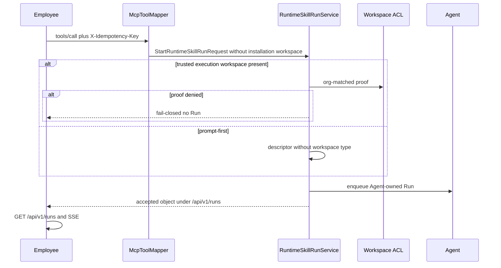

# RM-12 v1.2.1 员工公共面符合性实施计划

Canonical 落盘路径：[`.cursor/plans/rm-12_v121_public_conformance.plan.md`](rm-12_v121_public_conformance.plan.md)

`commit_policy: post_review`。执行顺序：`Execute -> Review -> Verification -> Commit Implementation`。Todo 完成不得 commit。下游只走 `smc-plan-delivery`。

批准事实只取 `grounded_commit` `630da4e9c7a0d48910467fc2b375c65e95610f95`。该提交相对 Architecture `3d5a056c` 的 Backend/Agent 代码 diff 为空。用户草稿 `docs_agent/prd-hotfix-skill-run-v1.2.1-postman-ready.md` 不是本 Plan 的实施源。

## 前端表现变化

本次改动无前端表现变化。不改 Portal / Admin / Work 页面、按钮、文案或路由。员工仍只通过既有 Catalog、`tools/call` 与 `/api/v1/runs/*` 使用 Skill Run；本项只修正 Backend 对冻结合同的可观察符合。

## Approved PRD

[Approved PRD](../../docs_agent/prd-v1.6.10-skill-run-v121-public-conformance.md)

## Scope

- In: 员工 MCP `tools/call` 将 Installation Workspace 与 Execution Workspace 解耦；Runtime 仅对受信任 Execution Workspace 做同组织证明；Installation 有值时的同组织未删除引用与活跃路由；员工幂等 Header `X-Idempotency-Key` 的 86400 TTL / 回放 / HTTP 409 `IDEMPOTENCY_CONFLICT`；Public `/api/v1/runs/*` 成功体去 Portal 信封；SSE 投影已发布语义类型并声明 `Cache-Control: no-store`；员工 accepted 对象去掉 Hermes/Installation 泄漏；consumer Postman 集合与 `CONSUMER-GUIDE.md` 作为本仓证据载体；`lat.md` 指针同步。
- Out: 改写 `contracts/skill-run/v1.2.1/` 或 tag `skill-run-contract-v1.2.1`；RM-09 / v1.2.2；新建 Idempotency Service、第二 Event Store、第二 Run 终态 Owner；删除 Workspace ACL 或办公室模型；把 Installation Workspace 升格为 Execution Workspace；新增 Public workspace 请求字段；Fingerprint/`McpTaskDedupService` 替代 C04；改全局 Portal 异常信封；Resume/Approve 升格为 v1.2.1 承诺；RM-04 双 Central / 故障注入；仓外 Work 前端构建与导入；Expert `/hermes/tasks/*` 下线。
- Production Owner inherited from PRD: MCP Gateway + Runtime Skill Run（C01/C07）；Runtime Skill Run（C02/C04）；Installation（C03）；Skill Run API（C05/C06）；Contract Package KEEP（C08）；Workspace ACL + Agent Event/终态 KEEP（C09）；Catalog `tools/list` KEEP（C10）。

Plan 级冻结（不改 PRD 语义）:

- 不新增 Public `workspace_id` 请求字段。Prompt-first 走 AC-01/AC-02/AC-09；显式 Execution Workspace 是 Runtime 内部/RM-06 回归，不进冻结合同。
- Runtime Skill Run 是 `execution.workspace_id` 的唯一写入者。MCP Gateway 只停止注入 Installation Workspace，并停止把 Installation/HermesTask 身份合并进员工 accepted 对象。
- 幂等仍用 `HermesTask.idempotency_key` + 既有 unique index `uq_hermes_tasks_idempotency_alive`。TTL 通过把过期行的键置空实现，禁止软删除任务。禁止新建 Idempotency Service。并发唯一冲突在 `start` 内把 `IntegrityError` 收敛为回放或 `ConflictError`。
- 员工面冲突响应是 HTTP 409 + JSON-RPC，`error.data.errorCode=IDEMPOTENCY_CONFLICT`。不用 Portal `{code:40900}`，不改全局 exception handler。REST `/api/v1/runs/*` 不是幂等入口。
- 员工 accepted `status` 使用合同枚举 `QUEUED`，不得改写为 `running`/`RUNNING`。`event_stream` 不得携带 Hermes task token 查询串。
- SSE payload 必须符合冻结 `run-event.schema.json`，不能只放行 `event_type`。未知内部事件丢弃。未持久不得虚构。
- C03 拒绝新的无效写入，并把历史无效 `installation.workspace_id` 从活跃路由匹配中视为未设置。不是全库清洗程序。不靠 FK 表达软删除。
- consumer Postman/Newman 与聚焦测试只作本仓符合性证据。禁止把 `tools/acceptance/run_newman.py` 双两连跑或故障注入当作本项退出条件。

## Grounding Evidence Ledger

| Change ID | Target | Baseline State | Symbol / Entry Resolution | Caller / Callee Evidence | Existing Reuse Search | Result |
|---|---|---|---|---|---|---|
| C01 | `nodeskclaw-backend/app/services/hermes_skill/mcp_tool_mapper.py#McpToolMapper#call_tool` | PARTIAL at `630da4e9` | 员工 `org_mcp` 两条 Runtime 入队把 `workspace_id=installation.workspace_id` 写入 `StartRuntimeSkillRunRequest`；`routing_metadata_extras` 另存同一值 | `call_tool` -> `RuntimeSkillRunService#start` -> `_build_authorized_execution_context` 只要请求带 `workspace_id` 就调 `_assert_workspace_proof` -> `check_workspace_access` | 切断请求字段拷贝即可停止进入 ACL；不删除 Installation 字段、不新增 Public workspace 参数；Fingerprint 短路径不得代替 Runtime 幂等 | PASS |
| C02 | `nodeskclaw-backend/app/services/hermes_skill/runtime_skill_run_service.py#RuntimeSkillRunService#_assert_workspace_proof` | PARTIAL at `630da4e9` | 证明只调 `check_workspace_access`；`org_id` 仅写入 `auth_version` 哈希，不与 `Workspace.org_id` 比较 | `_build_authorized_execution_context` 在 `request.workspace_id` 或附件路径调用证明；入队 `create_task(workspace_id=request.workspace_id)` | KEEP ACL 函数；在调用前增加同组织未删除谓词。跨组织不得因调用者在对方组织另有管理员身份而放行 | PASS |
| C03 | `nodeskclaw-backend/app/services/hermes_skill/skill_installer.py#SkillInstaller#install` | PARTIAL at `630da4e9` | `HermesSkillInstallation.workspace_id` 可空 `String(36)` 无 FK；`install`、`create_installation` 与 `_upsert_installation` 原样写入 | 路由 `_select_installation` 按 `installation.workspace_id` 字符串匹配，无效 ID 仍可成为活跃路由 | 在既有 Installation 写入点做同组织 `deleted_at is NULL` 校验；软删除不能靠 FK；历史无效值在 `_select_installation` 视为未设置 | PASS |
| C04 | `nodeskclaw-backend/app/services/hermes_skill/runtime_skill_run_service.py#RuntimeSkillRunService#start` | PARTIAL at `630da4e9` | `find_idempotent_task` 按 org/user/tool/key 回放；参数冲突已 `ConflictError`/`errors.run.idempotency_conflict`；无 86400 TTL；`create_task` 唯一冲突被 `except Exception` 映射为 `errors.hermes.cannot_enqueue`；MCP `mcp_jsonrpc` 对 JSON-RPC error 仍 HTTP 200；`IDEMPOTENCY_CONFLICT` 常量已有但未进 `_ERROR_CODES` | 员工 Header 经 `call_tool` 进入 `request.idempotency_key`；`uq_hermes_tasks_idempotency_alive` 已约束 scope | 过期则同一事务把键置空再插入；`IntegrityError` 再查回放或 409；网关 `JSONResponse(status_code=409)`。不新建服务、不删任务 | PASS |
| C05 | `nodeskclaw-backend/app/api/runs.py#_public_run_event` | PARTIAL at `630da4e9` | 只投影 `run.*`、`assistant.message`、`artifact.persisted`；丢弃 `reasoning.summary`、`tool.call`、`clarify.requested`、`approval.requested`；`stream_run_events` 已读 `Last-Event-ID`；`StreamingResponse` 无 `Cache-Control: no-store` | Agent Internal events -> `_public_run_event` -> SSE | 扩展既有投影函数并对齐冻结 `run-event.schema.json`；未知类型继续丢弃；不解析自然语言 | PASS |
| C06 | `nodeskclaw-backend/app/api/runs.py#get_run` | PARTIAL at `630da4e9` | `_public_run_view` 已接近合同对象，handlers 包 `{code:0,data:...}`；Resume/Approve 同文件但合同 unsupported | 员工 GET/Cancel/download 走 `app/api/runs.py`；失败仍走既有 `AppException` | 只解开合同列出的成功体；Resume/Approve 保持 Portal 信封；不改全局异常处理器 | PASS |
| C07 | `nodeskclaw-backend/app/services/hermes_skill/runtime_skill_run_service.py#RuntimeSkillRunService#build_structured_content` | PARTIAL at `630da4e9` | 员工分支 URL 已在 `/api/v1/runs/*`，但 queued 被改写为 `running`，且可能拼接 Hermes `token=`；随后 `_merge_org_mcp_async_payload` 并入 `agent_id`/`profile_id`/`workspace_id`/`installation_id`/`routing_reason`；无 Runtime 结果时 `_build_async_event_response` 泄漏 `task_no` 与 `/hermes/tasks/*` | `call_tool` ASYNC_EVENT -> merge(structured_content) 或 `_build_async_event_response`；replay `_finalize_async_event_response` 亦走后者 | 员工 accepted 停在冻结合同对象；Expert/legacy Hermes 响应保持。不新增 Public 字段 | PASS |

## Requirement Coverage Ledger

| Requirement | Source | Obligation | Classification | Change IDs | Todo | Verification IDs | Evidence Class | Blocking |
|---|---|---|---|---|---|---|---|---|
| AC-01 | AC | Installation 带有无效或不存在的 workspace_id 时，prompt-first 员工 tools/call 仍被接受并返回合同 accepted 对象；不出现 errors.workspace.not_found / 「办公室不存在」，不创建 Workspace 成员关系。 | BEHAVIOR | C01 | T1 | V01 | INTEGRATION | yes |
| AC-02 | AC | 无受信任 Execution Workspace 的 prompt-first Run，其冻结 Descriptor 不含 workspace 类型；Agent Snapshot 的 execution.workspace_id 为空。 | BEHAVIOR | C01, C02 | T1, T2 | V01, V02 | INTEGRATION | yes |
| AC-03 | AC | 显式受信任 Execution Workspace 与认证 org_id 不一致、已软删除或调用者无权限时，入队失败关闭，不创建 Agent-owned Run。 | SECURITY | C02 | T2 | V02 | INTEGRATION | yes |
| AC-04 | AC | 真实需要 Execution Workspace 的附件/办公室场景仍走既有 Workspace ACL；不绕过 RM-06 复核，不删除办公室模型。 | SECURITY | C01, C09 | T1, T2 | V02 | INTEGRATION | yes |
| AC-05 | AC | Installation 写入不属于本组织或已删除的 workspace_id 被拒绝；历史无效引用不得作为活跃路由继续使用。 | BEHAVIOR | C03 | T3 | V03 | INTEGRATION | yes |
| AC-06 | AC | 同一用户、同一工具、同一幂等键、等价请求在 86400 秒内回放同一 run_id 且 HTTP 200。 | LIFECYCLE | C04 | T4 | V04 | INTEGRATION | yes |
| AC-07 | AC | 同一键在 TTL 内与已接受请求冲突时，员工面 HTTP 409 且错误码 IDEMPOTENCY_CONFLICT；并发首写最多一个可见 Run。 | LIFECYCLE | C04 | T4 | V04 | INTEGRATION | yes |
| AC-08 | AC | TTL 结束后同一键可作为新请求接受，不要求软删除原 HermesTask。 | LIFECYCLE | C04 | T4 | V04 | INTEGRATION | yes |
| AC-09 | AC | 员工 accepted structuredContent 含 run_id、合同状态、event_stream / result_url / artifact_url 指向 /api/v1/runs/{run_id}/...；不含 HermesTask 号、Installation 路由身份或 /hermes/tasks/*。 | CONTRACT | C07 | T1 | V01 | INTEGRATION | yes |
| AC-10 | AC | GET /api/v1/runs/{run_id} 成功体顶层含 run_id / tool_name / status，符合 public-run.schema.json，不以 {code,data} 包裹。 | CONTRACT | C06 | T5 | V05 | INTEGRATION | yes |
| AC-11 | AC | Result / Artifact list / Cancel 成功体符合对应冻结 Schema；下载不泄漏内部存储凭证。 | CONTRACT | C06 | T5 | V05 | INTEGRATION | yes |
| AC-12 | AC | 当 Agent 已持久对应结构化事件时，SSE 投影 reasoning.summary、tool.call、clarify.requested、approval.requested 以及既有 run.* / assistant.message / artifact.persisted；未持久则不得虚构。 | CONTRACT | C05 | T5 | V05 | INTEGRATION | yes |
| AC-13 | AC | 未知内部事件被丢弃；Last-Event-ID 续播不重复已确认事件；流响应声明 Cache-Control: no-store。 | CONTRACT | C05 | T5 | V05 | INTEGRATION | yes |
| AC-14 | AC | 跨组织或非属主访问 Run 失败关闭；Public 面不泄漏其他租户的 HermesTask 或 Run 存在性细节。 | SECURITY | C02, C06, C09 | T2, T5 | V02, V05 | INTEGRATION | yes |
| AC-15 | AC | contracts/skill-run/v1.2.1/ 与 tag skill-run-contract-v1.2.1 的字节、checksum 与 tag 目标不变。 | CONTRACT | C08 | T5 | V06 | CONTRACT_RELEASE | yes |
| AC-16 | AC | 本仓针对冻结 v1.2.1 员工公共面的自动化符合性（含既有 consumer Postman/Newman 与聚焦测试）通过；证据不包含仓外 Work 源码、构建或导入。不宣称 RM-04 分布式拓扑验收完成。 | EVIDENCE | C01, C02, C03, C04, C05, C06, C07, C08, C09, C10 | T1, T2, T3, T4, T5 | V01, V02, V03, V04, V05, V06, V08 | POSTMAN_NEWMAN | yes |
| DOD-01 | DOD | C01–C10 均有可观察证据；prompt-first 不再因 Installation Workspace 失败；幂等 TTL/冲突、Public 信封与语义 SSE 均对照冻结 v1.2.1。 | EVIDENCE | C01, C02, C03, C04, C05, C06, C07, C08, C09, C10 | T1, T2, T3, T4, T5 | V01, V02, V03, V04, V05, V06, V08 | INTEGRATION | yes |
| DOD-02 | DOD | 未新增 Control Plane、Idempotency Service、第二 Event Store 或第二 Run 终态 Owner；Workspace ACL 与 Agent Event SoT 仍为原 Owner。 | SCOPE | C08, C09 | T2, T5 | V02, V07 | DIFF_SCOPE | yes |
| DOD-03 | DOD | v1.2.1 合同目录与 tag 未被改写；未发布第二份 Work canonical。 | CONTRACT | C08 | T5 | V06 | CONTRACT_RELEASE | yes |
| DOD-04 | DOD | Review 与 Verification PASS，真实 implementation commit 与验证证据写入 Roadmap 后，RM-12 才可标记 DONE。仓外 Work 联调不是本仓 DONE。 | RELEASE | C08 | T5 | V10 | DOCUMENT_SEMANTIC | yes |

## Lifecycle Closure Matrix

| Journey | Requirements | Trigger | Nonterminal State | Success Writer | Failure / Cancel Writer | Evidence IDs |
|---|---|---|---|---|---|---|
| Employee idempotent accept | AC-06, AC-08 | `tools/call` with `X-Idempotency-Key` inside 86400s equivalent body, or same key after TTL | HermesTask `QUEUED`/`RUNNING`/waiting; key occupied while unexpired | `RuntimeSkillRunService#start` INSERT or replay existing `run_id`; TTL expiry nulls `idempotency_key` on the live row in the same DB transaction then INSERT | `start` raises `ConflictError` before a second visible `run_id`; unique `IntegrityError` re-selects first row; task row is not soft-deleted to expire the key | V04 |
| Employee idempotent conflict | AC-07 | same org/user/tool/key inside TTL with non-equivalent arguments, or concurrent first writers | at most one accepted Run visible | first committed `create_task` under `uq_hermes_tasks_idempotency_alive` | loser maps to HTTP 409 JSON-RPC `IDEMPOTENCY_CONFLICT` via MCP `mcp_jsonrpc`; no second `run_id` | V04 |
| Trusted workspace deny | AC-03, AC-14 | `start` with explicit Execution Workspace that is cross-org, soft-deleted, or ACL-denied | no Agent outbox row | none; no `create_task` / outbox | `RuntimeSkillRunService#_assert_workspace_proof` fail-closed before enqueue | V02 |

## Contract / Data Flow Closure Matrix

| Flow | Requirements | Producer | Transport / Schema | Consumer | Required Fields | Validation Owner | Failure Mapping | Retry / Idempotency Identity | Evidence IDs |
|---|---|---|---|---|---|---|---|---|---|
| Prompt-first tools/call accept | AC-01, AC-02, AC-09 | `McpToolMapper#call_tool` builds `StartRuntimeSkillRunRequest` without Installation Workspace | in-process `RuntimeSkillRunService#start`; employee `structuredContent` plus MCP JSON-RPC result | Employee MCP client | `run_id`, contract `status`, `event_stream`, `result_url`, `artifact_url` under `/api/v1/runs/{run_id}` | Runtime Skill Run writes execution workspace; Gateway must not merge Installation/Hermes identity | invalid Installation Workspace must not surface `errors.workspace.not_found`; ACL is not called | `X-Idempotency-Key` plus org/user/tool owned by `start` | V01, V02 |
| Trusted execution workspace proof | AC-03, AC-04, AC-14 | `RuntimeSkillRunService#_assert_workspace_proof` after `Workspace.org_id == request.org_id` and not deleted | in-process `check_workspace_access` KEEP | Descriptor + `create_task.workspace_id` + Agent snapshot `execution.workspace_id` | `workspace_id`, `org_id`, `user_id` | Workspace ACL Owner unchanged | cross-org/soft-delete/no-permission: no Run; do not leak other-tenant existence | live proof per enqueue; no Installation fallback for attachments | V02 |
| Public Run wire | AC-10, AC-11, AC-14 | Agent Run projection via Internal GET | HTTP `/api/v1/runs/{run_id}` and result/artifacts/cancel/download; frozen public-run schemas | Employee HTTP client | top-level `run_id`/`tool_name`/`status`; no `{code,data}` on contracted success | `app/api/runs.py` handlers | cross-org/non-owner fail-closed without HermesTask identity | not an idempotency entry | V05 |
| Public SSE | AC-12, AC-13 | Agent persisted events | SSE `text/event-stream`; `Last-Event-ID`; `Cache-Control: no-store`; `run-event.schema.json` | Employee EventSource | `event_id`, `run_id`, `event_type`, `event_seq`, typed `payload` | `_public_run_event` drops unknown internals; never invents types from text | unknown event dropped; stream continues | resume identity is last confirmed `event_id`/`event_seq` | V05 |

## Verification Ledger

| Verification ID | Level | Entry Point / Command | Oracle | Negative / Regression | Evidence Policy | Environment | Blocking |
|---|---|---|---|---|---|---|---|
| V01 | INTEGRATION | `uv --directory nodeskclaw-backend run pytest tests/hermes_skill/test_mcp_tool_mapper_runtime_skill.py -q --tb=short` | prompt-first `call_tool` with invalid Installation `workspace_id` is accepted; request to `start` has empty execution `workspace_id`; accepted object uses `QUEUED` and `/api/v1/runs/{id}/` events, result, artifacts without Installation identity, `task_no`, Hermes token query, or `/hermes/tasks/*`; Fingerprint short-circuit is not used as employee idempotency | existing runtime-route and connector mapper tests still pass; Catalog `list_tools` unchanged | LOCAL_TRANSIENT | local backend pytest | yes |
| V02 | INTEGRATION | `uv --directory nodeskclaw-backend run pytest tests/hermes_skill/test_runtime_skill_run_context.py tests/hermes_skill/test_runtime_skill_run_service.py -q --tb=short` | no trusted workspace => descriptor has no workspace type and enqueue `workspace_id` is empty; explicit cross-org/soft-deleted/unauthorized workspace fail-closed with zero Agent outbox; attachment/office path still calls `check_workspace_access` | RM-06 client_context injection and knowledge expansion tests still fail closed | LOCAL_TRANSIENT | local backend pytest | yes |
| V03 | INTEGRATION | `uv --directory nodeskclaw-backend run pytest tests/hermes_skill/test_skill_installer_profile_path.py tests/hermes_skill/test_runtime_skill_registration.py tests/hermes_skill/test_skill_routing_service.py -k "not worker" -q --tb=short` | install/register reject other-org or deleted `workspace_id`; `_select_installation` ignores historical invalid installation workspace as live routing | profile-root installer tests and default/explicit routing / non-worker registration tests still pass; pre-existing Hermes worker tests in the same file are out of RM-12 write ownership and deselected | LOCAL_TRANSIENT | local backend pytest | yes |
| V04 | INTEGRATION | `uv --directory nodeskclaw-backend run pytest tests/hermes_skill/test_runtime_skill_run_agent_enqueue.py tests/hermes_skill/test_mcp_tools_call.py tests/mcp_skill_gateway/test_mcp_errors.py -q --tb=short` | same key+args inside 86400s replay same `run_id`; conflict returns JSON-RPC `IDEMPOTENCY_CONFLICT` with HTTP 409 from MCP POST; concurrent unique insert converges to one Run; after TTL the same key accepts a new Run without soft-deleting the old task; `_ERROR_CODES` contains `IDEMPOTENCY_CONFLICT` | Expert `task_id` contract and existing enqueue tests still pass; no Portal `{code:40900}` | LOCAL_TRANSIENT | local backend pytest | yes |
| V05 | INTEGRATION | `uv --directory nodeskclaw-backend run pytest tests/hermes_skill/test_employee_runs_api.py -q --tb=short` | contracted GET Run/Result/Artifacts/Cancel success bodies are frozen objects not `{code,data}`; SSE projects persisted semantic types with schema payloads, drops unknown types, honors `Last-Event-ID`, sets `Cache-Control: no-store`; download has no storage credential; cross-org access fail-closed; Resume/Approve wrapping unchanged | undelivered outbox dispatch-pending behavior remains | LOCAL_TRANSIENT | local backend pytest | yes |
| V06 | CONTRACT | `git diff --stat 630da4e9c7a0d48910467fc2b375c65e95610f95 -- nodeskclaw-backend/contracts/skill-run/v1.2.1` | empty diff; tag `skill-run-contract-v1.2.1` not moved by this work | no new contract version directory | LOCAL_TRANSIENT | local git | yes |
| V07 | DOCUMENT | `lat.cmd check` | RM-12 Plan/PRD pointers remain; Workspace ACL and Agent Event Owner wording unchanged | wording that Runtime became Event SoT or added Idempotency Service fails | LOCAL_TRANSIENT | local lat | yes |
| V08 | CONTRACT | `python -c "import json,pathlib; p=pathlib.Path('tools/postman/nodeskclaw-skill-run-consumer-v1.2.1.postman_collection.json'); json.loads(p.read_text(encoding='utf-8')); t=p.read_text(encoding='utf-8'); assert '/api/v1/mcp' in t and '/api/v1/runs' in t and 'IDEMPOTENCY_CONFLICT' in t"` | consumer collection remains parseable and still targets employee MCP and `/api/v1/runs/*`; no Agent `4580` or Internal Edge paths added | do not invoke `tools/acceptance/run_newman.py` two-run topology | LOCAL_TRANSIENT | local python | yes |
| V10 | DOCUMENT | `rg "RM-12" docs_agent/roadmaps/ROADMAP-SKILL-AGENT-V16.md` | RM-12 is not `DONE` until Review+Verification PASS, implementation commit, and evidence are filled | marking DONE from Plan Todo completion fails | LOCAL_TRANSIENT | local rg | yes |

## Immediate Read

- `docs_agent/prd-v1.6.10-skill-run-v121-public-conformance.md`
- `nodeskclaw-backend/app/services/hermes_skill/mcp_tool_mapper.py#McpToolMapper#call_tool`
- `nodeskclaw-backend/app/services/hermes_skill/mcp_tool_mapper.py#McpToolMapper#_merge_org_mcp_async_payload`
- `nodeskclaw-backend/app/services/hermes_skill/mcp_tool_mapper.py#McpToolMapper#_build_async_event_response`
- `nodeskclaw-backend/app/services/hermes_skill/runtime_skill_run_service.py#RuntimeSkillRunService#start`
- `nodeskclaw-backend/app/services/hermes_skill/runtime_skill_run_service.py#RuntimeSkillRunService#_assert_workspace_proof`
- `nodeskclaw-backend/app/services/hermes_skill/runtime_skill_run_service.py#RuntimeSkillRunService#_build_authorized_execution_context`
- `nodeskclaw-backend/app/services/hermes_skill/runtime_skill_run_service.py#RuntimeSkillRunService#build_structured_content`
- `nodeskclaw-backend/app/services/hermes_skill/task_service.py#TaskService#find_idempotent_task`
- `nodeskclaw-backend/app/services/hermes_skill/skill_installer.py#SkillInstaller#install`
- `nodeskclaw-backend/app/services/hermes_skill/skill_routing_service.py#SkillRoutingService#_select_installation`
- `nodeskclaw-backend/app/api/runs.py#get_run`
- `nodeskclaw-backend/app/api/runs.py#_public_run_event`
- `nodeskclaw-backend/app/api/runs.py#stream_run_events`
- `nodeskclaw-backend/app/api/mcp_skill_gateway/router.py#mcp_jsonrpc`
- `nodeskclaw-backend/app/services/mcp_skill_gateway/errors.py#_ERROR_CODES`
- `nodeskclaw-backend/tests/hermes_skill/test_mcp_tool_mapper_runtime_skill.py`
- `nodeskclaw-backend/tests/hermes_skill/test_runtime_skill_run_context.py`
- `nodeskclaw-backend/tests/hermes_skill/test_runtime_skill_run_agent_enqueue.py`
- `nodeskclaw-backend/tests/hermes_skill/test_employee_runs_api.py`
- `tools/postman/nodeskclaw-skill-run-consumer-v1.2.1.postman_collection.json`
- `tools/postman/CONSUMER-GUIDE.md`

## Triggered Read

- If PostgreSQL unique index still blocks insert after nulling `idempotency_key` in the same transaction: read `HermesTask` mapper flush semantics and issue `flush` after null; do not add a reservation table unless that flush still conflicts, and then only a Runtime-owned minimal row, never a new service.
- If `IntegrityError` is not the unique-violation type on this driver: inspect `sqlalchemy.exc` and the PG SQLSTATE inside `start` only.
- If employee replay still returns Hermes URLs: read `_finalize_async_event_response` and route org_mcp replay through `build_structured_content` instead of `_build_async_event_response`.
- If SSE fixture payloads disagree with a guessed mapping: read `nodeskclaw-backend/contracts/skill-run/v1.2.1` event schemas as KEEP input only.
- If MCP POST already returns a `Response` subclass: wrap once, do not double-encode.
- Otherwise: do not read

## Change Matrix

| Change ID | File / Symbol | Kind | Action | Existing Owner | Todo Owner | Target State | PRD Capability | New File? |
|---|---|---|---|---|---|---|---|---|
| C01 | `nodeskclaw-backend/app/services/hermes_skill/mcp_tool_mapper.py#McpToolMapper#call_tool` | PROD | MODIFY | Backend MCP Gateway | T1 | do not copy Installation Workspace into execution request; do not Fingerprint-short-circuit employee Runtime start | Installation vs Execution Workspace | no |
| C01 | `nodeskclaw-backend/tests/hermes_skill/test_mcp_tool_mapper_runtime_skill.py` | TEST | MODIFY | Backend tests | T1 | invalid Installation workspace still accepted; start sees empty execution workspace | Installation vs Execution Workspace | no |
| C02 | `nodeskclaw-backend/app/services/hermes_skill/runtime_skill_run_service.py#RuntimeSkillRunService#_assert_workspace_proof` | PROD | MODIFY | Backend Runtime Skill Run | T2 | require same-org non-deleted Workspace before ACL; cross-org fail-closed | Execution Workspace tenant proof | no |
| C02 | `nodeskclaw-backend/app/services/hermes_skill/runtime_skill_run_service.py#RuntimeSkillRunService#_build_authorized_execution_context` | PROD | MODIFY | Backend Runtime Skill Run | T2 | prove only trusted execution workspace; prompt-first descriptor has no workspace type | Execution Workspace tenant proof | no |
| C02 | `nodeskclaw-backend/tests/hermes_skill/test_runtime_skill_run_context.py` | TEST | MODIFY | Backend tests | T2 | empty vs explicit vs cross-org vs deleted vs ACL deny | Execution Workspace tenant proof | no |
| C03 | `nodeskclaw-backend/app/services/hermes_skill/skill_installer.py#SkillInstaller#install` | PROD | MODIFY | Backend Installation | T3 | reject other-org or deleted workspace_id when set | Installation referential integrity | no |
| C03 | `nodeskclaw-backend/app/api/hermes_skill/installations_router.py#create_installation` | PROD | MODIFY | Backend Installation API | T3 | edge and remote create paths validate before persist | Installation referential integrity | no |
| C03 | `nodeskclaw-backend/app/services/hermes_skill/runtime_skill_registration_service.py#RuntimeSkillRegistrationService#_upsert_installation` | PROD | MODIFY | Backend Installation | T3 | create/update validate workspace_id | Installation referential integrity | no |
| C03 | `nodeskclaw-backend/app/services/hermes_skill/skill_routing_service.py#SkillRoutingService#_select_installation` | PROD | MODIFY | Backend Installation routing | T3 | invalid stored workspace_id is not live routing | Installation referential integrity | no |
| C03 | `nodeskclaw-backend/tests/hermes_skill/test_skill_installer_profile_path.py` | TEST | MODIFY | Backend tests | T3 | invalid workspace_id rejected | Installation referential integrity | no |
| C03 | `nodeskclaw-backend/tests/hermes_skill/test_runtime_skill_registration.py` | TEST | MODIFY | Backend tests | T3 | register/update reject invalid workspace | Installation referential integrity | no |
| C03 | `nodeskclaw-backend/tests/hermes_skill/test_skill_routing_service.py` | TEST | MODIFY | Backend tests | T3 | stale installation workspace ignored | Installation referential integrity | no |
| C04 | `nodeskclaw-backend/app/services/hermes_skill/runtime_skill_run_service.py#RuntimeSkillRunService#start` | PROD | MODIFY | Backend Runtime Skill Run | T4 | TTL, IntegrityError replay/conflict, no cannot_enqueue unique-hide | Employee idempotency | no |
| C04 | `nodeskclaw-backend/app/services/hermes_skill/task_service.py#TaskService#find_idempotent_task` | PROD | MODIFY | Backend Runtime Skill Run | T4 | treat expired key as absent and null it without deleting the task | Employee idempotency | no |
| C04 | `nodeskclaw-backend/app/services/mcp_skill_gateway/errors.py#_ERROR_CODES` | PROD | MODIFY | Backend MCP Gateway | T4 | map IDEMPOTENCY_CONFLICT to a dedicated jsonrpc numeric code | Employee idempotency | no |
| C04 | `nodeskclaw-backend/app/api/mcp_skill_gateway/router.py#mcp_jsonrpc` | PROD | MODIFY | Backend MCP HTTP | T4 | JSON-RPC IDEMPOTENCY_CONFLICT returns HTTP 409 | Employee idempotency | no |
| C04 | `nodeskclaw-backend/app/api/mcp_skill_gateway/router.py#hermes_mcp_jsonrpc` | PROD | MODIFY | Backend MCP HTTP | T4 | same 409 wrapping | Employee idempotency | no |
| C04 | `nodeskclaw-backend/app/api/hermes_skill/mcp_router.py#mcp_jsonrpc` | PROD | MODIFY | Backend MCP HTTP | T4 | session MCP POST also 409 on conflict | Employee idempotency | no |
| C04 | `nodeskclaw-backend/tests/hermes_skill/test_runtime_skill_run_agent_enqueue.py` | TEST | MODIFY | Backend tests | T4 | TTL replay/conflict/concurrency | Employee idempotency | no |
| C04 | `nodeskclaw-backend/tests/hermes_skill/test_mcp_tools_call.py` | TEST | MODIFY | Backend tests | T4 | HTTP 409 JSON-RPC envelope | Employee idempotency | no |
| C04 | `nodeskclaw-backend/tests/mcp_skill_gateway/test_mcp_errors.py` | TEST | MODIFY | Backend tests | T4 | IDEMPOTENCY_CONFLICT in _ERROR_CODES | Employee idempotency | no |
| C05 | `nodeskclaw-backend/app/api/runs.py#_public_run_event` | PROD | MODIFY | Backend Skill Run API | T5 | project frozen semantic types with schema payloads; drop unknown | Public SSE | no |
| C05 | `nodeskclaw-backend/app/api/runs.py#stream_run_events` | PROD | MODIFY | Backend Skill Run API | T5 | Cache-Control no-store; keep Last-Event-ID | Public SSE | no |
| C05 | `tools/postman/CONSUMER-GUIDE.md` | DOC | MODIFY | Acceptance assets | T5 | remove stale SSE gap that listed those types as missing | Public SSE | no |
| C06 | `nodeskclaw-backend/app/api/runs.py#get_run` | PROD | MODIFY | Backend Skill Run API | T5 | return frozen public-run object | Public Run envelope | no |
| C06 | `nodeskclaw-backend/app/api/runs.py#get_run_result` | PROD | MODIFY | Backend Skill Run API | T5 | return frozen result object | Public Run envelope | no |
| C06 | `nodeskclaw-backend/app/api/runs.py#get_run_artifacts` | PROD | MODIFY | Backend Skill Run API | T5 | return frozen artifact list | Public Run envelope | no |
| C06 | `nodeskclaw-backend/app/api/runs.py#cancel_run` | PROD | MODIFY | Backend Skill Run API | T5 | return frozen cancel/run object | Public Run envelope | no |
| C06 | `nodeskclaw-backend/app/api/runs.py#download_run_artifact` | PROD | MODIFY | Backend Skill Run API | T5 | no storage credential leak | Public Run envelope | no |
| C06 | `nodeskclaw-backend/tests/hermes_skill/test_employee_runs_api.py` | TEST | MODIFY | Backend tests | T5 | unwrap assertions; SSE headers and semantic types; cross-org | Public Run envelope | no |
| C07 | `nodeskclaw-backend/app/services/hermes_skill/runtime_skill_run_service.py#RuntimeSkillRunService#build_structured_content` | PROD | MODIFY | Backend Runtime Skill Run | T1 | QUEUED; /api/v1/runs URLs; no Hermes token query | Employee accepted object | no |
| C07 | `nodeskclaw-backend/app/services/hermes_skill/mcp_tool_mapper.py#McpToolMapper#_merge_org_mcp_async_payload` | PROD | MODIFY | Backend MCP Gateway | T1 | do not merge Installation/Hermes identity into employee accepted | Employee accepted object | no |
| C07 | `nodeskclaw-backend/app/services/hermes_skill/mcp_tool_mapper.py#McpToolMapper#_build_async_event_response` | PROD | MODIFY | Backend MCP Gateway | T1 | employee fallback uses the same accepted object, not /hermes/tasks | Employee accepted object | no |
| C07 | `nodeskclaw-backend/tests/hermes_skill/test_runtime_skill_run_service.py` | TEST | MODIFY | Backend tests | T1 | employee event_stream has no Hermes token query | Employee accepted object | no |
| C07 | `tools/postman/nodeskclaw-skill-run-consumer-v1.2.1.postman_collection.json` | TEST | MODIFY | Acceptance assets | T1 | align accepted/status/SSE assertions with frozen employee object | Employee accepted object | no |
| C05 | `lat.md/decisions/skill-platform-execution.md` | DOC | MODIFY | lat.md | T5 | RM-12 Plan pointer | Public SSE | no |
| C05 | `.agents/skills/smc-plan-validator/scripts/validate_plan_v33.py` | DOC | MODIFY | SMC tooling | T5 | register importlib module before exec for Python 3.12 dataclass Static Gate | Public SSE | no |
| C08 | `nodeskclaw-backend/contracts/skill-run/v1.2.1` | DOC | KEEP | Public Skill Run package | - | zero byte changes | Published v1.2.1 contract | no |
| C09 | `nodeskclaw-backend/app/services/workspace_member_service.py#check_workspace_access` | PROD | KEEP | Backend Workspace ACL | - | ACL Owner unchanged | Existing ACL and Agent Event SoT | no |
| C09 | `nodeskclaw-agent/app/services/run_service.py#append_event` | PROD | KEEP | Agent Event SoT | - | Backend does not become Run terminal writer | Existing ACL and Agent Event SoT | no |
| C10 | `nodeskclaw-backend/app/services/hermes_skill/mcp_tool_mapper.py#McpToolMapper#list_tools` | PROD | KEEP | Backend MCP Gateway | - | Catalog projection unchanged | Employee Catalog | no |

## Implementation Decisions

| Change ID | Strategy | Root-Cause / Reuse Evidence | Why This Is Minimum |
|---|---|---|---|
| C01 | MODIFY_EXISTING | `call_tool` is the only employee org_mcp writer of `StartRuntimeSkillRunRequest.workspace_id=installation.workspace_id`; `_build_authorized_execution_context` already keys off that field | Stop the copy at the mapper; keep Installation value in routing extras only. No new request field, no ACL deletion |
| C02 | MODIFY_EXISTING | `_assert_workspace_proof` already calls KEEP `check_workspace_access`; missing org compare is the fail-open | Add org/soft-delete predicate in the existing proof function; do not fork Workspace ACL |
| C03 | MODIFY_EXISTING | Only three production writers persist `HermesSkillInstallation.workspace_id`; `_select_installation` is the live matcher | Validate on write and ignore invalid stored ids in routing. Soft-delete cannot be expressed by FK, so skip schema/FK/Alembic |
| C04 | MODIFY_EXISTING | Unique index already encodes org/user/tool/key; `find_idempotent_task` already replays; conflict key already maps to `IDEMPOTENCY_CONFLICT` | Expire by nulling the key; catch unique `IntegrityError` in `start`; wrap MCP HTTP 409. No new service or table unless the triggered unique-after-null path fires |
| C05 | MODIFY_EXISTING | `_public_run_event` is already the SSE filter; `Last-Event-ID` already parsed | Extend the allow-list and payload shape; add `Cache-Control` on the existing `StreamingResponse` |
| C06 | MODIFY_EXISTING | Inner `_public_run_*` helpers already match frozen objects; wrappers add `{code,data}` | Return those objects from contracted success handlers only; leave Resume/Approve and the global exception handler |
| C07 | MODIFY_EXISTING | Employee `build_structured_content` already points at `/api/v1/runs/*`; merge/fallback reintroduce Hermes/Installation identity and rewrite queued to running | Fix the employee projection and stop the merge. Expert Hermes payload stays on the non-employee branch |

## Write Ownership Ledger

| Todo | Owns Changes | Writes | Reads | Depends On | Parallel Safe |
|---|---|---|---|---|---|
| T1 | C01, C07 | `nodeskclaw-backend/app/services/hermes_skill/mcp_tool_mapper.py#McpToolMapper#call_tool` `nodeskclaw-backend/tests/hermes_skill/test_mcp_tool_mapper_runtime_skill.py` `nodeskclaw-backend/app/services/hermes_skill/runtime_skill_run_service.py#RuntimeSkillRunService#build_structured_content` `nodeskclaw-backend/app/services/hermes_skill/mcp_tool_mapper.py#McpToolMapper#_merge_org_mcp_async_payload` `nodeskclaw-backend/app/services/hermes_skill/mcp_tool_mapper.py#McpToolMapper#_build_async_event_response` `nodeskclaw-backend/tests/hermes_skill/test_runtime_skill_run_service.py` `tools/postman/nodeskclaw-skill-run-consumer-v1.2.1.postman_collection.json` | `nodeskclaw-backend/app/services/hermes_skill/runtime_skill_run_service.py#RuntimeSkillRunService#start` `nodeskclaw-backend/app/services/workspace_member_service.py#check_workspace_access` `nodeskclaw-backend/app/schemas/hermes_skill/runtime_skill_run.py#StartRuntimeSkillRunRequest` | - | no |
| T2 | C02 | `nodeskclaw-backend/app/services/hermes_skill/runtime_skill_run_service.py#RuntimeSkillRunService#_assert_workspace_proof` `nodeskclaw-backend/app/services/hermes_skill/runtime_skill_run_service.py#RuntimeSkillRunService#_build_authorized_execution_context` `nodeskclaw-backend/tests/hermes_skill/test_runtime_skill_run_context.py` | `nodeskclaw-backend/app/services/workspace_member_service.py#check_workspace_access` `nodeskclaw-backend/app/models/workspace.py#Workspace` `nodeskclaw-backend/app/services/hermes_skill/mcp_tool_mapper.py#McpToolMapper#call_tool` | T1 | no |
| T3 | C03 | `nodeskclaw-backend/app/services/hermes_skill/skill_installer.py#SkillInstaller#install` `nodeskclaw-backend/app/api/hermes_skill/installations_router.py#create_installation` `nodeskclaw-backend/app/services/hermes_skill/runtime_skill_registration_service.py#RuntimeSkillRegistrationService#_upsert_installation` `nodeskclaw-backend/app/services/hermes_skill/skill_routing_service.py#SkillRoutingService#_select_installation` `nodeskclaw-backend/tests/hermes_skill/test_skill_installer_profile_path.py` `nodeskclaw-backend/tests/hermes_skill/test_runtime_skill_registration.py` `nodeskclaw-backend/tests/hermes_skill/test_skill_routing_service.py` | `nodeskclaw-backend/app/models/workspace.py#Workspace` `nodeskclaw-backend/app/models/hermes_skill/skill_installation.py#HermesSkillInstallation` | - | yes |
| T4 | C04 | `nodeskclaw-backend/app/services/hermes_skill/runtime_skill_run_service.py#RuntimeSkillRunService#start` `nodeskclaw-backend/app/services/hermes_skill/task_service.py#TaskService#find_idempotent_task` `nodeskclaw-backend/app/services/mcp_skill_gateway/errors.py#_ERROR_CODES` `nodeskclaw-backend/app/api/mcp_skill_gateway/router.py#mcp_jsonrpc` `nodeskclaw-backend/app/api/mcp_skill_gateway/router.py#hermes_mcp_jsonrpc` `nodeskclaw-backend/app/api/hermes_skill/mcp_router.py#mcp_jsonrpc` `nodeskclaw-backend/tests/hermes_skill/test_runtime_skill_run_agent_enqueue.py` `nodeskclaw-backend/tests/hermes_skill/test_mcp_tools_call.py` `nodeskclaw-backend/tests/mcp_skill_gateway/test_mcp_errors.py` | `nodeskclaw-backend/app/services/hermes_skill/runtime_skill_run_service.py#RuntimeSkillRunService#_build_authorized_execution_context` `nodeskclaw-backend/app/services/hermes_skill/runtime_skill_run_service.py#RuntimeSkillRunService#build_structured_content` `nodeskclaw-backend/app/models/hermes_skill/hermes_task.py#HermesTask` `nodeskclaw-backend/app/services/hermes_skill/mcp_tool_mapper.py#McpToolMapper#call_tool` | T1, T2 | no |
| T5 | C05, C06 | `nodeskclaw-backend/app/api/runs.py#_public_run_event` `nodeskclaw-backend/app/api/runs.py#stream_run_events` `tools/postman/CONSUMER-GUIDE.md` `nodeskclaw-backend/app/api/runs.py#get_run` `nodeskclaw-backend/app/api/runs.py#get_run_result` `nodeskclaw-backend/app/api/runs.py#get_run_artifacts` `nodeskclaw-backend/app/api/runs.py#cancel_run` `nodeskclaw-backend/app/api/runs.py#download_run_artifact` `nodeskclaw-backend/tests/hermes_skill/test_employee_runs_api.py` `lat.md/decisions/skill-platform-execution.md` `.agents/skills/smc-plan-validator/scripts/validate_plan_v33.py` | `nodeskclaw-backend/contracts/skill-run/v1.2.1` `nodeskclaw-agent/app/services/run_service.py#append_event` | - | yes |

## Integration Hotspots

| File | Owner Todo | Reason |
|---|---|---|
| `nodeskclaw-backend/app/services/hermes_skill/mcp_tool_mapper.py` | T1 | employee tools/call request construction, Fingerprint skip, accepted merge/fallback single writer |
| `nodeskclaw-backend/app/api/runs.py` | T5 | Public Run envelope and SSE projection single writer |
| `nodeskclaw-backend/app/api/mcp_skill_gateway/router.py` | T4 | employee MCP HTTP status for JSON-RPC conflict single writer |

## Generated Outputs Ledger

None

## Todo T1 — 员工 MCP 解耦与 Accepted 对象

**Owns Changes**
- C01
- C07

**Goal**

Prompt-first `tools/call` 不再把 Installation Workspace 写入 Execution 请求，也不因该字段进入 Workspace ACL；员工 accepted 对象符合冻结 v1.2.1，状态为 `QUEUED`，URL 位于 `/api/v1/runs/*`，不含 Installation/Hermes 身份。

**Immediate anchors**
- `nodeskclaw-backend/app/services/hermes_skill/mcp_tool_mapper.py#McpToolMapper#call_tool`
- `nodeskclaw-backend/app/services/hermes_skill/runtime_skill_run_service.py#RuntimeSkillRunService#build_structured_content`

**Changes**
- Runtime 与 `SKILL_AGENT_ENABLED` 两条 `StartRuntimeSkillRunRequest` 不再设置 `workspace_id=installation.workspace_id`；Installation workspace 只留在 routing extras
- 员工 Runtime 路径不要用 `McpTaskDedupService` Fingerprint 短路径代替 `RuntimeSkillRunService#start`
- `build_structured_content` 员工分支：`queued`/`accepted` -> `QUEUED`；不要把 Hermes token 查询串拼到 `event_stream`
- `_merge_org_mcp_async_payload` 不再写入 `agent_id`/`profile_id`/`workspace_id`/`installation_id`/`routing_reason`/`task_no`
- 员工 fallback `_build_async_event_response` 改为同一 accepted 对象；Expert/legacy Hermes 形状保持
- 扩展 mapper 测试与 consumer collection 断言

**Stop conditions**
- [ ] 无效 Installation workspace 的 prompt-first `tools/call` 被接受且不出现 `errors.workspace.not_found`
- [ ] accepted 对象无 Hermes/Installation 泄漏且 status 为 `QUEUED`
- [ ] V01 通过

**Triggered reads**
- If replay still uses Hermes URLs: `_finalize_async_event_response`
- Otherwise: do not read

## Todo T2 — Execution Workspace 租户证明

**Owns Changes**
- C02

**Goal**

仅受信任 Execution Workspace 才进入 Workspace ACL；该 Workspace 必须属于认证 `org_id` 且未软删除；跨组织、删除、无权限 fail-closed 且不创建 Agent Run。

**Immediate anchors**
- `nodeskclaw-backend/app/services/hermes_skill/runtime_skill_run_service.py#RuntimeSkillRunService#_assert_workspace_proof`
- `nodeskclaw-backend/app/services/hermes_skill/runtime_skill_run_service.py#RuntimeSkillRunService#_build_authorized_execution_context`

**Changes**
- `_assert_workspace_proof` 先校验 `Workspace` 未删除且 `org_id` 等于 `request.org_id`，再调用 KEEP `check_workspace_access`
- 无 `request.workspace_id` 时不调用 ACL、descriptor 不含 workspace 类型、入队 `workspace_id` 为空
- 附件路径仍要求已证明的 Execution Workspace，不得回退 Installation Workspace
- 扩展 `test_runtime_skill_run_context.py`

**Stop conditions**
- [ ] prompt-first 无 workspace descriptor
- [ ] 跨组织/软删除/无权限不入队
- [ ] V02 通过

**Triggered reads**
- If attachment refs arrive without execution workspace: keep deny in `_build_authorized_execution_context`, do not invent a Public workspace field
- Otherwise: do not read

## Todo T3 — Installation Workspace 引用完整性

**Owns Changes**
- C03

**Goal**

有值的 `installation.workspace_id` 必须指向同组织未删除 Workspace；历史无效值不得作为活跃路由。字段仍只是路由元数据。

**Immediate anchors**
- `nodeskclaw-backend/app/services/hermes_skill/skill_installer.py#SkillInstaller#install`
- `nodeskclaw-backend/app/services/hermes_skill/skill_routing_service.py#SkillRoutingService#_select_installation`

**Changes**
- 在 `install`、`create_installation`、`_upsert_installation` 写入前校验同组织未删除；空值仍允许
- `_select_installation` 将无效 stored workspace 视为未设置，不把它当 live routing key
- 不新增 FK/Alembic；不是全库清洗
- 扩展 installer/registration/routing 测试

**Stop conditions**
- [ ] 跨组织或已删除 workspace_id 写入被拒绝
- [ ] 历史无效 id 不再单独匹配出活跃 Installation
- [ ] V03 通过

**Triggered reads**
- If another production writer of `HermesSkillInstallation.workspace_id` appears under Backend Installation: include it in this Todo only
- Otherwise: do not read

## Todo T4 — 员工幂等 TTL 与 409

**Owns Changes**
- C04

**Goal**

同一 org/user/tool/key 在 86400 秒内等价回放同一 `run_id`；冲突为 HTTP 409 + `IDEMPOTENCY_CONFLICT`；TTL 后可复用键且不删除原任务；并发最多一个可见 Run。

**Immediate anchors**
- `nodeskclaw-backend/app/services/hermes_skill/runtime_skill_run_service.py#RuntimeSkillRunService#start`
- `nodeskclaw-backend/app/services/hermes_skill/task_service.py#TaskService#find_idempotent_task`

**Changes**
- `find_idempotent_task`：超过 86400 秒则把该行 `idempotency_key` 置空并返回空，不 soft-delete
- `start`：将 `create_task` 的 unique `IntegrityError` 再查为回放或 `ConflictError`，不要映射 `errors.hermes.cannot_enqueue`
- `_ERROR_CODES` 加入 `IDEMPOTENCY_CONFLICT`
- `mcp_jsonrpc` / `hermes_mcp_jsonrpc` / session `mcp_jsonrpc` 对应该 errorCode 返回 `JSONResponse` 409，body 仍是 JSON-RPC
- 扩展 enqueue、mcp_tools_call、mcp_errors 测试

**Stop conditions**
- [ ] TTL 内回放 HTTP 200 同一 `run_id`
- [ ] 冲突 HTTP 409 且 `error.data.errorCode=IDEMPOTENCY_CONFLICT`，不是 Portal 40900
- [ ] TTL 后新 Run 不删除旧 HermesTask
- [ ] V04 通过

**Triggered reads**
- If unique index still blocks after null-and-flush: only then add Runtime-owned minimal reservation storage, never a new Idempotency Service
- Otherwise: do not read

## Todo T5 — Public Run 信封与语义 SSE

**Owns Changes**
- C05
- C06

**Goal**

合同列出的 `/api/v1/runs/*` 成功体是冻结合同对象；SSE 投影已发布语义类型并对齐 schema payload；未知事件丢弃；`Cache-Control: no-store`；合同目录零改动。

**Immediate anchors**
- `nodeskclaw-backend/app/api/runs.py#get_run`
- `nodeskclaw-backend/app/api/runs.py#_public_run_event`

**Changes**
- `get_run` / `get_run_result` / `get_run_artifacts` / `cancel_run` 成功返回冻结对象，不包 `{code,data}`
- Resume/Approve 保持现有信封
- `_public_run_event` 增加 `reasoning.summary`、`tool.call`、`clarify.requested`、`approval.requested`，payload 对齐冻结 schema；未知类型仍丢弃
- `stream_run_events` 设置 `Cache-Control: no-store`；保持 `Last-Event-ID`
- 下载路径不回内部存储凭证
- 更新 `CONSUMER-GUIDE.md` 中过时的 SSE 缺口描述
- 扩展 `test_employee_runs_api.py`；不改合同字节

**Stop conditions**
- [ ] GET Run 顶层含 `run_id`/`tool_name`/`status` 且无 `{code,data}`
- [ ] 已持久语义事件可投影，未知事件丢弃，SSE 带 `no-store`
- [ ] V05、V06、V07、V08、V10 通过

**Triggered reads**
- If fixture payload fields differ: read v1.2.1 event schemas as KEEP input
- Otherwise: do not read

## Verification

Run the Verification Ledger entries through `smc-plan-delivery/scripts/evidence.py`.

## Completion Gate

| Exit State | Allowed When | Blocking Evidence |
|---|---|---|
| IMPLEMENTED_AND_PROVEN | all Cursor todos completed; completion audit FRESH PASS; implementation review FRESH PASS; all blocking Verification FRESH PASS; durable Evidence Manifest FRESH | V01 V02 V03 V04 V05 V06 V07 V08 V10 via SMC evidence ledger + durable Evidence Manifest |
| IMPLEMENTED_NOT_PROVEN | implementation exists but proof is pending/stale | pending/stale gate IDs |
| BLOCKED | environment/dependency prevents proof | blocker record |
| RETURN_PRD | approved owner/boundary conflicts | PRD revision request |
