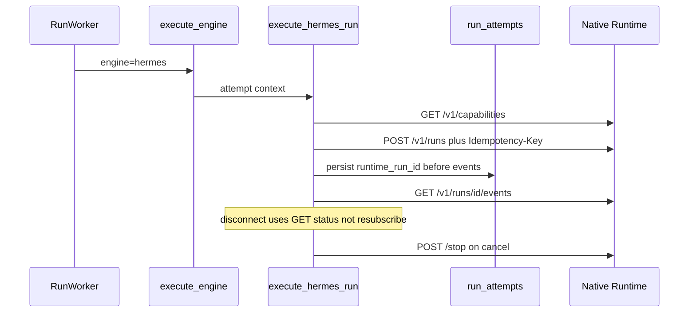

# RM-13 Hermes Native Runtime Bridge 实施计划

Canonical 落盘路径：[`.cursor/plans/rm-13_hermes-native-runtime-bridge.plan.md`](rm-13_hermes-native-runtime-bridge.plan.md)

`commit_policy: post_review`。下游只走 `smc-plan-delivery`。范围止于 A1 Phase A。禁止把 `HermesTaskWorker` 删除写入本项 WRITE_OWNER。禁止借用 Knowledge `KnowledgeRuntimeBinding`。

批准事实只取 `grounded_commit` `81babaebae7c7a1400db5be6139633af47bf5161`。A1 增补文档 frontmatter 仍为 `PROPOSED`，不回退本 PRD。

## 前端表现变化

本次改动无前端表现变化。不改 Portal / Admin / Work 页面、按钮、文案或路由。员工仍只通过既有 Catalog / `tools/call` / `/api/v1/runs/*` 观察 Run；本项只切换 Agent 南向协议。

## Approved PRD

[Approved PRD](../../docs_agent/prd-v1.6.11-hermes-native-runtime-bridge.md)

## Scope

- In: 生产 Hermes 版本地板 `v2026.8.31`；仓内 Dockerfile / seed / seed 测试去掉 `2026.4.23`；per-Attempt `GET /v1/capabilities`；`POST /v1/runs` Native body + Attempt `Idempotency-Key`；扩展 `run_attempts` 作为唯一 Binding 事实源；Binding 成功后才消费 `/events`；`GET /v1/runs/{id}` 协调；`/stop`；稳定内部错误码；REMOVE ChatCompletion 作为生产 Event Source。
- Out: RM-14 Coalescer / Tool correlation / Public 保真；RM-15 Approval/Cancel 全闭环；PC-01 至 PC-09 正式结项（RM-16）；Backend 直连 Hermes `/v1/runs`；silent fallback 到 ChatCompletion；以 `/events` 重订阅作为 Recovery；删除 HermesTaskWorker；改写 v1.2.1；Work 前端。
- Production Owner inherited from PRD: Agent Hermes Adapter（C01 探测与 C02–C09）；Agent Run 域（C04 Binding）；Backend seed/制品仅默认镜像引用（C01 非 Adapter）；EnginePort / Event SoT / aggregator KEEP（C10）；Contract KEEP（C11）；Knowledge Binding KEEP（C12）。

Plan 级冻结（不改 PRD 语义）:

- Binding 只扩展 `run_attempts`，不新建 Binding 表，不混用 Knowledge 表。
- Native body 使用 A1 第 5.1 节字段：`input` / 可选 `instructions` / 可选 `model` / 可选 `session_id`。禁止 `messages`。
- `Idempotency-Key` = `{run_id}:{attempt_id}:{generation}`，不同 Attempt 不得复用。
- 必需要 features：`run_submission` / `run_status` / `run_events_sse` / `run_stop` / `run_approval_response`。审批场景另需 `approval_events` 时缺则 `RUNTIME_CAPABILITY_MISSING`。
- Probe 在 Agent Attempt 路径用 httpx 直连 Runtime；禁止把 Backend `HermesApiServerClient#get_capabilities` 升级为生产 Snapshot Owner。
- 流断开后只做 status reconciliation，禁止重订阅旧 `/events`。
- Native 控制/终态事件可写入既有 Event SoT；assistant 文本保真归 RM-14；不得保留 ChatCompletion parser，也不得把逐 token durable 风暴标成本项 DONE。
- Public API 不返回 `runtime_run_id`。`API_SERVER_KEY` 只出现在 Agent 南向 Header。

## Grounding Evidence Ledger

| Change ID | Target | Baseline State | Symbol / Entry Resolution | Caller / Callee Evidence | Existing Reuse Search | Result |
|---|---|---|---|---|---|---|
| C01 | `nodeskclaw-agent/app/services/hermes_engine.py#execute_hermes_run` | PARTIAL at `81babaeb` | `probe_gateway_url` 只 GET gateway 根；无版本地板 | Worker -> `execute_engine` -> `execute_hermes_run` | 在同一 Adapter 增加 capabilities 版本比较；不调用 Backend client | PASS |
| C01 | `nodeskclaw-artifacts/hermes-image/Dockerfile` | PARTIAL at `81babaeb` | `ARG HERMES_VERSION=v2026.4.23` | 镜像构建入口 | 抬升 ARG；历史文档可留 2026.4.23 | PASS |
| C01 | `nodeskclaw-backend/app/startup/seed.py#DEFAULT_ENGINE_VERSION_SEEDS` | PARTIAL at `81babaeb` | version/image_tag 仍 `2026.4.23-20260514` | `seed_engine_versions` 读取该常量 | 改常量与文案；不新建 seed 服务 | PASS |
| C02 | `nodeskclaw-agent/app/services/hermes_engine.py#execute_hermes_run` | MISSING at `81babaeb` | 无 `GET /v1/capabilities` | Backend `HermesApiServerClient#get_capabilities` 存在但 `hermes_skill/` 无 Skill Run 调用点 | Agent 内 httpx GET；Snapshot 写入 Binding；禁止 Backend 代判 | PASS |
| C03 | `nodeskclaw-agent/app/services/hermes_engine.py#build_chat_completions_payload` | CONFLICT at `81babaeb` | body 使用 `messages` + `stream` | `execute_hermes_run` POST `{gateway}/v1/chat/completions` | 在同文件用 Native builder 替换调用；不复用 messages 形状 | PASS |
| C04 | `nodeskclaw-agent/app/db_metadata.py#run_attempts` | MISSING at `81babaeb` | 无 runtime_run_id / snapshot / idempotency columns | Worker INSERT 显式列清单，新列必须可空以免改 INSERT | 扩展同表；`run_service` 增加 generation-fenced UPDATE；alembic autogenerate | PASS |
| C05 | `nodeskclaw-agent/app/services/hermes_engine.py#execute_hermes_run` | MISSING at `81babaeb` | 消费 OpenAI `choices[].delta` | Binding 成功前不得订阅 | 改为 GET `/v1/runs/{id}/events` | PASS |
| C06 | `nodeskclaw-agent/app/services/hermes_engine.py#execute_hermes_run` | MISSING at `81babaeb` | 无 `GET /v1/runs/{id}` | 流断开后当前直接结束 | 按 A1 映射 running/waiting/stopping/completed/failed/cancelled/interrupted/404 | PASS |
| C07 | `nodeskclaw-agent/app/services/hermes_engine.py#execute_hermes_run` | MISSING at `81babaeb` | `cancel_event.is_set()` 后 `return` 不通知 Runtime | 旧代 fencing 必须拒绝 stop | POST `/stop`；404 走 C06 | PASS |
| C08 | `nodeskclaw-agent/app/services/hermes_engine.py#execute_hermes_run` | MISSING at `81babaeb` | `err_msg = str(exc)[:500]` | 失败 yield `run.failed` | 稳定 code 常量；原始异常只进 diagnostics | PASS |
| C09 | `nodeskclaw-agent/app/services/hermes_engine.py#build_chat_completions_payload` | EXISTS wrong path at `81babaeb` | 生产 Event Source 为 ChatCompletion | `_emit_semantic_from_choice` 把 delta.content 写成 durable assistant.message | REMOVE 该 Event Source 与 payload builder；无 silent fallback | PASS |

## Requirement Coverage Ledger

| Requirement | Source | Obligation | Classification | Change IDs | Todo | Verification IDs | Evidence Class | Blocking |
|---|---|---|---|---|---|---|---|---|
| AC-01 | AC | 指向 `>= v2026.8.31` 的 Runtime 时 Capability Probe PASS；低于地板返回 `RUNTIME_VERSION_UNSUPPORTED` 且无 ChatCompletion fallback。 | BEHAVIOR | C01; C09 | T2 | V01; V08 | INTEGRATION | yes |
| AC-02 | AC | 全仓生产路径与构建/seed 不再残留 `2026.4.23`；历史文档引用不影响 runtime selection。 | BEHAVIOR | C01 | T2 | V02 | DIFF_SCOPE | yes |
| AC-03 | AC | 缺少 required capability 时 fail-closed `RUNTIME_CAPABILITY_MISSING`；Snapshot 与 Attempt 绑定，不复用其他 Attempt 的缓存结论。 | SECURITY | C02; C04 | T1; T2 | V03 | INTEGRATION | yes |
| AC-04 | AC | 同一 Attempt Run submission retry 只产生一个 Hermes `runtime_run_id`；Binding 在 `/events` 消费前已持久化。 | LIFECYCLE | C03; C04 | T1; T2 | V04 | INTEGRATION | yes |
| AC-05 | AC | Worker 中断后可通过 status API reconciliation；禁止把重订阅 `/events` 当作恢复。 | LIFECYCLE | C05; C06 | T2 | V05 | INTEGRATION | yes |
| AC-06 | AC | Stop 404 进入 reconciliation；旧 Attempt 迟到 stop/event 被 fencing。 | LIFECYCLE | C07; C04 | T1; T2 | V06 | INTEGRATION | yes |
| AC-07 | AC | 失败路径可区分至少 C08 所列稳定分类，不以原始 HTTP 异常字符串作为产品语义。 | BEHAVIOR | C08 | T2 | V07 | UNIT | yes |
| AC-08 | AC | Agent 生产 Skill Run 路径不再调用 `/v1/chat/completions`；无 silent fallback。 | BEHAVIOR | C09 | T2 | V08 | INTEGRATION | yes |
| AC-09 | AC | Public API / SSE 不返回 `runtime_run_id`；Agent 仍裁决终态。 | SECURITY | C04; C10 | T1 | V09 | INTEGRATION | yes |
| AC-10 | AC | `contracts/skill-run/v1.2.1/` 零修改。 | CONTRACT | C11 | - | V10 | CONTRACT_RELEASE | yes |
| AC-11 | AC | 真实 Runtime 证据记录 `hermes_runtime_version=v2026.8.31 or newer`。Mock-only 不得取代真实 Runtime 证据。本项完成不等于 RM-16 DONE。 | EVIDENCE | C01; C02; C03; C04; C05; C06; C07; C08; C09 | T1; T2 | V11 | REAL_PROCESS | yes |
| DOD-01 | DOD | C01–C09 均有可观察证据；version floor、per-Attempt probe、Native `/v1/runs`、Binding、`/events`、reconciliation、`/stop`、fencing、稳定错误、生产 ChatCompletion 移除全部成立。 | EVIDENCE | C01; C02; C03; C04; C05; C06; C07; C08; C09 | T1; T2 | V01; V03; V04; V05; V06; V07; V08; V11 | INTEGRATION | yes |
| DOD-02 | DOD | 未新增第二 Event Store、第二 Terminal Owner、Backend 直连 Hermes 生产执行，或 Knowledge Binding 混用。 | SCOPE | C10; C12 | - | V09; V12 | DIFF_SCOPE | yes |
| DOD-03 | DOD | v1.2.1 合同未被改写；无 silent fallback。 | CONTRACT | C09; C11 | T2 | V08; V10 | CONTRACT_RELEASE | yes |
| DOD-04 | DOD | Review 与 Verification PASS，真实 implementation commit 与验证证据写入 Roadmap 后，RM-13 才可标记 `DONE`。 | RELEASE | C11 | T2 | V11; V12 | DOCUMENT_SEMANTIC | yes |

## Lifecycle Closure Matrix

| Journey | Requirements | Trigger | Nonterminal State | Success Writer | Failure / Cancel Writer | Evidence IDs |
|---|---|---|---|---|---|---|
| Attempt Native submit | AC-03; AC-04 | Attempt starts Hermes engine | PREPARING until Binding persisted | `run_service` generation-fenced UPDATE of `run_attempts` | version/capability/auth 失败 yield `run.failed` with stable code; no ChatCompletion | V03; V04 |
| Event stream plus reconcile | AC-05 | `/events` disconnect or worker recover | Attempt alive while runtime running/waiting/stopping | Adapter maps status then Agent `aggregate_run_terminal` | `interrupted` / 404 fail step; do not create new Attempt; do not resubscribe | V05 |
| Stop bridge | AC-06 | `cancel_event` or old generation | stopping | POST `/stop` on current Binding only | stale generation refuses stop; 404 -> reconcile; `RUNTIME_STOP_FAILED` if unreachable | V06 |

## Contract / Data Flow Closure Matrix

| Flow | Requirements | Producer | Transport / Schema | Consumer | Required Fields | Validation Owner | Failure Mapping | Retry / Idempotency Identity | Evidence IDs |
|---|---|---|---|---|---|---|---|---|---|
| Capability Probe | AC-01; AC-03 | Hermes `GET /v1/capabilities` | Agent httpx; snapshot JSON on Attempt | `execute_hermes_run` | version floor; required features | Adapter before POST /v1/runs | `RUNTIME_VERSION_UNSUPPORTED` / `RUNTIME_CAPABILITY_MISSING`; no ChatCompletion | per-Attempt; no org-wide cache | V01; V03 |
| Native Run submit | AC-04 | Adapter `POST /v1/runs` | Native body; `Authorization: Bearer` runtime key; `Idempotency-Key` | Hermes Runtime | `input`; Attempt key; no `messages` | Adapter payload builder | `RUNTIME_START_FAILED` / `RUNTIME_UNAUTHORIZED` / `RUNTIME_PROTOCOL_INVALID` | `{run_id}:{attempt_id}:{generation}` | V04 |
| Runtime Binding | AC-04; AC-06; AC-09 | Adapter after submit | `run_attempts` columns | `/events` consumer and stop | `runtime_run_id`; `generation`; snapshot; idempotency key | `run_service` CAS on generation | stale generation does not overwrite; Public omits runtime_run_id | same Attempt key | V04; V06; V09 |
| Transport events | AC-05 | Hermes `/events` | SSE transport only | Adapter then `append_event` | Binding must exist first | Adapter | disconnect -> GET status; `RUNTIME_EVENT_STREAM_FAILED` | not a replay identity | V05 |
| Terminal reconcile | AC-05 | Hermes `GET /v1/runs/{id}` | A1 status map | Agent aggregator | runtime status | Adapter | `RUNTIME_INTERRUPTED` / `RUNTIME_STATE_UNAVAILABLE` | no auto new Attempt | V05 |

## Verification Ledger

| Verification ID | Level | Entry Point / Command | Oracle | Negative / Regression | Evidence Policy | Environment | Blocking |
|---|---|---|---|---|---|---|---|
| V01 | UNIT | `uv --directory nodeskclaw-agent run pytest tests/test_hermes_engine.py -q` | low version yields `RUNTIME_VERSION_UNSUPPORTED`; current floor probe passes in mock capabilities | ChatCompletion URL must not be called on version fail | LOCAL_TRANSIENT | local | yes |
| V02 | DIFF_SCOPE | `python -c "import subprocess,sys; r=subprocess.run(['git','grep','2026.4.23','--',':!docs_agent',':!.cursor',':!docs']); sys.exit(0 if r.returncode==1 else 1)"` | production Dockerfile / seed / seed test / Adapter 无残留 | 生产路径命中即失败；历史 AD 文档允许 | REPO_SUMMARY | local | yes |
| V03 | UNIT | `uv --directory nodeskclaw-agent run pytest tests/test_hermes_engine.py tests/test_attempt_runtime_binding.py -q` | missing feature -> `RUNTIME_CAPABILITY_MISSING`; snapshot stored on Attempt | reusing another Attempt snapshot fails | LOCAL_TRANSIENT | local | yes |
| V04 | INTEGRATION | `uv --directory nodeskclaw-agent run pytest tests/test_attempt_runtime_binding.py tests/test_hermes_engine.py -q` | retry same Attempt key keeps one `runtime_run_id`; Binding exists before events GET | events GET before persist fails the test | LOCAL_TRANSIENT | local | yes |
| V05 | UNIT | `uv --directory nodeskclaw-agent run pytest tests/test_hermes_engine.py -q -k reconcil` | disconnect uses GET status; no second `/events` subscribe | resubscribe assertion fails the test | LOCAL_TRANSIENT | local | yes |
| V06 | UNIT | `uv --directory nodeskclaw-agent run pytest tests/test_hermes_engine.py tests/test_attempt_runtime_binding.py -q -k stop` | stop 404 reconciles; stale generation does not stop new Binding | cancel_event return without `/stop` fails | LOCAL_TRANSIENT | local | yes |
| V07 | UNIT | `uv --directory nodeskclaw-agent run pytest tests/test_hermes_engine.py -q -k error` | stable codes from C08 set; payload.error is not raw httpx string | `str(exc)` as product error fails | LOCAL_TRANSIENT | local | yes |
| V08 | UNIT | `uv --directory nodeskclaw-agent run pytest tests/test_hermes_engine.py -q` | production execute path POST `/v1/runs` never `/v1/chat/completions` | leftover chat completions builder used as Event Source fails | LOCAL_TRANSIENT | local | yes |
| V09 | INTEGRATION | `uv --directory nodeskclaw-agent run pytest tests/test_attempt_runtime_binding.py -q` | Agent events/public projection omit `runtime_run_id`; aggregator still owns terminal | public JSON containing runtime_run_id fails | LOCAL_TRANSIENT | local | yes |
| V10 | CONTRACT_RELEASE | `git diff --exit-code 81babaebae7c7a1400db5be6139633af47bf5161 -- contracts/skill-run/v1.2.1` | zero diff | any schema edit fails | REPO_SUMMARY | local | yes |
| V11 | REAL_PROCESS | `python tools/acceptance/run_rm13_live_native.py --output docs_agent/evidence/RM-13-live-v11.json` | evidence records `hermes_runtime_version=v2026.8.31 or newer`；Binding 先于非 progress Event；Public 不泄漏 `runtime_run_id`；禁止 mock ChatCompletion | mock-only / Compose `hermes_test_server.py` 不能关闭 RM-13 | REAL_RUNTIME | Hermes Runtime v2026.8.31 or newer | yes |
| V12 | DIFF_SCOPE | `python -c "import subprocess,sys; names={n.replace(chr(92),'/') for n in subprocess.check_output(['git','diff','--name-only','cc59aee053be28eddea97560c35bbe51d673dbcd'],text=True).splitlines()}; banned=[n for n in names if n.endswith('runtime_binding.py') or n.endswith('hermes_task_worker.py')]; sys.exit(1 if banned else 0)"` | no Knowledge binding reuse; no Backend hermes `/v1/runs`; no HermesTaskWorker delete | those paths in WRITE set fail | REPO_SUMMARY | local | yes |

## Immediate Read

- `nodeskclaw-agent/app/services/hermes_engine.py#execute_hermes_run`
- `nodeskclaw-agent/app/services/engine_port.py#execute_engine`
- `nodeskclaw-agent/app/db_metadata.py#run_attempts`
- `nodeskclaw-agent/app/services/run_service.py#append_event`
- `nodeskclaw-agent/app/services/worker.py#RunWorker`

## Triggered Read

- If Worker INSERT 因新非空列失败: `nodeskclaw-agent/app/services/worker.py` attempt INSERT
- If Public 投影泄漏 runtime 字段: `nodeskclaw-backend/app/api/runs.py#_public_run_event`
- If 有人调用 Backend capabilities 作为生产 Snapshot: `nodeskclaw-backend/app/services/hermes_external/hermes_api_server_client.py#HermesApiServerClient#get_capabilities`
- Otherwise: do not read

## Change Matrix

| Change ID | File / Symbol | Kind | Action | Existing Owner | Todo Owner | Target State | PRD Capability | New File? |
|---|---|---|---|---|---|---|---|---|
| C01 | `nodeskclaw-agent/app/services/hermes_engine.py#execute_hermes_run` | PROD | MODIFY | Agent Hermes Adapter | T2 | floor fail-closed RUNTIME_VERSION_UNSUPPORTED | Runtime version floor 与仓内版本漂移 | no |
| C01 | `nodeskclaw-artifacts/hermes-image/Dockerfile` | BUILD | MODIFY | artifacts | T2 | ARG HERMES_VERSION=v2026.8.31 | Runtime version floor 与仓内版本漂移 | no |
| C01 | `nodeskclaw-backend/app/startup/seed.py#DEFAULT_ENGINE_VERSION_SEEDS` | CONFIG | MODIFY | Backend seed | T2 | default image v2026.8.31 | Runtime version floor 与仓内版本漂移 | no |
| C01 | `nodeskclaw-backend/tests/test_registry_seed_defaults.py#test_seed_engine_versions_adds_builtin_hermes_default_for_empty_catalog` | TEST | MODIFY | Backend seed tests | T2 | asserts new default | Runtime version floor 与仓内版本漂移 | no |
| C02 | `nodeskclaw-agent/app/services/hermes_engine.py#execute_hermes_run` | PROD | MODIFY | Agent Hermes Adapter | T2 | per-Attempt GET /v1/capabilities | Per-Attempt Capability Probe | no |
| C03 | `nodeskclaw-agent/app/services/hermes_engine.py#execute_hermes_run` | PROD | MODIFY | Agent Hermes Adapter | T2 | POST /v1/runs Native body | Native Run submission payload | no |
| C04 | `nodeskclaw-agent/app/db_metadata.py#run_attempts` | PROD | MODIFY | Agent Run | T1 | Binding columns nullable | Attempt Runtime Binding | no |
| C04 | `nodeskclaw-agent/app/services/run_service.py` | PROD | MODIFY | Agent Run | T1 | generation-fenced persist before events | Attempt Runtime Binding | no |
| C04 | `nodeskclaw-agent/tests/test_attempt_runtime_binding.py` | TEST | ADD | Agent Run tests | T1 | binding retry and fencing | Attempt Runtime Binding | yes |
| C05 | `nodeskclaw-agent/app/services/hermes_engine.py#execute_hermes_run` | PROD | MODIFY | Agent Hermes Adapter | T2 | consume Native /events after Binding | Native event stream consumption | no |
| C06 | `nodeskclaw-agent/app/services/hermes_engine.py#execute_hermes_run` | PROD | MODIFY | Agent Hermes Adapter | T2 | GET /v1/runs/{id} reconcile | Terminal reconciliation | no |
| C07 | `nodeskclaw-agent/app/services/hermes_engine.py#execute_hermes_run` | PROD | MODIFY | Agent Hermes Adapter | T2 | POST /stop with fencing | Stop bridge | no |
| C08 | `nodeskclaw-agent/app/services/hermes_engine.py#execute_hermes_run` | PROD | MODIFY | Agent Hermes Adapter | T2 | stable runtime error codes | Stable runtime error model | no |
| C09 | `nodeskclaw-agent/app/services/hermes_engine.py#build_chat_completions_payload` | PROD | REMOVE | Agent Hermes Adapter | T2 | ChatCompletion not Event Source | Production ChatCompletion Skill Run path | no |
| C09 | `nodeskclaw-agent/tests/test_hermes_engine.py#test_build_chat_completions_payload_includes_skill` | TEST | MODIFY | Agent Hermes Adapter tests | T2 | Native payload assertions | Production ChatCompletion Skill Run path | no |
| C10 | `nodeskclaw-agent/app/services/engine_port.py#execute_engine` | PROD | KEEP | EnginePort | - | still dispatches hermes | Agent Event SoT / 终态聚合 / EnginePort / Fencing | no |
| C11 | `contracts/skill-run/v1.2.1/` | PROD | KEEP | Contract Package | - | zero schema change | Public v1.2.1 合同 | no |
| C12 | `nodeskclaw-knowledge/app/models/runtime_binding.py#KnowledgeRuntimeBinding` | PROD | KEEP | Knowledge | - | unused by this Binding | Knowledge RuntimeBinding | no |

## Implementation Decisions

| Change ID | Strategy | Root-Cause / Reuse Evidence | Why This Is Minimum |
|---|---|---|---|
| C01 | MODIFY_EXISTING | Dockerfile ARG, `DEFAULT_ENGINE_VERSION_SEEDS`, and Adapter probe are the production selectors; docs hits are not | Raise the three production references and fail closed in existing Adapter; no new version service |
| C02 | MODIFY_EXISTING | `execute_hermes_run` already owns southbound HTTP via httpx | Add GET capabilities there; Backend client stays unused for Skill Run |
| C03 | MODIFY_EXISTING | `build_chat_completions_payload` is the wrong shape at the same call site | Replace the body at the existing POST; no second Adapter |
| C04 | MODIFY_EXISTING | Binding is 1:1 with Attempt; `run_attempts` already has `generation` | Add nullable columns plus fenced UPDATE; one fact source |
| C05 | MODIFY_EXISTING | Stream loop already lives in `execute_hermes_run` | Switch URL and parser input to Native `/events` |
| C06 | MODIFY_EXISTING | Same Adapter is the only Runtime client | Add GET status on disconnect in the same function |
| C07 | MODIFY_EXISTING | cancel_event already observed in the stream loop | Send `/stop` instead of silent return |
| C08 | STDLIB | failure already yields `run.failed` | Map httpx/status to constants; no new error bus |
| C09 | REMOVE_ONLY | ChatCompletion POST and `build_chat_completions_payload` are the Event Source | Delete that path; tests retarget Native |

## Write Ownership Ledger

| Todo | Owns Changes | Writes | Reads | Depends On | Parallel Safe |
|---|---|---|---|---|---|
| T1 | C04 | `nodeskclaw-agent/app/db_metadata.py#run_attempts` `nodeskclaw-agent/app/services/run_service.py` `nodeskclaw-agent/tests/test_attempt_runtime_binding.py` | `nodeskclaw-agent/app/services/run_service.py#append_event` | - | no |
| T2 | C01; C02; C03; C05; C06; C07; C08; C09 | `nodeskclaw-agent/app/services/hermes_engine.py#execute_hermes_run` `nodeskclaw-artifacts/hermes-image/Dockerfile` `nodeskclaw-backend/app/startup/seed.py#DEFAULT_ENGINE_VERSION_SEEDS` `nodeskclaw-backend/tests/test_registry_seed_defaults.py#test_seed_engine_versions_adds_builtin_hermes_default_for_empty_catalog` `nodeskclaw-agent/app/services/hermes_engine.py#build_chat_completions_payload` `nodeskclaw-agent/tests/test_hermes_engine.py#test_build_chat_completions_payload_includes_skill` | `nodeskclaw-agent/app/services/run_service.py` `nodeskclaw-agent/app/services/engine_port.py#execute_engine` | T1 | no |

## Integration Hotspots

| File | Owner Todo | Reason |
|---|---|---|
| `nodeskclaw-agent/app/services/hermes_engine.py` | T2 | Probe, Native POST, events, reconcile, stop, errors, and ChatCompletion removal share one Adapter function |

## Generated Outputs Ledger

| Source Change | Generator Owner | Generated Outputs | Command | Drift Check |
|---|---|---|---|---|
| C04 | T1 | `nodeskclaw-agent/alembic/versions/*attempt*binding*.py` | `cd nodeskclaw-agent && uv run alembic revision --autogenerate -m "attempt runtime binding"` | `uv run alembic heads` is single head; upgrade applies new nullable columns |

## New File Justification

| Change ID | File | Necessity | Owner Impact |
|---|---|---|---|
| C04 | `nodeskclaw-agent/tests/test_attempt_runtime_binding.py` | Existing `test_hermes_engine.py` has no DB Binding/fencing cases; worker tests do not cover runtime_run_id persistence | T1 only; production Binding stays on `run_attempts` |

## Todo T1 — Attempt Runtime Binding

**Owns Changes**
- C04

**Goal**
Persist Attempt Runtime Binding on `run_attempts` before `/events` consumption, fenced by generation, without exposing `runtime_run_id` publicly.

**Immediate anchors**
- `nodeskclaw-agent/app/db_metadata.py#run_attempts`
- `nodeskclaw-agent/app/services/run_service.py#append_event`

**Changes**
- Add nullable Binding columns: `runtime_type`, `runtime_version`, `runtime_run_id`, `runtime_session_id`, `runtime_profile`, `runtime_capability_snapshot`, `runtime_idempotency_key`, `runtime_bound_at`, `runtime_terminal_at`.
- Add generation-fenced persist/update. Stale generation must not overwrite.
- Autogenerate Alembic. Keep Worker INSERT working via nullability.
- Do not use Knowledge RuntimeBinding.

**Stop conditions**
- [ ] Binding row exists before events consume
- [ ] Same Attempt retry does not create a second Binding identity
- [ ] New generation cannot be overwritten by old persist
- [ ] Public fixtures never include `runtime_run_id`

**Triggered reads**
- None unless a listed trigger becomes true

## Todo T2 — Native Run Adapter

**Owns Changes**
- C01
- C02
- C03
- C05
- C06
- C07
- C08
- C09

**Goal**
Production Hermes Skill Run uses Native Run API with version floor, probe, submit, events, reconcile, stop, and stable errors, with ChatCompletion removed and no silent fallback.

**Immediate anchors**
- `nodeskclaw-agent/app/services/hermes_engine.py#execute_hermes_run`

**Changes**
- Raise Dockerfile ARG and seed defaults to `v2026.8.31`; update seed test.
- Probe capabilities per Attempt; persist snapshot via T1 helper before `/events`.
- POST Native body with Attempt Idempotency-Key.
- Consume `/events` only after Binding; reconcile via GET status; POST `/stop` on cancel; map C08 codes.
- Remove `build_chat_completions_payload` as Event Source. Do not edit `hermes_task_worker.py`.

**Stop conditions**
- [ ] Production path never calls `/v1/chat/completions`
- [ ] Low version and missing features fail closed
- [ ] Binding precedes events GET
- [ ] Disconnect does not resubscribe `/events`
- [ ] Seed/Dockerfile production strings are not `2026.4.23`

**Triggered reads**
- None unless a listed trigger becomes true

## Verification

Run the Verification Ledger entries through `smc-plan-delivery/scripts/evidence.py`.

## Completion Gate

| Exit State | Allowed When | Blocking Evidence |
|---|---|---|
| IMPLEMENTED_AND_PROVEN | all Cursor todos completed; completion audit FRESH PASS; implementation review FRESH PASS; all blocking Verification FRESH PASS; durable Evidence Manifest FRESH | V01, V02, V03, V04, V05, V06, V07, V08, V09, V10, V11, V12 via SMC evidence ledger + durable Evidence Manifest |
| IMPLEMENTED_NOT_PROVEN | implementation exists but proof is pending/stale | pending/stale gate IDs |
| BLOCKED | Hermes Runtime v2026.8.31 unavailable for V11 | blocker record |
| RETURN_PRD | approved owner/boundary conflicts | PRD revision request |
