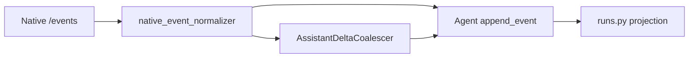

# RM-14 Runtime Semantic Event Fidelity 实施计划

Canonical 落盘路径：[`.cursor/plans/rm-14_runtime-semantic-event-fidelity.plan.md`](rm-14_runtime-semantic-event-fidelity.plan.md)

`commit_policy: post_review`。下游只走 `smc-plan-delivery`。本 Plan 在 RM-13 `IMPLEMENTED_AND_PROVEN` 之前不得 Execute。WRITE_OWNER 落在 RM-13 之后的 Native Adapter，不得恢复 ChatCompletion parser。

批准事实只取 `grounded_commit` `81babaebae7c7a1400db5be6139633af47bf5161` 作为 HEAD 证据。实施输入是 RM-13 Native `/events` 消费路径，不是 `_emit_semantic_from_choice`。A1 增补文档 frontmatter 仍为 `PROPOSED`，不回退本 PRD。

## 前端表现变化

本次改动无本仓库前端表现变化。不改 Portal / Admin / Work 页面、按钮、文案或路由。Work 可观察的差异是既有事件质量：合并后的 `assistant.message`、真实 `tool.call`、正确终态与 canonical `phase`。

## Approved PRD

[Approved PRD](../../docs_agent/prd-v1.6.12-runtime-semantic-event-fidelity.md)

## Scope

- In: Native Event Normalizer；`AssistantDeltaCoalescer`；tool dual-track `call_id`；unpaired start 收尾；`reasoning.available` 隔离；`subagent.*` / `approval.responded` / `run.steered` 仅 Internal Trace；`approval.request` -> Public `approval.requested` 事件事实；canonical `phase` 双发 `stage`；Backend 投影读 `phase`；复跑 PC-12 / PC-13。
- Out: RM-15 决策/Cancel 闭环；PC-01 至 PC-09 结项；映射 `reasoning.summary`；Public Child Run；恢复 ChatCompletion parser；改写 v1.2.1；Backend 第二 Event Store；Work 前端。
- Production Owner inherited from PRD: Agent Hermes Adapter（C01–C07, C09）；Adapter + Skill Run API（C08）；Agent Run SoT KEEP（C10）；Contract + 投影类型 KEEP（C11）；PC-12/PC-13 回归门禁（C12，测试而非新投影 Owner）。

Plan 级冻结（不改 PRD 语义）:

- Coalescer：`MAX_BUFFERED_CHARS = 80`；`MAX_LATENCY_MS = 100`；另在 `\n\n`、即将 `tool.started` / `approval.request`、Runtime terminal、Attempt abort 时 flush。禁止一两个汉字一条 durable 事件。
- `call_id = f"{attempt_id}:{tool_name}:{segment_seq}"`。sequential 同名 FIFO `correlation_confidence=high`；parallel 同名 `low`。confidence 不进 Public。
- Unpaired `tool.started` 在 Runtime terminal 按 Step terminal 收尾为 `failed` 或 `completed` 与 Step 一致，并记录 observability gap。
- `phase` 枚举：`PREPARING` / `RUNTIME_STARTING` / `RUNTIME_RUNNING` / `WAITING_APPROVAL` / `STOPPING` / `RECONCILING`。`stage` 为对应小写。
- 不得把 Runtime 原始事件直接 INSERT `run_events`。
- 若 RM-12 已改同一投影，先完成者复跑对方 PC-12/PC-13。

## Grounding Evidence Ledger

| Change ID | Target | Baseline State | Symbol / Entry Resolution | Caller / Callee Evidence | Existing Reuse Search | Result |
|---|---|---|---|---|---|---|
| C01 | `nodeskclaw-agent/app/services/assistant_delta_coalescer.py#AssistantDeltaCoalescer` | MISSING at `81babaeb` | HEAD `_emit_semantic_from_choice` 把每个 delta.content 写成 durable assistant.message；该 parser 的拆除归 RM-13 C09 | RM-13 Native `/events` 将提供 `message.delta` | 无 buffer/flush helper；新文件承载 coalescer 算法，避免塞进 HTTP Adapter | PASS |
| C02 | `nodeskclaw-agent/app/services/hermes_engine.py#execute_hermes_run` | MISSING ordering at `81babaeb` | 无 flush-before-tool | `append_event` 分配 `event_seq` | Adapter 在 tool.started 前调用 coalescer.flush | PASS |
| C03 | `nodeskclaw-agent/app/services/native_event_normalizer.py#normalize_native_event` | MISSING at `81babaeb` | Native `tool.started/completed` 无稳定 Public `call_id` | Public `tool.call` 要求 `call_id` | 合成 id 放 Normalizer；不进 Public 的 confidence 只留 Internal | PASS |
| C04 | `nodeskclaw-agent/app/services/native_event_normalizer.py#normalize_native_event` | MISSING at `81babaeb` | 无 unpaired 收尾 | Runtime terminal 路径在 Adapter | 同一 Normalizer 在 terminal 关闭 open starts | PASS |
| C05 | `nodeskclaw-agent/app/services/native_event_normalizer.py#normalize_native_event` | MISSING at `81babaeb` | 无 `reasoning.available` 处理 | Public `_public_run_event` 会投影 `reasoning.summary` 若 SoT 存在 | 丢弃/Internal Trace；禁止映射 summary | PASS |
| C06 | `nodeskclaw-agent/app/services/native_event_normalizer.py#normalize_native_event` | MISSING at `81babaeb` | 无 subagent/steer/responded 处理 | 禁止 Child Run | Internal Trace only；敏感字段剥离 | PASS |
| C07 | `nodeskclaw-agent/app/services/native_event_normalizer.py#normalize_native_event` | MISSING at `81babaeb` | Native `approval.request` 未映射 | KEEP 投影已能放行 `approval.requested` | Normalizer 产出 SoT 事件即可；不做 RM-15 决策 | PASS |
| C08 | `nodeskclaw-agent/app/services/hermes_engine.py#execute_hermes_run` | PARTIAL at `81babaeb` | Adapter 发 `payload.stage` | Backend `_public_run_event` 读 `payload.phase` 否则猜 status | Adapter 双发 phase+stage；Backend 读 phase | PASS |
| C08 | `nodeskclaw-backend/app/api/runs.py#_public_run_event` | PARTIAL at `81babaeb` | `phase` fallback `data.status` | Public SSE progress | 新投影以 phase 为事实字段 | PASS |
| C09 | `nodeskclaw-agent/app/services/native_event_normalizer.py#normalize_native_event` | MISSING at `81babaeb` | RM-13 消费 `/events` 但不分流 | 禁止恢复 `_emit_semantic_from_choice` | Normalizer 是唯一生产语义入口 | PASS |
| C12 | `nodeskclaw-backend/tests/hermes_skill/test_pc12_pc13_projection_regression.py` | MISSING as dedicated gate at `81babaeb` | PC-12/PC-13 是协同回归，不是新投影 Owner | 本项改 `_public_run_event` 后必须复跑 | 测试模块复用 RM-12 断言；不改投影实现 | PASS |

## Requirement Coverage Ledger

| Requirement | Source | Obligation | Classification | Change IDs | Todo | Verification IDs | Evidence Class | Blocking |
|---|---|---|---|---|---|---|---|---|
| AC-01 | AC | Plain text 最终文本无丢失、无重复、顺序正确；长中文输出不再出现逐 token/逐汉字 durable event storm，durable `assistant.message` 数量由 coalescer 边界控制且显著少于 transport delta。 | BEHAVIOR | C01 | T1 | V01 | INTEGRATION | yes |
| AC-02 | AC | `message.delta` 后接 `tool.started` 时 SoT 先 flush assistant 再 `tool.call(started)`。 | LIFECYCLE | C02 | T1 | V02 | UNIT | yes |
| AC-03 | AC | Tool Run 的 started/completed/failed 可稳定关联同一 Public `call_id`。 | CONTRACT | C03 | T1 | V03 | UNIT | yes |
| AC-04 | AC | Parallel same-name Tool 的 Internal correlation 标记 `low`，不向 Public 泄漏 confidence。 | SECURITY | C03 | T1 | V04 | UNIT | yes |
| AC-05 | AC | Unpaired Tool 在 Runtime terminal 后有明确收尾，不永久 started。 | LIFECYCLE | C04 | T1 | V05 | UNIT | yes |
| AC-06 | AC | `reasoning.available` 不产生 `reasoning.summary`。 | SECURITY | C05 | T1 | V06 | UNIT | yes |
| AC-07 | AC | `subagent.*` 不形成 Public Child Run，不泄漏敏感内部字段。 | SECURITY | C06 | T1 | V07 | UNIT | yes |
| AC-08 | AC | `approval.request` 可产生 `approval.requested`。 | BEHAVIOR | C07 | T1 | V08 | UNIT | yes |
| AC-09 | AC | progress 使用 canonical `phase`，兼容期 `stage` 由同一值派生且可预测。 | CONTRACT | C08 | T1 | V09 | INTEGRATION | yes |
| AC-10 | AC | Agent Event SoT 仍是唯一 durable source；v1.2.1 零修改；未知内部事件丢弃。 | CONTRACT | C10; C11 | - | V10 | CONTRACT_RELEASE | yes |
| AC-11 | AC | PC-12 / PC-13 回归通过。 | EVIDENCE | C12 | T2 | V11 | INTEGRATION | yes |
| AC-12 | AC | 生产语义路径是 Native Event Normalizer；抽查生产 Skill Run 不再以 ChatCompletion `choices[].delta` 作为正式 Event Source；本项不恢复该 parser。 | BEHAVIOR | C09 | T1 | V12 | INTEGRATION | yes |
| AC-13 | AC | 真实 Runtime 证据记录 `hermes_runtime_version=v2026.8.31 or newer`。Mock-only 不得取代真实 Runtime 证据。本项完成不等于 RM-16 DONE。 | EVIDENCE | C01; C02; C03; C04; C05; C06; C07; C08; C09 | T1 | V13 | REAL_PROCESS | yes |
| DOD-01 | DOD | C01–C09、C12 均有可观察证据；delta coalescing、semantic order、tool correlation、unpaired closure、reasoning/subagent 隔离、canonical phase、PC-12/PC-13 回归全部成立。 | EVIDENCE | C01; C02; C03; C04; C05; C06; C07; C08; C09; C12 | T1; T2 | V01; V02; V03; V04; V05; V06; V07; V08; V09; V11; V13 | INTEGRATION | yes |
| DOD-02 | DOD | 未新建第二 Event Store；Backend 仍只投影；Runtime terminal 仍由 Agent 裁决。 | SCOPE | C10 | - | V10; V14 | DIFF_SCOPE | yes |
| DOD-03 | DOD | v1.2.1 合同未被改写；Internal Runtime 事实不进 Public。 | CONTRACT | C11; C05; C06 | T1 | V06; V07; V10 | CONTRACT_RELEASE | yes |
| DOD-04 | DOD | RM-13 已 DONE 且本项 Review / Verification PASS，真实 implementation commit 与验证证据写入 Roadmap 后，RM-14 才可标记 `DONE`。 | RELEASE | C12 | T2 | V13; V14 | DOCUMENT_SEMANTIC | yes |

## Lifecycle Closure Matrix

| Journey | Requirements | Trigger | Nonterminal State | Success Writer | Failure / Cancel Writer | Evidence IDs |
|---|---|---|---|---|---|---|
| Delta coalescing | AC-01; AC-02 | Native `message.delta` stream | buffer held in coalescer | `AssistantDeltaCoalescer.flush` then `append_event` assistant.message | Attempt abort/cancel flushes then stops; no token storm | V01; V02 |
| Tool correlation | AC-03; AC-04; AC-05 | `tool.started` then completed/failed or terminal | started open in Adapter map | Normalizer emits matching `call_id`; unpaired closed at Runtime terminal | observability gap recorded; Public never stuck started | V03; V04; V05 |

## Contract / Data Flow Closure Matrix

| Flow | Requirements | Producer | Transport / Schema | Consumer | Required Fields | Validation Owner | Failure Mapping | Retry / Idempotency Identity | Evidence IDs |
|---|---|---|---|---|---|---|---|---|---|
| Native to SoT | AC-01; AC-02; AC-12 | Hermes Native `/events` | Normalizer plus Coalescer | `run_service#append_event` | coalesced text; flushed order; no raw transport insert | Adapter after RM-13 Binding | unknown transport dropped or Internal Trace | Agent `event_seq` not Runtime cursor | V01; V02; V12 |
| Tool Public | AC-03; AC-04 | Normalizer synthetic or upstream `tool_call_id` | Agent `tool.call` payload | Backend `_public_run_event` | `tool_name`; `call_id`; status | Public projection already KEEP | confidence stripped before SoT public payload | segment_seq per Attempt | V03; V04 |
| Isolation | AC-06; AC-07 | Native reasoning/subagent/steer/responded | Internal Trace only | never Work SSE | no child_session_id / cost / output_tail / paths | Normalizer | mapping to reasoning.summary is a defect | none | V06; V07 |
| Progress phase | AC-09 | Adapter controlled enum | payload.phase plus derived stage | `_public_run_event` | phase enum | Skill Run API reads phase not status guess | missing phase must not invent from HermesTask | none | V09 |
| Cross regression | AC-11 | Public surfaces after C08 | PC-12 blacklist; PC-13 terminals | RM-12 assertions | no forbidden keys; terminal before close | T2 tests | mixed plane fails | none | V11 |

## Verification Ledger

| Verification ID | Level | Entry Point / Command | Oracle | Negative / Regression | Evidence Policy | Environment | Blocking |
|---|---|---|---|---|---|---|---|
| V01 | UNIT | `uv run pytest tests/test_assistant_delta_coalescer.py -q` | Chinese fixture with many deltas yields far fewer durable messages; text exact | one or two CJK chars per durable event fails | LOCAL_TRANSIENT | local | yes |
| V02 | UNIT | `uv run pytest tests/test_native_event_normalizer.py -q -k order` | SoT order assistant.message then tool.call started | tool before flush fails | LOCAL_TRANSIENT | local | yes |
| V03 | UNIT | `uv run pytest tests/test_native_event_normalizer.py -q -k call_id` | started/completed share Public call_id | missing call_id fails | LOCAL_TRANSIENT | local | yes |
| V04 | UNIT | `uv run pytest tests/test_native_event_normalizer.py -q -k parallel` | internal low; public payload has no correlation_confidence | confidence in public JSON fails | LOCAL_TRANSIENT | local | yes |
| V05 | UNIT | `uv run pytest tests/test_native_event_normalizer.py -q -k unpaired` | terminal closes open started | leftover started fails | LOCAL_TRANSIENT | local | yes |
| V06 | UNIT | `uv run pytest tests/test_native_event_normalizer.py -q -k reasoning` | no reasoning.summary SoT event | mapping summary fails | LOCAL_TRANSIENT | local | yes |
| V07 | UNIT | `uv run pytest tests/test_native_event_normalizer.py -q -k subagent` | no Public child run; sensitive fields absent | output_tail in public fails | LOCAL_TRANSIENT | local | yes |
| V08 | UNIT | `uv run pytest tests/test_native_event_normalizer.py -q -k approval` | approval.requested SoT event | missing event fails | LOCAL_TRANSIENT | local | yes |
| V09 | INTEGRATION | `uv run pytest tests/test_hermes_engine.py tests/hermes_skill/test_employee_runs_api.py -q -k phase` | progress has phase and matching stage; Backend uses phase | stage-only guess path fails | LOCAL_TRANSIENT | local | yes |
| V10 | CONTRACT_RELEASE | checksum `contracts/skill-run/v1.2.1/` vs `81babaeb`; unknown events still dropped | zero contract diff | schema edit fails | REPO_SUMMARY | local | yes |
| V11 | INTEGRATION | `uv run pytest tests/hermes_skill/test_pc12_pc13_projection_regression.py -q` | PC-12 zero leak; PC-13 four terminals | mixed HermesTask public plane fails | LOCAL_TRANSIENT | local | yes |
| V12 | UNIT | `uv run pytest tests/test_hermes_engine.py -q` | production execute uses Normalizer; no `_emit_semantic_from_choice` call | restoring ChatCompletion parser fails | LOCAL_TRANSIENT | local | yes |
| V13 | REAL_PROCESS | live Hermes Native Run after RM-13 | `hermes_runtime_version=v2026.8.31 or newer` | mock-only cannot close RM-14 | LOCAL_TRANSIENT | Hermes Runtime v2026.8.31 or newer | yes |
| V14 | DIFF_SCOPE | `git diff --name-only` vs RM-13 baseline | no second event store; no ChatCompletion restore; no v1.2.1 rewrite | those files fail | REPO_SUMMARY | local | yes |

## Immediate Read

- `nodeskclaw-agent/app/services/hermes_engine.py#execute_hermes_run`
- `nodeskclaw-agent/app/services/run_service.py#append_event`
- `nodeskclaw-backend/app/api/runs.py#_public_run_event`
- RM-13 canonical Plan `.cursor/plans/rm-13_hermes-native-runtime-bridge.plan.md`

## Triggered Read

- If ChatCompletion parser still imported from production execute: `nodeskclaw-agent/app/services/hermes_engine.py#_emit_semantic_from_choice`
- If Backend still guesses status for progress: `nodeskclaw-backend/app/api/runs.py#_public_run_event`
- If RM-12 blacklist tests already exist: `nodeskclaw-backend/tests/hermes_skill/test_employee_jwt_public_conformance.py`
- Otherwise: do not read

## Change Matrix

| Change ID | File / Symbol | Kind | Action | Existing Owner | Todo Owner | Target State | PRD Capability | New File? |
|---|---|---|---|---|---|---|---|---|
| C01 | `nodeskclaw-agent/app/services/assistant_delta_coalescer.py#AssistantDeltaCoalescer` | PROD | ADD | Agent Hermes Adapter | T1 | flush boundaries 80 chars / 100ms | AssistantDeltaCoalescer | yes |
| C01 | `nodeskclaw-agent/tests/test_assistant_delta_coalescer.py` | TEST | ADD | Agent Hermes Adapter tests | T1 | long Chinese coalescing oracle | AssistantDeltaCoalescer | yes |
| C02 | `nodeskclaw-agent/app/services/hermes_engine.py#execute_hermes_run` | PROD | MODIFY | Agent Hermes Adapter | T1 | flush assistant before tool.call | Semantic ordering | no |
| C03 | `nodeskclaw-agent/app/services/native_event_normalizer.py#normalize_native_event` | PROD | ADD | Agent Hermes Adapter | T1 | dual-track call_id | Tool dual-track correlation | yes |
| C04 | `nodeskclaw-agent/app/services/native_event_normalizer.py#normalize_native_event` | PROD | ADD | Agent Hermes Adapter | T1 | unpaired start closed | Unpaired tool start closure | yes |
| C05 | `nodeskclaw-agent/app/services/native_event_normalizer.py#normalize_native_event` | PROD | ADD | Agent Hermes Adapter | T1 | reasoning.available isolated | Reasoning isolation | yes |
| C06 | `nodeskclaw-agent/app/services/native_event_normalizer.py#normalize_native_event` | PROD | ADD | Agent Hermes Adapter | T1 | subagent/steer/responded internal | Runtime internal event isolation | yes |
| C07 | `nodeskclaw-agent/app/services/native_event_normalizer.py#normalize_native_event` | PROD | ADD | Agent Hermes Adapter | T1 | approval.request to SoT | Approval request event projection | yes |
| C08 | `nodeskclaw-agent/app/services/hermes_engine.py#execute_hermes_run` | PROD | MODIFY | Agent Hermes Adapter | T1 | emit phase and derived stage | Progress canonical phase plus stage | no |
| C08 | `nodeskclaw-backend/app/api/runs.py#_public_run_event` | PROD | MODIFY | Skill Run API | T1 | read phase as fact | Progress canonical phase plus stage | no |
| C09 | `nodeskclaw-agent/app/services/native_event_normalizer.py#normalize_native_event` | PROD | ADD | Agent Hermes Adapter | T1 | Native events split before SoT | Native Event Normalizer | yes |
| C09 | `nodeskclaw-agent/tests/test_native_event_normalizer.py` | TEST | ADD | Agent Hermes Adapter tests | T1 | isolation and correlation oracles | Native Event Normalizer | yes |
| C10 | `nodeskclaw-agent/app/services/run_service.py#append_event` | PROD | KEEP | Agent Run | - | unique durable SoT | Agent Event SoT / fencing / terminal aggregator | no |
| C11 | `contracts/skill-run/v1.2.1/` | PROD | KEEP | Contract Package | - | bytes unchanged | Public v1.2.1 合同与 RM-12 投影类型 | no |
| C12 | `nodeskclaw-backend/tests/hermes_skill/test_pc12_pc13_projection_regression.py` | TEST | ADD | Skill Run API regression | T2 | PC-12 and PC-13 after projection change | RM-12 PC-12 / PC-13 交叉回归 | yes |

## Implementation Decisions

| Change ID | Strategy | Root-Cause / Reuse Evidence | Why This Is Minimum |
|---|---|---|---|
| C01 | MINIMAL_NEW | No buffer exists; putting algorithm inside HTTP stream loop would mix transport and flush policy | Dedicated coalescer with frozen 80/100 thresholds |
| C02 | MODIFY_EXISTING | Ordering is Adapter call sequence around existing `append_event` | Flush then emit tool in `execute_hermes_run` |
| C03 | MINIMAL_NEW | Hermes Native tools lack public `tool_call_id` | Same Normalizer synthesizes call_id |
| C04 | MINIMAL_NEW | Unpaired starts are the terminal path of the same map | Close opens in Normalizer at Runtime terminal |
| C05 | MINIMAL_NEW | Isolation is a Normalizer branch | Drop/Internal; do not map summary |
| C06 | MINIMAL_NEW | Same branch table as C05 | Internal Trace only |
| C07 | MINIMAL_NEW | Public projection already accepts `approval.requested` | Emit SoT fact only |
| C08 | MODIFY_EXISTING | Adapter already emits progress; Backend already reads phase with fallback | Dual-write plus stop guessing |
| C09 | MINIMAL_NEW | RM-13 will deliver transport events without semantic split | Normalizer is the production semantic entry; ChatCompletion stays removed |
| C12 | MINIMAL_NEW | Regression gate is tests, not a new projection owner | Dedicated PC-12/PC-13 module |

## Write Ownership Ledger

| Todo | Owns Changes | Writes | Reads | Depends On | Parallel Safe |
|---|---|---|---|---|---|
| T1 | C01; C02; C03; C04; C05; C06; C07; C08; C09 | `nodeskclaw-agent/app/services/assistant_delta_coalescer.py#AssistantDeltaCoalescer` `nodeskclaw-agent/tests/test_assistant_delta_coalescer.py` `nodeskclaw-agent/app/services/hermes_engine.py#execute_hermes_run` `nodeskclaw-agent/app/services/native_event_normalizer.py#normalize_native_event` `nodeskclaw-backend/app/api/runs.py#_public_run_event` `nodeskclaw-agent/tests/test_native_event_normalizer.py` | `nodeskclaw-agent/app/services/run_service.py#append_event` | - | no |
| T2 | C12 | `nodeskclaw-backend/tests/hermes_skill/test_pc12_pc13_projection_regression.py` | `nodeskclaw-backend/app/api/runs.py#_public_run_event` | T1 | no |

## Integration Hotspots

| File | Owner Todo | Reason |
|---|---|---|
| `nodeskclaw-agent/app/services/hermes_engine.py` | T1 | Native consume, coalescer flush, phase emit share RM-13 Adapter |
| `nodeskclaw-agent/app/services/native_event_normalizer.py` | T1 | C03–C07 and C09 share one Normalizer entry |

## Generated Outputs Ledger

None

## New File Justification

| Change ID | File | Necessity | Owner Impact |
|---|---|---|---|
| C01 | `nodeskclaw-agent/app/services/assistant_delta_coalescer.py` | Flush policy is a distinct algorithm; HTTP Adapter would become the wrong owner | T1 Adapter still wires it |
| C01 | `nodeskclaw-agent/tests/test_assistant_delta_coalescer.py` | Long Chinese oracle has no existing fixture home | T1 |
| C03 | `nodeskclaw-agent/app/services/native_event_normalizer.py` | PRD C09 ADD Normalizer as production semantic entry; existing hermes_engine.py after RM-13 stays HTTP/Binding owner | T1; C04–C07/C09 share this file |
| C04 | `nodeskclaw-agent/app/services/native_event_normalizer.py` | Unpaired start closure is a terminal branch of the same Normalizer, not a second owner | T1 |
| C05 | `nodeskclaw-agent/app/services/native_event_normalizer.py` | Reasoning isolation is a Normalizer discard/Internal branch | T1 |
| C06 | `nodeskclaw-agent/app/services/native_event_normalizer.py` | subagent/steer/responded isolation shares the same split table | T1 |
| C07 | `nodeskclaw-agent/app/services/native_event_normalizer.py` | approval.request mapping is a Normalizer durable-semantic branch | T1 |
| C09 | `nodeskclaw-agent/app/services/native_event_normalizer.py` | C09 is the Normalizer entrypoint itself; ChatCompletion parser must not be revived in hermes_engine.py | T1 |
| C09 | `nodeskclaw-agent/tests/test_native_event_normalizer.py` | Isolation/correlation oracles are not ChatCompletion parser tests | T1 |
| C12 | `nodeskclaw-backend/tests/hermes_skill/test_pc12_pc13_projection_regression.py` | C12 is a regression gate, not projection code | T2 only |

## Todo T1 — Native Normalizer and Coalescer

**Owns Changes**
- C01
- C02
- C03
- C04
- C05
- C06
- C07
- C08
- C09

**Goal**
Native transport events become coalesced, ordered, correlated Agent SoT events with internal facts isolated and progress using canonical `phase`.

**Immediate anchors**
- `nodeskclaw-agent/app/services/hermes_engine.py#execute_hermes_run`
- `nodeskclaw-backend/app/api/runs.py#_public_run_event`

**Changes**
- Do not Execute until RM-13 is proven. Do not restore `_emit_semantic_from_choice`.
- Add coalescer with 80/100 flush plus boundary flushes.
- Add Normalizer split: coalescer buffer, durable semantics, Internal Trace, or drop.
- Dual-emit `phase`/`stage`; Backend reads `phase`.

**Stop conditions**
- [ ] RM-13 Native consume path is the only input
- [ ] Durable assistant.message count much less than transport deltas; Chinese text intact
- [ ] tool.call ordered after flush; unpaired closed
- [ ] no reasoning.summary from reasoning.available; no Public subagent
- [ ] progress has phase; ChatCompletion parser not called

**Triggered reads**
- None unless a listed trigger becomes true

## Todo T2 — PC-12 PC-13 cross regression

**Owns Changes**
- C12

**Goal**
After projection changes, PC-12 and PC-13 pass so RM-12 and RM-14 do not leave a mixed public plane.

**Immediate anchors**
- `nodeskclaw-backend/tests/hermes_skill/test_pc12_pc13_projection_regression.py`

**Changes**
- Add regression tests for forbidden-field scan and four-terminal SSE delivery against the post-C08 projection.
- Do not implement new projection behavior.

**Stop conditions**
- [ ] PC-12 blacklist clean
- [ ] PC-13 four terminals deliver then close
- [ ] No production writes in this Todo

**Triggered reads**
- None unless a listed trigger becomes true

## Verification

Run the Verification Ledger entries through `smc-plan-delivery/scripts/evidence.py`.

## Completion Gate

| Exit State | Allowed When | Blocking Evidence |
|---|---|---|
| IMPLEMENTED_AND_PROVEN | RM-13 proven; all Cursor todos completed; completion audit FRESH PASS; implementation review FRESH PASS; all blocking Verification FRESH PASS; durable Evidence Manifest FRESH | V01, V02, V03, V04, V05, V06, V07, V08, V09, V10, V11, V12, V13, V14 via SMC evidence ledger + durable Evidence Manifest |
| IMPLEMENTED_NOT_PROVEN | implementation exists but proof is pending/stale | pending/stale gate IDs |
| BLOCKED | RM-13 not proven, or Hermes Runtime unavailable for V13 | blocker record |
| RETURN_PRD | approved owner/boundary conflicts | PRD revision request |
