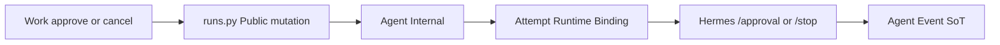

# RM-15 Approval Runtime Control Closure 实施计划

Canonical 落盘路径：[`.cursor/plans/rm-15_approval-runtime-control-closure.plan.md`](rm-15_approval-runtime-control-closure.plan.md)

`commit_policy: post_review`。下游只走 `smc-plan-delivery`。WRITE_OWNER 落在 RM-14 之后的 Native Adapter 与既有 `approve_run` / `cancel_run`，禁止另起第二审批状态机，禁止恢复 ChatCompletion parser，禁止改写 v1.2.1，禁止 Backend 直连 Hermes。

批准事实只取 `grounded_commit` `b6ebbc260ab02aad328ebdbf5f977e22763c9207`。A1 增补文档 frontmatter 仍为 `PROPOSED`，记为 Note，不回退本 PRD。范围止于 A1 Phase C；不得以 PC-01 至 PC-09 结项。

## 前端表现变化

本次改动无本仓库前端表现变化。不改 Portal / Admin / Work 页面、按钮、文案或路由。Work 可观察的差异是既有审批与取消真正闭环：批准/拒绝送达 Runtime；运行中取消到达 `/stop` 并留下合同终态。

## Approved PRD

[Approved PRD](../../docs_agent/prd-v1.6.13-approval-runtime-control-closure.md)

## Scope

- In: mid-run 审批驻留（进度 `phase=WAITING_APPROVAL`，同一 `runtime_run_id`）；Agent `POST /v1/runs/{runtime_run_id}/approval`；Public 两档批准/拒绝映射内部 `once`/`deny`；审批与 stop 共用 Binding generation fencing；运行中与等待审批中的 cancel 都到达 `/stop`，404 走既有 reconciliation；`interrupted` / 状态不可得 FAIL 且不自动新 Attempt；用户新提示词可复用 `runtime_session_id`；复跑 PC-12 / PC-13；真实 Runtime 控制面证据。
- Out: RM-16 PC-01 至 PC-09 结项；改写 v1.2.1；Backend 成为 Hermes 客户端；恢复 ChatCompletion parser；`/events` 重订阅恢复；拆除 HermesTaskWorker；Work 前端；MCP `approval_service.py`；Knowledge 入库审批。
- Production Owner inherited from PRD: Agent Run 域 + Hermes Adapter（C02, C06, C07）；Agent Hermes Adapter（C03, C05, C08 KEEP）；Backend Skill Run API + Agent（C04）；Backend Skill Run API 回归门禁（C11）；Normalizer / SoT / 合同 KEEP（C01, C09, C10, C12）。

Plan 级冻结（不改 PRD 语义）:

- Public mutation 仍是 `POST /api/v1/runs/{run_id}/approvals/{approval_id}`。Body 只接受 `decision=approve|deny`（别名 `APPROVE`/`once`/`allow`/`approved` → `once`；`DENY`/`reject` → `deny`）。客户端提交 `session`/`always` 必须 4xx 失败关闭，不得转发 Internal。
- Internal 可对 Hermes 发 `once`/`deny`；`session`/`always` 仅服务端策略写入，不得来自 Public body。可选 Hermes `all` 不得进入 Public Event。
- Hermes 寻址只用 Binding `runtime_run_id`，禁止 `session_id`。旧 Attempt / 旧 generation fencing 拒绝且不发南向。
- 有 `runtime_run_id` 的批准禁止 `WAITING_APPROVAL`→`QUEUED` 再 `POST /v1/runs`。无 Binding 的创建态 `WAITING_APPROVAL`（`requires_approval` 入队）保持本地 QUEUED，不是第二状态机。
- `execute_hermes_run` 在 Hermes `waiting_for_approval` 时不得返回；保持 worker 在 generator 内，用 `GET /v1/runs/{id}` 轮询，禁止重订阅 `/events`。进度双发 `phase=WAITING_APPROVAL`。
- 等待审批中 cancel：有 Binding 则 `CANCELLING` + `/stop`，禁止只改本地 `CANCELLED`。
- Hermes `404 run_not_found` / `409 approval_not_active` / `400 invalid_approval_choice` 与 stop 404 不得变成 Public HTTP 500，且响应不得含 `runtime_run_id`。
- `interrupted` 或状态不可得 → `run.failed` + `RUNTIME_INTERRUPTED` / `RUNTIME_STATE_UNAVAILABLE`；`_recover_stale_runs` 不得把该 Attempt 再 QUEUED 成新 Hermes Run。用户新 Run 可经既有 `build_native_run_payload` 带同一 `runtime_session_id`。

## Grounding Evidence Ledger

| Change ID | Target | Baseline State | Symbol / Entry Resolution | Caller / Callee Evidence | Existing Reuse Search | Result |
|---|---|---|---|---|---|---|
| C02 | `nodeskclaw-agent/app/services/worker.py#RunWorker#_execute` | EXISTS at `b6ebbc26`; park MISSING | semantic `approval.requested` 只 `append_event`；`execute_hermes_run` 在 `waiting_for_approval` 时 yield progress 后 `return`，worker 退出后租约会过期 | `execute_engine` → `execute_hermes_run`；`_claim_one` 只认领 `QUEUED`/`RESUMING` | 不新建审批状态机；驻留改 Adapter 不返回 + Worker 观察 progress | PASS |
| C03 | `nodeskclaw-agent/app/services/hermes_engine.py#execute_hermes_run` | EXISTS; `/approval` MISSING | `hermes_engine.py` 仅 `_stop_runtime` POST `/stop`；`run_service.py#approve_run` 对 `WAITING_APPROVAL` 写 `run_approvals` 后改 `QUEUED` | `internal_runs.py#approve_internal_run` 调用 `approve_run`；`load_runtime_binding` 已有 `runtime_run_id` | 南向 POST 放在 Adapter，与 `_stop_runtime` 并列；有 Binding 时禁止 QUEUED 重放 | PASS |
| C04 | `nodeskclaw-backend/app/api/runs.py#approve_run` | EXISTS; two-choice MISSING | Public 原样转发 body，无 deny，无 `session`/`always` 拒绝 | `_agent_post` `/internal/v1/runs/{id}/approvals/{approval_id}`；`_handle_agent_error_response` 已映射 4xx | 在 Public 入口做两档校验；不新增路由；不改 v1.2.1 事件 schema | PASS |
| C05 | `nodeskclaw-agent/app/services/hermes_engine.py#_stop_runtime` | EXISTS; approval fencing MISSING | `_stop_runtime` 已校验 Binding generation 与 `runtime_run_id`；`approve_run` 无 generation / Binding 检查 | `test_execute_hermes_stale_generation_does_not_stop` 覆盖 stop | 审批命令复用同一 Binding 栅栏，不另建 fencing 服务 | PASS |
| C06 | `nodeskclaw-agent/app/services/run_service.py#cancel_run` | EXISTS; wait-approval `/stop` DEFECT | `WAITING_APPROVAL` 走本地 `CANCELLED` 注释为无 in-flight worker；RUNNING 才 `CANCELLING` 让 `_cancel_check_loop` 调 `_stop_runtime` | Worker `_cancel_check_loop`；`_stop_runtime` 404 → `_reconcile_status` | 有 Binding 的等待审批改走 CANCELLING+`/stop`；复用 RM-13 404 分支 | PASS |
| C07 | `nodeskclaw-agent/app/services/hermes_engine.py#_terminal_from_status` | EXISTS; auto-continue PARTIAL | `interrupted` 已映射 `RUNTIME_INTERRUPTED`；`RunWorker#_recover_stale_runs` 把过期 `PREPARING`/`RUNNING` 改 `QUEUED` 并清空 `attempt_id` | `_claim_one` 会对 QUEUED 插入新 Attempt；`build_native_run_payload` 已支持 `session_id` | FAIL 走 aggregator；恢复只 GET status；新用户 Run 复用 payload session 字段 | PASS |
| C11 | `nodeskclaw-backend/tests/hermes_skill/test_pc12_pc13_projection_regression.py` | EXISTS at `b6ebbc26` | `test_pc12_projection_regression` / `test_pc13_projection_regression`；`test_employee_runs_api.py#test_approve_run_proxies_json_body_and_exec_headers` 仍原样转发；live runner `run_rm15_live_control.py` 基线 MISSING | Public cancel 经 `_agent_post`；Agent 500 会 `raise_for_status` 成 Public 500 | 扩展既有 PC 与 employee API 测试；新 live runner 对齐 `run_rm14_live_semantic.py` 形态 | PASS |

## Requirement Coverage Ledger

| Requirement | Source | Obligation | Classification | Change IDs | Todo | Verification IDs | Evidence Class | Blocking |
|---|---|---|---|---|---|---|---|---|
| AC-01 | AC | Hermes `approval.request` 仍产生 Public `approval.requested`，且不包含 `runtime_run_id`。 | BEHAVIOR | C01 | - | V01 | UNIT | yes |
| AC-02 | AC | 审批请求到达后当前 Attempt 的 `runtime_run_id` 保持不变，直到决策或 cancel/terminal；进度可观察 `WAITING_APPROVAL`。 | LIFECYCLE | C02 | T1 | V02 | UNIT | yes |
| AC-03 | AC | Public 批准到达 Hermes `/approval`，choice 为内部 `once`；Hermes 接受后 Public terminal 仍由后续 Runtime 事件 + Agent aggregator 决定。 | BEHAVIOR | C03 | T1 | V03 | UNIT | yes |
| AC-04 | AC | Public 拒绝到达 Hermes `/approval`，choice 为 `deny`；客户端 `session`/`always` 被拒绝。 | SECURITY | C04 | T1 | V04 | INTEGRATION | yes |
| AC-05 | AC | 旧 Attempt / 旧 generation 的 approval 与 stop 不改变当前 Runtime Run。 | LIFECYCLE | C05 | T1 | V05 | UNIT | yes |
| AC-06 | AC | 运行中 cancel 调用 `/stop`；stop 404 走 reconciliation 后出现合同终态 `CANCELLED` 或等价失败，且员工路径 HTTP 非 500。 | LIFECYCLE | C06 | T1 | V06 | UNIT | yes |
| AC-07 | AC | 等待审批中 cancel 也会 `/stop`，Runtime 不继续执行。 | LIFECYCLE | C06 | T1 | V07 | UNIT | yes |
| AC-08 | AC | `interrupted` 导致 FAILED + `RUNTIME_INTERRUPTED`，且不自动新 Attempt。 | LIFECYCLE | C07 | T1 | V08 | UNIT | yes |
| AC-09 | AC | 终态仍由 Agent aggregator 写出；不新建 Event Store。 | SCOPE | C08; C09 | - | V09 | UNIT | yes |
| AC-10 | AC | v1.2.1 零修改。 | CONTRACT | C10 | - | V10 | CONTRACT_RELEASE | yes |
| AC-11 | AC | PC-12 / PC-13 回归通过，其中 CANCELLED 为自动化可观察终态。 | EVIDENCE | C11 | T2 | V11 | INTEGRATION | yes |
| AC-12 | AC | 生产路径不恢复 ChatCompletion parser。 | BEHAVIOR | C12 | - | V12 | UNIT | yes |
| AC-13 | AC | 真实 Runtime 证据记录 `hermes_runtime_version=v2026.8.31 or newer`。Mock-only 不得关闭本项。本项完成不等于 RM-16 DONE。 | EVIDENCE | C03; C06 | T1; T2 | V13 | REAL_PROCESS | yes |
| DOD-01 | DOD | C02–C07、C11 均有可观察证据；审批回写、两档映射、fencing、cancel/`/stop`、interrupted 规则成立。 | EVIDENCE | C02; C03; C04; C05; C06; C07; C11 | T1; T2 | V02; V03; V04; V05; V06; V07; V08; V11; V13 | INTEGRATION | yes |
| DOD-02 | DOD | Backend 仍不直连 Hermes；`runtime_run_id` 不进 Public。 | SCOPE | C03; C04 | T1 | V04; V14 | DIFF_SCOPE | yes |
| DOD-03 | DOD | v1.2.1 未被改写；`session`/`always` 不向 Work 开放。 | CONTRACT | C04; C10 | T1 | V04; V10 | CONTRACT_RELEASE | yes |
| DOD-04 | DOD | RM-14 已 DONE 且本项 Review / Verification PASS，真实 implementation commit 与验证证据写入 Roadmap 后，RM-15 才可标记 `DONE`。 | RELEASE | C11 | T2 | V13; V14 | DOCUMENT_SEMANTIC | yes |

## Lifecycle Closure Matrix

| Journey | Requirements | Trigger | Nonterminal State | Success Writer | Failure / Cancel Writer | Evidence IDs |
|---|---|---|---|---|---|---|
| Mid-run approval park | AC-02 | Native `approval.request` / Hermes `waiting_for_approval` | Attempt alive; progress `WAITING_APPROVAL`; Binding `runtime_run_id` unchanged; Adapter generator does not return | Worker stays in `_execute`; Adapter polls GET status | cancel → CANCELLING + `/stop`; terminal via aggregator | V02; V07 |
| Approval southbound | AC-03; AC-04; AC-05 | Public `decision=approve` or `deny` after park | Internal command in flight; Hermes still waiting | Adapter POST `/approval` with Binding `runtime_run_id` + generation; SoT later events; aggregator writes terminal | stale generation no POST; `session`/`always` 4xx; Hermes 404/409/400 mapped 4xx without Runtime id | V03; V04; V05 |
| Cancel stop | AC-06; AC-07 | Public cancel while RUNNING or waiting approval with Binding | `CANCELLING`; Hermes `stopping` | `_stop_runtime` then aggregator `CANCELLED` | stop 404 → `_reconcile_status` then contract terminal; never Public 500 | V06; V07 |
| Interrupted recovery | AC-08 | GET status `interrupted` or state unavailable | no new Attempt; no `/events` resubscribe | `_terminal_from_status` yields `run.failed`; aggregator FAILED | `_recover_stale_runs` must not QUEUED a new Hermes Run | V08 |

## Contract / Data Flow Closure Matrix

| Flow | Requirements | Producer | Transport / Schema | Consumer | Required Fields | Validation Owner | Failure Mapping | Retry / Idempotency Identity | Evidence IDs |
|---|---|---|---|---|---|---|---|---|---|
| Public two-choice | AC-04; DOD-03 | Work `decision` | Public POST body; no v1.2.1 schema change | `runs.py#approve_run` then Agent Internal | `approval_id`; `decision=approve` or `deny` | Backend rejects `session`/`always` | 4xx fail-closed; no Runtime id leak | `run_approvals` unique `(run_id, approval_id)` | V04; V10 |
| Approval southbound | AC-03; DOD-02 | Agent after Binding load | Hermes `POST /v1/runs/{runtime_run_id}/approval` body `choice=once` or `deny` | Hermes Native | `runtime_run_id`; matching generation | Adapter fencing | 404/409/400 → Agent 4xx; Hermes success does not write Public terminal | Attempt + generation; not session_id | V03; V05; V14 |
| Cancel southbound | AC-06; AC-07 | Work cancel | Internal cancel → Agent `CANCELLING` → `POST /stop` | Hermes Native | Binding `runtime_run_id` | Adapter `_stop_runtime` | 404 → GET status reconcile; HTTP not 500 | generation fence; in-flight cancel_event | V06; V07; V11 |
| Status reconcile | AC-08; AC-09 | Adapter after stream drop | `GET /v1/runs/{id}` only | `_terminal_from_status` + `aggregate_run_terminal` | Hermes status / error_code | Adapter then Agent aggregator | interrupted / unavailable → FAILED; waiting keeps Attempt | no `/events` retry identity | V08; V09 |
| Cross regression | AC-11 | Public surfaces after control changes | PC-12 blacklist; PC-13 terminals | RM-12 assertions | no forbidden keys; CANCELLED automated | T2 tests + live runner | mixed HermesTask public plane fails | none | V11; V13 |

## Verification Ledger

| Verification ID | Level | Entry Point / Command | Oracle | Negative / Regression | Evidence Policy | Environment | Blocking |
|---|---|---|---|---|---|---|---|
| V01 | UNIT | `uv --directory nodeskclaw-agent run pytest tests/test_native_event_normalizer.py -q -k approval` | SoT `approval.requested` has `approval_id` + `summary` only | `runtime_run_id` in payload fails | LOCAL_TRANSIENT | local | yes |
| V02 | UNIT | `uv --directory nodeskclaw-agent run pytest tests/test_hermes_engine.py tests/test_worker.py -q -k approval` | progress `phase=WAITING_APPROVAL`; Binding `runtime_run_id` unchanged; execute does not finish the Attempt | `approve_run` QUEUED replay of a bound run fails | LOCAL_TRANSIENT | local | yes |
| V03 | UNIT | `uv --directory nodeskclaw-agent run pytest tests/test_run_service.py tests/test_hermes_engine.py -q -k approv` | bound approve POSTs Hermes `/approval` with `once`; status not QUEUED; terminal still aggregator | new `POST /v1/runs` on approve fails | LOCAL_TRANSIENT | local | yes |
| V04 | INTEGRATION | `uv --directory nodeskclaw-backend run pytest tests/hermes_skill/test_employee_runs_api.py -q -k approv` | deny forwarded as internal deny; `session`/`always` rejected before Agent | raw four-choice client body succeeds fails | LOCAL_TRANSIENT | local | yes |
| V05 | UNIT | `uv --directory nodeskclaw-agent run pytest tests/test_hermes_engine.py -q -k stale` | stale generation approval and stop do not POST current Runtime | mismatched `runtime_run_id` still posted fails | LOCAL_TRANSIENT | local | yes |
| V06 | UNIT | `uv --directory nodeskclaw-agent run pytest tests/test_run_service.py tests/test_hermes_engine.py -q -k cancel` | RUNNING cancel → CANCELLING and `/stop`; stop 404 reconciles to cancelled | Public/Agent 500 on stop 404 fails | LOCAL_TRANSIENT | local | yes |
| V07 | UNIT | `uv --directory nodeskclaw-agent run pytest tests/test_run_service.py tests/test_hermes_engine.py -q -k approval` | waiting-approval cancel POSTs `/stop` | local CANCELLED leaving Runtime running fails | LOCAL_TRANSIENT | local | yes |
| V08 | UNIT | `uv --directory nodeskclaw-agent run pytest tests/test_hermes_engine.py tests/test_worker.py -q` | `interrupted` → `run.failed` `RUNTIME_INTERRUPTED`; recover does not QUEUED a new Hermes Run | lease expiry auto-continues fails | LOCAL_TRANSIENT | local | yes |
| V09 | UNIT | `uv --directory nodeskclaw-agent run pytest tests/test_run_service.py -q -k aggregat` | terminal still `aggregate_run_terminal`; no second event store module | new event store file fails | LOCAL_TRANSIENT | local | yes |
| V10 | CONTRACT_RELEASE | `git diff --exit-code b6ebbc260ab02aad328ebdbf5f977e22763c9207 -- contracts/skill-run/v1.2.1` | zero contract diff | schema edit fails | REPO_SUMMARY | local | yes |
| V11 | INTEGRATION | `uv --directory nodeskclaw-backend run pytest tests/hermes_skill/test_pc12_pc13_projection_regression.py tests/hermes_skill/test_employee_runs_api.py -q` | PC-12 zero leak; PC-13 CANCELLED automated without HTTP 500 | mixed HermesTask public plane or cancel 500 fails | LOCAL_TRANSIENT | local | yes |
| V12 | UNIT | `uv --directory nodeskclaw-agent run pytest tests/test_hermes_engine.py -q -k chat` | production execute never calls ChatCompletion parser | restoring `_emit_semantic_from_choice` fails | LOCAL_TRANSIENT | local | yes |
| V13 | REAL_PROCESS | `python tools/acceptance/run_rm15_live_control.py --preflight-env` then `python tools/acceptance/run_rm15_live_control.py` | `hermes_runtime_version=v2026.8.31 or newer`; live approve/deny/cancel against Native Run | mock-only cannot close RM-15 | LOCAL_TRANSIENT | Hermes Runtime v2026.8.31 or newer | yes |
| V14 | DIFF_SCOPE | `git diff --name-only b6ebbc260ab02aad328ebdbf5f977e22763c9207` | no Backend Hermes client; no v1.2.1 rewrite; no ChatCompletion restore; no MCP/Knowledge approval mix-in | those files fail | REPO_SUMMARY | local | yes |

## Immediate Read

- `nodeskclaw-agent/app/services/worker.py#RunWorker#_execute`
- `nodeskclaw-agent/app/services/run_service.py#approve_run`
- `nodeskclaw-agent/app/services/run_service.py#cancel_run`
- `nodeskclaw-agent/app/services/hermes_engine.py#_stop_runtime`
- `nodeskclaw-agent/app/services/hermes_engine.py#execute_hermes_run`
- `nodeskclaw-backend/app/api/runs.py#approve_run`
- `nodeskclaw-agent/app/api/internal_runs.py#approve_internal_run`

## Triggered Read

- If bound `approve_run` still transitions to `QUEUED`: `nodeskclaw-agent/app/services/run_service.py#approve_run`
- If WAITING_APPROVAL cancel still local-terminals: `nodeskclaw-agent/app/services/run_service.py#cancel_run`
- If Adapter returns while Hermes `waiting_for_approval`: `nodeskclaw-agent/app/services/hermes_engine.py#execute_hermes_run`
- If Public still forwards `session`/`always`: `nodeskclaw-backend/app/api/runs.py#approve_run`
- If lease recovery re-QUEUES interrupted or waiting runs: `nodeskclaw-agent/app/services/worker.py#RunWorker#_recover_stale_runs`
- Otherwise: do not read

## Change Matrix

| Change ID | File / Symbol | Kind | Action | Existing Owner | Todo Owner | Target State | PRD Capability | New File? |
|---|---|---|---|---|---|---|---|---|
| C01 | `nodeskclaw-agent/app/services/native_event_normalizer.py#NativeEventNormalizer#_approval` | PROD | KEEP | Agent Hermes Adapter | - | `approval.requested` SoT unchanged | Approval request 事件事实 | no |
| C02 | `nodeskclaw-agent/app/services/worker.py#RunWorker#_execute` | PROD | MODIFY | Agent Run 域 | T1 | park on approval; keep Attempt | Mid-run 审批驻留 | no |
| C02 | `nodeskclaw-agent/tests/test_worker.py` | TEST | MODIFY | Agent Run tests | T1 | park and no auto-claim oracle | Mid-run 审批驻留 | no |
| C03 | `nodeskclaw-agent/app/services/hermes_engine.py#execute_hermes_run` | PROD | MODIFY | Agent Hermes Adapter | T1 | stay parked; POST `/approval` | Approval decision southbound | no |
| C03 | `nodeskclaw-agent/app/services/run_service.py#approve_run` | PROD | MODIFY | Agent Run 域 | T1 | bound approve not QUEUED | Approval decision southbound | no |
| C03 | `nodeskclaw-agent/app/api/internal_runs.py#approve_internal_run` | PROD | MODIFY | Agent Internal API | T1 | pass once/deny; reject client session/always | Approval decision southbound | no |
| C03 | `nodeskclaw-agent/tests/test_run_service.py` | TEST | MODIFY | Agent Run tests | T1 | bound approve and deny oracles | Approval decision southbound | no |
| C04 | `nodeskclaw-backend/app/api/runs.py#approve_run` | PROD | MODIFY | Skill Run API | T1 | Public two-choice only | 两档公共 / 四档内部 | no |
| C05 | `nodeskclaw-agent/app/services/hermes_engine.py#_stop_runtime` | PROD | MODIFY | Agent Hermes Adapter | T1 | approval uses same generation fence | Approval / stop fencing | no |
| C06 | `nodeskclaw-agent/app/services/run_service.py#cancel_run` | PROD | MODIFY | Agent Run 域 | T1 | bound wait-approval cancel CANCELLING | Work Cancel → Hermes `/stop` | no |
| C07 | `nodeskclaw-agent/app/services/hermes_engine.py#_terminal_from_status` | PROD | MODIFY | Agent Hermes Adapter | T1 | interrupted FAILED no auto-continue | Interrupted 会话重启 | no |
| C07 | `nodeskclaw-agent/app/services/worker.py#RunWorker#_recover_stale_runs` | PROD | MODIFY | Agent Run 域 | T1 | do not QUEUED interrupted/waiting as new Hermes Run | Interrupted 会话重启 | no |
| C07 | `nodeskclaw-agent/tests/test_hermes_engine.py` | TEST | MODIFY | Agent Adapter tests | T1 | approval POST, fencing, interrupted, no ChatCompletion | Interrupted 会话重启 | no |
| C08 | `nodeskclaw-agent/app/services/hermes_engine.py#_reconcile_status` | PROD | KEEP | Agent Hermes Adapter | - | stop 404 still reconciles | Stop 404 reconciliation | no |
| C09 | `nodeskclaw-agent/app/services/run_service.py#aggregate_run_terminal` | PROD | KEEP | Agent Run 域 | - | unique terminal writer | Agent Event SoT / terminal aggregator | no |
| C10 | `contracts/skill-run/v1.2.1/` | PROD | KEEP | Contract Package | - | bytes unchanged | Public v1.2.1 | no |
| C11 | `nodeskclaw-backend/tests/hermes_skill/test_pc12_pc13_projection_regression.py` | TEST | MODIFY | Skill Run API regression | T2 | PC-12/PC-13 after control changes | RM-12 PC-12 / PC-13 交叉回归 | no |
| C11 | `nodeskclaw-backend/tests/hermes_skill/test_employee_runs_api.py` | TEST | MODIFY | Skill Run API tests | T2 | deny + cancel not HTTP 500 | RM-12 PC-12 / PC-13 交叉回归 | no |
| C11 | `tools/acceptance/run_rm15_live_control.py` | TEST | ADD | Skill Run live gate | T2 | live approve/deny/cancel Native evidence | RM-12 PC-12 / PC-13 交叉回归 | yes |
| C12 | `nodeskclaw-agent/tests/test_hermes_engine.py#test_execute_hermes_never_calls_chat_completions` | TEST | KEEP | Agent Adapter tests | - | parser stays removed | ChatCompletion Event Source | no |

## Implementation Decisions

| Change ID | Strategy | Root-Cause / Reuse Evidence | Why This Is Minimum |
|---|---|---|---|
| C02 | MODIFY_EXISTING | PRD ADD is capability-level; `RunWorker#_execute` and `execute_hermes_run` already exist and currently return after `waiting_for_approval` | Park in existing Adapter/Worker; do not add a second approval state machine |
| C03 | MODIFY_EXISTING | `approve_run` QUEUED replay is the southbound defect; `_stop_runtime` is the existing Hermes POST owner | Add `/approval` beside `_stop_runtime`; rewrite `approve_run` when Binding exists |
| C04 | MODIFY_EXISTING | `runs.py#approve_run` already proxies Internal | Validate two-choice at the Public trust boundary; no new route or contract schema |
| C05 | MODIFY_EXISTING | `_stop_runtime` already fences generation and `runtime_run_id` | Reuse the same Binding predicate for approval POST |
| C06 | MODIFY_EXISTING | `cancel_run` local-terminals `WAITING_APPROVAL`; RUNNING already reaches `_stop_runtime` | Same cancel writer; bound wait-approval joins CANCELLING |
| C07 | MODIFY_EXISTING | `_terminal_from_status` already maps interrupted; `_recover_stale_runs` re-QUEUES RUNNING | Stop auto-continue at recover/claim, reuse `build_native_run_payload` session field |
| C11 | MINIMAL_NEW | PC-12/PC-13 and employee API tests exist; live control runner does not | Extend existing tests; new `run_rm15_live_control.py` matches `tools/acceptance` live-gate layout |

## Write Ownership Ledger

| Todo | Owns Changes | Writes | Reads | Depends On | Parallel Safe |
|---|---|---|---|---|---|
| T1 | C02; C03; C04; C05; C06; C07 | `nodeskclaw-agent/app/services/worker.py#RunWorker#_execute` `nodeskclaw-agent/tests/test_worker.py` `nodeskclaw-agent/app/services/hermes_engine.py#execute_hermes_run` `nodeskclaw-agent/app/services/run_service.py#approve_run` `nodeskclaw-agent/app/api/internal_runs.py#approve_internal_run` `nodeskclaw-agent/tests/test_run_service.py` `nodeskclaw-backend/app/api/runs.py#approve_run` `nodeskclaw-agent/app/services/hermes_engine.py#_stop_runtime` `nodeskclaw-agent/app/services/run_service.py#cancel_run` `nodeskclaw-agent/app/services/hermes_engine.py#_terminal_from_status` `nodeskclaw-agent/app/services/worker.py#RunWorker#_recover_stale_runs` `nodeskclaw-agent/tests/test_hermes_engine.py` | `nodeskclaw-agent/app/services/native_event_normalizer.py#NativeEventNormalizer#_approval` `nodeskclaw-agent/app/services/hermes_engine.py#load_runtime_binding` `nodeskclaw-agent/app/services/hermes_engine.py#_reconcile_status` `nodeskclaw-agent/app/services/hermes_engine.py#build_native_run_payload` `nodeskclaw-agent/app/services/run_service.py#append_event` `nodeskclaw-agent/app/services/run_service.py#aggregate_run_terminal` | - | no |
| T2 | C11 | `nodeskclaw-backend/tests/hermes_skill/test_pc12_pc13_projection_regression.py` `nodeskclaw-backend/tests/hermes_skill/test_employee_runs_api.py` `tools/acceptance/run_rm15_live_control.py` | `nodeskclaw-backend/app/api/runs.py#approve_run` `nodeskclaw-agent/app/services/run_service.py#cancel_run` `nodeskclaw-agent/app/services/hermes_engine.py#execute_hermes_run` | T1 | no |

## Integration Hotspots

| File | Owner Todo | Reason |
|---|---|---|
| `nodeskclaw-agent/app/services/hermes_engine.py` | T1 | park, `/approval`, `/stop` fencing, interrupted mapping share the Native Adapter |
| `nodeskclaw-agent/app/services/run_service.py` | T1 | `approve_run` and `cancel_run` are the single control writers |
| `nodeskclaw-agent/app/services/worker.py` | T1 | park observation and stale recover must not start a second Hermes Run |
| `nodeskclaw-agent/app/api/internal_runs.py` | T1 | Internal approval command fields |
| `nodeskclaw-backend/app/api/runs.py` | T1 | Public two-choice trust boundary |

## Generated Outputs Ledger

None

## New File Justification

| Change ID | File | Necessity | Owner Impact |
|---|---|---|---|
| C11 | `tools/acceptance/run_rm15_live_control.py` | AC-13 requires real Native approve/deny/cancel evidence; `run_rm14_live_semantic.py` only proves `phase`. Project live gates live under `tools/acceptance/` | T2 only; production owners unchanged |

## Todo T1 — 驻留审批并闭合南向控制

**Owns Changes**
- C02
- C03
- C04
- C05
- C06
- C07

**Goal**
Hermes `approval.request` parks the current Attempt; Public approve/deny and cancel reach Hermes `/approval` and `/stop` on the same Binding; old generation is fenced; interrupted fails closed without an automatic new Attempt.

**Immediate anchors**
- `nodeskclaw-agent/app/services/worker.py#RunWorker#_execute`
- `nodeskclaw-agent/app/services/run_service.py#approve_run`
- `nodeskclaw-agent/app/services/run_service.py#cancel_run`
- `nodeskclaw-agent/app/services/hermes_engine.py#execute_hermes_run`
- `nodeskclaw-backend/app/api/runs.py#approve_run`

**Changes**
- Keep Normalizer `approval.requested`. Do not restore ChatCompletion. Do not add a second approval state machine.
- Stop `execute_hermes_run` from returning on `waiting_for_approval`; poll GET status; emit `phase=WAITING_APPROVAL`.
- Rewrite bound `approve_run` to Adapter `/approval` (`once`/`deny`) instead of QUEUED replay. Unbound create-time `WAITING_APPROVAL` may still QUEUED.
- Public two-choice at `runs.py#approve_run`; reject `session`/`always`. Internal passes mapped choice only.
- Approval POST uses the same Binding generation fence as `_stop_runtime`.
- Bound wait-approval `cancel_run` goes CANCELLING and `/stop`; keep stop 404 reconciliation; map Hermes approval/stop errors so Public is not HTTP 500 and does not leak `runtime_run_id`.
- Interrupted / unavailable FAIL; `_recover_stale_runs` must not auto-continue as a new Hermes Run. New user prompt may pass existing `runtime_session_id` through `build_native_run_payload`.

**Stop conditions**
- [ ] Bound approve does not POST a new Hermes run
- [ ] Public deny maps to Hermes `deny`; client `session`/`always` rejected
- [ ] Waiting-approval cancel reaches `/stop`
- [ ] Stale generation approval/stop have no Runtime side effect
- [ ] Interrupted does not create a new Attempt
- [ ] v1.2.1 untouched; no ChatCompletion parser restore

**Triggered reads**
- None unless a listed trigger becomes true

## Todo T2 — 回归公共取消与 PC-12/PC-13

**Owns Changes**
- C11

**Goal**
After the control loop exists, employee Public approve/deny/cancel and PC-12/PC-13 pass with automated CANCELLED, plus live Native evidence recording `hermes_runtime_version=v2026.8.31 or newer`.

**Immediate anchors**
- `nodeskclaw-backend/tests/hermes_skill/test_pc12_pc13_projection_regression.py`
- `nodeskclaw-backend/tests/hermes_skill/test_employee_runs_api.py`

**Changes**
- Extend PC-12/PC-13 and employee runs API tests for two-choice and cancel-not-500.
- Add `tools/acceptance/run_rm15_live_control.py` following `run_rm14_live_semantic.py` env/preflight/output shape. Mock-only cannot close RM-15. This item is not RM-16 DONE.

**Stop conditions**
- [ ] PC-12 zero leak and PC-13 terminals including automated CANCELLED
- [ ] Public deny/`session` rejection covered
- [ ] Live runner records Hermes runtime version floor
- [ ] No v1.2.1 rewrite; Backend still not a Hermes client

**Triggered reads**
- None unless a listed trigger becomes true

## Verification

Run the Verification Ledger entries through `smc-plan-delivery/scripts/evidence.py`.

## Completion Gate

| Exit State | Allowed When | Blocking Evidence |
|---|---|---|
| IMPLEMENTED_AND_PROVEN | all Cursor todos completed; completion audit FRESH PASS; implementation review FRESH PASS; all blocking Verification FRESH PASS; durable Evidence Manifest FRESH | V01, V02, V03, V04, V05, V06, V07, V08, V09, V10, V11, V12, V13, V14 via SMC evidence ledger + durable Evidence Manifest |
| IMPLEMENTED_NOT_PROVEN | implementation exists but one or more proof gates are pending/stale | pending/stale gate IDs |
| BLOCKED | environment/dependency prevents implementation or proof | blocker record |
| RETURN_PRD | approved owner/boundary conflicts with current reality | PRD revision request |
