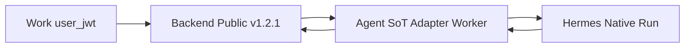

# RM-16 Hermes Provider Conformance Recovery 实施计划

Canonical 落盘路径：[`.cursor/plans/rm-16_hermes-provider-conformance-recovery.plan.md`](rm-16_hermes-provider-conformance-recovery.plan.md)

`commit_policy: post_review`。下游只走 `smc-plan-delivery`。WRITE_OWNER 落在既有 Native Adapter、`approve_run` / `cancel_run` / Worker recover，以及一条新的 live 套件 runner。禁止另起第二 Adapter 或 Event Store，禁止恢复 ChatCompletion parser，禁止改写 v1.2.1，禁止 Backend 成为员工 Native 客户端。

批准事实只取 `grounded_commit` `1319cf1fd5a56613ca96b8e026c446d10c9b676c`。A1 增补文档 frontmatter 仍为 `PROPOSED`，记为 Note。范围止于 A1 Phase D PC-01 至 PC-09。

## 前端表现变化

本次改动无本仓库前端表现变化。不改 Portal / Admin 页面、按钮、文案或路由。Work 可观察的差异是既有 v1.2.1 SSE 在真实 Runtime 上的内容质量。

## Approved PRD

[Approved PRD](../../docs_agent/prd-v1.6.14-hermes-provider-conformance-recovery.md)

P0 修正子 PRD（冲突时以本文件为准）：[RM-16 P0 Live Conformance Correction](../../reports/PRD-RM16-P0-Live-Conformance-Correction-v1.6.14-p0.1.md)

禁止创建第二份 RM-16 Plan。T1 生产闭合保留；T2 live 套件在 P0-1～P0-4 落地前不得视为 completed。P0 完成后仍须重新跑正式 PC-01～PC-09 live，不得把 RM-16 标 DONE。

## Scope

- In: 真实 Hermes `>= v2026.8.31` 上 PC-01 至 PC-09 可复跑证据；把 RM-15 live 未闭合的 `/approval` 接受与 cancel 合同终态补上；Worker kill gap 记在既有 Attempt；组合复用 RM-12..15 runner；RM-02 Revalidation 证据包；live PC-12 隔离扫描。
- Out: PC-10 至 PC-14 结项；RM-10 全量指标仓；改写 v1.2.1；Backend 员工 Native 客户端；ChatCompletion parser；拆除 HermesTaskWorker；上游 `tool_call_id` PR；Work 前端；MCP/Knowledge 审批；合并 RM-13 至 RM-16；把 RM-02 代码重做一遍。
- Production Owner inherited from PRD: Agent Hermes Adapter + Backend Skill Run API（C04）；Agent Run 域 + Adapter + Backend Skill Run API（C05）；Agent Worker + Adapter（C06）；Acceptance tools + Adapter（C02, C03, C07, C08, C09, C10, C17）；Backend Skill Run API 回归（C18）；KEEP Native/SoT/Coalescer/合同（C01, C11–C16）。

Plan 级冻结（P0 子 PRD 冲突时以 P0 为准）:

- 复用 `run_rm13_live_native.py` / `run_rm14_live_semantic.py` / `run_rm15_live_control.py` 的环境、`user_jwt`、`no_proxy`（含 `192.168.0.0/16`）。审批驻留工具显式 `RM15_TOOL_NAME=hermes_marketing__park-waiting-approval`，**仅 PC-03 / PC-04**。
- PC-01～PC-08 的 Runtime 事实源是该 Run 的 Snapshot `credential_lease_ref` + Backend mint，禁止 `RM13_HERMES_BASE_URL` / 写死 29401 作为路由。
- PC-03 出口必须观察到 Native `POST /v1/runs/{id}/approval` 被 Hermes 接受，不得以 HTTP 非 500 代替。
- PC-04 出口必须出现合同终态事件，不得停在 `CANCELLING`。
- PC-07 必须先在 Agent SoT 观察到 `internal.runtime.trace`（真实 subagent），再证明 Public 无泄漏。
- PC-05 / PC-08 必须使用 `RM16_RUNNING_TOOL_NAME` 稳定 RUNNING fixture，禁止 park 工具。
- PC-09 只有 Backend 绑定的真实旧 Runtime 才能 PASS；`_OldRuntimeStub` / probe-only stub 禁止正式 PASS。缺旧 Runtime 则 BLOCKED。
- Worker gap 写入既有 Attempt / 可被 Public 剥离的内部事件，不新建 Metrics Store。

## Grounding Evidence Ledger

| Change ID | Target | Baseline State | Symbol / Entry Resolution | Caller / Callee Evidence | Existing Reuse Search | Result |
|---|---|---|---|---|---|---|
| C04 | `nodeskclaw-agent/app/services/hermes_engine.py#respond_runtime_approval` | EXISTS at `1319cf1f`; live `/approval` unproven | 函数会 POST `/approval`；RM-15 live `approve_http=400` 且 `native_paths_observed` 无 `/approval` | `run_service.py#approve_run` 把 Hermes 错误 `ValueError` 成 Agent 400 | 不新建审批服务；先取 live 400 body，再最小修补既有 POST body/错误映射 | PASS |
| C05 | `nodeskclaw-agent/app/services/run_service.py#cancel_run` | EXISTS; live terminal PARTIAL | RM-15 live 观察到 `/stop`；`cancel_http=500`；`cancel_public_status=CANCELLING` | Public `runs.py#cancel_run` 对 Agent 5xx `raise_for_status` | 同一 cancel writer；补终态聚合与非 500 映射 | PASS |
| C06 | `nodeskclaw-agent/app/services/worker.py#RunWorker#_recover_stale_runs` | fencing EXISTS; gap MISSING | `next_status_after_stale_lease` 已禁止 waiting/interrupted `QUEUED`；Normalizer `observability_gaps` 只覆盖 unpaired tool | `_recover_stale_runs` → `set_status` / 新 claim | gap 记在 Attempt，不新建表或 RM-10 Store | PASS |
| C02 | `nodeskclaw-agent/app/services/assistant_delta_coalescer.py#AssistantDeltaCoalescer` | EXISTS; live PC-01 MISSING | RM-14 live `assistant_message_count=0` | Adapter 已接入 Coalescer | 不第二套合并器；live 取纯文本 | PASS |
| C03 | `nodeskclaw-agent/app/services/native_event_normalizer.py#normalize_native_event` | EXISTS; live PC-02 MISSING | 双轨 `call_id` 已有 | Public `runs.py` 投影 `tool.call` | 不改合同；live 真 Tool | PASS |
| C07 | same Coalescer | EXISTS; live long Chinese MISSING | 80 字 / 100ms 阈值已落地 | 同 C02 | live 长中文，不改阈值除非丢失/重复 | PASS |
| C08 | `native_event_normalizer.py` INTERNAL_TYPES | EXISTS; live PC-07 MISSING | `subagent.*` Internal Trace 单测在 | Public 投影无 child run | live 观察隔离 | PASS |
| C09 | `hermes_engine.py#_terminal_from_status` | EXISTS unit; live Hermes restart MISSING | `interrupted` → `RUNTIME_INTERRUPTED` | Worker recover 不自动续跑 | live 重启 Runtime | PASS |
| C10 | `hermes_engine.py#execute_hermes_run` version probe | EXISTS unit; live old runtime MISSING | `RUNTIME_VERSION_UNSUPPORTED`；无 ChatCompletion parser | Capability Probe 失败关闭 | live 或 probe-only 旧版本桩 | PASS |
| C17 | Roadmap Revalidation Link | RM-02 BACKLOG | Event Store 保留；Conformance 出口失效 | 本项证据包 | 不重写 RM-02 实现 | PASS |
| C18 | PC-12 projection tests | EXISTS | RM-12/14/15 回归测试在 | live 扫描公共面 | 不重开 RM-12 Item | PASS |

## Requirement Coverage Ledger

| Requirement | Source | Obligation | Classification | Change IDs | Todo | Verification IDs | Evidence Class | Blocking |
|---|---|---|---|---|---|---|---|---|
| AC-01 | AC | 真实 Hermes 纯文本 Run 的 Public 文本完整；assistant.message 条数显著少于 provider token；无虚构 tool.call / approval.requested；无 reasoning.summary。 | BEHAVIOR | C02 | T2 | V01 | REAL_PROCESS | yes |
| AC-02 | AC | 真实 Tool Run 出现 Public tool.call started 与 completed/failed，同一 call_id 关联；Work SSE 可观察。 | BEHAVIOR | C03 | T2 | V02 | REAL_PROCESS | yes |
| AC-03 | AC | 真实审批驻留后，Public 批准到达 Hermes /approval 且被接受（Native 证据含该路径）；Hermes 成功不单独改 Public terminal。 | LIFECYCLE | C04 | T1 | V03 | REAL_PROCESS | yes |
| AC-04 | AC | Public 拒绝到达 Hermes /approval 且被接受；客户端 session/always 仍被拒绝。 | SECURITY | C04 | T1 | V04 | REAL_PROCESS | yes |
| AC-05 | AC | 运行中 cancel 调用 Hermes /stop，随后出现合同终态 CANCELLED 或等价失败事件，而不是只停在 CANCELLING；stop 404 走 reconciliation。 | LIFECYCLE | C05 | T1 | V05 | REAL_PROCESS | yes |
| AC-06 | AC | Runtime 执行中 kill/restart NodeSKClaw Worker：旧 Attempt fencing 生效、GET status reconcile、无重复 Public terminal、Attempt 上可查询 gap 记录。 | LIFECYCLE | C06 | T1 | V06 | FAULT_INJECTION | yes |
| AC-07 | AC | 长中文输出 Event 数量受 coalescing 控制，最终文本无丢失无重复且顺序正确。 | BEHAVIOR | C07 | T2 | V07 | REAL_PROCESS | yes |
| AC-08 | AC | Hermes subagent 必须先在 Agent Internal 留下 `internal.runtime.trace`，再证明不产生 Public Child Run，敏感字段不进 Public，Runtime terminal 仍落在当前 Attempt。 | SECURITY | C08; C21 | T2; P0-3 | V08 | REAL_PROCESS | yes |
| AC-09 | AC | Hermes Runtime 重启得到 interrupted → Public/Agent FAILED + RUNTIME_INTERRUPTED，无自动新 Attempt；允许用户新提示词复用同一 runtime_session_id（该字段不进 Public）。 | LIFECYCLE | C09 | T2 | V09 | FAULT_INJECTION | yes |
| AC-10 | AC | 指向低于 v2026.8.31 的 **Backend-bound 真实旧 Runtime** 时 Capability Probe 失败关闭 RUNTIME_VERSION_UNSUPPORTED，生产路径无 ChatCompletion；stub 不得 PASS。 | NEGATIVE | C10; C20 | T2; P0-2 | V10 | REAL_PROCESS | yes |
| AC-11 | AC | 不新建 Adapter、Event Store、Worker 状态机或 Coalescer。 | SCOPE | C01; C11; C12 | - | V11 | DIFF_SCOPE | yes |
| AC-12 | AC | contracts/skill-run/v1.2.1/ 零修改。 | CONTRACT | C13 | - | V12 | CONTRACT_RELEASE | yes |
| AC-13 | AC | 不恢复 ChatCompletion parser；Backend 不成为员工 Native /v1/runs 客户端。 | SCOPE | C14; C15 | - | V13 | DIFF_SCOPE | yes |
| AC-14 | AC | 出口证据复用既有 RM-12..15 runner 组合，且记录 hermes_runtime_version 与 auth_type=user_jwt。 | EVIDENCE | C16 | T2 | V14 | REAL_PROCESS | yes |
| AC-15 | AC | PC-01 至 PC-09 证据包可被 RM-02 Revalidation Link 引用；mock-only 不得关闭本项或 RM-02。 | EVIDENCE | C17 | T2 | V15 | DOCUMENT_SEMANTIC | yes |
| AC-16 | AC | live 公共面扫描不出现 HermesTask 禁止字段或 /api/v1/hermes/tasks/。 | SECURITY | C18 | T2 | V16 | REAL_PROCESS | yes |
| DOD-01 | DOD | PC-01 至 PC-09 均有真实 Hermes 可复跑证据；C04/C05 不得以 HTTP 非 500 或 CANCELLING 中间态代替出口。 | EVIDENCE | C02; C03; C04; C05; C06; C07; C08; C09; C10 | T1; T2 | V01; V02; V03; V04; V05; V06; V07; V08; V09; V10 | REAL_PROCESS | yes |
| DOD-02 | DOD | Backend 仍不直连员工 Native Run；runtime_run_id / runtime_session_id 不进 Public。 | SCOPE | C15 | T1 | V13; V16 | DIFF_SCOPE | yes |
| DOD-03 | DOD | v1.2.1 未被改写；ChatCompletion parser 未恢复；未新建第二 Adapter / Event Store。 | CONTRACT | C12; C13; C14 | - | V11; V12; V13 | CONTRACT_RELEASE | yes |
| DOD-04 | DOD | RM-15 已 DONE 且本项 Review / Verification PASS，真实 implementation commit 与验证证据写入 Roadmap 后，RM-16 才可标记 DONE。RM-02 状态变更是独立 Roadmap 更新。 | RELEASE | C17 | T2 | V15; V17 | DOCUMENT_SEMANTIC | yes |

## Lifecycle Closure Matrix

| Journey | Requirements | Trigger | Nonterminal State | Success Writer | Failure / Cancel Writer | Evidence IDs |
|---|---|---|---|---|---|---|
| Approval accept | AC-03; AC-04 | Public approve/deny after park | WAITING_APPROVAL; Binding unchanged | Adapter POST `/approval` accepted; later Runtime events; aggregator terminal | `session`/`always` 4xx; stale generation no POST; Hermes 4xx mapped without Runtime id | V03; V04 |
| Cancel terminal | AC-05 | Public cancel while running or parked | CANCELLING then Hermes stopping | `/stop` then aggregator contract terminal | stop 404 → GET reconcile then contract terminal; Public not left on CANCELLING | V05 |
| Worker recovery | AC-06 | kill/restart Worker mid Native run | stale lease; old generation fenced | GET status reconcile; single Public terminal; Attempt gap record | old generation commands have no Runtime side effect | V06 |
| Runtime interrupted | AC-09 | Hermes restart before terminal | GET status `interrupted` | FAILED + `RUNTIME_INTERRUPTED`; no new Attempt | user new prompt may reuse `runtime_session_id` | V09 |

## Contract / Data Flow Closure Matrix

| Flow | Requirements | Producer | Transport / Schema | Consumer | Required Fields | Validation Owner | Failure Mapping | Retry / Idempotency Identity | Evidence IDs |
|---|---|---|---|---|---|---|---|---|---|
| Public SSE quality | AC-01; AC-02; AC-07; AC-08 | Agent SoT | frozen v1.2.1 SSE | Work | `assistant.message.text`; `tool.call` call_id+status; no child run | Backend projection | no reasoning.summary; no subagent public | event_seq | V01; V02; V07; V08 |
| Approval southbound | AC-03; AC-04; DOD-02 | Work decision | Public two-choice → Agent → Hermes POST `/approval` | Hermes Native | Binding `runtime_run_id`; `choice=once` or `deny` | Adapter fencing + Public two-choice | 400/409/404 → Public 4xx no Runtime id; success does not write terminal | Attempt + generation | V03; V04 |
| Cancel southbound | AC-05 | Work cancel | Public cancel → Agent CANCELLING → POST `/stop` | Hermes Native then aggregator | Binding `runtime_run_id` | Adapter stop 404 reconcile | contract terminal; Public HTTP not 500 as exit | generation fence | V05 |
| Version floor | AC-10 | Capability Probe | GET `/v1/capabilities` and/or `/health` | Adapter fail-closed | runtime version | Adapter | `RUNTIME_VERSION_UNSUPPORTED`; no ChatCompletion | no retry fallback | V10 |
| RM-02 package | AC-15; DOD-04 | PC-01..09 evidence | Revalidation Link, not Depends On | Roadmap RM-02 | hermes_runtime_version; auth_type=user_jwt | T2 runner summary | mock-only fails | independent Roadmap update | V15; V17 |

## Verification Ledger

| Verification ID | Level | Entry Point / Command | Oracle | Negative / Regression | Evidence Policy | Environment | Blocking |
|---|---|---|---|---|---|---|---|
| V01 | INTEGRATION | `python tools/acceptance/run_rm16_live_conformance.py --scenario pc01` | Public text complete; assistant.message count << tokens; no fake tool/approval; no reasoning.summary | mock choices close PC-01 fails | LOCAL_TRANSIENT | Hermes Runtime v2026.8.31 or newer | yes |
| V02 | INTEGRATION | `python tools/acceptance/run_rm16_live_conformance.py --scenario pc02` | Public tool.call started and completed/failed share call_id | Catalog requiresApproval instead of real tool fails | LOCAL_TRANSIENT | Hermes Runtime v2026.8.31 or newer | yes |
| V03 | INTEGRATION | `python tools/acceptance/run_rm16_live_conformance.py --scenario pc03-approve` | Native `/approval` observed and accepted after approve; terminal still aggregator | HTTP 400/not-500 counted as PASS fails | LOCAL_TRANSIENT | Hermes Runtime v2026.8.31 or newer | yes |
| V04 | INTEGRATION | `python tools/acceptance/run_rm16_live_conformance.py --scenario pc03-deny` | Native `/approval` deny accepted; session/always rejected | client session/always forwarded fails | LOCAL_TRANSIENT | Hermes Runtime v2026.8.31 or newer | yes |
| V05 | INTEGRATION | `python tools/acceptance/run_rm16_live_conformance.py --scenario pc04` | `/stop` then contract terminal CANCELLED or failed; not stuck CANCELLING | HTTP 500 or CANCELLING-only PASS fails | LOCAL_TRANSIENT | Hermes Runtime v2026.8.31 or newer | yes |
| V06 | INTEGRATION | `python tools/acceptance/run_rm16_live_conformance.py --scenario pc05` | Worker kill fences old Attempt; GET reconcile; one Public terminal; queryable gap | duplicate terminal or auto new Hermes Run fails | LOCAL_TRANSIENT | Hermes Runtime v2026.8.31 or newer | yes |
| V07 | INTEGRATION | `python tools/acceptance/run_rm16_live_conformance.py --scenario pc06` | long Chinese coalesced; no lost/dup/out-of-order text | one-or-two-char events PASS fails | LOCAL_TRANSIENT | Hermes Runtime v2026.8.31 or newer | yes |
| V08 | INTEGRATION | `python tools/acceptance/run_rm16_live_conformance.py --scenario pc07` | Agent SoT `internal.runtime.trace` + Public 无 child/subagent 泄漏 + runtime_binding_verified | 仅 Public 无泄漏或无真实 delegation 不得 PASS | LOCAL_TRANSIENT | Hermes Runtime v2026.8.31 or newer | yes |
| V09 | INTEGRATION | `python tools/acceptance/run_rm16_live_conformance.py --scenario pc08` | stable RUNNING fixture → bound instance restart → interrupted → FAILED RUNTIME_INTERRUPTED; no auto Attempt | recover QUEUED new Hermes Run or park-tool fixture fails | LOCAL_TRANSIENT | Hermes Runtime v2026.8.31 or newer | yes |
| V10 | INTEGRATION | `python tools/acceptance/run_rm16_live_conformance.py --scenario pc09` | real_bound_old_runtime + runtime_binding_verified + RUNTIME_VERSION_UNSUPPORTED; no ChatCompletion | stub / probe-only PASS fails | LOCAL_TRANSIENT | Hermes Runtime older than v2026.8.31 bound by Backend | yes |
| V11 | UNIT | `git diff --name-only 1319cf1fd5a56613ca96b8e026c446d10c9b676c` | no new Adapter/Event Store/Worker state machine/Coalescer module | second hermes engine or event store file fails | REPO_SUMMARY | local | yes |
| V12 | UNIT | `git diff --exit-code 1319cf1fd5a56613ca96b8e026c446d10c9b676c -- contracts/skill-run/v1.2.1` | zero contract diff | schema edit fails | REPO_SUMMARY | local | yes |
| V13 | UNIT | `uv --directory nodeskclaw-agent run pytest tests/test_hermes_engine.py -q -k chat` plus Backend diff | parser stays removed; Backend has no employee Native `/v1/runs` client | restoring `_emit_semantic_from_choice` or Backend Native employee client fails | REPO_SUMMARY | local | yes |
| V14 | INTEGRATION | `python tools/acceptance/run_rm16_live_conformance.py --preflight-env` | reuses RM-12..15 env; records hermes_runtime_version and auth_type=user_jwt | replacing those runners with mock OpenAI fails | LOCAL_TRANSIENT | Hermes Runtime v2026.8.31 or newer | yes |
| V15 | UNIT | runner summary plus `docs_agent/evidence/RM-16-evidence.json` after delivery | PC-01..09 package referenceable by RM-02 Revalidation Link | mock-only package fails | REPO_SUMMARY | local | yes |
| V16 | INTEGRATION | `python tools/acceptance/run_rm16_live_conformance.py --scenario pc12-scan` | no HermesTask forbidden keys or `/api/v1/hermes/tasks/` | mixed public plane fails | LOCAL_TRANSIENT | Hermes Runtime v2026.8.31 or newer | yes |
| V17 | UNIT | Roadmap RM-16 vs RM-02 rows | RM-16 DONE does not silently rewrite RM-02 status in the same commit | mixed Roadmap+implementation commit fails | REPO_SUMMARY | local | yes |

## Immediate Read

- `nodeskclaw-agent/app/services/hermes_engine.py#respond_runtime_approval`
- `nodeskclaw-agent/app/services/run_service.py#approve_run`
- `nodeskclaw-agent/app/services/run_service.py#cancel_run`
- `nodeskclaw-agent/app/services/worker.py#RunWorker#_recover_stale_runs`
- `nodeskclaw-backend/app/api/runs.py#cancel_run`
- `tools/acceptance/run_rm15_live_control.py#run_live`
- `tools/acceptance/run_rm13_live_native.py#run_live`

## Triggered Read

- If live approve/deny still HTTP 400: capture Hermes/Agent body then `hermes_engine.py#respond_runtime_approval`
- If cancel still HTTP 500 or stuck CANCELLING: `run_service.py#cancel_run` and `runs.py#_handle_agent_error_response`
- If Worker kill duplicates terminal: `worker.py#next_status_after_stale_lease`
- If long Chinese still one-char events: `assistant_delta_coalescer.py#AssistantDeltaCoalescer`
- If PC-09 has no old Runtime: BLOCKED `RM16_OLD_RUNTIME_UNAVAILABLE`; never stub PASS
- Otherwise: do not read

## Change Matrix

| Change ID | File / Symbol | Kind | Action | Existing Owner | Todo Owner | Target State | PRD Capability | New File? |
|---|---|---|---|---|---|---|---|---|
| C01 | `nodeskclaw-agent/app/services/hermes_engine.py#execute_hermes_run` | PROD | MODIFY | Agent Hermes Adapter | P0-3 | ingest 后 drain `internal.runtime.trace` | Native Bridge / Binding / Event SoT | no |
| C02 | `tools/acceptance/run_rm16_live_conformance.py` | TEST | ADD | Acceptance tools | T2 | PC-01 live plain text | PC-01 Plain Response live | yes |
| C03 | `tools/acceptance/run_rm16_live_conformance.py` | TEST | ADD | Acceptance tools | T2 | PC-02 live tool.call | PC-02 Tool Run live | yes |
| C04 | `nodeskclaw-agent/app/services/hermes_engine.py#respond_runtime_approval` | PROD | MODIFY | Agent Hermes Adapter | T1 | Hermes accepts once/deny | PC-03 Approval southbound live | no |
| C04 | `nodeskclaw-agent/app/services/run_service.py#approve_run` | PROD | MODIFY | Agent Run 域 | T1 | bound approve/deny reach accepted `/approval` | PC-03 Approval southbound live | no |
| C04 | `nodeskclaw-agent/tests/test_run_service.py` | TEST | MODIFY | Agent Run tests | T1 | accept-path oracle | PC-03 Approval southbound live | no |
| C05 | `nodeskclaw-agent/app/services/run_service.py#cancel_run` | PROD | MODIFY | Agent Run 域 | T1 | `/stop` then contract terminal | PC-04 Cancel terminal live | no |
| C05 | `nodeskclaw-backend/app/api/runs.py#cancel_run` | PROD | MODIFY | Skill Run API | T1 | Public cancel not left as HTTP 500 | PC-04 Cancel terminal live | no |
| C05 | `nodeskclaw-backend/tests/hermes_skill/test_employee_runs_api.py` | TEST | MODIFY | Skill Run API tests | T1 | cancel not HTTP 500; terminal observable | PC-04 Cancel terminal live | no |
| C06 | `nodeskclaw-agent/app/services/worker.py#RunWorker#_recover_stale_runs` | PROD | MODIFY | Agent Worker | T1 | queryable Worker restart gap | PC-05 Worker restart live + gap | no |
| C06 | `nodeskclaw-agent/tests/test_worker.py` | TEST | MODIFY | Agent Worker tests | T1 | gap + fencing oracle | PC-05 Worker restart live + gap | no |
| C07 | `tools/acceptance/run_rm16_live_conformance.py` | TEST | ADD | Acceptance tools | T2 | PC-06 long Chinese live | PC-06 Long Chinese coalescing live | yes |
| C08 | `tools/acceptance/run_rm16_live_conformance.py` | TEST | MODIFY | Acceptance tools | T2; P0-3 | PC-07 真 delegation + Public 隔离 | PC-07 Delegation isolation live | yes |
| C09 | `tools/acceptance/run_rm16_live_conformance.py` | TEST | MODIFY | Acceptance tools | T2; P0-4 | PC-08 interrupted live on stable RUNNING | PC-08 Hermes restart interrupted live | yes |
| C10 | `tools/acceptance/run_rm16_live_conformance.py` | TEST | MODIFY | Acceptance tools | T2; P0-2 | PC-09 仅 real_bound_old_runtime | PC-09 Version floor live | yes |
| C11 | `nodeskclaw-agent/app/services/worker.py#next_status_after_stale_lease` | PROD | KEEP | Agent Worker | - | no auto QUEUED waiting/interrupted | Worker stale-lease fencing | no |
| C12 | `nodeskclaw-agent/app/services/assistant_delta_coalescer.py#AssistantDeltaCoalescer` | PROD | KEEP | Agent Hermes Adapter | - | existing coalescer only | Coalescer / Normalizer / dual-track call_id | no |
| C13 | `contracts/skill-run/v1.2.1/` | PROD | KEEP | Contract Package | - | bytes unchanged | Public v1.2.1 | no |
| C14 | `nodeskclaw-agent/tests/test_hermes_engine.py#test_execute_hermes_never_calls_chat_completions` | TEST | KEEP | Agent Adapter tests | - | parser stays removed | ChatCompletion Event Source | no |
| C15 | `nodeskclaw-backend/app/services/hermes_external/hermes_api_server_client.py` | PROD | KEEP | Backend Expert path | - | not employee Native client | Backend 非员工 Native 客户端 | no |
| C16 | `tools/acceptance/run_rm13_live_native.py#run_live` | TEST | KEEP | Acceptance tools | - | reused by T2 | 既有 RM-12..15 live runners | no |
| C17 | `tools/acceptance/run_rm16_live_conformance.py` | TEST | ADD | Acceptance tools | T2 | RM-02 revalidation package | RM-02 Provider Conformance 再验证包 | yes |
| C18 | `nodeskclaw-backend/tests/hermes_skill/test_pc12_pc13_projection_regression.py` | TEST | KEEP | Skill Run API regression | - | unit PC-12 remains | PC-12 公共面隔离回归 | no |
| C18 | `tools/acceptance/run_rm16_live_conformance.py` | TEST | ADD | Acceptance tools | T2 | live PC-12 public-face scan | PC-12 公共面隔离回归 | yes |
| C19 | `tools/acceptance/run_rm16_live_conformance.py#resolve_bound_runtime` | TEST | ADD | Acceptance tools | P0-1 | Run-Bound HermesAgentInstance | P0 Run-bound Runtime | no |
| C20 | `tools/acceptance/run_rm16_live_conformance.py#run_pc09` | TEST | MODIFY | Acceptance tools | P0-2 | stub 禁止正式 PASS | P0 PC-09 stub ban | no |
| C21 | `nodeskclaw-agent/app/services/native_event_normalizer.py#drain_internal_traces` | PROD | MODIFY | Agent Hermes Adapter | P0-3 | 最小 internal.runtime.trace | P0 PC-07 delegation fact | no |
| C22 | `tools/acceptance/run_rm16_live_conformance.py#start_stable_running_run` | TEST | ADD | Acceptance tools | P0-4 | PC-05/08 stable RUNNING | P0 stable RUNNING fixture | no |

## Implementation Decisions

| Change ID | Strategy | Root-Cause / Reuse Evidence | Why This Is Minimum |
|---|---|---|---|
| C04 | MODIFY_EXISTING | RM-15 live 400 and missing `/approval` path; `respond_runtime_approval` already exists | Patch the existing POST/error path until Hermes accepts; no second approval service |
| C05 | MODIFY_EXISTING | `/stop` observed; Public stuck CANCELLING and HTTP 500 | Same cancel writer plus Public 5xx mapping; aggregator already owns terminal |
| C06 | MODIFY_EXISTING | fencing exists; gap only for unpaired tools | Record gap on existing Attempt during recover; no RM-10 Store |
| C02 | MINIMAL_NEW | Coalescer EXISTS; live plain text missing | One live runner scenario; do not replace Coalescer |
| C03 | MINIMAL_NEW | Normalizer EXISTS; live tool missing | Same runner; dual-track call_id stays |
| C07 | MINIMAL_NEW | same Coalescer; RM-14 live had zero assistant.message | Same runner long-Chinese scenario |
| C08 | MINIMAL_NEW | Internal Trace EXISTS；须持久化最小 subagent marker | drain_internal_traces；不新增 Event Store |
| C09 | MINIMAL_NEW | interrupted mapping EXISTS | Same runner Hermes restart on stable RUNNING fixture |
| C10 | MINIMAL_NEW | version probe EXISTS | Same runner old-runtime Skill；缺则 BLOCKED，禁止 stub PASS |
| C17 | MINIMAL_NEW | RM-02 needs revalidation evidence, not a new Store | Runner summary package; independent Roadmap update later |
| C18 | REUSE_EXISTING | PC-12 tests exist | Live scan in the new runner; keep unit tests |

## Write Ownership Ledger

| Todo | Owns Changes | Writes | Reads | Depends On | Parallel Safe |
|---|---|---|---|---|---|
| T1 | C04; C05; C06 | `nodeskclaw-agent/app/services/hermes_engine.py#respond_runtime_approval` `nodeskclaw-agent/app/services/run_service.py#approve_run` `nodeskclaw-agent/tests/test_run_service.py` `nodeskclaw-agent/app/services/run_service.py#cancel_run` `nodeskclaw-backend/app/api/runs.py#cancel_run` `nodeskclaw-backend/tests/hermes_skill/test_employee_runs_api.py` `nodeskclaw-agent/app/services/worker.py#RunWorker#_recover_stale_runs` `nodeskclaw-agent/tests/test_worker.py` | `nodeskclaw-agent/app/services/hermes_engine.py#_stop_runtime` `nodeskclaw-agent/app/services/worker.py#next_status_after_stale_lease` `nodeskclaw-agent/app/services/run_service.py#aggregate_run_terminal` `nodeskclaw-backend/app/api/runs.py#_handle_agent_error_response` `tools/acceptance/run_rm15_live_control.py#run_live` | - | no |
| T2 | C02; C03; C07; C08; C09; C10; C17; C18 | `tools/acceptance/run_rm16_live_conformance.py` | `tools/acceptance/run_rm13_live_native.py#run_live` `tools/acceptance/run_rm14_live_semantic.py#run_live` `tools/acceptance/run_rm15_live_control.py#run_live` `nodeskclaw-agent/app/services/assistant_delta_coalescer.py#AssistantDeltaCoalescer` `nodeskclaw-agent/app/services/native_event_normalizer.py#normalize_native_event` `nodeskclaw-backend/tests/hermes_skill/test_pc12_pc13_projection_regression.py` | T1; P0-1; P0-2; P0-3; P0-4 | no |
| P0-1 | C19 | `tools/acceptance/run_rm16_live_conformance.py#resolve_bound_runtime` | `nodeskclaw-backend/app/api/internal_skill_agent.py#mint_credential_lease` `nodeskclaw-agent/app/api/internal_runs.py#get_internal_run` | T1 | no |
| P0-2 | C20 | `tools/acceptance/run_rm16_live_conformance.py#run_pc09` | `tools/acceptance/run_rm16_live_conformance.py#resolve_bound_runtime` | P0-1 | no |
| P0-3 | C01; C21 | `nodeskclaw-agent/app/services/native_event_normalizer.py#drain_internal_traces` `nodeskclaw-agent/app/services/hermes_engine.py#execute_hermes_run` `nodeskclaw-agent/tests/test_native_event_normalizer.py` `nodeskclaw-agent/tests/test_hermes_engine.py` `nodeskclaw-backend/tests/hermes_skill/test_employee_runs_api.py` | `nodeskclaw-agent/app/services/worker.py#RunWorker` | T1 | no |
| P0-4 | C22 | `tools/acceptance/run_rm16_live_conformance.py#start_stable_running_run` | `tools/acceptance/run_rm16_live_conformance.py#resolve_bound_runtime` | P0-1 | no |

## Integration Hotspots

| File | Owner Todo | Reason |
|---|---|---|
| `nodeskclaw-agent/app/services/hermes_engine.py` | T1 | `/approval` accept path shares Adapter with KEEP Native execute |
| `nodeskclaw-agent/app/services/run_service.py` | T1 | approve and cancel remain the single control writers |
| `nodeskclaw-agent/app/services/worker.py` | T1 | recover gap must not create a second Hermes Run |
| `nodeskclaw-backend/app/api/runs.py` | T1 | Public cancel HTTP mapping |
| `tools/acceptance/run_rm16_live_conformance.py` | T2 | single live suite writer |

## Generated Outputs Ledger

None

## New File Justification

| Change ID | File | Necessity | Owner Impact |
|---|---|---|---|
| C02 | `tools/acceptance/run_rm16_live_conformance.py` | AC-01 requires live plain text; RM-14 live had zero assistant.message | T2 only; production owners unchanged |
| C03 | `tools/acceptance/run_rm16_live_conformance.py` | AC-02 requires live real Tool; same suite file | T2 only |
| C07 | `tools/acceptance/run_rm16_live_conformance.py` | AC-07 requires live long Chinese coalescing | T2 only |
| C08 | `tools/acceptance/run_rm16_live_conformance.py` | AC-08 requires live subagent isolation | T2 only |
| C09 | `tools/acceptance/run_rm16_live_conformance.py` | AC-09 requires live Hermes restart interrupted | T2 only |
| C10 | `tools/acceptance/run_rm16_live_conformance.py` | AC-10 requires live version floor fail-closed | T2 only |
| C17 | `tools/acceptance/run_rm16_live_conformance.py` | AC-15 requires an RM-02 revalidation package from the same suite | T2 only |
| C18 | `tools/acceptance/run_rm16_live_conformance.py` | AC-16 requires live PC-12 public-face scan | T2 only |

## Todo T1 — 闭合审批接受、取消终态与 Worker gap

**Owns Changes**
- C04
- C05
- C06

**Goal**
Public approve/deny is accepted by Hermes `/approval`; Work cancel reaches `/stop` and a contract terminal; Worker restart records a queryable gap on the existing Attempt without a second Adapter.

**Immediate anchors**
- `nodeskclaw-agent/app/services/hermes_engine.py#respond_runtime_approval`
- `nodeskclaw-agent/app/services/run_service.py#approve_run`
- `nodeskclaw-agent/app/services/run_service.py#cancel_run`
- `nodeskclaw-agent/app/services/worker.py#RunWorker#_recover_stale_runs`
- `nodeskclaw-backend/app/api/runs.py#cancel_run`

**Changes**
- Keep RM-15 park, two-choice Public, and fencing. Do not restore ChatCompletion. Do not add a second approval state machine.
- Diagnose live approve/deny HTTP 400, then patch existing `/approval` POST/error mapping until Hermes accepts `once`/`deny`. Native evidence must include `/approval`.
- Bound cancel must leave `CANCELLING` and emit contract terminal after `/stop` or 404 reconcile. Map remaining Agent 5xx so Public cancel is not an exit 500.
- On Worker stale recover, record an observability gap on the existing Attempt; keep `next_status_after_stale_lease` from auto-QUEUING waiting/interrupted runs.

**Stop conditions**
- [ ] Live approve observes accepted Hermes `/approval`
- [ ] Live deny observes accepted Hermes `/approval`; session/always still rejected
- [ ] Live cancel shows contract terminal, not CANCELLING-only
- [ ] Worker recover writes a queryable gap without a new Event Store
- [ ] v1.2.1 untouched; no ChatCompletion parser restore

**Triggered reads**
- If live approve/deny still HTTP 400: capture response body then `respond_runtime_approval`
- If cancel still HTTP 500 or CANCELLING-only: `cancel_run` and `_handle_agent_error_response`
- Otherwise: do not read

## Todo T2 — 组合 PC-01 至 PC-09 live 证据套件

**Owns Changes**
- C02
- C03
- C07
- C08
- C09
- C10
- C17
- C18

**Goal**
One live runner reuses RM-12..15 env and proves PC-01, PC-02, PC-06, PC-07, PC-08, PC-09 plus the T1-closed PC-03/PC-04/PC-05, emitting an RM-02 revalidation package and a PC-12 public-face scan.

**Immediate anchors**
- `tools/acceptance/run_rm13_live_native.py#run_live`
- `tools/acceptance/run_rm14_live_semantic.py#run_live`
- `tools/acceptance/run_rm15_live_control.py#run_live`

**Changes**
- Add `tools/acceptance/run_rm16_live_conformance.py` that imports/reuses existing live helpers; do not replace RM-13/14/15 runners.
- Scenarios: plain text, real tool, long Chinese, subagent isolation, Hermes restart interrupted, version floor, plus approve/deny/cancel/worker-kill after T1.
- Record `hermes_runtime_version` and `auth_type=user_jwt` from the **bound** Runtime. Approval tool stays `hermes_marketing__park-waiting-approval` for PC-03/PC-04 only.
- PC-09 PASS only from `real_bound_old_runtime` + `runtime_binding_verified`; missing old Runtime is BLOCKED, never stub PASS.
- PC-07 requires Agent Internal `internal.runtime.trace`; Public-only isolation cannot PASS.
- PC-05/PC-08 use `RM16_RUNNING_TOOL_NAME` stable RUNNING fixture.
- Emit a package that RM-02 can cite; do not change RM-02 Roadmap status in the implementation commit.

**Stop conditions**
- [ ] PC-01..09 live evidence exists with bound runtime_binding_verified and hermes_runtime_version
- [ ] mock-only cannot close the suite
- [ ] PC-09 stub cannot close rm02-package
- [ ] PC-12 scan clean
- [ ] RM-02 status is not rewritten in the same commit as implementation

**Triggered reads**
- If long Chinese still fragments: `AssistantDeltaCoalescer`
- If PC-09 has no old Runtime: BLOCKED, do not stub
- Otherwise: do not read

## Todo P0-1 — Run-Bound HermesAgentInstance

**Owns Changes**
- C19

**Goal**
Each live scenario resolves Runtime from the Run snapshot credential lease, never from global Hermes URL.

**Immediate anchors**
- `tools/acceptance/run_rm16_live_conformance.py#resolve_bound_runtime`
- `nodeskclaw-backend/app/api/internal_skill_agent.py#mint_credential_lease`

**Changes**
- Add BoundRuntimeContext and fail-closed mint/probe helpers.
- All PC-01..08 Runtime GET/approval/stop observation uses the bound context.

**Stop conditions**
- [x] env_ctx no longer requires RM13_HERMES_BASE_URL as route
- [x] Evidence records runtime_binding_verified, instance id, URL hash, parsed port

## Todo P0-2 — PC-09 stub ban

**Owns Changes**
- C20

**Goal**
Formal PC-09 PASS only from a Backend-bound old Runtime Skill.

**Stop conditions**
- [x] `_OldRuntimeStub` removed from live runner
- [x] missing RM16_OLD_RUNTIME_TOOL_NAME is BLOCKED
- [x] rm02-package rejects non real_bound_old_runtime

## Todo P0-3 — internal.runtime.trace

**Owns Changes**
- C01
- C21

**Goal**
Persist minimal subagent traces to existing run_events and keep them off Public.

**Stop conditions**
- [x] drain_internal_traces yields only runtime_event_type + category
- [x] execute_hermes_run yields traces to Worker
- [x] `_public_run_event(internal.runtime.trace) is None`

## Todo P0-4 — stable RUNNING fixture

**Owns Changes**
- C22

**Goal**
PC-05/PC-08 fault injection only after Public RUNNING and bound Hermes running/alive.

**Stop conditions**
- [x] park tool not used by PC-05/PC-08
- [x] unstable fixture BLOCKED
- [x] PC-08 restart blocked on instance mismatch

## Verification

Run the Verification Ledger entries through `smc-plan-delivery/scripts/evidence.py`.

## Completion Gate

| Exit State | Allowed When | Blocking Evidence |
|---|---|---|
| IMPLEMENTED_AND_PROVEN | all Cursor todos completed; completion audit FRESH PASS; implementation review FRESH PASS; all blocking Verification FRESH PASS; durable Evidence Manifest FRESH | V01; V02; V03; V04; V05; V06; V07; V08; V09; V10; V11; V12; V13; V14; V15; V16; V17 via SMC evidence ledger + durable Evidence Manifest |
| IMPLEMENTED_NOT_PROVEN | implementation exists but proof is pending/stale | pending/stale gate IDs |
| BLOCKED | environment/dependency prevents proof | blocker record |
| RETURN_PRD | approved owner/boundary conflicts | PRD revision request |
