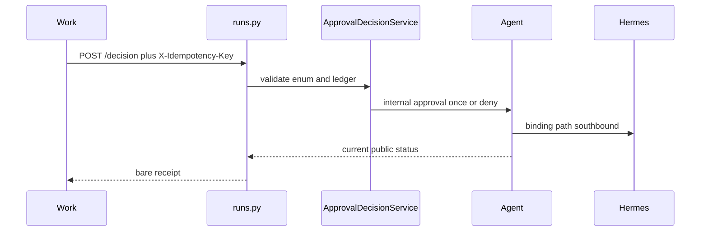

# RM-17 Skill Run v1.3.0 Public Approval Decision 实施计划

Canonical 落盘路径：[`.cursor/plans/rm-17_skill-run-v130-public-approval-decision.plan.md`](rm-17_skill-run-v130-public-approval-decision.plan.md)

`commit_policy: post_review`。下游只走 `smc-plan-delivery`。WRITE_OWNER 落在 Backend Skill Run Public Write 与既有单一 `scripts/contracts.py` 生成链。禁止改写 `contracts/skill-run/v1.2.1/`，禁止第二生成脚本，禁止独立 Idempotency Service，禁止 Agent 在 Hermes binding 路径同步改 Public terminal，禁止并入 RM-09，禁止仓外 Work UI/IPC。

批准事实只取 `grounded_commit` `13a3334a2fa496acf9c01d59a55e2678f1723134`（PRD `0c65d104` 的子孙；Public 审批与生成链白名单与 PRD 描述一致）。

## 前端表现变化

本次改动无前端表现变化。不改 Portal / Admin / Work 页面、按钮、文案或路由。仓外 Work 要等 v1.3.0 Bundle 被导入并 checksum lock 通过后自行 Grounding，不是本仓 DONE。

## Approved PRD

[Approved PRD](../../docs_agent/prd-v1.6.15-skill-run-v130-public-approval-decision.md)

## Scope

- In: Public `approval.requested` 增加 `options=["allow","deny"]`；canonical `POST /api/v1/runs/{run_id}/approvals/{approval_id}/decision` 裸对象决策回执；legacy 审批路径共用同一 service；allow/deny 关闭枚举与稳定错误码；决策幂等 ledger（scope=org+user+run+approval，TTL=86400）；v1.3.0 Bundle 与单一生成链四处白名单/分支；annotated tag 名冻结；REAL_PROCESS `user_jwt` live。
- Out: Work Approval Card UI/IPC；Hermes `session`/`always` 对客户端开放；`approval.resolved`；`expires_at`；Attachment；改写 v1.2.1；第二 contracts 脚本；独立 Idempotency Service；提前 READY RM-09；仓外适配。
- Production Owner inherited from PRD: Backend Skill Run API + Public Write（C02–C06）；Backend Skill Run Contract Package（C07–C09, C11 KEEP）；Agent Run 域 KEEP 南向（C07 只冻结 Public 投影与 Bundle 枚举）；Acceptance Assets（C10）。

Plan 级冻结（不改 PRD 语义）:

- Canonical 成功响应是裸决策回执：`run_id`、`approval_id`、`decision`、`decided_at`、接受时刻公共 `status`。接受不等于推进。Hermes binding 路径同步响应可为 `WAITING_APPROVAL`。
- Canonical 合同错误返回字符串 `error_code`（如 `IDEMPOTENCY_CONFLICT`），不走 Portal `{code:0,data}` 信封。禁止为迁就错误码改全局 `AppException` 整形 `error_code`。
- Legacy `POST .../approvals/{approval_id}` 可保留 Portal 信封，但必须调用同一 service；南向 allow 内部 once、deny 内部 deny。
- 幂等：缺头 `IDEMPOTENCY_KEY_REQUIRED`；同键同决策 200 重放且无二次 Runtime POST；同键异决策 409 `IDEMPOTENCY_CONFLICT`；已决新键 409 `APPROVAL_ALREADY_DECIDED`。
- deny Public terminal 以 live 观测写入 Bundle；Grounding 只把本地无 binding 路径记为 `FAILED`，禁止写成 `CANCELLED`。
- annotated tag `skill-run-contract-v1.3.0` 打在 implementation commit 上；Execute 阶段只冻结 `tagName`，禁止 `git tag -f`。`check --release` 在 commit+tag 之后由 Delivery 收口。
- V01 证明 RM-17 不改写 v1.2.1：对照 `grounded_commit` `13a3334a2fa496acf9c01d59a55e2678f1723134` 必须 empty diff。禁止为对齐 annotated tag `skill-run-contract-v1.2.1` 的 `generatedAt` / `backendCommit` / `releaseCommit` 改写 v1.2.1（该 tag 在 grounded commit 上已与工作树元数据分叉）。

## Domain Activation Ledger

None

## Grounding Evidence Ledger

| Change ID | Target | Baseline State | Symbol / Entry Resolution | Caller / Callee Evidence | Existing Reuse Search | Result |
|---|---|---|---|---|---|---|
| C02 | `nodeskclaw-backend/app/api/runs.py#_public_run_event` | EXISTS at `13a3334a`; options MISSING | `approval.requested` 只放行 `approval_id` 与 `summary` | `stream_run_events` 调用 `_public_run_event` | 与 `clarify.requested` 的 additive `options` 投影同形；不改 v1.2.1 pydantic 模型 | PASS |
| C03 | `nodeskclaw-backend/app/api/runs.py#approve_run` | EXISTS; canonical `/decision` MISSING | 仅 `POST /{run_id}/approvals/{approval_id}`；成功 `{code:0,data}`；无幂等头 | `_agent_post` `/internal/v1/runs/{id}/approvals/{approval_id}` | 在同一 router 增 `/decision`；成功改走 service 裸回执；不新建第二 router | PASS |
| C04 | `nodeskclaw-backend/app/api/runs.py#approve_run` | EXISTS; duplicated enforcement RISK | 入口内联映射 allow/deny 并直接 `_agent_post` | 测试 `test_approve_run_proxies_json_body_and_exec_headers` | legacy 改为调同一 service；禁止复制 ledger/enum | PASS |
| C05 | `nodeskclaw-backend/app/api/runs.py#approve_run` | EXISTS; closed enum PARTIAL | `session`/`always` 已 4xx；`allow` 映射为内部 `approve` | Agent `normalize_hermes_approval_choice` | Public 关闭为 allow/deny；comment maxLength 500；稳定字符串 error_code | PASS |
| C06 | `nodeskclaw-backend/app/models/idempotency_cache.py#IdempotencyCache` | EXISTS; WRONG SHAPE | `message_id` 去重，非 org+user+run+approval | `tools/call` 走 `HermesTask.idempotency_key` 且 scope 含 `tool_name` | 禁止复用该表与 TaskService；在 Public Write Owner 内 MINIMAL_NEW ledger | PASS |
| C07 | `nodeskclaw-backend/scripts/contracts.py#_generate_skill_run_v121_public_contract` | EXISTS; deny terminal NOT IN PUBLIC BUNDLE | v1.2.1 RELEASE 无 approval decision；Agent 无 binding deny→FAILED | `run_service.py#approve_run` 本地 deny FAILED；binding 不改本地 status | Bundle RELEASE 冻结 live 观测枚举；默认记载本地 FAILED；禁止猜 CANCELLED | PASS |
| C08 | `nodeskclaw-backend/scripts/contracts.py#generate_skill_run_contracts` | EXISTS; 1.3.0 MISSING | `--version` choices 止于 1.2.1；check 列表止于 1.2.1；`_check_skill_run_contracts` 仅 1.2.1 走严格分支；`_validate_skill_run_release` else 硬编码 `v1.0.0/` | `main` argparse 两处；`check_contracts` 默认列表 | 四处扩展同一脚本；禁止第二 generator | PASS |
| C09 | `nodeskclaw-backend/app/schemas/skill_run/constants.py` | EXISTS; V130 tag constant MISSING | 仅到 `SKILL_RUN_TAG_NAME_V121` | v1.2.1 generate 读该常量 | 增加 v1.3.0 版本/tag 常量；Execute 不打 tag | PASS |
| C10 | `tools/acceptance/run_rm15_live_control.py` | EXISTS; public decision contract NOT COVERED | RM-15 live 覆盖驻留与南向；`deny_http` 不是 v1.3.0 合同证明 | `run_rm13_live_native.missing_live_vars`；`scan_public_surface` | 新 runner 复用 RM13 HTTP/JWT/泄漏扫描；必须输出 SMC_ACCEPTANCE_RESULT | PASS |

## Requirement Coverage Ledger

| Requirement | Source | Obligation | Classification | Change IDs | Todo | Verification IDs | Evidence Class | Blocking |
|---|---|---|---|---|---|---|---|---|
| AC-01 | AC | contracts/skill-run/v1.2.1/ 相对 RM-11 发布字节零修改。 | CONTRACT | C01 | - | V01 | CONTRACT_RELEASE | yes |
| AC-02 | AC | 真实 user_jwt 路径 SSE approval.requested payload 含 options=["allow","deny"]，且无 runtime_run_id。 | BEHAVIOR | C02 | T1 | V02; V10 | REAL_PROCESS | yes |
| AC-03 | AC | canonical /decision 返回裸决策回执；无 Portal 信封；matrix 含该方法/路径/幂等头。 | CONTRACT | C03 | T1 | V03; V08 | INTEGRATION | yes |
| AC-04 | AC | legacy approval 路径与 canonical 共用同一 enforcement；无双写副作用分叉。 | BEHAVIOR | C04 | T1 | V04 | UNIT | yes |
| AC-05 | AC | 非法 decision / session/always → 稳定 4xx + errorCode；comment 超长失败关闭。 | SECURITY | C05 | T1 | V05 | UNIT | yes |
| AC-06 | AC | 同键同决策重放 200 且无二次 Runtime 副作用；同键异决策 409 IDEMPOTENCY_CONFLICT；已决新键 409 APPROVAL_ALREADY_DECIDED。 | LIFECYCLE | C06 | T1 | V06 | UNIT | yes |
| AC-07 | AC | allow 后 Run 最终离开 WAITING_APPROVAL（GET 与/或 SSE 可观察）；deny 终态等于 Bundle 冻结枚举（经 live 观测写入，非偏好猜测）。 | LIFECYCLE | C07 | T2 | V10 | REAL_PROCESS | yes |
| AC-08 | AC | generate/check --release 对 1.3.0 PASS；损坏/extra/CRLF/Internal 路径 fail-closed。 | CONTRACT | C08 | T2 | V08 | CONTRACT_RELEASE | yes |
| AC-09 | AC | 存在 annotated tag skill-run-contract-v1.3.0；manifest 与 LF SHA256SUMS 一致；禁止 git tag -f。 | RELEASE | C09 | T2 | V09 | CONTRACT_RELEASE | yes |
| AC-10 | AC | REAL_PROCESS user_jwt live 覆盖 allow/deny/幂等/跨租户/泄漏扫描；证据记录 auth_type=user_jwt。 | EVIDENCE | C10 | T3 | V10 | REAL_PROCESS | yes |
| AC-11 | AC | manifest attachments=unsupported；无 Attachment endpoint 进入本 Bundle 矩阵。 | SCOPE | C11 | - | V08 | CONTRACT_RELEASE | yes |
| AC-12 | AC | Roadmap 上 RM-09 仍 BACKLOG 且 Depends On RM-08；本项未改其依赖。 | SCOPE | C12 | - | V12 | DOCUMENT_SEMANTIC | yes |
| DOD-01 | DOD | AD@1.7.0 APPROVED（已满足） | RELEASE | C01 | - | V13 | DOCUMENT_SEMANTIC | yes |
| DOD-02 | DOD | RM-17 Stage PRD APPROVED | RELEASE | C01 | - | V13 | DOCUMENT_SEMANTIC | yes |
| DOD-03 | DOD | canonical /decision 实现且裸对象回执 | CONTRACT | C03 | T1 | V03 | INTEGRATION | yes |
| DOD-04 | DOD | legacy 路径不复制 enforcement | BEHAVIOR | C04 | T1 | V04 | UNIT | yes |
| DOD-05 | DOD | options descriptor 可观察 | BEHAVIOR | C02 | T1 | V02 | UNIT | yes |
| DOD-06 | DOD | 幂等规则 PASS | LIFECYCLE | C06 | T1 | V06 | UNIT | yes |
| DOD-07 | DOD | 稳定错误码 PASS | SECURITY | C05 | T1 | V05 | UNIT | yes |
| DOD-08 | DOD | deny 终态经 live 冻结进 Bundle | LIFECYCLE | C07 | T2 | V10 | REAL_PROCESS | yes |
| DOD-09 | DOD | v1.2.1 零修改 | CONTRACT | C01 | - | V01 | DIFF_SCOPE | yes |
| DOD-10 | DOD | v1.3.0 Bundle generate 与 release check PASS | CONTRACT | C08 | T2 | V08 | CONTRACT_RELEASE | yes |
| DOD-11 | DOD | annotated tag 创建 | RELEASE | C09 | T2 | V09 | CONTRACT_RELEASE | yes |
| DOD-12 | DOD | REAL_PROCESS user_jwt live PASS 与 evidence manifest | EVIDENCE | C10 | T3 | V10 | REAL_PROCESS | yes |
| DOD-13 | DOD | Roadmap RM-17 在 Review PASS、Verification PASS 与 implementation commit 之后标记 DONE | RELEASE | C12 | - | V12 | DOCUMENT_SEMANTIC | yes |

## Lifecycle Closure Matrix

| Journey | Requirements | Trigger | Nonterminal State | Success Writer | Failure / Cancel Writer | Evidence IDs |
|---|---|---|---|---|---|---|
| Decision accept | AC-03; AC-07; DOD-03 | canonical or legacy POST with valid allow/deny | ledger row inserted; Agent southbound in flight; Public status may remain WAITING_APPROVAL | ApprovalDecisionService writes ledger then Agent; receipt status from GET projection | invalid enum 4xx no southbound; Agent 4xx mapped; no second ledger row | V03; V10 |
| Idempotent replay | AC-06; DOD-06 | same X-Idempotency-Key and same decision within TTL | no new Runtime POST | ledger returns frozen receipt | same key different decision 409 IDEMPOTENCY_CONFLICT; already decided new key 409 APPROVAL_ALREADY_DECIDED | V06; V10 |
| Deny terminal | AC-07; DOD-08 | decision=deny accepted | binding path waits Runtime events; local no-binding FAILED | Agent aggregator writes Public terminal; Bundle RELEASE records observed enum | cancel remains cancel path; do not rewrite deny as CANCELLED | V10 |
| Leave waiting after allow | AC-02; AC-07 | allow accepted then Runtime continues | WAITING_APPROVAL until subsequent events | Agent Event SoT plus GET/SSE | old SSE must not roll status back to waiting | V10 |

## Contract / Data Flow Closure Matrix

| Flow | Requirements | Producer | Transport / Schema | Consumer | Required Fields | Validation Owner | Failure Mapping | Retry / Idempotency Identity | Evidence IDs |
|---|---|---|---|---|---|---|---|---|---|
| Canonical decision | AC-03; AC-05; DOD-03 | Work Bearer user_jwt | POST /api/v1/runs/{run_id}/approvals/{approval_id}/decision; header X-Idempotency-Key; body decision allow or deny | ApprovalDecisionService then Agent Internal | run_id; approval_id; decision; optional comment max 500 | Backend service additionalProperties false | 401/403/404 fail-closed; 4xx string error_code; no runtime_run_id | org_id+user_id+run_id+approval_id plus key; TTL 86400 | V03; V05; V10 |
| Legacy decision | AC-04; DOD-04 | existing Portal caller | POST /api/v1/runs/{run_id}/approvals/{approval_id} | same service | same decision enum | same service | legacy may wrap Portal envelope; no second ledger | same identity | V04 |
| Approval descriptor | AC-02; DOD-05 | Agent Event SoT | SSE GET /api/v1/runs/{run_id}/events | Work | payload.approval_id; summary; options allow deny | `_public_run_event` | drop event if required fields missing; strip runtime_run_id | event_id seq resume | V02; V10 |
| v1.3.0 bundle | AC-08; AC-11; DOD-10 | contracts.py generate | files under contracts/skill-run/v1.3.0/ UTF-8 LF | Work checksum lock | approvalDecision supported; attachments unsupported; wireBreaking false | `_check_skill_run_contracts` 1.3.0 strict branch | extra/CRLF/Internal fail-closed | generate command plus SHA256SUMS | V08 |

## Acceptance Claim Ledger

| Claim ID | Requirement | Observable Fact | Blocking | Prior Evidence | Prior Result | Evidence Action | Invalidation Reason | Verification IDs |
|---|---|---|---|---|---|---|---|---|
| CLM-01 | AC-01 | v1.2.1 目录相对 grounded_commit 13a3334a 无 diff | yes | none | UNKNOWN | NEW_EVIDENCE | - | V01 |
| CLM-02 | AC-02 | live SSE approval.requested 含 options allow deny 且无 runtime_run_id | yes | none | UNKNOWN | NEW_EVIDENCE | - | V02; V10 |
| CLM-03 | AC-03 | canonical /decision 200 体为裸回执且无 code/data 信封 | yes | none | UNKNOWN | NEW_EVIDENCE | - | V03 |
| CLM-04 | AC-04 | legacy 与 canonical 调用同一 service；单测可观察无双 POST | yes | none | UNKNOWN | NEW_EVIDENCE | - | V04 |
| CLM-05 | AC-05 | session/always/非法 decision/超长 comment 返回稳定字符串 error_code | yes | none | UNKNOWN | NEW_EVIDENCE | - | V05 |
| CLM-06 | AC-06 | 重放 200、冲突 409 IDEMPOTENCY_CONFLICT、已决 409 APPROVAL_ALREADY_DECIDED | yes | none | UNKNOWN | NEW_EVIDENCE | - | V06 |
| CLM-07 | AC-07 | allow 后最终离开 WAITING_APPROVAL；deny Public terminal 等于 Bundle 冻结值 | yes | none | UNKNOWN | NEW_EVIDENCE | - | V10 |
| CLM-08 | AC-08 | generate 与 check --family skill-run --version 1.3.0 退出 0 | yes | none | UNKNOWN | NEW_EVIDENCE | - | V08 |
| CLM-09 | AC-09 | manifest.tagName 为 skill-run-contract-v1.3.0 且 SHA256SUMS LF 一致 | yes | none | UNKNOWN | NEW_EVIDENCE | - | V09 |
| CLM-10 | AC-10 | live 证据 auth_type=user_jwt 且 allow/deny/幂等/跨租户/泄漏扫描 PASS | yes | none | UNKNOWN | NEW_EVIDENCE | - | V10 |
| CLM-11 | AC-11 | v1.3.0 manifest attachments=unsupported 且矩阵无 upload | yes | none | UNKNOWN | NEW_EVIDENCE | - | V08 |
| CLM-12 | AC-12 | ROADMAP-SKILL-AGENT-V16 RM-09 仍 BACKLOG 且 Depends On RM-08 | yes | none | UNKNOWN | NEW_EVIDENCE | - | V12 |
| CLM-13 | DOD-01 | AD-SKILL-AGENT-V16 frontmatter status APPROVED version 1.7.0 | yes | none | UNKNOWN | NEW_EVIDENCE | - | V13 |
| CLM-14 | DOD-02 | RM-17 Stage PRD status APPROVED review_verdict PASS | yes | none | UNKNOWN | NEW_EVIDENCE | - | V13 |
| CLM-15 | DOD-03 | canonical 裸回执字段齐全 | yes | none | UNKNOWN | NEW_EVIDENCE | - | V03 |
| CLM-16 | DOD-04 | legacy 不复制 ledger 写入 | yes | none | UNKNOWN | NEW_EVIDENCE | - | V04 |
| CLM-17 | DOD-05 | 单元测试捕获 options 投影 | yes | none | UNKNOWN | NEW_EVIDENCE | - | V02 |
| CLM-18 | DOD-06 | 幂等单测 PASS | yes | none | UNKNOWN | NEW_EVIDENCE | - | V06 |
| CLM-19 | DOD-07 | 稳定错误码单测 PASS | yes | none | UNKNOWN | NEW_EVIDENCE | - | V05 |
| CLM-20 | DOD-08 | live deny terminal 写入 v1.3.0 RELEASE | yes | none | UNKNOWN | NEW_EVIDENCE | - | V10 |
| CLM-21 | DOD-09 | v1.2.1 相对 grounded_commit 无 diff | yes | none | UNKNOWN | NEW_EVIDENCE | - | V01 |
| CLM-22 | DOD-10 | v1.3.0 check PASS | yes | none | UNKNOWN | NEW_EVIDENCE | - | V08 |
| CLM-23 | DOD-11 | tagName 已冻结为 skill-run-contract-v1.3.0 | yes | none | UNKNOWN | NEW_EVIDENCE | - | V09 |
| CLM-24 | DOD-12 | live runner 输出 SMC_ACCEPTANCE_RESULT 全 PASS | yes | none | UNKNOWN | NEW_EVIDENCE | - | V10 |
| CLM-25 | DOD-13 | Roadmap 文件仍可被 v11 validator 解析且含 RM-17 | yes | none | UNKNOWN | NEW_EVIDENCE | - | V12 |

## Live Scenario Matrix

| Scenario ID | Claim IDs | Verification IDs | Subject / Fixture | Required Capabilities | Preconditions | Stimulus | Oracle | Environment ID |
|---|---|---|---|---|---|---|---|---|
| SCN-01 | CLM-02; CLM-07; CLM-10; CLM-20; CLM-24 | V10 | live employee Runtime Skill that can enter WAITING_APPROVAL | user_jwt Public Run API; Hermes Native approval; SSE approval.requested; GET run | --preflight-env PASS; catalog tool reachable | start run; wait approval.requested; POST /decision allow and deny; replay; conflict; cross-tenant | SMC_ACCEPTANCE_RESULT all bound claims PASS; auth_type=user_jwt; no runtime_run_id leak | ENV-01 |

## Live Environment Matrix

| Environment ID | Required Env Vars | Preflight Command | Fault Driver Env | Candidate Mode | Candidate Probe |
|---|---|---|---|---|---|
| ENV-01 | RM13_HERMES_BASE_URL; RM13_HERMES_API_SERVER_KEY; RM13_AGENT_DATABASE_URL; RM13_BACKEND_BASE_URL or RM12_BACKEND_BASE_URL; RM13_USER_JWT or RM12_USER_JWT; RM13_ORG_ID or RM12_ORG_ID; RM13_TOOL_NAME or RM12_TOOL_NAME; RM13_AGENT_BASE_URL or RM12_AGENT_BASE_URL; SKILL_AGENT_INTERNAL_TOKEN | python tools/acceptance/run_rm17_live_approval.py --preflight-env | - | COMMAND | python tools/acceptance/run_rm17_live_approval.py --probe-candidate |

## Verification Ledger

| Verification ID | Claim IDs | Level | Acceptance Mode | Entry Point / Command | Oracle | Negative / Regression | Evidence Policy | Environment | Evidence Action | Blocking |
|---|---|---|---|---|---|---|---|---|---|---|
| V01 | CLM-01; CLM-21 | CONTRACT_RELEASE | LOCAL | git diff --exit-code 13a3334a2fa496acf9c01d59a55e2678f1723134 -- nodeskclaw-backend/contracts/skill-run/v1.2.1 | empty diff vs grounded_commit | any RM-17 v1.2.1 file change fails | REPO_SUMMARY | local git | NEW_EVIDENCE | yes |
| V02 | CLM-02; CLM-17 | UNIT | LOCAL | uv --directory nodeskclaw-backend run pytest tests/hermes_skill/test_employee_runs_api.py -q -k approval | options projected; runtime_run_id absent | payload without options fails | LOCAL_TRANSIENT | local | NEW_EVIDENCE | yes |
| V03 | CLM-03; CLM-15 | INTEGRATION | LOCAL | uv --directory nodeskclaw-backend run pytest tests/hermes_skill/test_employee_runs_api.py -q -k decision | 200 body has run_id approval_id decision decided_at status and no code/data envelope | Portal envelope fails | LOCAL_TRANSIENT | local | NEW_EVIDENCE | yes |
| V04 | CLM-04; CLM-16 | UNIT | LOCAL | uv --directory nodeskclaw-backend run pytest tests/hermes_skill/test_employee_runs_api.py -q -k approve_run | legacy calls same service; one agent POST | duplicated mapping forks fail | LOCAL_TRANSIENT | local | NEW_EVIDENCE | yes |
| V05 | CLM-05; CLM-19 | UNIT | LOCAL | uv --directory nodeskclaw-backend run pytest tests/hermes_skill/test_employee_runs_api.py -q -k approval | session/always/invalid/comment overflow 4xx string error_code | 500 or numeric-only error_code fails | LOCAL_TRANSIENT | local | NEW_EVIDENCE | yes |
| V06 | CLM-06; CLM-18 | UNIT | LOCAL | uv --directory nodeskclaw-backend run pytest tests/hermes_skill/test_employee_runs_api.py -q -k idempotency | replay 200; conflict 409; already decided 409 | second Runtime POST on replay fails | LOCAL_TRANSIENT | local | NEW_EVIDENCE | yes |
| V08 | CLM-08; CLM-11; CLM-22 | CONTRACT_RELEASE | LOCAL | uv --directory nodeskclaw-backend run python scripts/contracts.py check --family skill-run --version 1.3.0 | exit 0; attachments unsupported; decision schemas present | extra/CRLF/Internal fail-closed | LOCAL_TRANSIENT | local | NEW_EVIDENCE | yes |
| V09 | CLM-09; CLM-23 | CONTRACT_RELEASE | LOCAL | uv --directory nodeskclaw-backend run python -c "import json; from pathlib import Path; m=json.loads(Path('contracts/skill-run/v1.3.0/manifest.json').read_text(encoding='utf-8')); assert m['tagName']=='skill-run-contract-v1.3.0'; print('tagName_ok')" | prints tagName_ok | tag -f or wrong tagName fails | LOCAL_TRANSIENT | local | NEW_EVIDENCE | yes |
| V10 | CLM-02; CLM-07; CLM-10; CLM-20; CLM-24 | INTEGRATION | LIVE | python tools/acceptance/run_rm17_live_approval.py | SMC_ACCEPTANCE_RESULT bound claims PASS; auth_type=user_jwt | fixture-only PASS fails; runtime_run_id leak fails | LOCAL_TRANSIENT | ENV-01 | NEW_EVIDENCE | yes |
| V12 | CLM-12; CLM-25 | DOCUMENT_SEMANTIC | LOCAL | python .agents/skills/smc-roadmap/scripts/validate_roadmap_v11.py docs_agent/roadmaps/ROADMAP-SKILL-AGENT-V16.md | validator PASS; RM-09 BACKLOG Depends On RM-08; RM-17 present | RM-09 READY or Depends On dropped fails | REPO_SUMMARY | local | NEW_EVIDENCE | yes |
| V13 | CLM-13; CLM-14 | DOCUMENT_SEMANTIC | LOCAL | python tools/agent-skills/validate_prd.py docs_agent/prd-v1.6.15-skill-run-v130-public-approval-decision.md --require-approved | PRD validation passed | DRAFT or missing approved_at fails | REPO_SUMMARY | local | NEW_EVIDENCE | yes |

## Immediate Read

- `nodeskclaw-backend/app/api/runs.py#_public_run_event`
- `nodeskclaw-backend/app/api/runs.py#approve_run`
- `nodeskclaw-backend/app/models/base.py#BaseModel`
- `nodeskclaw-backend/scripts/contracts.py#generate_skill_run_contracts`
- `nodeskclaw-backend/scripts/contracts.py#_check_skill_run_contracts`
- `nodeskclaw-backend/scripts/contracts.py#_validate_skill_run_release`
- `tools/acceptance/run_rm15_live_control.py`
- `tools/acceptance/run_rm13_live_native.py#missing_live_vars`

## Triggered Read

- If Alembic autogenerate emits unexpected DROP: `nodeskclaw-backend/alembic/env.py` and the generated revision; do not apply DROP of unrelated tables
- If Agent binding deny Public terminal is not FAILED: `nodeskclaw-agent/app/services/run_service.py#approve_run` read-only; do not change Agent in this Plan unless RETURN_PRD
- If exception handler blocks string error_code: `nodeskclaw-backend/app/core/exceptions.py#register_exception_handlers` read-only; canonical path uses JSONResponse instead of changing global ints
- Otherwise: do not read

## Change Matrix

| Change ID | File / Symbol | Kind | Action | Existing Owner | Todo Owner | Target State | PRD Capability | New File? |
|---|---|---|---|---|---|---|---|---|
| C01 | `nodeskclaw-backend/contracts/skill-run/v1.2.1/` | PROD | KEEP | Contract Package | - | bytes frozen | 冻结 v1.2.1 Bundle | no |
| C02 | `nodeskclaw-backend/app/api/runs.py#_public_run_event` | PROD | MODIFY | Skill Run API | T1 | options projected | Approval descriptor options | no |
| C03 | `nodeskclaw-backend/app/api/runs.py#approve_run` | PROD | MODIFY | Skill Run API | T1 | canonical /decision bare receipt | Canonical decision endpoint | no |
| C04 | `nodeskclaw-backend/app/api/runs.py#approve_run` | PROD | MODIFY | Skill Run API | T1 | legacy delegates to service | Legacy shared enforcement | no |
| C05 | `nodeskclaw-backend/app/api/runs.py#approve_run` | PROD | MODIFY | Skill Run API | T1 | closed allow/deny plus string error_code | Decision enum and errors | no |
| C06 | `nodeskclaw-backend/app/models/hermes_skill/skill_run_approval_decision.py` | PROD | ADD | Skill Run Public Write | T1 | ledger with partial unique index | Decision idempotency ledger | yes |
| C06 | `nodeskclaw-backend/app/services/hermes_skill/approval_decision_service.py` | PROD | ADD | Skill Run Public Write | T1 | single enforcement owner | Decision idempotency ledger | yes |
| C06 | `nodeskclaw-backend/app/models/hermes_skill/__init__.py` | PROD | MODIFY | Skill Run Public Write | T1 | export ledger model | Decision idempotency ledger | no |
| C06 | `nodeskclaw-backend/app/models/__init__.py` | PROD | MODIFY | Skill Run Public Write | T1 | register ledger model | Decision idempotency ledger | no |
| C06 | `nodeskclaw-backend/alembic/versions/` | CONFIG | MODIFY | Skill Run Public Write | T1 | autogenerate ledger migration | Decision idempotency ledger | no |
| C06 | `nodeskclaw-backend/tests/hermes_skill/test_employee_runs_api.py` | TEST | MODIFY | Skill Run API tests | T1 | decision/idempotency/options coverage | Decision write tests | no |
| C07 | `nodeskclaw-backend/scripts/contracts.py#_generate_skill_run_v121_public_contract` | PROD | MODIFY | Contract Package | T2 | RELEASE records live deny terminal | Deny terminal freeze | no |
| C08 | `nodeskclaw-backend/scripts/contracts.py#generate_skill_run_contracts` | PROD | MODIFY | Contract Package | T2 | version 1.3.0 generate/check/release | Generator v1.3.0 | no |
| C08 | `nodeskclaw-backend/scripts/contracts.py#_check_skill_run_contracts` | PROD | MODIFY | Contract Package | T2 | 1.3.0 strict checksum branch | Generator v1.3.0 | no |
| C08 | `nodeskclaw-backend/scripts/contracts.py#_validate_skill_run_release` | PROD | MODIFY | Contract Package | T2 | 1.3.0 prefix not v1.0.0 else | Generator v1.3.0 | no |
| C08 | `nodeskclaw-backend/contracts/skill-run/v1.3.0/` | PROD | ADD | Contract Package | T2 | generated public bundle | Generator v1.3.0 | yes |
| C09 | `nodeskclaw-backend/app/schemas/skill_run/constants.py` | PROD | MODIFY | Contract Package | T2 | SKILL_RUN_CONTRACT_VERSION_V130 and tag name | Immutable release tag name | no |
| C09 | `lat.md/architecture/skill-agent.md` | DOC | MODIFY | Architecture wiki | T2 | document v1.3.0 public approval decision | Immutable release tag name | no |
| C10 | `tools/acceptance/run_rm17_live_approval.py` | TEST | ADD | Acceptance Assets | T3 | user_jwt live plus SMC_ACCEPTANCE_RESULT | Live conformance | yes |
| C11 | `nodeskclaw-backend/contracts/skill-run/v1.2.1/manifest.json` | PROD | KEEP | Contract Package | - | attachments unsupported carried to v1.3.0 | Attachment stays unsupported | no |
| C12 | `docs_agent/roadmaps/ROADMAP-SKILL-AGENT-V16.md` | DOC | KEEP | Roadmap | - | RM-09 BACKLOG Depends On RM-08 | RM-09 boundary | no |

## Implementation Decisions

| Change ID | Strategy | Root-Cause / Reuse Evidence | Why This Is Minimum |
|---|---|---|---|
| C02 | MODIFY_EXISTING | `_public_run_event` already additive-projects clarify options; v1.2.1 ApprovalRequestedPayload has no additionalProperties false | One payload field in existing projector; do not fork SSE |
| C03 | MODIFY_EXISTING | GET run already returns bare `_public_run_view`; approve_run is the only Public mutation entry | Add `/decision` beside existing route; reuse `_authorize_run` and `_agent_post` |
| C04 | MODIFY_EXISTING | Current approve_run inlines mapping and POST | Extract once; legacy keeps envelope around service result |
| C05 | MODIFY_EXISTING | session/always already rejected; Public must close to allow/deny | Keep mapping to internal approve/deny; JSONResponse for contract string error_code |
| C06 | MINIMAL_NEW | IdempotencyCache is message_id shaped; HermesTask key scope includes tool_name | New ledger table in same Public Write owner; Partial Unique Index deleted_at IS NULL; Alembic autogenerate |
| C07 | MODIFY_EXISTING | Agent deny local FAILED already exists; Bundle has no decision RELEASE line | Record observed Public terminal in v1.3.0 RELEASE after live; default document FAILED; do not change Agent |
| C08 | MODIFY_EXISTING | Four hardcoded 1.2.1-only branches in one script | Extend choices and branches in place; copy v1.2.1 public set then add decision artifacts |
| C09 | MODIFY_EXISTING | V121 tag constant pattern | Add V130 constants; tag object created after implementation commit |
| C10 | MINIMAL_NEW | RM-15 live does not cover public decision contract or SMC_ACCEPTANCE_RESULT | New runner wrapping RM13 HTTP helpers; no new acceptance service |

## Write Ownership Ledger

| Todo | Owns Changes | Writes | Reads | Depends On | Parallel Safe |
|---|---|---|---|---|---|
| T1 | C02; C03; C04; C05; C06 | `nodeskclaw-backend/app/api/runs.py#_public_run_event`; `nodeskclaw-backend/app/api/runs.py#approve_run`; `nodeskclaw-backend/app/models/hermes_skill/skill_run_approval_decision.py`; `nodeskclaw-backend/app/services/hermes_skill/approval_decision_service.py`; `nodeskclaw-backend/app/models/hermes_skill/__init__.py`; `nodeskclaw-backend/app/models/__init__.py`; `nodeskclaw-backend/alembic/versions/`; `nodeskclaw-backend/tests/hermes_skill/test_employee_runs_api.py` | `nodeskclaw-backend/app/models/base.py`; `nodeskclaw-agent/app/services/run_service.py#approve_run`; `nodeskclaw-backend/app/core/exceptions.py` | - | no |
| T2 | C07; C08; C09 | `nodeskclaw-backend/scripts/contracts.py#_generate_skill_run_v121_public_contract`; `nodeskclaw-backend/scripts/contracts.py#generate_skill_run_contracts`; `nodeskclaw-backend/scripts/contracts.py#_check_skill_run_contracts`; `nodeskclaw-backend/scripts/contracts.py#_validate_skill_run_release`; `nodeskclaw-backend/app/schemas/skill_run/constants.py`; `nodeskclaw-backend/contracts/skill-run/v1.3.0/`; `lat.md/architecture/skill-agent.md` | `nodeskclaw-backend/contracts/skill-run/v1.2.1/` | T1 | no |
| T3 | C10 | `tools/acceptance/run_rm17_live_approval.py` | `tools/acceptance/run_rm13_live_native.py`; `tools/acceptance/run_rm15_live_control.py`; `nodeskclaw-backend/app/api/runs.py#approve_run`; `nodeskclaw-backend/contracts/skill-run/v1.3.0/` | T2 | no |

## Integration Hotspots

| File | Owner Todo | Reason |
|---|---|---|
| nodeskclaw-backend/app/api/runs.py | T1 | Single writer for Public projection and both approval routes |

## Generated Outputs Ledger

| Source Change | Generator Owner | Generated Outputs | Command | Drift Check |
|---|---|---|---|---|
| C06 | T1 | Alembic revision under nodeskclaw-backend/alembic/versions/ | uv --directory nodeskclaw-backend run alembic revision --autogenerate -m "skill run approval decision ledger" | review no unrelated DROP; Partial Unique Index deleted_at IS NULL |
| C08 | T2 | nodeskclaw-backend/contracts/skill-run/v1.3.0/ | uv --directory nodeskclaw-backend run python scripts/contracts.py generate --family skill-run --version 1.3.0 | uv --directory nodeskclaw-backend run python scripts/contracts.py check --family skill-run --version 1.3.0 |

## New File Justification

| Change ID | File | Necessity | Owner Impact |
|---|---|---|---|
| C06 | nodeskclaw-backend/app/models/hermes_skill/skill_run_approval_decision.py | Existing IdempotencyCache and HermesTask keys cannot express org+user+run+approval decision identity | Same Public Write owner; no new service process |
| C06 | nodeskclaw-backend/app/services/hermes_skill/approval_decision_service.py | Dual HTTP routes must share one enforcement without copying ledger into runs.py twice | T1 single writer |
| C08 | nodeskclaw-backend/contracts/skill-run/v1.3.0/ | Generated public bundle cannot live inside frozen v1.2.1 | T2 generator owner; not a second script |
| C10 | tools/acceptance/run_rm17_live_approval.py | RM-15 runner does not emit SMC_ACCEPTANCE_RESULT or cover canonical /decision | Reuses RM13 helpers; no new daemon |

## Todo T1 — Public Approval Decision 写路径

**Owns Changes**
- C02
- C03
- C04
- C05
- C06

**Goal**
员工 `user_jwt` 可对等待中的 Run 提交 allow/deny；canonical 路径返回裸决策回执；legacy 共用 enforcement；幂等与稳定错误码可单测观察。

**Immediate anchors**
- `nodeskclaw-backend/app/api/runs.py#_public_run_event`
- `nodeskclaw-backend/app/api/runs.py#approve_run`
- `nodeskclaw-backend/app/models/base.py#BaseModel`

**Changes**
- `_public_run_event` 为 `approval.requested` 增加 `options=["allow","deny"]`，继续丢弃 `runtime_run_id`
- 新增 `ApprovalDecisionService`：校验 decision/comment、X-Idempotency-Key、ledger CAS、映射 allow→内部 approve/once、deny→deny、调用既有 `_agent_post`、组装回执
- 新增 `POST /{run_id}/approvals/{approval_id}/decision` 返回裸对象；legacy 路由改为调用同一 service，可保留 Portal 信封
- 新表 soft-delete + Partial Unique Index；Alembic autogenerate，禁止手写 revision ID
- 扩展 `test_employee_runs_api.py` 覆盖 options、裸回执、legacy 委托、非法枚举、幂等三态

**Stop conditions**
- [ ] V02 V03 V04 V05 V06 本地 pytest PASS
- [ ] 不修改 `contracts/skill-run/v1.2.1/`
- [ ] 不修改 Agent `approve_run` 南向

**Triggered reads**
- If Alembic autogenerate is unsafe: read generated revision and env.py
- Otherwise: do not read

## Todo T2 — Skill Run v1.3.0 生成链与 Bundle

**Owns Changes**
- C07
- C08
- C09

**Goal**
单一 `scripts/contracts.py` 可 generate/check `1.3.0`；新目录累积 v1.2.1 Public 面并加入 decision schemas/fixtures/matrix；manifest 声明 approval 支持、attachments unsupported；tagName 冻结。

**Immediate anchors**
- `nodeskclaw-backend/scripts/contracts.py#generate_skill_run_contracts`
- `nodeskclaw-backend/scripts/contracts.py#_check_skill_run_contracts`
- `nodeskclaw-backend/scripts/contracts.py#_validate_skill_run_release`
- `nodeskclaw-backend/app/schemas/skill_run/constants.py`

**Changes**
- argparse `--version` 与 `check_contracts` 默认列表加入 `1.3.0`
- `_check_skill_run_contracts`：1.3.0 走与 1.2.1 相同严格分支
- `_validate_skill_run_release`：1.3.0 使用 `v1.3.0/` 前缀，禁止落入 `v1.0.0/`
- generate 写出 decision request/response schema、升级 v1.3.0 内 `approval.requested` options、endpoint matrix 含 canonical 行与幂等声明、PRD 所列 fixtures、RELEASE.md（含 approvalExpiry=unsupported 与 deny Public terminal，默认 FAILED，live 后按观测值写入）
- 增加 `SKILL_RUN_CONTRACT_VERSION_V130` 与 `SKILL_RUN_TAG_NAME_V130`
- Execute 不执行 `git tag`；Delivery 在 implementation commit 上创建 annotated tag 后再 `check --release`

**Stop conditions**
- [ ] V08 V09 PASS
- [ ] V01 相对 grounded_commit 仍 empty diff
- [ ] 无第二 generator 脚本

**Triggered reads**
- If live deny terminal is not FAILED: update RELEASE enum only; do not guess CANCELLED
- Otherwise: do not read

## Todo T3 — user_jwt REAL_PROCESS live 符合性

**Owns Changes**
- C10

**Goal**
真实员工 JWT 证明 canonical 决策合同：options、allow 离开等待、deny 稳定终态、幂等、跨租户 fail-closed、无内部身份泄漏。

**Immediate anchors**
- `tools/acceptance/run_rm15_live_control.py`
- `tools/acceptance/run_rm13_live_native.py#missing_live_vars`

**Changes**
- 新增 `tools/acceptance/run_rm17_live_approval.py`：复用 RM13 HTTP/JWT/泄漏扫描；打 canonical `/decision`；记录 `auth_type=user_jwt`
- 输出恰好一行 `SMC_ACCEPTANCE_RESULT {"claims":{...}}` 覆盖 CLM-02 CLM-07 CLM-10 CLM-20 CLM-24
- `--preflight-env` 与 `--probe-candidate` 供 Delivery preflight
- 将观测到的 deny Public terminal 交给 T2 RELEASE 冻结（若与 FAILED 不同则 PLAN_REVISE_REQUIRED，不在 T3 改 Agent）

**Stop conditions**
- [ ] V10 LIVE PASS 或环境缺失时 VERIFICATION_BLOCKED 而非产品假 PASS
- [ ] 证据不记录 JWT、Authorization、prompt、Runtime 明文 ID

**Triggered reads**
- If WAITING_APPROVAL never appears: read catalog requiresApproval and RM15 park path read-only
- Otherwise: do not read

## Verification

Run all blocking Verification Ledger entries through `smc-plan-delivery/scripts/evidence.py`. LIVE V10 must pass `acceptance.py preflight` first. After implementation commit, Delivery creates annotated tag `skill-run-contract-v1.3.0` without `-f`, then `check --release`, then Roadmap RM-17 DONE in a separate commit.

## Completion Gate

| Exit State | Allowed When | Blocking Evidence |
|---|---|---|
| IMPLEMENTED_AND_PROVEN | all Cursor todos completed; completion audit FRESH PASS; implementation review FRESH PASS; all blocking Verification FRESH PASS; durable Evidence Manifest FRESH | V01 V02 V03 V04 V05 V06 V08 V09 V10 V12 V13 plus durable Evidence Manifest |
| IMPLEMENTED_NOT_PROVEN | implementation exists but proof is pending/stale | pending/stale gate IDs |
| BLOCKED | ENV-01 missing or LIVE_SUT_MISMATCH | preflight/blocker record |
| RETURN_PRD | approved owner/boundary conflicts, including Agent terminal rewrite required | PRD revision request |
