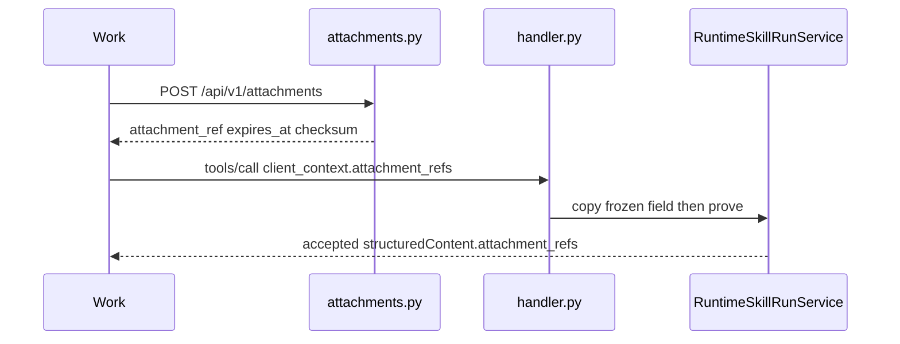

# RM-18 Skill Run v1.4.0 Public Attachment Input 实施计划

Canonical 落盘路径：[`.cursor/plans/rm-18_skill-run-v140-public-attachment-input.plan.md`](rm-18_skill-run-v140-public-attachment-input.plan.md)

`commit_policy: post_review`。下游只走 `smc-plan-delivery`。禁止执行任何其它 `.plan.md`。WRITE_OWNER 按 PRD 拆为既有 Attachment 授权域、Runtime Skill Run、MCP Gateway/Catalog、单一 `scripts/contracts.py`。禁止改写 `contracts/skill-run/v1.2.1/` 与 `v1.3.0/`，禁止第二生成脚本，禁止独立 File Platform，禁止复用 Artifact download，禁止把 Agent 读字节/注入 Hermes 写入 Todo，禁止并入 RM-09，禁止仓外 Work UI/IPC。

批准事实只取 `grounded_commit` `26e1cb5aa2aebbb4bdc1a8e1c65617aaa6b6c948`。

## 前端表现变化

本次改动无前端表现变化。不改 Portal / Admin / Work 页面、按钮、文案或路由。仓外 Work 要等 v1.4.0 Bundle 被导入并 checksum lock 通过后自行 Grounding，不是本仓 DONE。

## Approved PRD

[Approved PRD](../../docs_agent/prd-v1.6.16-skill-run-public-attachment-input.md)

## Scope

- In: `POST /api/v1/attachments`（无 `run_id`/`workspace_id`）；opaque org/user `attachment_ref` + TTL + sha256；org/user proof（显式 Execution Workspace 时叠加既有 ACL）；`params.client_context.attachment_refs` 唯一绑定；Catalog `supportsAttachments` 诚实性；fail-closed；Public accepted 含 opaque refs；v1.4.0 Bundle 累积 Approval；annotated tag `skill-run-contract-v1.4.0`；REAL_PROCESS `user_jwt` live。
- Out: Work 附件 UI/IPC；改写 v1.2.1/v1.3.0；RM-08；READY RM-09；独立 File Platform；Artifact download 当 upload；强制 workspace；Hermes `session`/`always`；Agent 读字节/注入 Hermes。
- Production Owner inherited from PRD: 既有 Attachment 授权域（C02, C03）；Runtime Skill Run（C04, C07, C09）；MCP Gateway（C06）；MCP Catalog（C08）；Contract Package（C10, C11）；Acceptance Assets（C12）。C01/C05/C13/C14 KEEP。

Plan 级冻结（不改 PRD 语义）:

- Public ref 只绑认证 `org_id`+`user_id`。Upload 不接受、回执不含 `workspace_id`。
- REST upload 失败：HTTP 4xx + canonical `{error_code,message_key,message}` 字符串码，无 Portal `{code,data}`，不改全局 `AppException` 整形码。
- `tools/call` 保持 JSON-RPC 传输；canonical 三字段放进既有 JSON-RPC error payload；禁止把 `tools/call` 改成 REST 4xx 面；`wireBreaking=false`。
- 禁止 `clientContext` / `attachmentRefs` / 顶层 `attachment_refs` 作为隐式别名。
- Portal `WorkspaceFile` id / `chat_attachment:` / `artifact_id` → `ATTACHMENT_REF_INVALID`。不使用 `ATTACHMENT_WORKSPACE_MISMATCH`。
- Bytes 复用 `storage_service`；仅当 `WorkspaceFile.workspace_id` 非空 FK 无法表达 org/user ephemeral 时，在同一 Owner 内 MINIMAL_NEW 表。
- annotated tag 打在 implementation commit 上；Execute 只冻结 `tagName`，禁止 `git tag -f`。

## Domain Activation Ledger

None

## Grounding Evidence Ledger

| Change ID | Target | Baseline State | Symbol / Entry Resolution | Caller / Callee Evidence | Existing Reuse Search | Result |
|---|---|---|---|---|---|---|
| C02 | `nodeskclaw-backend/app/api/attachments.py` | MISSING at `26e1cb5a` | `/api/v1/runs` 无创建/上传；v1.3.0 matrix 禁止 Attachment upload | `api/router.py` 只 `include_router(runs_router)`；Portal 上传在 `workspaces.py#upload_workspace_file` | 不把 Portal `/{workspace_id}/files/upload` 标成 Public；在 `/api/v1` 新增 attachments router；成功 JSONResponse 裸对象，失败抄 `runs.py#_canonical_approval_error` | PASS |
| C03 | `nodeskclaw-backend/app/models/workspace_file.py#WorkspaceFile` | EXISTS; WRONG SHAPE | `workspace_id` 非空 FK；checksum/scan 字段可复用概念 | `file_reference_service.resolve_message_file_references` 必须 `workspace_id` | 禁止给 WorkspaceFile 加可空 workspace；MINIMAL_NEW org/user metadata 表；TTL 复用 `upload_chat_attachment_retention_days`；bytes 走 `storage_service.upload_file_object` 以 `skill-run-att/{org_id}/{user_id}` 作 key 前缀 | PASS |
| C04 | `nodeskclaw-backend/app/services/hermes_skill/runtime_skill_run_service.py#RuntimeSkillRunService#_assert_attachment_proofs` | EXISTS; workspace forced | 无 `workspace_id` 时 `_build_authorized_execution_context` 抛 `errors.run.attachment_workspace_required` | `revalidate_execution_context` 同样强制 workspace | 改为先 org/user proof；仅显式 Execution Workspace 时再调既有 `check_workspace_access`；不改 ACL 服务 | PASS |
| C06 | `nodeskclaw-backend/app/services/mcp_skill_gateway/handler.py#_build_client_context` | EXISTS; drops body refs | 只从 header 建 context；`_handle_tools_call` 不读 `params.client_context` | mapper `_runtime_session_and_attachment_refs` 已读 `client_context.attachment_refs` | Gateway 只把冻结 snake_case 字段拷进 context；不证明；拒绝 camelCase 别名 | PASS |
| C07 | `nodeskclaw-backend/app/services/hermes_skill/runtime_skill_run_service.py#RuntimeSkillRunService#_build_authorized_execution_context` | EXISTS; fail-open-after-skip RISK | unknown ref 走 workspace file_reference；非法形状未钉 Public error_code | `mcp_skill_gateway/errors.py#map_app_error` 用 message_key 映射 JSON-RPC | Runtime 唯一 fail-closed；稳定字符串 error_code；JSON-RPC 只嵌套三字段 | PASS |
| C08 | `nodeskclaw-backend/app/services/hermes_skill/mcp_tool_mapper.py#McpToolMapper#_skill_to_tool_dict` | EXISTS; Release-only honesty | `supportsAttachments` 直接抄 Release extra | `list_tools` 调用 `_skill_to_tool_dict`；RM-12 executionModes 诚实性同构 | true 仅当 Release 允许且该调用者 Public upload/ref 可达（`user_jwt`）；`mcp_client_token` 无 REST upload 则为 false | PASS |
| C09 | `nodeskclaw-backend/app/services/hermes_skill/runtime_skill_run_service.py#RuntimeSkillRunService#build_structured_content` | EXISTS; refs not public | employee accepted 无 `attachment_refs`；内部 snapshot 已存 refs | mapper `_merge_org_mcp_async_payload` 原样拷贝 structured_content；`GET` artifact download 是输出 | 在 Runtime accepted 写入 opaque refs；禁止 Artifact download 当 input；不改 Agent | PASS |
| C10 | `nodeskclaw-backend/scripts/contracts.py#generate_skill_run_contracts` | EXISTS; 1.4.0 MISSING | choices/check 止于 `1.3.0`；`_generate_skill_run_v130_public_contract` copytree v1.2.1 | argparse 两处 choices；`_check_skill_run_contracts` / `_validate_skill_run_release` | 同脚本 copytree 冻结 v1.3.0 后 overlay；禁止第二 generator；禁止改 v1.2.1/v1.3.0 源 | PASS |
| C11 | `nodeskclaw-backend/app/schemas/skill_run/constants.py` | EXISTS; V140 MISSING | 仅到 `SKILL_RUN_CONTRACT_VERSION_V130` / `SKILL_RUN_TAG_NAME_V130` | v1.3.0 generate 读该常量 | 增加 v1.4.0 版本/tag 常量；Execute 不打 tag | PASS |
| C12 | `tools/acceptance/run_rm17_live_approval.py` | EXISTS; attachment contract NOT COVERED | RM-17 live 覆盖 Approval，未覆盖 upload/ref | `run_rm13_live_native.missing_live_vars`；泄漏扫描 | 新 runner 复用 RM13 HTTP/JWT/扫描；必须输出 SMC_ACCEPTANCE_RESULT；跨租户用他用户/未知 ref | PASS |

## Requirement Coverage Ledger

| Requirement | Source | Obligation | Classification | Change IDs | Todo | Verification IDs | Evidence Class | Blocking |
|---|---|---|---|---|---|---|---|---|
| AC-01 | AC | `contracts/skill-run/v1.2.1/` 与 `v1.3.0/` 相对各自发布 tag 零修改。 | CONTRACT | C01 | - | V01 | DIFF_SCOPE | yes |
| AC-02 | AC | 真实 `user_jwt` 可在无 `run_id`、无 `workspace_id` 时 `POST /api/v1/attachments` 得到裸对象成功回执；失败为 canonical 字符串信封。 | CONTRACT | C02 | T1 | V05; V10 | INTEGRATION | yes |
| AC-03 | AC | 回执 `attachment_ref` opaque 且无 `workspace_id`；含 TTL 与 sha256；响应无存储路径/内部 URL。 | BEHAVIOR | C03 | T1 | V05; V10 | INTEGRATION | yes |
| AC-04 | AC | org-global Skill（Execution `workspace_id=null`）携带合法本用户 Public ref 可 accepted；不再返回 `attachment_workspace_required`。 | BEHAVIOR | C04 | T2 | V04; V10 | UNIT | yes |
| AC-05 | AC | 显式 Execution Workspace 时 Runtime 额外调用既有 ACL；Installation workspace 不出现在 Execution Authorization；ACL 服务本身不改。 | SECURITY | C05 | T2 | V04 | UNIT | yes |
| AC-06 | AC | `tools/call` 仅正式字段 `params.client_context.attachment_refs` 被拷贝；其它 casing 不作为等价绑定。 | CONTRACT | C06 | T3 | V06 | UNIT | yes |
| AC-07 | AC | unknown / expired / 他用户 / `ATTACHMENT_REF_INVALID` / scan blocked / oversized / unsupported type → HTTP 4xx + canonical `{error_code,message_key,message}`，且不创建可执行 Run。 | SECURITY | C07 | T2 | V07; V10 | UNIT | yes |
| AC-08 | AC | Catalog `supportsAttachments` 对同一调用者等于实际可达；false 时带 ref 失败关闭。 | BEHAVIOR | C08 | T3 | V08 | UNIT | yes |
| AC-09 | AC | accepted 公共面含本次 opaque `attachment_refs`；live 不得把 Artifact download 当作 input 证据；不把 Agent 读字节或 Hermes 注入当作本项出口。 | BEHAVIOR | C09 | T2 | V09; V10 | INTEGRATION | yes |
| AC-10 | AC | `generate` / `check --release` 对 `1.4.0` PASS；损坏/extra/CRLF/Internal 路径 fail-closed。 | CONTRACT | C10 | T4 | V11 | CONTRACT_RELEASE | yes |
| AC-11 | AC | 存在 annotated tag `skill-run-contract-v1.4.0`；禁止 `git tag -f`。 | RELEASE | C11 | T4 | V14 | CONTRACT_RELEASE | yes |
| AC-12 | AC | REAL_PROCESS `user_jwt` live 覆盖 upload、绑定、Public ref 可见、fail-closed、泄漏扫描；证据记录 `auth_type=user_jwt`；跨租户用未知/他用户 ref。 | EVIDENCE | C12 | T5 | V10 | REAL_PROCESS | yes |
| AC-13 | AC | Roadmap 上 RM-09 仍 BACKLOG 且 Depends On RM-08。 | SCOPE | C13 | - | V12 | DOCUMENT_SEMANTIC | yes |
| AC-14 | AC | Portal 工作区上传路径仍不是本 Bundle 的 Public upload。 | SCOPE | C14 | - | V11 | CONTRACT_RELEASE | yes |
| DOD-01 | DOD | AD@1.7.0 APPROVED（已满足） | RELEASE | C01 | - | V13 | DOCUMENT_SEMANTIC | yes |
| DOD-02 | DOD | RM-18 Stage PRD APPROVED | RELEASE | C01 | - | V13 | DOCUMENT_SEMANTIC | yes |
| DOD-03 | DOD | Public upload 可用且不要求 run_id/workspace | CONTRACT | C02 | T1 | V05 | INTEGRATION | yes |
| DOD-04 | DOD | opaque org/user ref + TTL + checksum | BEHAVIOR | C03 | T1 | V05 | INTEGRATION | yes |
| DOD-05 | DOD | org/user scoped proof PASS；null workspace 不进 ACL | BEHAVIOR | C04 | T2 | V04 | UNIT | yes |
| DOD-06 | DOD | tools/call 绑定字段冻结 | CONTRACT | C06 | T3 | V06 | UNIT | yes |
| DOD-07 | DOD | unknown/expired/cross-user/invalid-shape fail-closed 且失败信封 canonical | SECURITY | C07 | T2 | V07 | UNIT | yes |
| DOD-08 | DOD | Catalog supportsAttachments 诚实 | BEHAVIOR | C08 | T3 | V08 | UNIT | yes |
| DOD-09 | DOD | Public accepted 含 `attachment_refs`；Attachment ≠ Artifact | BEHAVIOR | C09 | T2 | V09 | INTEGRATION | yes |
| DOD-10 | DOD | v1.2.1 与 v1.3.0 不可变 | CONTRACT | C01 | - | V01 | DIFF_SCOPE | yes |
| DOD-11 | DOD | v1.4.0 Bundle generate 与 release check PASS | CONTRACT | C10 | T4 | V11 | CONTRACT_RELEASE | yes |
| DOD-12 | DOD | annotated tag 创建 | RELEASE | C11 | T4 | V14 | CONTRACT_RELEASE | yes |
| DOD-13 | DOD | REAL_PROCESS user_jwt live PASS | EVIDENCE | C12 | T5 | V10 | REAL_PROCESS | yes |
| DOD-14 | DOD | Roadmap RM-18 在 Review PASS、Verification PASS 与 implementation commit 之后标记 DONE（属 Plan Delivery，非本轮 PRD 批准条件） | RELEASE | C13 | - | V12 | DOCUMENT_SEMANTIC | yes |

## Lifecycle Closure Matrix

| Journey | Requirements | Trigger | Nonterminal State | Success Writer | Failure / Cancel Writer | Evidence IDs |
|---|---|---|---|---|---|---|
| Upload before run | AC-02; AC-03; DOD-03; DOD-04 | POST /api/v1/attachments Bearer multipart | metadata row + object bytes; no Run | Public attachment service writes metadata and storage key | scan/size/type/unauth 4xx no ref; no Run | V05; V10 |
| Bind and prove | AC-04; AC-06; AC-07; DOD-05 | tools/call with attachment_refs | Gateway copied refs; Runtime proving | Runtime writes descriptors then accepted | invalid/expired/cross-user no executable Run; JSON-RPC nests canonical object | V04; V06; V07; V10 |
| TTL expiry | AC-07 | ref past expires_at | stored bytes may remain until cleanup | proof writer rejects ATTACHMENT_EXPIRED | no Run created | V07; V10 |
| Catalog false | AC-08; DOD-08 | supportsAttachments false plus refs | no executable Run | Runtime/Catalog fail-closed | ATTACHMENT_NOT_SUPPORTED | V08 |

## Contract / Data Flow Closure Matrix

| Flow | Requirements | Producer | Transport / Schema | Consumer | Required Fields | Validation Owner | Failure Mapping | Retry / Idempotency Identity | Evidence IDs |
|---|---|---|---|---|---|---|---|---|---|
| Public upload | AC-02; AC-03; DOD-03 | Work Bearer user_jwt | POST /api/v1/attachments multipart; no run_id; no workspace_id | Public attachment service | attachment_ref; name; size_bytes; checksum_sha256; content_type; expires_at | Attachment 授权域 | HTTP 4xx canonical string error_code; no Portal envelope | 本项不强制幂等头；重试可新 ref | V05; V10 |
| tools/call binding | AC-06; DOD-06 | Work JSON-RPC | params.client_context.attachment_refs string[] | MCP Gateway copy then Runtime proof | snake_case attachment_refs only | Gateway copy; Runtime prove | JSON-RPC error.data 含 error_code message_key message；HTTP 可 200 | 无新幂等；沿用既有 tools/call 去重 | V06; V10 |
| org/user proof | AC-04; AC-05; AC-07 | Runtime Skill Run | StartRuntimeSkillRunRequest.attachment_refs | descriptors type=attachment | org_id; user_id; opaque ref | RuntimeSkillRunService | ATTACHMENT_* fail-closed；null workspace 不进 ACL | proof identity=org+user+ref | V04; V07; V10 |
| accepted refs | AC-09; DOD-09 | Runtime build_structured_content | MCP structuredContent.attachment_refs | Work | opaque refs only | Runtime | 不得出现 storage key、grant URL、artifact_id 当 ref | snapshot_hash includes refs | V09; V10 |
| v1.4.0 bundle | AC-10; AC-11; AC-14; DOD-11 | contracts.py generate | files under contracts/skill-run/v1.4.0/ UTF-8 LF | Work checksum lock | attachments=supported; approvalDecision=supported; wireBreaking=false; upload matrix row | `_check_skill_run_contracts` 1.4.0 | extra/CRLF/Internal fail-closed | generate plus SHA256SUMS | V11; V14 |

## Acceptance Claim Ledger

| Claim ID | Requirement | Observable Fact | Blocking | Prior Evidence | Prior Result | Evidence Action | Invalidation Reason | Verification IDs |
|---|---|---|---|---|---|---|---|---|
| CLM-01 | AC-01 | git diff 26e1cb5a -- v1.2.1 与 v1.3.0 为空 | yes | none | UNKNOWN | NEW_EVIDENCE | - | V01 |
| CLM-02 | AC-02 | live 或单测 POST /api/v1/attachments 200 裸对象且无 code/data | yes | none | UNKNOWN | NEW_EVIDENCE | - | V05; V10 |
| CLM-03 | AC-03 | 回执无 workspace_id；含 expires_at 与 checksum_sha256 | yes | none | UNKNOWN | NEW_EVIDENCE | - | V05; V10 |
| CLM-04 | AC-04 | null workspace + 本用户 ref accepted；不再 attachment_workspace_required | yes | 现状代码 attachment_workspace_required | FAILED | NEW_EVIDENCE | - | V04; V10 |
| CLM-05 | AC-05 | 有 Execution workspace 时调用既有 ACL；Installation workspace 不写入 Execution Authorization | yes | none | UNKNOWN | NEW_EVIDENCE | - | V04 |
| CLM-06 | AC-06 | 仅 snake_case client_context.attachment_refs 被拷贝 | yes | none | UNKNOWN | NEW_EVIDENCE | - | V06 |
| CLM-07 | AC-07 | unknown/expired/他用户/INVALID 不创建 Run 且 canonical 失败 | yes | none | UNKNOWN | NEW_EVIDENCE | - | V07; V10 |
| CLM-08 | AC-08 | supportsAttachments 等于该调用者可达；false 带 ref 失败 | yes | none | UNKNOWN | NEW_EVIDENCE | - | V08 |
| CLM-09 | AC-09 | accepted.structuredContent.attachment_refs 为本次 opaque refs | yes | none | UNKNOWN | NEW_EVIDENCE | - | V09; V10 |
| CLM-10 | AC-10 | generate 与 check --family skill-run --version 1.4.0 退出 0 | yes | none | UNKNOWN | NEW_EVIDENCE | - | V11 |
| CLM-11 | AC-11 | manifest.tagName 为 skill-run-contract-v1.4.0 | yes | none | UNKNOWN | NEW_EVIDENCE | - | V14 |
| CLM-12 | AC-12 | live SMC_ACCEPTANCE_RESULT 全 PASS 且 auth_type=user_jwt | yes | none | UNKNOWN | NEW_EVIDENCE | - | V10 |
| CLM-13 | AC-13 | RM-09 BACKLOG Depends On RM-08 | yes | none | UNKNOWN | NEW_EVIDENCE | - | V12 |
| CLM-14 | AC-14 | v1.4.0 matrix Public upload 不是 workspaces files/upload | yes | none | UNKNOWN | NEW_EVIDENCE | - | V11 |
| CLM-15 | DOD-01 | AD-SKILL-AGENT-V16 status APPROVED version 1.7.0 | yes | none | UNKNOWN | NEW_EVIDENCE | - | V13 |
| CLM-16 | DOD-02 | RM-18 PRD status APPROVED review_verdict PASS | yes | none | UNKNOWN | NEW_EVIDENCE | - | V13 |
| CLM-17 | DOD-03 | upload 不要求 run_id/workspace | yes | none | UNKNOWN | NEW_EVIDENCE | - | V05 |
| CLM-18 | DOD-04 | opaque ref + TTL + checksum | yes | none | UNKNOWN | NEW_EVIDENCE | - | V05 |
| CLM-19 | DOD-05 | null workspace 不进 ACL | yes | none | UNKNOWN | NEW_EVIDENCE | - | V04 |
| CLM-20 | DOD-06 | 绑定字段冻结单测 PASS | yes | none | UNKNOWN | NEW_EVIDENCE | - | V06 |
| CLM-21 | DOD-07 | fail-closed 单测 PASS | yes | none | UNKNOWN | NEW_EVIDENCE | - | V07 |
| CLM-22 | DOD-08 | Catalog 诚实单测 PASS | yes | none | UNKNOWN | NEW_EVIDENCE | - | V08 |
| CLM-23 | DOD-09 | accepted 含 refs 且非 Artifact download | yes | none | UNKNOWN | NEW_EVIDENCE | - | V09 |
| CLM-24 | DOD-10 | v1.2.1 与 v1.3.0 相对 26e1cb5a 无 diff | yes | none | UNKNOWN | NEW_EVIDENCE | - | V01 |
| CLM-25 | DOD-11 | v1.4.0 check PASS | yes | none | UNKNOWN | NEW_EVIDENCE | - | V11 |
| CLM-26 | DOD-12 | tagName 已冻结 | yes | none | UNKNOWN | NEW_EVIDENCE | - | V14 |
| CLM-27 | DOD-13 | live runner 输出 SMC_ACCEPTANCE_RESULT 全 PASS | yes | none | UNKNOWN | NEW_EVIDENCE | - | V10 |
| CLM-28 | DOD-14 | Roadmap 文件可被 v11 validator 解析且含 RM-18 | yes | none | UNKNOWN | NEW_EVIDENCE | - | V12 |

## Live Scenario Matrix

| Scenario ID | Claim IDs | Verification IDs | Subject / Fixture | Required Capabilities | Preconditions | Stimulus | Oracle | Environment ID |
|---|---|---|---|---|---|---|---|---|
| SCN-01 | CLM-02; CLM-03; CLM-04; CLM-07; CLM-09; CLM-12; CLM-27 | V10 | live employee Runtime Skill whose Catalog supportsAttachments is true for this user_jwt | user_jwt Public upload; tools/call attachment_refs; SSE/GET accepted; Hermes Native | --preflight-env PASS; catalog tool reachable | upload; tools/call with ref; observe accepted refs; unknown/other-user ref fail-closed; leak scan | SMC_ACCEPTANCE_RESULT bound claims PASS; auth_type=user_jwt; no Artifact download as input | ENV-01 |

## Live Environment Matrix

| Environment ID | Required Env Vars | Preflight Command | Fault Driver Env | Candidate Mode | Candidate Probe |
|---|---|---|---|---|---|
| ENV-01 | RM13_HERMES_BASE_URL; RM13_HERMES_API_SERVER_KEY; RM13_AGENT_DATABASE_URL; RM13_BACKEND_BASE_URL or RM12_BACKEND_BASE_URL; RM13_USER_JWT or RM12_USER_JWT; RM13_ORG_ID or RM12_ORG_ID; RM13_TOOL_NAME or RM12_TOOL_NAME; RM13_AGENT_BASE_URL or RM12_AGENT_BASE_URL; SKILL_AGENT_INTERNAL_TOKEN | python tools/acceptance/run_rm18_live_attachment.py --preflight-env | - | COMMAND | python tools/acceptance/run_rm18_live_attachment.py --probe-candidate |

## Verification Ledger

| Verification ID | Claim IDs | Level | Acceptance Mode | Entry Point / Command | Oracle | Negative / Regression | Evidence Policy | Environment | Evidence Action | Blocking |
|---|---|---|---|---|---|---|---|---|---|---|
| V01 | CLM-01; CLM-24 | CONTRACT_RELEASE | LOCAL | git diff --exit-code 26e1cb5aa2aebbb4bdc1a8e1c65617aaa6b6c948 -- nodeskclaw-backend/contracts/skill-run/v1.2.1 nodeskclaw-backend/contracts/skill-run/v1.3.0 | empty diff vs grounded_commit | any RM-18 rewrite of frozen dirs fails | REPO_SUMMARY | local git | NEW_EVIDENCE | yes |
| V04 | CLM-04; CLM-05; CLM-19 | UNIT | LOCAL | uv --directory nodeskclaw-backend run pytest tests/hermes_skill/test_runtime_skill_run_context.py -q | null workspace + Public ref accepted; ACL only when explicit workspace | attachment_workspace_required fails | LOCAL_TRANSIENT | local | NEW_EVIDENCE | yes |
| V05 | CLM-02; CLM-03; CLM-17; CLM-18 | INTEGRATION | LOCAL | uv --directory nodeskclaw-backend run pytest tests/hermes_skill/test_public_attachments_api.py -q | 200 bare receipt; 4xx canonical envelope; no workspace_id | Portal envelope or int error_code fails | LOCAL_TRANSIENT | local | NEW_EVIDENCE | yes |
| V06 | CLM-06; CLM-20 | UNIT | LOCAL | uv --directory nodeskclaw-backend run pytest tests/hermes_skill/test_mcp_tool_mapper_runtime_skill.py -q -k attachment | only snake_case copied | camelCase alias bind fails | LOCAL_TRANSIENT | local | NEW_EVIDENCE | yes |
| V07 | CLM-07; CLM-21 | UNIT | LOCAL | uv --directory nodeskclaw-backend run pytest tests/hermes_skill/test_runtime_skill_run_context.py -q -k attachment | invalid/expired/cross-user no Run | ignore-and-continue fails | LOCAL_TRANSIENT | local | NEW_EVIDENCE | yes |
| V08 | CLM-08; CLM-22 | UNIT | LOCAL | uv --directory nodeskclaw-backend run pytest tests/hermes_skill/test_mcp_tools_list.py -q -k supportsAttachments | true only when reachable; false rejects refs | Release-true but path-false advertised fails | LOCAL_TRANSIENT | local | NEW_EVIDENCE | yes |
| V09 | CLM-09; CLM-23 | UNIT | LOCAL | uv --directory nodeskclaw-backend run pytest tests/hermes_skill/test_runtime_skill_run_service.py -q -k attachment | accepted contains opaque refs | artifact_id as ref fails | LOCAL_TRANSIENT | local | NEW_EVIDENCE | yes |
| V10 | CLM-02; CLM-03; CLM-04; CLM-07; CLM-09; CLM-12; CLM-27 | INTEGRATION | LIVE | python tools/acceptance/run_rm18_live_attachment.py | SMC_ACCEPTANCE_RESULT bound claims PASS; auth_type=user_jwt | fixture-only PASS fails; Artifact download as input fails | LOCAL_TRANSIENT | ENV-01 | NEW_EVIDENCE | yes |
| V11 | CLM-10; CLM-14; CLM-25 | CONTRACT_RELEASE | LOCAL | uv --directory nodeskclaw-backend run python scripts/contracts.py check --family skill-run --version 1.4.0 --release | exit 0; attachments supported; approval still supported; upload matrix row; not Portal upload path | extra/CRLF/Internal fail-closed | LOCAL_TRANSIENT | local | NEW_EVIDENCE | yes |
| V12 | CLM-13; CLM-28 | DOCUMENT_SEMANTIC | LOCAL | python .agents/skills/smc-roadmap/scripts/validate_roadmap_v11.py docs_agent/roadmaps/ROADMAP-SKILL-AGENT-V16.md | validator PASS; RM-09 BACKLOG Depends On RM-08; RM-18 present | RM-09 READY or Depends On dropped fails | REPO_SUMMARY | local | NEW_EVIDENCE | yes |
| V13 | CLM-15; CLM-16 | DOCUMENT_SEMANTIC | LOCAL | python tools/agent-skills/validate_prd.py docs_agent/prd-v1.6.16-skill-run-public-attachment-input.md --require-approved | PRD validation passed | DRAFT or missing approved_at fails | REPO_SUMMARY | local | NEW_EVIDENCE | yes |
| V14 | CLM-11; CLM-26 | CONTRACT_RELEASE | LOCAL | uv --directory nodeskclaw-backend run python -c "import json; from pathlib import Path; m=json.loads(Path('contracts/skill-run/v1.4.0/manifest.json').read_text(encoding='utf-8')); assert m['tagName']=='skill-run-contract-v1.4.0'; print('tagName_ok')" | prints tagName_ok | tag -f or wrong tagName fails | LOCAL_TRANSIENT | local | NEW_EVIDENCE | yes |

## Immediate Read

- `nodeskclaw-backend/app/services/hermes_skill/runtime_skill_run_service.py#RuntimeSkillRunService#_assert_attachment_proofs`
- `nodeskclaw-backend/app/services/hermes_skill/runtime_skill_run_service.py#RuntimeSkillRunService#build_structured_content`
- `nodeskclaw-backend/app/services/mcp_skill_gateway/handler.py#_build_client_context`
- `nodeskclaw-backend/app/services/mcp_skill_gateway/handler.py#_handle_tools_call`
- `nodeskclaw-backend/app/api/runs.py#_canonical_approval_error`
- `nodeskclaw-backend/app/api/workspaces.py#upload_workspace_file`
- `nodeskclaw-backend/app/models/workspace_file.py#WorkspaceFile`
- `nodeskclaw-backend/scripts/contracts.py#generate_skill_run_contracts`
- `tools/acceptance/run_rm17_live_approval.py`

## Triggered Read

- If `storage_service.upload_file_object` cannot accept a non-workspace key prefix: `nodeskclaw-backend/app/services/storage_service.py#_build_object_key` read-only; only then T1 may pass a synthetic prefix, not a new storage platform
- If scan API requires workspace_id: `file_scan_service.get_initial_scan_state` read-only; fail-closed scan blocked without returning a runnable ref
- If exception handler blocks string error_code: `app/core/exceptions.py#register_exception_handlers` read-only; canonical REST uses JSONResponse
- If live Catalog has no supportsAttachments=true Skill: VERIFICATION_BLOCKED，不改生产 Skill 元数据猜 true
- Otherwise: do not read

## Change Matrix

| Change ID | File / Symbol | Kind | Action | Existing Owner | Todo Owner | Target State | PRD Capability | New File? |
|---|---|---|---|---|---|---|---|---|
| C01 | `nodeskclaw-backend/contracts/skill-run/v1.2.1/` | PROD | KEEP | Contract Package | - | bytes frozen | 冻结 v1.2.1 Bundle | no |
| C01 | `nodeskclaw-backend/contracts/skill-run/v1.3.0/` | PROD | KEEP | Contract Package | - | bytes frozen | 冻结 v1.3.0 Bundle | no |
| C02 | `nodeskclaw-backend/app/api/attachments.py` | PROD | ADD | 既有 Attachment 授权域 | T1 | POST /api/v1/attachments bare success | Public Attachment upload | yes |
| C02 | `nodeskclaw-backend/app/api/router.py#api_router` | PROD | MODIFY | 既有 Attachment 授权域 | T1 | include attachments router | Public Attachment upload | no |
| C02 | `nodeskclaw-backend/app/services/hermes_skill/public_attachment_service.py` | PROD | ADD | 既有 Attachment 授权域 | T1 | org/user upload+scan+TTL | Public Attachment upload | yes |
| C02 | `nodeskclaw-backend/tests/hermes_skill/test_public_attachments_api.py` | TEST | ADD | Skill Run API tests | T1 | upload/failure envelope coverage | Public Attachment upload | yes |
| C03 | `nodeskclaw-backend/app/models/hermes_skill/skill_run_public_attachment.py` | PROD | ADD | 既有 Attachment 授权域 | T1 | org/user metadata no workspace_id | Opaque org/user ref | yes |
| C03 | `nodeskclaw-backend/app/models/hermes_skill/__init__.py` | PROD | MODIFY | 既有 Attachment 授权域 | T1 | export model | Opaque org/user ref | no |
| C03 | `nodeskclaw-backend/app/models/__init__.py` | PROD | MODIFY | 既有 Attachment 授权域 | T1 | register model | Opaque org/user ref | no |
| C03 | `nodeskclaw-backend/alembic/versions/` | CONFIG | MODIFY | 既有 Attachment 授权域 | T1 | autogenerate metadata migration | Opaque org/user ref | no |
| C04 | `nodeskclaw-backend/app/services/hermes_skill/runtime_skill_run_service.py#RuntimeSkillRunService#_assert_attachment_proofs` | PROD | MODIFY | Runtime Skill Run | T2 | org/user proof; optional ACL overlay | org/user scoped proof | no |
| C04 | `nodeskclaw-backend/app/services/hermes_skill/runtime_skill_run_service.py#RuntimeSkillRunService#_build_authorized_execution_context` | PROD | MODIFY | Runtime Skill Run | T2 | no attachment_workspace_required | org/user scoped proof | no |
| C04 | `nodeskclaw-backend/tests/hermes_skill/test_runtime_skill_run_context.py` | TEST | MODIFY | Runtime tests | T2 | null workspace + Public ref | org/user scoped proof | no |
| C05 | `nodeskclaw-backend/app/services/workspace_member_service.py` | PROD | KEEP | Workspace ACL | - | service unchanged | Workspace ACL overlay | no |
| C06 | `nodeskclaw-backend/app/services/mcp_skill_gateway/handler.py#_build_client_context` | PROD | MODIFY | MCP Gateway | T3 | copy frozen attachment_refs | tools/call binding | no |
| C06 | `nodeskclaw-backend/app/services/mcp_skill_gateway/handler.py#_handle_tools_call` | PROD | MODIFY | MCP Gateway | T3 | read params.client_context.attachment_refs | tools/call binding | no |
| C06 | `nodeskclaw-backend/app/services/mcp_skill_gateway/errors.py#map_app_error` | PROD | MODIFY | MCP Gateway | T3 | nest error_code message_key message | tools/call JSON-RPC envelope | no |
| C06 | `nodeskclaw-backend/tests/hermes_skill/test_mcp_tool_mapper_runtime_skill.py` | TEST | MODIFY | Gateway tests | T3 | only snake_case copied | tools/call binding | no |
| C07 | `nodeskclaw-backend/app/services/hermes_skill/runtime_skill_run_service.py#RuntimeSkillRunService#revalidate_execution_context` | PROD | MODIFY | Runtime Skill Run | T2 | org/user re-proof; canonical errors | Fail-closed 引用校验 | no |
| C08 | `nodeskclaw-backend/app/services/hermes_skill/mcp_tool_mapper.py#McpToolMapper#_skill_to_tool_dict` | PROD | MODIFY | MCP Catalog | T3 | honesty = Release and reachable | Catalog supportsAttachments | no |
| C08 | `nodeskclaw-backend/tests/hermes_skill/test_mcp_tools_list.py` | TEST | MODIFY | Catalog tests | T3 | reachable vs advertised | Catalog supportsAttachments | no |
| C09 | `nodeskclaw-backend/app/services/hermes_skill/runtime_skill_run_service.py#RuntimeSkillRunService#build_structured_content` | PROD | MODIFY | Runtime Skill Run | T2 | accepted contains opaque refs | Public-observable refs | no |
| C09 | `nodeskclaw-backend/tests/hermes_skill/test_runtime_skill_run_service.py` | TEST | MODIFY | Runtime tests | T2 | accepted refs; reject artifact_id | Public-observable refs | no |
| C10 | `nodeskclaw-backend/scripts/contracts.py#generate_skill_run_contracts` | PROD | MODIFY | Contract Package | T4 | version 1.4.0 generate/check/release | Generator v1.4.0 | no |
| C10 | `nodeskclaw-backend/scripts/contracts.py#_check_skill_run_contracts` | PROD | MODIFY | Contract Package | T4 | 1.4.0 strict checksum branch | Generator v1.4.0 | no |
| C10 | `nodeskclaw-backend/scripts/contracts.py#_validate_skill_run_release` | PROD | MODIFY | Contract Package | T4 | 1.4.0 prefix | Generator v1.4.0 | no |
| C10 | `nodeskclaw-backend/contracts/skill-run/v1.4.0/` | PROD | ADD | Contract Package | T4 | generated public bundle | Generator v1.4.0 | yes |
| C10 | `nodeskclaw-backend/app/schemas/skill_run/mcp_jsonrpc.py#PublicSkillRunAccepted` | PROD | MODIFY | Contract Package | T4 | accepted schema has attachment_refs | Generator v1.4.0 | no |
| C11 | `nodeskclaw-backend/app/schemas/skill_run/constants.py` | PROD | MODIFY | Contract Package | T4 | V140 version and tag name | Immutable release tag | no |
| C11 | `lat.md/architecture/skill-agent.md` | DOC | MODIFY | Architecture wiki | T4 | document v1.4.0 public attachment | Immutable release tag | no |
| C12 | `tools/acceptance/run_rm18_live_attachment.py` | TEST | ADD | Acceptance Assets | T5 | user_jwt live plus SMC_ACCEPTANCE_RESULT | Live conformance | yes |
| C13 | - | DOC | KEEP | Roadmap | - | RM-09 BACKLOG Depends On RM-08；V12 只读校验；不把 Roadmap 文件列入 Plan write set | RM-09 boundary | no |
| C14 | `nodeskclaw-backend/app/api/workspaces.py#upload_workspace_file` | PROD | KEEP | Workspace Upload | - | not Public Skill Run upload | Portal 聊天上传 | no |

## Implementation Decisions

| Change ID | Strategy | Root-Cause / Reuse Evidence | Why This Is Minimum |
|---|---|---|---|
| C02 | MINIMAL_NEW | Portal upload is workspace FK + Portal envelope; v1.3.0 has no Public upload | New router beside runs; reuse storage/scan/policy; JSONResponse canonical errors |
| C03 | MINIMAL_NEW | WorkspaceFile.workspace_id 非空 FK 无法表达 org/user ephemeral | Same Owner new table; reuse checksum/scan/TTL policy; no File Platform |
| C04 | MODIFY_EXISTING | `_assert_attachment_proofs` is the unique proof owner | Drop workspace-required; call existing ACL only when Execution workspace present |
| C06 | MODIFY_EXISTING | mapper already reads client_context.attachment_refs; handler drops body | Copy one frozen field; do not add aliases or second auth context |
| C07 | MODIFY_EXISTING | proof and revalidate already exist; error codes are unfrozen | Fail-closed in Runtime; REST JSONResponse; JSON-RPC nests same object |
| C08 | MODIFY_EXISTING | `_skill_to_tool_dict` already projects supportsAttachments | AND reachable path like RM-12 executionModes |
| C09 | MODIFY_EXISTING | `build_structured_content` is employee accepted SoT; mapper copies it | Add opaque refs there; do not invent Agent ingest or Artifact reuse |
| C10 | MODIFY_EXISTING | v1.3.0 copytree overlay pattern in same script | Extend choices/branches; copy v1.3.0 then overlay attachment artifacts |
| C11 | MODIFY_EXISTING | V130 tag constant pattern | Add V140 constants; tag object after implementation commit |
| C12 | MINIMAL_NEW | RM-17 live does not cover upload/ref | New runner wrapping RM13 helpers; no new daemon |

## Write Ownership Ledger

| Todo | Owns Changes | Writes | Reads | Depends On | Parallel Safe |
|---|---|---|---|---|---|
| T1 | C02; C03 | `nodeskclaw-backend/app/api/attachments.py`; `nodeskclaw-backend/app/api/router.py#api_router`; `nodeskclaw-backend/app/services/hermes_skill/public_attachment_service.py`; `nodeskclaw-backend/app/models/hermes_skill/skill_run_public_attachment.py`; `nodeskclaw-backend/app/models/hermes_skill/__init__.py`; `nodeskclaw-backend/app/models/__init__.py`; `nodeskclaw-backend/alembic/versions/`; `nodeskclaw-backend/tests/hermes_skill/test_public_attachments_api.py` | `nodeskclaw-backend/app/api/runs.py#_canonical_approval_error`; `nodeskclaw-backend/app/api/workspaces.py#upload_workspace_file`; `nodeskclaw-backend/app/services/storage_service.py`; `nodeskclaw-backend/app/services/file_scan_service.py`; `nodeskclaw-backend/app/models/workspace_file.py` | - | no |
| T2 | C04; C07; C09 | `nodeskclaw-backend/app/services/hermes_skill/runtime_skill_run_service.py#RuntimeSkillRunService#_assert_attachment_proofs`; `nodeskclaw-backend/app/services/hermes_skill/runtime_skill_run_service.py#RuntimeSkillRunService#_build_authorized_execution_context`; `nodeskclaw-backend/app/services/hermes_skill/runtime_skill_run_service.py#RuntimeSkillRunService#revalidate_execution_context`; `nodeskclaw-backend/app/services/hermes_skill/runtime_skill_run_service.py#RuntimeSkillRunService#build_structured_content`; `nodeskclaw-backend/tests/hermes_skill/test_runtime_skill_run_context.py`; `nodeskclaw-backend/tests/hermes_skill/test_runtime_skill_run_service.py` | `nodeskclaw-backend/app/services/hermes_skill/public_attachment_service.py`; `nodeskclaw-backend/app/services/workspace_member_service.py`; `nodeskclaw-backend/app/api/runs.py#download_run_artifact` | T1 | no |
| T3 | C06; C08 | `nodeskclaw-backend/app/services/mcp_skill_gateway/handler.py#_build_client_context`; `nodeskclaw-backend/app/services/mcp_skill_gateway/handler.py#_handle_tools_call`; `nodeskclaw-backend/app/services/mcp_skill_gateway/errors.py#map_app_error`; `nodeskclaw-backend/app/services/hermes_skill/mcp_tool_mapper.py#McpToolMapper#_skill_to_tool_dict`; `nodeskclaw-backend/tests/hermes_skill/test_mcp_tool_mapper_runtime_skill.py`; `nodeskclaw-backend/tests/hermes_skill/test_mcp_tools_list.py` | `nodeskclaw-backend/app/services/hermes_skill/mcp_tool_mapper.py#_runtime_session_and_attachment_refs` | T1 | no |
| T4 | C10; C11 | `nodeskclaw-backend/scripts/contracts.py#generate_skill_run_contracts`; `nodeskclaw-backend/scripts/contracts.py#_check_skill_run_contracts`; `nodeskclaw-backend/scripts/contracts.py#_validate_skill_run_release`; `nodeskclaw-backend/contracts/skill-run/v1.4.0/`; `nodeskclaw-backend/app/schemas/skill_run/mcp_jsonrpc.py#PublicSkillRunAccepted`; `nodeskclaw-backend/app/schemas/skill_run/constants.py`; `lat.md/architecture/skill-agent.md` | `nodeskclaw-backend/contracts/skill-run/v1.3.0/` | T2; T3 | no |
| T5 | C12 | `tools/acceptance/run_rm18_live_attachment.py` | `tools/acceptance/run_rm13_live_native.py`; `tools/acceptance/run_rm17_live_approval.py`; `nodeskclaw-backend/app/api/attachments.py`; `nodeskclaw-backend/contracts/skill-run/v1.4.0/` | T4 | no |

## Integration Hotspots

| File | Owner Todo | Reason |
|---|---|---|
| nodeskclaw-backend/app/services/hermes_skill/runtime_skill_run_service.py | T2 | Single writer for proof, revalidate, and accepted refs |
| nodeskclaw-backend/app/services/mcp_skill_gateway/handler.py | T3 | Single writer for JSON-RPC copy and JSON-RPC error nesting |
| nodeskclaw-backend/app/services/hermes_skill/mcp_tool_mapper.py | T3 | Catalog honesty lives in `_skill_to_tool_dict`; call_tool remains copy-only |
| nodeskclaw-backend/scripts/contracts.py | T4 | Single generator chain |

## Generated Outputs Ledger

| Source Change | Generator Owner | Generated Outputs | Command | Drift Check |
|---|---|---|---|---|
| C03 | T1 | Alembic revision under nodeskclaw-backend/alembic/versions/ | uv --directory nodeskclaw-backend run alembic revision --autogenerate -m "skill run public attachment metadata" | review no unrelated DROP; Partial Unique Index deleted_at IS NULL |
| C10 | T4 | nodeskclaw-backend/contracts/skill-run/v1.4.0/ | uv --directory nodeskclaw-backend run python scripts/contracts.py generate --family skill-run --version 1.4.0 | uv --directory nodeskclaw-backend run python scripts/contracts.py check --family skill-run --version 1.4.0 |

## New File Justification

| Change ID | File | Necessity | Owner Impact |
|---|---|---|---|
| C02 | nodeskclaw-backend/app/api/attachments.py | runs.py 是 Run 投影面；Public upload 无 run_id，不能挂在 `/{run_id}` 路由下 | 同一 Attachment 授权域；T1 单写 |
| C02 | nodeskclaw-backend/app/services/hermes_skill/public_attachment_service.py | Portal upload_workspace_file 绑定 workspace FK 与 Portal 信封，不能复用为 Public 合同面 | T1 单写；不新建进程 |
| C02 | nodeskclaw-backend/tests/hermes_skill/test_public_attachments_api.py | 现有 employee runs 测试不覆盖无 run 的 upload | T1 测试 |
| C03 | nodeskclaw-backend/app/models/hermes_skill/skill_run_public_attachment.py | WorkspaceFile.workspace_id 非空 FK 无法表达 org/user ephemeral ref | 同一 Owner 最小表 |
| C10 | nodeskclaw-backend/contracts/skill-run/v1.4.0/ | 生成包不能写进冻结 v1.2.1/v1.3.0 | T4 generator；不是第二脚本 |
| C12 | tools/acceptance/run_rm18_live_attachment.py | RM-17 runner 不覆盖 upload/ref 或本项 Claim | 复用 RM13 helpers |

## Todo T1 — Public Attachment upload 与 opaque ref

**Owns Changes**
- C02
- C03

**Goal**
员工 `user_jwt` 可在无 `run_id`、无 `workspace_id` 时上传文件，得到裸合同回执（opaque ref、TTL、sha256），失败为 canonical 字符串信封。

**Immediate anchors**
- `nodeskclaw-backend/app/api/workspaces.py#upload_workspace_file`
- `nodeskclaw-backend/app/api/runs.py#_canonical_approval_error`
- `nodeskclaw-backend/app/models/workspace_file.py#WorkspaceFile`

**Changes**
- 新增 `POST /api/v1/attachments`；Bearer；multipart；不接受 workspace_id
- 成功裸对象；失败 HTTP 4xx `{error_code,message_key,message}`
- MINIMAL_NEW org/user metadata 表 + Alembic autogenerate；bytes 复用 storage_service；扫描失败不返回可执行 ref
- 默认 TTL 复用聊天附件保留策略

**Stop conditions**
- [ ] V05 PASS
- [ ] 回执无 workspace_id、storage key、Portal 信封

**Triggered reads**
- If storage key builder cannot take synthetic prefix: read `_build_object_key` only
- Otherwise: do not read

## Todo T2 — org/user proof、fail-closed 与 accepted refs

**Owns Changes**
- C04
- C07
- C09

**Goal**
Runtime 对 Public ref 做 org/user proof；`workspace_id=null` 不进 ACL；非法/过期/他用户/非法形状失败关闭且不创建可执行 Run；accepted 含本次 opaque refs。

**Immediate anchors**
- `RuntimeSkillRunService#_assert_attachment_proofs`
- `RuntimeSkillRunService#build_structured_content`
- `public_attachment_service.py`

**Changes**
- 删除 `attachment_workspace_required` 作为缺省路径
- 显式 Execution Workspace 时调用既有 ACL；Installation workspace 不写入
- 稳定 error_code 集合按 PRD；不使用 `ATTACHMENT_WORKSPACE_MISMATCH`
- `build_structured_content` 写入 opaque `attachment_refs`

**Stop conditions**
- [ ] V04 V07 V09 PASS
- [ ] 不把 Artifact download 或 Agent grant 当 input

**Triggered reads**
- If proof must call T1 service by a missing symbol: stop PLAN_WRITE_SCOPE_VIOLATION rather than edit T1 files
- Otherwise: do not read

## Todo T3 — tools/call 绑定与 Catalog 诚实性

**Owns Changes**
- C06
- C08

**Goal**
Gateway 只拷贝 `params.client_context.attachment_refs`；Catalog `supportsAttachments` 对 `user_jwt` 等于实际上传/引用可达。

**Immediate anchors**
- `handler.py#_handle_tools_call`
- `McpToolMapper#_skill_to_tool_dict`
- `_runtime_session_and_attachment_refs`

**Changes**
- 从 JSON-RPC params 拷贝冻结字段；拒绝 camelCase 别名
- `map_app_error` 嵌套 canonical 三字段；保持 JSON-RPC 传输
- `supportsAttachments=true` 仅当 Release 允许且该调用者可达

**Stop conditions**
- [ ] V06 V08 PASS
- [ ] 不把 tools/call 改成 REST 4xx；不写 Runtime proof

**Triggered reads**
- If tools/list lacks auth_type to compute honesty: read `list_tools` and pass caller class without moving proof into Gateway
- Otherwise: do not read

## Todo T4 — Skill Run v1.4.0 生成链与 Bundle

**Owns Changes**
- C10
- C11

**Goal**
既有 `scripts/contracts.py` 支持 generate/check/release `1.4.0`；Bundle 累积 Approval 且 `attachments=supported`；冻结 tagName。

**Immediate anchors**
- `scripts/contracts.py#generate_skill_run_contracts`
- `scripts/contracts.py#_generate_skill_run_v130_public_contract`
- `app/schemas/skill_run/constants.py`

**Changes**
- choices/check/release 增加 `1.4.0`；从冻结 v1.3.0 copytree 后 overlay
- 增加 upload/ref/binding/failure fixtures 与 matrix upload 行
- `PublicSkillRunAccepted` 增加 `attachment_refs`
- 常量 `SKILL_RUN_CONTRACT_VERSION_V140` / `SKILL_RUN_TAG_NAME_V140`
- 不改写 v1.2.1/v1.3.0 源目录

**Stop conditions**
- [ ] V11 V14 PASS
- [ ] V01 仍为空 diff

**Triggered reads**
- If overlay would rewrite v1.3.0 generator: stop and overlay only
- Otherwise: do not read

## Todo T5 — user_jwt REAL_PROCESS live 符合性

**Owns Changes**
- C12

**Goal**
真实员工 JWT 证明 upload → tools/call 绑定 → accepted 含 ref → fail-closed → 无内部身份泄漏。

**Immediate anchors**
- `tools/acceptance/run_rm17_live_approval.py`
- `tools/acceptance/run_rm13_live_native.py#missing_live_vars`

**Changes**
- 新增 `tools/acceptance/run_rm18_live_attachment.py`
- 输出恰好一行 `SMC_ACCEPTANCE_RESULT` 覆盖 CLM-02 CLM-03 CLM-04 CLM-07 CLM-09 CLM-12 CLM-27
- `--preflight-env` 与 `--probe-candidate`
- 跨租户用未知/他用户 ref，不用伪造 `X-Org-Id`

**Stop conditions**
- [ ] V10 LIVE PASS 或环境/fixture 缺失时 VERIFICATION_BLOCKED 而非产品假 PASS
- [ ] 证据不记录 JWT、Authorization、文件正文、storage key、Runtime 明文 ID

**Triggered reads**
- If no Skill advertises reachable supportsAttachments: BLOCKED，不猜生产元数据
- Otherwise: do not read

## Verification

Run all blocking Verification Ledger entries through `smc-plan-delivery/scripts/evidence.py`. LIVE V10 must pass `acceptance.py preflight` first. After implementation commit, Delivery creates annotated tag `skill-run-contract-v1.4.0` without `-f`, then `check --release`, then Roadmap RM-18 DONE in a separate commit.

## Completion Gate

| Exit State | Allowed When | Blocking Evidence |
|---|---|---|
| IMPLEMENTED_AND_PROVEN | all Cursor todos completed; completion audit FRESH PASS; implementation review FRESH PASS; all blocking Verification FRESH PASS; durable Evidence Manifest FRESH | V01 V04 V05 V06 V07 V08 V09 V10 V11 V12 V13 V14 plus durable Evidence Manifest |
| IMPLEMENTED_NOT_PROVEN | implementation exists but proof is pending/stale | pending/stale gate IDs |
| BLOCKED | ENV-01 missing, no attachment-capable live Skill, or LIVE_SUT_MISMATCH | preflight/blocker record |
| RETURN_PRD | approved owner/boundary conflicts, including needing Agent byte ingest or rewriting frozen bundles | PRD revision request |
