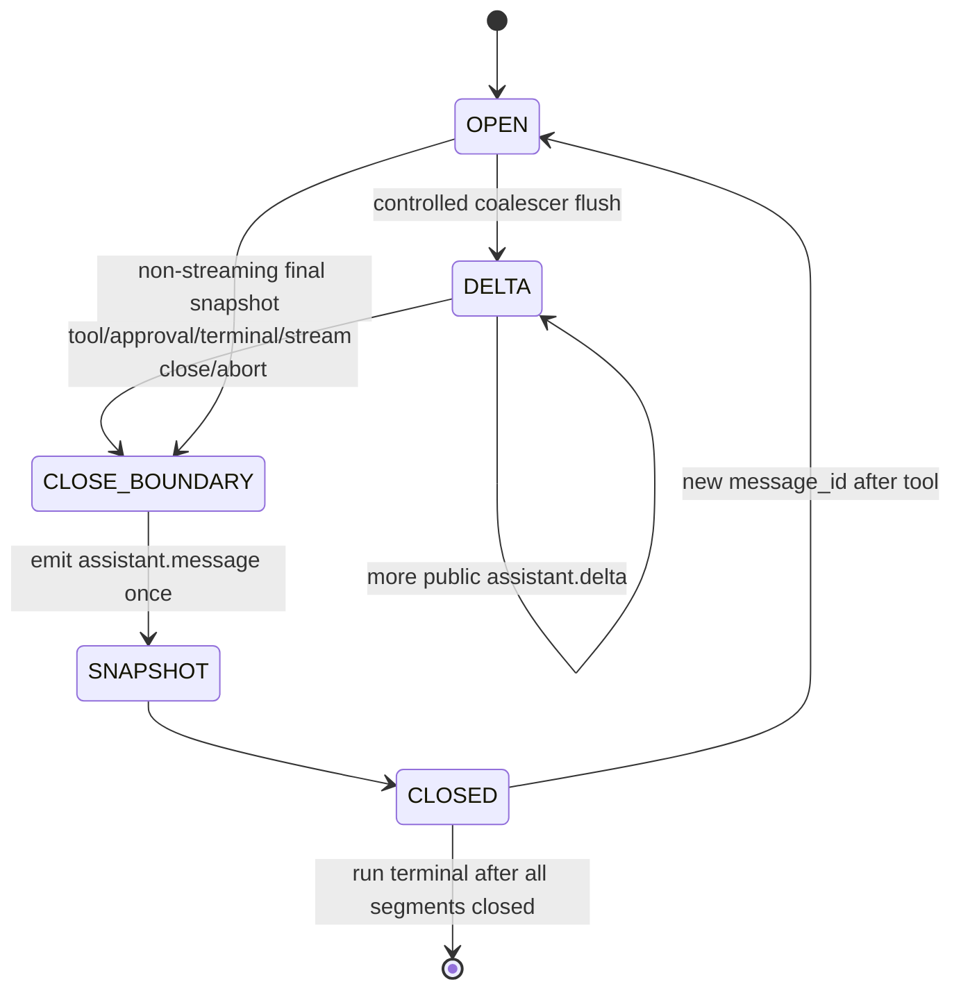

# RM-19 Skill Run v1.5.0 Streaming Delta Provider 实施计划

Canonical 落盘路径：[`.cursor/plans/rm-19_skill-run-v150-streaming-delta-provider.plan.md`](rm-19_skill-run-v150-streaming-delta-provider.plan.md)

`commit_policy: post_review`。下游只走 `smc-plan-delivery`。禁止执行任何其它 `.plan.md`。WRITE_OWNER 按 PRD 拆为 Agent 消息段/合并器、Agent schema 校验、Backend 公共投影、单一 `scripts/contracts.py`、Acceptance Assets + LAT。禁止改写 `contracts/skill-run/v1.2.1/`～`v1.4.0/`，禁止第二生成脚本/coalescer/Event Store/SSE/terminal owner，禁止把 Work UI/parser/consumer-lock 写入 Todo，禁止并入 RM-09。

批准事实只取 `grounded_commit` `13554a42c958f510c2167a74449cbbb9086f0e96`。

## 前端表现变化

本次改动无前端表现变化。不改 Portal / Admin / Work 页面、按钮、文案或路由。仓外 Work 要等 v1.5.0 Bundle 被导入并 checksum lock 通过后自行 Grounding，不是本仓 DONE。

## Approved PRD

[Approved PRD](../../docs_agent/prd-v1.6.19-skill-run-v150-streaming-delta-provider.md)

## Scope

- In: durable Public `assistant.delta`（message_id/delta_seq/delta）；段末完整 `assistant.message` snapshot；既有 coalescer 1000 ms + Unicode 安全 64 KiB 切分；Backend `_public_run_event` allowlist；v1.5 专用 pydantic 模型；`contracts/skill-run/v1.5.0/` 从冻结 v1.4.0 copy+overlay；annotated tag `skill-run-contract-v1.5.0`；`user_jwt` REAL_PROCESS 运行中 delta 证明。
- Out: 改写 v1.2.1～v1.4.0；第二 coalescer/Event Store/SSE/terminal owner；逐 token 公开；Work UI/parser/IPC/consumer-lock；并入 RM-09；只发 schema/fixture 假装 Provider 完成。
- Production Owner inherited from PRD: Agent Hermes Adapter + coalescer（C01, C02）；Agent schema（C03）；Backend Skill Run API（C04）；Contract Package（C05, C06）；Acceptance Assets（C07）；Architecture wiki（C08）。

Plan 级冻结（不改 PRD 语义）:

- Message Segment：`OPEN -> assistant.delta* -> assistant.message snapshot -> CLOSED`；工具/审批/终态/流关闭/中止均先关闭当前段。
- 单 delta ≤64 KiB UTF-8；完整 snapshot ≤1 MiB UTF-8；空 delta 不产事件。
- 两提交发布：commit A = 行为（manifest `backendCommit`/`releaseCommit`→A）；commit B = Bundle-only；tag→B；**不**要求 `releaseCommit == tag peel SHA`。
- Execute 只冻结 `tagName`；禁止 `git tag -f`。

### Gene / Skill assessment

本次只改变平台 Run Event 公共语义（delta/snapshot），不改 Agent 协作行为、tool allow、MCP servers 或 Gene 模板内容。Gene/Skill：**无变更**；无需 DeskHub 推送或实例重装。

### Two-commit release procedure

1. Implementation commit A：Agent/Backend 行为 + generator 扩展 + tests（Review/Verification PASS 后）。
2. Bundle-only commit B：仅 `nodeskclaw-backend/contracts/skill-run/v1.5.0/`；manifest 引用 A。
3. Annotated tag `skill-run-contract-v1.5.0` 指向 B（禁止 `-f`）。
4. 在 tag tree 上 `check --release`：A ancestor of B；A..B 仅 Bundle；checksum/LF 闭包 PASS。
5. 独立 Roadmap status commit 将 RM-19 标 DONE（引用 A/B 与 evidence）。

## Domain Activation Ledger

None

## Grounding Evidence Ledger

| Change ID | Target | Baseline State | Symbol / Entry Resolution | Caller / Callee Evidence | Existing Reuse Search | Result |
|---|---|---|---|---|---|---|
| C01 | `nodeskclaw-agent/app/services/native_event_normalizer.py#NativeEventNormalizer` | EXISTS; WRONG SHAPE at `13554a42` | `_from_texts` 写 `assistant.message`；跨 Run `_emitted_assistant`；无 public delta | `hermes_engine.py` 驱动 ingest；coalescer flush 当前不落 durable delta | 复用既有 Event SoT 与 `AssistantDeltaCoalescer`；禁止第二 coalescer/store | PASS |
| C01 | `nodeskclaw-agent/app/services/assistant_delta_coalescer.py#AssistantDeltaCoalescer` | EXISTS; size split MISSING | `MAX_LATENCY_MS=1000`；空文本不输出；无 64 KiB Unicode 切分 | `NativeEventNormalizer` 持有 coalescer 实例 | 扩展既有 coalescer；禁止新建第二合并器 | PASS |
| C02 | `nodeskclaw-agent/app/services/native_event_normalizer.py#NativeEventNormalizer` | EXISTS; segment lifecycle MISSING | 无显式 OPEN/CLOSED；工具边界不强制 delta→snapshot | `hermes_engine.py` terminal/tool 路径 | 同文件单写者扩段状态机；禁止双写 delta+message | PASS |
| C03 | `nodeskclaw-agent/app/schemas.py` | EXISTS; delta allowlist MISSING | `assistant.message` 仅 `text`；无 `assistant.delta` 三字段与冲突校验 | Agent event validation 入口 | 扩展 allowlist；冲突 fail-closed；不漂移旧 Bundle 生成 | PASS |
| C04 | `nodeskclaw-backend/app/api/runs.py#_public_run_event` | EXISTS; delta projection MISSING | 仅投影 `assistant.message.text` | SSE `/api/v1/runs/{run_id}/events` | allowlist 三/两字段；非法载荷可观察失败；不新建 SSE | PASS |
| C04 | `nodeskclaw-backend/app/schemas/skill_run/mcp_jsonrpc.py` | EXISTS; v1.5 models MISSING | `RUN_EVENT_V12_MODELS` 无 delta；改共享模型会漂移旧版本 | contracts.py generate 读模型 | v1.5 专用模型；禁止改写共享旧模型语义 | PASS |
| C05 | `nodeskclaw-backend/scripts/contracts.py#generate_skill_run_contracts` | EXISTS; 1.5.0 MISSING | choices/check 止于 `1.4.0` | argparse choices；`_generate_skill_run_v140_public_contract` | 同脚本 copytree 冻结 v1.4.0 后 overlay；禁止第二 generator | PASS |
| C06 | `nodeskclaw-backend/scripts/contracts.py#_validate_skill_run_release` | EXISTS; two-commit semantics MISSING | release 身份仍偏单提交自引用 | `_check_skill_run_contracts` | 祖先关系 + Bundle-only diff；不要求 releaseCommit==tag peel | PASS |
| C07 | `tools/acceptance/run_rm18_live_attachment.py` | EXISTS; streaming delta NOT COVERED | RM-18 live 覆盖 attachment，未覆盖运行中 delta | RM13 helpers / JWT / 泄漏扫描 | 新 runner 复用 RM13 HTTP/JWT/扫描；必须 SMC_ACCEPTANCE_RESULT | PASS |
| C08 | `lat.md/architecture/skill-agent.md` | EXISTS; v1.5.0 streaming NOT DOCUMENTED | 文档止于既有 Skill Run 能力 | `lat check` wiki links | 同步 Public Streaming Delta 与两提交发布；不改 Gene | PASS |

## Requirement Coverage Ledger

| Requirement | Source | Obligation | Classification | Change IDs | Todo | Verification IDs | Evidence Class | Blocking |
|---|---|---|---|---|---|---|---|---|
| AC-01 | AC | `events/run-event.schema.json` 含独立 `event_type const = assistant.delta` 分支，且 payload 只定义 `message_id`、`delta_seq`、`delta` 三个公共字段。 | CONTRACT | C05 | T4 | V11 | CONTRACT_RELEASE | yes |
| AC-02 | AC | 长中文/英文输出的所有 delta 按序拼接后与同 `message_id` 的 snapshot 完全一致，无丢失、重复或乱码。 | BEHAVIOR | C01; C02 | T1 | V02 | UNIT | yes |
| AC-03 | AC | 内部 transport delta 数显著大于 durable public delta 数；不得一 token/一汉字一持久事件。 | BEHAVIOR | C01 | T1 | V02 | UNIT | yes |
| AC-04 | AC | 持续输出时公开 delta 在 1000 ms 合并窗口内出现；空 delta 不产生事件；单 delta ≤64 KiB UTF-8，超界由既有 coalescer Unicode 安全切分。 | BEHAVIOR | C01 | T1 | V03 | UNIT | yes |
| AC-05 | AC | 每个逻辑消息段恰好一个完整 `assistant.message` snapshot（≤1 MiB UTF-8）；snapshot 不与 delta 镜像双写。 | LIFECYCLE | C02 | T1 | V04 | UNIT | yes |
| AC-06 | AC | 工具/审批/终态前，当前消息段先按 delta → snapshot 顺序关闭；工具后的新消息使用新 `message_id` 和从 1 开始的 `delta_seq`。 | LIFECYCLE | C02 | T1 | V05 | UNIT | yes |
| AC-07 | AC | Agent schema、Backend 投影与 v1.5.0 JSON Schema 对事件类型、必需字段和类型完全一致。 | CONTRACT | C03; C04 | T2; T3 | V06; V07 | UNIT | yes |
| AC-08 | AC | 公共投影不包含 Hermes 原始字段、Runtime/Attempt 私有标识、reasoning、工具参数、内部路径或凭证。 | SECURITY | C04 | T3 | V09 | UNIT | yes |
| AC-09 | AC | `user_jwt` 真实员工路径可收到符合 schema 的 `assistant.delta`、`assistant.message` 和 terminal event，且公共信封不因认证类型改变。 | BEHAVIOR | C04 | T3 | V10 | REAL_PROCESS | yes |
| AC-10 | AC | SSE 重连使用 `Last-Event-ID` 重放时，event identity 稳定；重复事件可去重，最终文本不重复。 | BEHAVIOR | C04; C07 | T3; T5 | V08 | UNIT | yes |
| AC-11 | AC | 存在完整 `contracts/skill-run/v1.5.0/`，从冻结 v1.4.0 累积 Approval 与 Attachment，不改写 v1.2.1～v1.4.0。 | CONTRACT | C05 | T4 | V01; V11 | DIFF_SCOPE | yes |
| AC-12 | AC | manifest 声明 `contractVersion=1.5.0`、`tagName=skill-run-contract-v1.5.0`、`wireBreaking=false`、`streamingDelta=supported` 与 `assistantMessageSnapshot=supported`。 | CONTRACT | C05; C06 | T4 | V11 | CONTRACT_RELEASE | yes |
| AC-13 | AC | LF `SHA256SUMS` 文件闭包、实际摘要与 manifest artifacts 三方一致；不包含自身或 `consumer-lock.json`。 | CONTRACT | C06 | T4 | V11 | CONTRACT_RELEASE | yes |
| AC-14 | AC | 两提交发布模型成立：`manifest.backendCommit`/`releaseCommit` 指向行为实现 commit A；annotated tag `skill-run-contract-v1.5.0` 指向 Bundle-only commit B；release check 在 tag tree 验证 A 为 B 祖先、A..B 仅 Bundle 文件差异与 checksum 闭包；**不**要求 `releaseCommit == tag peel SHA`。 | RELEASE | C06 | T4 | V12; V15 | CONTRACT_RELEASE | yes |
| AC-15 | AC | 自动化覆盖纯流式、长 CJK、工具边界、审批边界、终态、重连重复、乱序/冲突、畸形 payload、大小边界与敏感字段拒绝。 | EVIDENCE | C07 | T5 | V02; V03; V04; V05; V08; V09 | UNIT | yes |
| AC-16 | AC | 至少一条受控真实 Hermes Runtime + Backend `user_jwt` 端到端场景证明 delta 在运行中到达，而不是只在 terminal 后批量回放；mock-only 不得结项。 | EVIDENCE | C07 | T5 | V10 | REAL_PROCESS | yes |
| AC-17 | AC | 父 AD、Roadmap Item、Stage PRD、Plan、LAT 与发布证据完成治理闭环后，才允许声明 v1.5.0 Provider 完成。 | RELEASE | C08 | T5 | V13; V14 | DOCUMENT_SEMANTIC | yes |
| DOD-01 | DOD | Architecture Revision `AD-SKILL-AGENT-V16@1.8.0` APPROVED（已满足）；独立 Roadmap Item RM-19 存在且 Depends On 满足。 | RELEASE | C08 | T5 | V13 | DOCUMENT_SEMANTIC | yes |
| DOD-02 | DOD | 对应唯一 Stage PRD APPROVED；canonical Plan 静态与语义 Gate 通过。 | RELEASE | C08 | T5 | V13 | DOCUMENT_SEMANTIC | yes |
| DOD-03 | DOD | C01–C08 全部实施且通过 blocking verification；无第二 Event Store、SSE endpoint、coalescer 或 terminal owner。 | BEHAVIOR | C01; C02; C03; C04; C05; C06; C07; C08 | T1; T2; T3; T4; T5 | V06; V07 | UNIT | yes |
| DOD-04 | DOD | `v1.5.0` Bundle 完整、LF checksum 闭包通过、旧版本目录零修改。 | CONTRACT | C05; C06 | T4 | V01; V11 | CONTRACT_RELEASE | yes |
| DOD-05 | DOD | 真实 Hermes Runtime + Backend `user_jwt` live evidence 证明运行中 delta、snapshot 对账、SSE 重连与终态顺序。 | EVIDENCE | C07 | T5 | V10 | REAL_PROCESS | yes |
| DOD-06 | DOD | 两提交不可变发布完成：commit A 承载行为且被 manifest `backendCommit`/`releaseCommit` 引用；commit B 仅追加 Bundle；annotated tag `skill-run-contract-v1.5.0` 指向 B；release check 验证祖先关系与 Bundle-only diff（不要求 releaseCommit 等于 tag peel）。 | RELEASE | C06 | T4 | V12; V15 | CONTRACT_RELEASE | yes |
| DOD-07 | DOD | Provider 将本地 tag 与完整 Bundle 交给 Work；Work consumer-lock 与 UI 映射不属于 Provider DONE。 | SCOPE | C07; C08 | T5 | V16 | DOCUMENT_SEMANTIC | yes |

## Lifecycle Closure Matrix

| Journey | Requirements | Trigger | Nonterminal State | Success Writer | Failure / Cancel Writer | Evidence IDs |
|---|---|---|---|---|---|---|
| Streaming message segment | AC-02; AC-03; AC-04; AC-05 | Hermes transport deltas into coalescer | OPEN with buffered text; durable delta* emitted | NativeEventNormalizer writes assistant.delta then one assistant.message | malformed/conflict fail-closed; no silent overwrite | V02; V03; V04 |
| Tool / approval boundary | AC-06 | tool.call or approval.requested impending | current segment CLOSE_BOUNDARY | Normalizer closes delta then snapshot before boundary event; new message_id after tool | abort/cancel forces snapshot closure or explicit failure | V05 |
| SSE reconnect mid-run | AC-10 | Last-Event-ID resume on /events | partial deltas already observed | Event SoT stable event_id replay; consumer dedupe | identity drift or duplicate final text fails | V08; V10 |
| Run terminal after segments | AC-05; AC-09; AC-16 | Runtime terminal | no OPEN assistant segment | terminal event only after segments CLOSED | terminal-before-close fails verification | V04; V10 |

## Contract / Data Flow Closure Matrix

| Flow | Requirements | Producer | Transport / Schema | Consumer | Required Fields | Validation Owner | Failure Mapping | Retry / Idempotency Identity | Evidence IDs |
|---|---|---|---|---|---|---|---|---|---|
| Public assistant.delta | AC-01; AC-02; AC-03; AC-04 | Agent NativeEventNormalizer + coalescer | Event SoT then SSE; event_type=assistant.delta | Backend _public_run_event then Work | message_id; delta_seq; delta | Agent schema + Backend allowlist + v1.5.0 JSON Schema | empty/oversize/malformed not public; conflict fail-closed | event_id=run_id:event_seq; message_id+delta_seq stable | V02; V03; V06; V07; V11 |
| Segment snapshot | AC-05; AC-06 | Agent NativeEventNormalizer | assistant.message payload | Backend projection / Work | message_id; text | Agent schema + Backend allowlist | no delta mirroring; >1 MiB rejected/split policy | one snapshot per message_id segment | V04; V05; V07 |
| Public projection | AC-07; AC-08; AC-09 | Backend runs.py | SSE /api/v1/runs/{run_id}/events | user_jwt Work client | allowlisted payload only | Backend Skill Run API | drop secrets/private ids; observable projection failure | Last-Event-ID by event_seq | V07; V09; V10 |
| v1.5.0 bundle | AC-11; AC-12; AC-13; AC-14 | contracts.py generate | files under contracts/skill-run/v1.5.0/ UTF-8 LF | Work checksum lock | streamingDelta=supported; assistantMessageSnapshot=supported; wireBreaking=false | _check_skill_run_contracts / release check | extra/CRLF/Internal/old-dir rewrite fail-closed | two-commit A then B; tag points B | V01; V11; V12; V15 |

## Acceptance Claim Ledger

| Claim ID | Requirement | Observable Fact | Blocking | Prior Evidence | Prior Result | Evidence Action | Invalidation Reason | Verification IDs |
|---|---|---|---|---|---|---|---|---|
| CLM-01 | AC-01 | run-event.schema.json 含独立 assistant.delta 三字段分支 | yes | v1.4.0 event union | FAILED | NEW_EVIDENCE | - | V11 |
| CLM-02 | AC-02 | 长 CJK/ASCII delta 拼接等于同 message_id snapshot | yes | RM-14 coalescer/normalizer tests | PROVEN_BUT_AFFECTED | TARGETED_RERUN | 输出从仅 assistant.message 改为 delta+snapshot 生命周期 | V02 |
| CLM-03 | AC-03 | transport delta 数显著大于 durable public delta 数 | yes | RM-14 coalescer tests | PROVEN_BUT_AFFECTED | TARGETED_RERUN | public 事件语义变更 | V02 |
| CLM-04 | AC-04 | 1000ms 窗口内公开；空 delta 无事件；单 delta ≤64KiB Unicode 切分 | yes | AssistantDeltaCoalescer MAX_LATENCY_MS tests | PROVEN_BUT_AFFECTED | TARGETED_RERUN | 新增 64KiB Unicode 切分与 public flush | V03 |
| CLM-05 | AC-05 | 每段恰好一个完整 assistant.message；无 delta 镜像双写 | yes | normalizer assistant.message tests | PROVEN_BUT_AFFECTED | TARGETED_RERUN | 段末 snapshot 合同变更 | V04 |
| CLM-06 | AC-06 | 边界前 delta→snapshot；工具后新 message_id 与 delta_seq=1 | yes | hermes_engine boundary tests | PROVEN_BUT_AFFECTED | TARGETED_RERUN | 强制段关闭顺序 | V05 |
| CLM-07 | AC-07 | Agent schema、Backend 投影与 v1.5.0 JSON Schema 字段一致 | yes | none | UNKNOWN | NEW_EVIDENCE | - | V06; V07 |
| CLM-08 | AC-08 | 公共投影无 Hermes/Runtime/reasoning/工具参数/路径/凭证 | yes | RM-12/RM-16 public projection tests | PROVEN_BUT_AFFECTED | TARGETED_RERUN | 新增 delta 字段投影面 | V09 |
| CLM-09 | AC-09 | user_jwt 收到 schema-valid delta/message/terminal 且信封同构 | yes | none | UNKNOWN | NEW_EVIDENCE | - | V10 |
| CLM-10 | AC-10 | Last-Event-ID 重放 event_id 稳定；去重后文本不重复 | yes | v1.4.0 SSE resume fixtures | PROVEN_BUT_AFFECTED | TARGETED_RERUN | 新增 message/delta 双层 identity | V08 |
| CLM-11 | AC-11 | 存在完整 v1.5.0 Bundle；v1.2.1～v1.4.0 相对 grounded_commit 无改写 | yes | none | UNKNOWN | NEW_EVIDENCE | - | V01; V11 |
| CLM-12 | AC-12 | manifest 含 1.5.0 tagName 与 streamingDelta/assistantMessageSnapshot supported | yes | none | UNKNOWN | NEW_EVIDENCE | - | V11 |
| CLM-13 | AC-13 | LF SHA256SUMS 闭包与 manifest artifacts 三方一致 | yes | none | UNKNOWN | NEW_EVIDENCE | - | V11 |
| CLM-14 | AC-14 | 两提交模型：A 行为、B Bundle-only、tag→B；不要求 releaseCommit==tag peel | yes | none | UNKNOWN | NEW_EVIDENCE | - | V12; V15 |
| CLM-15 | AC-15 | 自动化覆盖流式/CJK/工具/审批/终态/重连/冲突/畸形/大小/敏感拒绝 | yes | RM-14/RM-16 automated suites | PROVEN_BUT_AFFECTED | TARGETED_RERUN | 场景 oracle 改为 delta+snapshot | V02; V03; V04; V05; V08; V09 |
| CLM-16 | AC-16 | live 证明 terminal 前至少一个 public delta；非 mock-only | yes | none | UNKNOWN | NEW_EVIDENCE | - | V10 |
| CLM-17 | AC-17 | AD/Roadmap/PRD/Plan/LAT/发布证据治理闭环完成 | yes | none | UNKNOWN | NEW_EVIDENCE | - | V13; V14 |
| CLM-18 | DOD-01 | AD@1.8.0 APPROVED 且 RM-19 Depends On 满足 | yes | none | UNKNOWN | NEW_EVIDENCE | - | V13 |
| CLM-19 | DOD-02 | Stage PRD APPROVED 且 Plan 静态/语义 Gate 通过 | yes | none | UNKNOWN | NEW_EVIDENCE | - | V13 |
| CLM-20 | DOD-03 | C01–C08 实施且无第二 Event Store/SSE/coalescer/terminal owner | yes | none | UNKNOWN | NEW_EVIDENCE | - | V06; V07 |
| CLM-21 | DOD-04 | v1.5.0 Bundle 完整、LF checksum 闭包、旧目录零修改 | yes | none | UNKNOWN | NEW_EVIDENCE | - | V01; V11 |
| CLM-22 | DOD-05 | user_jwt live 证明运行中 delta、snapshot 对账、重连与终态顺序 | yes | none | UNKNOWN | NEW_EVIDENCE | - | V10 |
| CLM-23 | DOD-06 | 两提交不可变发布与 tag tree release check PASS | yes | none | UNKNOWN | NEW_EVIDENCE | - | V12; V15 |
| CLM-24 | DOD-07 | Provider 只交接 tag+Bundle；不含 Work consumer-lock/UI | yes | none | UNKNOWN | NEW_EVIDENCE | - | V16 |

## Live Scenario Matrix

| Scenario ID | Claim IDs | Verification IDs | Subject / Fixture | Required Capabilities | Preconditions | Stimulus | Oracle | Environment ID |
|---|---|---|---|---|---|---|---|---|
| SCN-01 | CLM-09; CLM-16; CLM-22 | V10 | live employee Hermes Runtime Skill with streaming assistant text | user_jwt SSE events; Hermes Native; mid-run public delta | --preflight-env PASS; catalog tool reachable | start run; observe delta before terminal; reconnect Last-Event-ID; compare snapshot | SMC_ACCEPTANCE_RESULT bound claims PASS; auth_type=user_jwt; at least one delta before terminal | ENV-01 |

## Live Environment Matrix

| Environment ID | Required Env Vars | Preflight Command | Fault Driver Env | Candidate Mode | Candidate Probe |
|---|---|---|---|---|---|
| ENV-01 | RM13_HERMES_BASE_URL; RM13_HERMES_API_SERVER_KEY; RM13_AGENT_DATABASE_URL; RM13_BACKEND_BASE_URL or RM12_BACKEND_BASE_URL; RM13_USER_JWT or RM12_USER_JWT; RM13_ORG_ID or RM12_ORG_ID; RM13_TOOL_NAME or RM12_TOOL_NAME; RM13_AGENT_BASE_URL or RM12_AGENT_BASE_URL; SKILL_AGENT_INTERNAL_TOKEN | python tools/acceptance/run_rm19_live_streaming_delta.py --preflight-env | - | COMMAND | python tools/acceptance/run_rm19_live_streaming_delta.py --probe-candidate |

## Verification Ledger

| Verification ID | Claim IDs | Level | Acceptance Mode | Entry Point / Command | Oracle | Negative / Regression | Evidence Policy | Environment | Evidence Action | Blocking |
|---|---|---|---|---|---|---|---|---|---|---|
| V01 | CLM-11; CLM-21 | CONTRACT_RELEASE | LOCAL | git diff --exit-code 13554a42c958f510c2167a74449cbbb9086f0e96 -- nodeskclaw-backend/contracts/skill-run/v1.2.1 nodeskclaw-backend/contracts/skill-run/v1.3.0 nodeskclaw-backend/contracts/skill-run/v1.4.0 | empty diff vs grounded_commit for frozen dirs | any rewrite of frozen dirs fails | REPO_SUMMARY | local git | NEW_EVIDENCE | yes |
| V02 | CLM-02; CLM-03; CLM-15 | UNIT | LOCAL | uv --directory nodeskclaw-agent run pytest tests/test_assistant_delta_segment.py -q -k 'stream or concat or coalesce_count' | CJK/ASCII concat equals snapshot; public delta count << transport | token-storm or mismatch fails | LOCAL_TRANSIENT | local | TARGETED_RERUN | yes |
| V03 | CLM-04; CLM-15 | UNIT | LOCAL | uv --directory nodeskclaw-agent run pytest tests/test_assistant_delta_segment.py -q -k 'latency or size or unicode_split or empty' | flush within 1000ms; empty skipped; <=64KiB Unicode-safe | oversize single delta or empty event fails | LOCAL_TRANSIENT | local | TARGETED_RERUN | yes |
| V04 | CLM-05; CLM-15 | UNIT | LOCAL | uv --directory nodeskclaw-agent run pytest tests/test_assistant_delta_segment.py -q -k 'snapshot or dual_write' | exactly one snapshot per segment; no delta mirror | dual-write or missing snapshot fails | LOCAL_TRANSIENT | local | TARGETED_RERUN | yes |
| V05 | CLM-06; CLM-15 | UNIT | LOCAL | uv --directory nodeskclaw-agent run pytest tests/test_assistant_delta_segment.py -q -k 'tool or approval or terminal_order' | delta then snapshot before boundary; new message_id after tool | boundary before close fails | LOCAL_TRANSIENT | local | TARGETED_RERUN | yes |
| V06 | CLM-07; CLM-20 | UNIT | LOCAL | uv --directory nodeskclaw-agent run pytest tests/test_assistant_delta_schema.py -q | agent schema allowlist matches delta/snapshot fields; conflict fail-closed | unknown keys accepted or silent overwrite fails | LOCAL_TRANSIENT | local | NEW_EVIDENCE | yes |
| V07 | CLM-07; CLM-20 | UNIT | LOCAL | uv --directory nodeskclaw-backend run pytest tests/hermes_skill/test_public_streaming_delta.py -q -k 'schema or projection_consistency or no_second_store' | Backend projection/models align with agent+v1.5.0; no second SSE/store/coalescer | field drift or second endpoint fails | LOCAL_TRANSIENT | local | NEW_EVIDENCE | yes |
| V08 | CLM-10; CLM-15 | UNIT | LOCAL | uv --directory nodeskclaw-backend run pytest tests/hermes_skill/test_public_streaming_delta.py -q -k 'replay or last_event_id or dedupe' | stable event_id; deduped text unique | identity drift or duplicated final text fails | LOCAL_TRANSIENT | local | TARGETED_RERUN | yes |
| V09 | CLM-08; CLM-15 | UNIT | LOCAL | uv --directory nodeskclaw-backend run pytest tests/hermes_skill/test_public_streaming_delta.py -q -k 'sanitize or secret or private_id or malformed' | no secrets/private ids/reasoning/tool args; malformed rejected | leak or illegal public event fails | LOCAL_TRANSIENT | local | TARGETED_RERUN | yes |
| V10 | CLM-09; CLM-16; CLM-22 | INTEGRATION | LIVE | python tools/acceptance/run_rm19_live_streaming_delta.py | SMC_ACCEPTANCE_RESULT PASS; auth_type=user_jwt; mid-run delta before terminal | mock-only or terminal-batch-only fails | LOCAL_TRANSIENT | ENV-01 | NEW_EVIDENCE | yes |
| V11 | CLM-01; CLM-11; CLM-12; CLM-13; CLM-21 | CONTRACT_RELEASE | LOCAL | uv --directory nodeskclaw-backend run python scripts/contracts.py check --family skill-run --version 1.5.0 --release | exit 0; delta schema branch; capabilities supported; LF checksum closure | extra/CRLF/Internal/old-dir mutation fails | LOCAL_TRANSIENT | local | NEW_EVIDENCE | yes |
| V12 | CLM-14; CLM-23 | CONTRACT_RELEASE | LOCAL | uv --directory nodeskclaw-backend run python -c "import json; from pathlib import Path; m=json.loads(Path('contracts/skill-run/v1.5.0/manifest.json').read_text(encoding='utf-8')); assert m['tagName']=='skill-run-contract-v1.5.0'; assert m.get('contractVersion')=='1.5.0'; print('tagName_ok')" | prints tagName_ok | wrong tagName or force-tag workflow fails | LOCAL_TRANSIENT | local | NEW_EVIDENCE | yes |
| V13 | CLM-17; CLM-18; CLM-19 | DOCUMENT_SEMANTIC | LOCAL | python tools/agent-skills/validate_prd.py docs_agent/prd-v1.6.19-skill-run-v150-streaming-delta-provider.md --require-approved | PRD validation passed; AD@1.8.0 and RM-19 governance present | DRAFT or missing approved_at fails | REPO_SUMMARY | local | NEW_EVIDENCE | yes |
| V14 | CLM-17 | DOCUMENT_SEMANTIC | LOCAL | lat check | wiki links and code refs PASS for skill-agent streaming delta notes | broken lat refs fail | REPO_SUMMARY | local | NEW_EVIDENCE | yes |
| V15 | CLM-14; CLM-23 | CONTRACT_RELEASE | LOCAL | uv --directory nodeskclaw-backend run python scripts/contracts.py check --family skill-run --version 1.5.0 --release --tag skill-run-contract-v1.5.0 | tag tree: A ancestor of B; A..B Bundle-only; checksum PASS; no releaseCommit==tag peel requirement | non-ancestor or non-bundle diff fails | LOCAL_TRANSIENT | local | NEW_EVIDENCE | yes |
| V16 | CLM-24 | DOCUMENT_SEMANTIC | LOCAL | python -c "from pathlib import Path; root=Path('nodeskclaw-backend/contracts/skill-run/v1.5.0'); assert root.is_dir(); assert not (root/'consumer-lock.json').exists(); print('handoff_ok')" | prints handoff_ok; Bundle has no consumer-lock | consumer-lock present fails | REPO_SUMMARY | local | NEW_EVIDENCE | yes |

## Immediate Read

- `nodeskclaw-agent/app/services/native_event_normalizer.py#NativeEventNormalizer`
- `nodeskclaw-agent/app/services/assistant_delta_coalescer.py#AssistantDeltaCoalescer`
- `nodeskclaw-agent/app/services/hermes_engine.py`
- `nodeskclaw-agent/app/schemas.py`
- `nodeskclaw-backend/app/api/runs.py#_public_run_event`
- `nodeskclaw-backend/app/schemas/skill_run/mcp_jsonrpc.py`
- `nodeskclaw-backend/app/schemas/skill_run/constants.py`
- `nodeskclaw-backend/scripts/contracts.py#generate_skill_run_contracts`
- `tools/acceptance/run_rm18_live_attachment.py`

## Triggered Read

- If coalescer cannot split on Unicode boundaries: read `assistant_delta_coalescer.py` helpers only; do not add a second coalescer
- If shared RUN_EVENT_V12_MODELS edit would drift v1.4.0 generate: stop and add v1.5-only models instead
- If SSE replay path lacks Last-Event-ID plumbing: read existing events route only; do not add a second SSE endpoint
- If live Catalog has no streaming-capable Skill: VERIFICATION_BLOCKED，不改生产 Skill 元数据猜流式
- Otherwise: do not read

## Change Matrix

| Change ID | File / Symbol | Kind | Action | Existing Owner | Todo Owner | Target State | PRD Capability | New File? |
|---|---|---|---|---|---|---|---|---|
| C01 | `nodeskclaw-agent/app/services/native_event_normalizer.py#NativeEventNormalizer` | PROD | MODIFY | Agent Hermes Adapter | T1 | durable assistant.delta from coalescer flush | Public assistant delta production | no |
| C01 | `nodeskclaw-agent/app/services/assistant_delta_coalescer.py#AssistantDeltaCoalescer` | PROD | MODIFY | Agent Hermes Adapter | T1 | 1000ms + Unicode-safe 64KiB split | Public assistant delta production | no |
| C01 | `nodeskclaw-agent/app/services/hermes_engine.py` | PROD | MODIFY | Agent Hermes Adapter | T1 | boundary order with segment state | Public assistant delta production | no |
| C01 | `nodeskclaw-agent/tests/test_assistant_delta_segment.py` | TEST | ADD | Agent tests | T1 | stream/concat/size/boundary coverage | Public assistant delta production | yes |
| C02 | `nodeskclaw-agent/app/services/native_event_normalizer.py#NativeEventNormalizer` | PROD | MODIFY | Agent Hermes Adapter | T1 | segment OPEN/CLOSED + one snapshot | Message segment snapshot | no |
| C03 | `nodeskclaw-agent/app/schemas.py` | PROD | MODIFY | Agent schema owner | T2 | allowlist delta/snapshot + conflict fail-closed | Agent event schema | no |
| C03 | `nodeskclaw-agent/tests/test_assistant_delta_schema.py` | TEST | ADD | Agent tests | T2 | schema/conflict coverage | Agent event schema | yes |
| C04 | `nodeskclaw-backend/app/api/runs.py#_public_run_event` | PROD | MODIFY | Backend Skill Run API | T3 | allowlist delta three fields + snapshot two fields | Public SSE projection | no |
| C04 | `nodeskclaw-backend/app/schemas/skill_run/mcp_jsonrpc.py` | PROD | MODIFY | Backend Skill Run API | T3 | v1.5 dedicated event models | Public SSE projection | no |
| C04 | `nodeskclaw-backend/tests/hermes_skill/test_public_streaming_delta.py` | TEST | ADD | Skill Run API tests | T3 | projection/sanitize/replay coverage | Public SSE projection | yes |
| C05 | `nodeskclaw-backend/contracts/skill-run/v1.2.1/` | PROD | KEEP | Contract Package | - | bytes frozen | 冻结 v1.2.1 Bundle | no |
| C05 | `nodeskclaw-backend/contracts/skill-run/v1.3.0/` | PROD | KEEP | Contract Package | - | bytes frozen | 冻结 v1.3.0 Bundle | no |
| C05 | `nodeskclaw-backend/contracts/skill-run/v1.4.0/` | PROD | KEEP | Contract Package | - | bytes frozen overlay baseline | 冻结 v1.4.0 Bundle | no |
| C05 | `nodeskclaw-backend/scripts/contracts.py#generate_skill_run_contracts` | PROD | MODIFY | Contract Package | T4 | version 1.5.0 generate from v1.4.0 | Generator v1.5.0 | no |
| C05 | `nodeskclaw-backend/app/schemas/skill_run/constants.py` | PROD | MODIFY | Contract Package | T4 | V150 version and tag constants | Generator v1.5.0 | no |
| C05 | `nodeskclaw-backend/contracts/skill-run/v1.5.0/` | PROD | ADD | Contract Package | T4 | generated public bundle | Generator v1.5.0 | yes |
| C06 | `nodeskclaw-backend/scripts/contracts.py#_check_skill_run_contracts` | PROD | MODIFY | Contract Package | T4 | 1.5.0 checksum/LF branch | Validation and two-commit release | no |
| C06 | `nodeskclaw-backend/scripts/contracts.py#_validate_skill_run_release` | PROD | MODIFY | Contract Package | T4 | ancestor + Bundle-only + tag tree | Validation and two-commit release | no |
| C07 | `tools/acceptance/run_rm19_live_streaming_delta.py` | TEST | ADD | Acceptance Assets | T5 | user_jwt mid-run delta live + SMC_ACCEPTANCE_RESULT | Automated and live conformance | yes |
| C08 | `lat.md/architecture/skill-agent.md` | DOC | MODIFY | Architecture wiki | T5 | document v1.5.0 streaming delta + two-commit | Architecture/LAT closure | no |

## Implementation Decisions

| Change ID | Strategy | Root-Cause / Reuse Evidence | Why This Is Minimum |
|---|---|---|---|
| C01 | MODIFY_EXISTING | Normalizer already owns ingest/coalescer; Event SoT already durable | Change flush output to public delta; extend coalescer size split; no second store |
| C02 | MODIFY_EXISTING | Same normalizer owns assistant.message emission today | Add explicit segment close; one snapshot; reuse hermes_engine boundary hooks |
| C03 | MODIFY_EXISTING | schemas.py already allowlists assistant.message text | Add delta allowlist + conflict checks; keep fail-closed |
| C04 | MODIFY_EXISTING | _public_run_event already sanitizes assistant.message | Extend allowlist; add v1.5-only pydantic models to avoid old generate drift |
| C05 | MODIFY_EXISTING | v1.4.0 copytree overlay pattern in same contracts.py | Extend choices; copy frozen v1.4.0 then overlay; no second generator |
| C06 | MODIFY_EXISTING | Existing check/release lane for skill-run | Encode two-commit ancestor/Bundle-only rules; freeze tagName |
| C07 | MINIMAL_NEW | RM-18 live does not prove mid-run public delta | New runner wrapping RM13 helpers; no new daemon |
| C08 | MODIFY_EXISTING | lat.md already documents Skill Agent architecture | Document streaming delta semantics only; Gene unchanged |

## Write Ownership Ledger

| Todo | Owns Changes | Writes | Reads | Depends On | Parallel Safe |
|---|---|---|---|---|---|
| T1 | C01; C02 | `nodeskclaw-agent/app/services/native_event_normalizer.py#NativeEventNormalizer`; `nodeskclaw-agent/app/services/assistant_delta_coalescer.py#AssistantDeltaCoalescer`; `nodeskclaw-agent/app/services/hermes_engine.py`; `nodeskclaw-agent/tests/test_assistant_delta_segment.py` | `nodeskclaw-agent/app/schemas.py`; `nodeskclaw-agent/tests/test_assistant_delta_coalescer.py` | - | no |
| T2 | C03 | `nodeskclaw-agent/app/schemas.py`; `nodeskclaw-agent/tests/test_assistant_delta_schema.py` | `nodeskclaw-agent/app/services/native_event_normalizer.py#NativeEventNormalizer` | T1 | no |
| T3 | C04 | `nodeskclaw-backend/app/api/runs.py#_public_run_event`; `nodeskclaw-backend/app/schemas/skill_run/mcp_jsonrpc.py`; `nodeskclaw-backend/tests/hermes_skill/test_public_streaming_delta.py` | `nodeskclaw-agent/app/schemas.py`; `nodeskclaw-backend/contracts/skill-run/v1.4.0/events/run-event.schema.json` | T2 | no |
| T4 | C05; C06 | `nodeskclaw-backend/scripts/contracts.py#generate_skill_run_contracts`; `nodeskclaw-backend/app/schemas/skill_run/constants.py`; `nodeskclaw-backend/contracts/skill-run/v1.5.0/`; `nodeskclaw-backend/scripts/contracts.py#_check_skill_run_contracts`; `nodeskclaw-backend/scripts/contracts.py#_validate_skill_run_release` | `nodeskclaw-backend/contracts/skill-run/v1.4.0/`; `nodeskclaw-backend/app/schemas/skill_run/mcp_jsonrpc.py` | T3 | no |
| T5 | C07; C08 | `tools/acceptance/run_rm19_live_streaming_delta.py`; `lat.md/architecture/skill-agent.md` | `tools/acceptance/run_rm13_live_native.py`; `tools/acceptance/run_rm18_live_attachment.py`; `nodeskclaw-backend/contracts/skill-run/v1.5.0/` | T4 | no |

## Integration Hotspots

| File | Owner Todo | Reason |
|---|---|---|
| nodeskclaw-agent/app/services/native_event_normalizer.py | T1 | Single writer for delta production and segment snapshot |
| nodeskclaw-agent/app/schemas.py | T2 | Single writer for agent event allowlist validation |
| nodeskclaw-backend/app/api/runs.py | T3 | Single writer for public projection allowlist |
| nodeskclaw-backend/scripts/contracts.py | T4 | Single generator/check/release chain |

## Generated Outputs Ledger

| Source Change | Generator Owner | Generated Outputs | Command | Drift Check |
|---|---|---|---|---|
| C05 | T4 | nodeskclaw-backend/contracts/skill-run/v1.5.0/ | uv --directory nodeskclaw-backend run python scripts/contracts.py generate --family skill-run --version 1.5.0 | uv --directory nodeskclaw-backend run python scripts/contracts.py check --family skill-run --version 1.5.0 |

## New File Justification

| Change ID | File | Necessity | Owner Impact |
|---|---|---|---|
| C01 | nodeskclaw-agent/tests/test_assistant_delta_segment.py | 既有 coalescer 测试不覆盖 public delta 段生命周期 | T1 测试 |
| C03 | nodeskclaw-agent/tests/test_assistant_delta_schema.py | 既有 schema 测试无 assistant.delta 冲突用例 | T2 测试 |
| C04 | nodeskclaw-backend/tests/hermes_skill/test_public_streaming_delta.py | 既有 public 投影测试无 delta allowlist/重放场景 | T3 测试 |
| C05 | nodeskclaw-backend/contracts/skill-run/v1.5.0/ | 生成包不能写进冻结 v1.2.1～v1.4.0 | T4 generator；不是第二脚本 |
| C07 | tools/acceptance/run_rm19_live_streaming_delta.py | RM-18 runner 不覆盖运行中 public delta | 复用 RM13 helpers |

## Todo T1 — Agent message segment state machine + coalescer Unicode 64KiB + hermes boundary order

**Owns Changes**
- C01
- C02

**Goal**
受控 coalescer flush 产出 durable `assistant.delta`；段关闭时恰好一个同 `message_id` 的完整 `assistant.message`；工具/审批/终态前按 delta→snapshot 关闭；64 KiB Unicode 安全切分。

**Immediate anchors**
- `native_event_normalizer.py#NativeEventNormalizer`
- `assistant_delta_coalescer.py#AssistantDeltaCoalescer`
- `hermes_engine.py`

**Changes**
- 显式消息段状态机 OPEN/CLOSED
- flush → public assistant.delta；空文本不产事件
- coalescer 保留 1000 ms 并加 64 KiB Unicode 切分
- 边界前关闭当前段；工具后新 message_id + delta_seq=1
- 新增 `tests/test_assistant_delta_segment.py`

**Stop conditions**
- [ ] V02 V03 V04 V05 PASS
- [ ] 无第二 coalescer / Event Store

**Triggered reads**
- If Unicode split helper missing: extend coalescer only
- Otherwise: do not read

## Todo T2 — Agent schemas allowlist delta/snapshot fields + conflict fail-closed

**Owns Changes**
- C03

**Goal**
Agent schema allowlist 校验 `assistant.delta` 三字段与 snapshot 两字段；同 message_id+delta_seq 冲突 fail-closed。

**Immediate anchors**
- `nodeskclaw-agent/app/schemas.py`

**Changes**
- 增加 assistant.delta allowlist 与大小/序号校验
- snapshot 要求 message_id+text
- 冲突留下可观察 rejection
- 新增 `tests/test_assistant_delta_schema.py`

**Stop conditions**
- [ ] V06 PASS
- [ ] 不修改 Backend 投影文件

**Triggered reads**
- If normalizer emits undeclared keys: stop and align with T1 rather than loosen schema
- Otherwise: do not read

## Todo T3 — Backend _public_run_event allowlist + v1.5 dedicated pydantic models

**Owns Changes**
- C04

**Goal**
Backend 仅投影 delta 三字段与 snapshot 两字段；v1.5 专用模型避免旧版本生成漂移；脱敏与重放稳定。

**Immediate anchors**
- `runs.py#_public_run_event`
- `mcp_jsonrpc.py`

**Changes**
- allowlist 投影；丢弃未知键与私有标识
- 新增 v1.5 专用事件模型
- 新增 `tests/hermes_skill/test_public_streaming_delta.py`
- 不新建 SSE endpoint

**Stop conditions**
- [ ] V07 V08 V09 PASS
- [ ] 公共面无 secret/path/reasoning

**Triggered reads**
- If shared V12 models would drift frozen bundles: add v1.5-only models
- Otherwise: do not read

## Todo T4 — constants + contracts.py generate/check 1.5.0 from frozen v1.4.0

**Owns Changes**
- C05
- C06

**Goal**
既有 `scripts/contracts.py` 支持 generate/check/release `1.5.0`；从冻结 v1.4.0 overlay；两提交发布语义与 tagName 冻结。

**Immediate anchors**
- `scripts/contracts.py#generate_skill_run_contracts`
- `scripts/contracts.py#_generate_skill_run_v140_public_contract`
- `app/schemas/skill_run/constants.py`

**Changes**
- choices/check/release 增加 `1.5.0`
- copytree 冻结 v1.4.0 后 overlay delta schema/fixtures/manifest
- 常量 `SKILL_RUN_CONTRACT_VERSION_V150` / `SKILL_RUN_TAG_NAME_V150`
- release check：A ancestor B；Bundle-only；不要求 releaseCommit==tag peel
- 不改写 v1.2.1～v1.4.0 源目录

**Stop conditions**
- [ ] V01 V11 V12 V15 PASS
- [ ] 无第二 generator

**Triggered reads**
- If overlay would rewrite v1.4.0 generator source: stop and overlay only
- Otherwise: do not read

## Todo T5 — live runner + lat.md sync + evidence

**Owns Changes**
- C07
- C08

**Goal**
真实 `user_jwt` 证明运行中 public delta、snapshot 对账、SSE 重连与终态顺序；同步 LAT；不含 Work consumer-lock/UI。

**Immediate anchors**
- `tools/acceptance/run_rm18_live_attachment.py`
- `tools/acceptance/run_rm13_live_native.py`
- `lat.md/architecture/skill-agent.md`

**Changes**
- 新增 `tools/acceptance/run_rm19_live_streaming_delta.py`
- 输出恰好一行 `SMC_ACCEPTANCE_RESULT` 覆盖 CLM-09 CLM-16 CLM-22
- `--preflight-env` 与 `--probe-candidate`
- 更新 `lat.md/architecture/skill-agent.md`
- Gene/Skill 无变更

**Stop conditions**
- [ ] V10 LIVE PASS 或环境缺失时 VERIFICATION_BLOCKED 而非假 PASS
- [ ] V13 V14 V16 PASS
- [ ] 证据不记录 JWT、Authorization、Runtime 明文 ID

**Triggered reads**
- If no streaming-capable live Skill: BLOCKED，不猜生产元数据
- Otherwise: do not read

## Verification

Run all blocking Verification Ledger entries through `smc-plan-delivery/scripts/evidence.py`。LIVE V10 必须先 `acceptance.py preflight`。实施顺序：Review PASS → Verification PASS → implementation commit A → Bundle-only commit B → annotated tag `skill-run-contract-v1.5.0`（无 `-f`）→ tag tree `check --release` → 独立 Roadmap RM-19 DONE commit。

## Completion Gate

| Exit State | Allowed When | Blocking Evidence |
|---|---|---|
| IMPLEMENTED_AND_PROVEN | all Cursor todos completed; completion audit FRESH PASS; implementation review FRESH PASS; all blocking Verification FRESH PASS; durable Evidence Manifest FRESH | V01 V02 V03 V04 V05 V06 V07 V08 V09 V10 V11 V12 V13 V14 V15 V16 plus durable Evidence Manifest |
| IMPLEMENTED_NOT_PROVEN | implementation exists but proof is pending/stale | pending/stale gate IDs |
| BLOCKED | ENV-01 missing, no streaming-capable live Skill, or LIVE_SUT_MISMATCH | preflight/blocker record |
| RETURN_PRD | approved owner/boundary conflicts, including second coalescer/Event Store/SSE or rewriting frozen bundles or Work UI in Provider DONE | PRD revision request |
