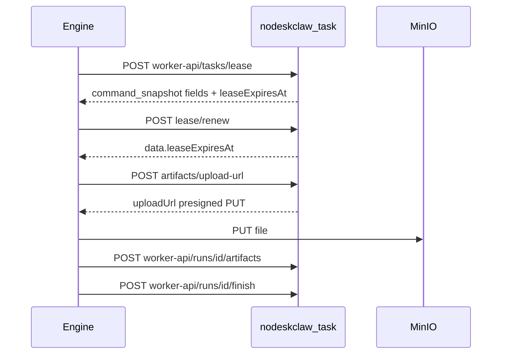

# RPA Phase 5 联调改造（nodeskclaw-task）

> **决策已锁定：** HumanAction 取 **A2**（保留 `HUMAN_OPERATING` / `SUCCESS_MANUAL`）；Artifact 取 **B2**（MinIO/S3 预签名 PUT，对齐 backend `storage_service` 模式）。

**目标：** 消除两个硬阻塞（Lease 缺执行快照、Renew `data=null`），并让 Engine 能投递确定版本的 Mock SRM RunCommand、回传三态结果与证据。

**架构：** 首次 Lease 将完整不可变 `command_snapshot` 写入 `rpa_runs`；后续 renew / 租约过期重投只复用该快照。Binding 创建/更新经 Engine `validate-binding` 回填 `rpa_flow_version_id` + `flow_checksum_snapshot`。Artifact 走 boto3 预签名 PUT。

**技术栈：** FastAPI + SQLAlchemy + Alembic + httpx + boto3（新增）

---

## 前端表现变化

本次改动无前端表现变化（纯 nodeskclaw-task Worker/API/数据层；门户任务状态枚举仍保留 `HUMAN_OPERATING` / `SUCCESS_MANUAL`）。

---

## 现状缺口（已核实）

| 改造单项 | 现状 |
|---|---|
| Lease 快照字段 | [`WorkerLeaseResponse`](nodeskclaw-task/app/schemas/dispatch.py) 仅 7 字段 |
| Renew | [`renew_lease`](nodeskclaw-task/app/api/rpa_dispatch.py) 返回 `data=null`，不拒过期租约 |
| `command_snapshot` / binding version 列 | 模型无此列 |
| finish `WAITING_HUMAN` | [`finish_run`](nodeskclaw-task/app/services/dispatch_service.py) 仅 SUCCESS/FAILED/CANCELLED |
| Step 投影 | 缺 `STEP_FAILED` / `STEP_WAITING_HUMAN` upsert；`STEP_STARTED` 非幂等 |
| HumanAction resume | [`confirm_human_action`](nodeskclaw-task/app/services/human_action_service.py) 仍允许改回 RUNNING |
| Artifact | 本地相对路径，无 MinIO；无 `(run_id, storage_key)` 幂等 |
| validate-binding | Binding CRUD 无 Engine 调用 |



---

## 将修改/新增的文件

- 模型：[`workflow_binding.py`](nodeskclaw-task/app/models/workflow_binding.py)、[`rpa_run.py`](nodeskclaw-task/app/models/rpa_run.py)、[`step_run.py`](nodeskclaw-task/app/models/step_run.py)、[`artifact.py`](nodeskclaw-task/app/models/artifact.py)、[`human_action.py`](nodeskclaw-task/app/models/human_action.py)（索引）、[`enums.py`](nodeskclaw-task/app/models/enums.py)
- Schema/API/Service：[`dispatch.py`](nodeskclaw-task/app/schemas/dispatch.py)、[`rpa_dispatch.py`](nodeskclaw-task/app/api/rpa_dispatch.py)、[`dispatch_service.py`](nodeskclaw-task/app/services/dispatch_service.py)、[`workflow_binding_service.py`](nodeskclaw-task/app/services/workflow_binding_service.py)、[`human_action_service.py`](nodeskclaw-task/app/services/human_action_service.py)、[`artifact_service.py`](nodeskclaw-task/app/services/artifact_service.py)、[`config.py`](nodeskclaw-task/app/core/config.py)、[`.env.example`](nodeskclaw-task/.env.example)、[`pyproject.toml`](nodeskclaw-task/pyproject.toml)
- 新增：`app/services/rpa_engine_client.py`（validate-binding）、`app/services/s3_storage.py`（预签名）
- Alembic：`uv run alembic revision --autogenerate`
- Seed：bindings/templates/portals/tasks（联调 Mock 数据）
- 测试：新增 `tests/test_rpa_phase5_dispatch.py` 等
- Postman：[`tools/Task.postman_collection.json`](tools/Task.postman_collection.json)（若存在乱码则修复）

---

## 任务拆分

### 任务 1：数据模型 + 迁移 + 幂等索引

- `workflow_bindings` 增加 `rpa_flow_version_id VARCHAR(36)`、`flow_checksum_snapshot VARCHAR(64)`（可空；缺则 lease 拒绝）
- `rpa_runs` 增加 `command_snapshot JSONB/Text NOT NULL DEFAULT '{}'`
- Partial Unique Index：`step_runs(run_id, step_id)`、`artifacts(run_id, storage_key)`、同一 `run_id` 仅一个 `PENDING/OPENED` HumanAction（`postgresql_where`）
- 枚举补充：`RunEventType.STEP_WAITING_HUMAN`、`HumanActionType.CAPTCHA_OR_MFA`（保留旧值兼容）
- `WORKER_LEASE_TTL_SECONDS` 默认改为 `60`
- 生成 Alembic 迁移（禁止手写 revision ID）

### 任务 2：Lease 契约 + command_snapshot

扩展 `WorkerLeaseResponse`（全部 required，camelCase 输出）：

`tenantId` / `workflowTemplateId` / `workflowCode` / `rpaEngineType` / `rpaFlowVersion` / `credentialRef` / `config{portalUrl,browserSession}` / `leaseExpiresAt`（及原有字段）

Lease 事务逻辑：

1. `FOR UPDATE SKIP LOCKED` 取 `QUEUED` 任务；校验 Task/Binding/Template/Portal 同租户且可用
2. Binding 缺 `rpa_flow_version_id` 或 `flow_checksum_snapshot` → `BINDING_FLOW_SNAPSHOT_MISSING`
3. 缺 `portalUrl`、browserSession 非 `MANAGED` → 明确业务错误
4. **首次**：创建/取 Run，写入完整 `command_snapshot`，建 WorkerLease，Task/Run → `RUNNING`
5. **重投**（租约过期后）：新 `leaseId`、原 `runId`、**复用**已有 `command_snapshot`，禁止重新读「最新 Binding」
6. 修复过期回收：不仅 `LEASED`，对持有过期 lease 的 `RUNNING` 任务也回 `QUEUED`（Run 保留）
7. 响应从 snapshot 组装，不现场拼「最新配置」

请求体继续接受 Worker snake_case（`AliasChoices` / `populate_by_name`）。

### 任务 3：Renew 返回 leaseExpiresAt

- 新 schema：`WorkerLeaseRenewResponse { lease_expires_at }`
- 校验 `taskId + workerId + leaseId`；租约已过期或不匹配 → 拒绝（非静默成功）
- 原子更新后返回 RFC3339（带时区）`data.leaseExpiresAt`

### 任务 4：Events → StepRun 投影

在 `append_run_event`：

- `STEP_STARTED`：upsert StepRun=`RUNNING`（按 `run_id+step_id`）；`stepName` 缺省用 `stepId`；更新 Run/Task 当前步骤
- `STEP_SUCCEEDED` → `SUCCESS`；`STEP_FAILED` → `FAILED`；`STEP_WAITING_HUMAN` → `WAITING_HUMAN`
- `FLOW_LOG` / `RUNTIME_*`：只存 RunEvent
- **A2**：事件 `WAITING_HUMAN` 不再在此处改 Task 状态/创建 HumanAction（改由 finish 统一处理）；或仅投影 StepRun，避免双建 HumanAction

### 任务 5：Finish 三态 + HumanAction（A2）

`finish_run` 同事务锁定 Run+Task：

- `SUCCESS` / `FAILED`：与改造单一致
- `WAITING_HUMAN`：Run/Task → `WAITING_HUMAN`，`ended_at`；创建 `PENDING` HumanAction（`type=CAPTCHA_OR_MFA`，文案与 `targetUrl=portal_accounts.portal_url` 按改造单）；幂等：同 terminal 重复 finish 成功且不重复建 Action；不同 terminal → Conflict

HumanAction（A2）：

- `open`：Action=`OPENED`，Task → `HUMAN_OPERATING`（保留）
- `confirm` + `resume_running=false`：Action=`CONFIRMED`，Task → `SUCCESS_MANUAL`，**Run 保持 `WAITING_HUMAN`**，不建新 Run、不入队
- `confirm` + `resume_running=true`：返回 `HUMAN_RESUME_NOT_SUPPORTED`（**删除**现有改回 RUNNING 逻辑）
- `cancel`：Action=`CANCELLED`，Task → `CANCELLED`（状态机已允许）

### 任务 6：Artifact MinIO 预签名（B2）

- 依赖增加 `boto3`；配置（占位 example.com，禁止写死内网 IP）：
  - `ARTIFACT_STORAGE=s3|local`
  - `S3_ENDPOINT` / `S3_BUCKET` / `S3_ACCESS_KEY_ID` / `S3_SECRET_ACCESS_KEY` / `S3_REGION` / `S3_KEY_PREFIX`
- `create_upload_url`：`storageKey=tenant/task/run/...`；`generate_presigned_url("put_object")` 返回 Engine 可直传的 `uploadUrl`
- 下载：`get_object` 预签名；`ARTIFACT_STORAGE=local` 保留单测回退
- Worker 登记 metadata：校验 run∈task、storageKey 属本次上传范围；`(run_id, storage_key)` 重复回调幂等成功
- 联调说明：Engine 需能访问 MinIO endpoint；upload-url 现路径仍走 JWT——若 Engine 无 JWT，在 worker-api 增加等价 `upload-url`（校验 worker_id+run）以保证联调

### 任务 7：Binding validate-binding + Seed

- 配置 `RPA_ENGINE_BASE_URL`（默认空；空则 create/update 在要求校验时失败或跳过仅当显式 `RPA_ENGINE_VALIDATE_BINDING=false` 用于单测）
- 创建/更新 Binding：`POST {base}/api/v1/flow-versions/validate-binding`，Header `X-Actor-Id`（+ TENANT 时 `X-Tenant-Id`），Body `rpaFlowId + rpaFlowVersion + workflowCode`（code 来自 **template.code**，禁止用 `task_type`）
- 仅 `valid=true` 时写入 `rpa_flow_version_id` / `flow_checksum_snapshot`（checksum 去 `sha256:` 前缀、小写）
- Seed 补齐联调数据：template `code=srm_fetch_po`；flow `rpa_flow_mock_srm_fetch_po / 1.0.0`；binding `config.browserSession`（`MANAGED`/`chrome`/`CLOSE_ON_FINISH`）；portal `credentialRef` + portalUrl 占位（真实联调 URL 走环境/本地 seed 覆盖，不写死进仓库示例）；三任务 input 保持 `po_no`（勿改 `poNo`）

### 任务 8：测试 + Postman

必测（改造单清单）：

- Lease OpenAPI/schema：新字段 required；renew 返回 `leaseExpiresAt`
- 两 Worker 并发仅一人领到同一任务
- 改 Binding/Portal 后 renew/重投仍用原 snapshot
- 缺版本 / 缺 portalUrl / 非 MANAGED / 过期 renew / Worker 不匹配 → 明确错误
- finish 三态 + 幂等；WAITING_HUMAN 只建一个 HumanAction
- STEP 事件投影；upload-url 预签名（可 mock boto3）+ artifact 幂等
- `resume_running=true` → `HUMAN_RESUME_NOT_SUPPORTED`
- 修复 Postman Worker 示例为真实 snake_case

验证命令：

```bash
cd nodeskclaw-task
uv sync
uv run alembic upgrade head
uv run pytest tests/test_rpa_phase5_dispatch.py tests/test_rpa_phase5_artifacts.py -v
```

---

## 不在本期

- Task 上传 Flow / 启动浏览器 / 返回明文凭据
- Worker API 生产级服务账号鉴权（文档明确后续加固）
- 按类型 A1 把 Task 终态改成纯 `SUCCESS`（已否决）
