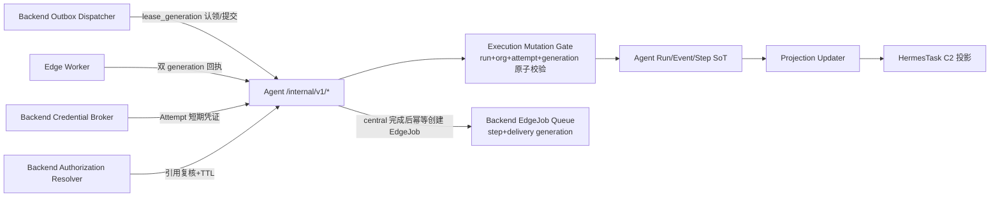

# Skill Run Release Readiness Implementation Plan

## Approved PRD

[docs_agent/prd-v1.3-skill-run-release-readiness.md](docs_agent/prd-v1.3-skill-run-release-readiness.md)（`status: APPROVED`，`review_verdict: PASS`，`approved_at: 2026-08-27T22:28:57+08:00`）。本 Plan 只继承 Owner / Action / Behaviour / AC，不重开架构。

前序：[docs_agent/prd-skill-run-conformance-and-operational-closure-v1.2.md](docs_agent/prd-skill-run-conformance-and-operational-closure-v1.2.md) 及其 [plan](.cursor/plans/skill-run-conformance-closure_dae20329.plan.md)。基线：[lat.md/architecture/skill-agent.md](lat.md/architecture/skill-agent.md)、[lat.md/decisions/skill-platform-execution.md](lat.md/decisions/skill-platform-execution.md)。

实现级 grounding 已确认 PRD Current Capability Inventory 关键断言与当前源码一致，不触发 `PRD_STALE_OR_CONFLICTING`：`resume_run` 仍恢复 `WAITING_APPROVAL`（run_service.py 452–472）；`append_event`/`set_status` 为先查后写且无 generation 校验（226–333、395–449）；hybrid edge dispatch 仍为 `pass`（worker.py 426–429）；`approve_run` 默认审批 ID 且吞异常（488、507–508）；`post_edge_job_events` 缺 generation 放行（internal_edge.py 145–156）；Outbox 无 `lease_generation` 列与授权重放；`connector_router` 仍回退 `arguments.url/db_url`（80、95、118）；Backend 安装调用链仍在（skill_installer.py 108）；Agent 启动仍执行 DDL 且无 alembic 目录；Artifact 默认 `/tmp`；合同 `runs/*` 未纳入 manifest 且 skill-run 无 `--release` 校验。附带发现两个实现缺陷随对应 Todo 修复：`hermes_engine.py` 缺 `settings`/`asyncio` import（Broker 路径 NameError）、`approve_run` 缺 `logger` import。

## 前端表现变化

本次改动无前端表现变化。v1.3 全部为 Backend / Agent 执行平面与合同制品收敛；PRD Non-Goals 明确不修改 `smc-copilot/apps/work` UI，Installations 页的 Desired/Observed/Drift 展示已由 v1.2 交付，本 Plan 不新增或修改任何页面元素。

## Scope

**当前实施切片 = PRD Slice 1（Mutation and State Correctness）**，对应 Todo 1–3。Slice 1 未绿不得开工 Slice 2–5；每个 Slice 的 Triggered Read 在该 Slice 第一个 Todo 开始前才加载。

Slice 1 必须交付（对应 PRD AC 5–10、19–24、41–45）：

- Agent 状态、事件、结果、Artifact、审批事实写入全部改为单语句/同事务原子校验 `run_id + org_id + attempt_id + attempt_generation`；终态声明允许来源且不可互覆；受影响行数为零即 stale，执行者停止后续提交。
- Resume 对 `WAITING_APPROVAL` 稳定拒绝；Approval Decision 引用已存在、未过期、策略摘要匹配且绑定当前 Run/Attempt 的记录，记录持久化失败不推进状态机；Cancel 全分支声明来源状态，无法确认副作用时保留未知证据。
- Outbox 每次认领生成不可复用 Lease Generation，Delivered/Retry/Dead Letter 提交同时匹配 Dispatcher 与 Generation；Dead Letter 重放经 Backend 授权、复用原 `dispatch_id` 并记录 Actor/原因/结果。

**明确不做（PRD Non-Goals / KEEP / Compat）**：

- 不改 `smc-copilot/apps/work`；不改 `contracts/work-expert/v1.0.2/`；C2 投影不出现新状态名（`WAITING_EDGE` 等 Agent 内部状态映射为 C2 既有语义）。
- 不移除 HermesTask C2 投影（Removal Condition 属外部 Work Consumer Migration PRD）。
- KEEP 项不进入 Todo：Run Tenant Binding（`internal_runs.py` 组织头必填已交付）、C2 Projection Contract（`run_projection_updater_service.py` 的 `after_seq` 增量已交付）、Run Create Idempotency（`create_run` 幂等骨架）。
- 不新建第二套 Run/Event/Artifact/Connector/Installation 事实源，不引入消息中间件或第二 Hybrid Orchestrator，不冻结私有函数名与 Alembic Revision ID。

## Immediate Read

Todo 1 开始前只读：

- [nodeskclaw-agent/app/services/run_service.py](nodeskclaw-agent/app/services/run_service.py) `#append_event`（L226–333）/ `#set_status`（L395–449）/ `#store_artifact_bytes`（L612–674）/ `#cancel_run`（L521–549）
- [nodeskclaw-agent/app/services/worker.py](nodeskclaw-agent/app/services/worker.py) `#RunWorker._execute`（L277–429）与 `#_renew_lease`（L249–295）
- [nodeskclaw-agent/app/api/internal_runs.py](nodeskclaw-agent/app/api/internal_runs.py) `#ingest_internal_events`（L136–168）
- [nodeskclaw-agent/tests/test_run_service.py](nodeskclaw-agent/tests/test_run_service.py)（现有 stale attempt / source_event_id 幂等模式）
- [nodeskclaw-agent/tests/test_internal_auth.py](nodeskclaw-agent/tests/test_internal_auth.py)（路由级 fail-closed 模式）

## Triggered Read

| 触发 | 才读 |
|---|---|
| 开始 Todo 2（Cancel/Approval） | `run_service.py#resume_run`（L452–472）/`#approve_run`（L475–518）；`db.py#run_approvals`（L132–142）；`internal_runs.py` `/resume`（L191–210）与 `/approvals/{id}`（L213–233）路由 |
| 开始 Todo 3（Outbox） | `run_dispatch_outbox_service.py` 全文（deliver_entry L62–129、_poll_once L151–170）；`models/hermes_skill/run_dispatch_outbox.py`（L21–71）；`app/api/runs.py` outbox 投影读取处（L102–107）；`HermesRuntimeMetricsService` 所在模块（确认 Backend 指标登记方式）；`tests/hermes_skill/test_run_dispatch_outbox_service.py` |
| 开始 Todo 4–5（Slice 2） | `worker.py#build_hybrid_step_plan`（L29–60）与 `#_claim_one`（L158–247）；`internal_edge.py#claim_edge_job`（L79–121）/`#post_edge_job_events`（L124–196）；`edge_node_service.py#enqueue_edge_job`（L22–62）；`models/connector/edge_job.py`（L21–52）；`edge_worker.py` 全文；`run_projection_updater_service.py` 状态映射段（确认 `WAITING_EDGE` → C2 映射点）；`tests/connector/test_edge_internal.py`、`tests/connector/test_connector_service.py`、`tests/test_edge_worker.py` |
| 开始 Todo 6（Credential/Context） | `hermes_engine.py` 全文（L39–189）；`config.py` Settings 全字段（确认 gateway/broker 配置项）；`runtime_skill_run_service.py#_enrich_route_snapshot`（L334–376）/`#_enqueue_agent_run_outbox`（L169–223）/`#_resolve_release_meta`（L225–308）；`internal_skill_agent.py#mint_credential_lease`（L54–59）；Backend session/workspace/attachment/knowledge 现有可见性与撤权检查所在服务（真实触发时定位）；`tests/test_hermes_engine.py`、`tests/hermes_skill/test_internal_skill_agent.py`、`tests/hermes_skill/test_runtime_skill_run_agent_enqueue.py` |
| 开始 Todo 7（Connector） | `connector_router.py` 全文；SecretStore 注入实现；edge 节点策略 allowlist 来源（instance config）；`tests/test_connector_router.py` |
| 开始 Todo 8（Installation） | `skill_installer.py` 全文；`models/hermes_skill/skill_installation.py`；`installations_router.py` 全文；`internal_edge.py#report_installation_actual`（L205–229）；`tests/hermes_skill/test_skill_installer_profile_path.py`；存量 Installation 数据形态（回填策略） |
| 开始 Todo 9–10（Slice 4） | `db.py#init_schema` 全量 DDL（L13–166）；`main.py#lifespan/#health/#metrics`；`config.py`；`auth.py`；`Dockerfile`；`pyproject.toml`；backend `app/core/config.py#_check_insecure_defaults`（L76–91）；`operation_audit_log.py`；`skill_audit_logger.py` |
| 开始 Todo 11（Slice 5） | `scripts/contracts.py#_artifact_files`（L192–204）/`#check_contracts`（L730–772）/`#generate_skill_run_contracts`（L775–892）；`contracts/skill-run/v1.0.0/` 全目录；`.github/workflows/quality-gate.yml`；`lat.md/architecture/skill-agent.md`、`lat.md/decisions/skill-platform-execution.md` 待更新语句 |
| 合同 fixture 结构不确定 | `contracts/skill-run/v1.0.0/fixtures/` 现有 2 个 fixture 格式 |

## Change Matrix

| File / Symbol | Action | Existing Owner | Target State | PRD Capability | New File? |
|---|---|---|---|---|---|
| `nodeskclaw-agent/app/services/run_service.py#append_event` | REPLACE | Agent | 同事务原子取号 + `attempt_id + generation` 条件写入，零行 = stale | Execution Mutation Fencing | no |
| `append_event` 先 SELECT attempt 再无条件写入（L236–244） | REMOVE | Agent | 删除独立 SELECT 授权路径 | Execution Mutation Fencing | no |
| `nodeskclaw-agent/app/services/run_service.py#set_status` | REPLACE | Agent | 单语句 CAS：`attempt_id + generation + expected_status` 白名单；终态隐式 `NOT IN TERMINAL` | Execution Mutation Fencing | no |
| 分散的无条件/半条件写入（ingest 不传 attempt、终态不带 expected_status） | REMOVE | Agent | 全部写路径收敛到统一条件写 | Execution Mutation Fencing | no |
| `nodeskclaw-agent/app/services/run_service.py#store_artifact_bytes` | MODIFY | Agent | 强制 attempt + generation；descriptor INSERT 与 `artifact_ready` 同事务 | Execution Mutation Fencing | no |
| `nodeskclaw-agent/app/api/internal_runs.py#ingest_internal_events` | MODIFY | Agent | 全部写入携带 attempt/generation 并经统一门禁 | Execution Mutation Fencing | no |
| `nodeskclaw-agent/app/services/worker.py#RunWorker`（写路径 + `_renew_lease`） | MODIFY | Agent | 全部写入携带 attempt + generation；续租零行立即中断引擎并隔离后续提交 | Execution Mutation Fencing | no |
| `nodeskclaw-agent/app/services/run_service.py#resume_run` | REPLACE | Agent | `WAITING_APPROVAL` 稳定 409 拒绝且不产生事件；仅恢复非审批暂停 | Approval Decision | no |
| 通用 Resume 恢复 `WAITING_APPROVAL`（L463–472）与默认审批 ID `appr-{run_id}`（L488） | REMOVE | Agent | 审批只接受已有记录的显式决策 | Approval Decision | no |
| `nodeskclaw-agent/app/services/run_service.py#approve_run` + `run_approvals` 表 | MODIFY | Agent | 增 `actor_id`/`decision_reason`/`idempotency_key`/`expires_at`/`policy_digest`；待审批记录先行存在，决策条件写入，冲突 409 | Approval Decision | no |
| `approve_run` 的 `except Exception` 吞错（L507–508） | REMOVE | Agent | 记录失败即整体失败，不静默恢复执行 | Approval Decision | no |
| `nodeskclaw-agent/app/services/run_service.py#cancel_run` | MODIFY | Agent | 全分支 `expected_status` 白名单；CANCELLING 有界确认；超时保留未知副作用证据 | Cancel State Machine | no |
| `nodeskclaw-backend/app/models/hermes_skill/run_dispatch_outbox.py` + `run_dispatch_outbox_service.py#deliver_entry` | MODIFY | Backend Outbox Dispatcher | 增 `lease_generation` 列；Delivered/Retry/Dead Letter 提交带 `dispatcher_id + lease_generation` 条件，零行放弃 | Dispatch Outbox | no |
| `nodeskclaw-backend/app/api/runs.py` Dead Letter 重放端点 | ADD | Backend | 授权重放复用原 `dispatch_id` 与 Run 创建幂等，记录 Actor/原因/结果 | Dispatch Outbox | no |
| Outbox 指标与审计（深度/延迟/错误分类/重试/接管/死信/重放） | ADD | Backend | 复用既有指标服务与 OperationAuditLog，不建第二套 | Dispatch Outbox | no |
| `nodeskclaw-agent/app/services/worker.py#build_hybrid_step_plan` + `_execute` hybrid 分支 | REPLACE | Agent Hybrid Orchestrator | Step Plan 持久化推进；central 完成后幂等派发 edge Step；Run 保持非终态至全部必需 Step 接受终态 | Hybrid Orchestration | no |
| hybrid 段 `pass` 空操作（L426–429） | REMOVE | Agent Hybrid Orchestrator | 删除 no-op 分支 | Hybrid Orchestration | no |
| `nodeskclaw-agent/app/db.py` `run_steps` 表（Slice 4 纳入 Alembic 基线） | ADD | Agent | 持久化 Step ID/Owner/依赖/状态/attempt_generation/Edge 引用 | Hybrid Orchestration | no |
| `nodeskclaw-backend/app/api/internal_edge.py` 幂等创建 EdgeJob 端点 | ADD | Backend Edge Queue | 稳定键 `run_id + step_id + attempt_generation` 重复请求返回原 Job | Hybrid Orchestration | no |
| `nodeskclaw-backend/app/models/connector/edge_job.py` + `edge_node_service.py#enqueue_edge_job` | MODIFY | Backend Edge Queue | 增 `step_id`/`attempt_generation` 列；幂等键扩展为 run + step + generation | EdgeJob Transport | no |
| `nodeskclaw-backend/app/api/internal_edge.py#post_edge_job_events` | REPLACE | Backend Edge Queue | `delivery_generation` 必填且与当前值一致，缺失与不匹配统一拒绝整批 | Edge Delivery Fencing | no |
| `req_gen is None` 放行分支（L145–156） | REMOVE | Backend Edge Queue | 删除缺失放行 | Edge Delivery Fencing | no |
| `nodeskclaw-agent/app/services/edge_worker.py#_spool_events/#_flush_spool` | MODIFY | Agent Edge Worker | Spool 记录携带 `delivery_generation`，重放不丢代次；取消/失败回执全程携带 | EdgeJob Transport | no |
| Agent ingest 的 Edge 身份原子校验 | MODIFY | Agent Run SoT | 单事务校验组织/Run/Attempt/Step/EdgeJob/节点 + 两类 generation | Edge Delivery Fencing | no |
| `nodeskclaw-agent/app/services/hermes_engine.py#fetch_credential_lease/#execute_hermes_run` | MODIFY | Agent | Broker 失败/拒绝/scope 不匹配时副作用前 fail-closed；顺带修复缺失的 `settings`/`asyncio` import | Credential Lease | no |
| Snapshot 凭证回退（`credential_lease/gateway_token/api_token` 读取 L121–127、`gateway_url` 回退 L85–89） | REMOVE | Agent | 删除全部可用凭证回退；gateway 地址改由 Agent 自身配置提供 | Credential Lease | no |
| `nodeskclaw-backend/app/services/hermes_skill/runtime_skill_run_service.py#_enrich_route_snapshot/#_enqueue_agent_run_outbox` | MODIFY | Backend Authorization Resolver | Snapshot 只留 `credential_lease_ref` 与不可变 Context Ref；payload 携带 session/workspace/attachment 引用 | Run Context Resolution | no |
| `nodeskclaw-backend/app/api/internal_skill_agent.py` 引用复核端点 | ADD | Backend Authorization Resolver | 批量复核组织/可见性/版本/内容哈希/撤权，输出有界 TTL 授权决定 | Run Context Resolution | no |
| `nodeskclaw-agent/app/services/worker.py` 执行前引用复核 | MODIFY | Agent | 首次使用前调用复核端口；Attempt 内 TTL 缓存；失效以稳定分类终止且解析内容不持久化 | Run Context Resolution | no |
| `nodeskclaw-agent/app/services/connector_router.py#execute_connector_run` 地址回退（L80/95/118） | REPLACE | Agent Runtime Guard | 目标仅来自可信发布快照，缺失配置立即失败 | Connector Route Guard | no |
| `arguments.url/db_url` 回退 | REMOVE | Agent Runtime Guard | 删除回退，历史输入只保留为拒绝 Fixture | Connector Route Guard | no |
| `connector_router.py#_validate_ssrf`（L18–36） | REPLACE | Agent Runtime Guard | DNS 解析后逐 IP 网络策略校验；显式不跟随重定向并对 3xx 拒绝；edge 仅节点 allowlist | Connector Route Guard | no |
| DB 分支仅 `READ_ONLY_SQL_RE` 前缀门禁（L15、122–130） | REPLACE | Agent | 会话级 `READ ONLY` + statement_timeout + 行数/字节/并发上限 | Database Read-only | no |
| `READ_ONLY_SQL_RE` 作为只读证明 | REMOVE | Agent | 降级为前置提示，不再单独授权执行 | Database Read-only | no |
| `nodeskclaw-backend/app/services/hermes_skill/skill_installer.py#install/#_execute_file_operation` | REPLACE | Backend | 安装入口只写 Desired State 与 Desired Generation | Installation Execution | no |
| Backend 生产文件安装/清理路径（L257–289） | REMOVE | Backend | v1.3 GA 前从生产调用链移除 | Installation Execution | no |
| `nodeskclaw-backend/app/models/hermes_skill/skill_installation.py` + `installations_router.py` | MODIFY | Backend | 增 desired/actual generation；create 先定 target_kind 再写 Desired | Installation Execution | no |
| `nodeskclaw-backend/app/api/internal_edge.py` installations Desired pull + Actual 提交 generation 校验 | ADD | Backend | edge 拉取/上报携带 generation，过期拒绝 | Installation Reconcile | no |
| `nodeskclaw-backend/app/api/internal_skill_agent.py` central remote target Desired pull / Actual report 端点 | ADD | Backend | central Agent 调谐 remote target 的内部端口 | Installation Reconcile | no |
| `nodeskclaw-agent/app/services/worker.py` + `edge_worker.py` reconcile 循环 | ADD | Agent Actual Executor | 按 target 归属与 generation 幂等安装/升级/卸载并回报 Actual | Installation Reconcile | no |
| `nodeskclaw-agent/alembic/`（`alembic.ini` + `env.py` + `versions/`） | ADD | Agent Alembic | 迁移链基线 = 现有结构全量 + 本 Plan 新增列 | Agent Schema Lifecycle | yes |
| `nodeskclaw-agent/app/db.py#init_schema` 启动 DDL（L13–166） | REPLACE | Agent | 生产启动零 DDL，仅校验迁移版本 | Agent Schema Lifecycle | no |
| `init_schema` 的 CREATE/ALTER 语句 | REMOVE | Agent | DDL 全量收归迁移链 | Agent Schema Lifecycle | no |
| `nodeskclaw-agent/app/main.py#lifespan` | MODIFY | Agent | 启动校验 alembic head 与生产配置门禁 | Agent Schema Lifecycle | no |
| `nodeskclaw-agent/app/services/run_service.py#store_artifact_bytes` + `app/config.py` | MODIFY | Agent | Artifact 字节走持久化 Storage Port；生产未配置持久层启动失败 | Artifact Persistence | no |
| `/tmp` 默认 Artifact 目录（`config.py` L14） | REMOVE | Agent | 生产配置无临时目录回退 | Artifact Persistence | no |
| `nodeskclaw-agent/app/main.py#health/#metrics` | MODIFY | Agent | liveness/readiness 分离；readiness 覆盖 DB/迁移版本/Artifact 存储/Credential Broker/Worker freshness | Health and Metrics | no |
| Agent 指标与稳定审计事件分类 | ADD | Agent Event Log | 覆盖队列/租约/代次冲突/Step/Spool/审批/取消/调谐/Artifact/依赖健康；审计正文不落密钥 | Agent Execution Audit Evidence | no |
| `nodeskclaw-backend/app/models/operation_audit_log.py` + `skill_audit_logger.py` | MODIFY | Backend OperationAuditLog | 增 `source_event_id`，按来源事件 ID 幂等投影执行证据 | Backend Operation Audit | no |
| `nodeskclaw-agent/app/config.py` + `app/auth.py`；`nodeskclaw-backend/app/core/config.py#_check_insecure_defaults` | MODIFY | Backend + Agent | 生产默认/空 Token fail-fast（Backend 纳入 `_INSECURE_DEFAULTS`） | Internal Service Identity | no |
| 默认共享 Token 可生产启动 | REMOVE | Backend + Agent | 生产 fail-closed 启动门禁 | Internal Service Identity | no |
| `nodeskclaw-backend/scripts/contracts.py#_artifact_files/#generate_skill_run_contracts/#check_contracts` | MODIFY | Backend Contract Package | 补 `runs/*` 等 glob；skill-run `--release` 校验工作树干净 + commit 匹配 + Tag 指向同一提交 | Skill Run Contract Package | no |
| `nodeskclaw-backend/contracts/skill-run/v1.0.0/` 制品（经生成入口） | MODIFY | Backend Contract Package | 补 Attempt/Approval/Edge Delivery/Error 等全量 Schema 与双端共享 Fixture | Skill Run Contract Package | no |
| 不完整 Manifest 与仅开发态检查 | REMOVE | Backend Contract Package | 制品遗漏/额外/哈希/commit/Tag 不一致均失败 | Skill Run Contract Package | no |
| `.github/workflows/quality-gate.yml` | MODIFY | CI | 增 skill-run `check --release` 门禁与双端合同验证 | Cross-service Release Evidence | no |
| 发布证据测试（真实 PG 并发、双 Pod 接管、故障注入、Spool 重放） | MODIFY | Backend + Agent CI | 扩展现有测试文件形成可重复 Release Evidence | Cross-service Release Evidence | no |
| `lat.md/architecture/skill-agent.md` + `lat.md/decisions/skill-platform-execution.md` | MODIFY | 文档 | 同步 Mutation Gate / Hybrid / Connector / Installation / Schema 目标语义 | Skill Run Contract Package | no |

## Implementation Decisions

PRD 未冻结、Plan 决定的技术选型（均按最小方案梯子，延续 v1.2 已决项不重复论证）：

1. **Mutation Gate 形态**：不新建 gate 模块。`set_status` 改为单条 `UPDATE runs SET ... WHERE id=:run_id AND org_id=:org_id AND attempt_id=:aid AND generation=:gen AND status IN (:allowed_from)`；终态写入隐式追加 `status NOT IN TERMINAL`。`append_event` 同事务内先条件 UPDATE 取号（`WHERE id AND attempt_id AND generation`）再 INSERT 事件。所有写路径返回受影响行数，零行即抛稳定 stale 分类。
2. **结果写入**：`set_status` 的 `result` 参数与状态同事务写入（现状已同事务），Artifact descriptor INSERT 与 `runs.artifact_ready` 同事务，禁止分两次提交。
3. **审批记录生命周期**：Run 进入 `WAITING_APPROVAL` 时同事务插入 `run_approvals` 待决策行（`decision=PENDING`、含 `policy_digest`/`expires_at`）；`approve_run` 对该行做条件 UPDATE 写入 Actor/决策/理由/幂等键，重复相同决策幂等返回，冲突决策 409。`resume_run` 对 `WAITING_APPROVAL` 返回 409 且不写任何事件。
4. **Cancel 证据**：取消无法确认外部副作用时写 `run.cancel_unconfirmed` 事件（含已通知 Owner 清单），Run 保持 `CANCELLING` 至有界超时后由门禁拒绝后续写入；不伪造 `CANCELLED`。
5. **Outbox Lease Generation**：`run_dispatch_outbox` 加 `lease_generation INTEGER NOT NULL DEFAULT 0`（Backend Alembic autogenerate），认领时 `+1`；`deliver_entry` 的 Delivered/Retry/Dead Letter 提交均为条件 UPDATE。重放端点 `POST /api/v1/runs/{run_id}/dispatch/replay` 放现有 `app/api/runs.py`（复用 `_authorize_run` 授权与 Actor 上下文），重置原 entry 为待投递并写 OperationAuditLog。Outbox 指标登记到现有 Backend 指标服务（Triggered Read 确认其形态），不新增依赖。
6. **Hybrid Step Plan**：`create_run` 冻结 `snapshot.step_plan`（复用 `build_hybrid_step_plan` 纯函数）；`run_steps` 表（`run_id, step_id, owner_role, depends_on, status, attempt_generation, edge_job_id, delivery_generation, updated_at`，唯一 `(run_id, step_id)`）持久化推进状态，重启后由 `run_steps` + Event Log 恢复。`WAITING_EDGE` 为 Agent 内部状态，Projection 侧映射为 C2 既有运行中语义。
7. **EdgeJob 幂等键**：`enqueue_edge_job` 幂等键从 `org+node+run+tool` 扩展为 `run_id + step_id + attempt_generation`；`EdgeJob` 增 `step_id`/`attempt_generation` 列（Backend Alembic autogenerate）。新端点 `POST /internal/edge/jobs` 落现有 `internal_edge.py`。
8. **Edge Spool 代次**：`_spool_events` 记录结构增 `delivery_generation`，`_flush_spool` 按原代次重放；Backend 拒绝旧代次时 Spool 条目转入死信事件并停止重放（防无限循环）。
9. **Credential fail-closed**：`fetch_credential_lease` 失败/拒绝/scope 不匹配时抛稳定失败分类，Run 在引擎调用前终止；删除 `execute_hermes_run` 对 snapshot `credential_lease/gateway_token/api_token/gateway_url` 的全部读取，gateway 地址统一取 Agent `settings`；同 Todo 修复 `hermes_engine.py` 缺失的 `settings`/`asyncio` import 与 `approve_run` 缺失的 `logger` import（Grounding 发现的现存缺陷）。
10. **Run Context 复核**：Backend 在现有 `internal_skill_agent.py` 增 `POST /internal/skill-agent/resolve-refs`，批量校验 Session/Workspace/Attachment/Knowledge/Policy 引用的组织、可见性、版本、内容哈希与撤权状态，返回带 TTL 的授权决定；Agent 在 Worker 执行副作用前调用，结果仅在当前 Attempt + TTL 内缓存；`_enqueue_agent_run_outbox` payload 补齐 session/workspace/attachment 引用。复核失败以稳定分类终止 Run，解析内容不落盘。
11. **Connector 门禁**：删除 `arguments.url/db_url` 回退；`_validate_ssrf` 重写为 `getaddrinfo` 解析后逐 IP 校验（loopback/link-local/metadata/multicast/保留段/未授权私网 + edge 节点 allowlist）；httpx 显式 `follow_redirects=False`，3xx 一律拒绝并审计；DB 分支连接后 `SET TRANSACTION READ ONLY` + `SET statement_timeout`，逐行 fetch 计数行数/字节，超限中断；`READ_ONLY_SQL_RE` 仅作前置提示。
12. **Installation 迁移**：`HermesSkillInstallation` 增 `desired_generation`/`actual_generation`（Backend Alembic autogenerate，存量回填 `desired_generation=1`）；`install` 只写 Desired + generation bump；central Agent 经 `internal_skill_agent.py` 新端点、Edge Worker 经 `internal_edge.py` 新端点拉取/回报；`_execute_file_operation`/`_execute_file_cleanup` 在 Agent 调谐证据齐备后从生产调用链熔断删除（本 Plan Todo 8 内完成）。同一 Installation 任一时刻只有一个 Executor。
13. **Agent Alembic**：`nodeskclaw-agent/alembic/` 由 `alembic init` 生成；baseline revision = 现有 `init_schema` 全量结构 + 本 Plan 新增列（`run_steps`、`run_approvals` 扩展列等）；lifespan 只比对 `alembic_version` 与 head，不执行 DDL；存量部署用 `alembic stamp` 演练；Dockerfile 补装 alembic。过渡期内 Slice 1–3 的新列先经 `init_schema` ALTER 落地，Todo 9 统一收编进基线（与 v1.2 过渡策略一致）。
14. **Artifact 与探针**：沿用 `SKILL_AGENT_ARTIFACT_DIR` Storage Port 机制；生产模式（`SKILL_AGENT_ENV=production`）未显式配置持久路径则启动失败。`/health` 保留为 liveness，新增 `/ready`（DB + 迁移版本 + 存储可写 + Broker 可达 + Worker loop freshness 时间戳）。
15. **指标与审计**：Agent 引入 `prometheus_client` 单依赖输出 `/metrics`（PRD 明确 capability，进程内库不引入新基础设施）；Agent 执行审计以稳定事件分类写入 Event Log（授权/认领/路由/审批/取消/代次拒绝/调谐/终态）；Backend `OperationAuditLog` 增 `source_event_id` 列与 Partial Unique Index，投影写入幂等。
16. **合同发布**：`_artifact_files` 补 `runs/*.schema.json` 等 glob；`generate_skill_run_contracts` 补 Attempt/Approval/Edge Delivery/Error Schema 与双端共享 Fixture；`check --release` 对 skill-run 启用 work-expert 同级校验（工作树干净、`manifest.backendCommit == HEAD`、`skill-run-contract-v1.0.0` Tag 存在且指向 HEAD、双端测试通过）。Tag 创建走人工 release 流程，CI 只验证。
17. **发布证据**：并发/竞争测试沿用 Agent 测试现有 PG schema 隔离模式与真实 PostgreSQL；跨 Pod 接管用双 `RunWorker`/`EdgeWorker` 实例竞争同一 Run/EdgeJob；故障注入用依赖替换模拟 DB 中断、存储不可用、Broker 拒绝、Context 撤权、Worker 崩溃、Edge 断线与租约丢失。全部扩展现有测试文件。

## New File Justification

仅一处 `New File? = yes`：

- **`nodeskclaw-agent/alembic/`（`alembic.ini`、`env.py`、`versions/`）**
  - 承载 Capability：Agent Schema Lifecycle（PRD REPLACE 项：启动 DDL → 版本化迁移链）。
  - 现有 Owner 不能承担：`db.py#init_schema` 是被 REPLACE 的旧机制，不能同时充当迁移链载体；Backend 的 `alembic/` 管理 backend schema，跨服务复用会破坏 Agent 独立执行内核边界。
  - 非偏好性拆分：Alembic 强制 ini + env + versions 目录结构，属生成入口产物（`alembic init` / `alembic revision --autogenerate`），不手写业务逻辑。
  - 单一 Owner：迁移链 Owner 仍是 Agent（agent schema），不形成第二事实源。

其余 ADD 项（EdgeJob 创建端点、resolve-refs、Desired pull/Actual report、reconcile 循环、指标、重放端点、审计投影）全部落在现有文件内。Backend 迁移文件经 `alembic revision --autogenerate` 生成入口产出，合同制品经 `scripts/contracts.py` 生成入口产出，均不逐项列入预算。

## Todo 1 — Execution Mutation Gate 原子化全写路径

**Goal**

状态、事件、结果、Artifact 写入全部改为原子校验 `run_id + org_id + attempt_id + attempt_generation`；终态声明允许来源且不可互覆；零行生效即 stale，执行者停止后续提交（AC 5–10）。

**Immediate anchors**

- `nodeskclaw-agent/app/services/run_service.py#append_event/#set_status/#store_artifact_bytes`
- `nodeskclaw-agent/app/services/worker.py#RunWorker._execute/#_renew_lease`
- `nodeskclaw-agent/app/api/internal_runs.py#ingest_internal_events`

**Changes**

- `set_status` 单语句 CAS（`attempt_id + generation + expected_status` 白名单 + 终态隐式保护）；`append_event` 同事务条件取号；`store_artifact_bytes` 强制 attempt + generation 且 descriptor 与 `artifact_ready` 同事务。
- ingest 全部写入携带 attempt/generation 并走统一入口；worker 所有写路径携带当前 Attempt 身份；续租 `rowcount==0` 立即设置取消事件并停止引擎后续提交。
- 真实 PostgreSQL 并发测试：100 协程写事件序号连续唯一；generation 变化后旧 Worker 全部写入零行/拒绝；五类终态竞争只有一个获胜者。

**Stop conditions**

- [ ] 每个写路径原子验证四元组身份，静态检查无绕过（无残留先查后写）
- [ ] 并发、租约接管、终态竞争测试在真实 PG 通过
- [ ] `cd nodeskclaw-agent && uv run pytest` 绿

**Triggered reads**

- 无（Immediate Read 已覆盖）

## Todo 2 — Cancel / Resume / Approval 状态机分离

**Goal**

通用 Resume 永久拒绝 `WAITING_APPROVAL`；Approval Decision 引用已存在、未过期、策略匹配的记录且先持久化后推进；Cancel 全分支声明来源状态，无法确认副作用保留未知证据（AC 19–24）。

**Immediate anchors**

- `nodeskclaw-agent/app/services/run_service.py#resume_run/#approve_run/#cancel_run`
- `nodeskclaw-agent/app/db.py#run_approvals`

**Changes**

- `resume_run` 对 `WAITING_APPROVAL` 返回 409（稳定分类，不写事件）；仅恢复非审批暂停。
- `run_approvals` 增 `actor_id`/`decision_reason`/`idempotency_key`/`expires_at`/`policy_digest`（过渡期 `init_schema` ALTER）；进入 `WAITING_APPROVAL` 同事务插待决策行；`approve_run` 条件 UPDATE 决策，冲突 409，写失败抛错不推进；删除默认审批 ID 与 `except Exception` 吞错，补 `logger` import。
- `cancel_run` 全分支 `expected_status` 白名单；执行中取消传播当前 central/edge Owner；超时写 `run.cancel_unconfirmed` 证据；取消后旧写入由 Todo 1 门禁拒绝。

**Stop conditions**

- [ ] Resume 绕过/审批过期/冲突决策/策略变化/记录失败五组拒绝测试绿
- [ ] 取消后旧 Worker 与 Edge 回执不能写入任何执行事实

**Triggered reads**

- `internal_runs.py` `/resume` 与 `/approvals/{id}` 路由错误映射现状

## Todo 3 — Outbox Lease Generation 门禁与授权重放

**Goal**

每次认领生成不可复用 Lease Generation；Delivered/Retry/Dead Letter 提交同时匹配 Dispatcher 与 Generation；旧 Dispatcher 提交零行生效；Dead Letter 授权重放不重复创建 Run（AC 41–45）。

**Immediate anchors**

- `nodeskclaw-backend/app/services/hermes_skill/run_dispatch_outbox_service.py#RunDispatchOutboxService`
- `nodeskclaw-backend/app/models/hermes_skill/run_dispatch_outbox.py`

**Changes**

- 模型增 `lease_generation`，认领 `+1`；`deliver_entry` 全部提交改条件 UPDATE（`dispatcher_id + lease_generation`）。
- `app/api/runs.py` 增授权重放端点：复用原 `dispatch_id` 与 Run 幂等，记录 Actor/原因/结果到 OperationAuditLog；未授权重放拒绝且不改变状态。
- 指标登记：队列深度、投递延迟、错误分类、重试、租约接管、死信、重放结果。

**Stop conditions**

- [ ] 租约接管后旧 Dispatcher 提交零行且不覆盖新租约状态
- [ ] 授权重放返回原 Run，重复重放不重复创建；未授权重放拒绝并留审计
- [ ] `cd nodeskclaw-backend && uv run pytest tests/hermes_skill/test_run_dispatch_outbox_service.py tests/hermes_skill/test_employee_runs_api.py` 绿

**Triggered reads**

- `HermesRuntimeMetricsService` 所在模块（指标登记形态）；backend `tests/conftest.py` fixture 模式

## Todo 4 — Hybrid Step Plan 持久化与幂等 EdgeJob Transport

**Goal**

`create_run` 冻结 Step Plan；central 完成后真实创建幂等 EdgeJob，Run 保持非终态；仅 Agent 在全部必需 Step 接受终态后写唯一最终结果（AC 11–12、18）。

**Changes**

- snapshot 冻结 `step_plan`；`run_steps` 表持久化 Step 状态/Owner/代次/Edge 引用（过渡期 `init_schema`）；worker hybrid 分支调 Backend `POST /internal/edge/jobs`（幂等键 `run_id + step_id + attempt_generation`）。
- `EdgeJob` 增 `step_id`/`attempt_generation`；`enqueue_edge_job` 幂等键扩展；Run 进入 `WAITING_EDGE`（内部状态，C2 映射运行中）。
- 重启恢复：`run_steps` + Event Log 重建执行位置，已确认 Step 不重复副作用。

**Stop conditions**

- [ ] hybrid run 在 edge Step 完成前保持非终态；重复派发返回原 Job
- [ ] central/Backend/Edge 任一进程重启后恢复且不重复执行
- [ ] 全部必需 Step 接受终态后 Agent 写唯一 Run 结果

**Triggered reads**

- `run_projection_updater_service.py` 状态映射段（`WAITING_EDGE` → C2 映射点）；`tests/connector/test_connector_service.py` 幂等模式

## Todo 5 — Edge Delivery Envelope 强制与跨 Pod 接管

**Goal**

Edge 认领、续租、事件、结果、Artifact、取消回执全程携带非空 Delivery Generation；缺失/过期整批拒绝；两个 Pod 竞争同一 EdgeJob 只有一个有效租约（AC 13–17）。

**Changes**

- `post_edge_job_events` 强制 `delivery_generation` 必填且一致，删除 `req_gen is None` 放行。
- EdgeWorker Spool 记录携带代次，按原代次重放；Backend 拒绝旧代次时转死信事件停止重放。
- Agent ingest 单事务校验组织/Run/Attempt/Step/EdgeJob/节点 + 两类 generation。

**Stop conditions**

- [ ] 缺失/过期 generation 双重拒绝（Backend + Agent）测试绿
- [ ] 双 EdgeWorker 竞争同一 Job 只有一个可提交；断线 Spool 恢复后按事件 ID 幂等重放

**Triggered reads**

- `edge_worker.py` 全文；`tests/test_edge_worker.py`、`tests/connector/test_edge_internal.py`

## Todo 6 — Credential fail-closed 与 Run Context 使用前复核

**Goal**

Snapshot 只保存 `credential_lease_ref` 与不可变 Context Ref；Broker 失败时 Run 在副作用前失败；Session/Workspace/Attachment/Knowledge/Policy 引用首次使用前完成复核（AC 46–49）。

**Changes**

- 删除 `execute_hermes_run` 的 snapshot 凭证/地址回退；`fetch_credential_lease` 失败抛稳定分类；修复 `hermes_engine.py` 缺失 import。
- `runtime_skill_run_service` snapshot 剔除 `gateway_url`、payload 补齐 session/workspace/attachment 引用。
- Backend `internal_skill_agent.py` 增 resolve-refs 端点；Agent 执行前批量复核 + Attempt 级 TTL 缓存，失效稳定终止，解析内容不持久化。

**Stop conditions**

- [ ] Broker 不可用/拒绝/scope 不匹配时 Run 在引擎调用前失败，无凭证回退
- [ ] 被撤权/哈希变化引用不能进入执行输入；临时 URL/Token/解密内容不出现在 Snapshot/Event/Artifact/审计

**Triggered reads**

- Backend session/workspace/attachment/knowledge 可见性与撤权检查所在服务；`tests/test_hermes_engine.py`、`tests/hermes_skill/test_internal_skill_agent.py`

## Todo 7 — Connector 固定路由与网络/数据库门禁

**Goal**

REST/MCP/DB 目标仅来自可信发布快照；DNS 逐 IP 与重定向逐跳校验；DB 会话级只读与资源上限（AC 25–28）。

**Changes**

- 删除 `arguments.url/db_url` 回退，缺失配置立即失败；历史输入转为拒绝 Fixture。
- `_validate_ssrf` 重写：解析后逐 IP 策略 + `follow_redirects=False` + 3xx 拒绝；edge 仅节点 allowlist。
- DB 分支：`SET TRANSACTION READ ONLY` + statement_timeout + 行/字节/并发上限；无法建立只读约束即拒绝，不降级前缀判断。

**Stop conditions**

- [ ] SSRF/参数覆盖/写操作/资源超限/重定向五组拒绝测试绿（`test_connector_router.py` 扩展）
- [ ] 静态搜索证明无业务参数地址回退残留

**Triggered reads**

- SecretStore 注入实现；edge 节点 allowlist 配置来源

## Todo 8 — Installation Desired/Actual Reconcile

**Goal**

Backend 只写 Desired State 与 generation；central/edge Agent 按归属与 generation 幂等调谐并回报 Actual；Backend 生产文件副作用从调用链移除（AC 29–32）。

**Changes**

- `HermesSkillInstallation` 增 desired/actual generation（存量回填 1）；`install` 只写 Desired；create 先定 target_kind。
- `internal_edge.py` 增 Desired pull（含 generation/digest），Actual 提交校验 generation；`internal_skill_agent.py` 增 central remote target 对应端点。
- worker/edge_worker 增 reconcile 循环：同 generation 重放不重复副作用，过期 Actual 不覆盖新 Desired；`_execute_file_operation` 生产路径熔断删除。

**Stop conditions**

- [ ] Backend 无生产文件写/删路径（静态搜索证明）
- [ ] 重启/重复/中断后调谐收敛；失败分类、可重试性与最后证据可查询

**Triggered reads**

- 存量 Installation 数据形态（回填验证）；`tests/hermes_skill/test_skill_installer_profile_path.py`

## Todo 9 — Agent Alembic 迁移链与零 DDL 启动

**Goal**

Alembic 是 Agent 结构变更唯一 Owner；空库/存量库/多 Pod 启动走同一迁移链；生产启动零 DDL（AC 33–34）。

**Changes**

- `alembic init` 生成 `nodeskclaw-agent/alembic/`；baseline = 现有结构全量 + Slice 1–3 过渡列收编；lifespan 只校验 head；Dockerfile 补装 alembic。
- 存量库 `alembic stamp` + `upgrade` 演练；升级前后 Schema diff 与回滚演练。

**Stop conditions**

- [ ] 空库创建、存量升级、失败回滚、双 Pod 并行启动全部通过
- [ ] 生产启动日志无任何 DDL 执行

**Triggered reads**

- `db.py#init_schema` 全量 DDL；`main.py#lifespan`；`Dockerfile`；`pyproject.toml`

## Todo 10 — Artifact 持久化、探针、指标、审计与 Token 门禁

**Goal**

生产 Artifact 无 `/tmp` 回退；liveness/readiness 分离且 readiness 指明依赖类别；指标与审计覆盖执行面；默认/空 Token 生产 fail-fast（AC 35–40、50）。

**Changes**

- 生产模式未配置持久 Artifact 路径启动失败；Pod 重启后按描述符读取并验证校验和。
- `/health` = liveness，新增 `/ready`（DB/迁移/存储/Broker/Worker freshness）；`prometheus_client` 指标覆盖 PRD 清单。
- Agent 稳定审计事件分类；Backend `OperationAuditLog` 增 `source_event_id` 幂等投影；双端审计正文不落密钥。
- Backend `_INSECURE_DEFAULTS` 纳入 `SKILL_AGENT_INTERNAL_TOKEN`；Agent 生产模式默认/空 Token 启动失败。

**Stop conditions**

- [ ] 依赖故障注入时 readiness 指明类别并拒绝新 Run，liveness 仍存活
- [ ] 默认 Token 双端启动失败；审计扫描无 Secret/临时 URL
- [ ] current/previous Token 轮换期间双端连续通信，撤销旧 Token 立即失败

**Triggered reads**

- `config.py`/`auth.py`/`main.py` 全量；backend `app/core/config.py#_check_insecure_defaults`；`operation_audit_log.py`；`skill_audit_logger.py`

## Todo 11 — 合同发布、CI 门禁、发布证据与 lat.md 同步

**Goal**

UNRELEASED `v1.0.0` 完整生成并具备首次发布条件；Release Check 绑定干净提交与不可变 Tag；发布证据全部门禁通过（AC 51–59）。

**Changes**

- `_artifact_files` 补 `runs/*` 等 glob；生成 Attempt/Approval/Edge Delivery/Error Schema 与双端共享 Fixture；skill-run `--release` 启用工作树/commit/Tag 校验。
- `quality-gate.yml` 增 `check --release` 与双端合同验证。
- 发布证据：真实 HTTP、PG 并发、双 Pod 接管、Edge 断线 Spool 重放、依赖故障注入测试全部纳入 CI。
- 更新 `lat.md` 两处旧语义（启动 DDL、SQL 前缀只读、Backend 直接安装、hybrid no-op 等）；`lat check` 通过。

**Stop conditions**

- [ ] `python nodeskclaw-backend/scripts/contracts.py check --release` 在干净提交通过；制品缺失/哈希不符/Tag 缺失时非零退出
- [ ] 独立 checkout 可重复验证；故障注入与接管证据齐全
- [ ] `lat check` 通过

**Triggered reads**

- `scripts/contracts.py` 全文；`contracts/skill-run/v1.0.0/` 全目录；`.github/workflows/quality-gate.yml`；lat.md 待更新语句

## Verification

按 PRD Release Gate 顺序逐门禁验证，任一失败只修复重验，不用 Feature Flag/兼容别名绕过：

1. **Dispatch and Mutation Gate**（Todo 1–3）：`cd nodeskclaw-agent && uv run pytest`；`cd nodeskclaw-backend && uv run pytest tests/hermes_skill/test_run_dispatch_outbox_service.py tests/hermes_skill/test_employee_runs_api.py`
2. **Workflow Gate**（Todo 2、4–5）：agent hybrid/edge/cancel/approval 测试子集 + `uv run pytest tests/connector/test_edge_internal.py`
3. **Security Gate**（Todo 6–7、10 部分）：`cd nodeskclaw-agent && uv run pytest tests/test_hermes_engine.py tests/test_connector_router.py`；token 门禁与审计脱敏测试
4. **Reconcile Gate**（Todo 8）：installation 收敛测试 + 静态搜索证明 Backend 无生产文件写路径
5. **Operational Gate**（Todo 9–10）：空库/存量/回滚 Alembic 演练、readiness 故障注入
6. **Integration Gate**（Todo 4–5、11 部分）：真实 Backend–Agent HTTP（ASGI transport 合同测试）、双 Pod 接管、Edge 断线重放、C2 最终一致性
7. **Contract Release Gate**（Todo 11）：`python nodeskclaw-backend/scripts/contracts.py check --release`；`lat check`

全程：`uv run ruff check .`（backend 与 agent）；每个 Todo 完成后单独 commit，不跨 Todo 攒提交；第 1–58 条 AC 全部通过前禁止创建 `skill-run-contract-v1.0.0` Tag。
