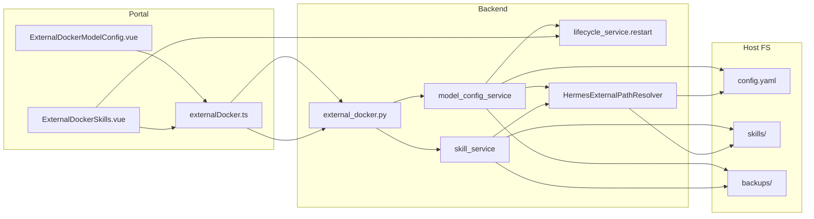

# v3.5.1 外部 Docker 模型配置与技能安装管理

## 范围与约束

- **仅作用于** `binding_type === external_docker`（已有 [`require_external_docker_instance()`](nodeskclaw-backend/app/services/hermes_external/_common.py) 守卫）
- **写入路径** 全部经 [`HermesExternalPathResolver`](nodeskclaw-backend/app/services/hermes_external/path_resolver.py)，不得触碰平台部署实例目录
- **不改** docker-compose / 绑定流程 / 平台实例逻辑（PRD 第 3、14 节）
- **文档**：PRD 已在 [`docs_prd/team_v3.5.1_instiance-model-skill-management.md`](docs_prd/team_v3.5.1_instiance-model-skill-management.md)；实现完成后若 EE 私有仓库有对应章节，同步 `ee/docs/后端架构设计.md` 与 `ee/docs/页面线框图.md`

## 当前缺口

| 模块 | 现状 | 目标 |
|------|------|------|
| 模型配置 | [`model_config_service.py`](nodeskclaw-backend/app/services/hermes_external/model_config_service.py) 只读摘要 | raw / validate / update + 备份 + 原子写入 + 可选 restart |
| 技能 | [`skill_service.py`](nodeskclaw-backend/app/services/hermes_external/skill_service.py) 目录扫描 | 富化 metadata + 安装/启停/删/重扫 |
| API | [`external_docker.py`](nodeskclaw-backend/app/api/external_docker.py) 仅 GET | 新增 10 个端点 |
| 前端 | 两个只读 Vue 页 | 编辑/操作 UI + 集中 API client |

## 架构数据流



---

## 前端表现变化

### 1. 模型配置页 — 从只读摘要变为可编辑

**总结**：模型配置页从「仅展示脱敏 JSON 摘要」变为「可编辑 YAML + 校验/保存/保存并重启」。

**元素级变化**：
- 配置文件路径：保留，显示 `config_file` 绝对路径
- 配置摘要卡片：保留现有 providers 脱敏展示；保存成功后自动刷新
- YAML 编辑区：**新增** `<textarea>` 绑定 `rawContent`（首阶段不用 Monaco）
- 操作按钮区：**新增**「重载」「校验」「保存配置」「保存并重启」；保存过程显示 loading
- 错误/成功提示：**新增** 校验失败 inline 错误；保存成功 toast + `requires_restart` 提示
- 最近备份提示：**新增** 保存成功后展示 `backup_file` 路径（若有）
- 敏感字段说明：**新增** 一行说明「摘要已脱敏，编辑区显示原文」

**改动前**：
```
┌─ 模型配置 ─────────────────────┐
│ config.yaml 路径               │
│ [脱敏 JSON 摘要块]             │
│ （无编辑、无操作按钮）          │
└────────────────────────────────┘
```

**改动后**：
```
┌─ 模型配置 ─────────────────────┐
│ 路径: .../config.yaml          │
│ [脱敏摘要]                     │
│ ┌─ YAML 编辑区 ──────────────┐ │
│ │ default_model:             │ │
│ │   provider: ...            │ │
│ └────────────────────────────┘ │
│ [重载] [校验] [保存] [保存并重启]│
│ ✓ 配置已保存，重启后生效        │
└────────────────────────────────┘
```

### 2. 技能页 — 从目录列表变为完整运维面板

**总结**：技能页从「按 category 列出文件夹名」变为「带状态/来源的操作表格 + 安装工具栏」。

**元素级变化**：
- 工具栏：**新增** bundle 输入 +「安装内置」、ZIP 上传、Git 仓库/ref/slug +「从 Git 安装」、「重扫」、「重启实例」
- skills 列表：**改造** 为表格（slug / version / status / enabled / source）；每行 **新增** 启用/禁用/删除（仅 `category=skills` 目录）
- skill-inbox / tools / plugins：保留分类展示，只读
- 重启提示 banner：**新增** `requires_restart=true` 后显示「建议重启 Hermes 实例后生效」
- 删除确认：**新增** `useConfirm` 二次确认（说明先备份再删）

**改动后示意**：
```
┌─ 技能 ─────────────────────────────────────────┐
│ [bundle] [安装内置] [上传ZIP] [git...] [重扫]   │
│ ⚠ 技能变更已完成，建议重启实例后生效  [重启]    │
│ ── 已安装 skills ──                            │
│ slug | version | status | [启用][禁用][删除]    │
│ ── skill-inbox / tools / plugins（只读）──      │
└────────────────────────────────────────────────┘
```

---

## 后端实施

### BE-1：扩展 Schema — [`external_docker.py`](nodeskclaw-backend/app/schemas/external_docker.py)

- **扩展** `ExternalDockerSkillItem`：`slug`, `version`, `description`, `enabled`, `status`, `source`, `requires_restart`
- **新增** 模型配置：`ExternalDockerModelConfigRawResponse`, `ValidateRequest/Response`, `UpdateRequest/Response`
- **新增** 技能操作：`ExternalDockerSkillActionResponse`, `InstallBuiltinSkillRequest`, `InstallGitSkillRequest`

### BE-2：扩展模型配置服务 — [`model_config_service.py`](nodeskclaw-backend/app/services/hermes_external/model_config_service.py)

| 函数 | 行为 |
|------|------|
| `get_model_config_raw(instance)` | 读 `ep.config_file` 原文 |
| `validate_model_config(content)` | `yaml.safe_load`；顶层须 dict；空内容 400 |
| `backup_config(instance, config_file)` | 写入 `backups/config/config-{YYYYMMDD-HHMMSS}.yaml` |
| `update_model_config(instance, content, restart_after_save)` | 校验 → 备份 → `.yaml.tmp` 原子 replace → 可选 `await lifecycle_service.restart` |

**细节**：
- 摘要脱敏补充 PRD 要求的 `max_tokens`
- 日志禁止打印完整 content
- 返回 `requires_restart=True`, `restarted=bool`

### BE-3：扩展技能服务 — [`skill_service.py`](nodeskclaw-backend/app/services/hermes_external/skill_service.py)

**复用**（路径改走 `resolve_paths`）：
- [`safe_extract_zip`](nodeskclaw-backend/app/services/hermes_expert/expert_filesystem.py)
- [`parse_manifest` / `write_manifest`](nodeskclaw-backend/app/services/hermes_expert/expert_manifest.py)
- [`RESOURCES_ROOT / skill-bundles`](nodeskclaw-backend/app/services/hermes_expert/expert_filesystem.py)
- Git clone 参考 [`ExpertSkillService.install_from_git`](nodeskclaw-backend/app/services/hermes_expert/expert_skill_service.py)：`http/https` 校验；`PRIVATE_GIT_TOKEN` 可选注入；`asyncio.create_subprocess_exec`

**备份路径**（PRD 格式，非 expert 的 `.backup.{stamp}`）：
- 删除/覆盖：`backups/skills/{slug}-{YYYYMMDD-HHMMSS}/`

**新增方法**：`install_builtin_bundle`, `upload_skill_zip`, `install_from_git`, `enable_skill`, `disable_skill`, `delete_skill`, `rescan_skills`

**list_skills 增强**：`category=skills` 目录调用 `_build_skill_item` 解析 manifest；inbox/tools/plugins 仍轻量扫描；`_skill_dir` 校验路径在 `ep.skills_dir` 内

### BE-4：扩展 API — [`external_docker.py`](nodeskclaw-backend/app/api/external_docker.py)

| 方法 | 路径 | 权限 |
|------|------|------|
| GET | `.../model-config/raw` | viewer |
| POST | `.../model-config/validate` | admin |
| PUT | `.../model-config` | admin |
| POST | `.../skills/builtin` | admin |
| POST | `.../skills/upload` | admin |
| POST | `.../skills/git` | admin |
| POST | `.../skills/{skill_slug}/enable\|disable` | admin |
| DELETE | `.../skills/{skill_slug}` | admin |
| POST | `.../skills/rescan` | viewer |

### BE-5：测试 — 新建 [`tests/test_external_docker_model_skill.py`](nodeskclaw-backend/tests/test_external_docker_model_skill.py)

参考 [`test_hermes_expert_skill_service.py`](nodeskclaw-backend/tests/test_hermes_expert_skill_service.py)：`tmp_path` + monkeypatch `resolve_paths`
- 合法 YAML 保存 + 非法 YAML 拒绝且原文件不变
- ZIP 安装 + Git URL 协议校验
- 删除前备份
- `platform_managed` 实例返回 400

---

## 前端实施

### FE-1：API Client — 新建 [`nodeskclaw-portal/src/api/externalDocker.ts`](nodeskclaw-portal/src/api/externalDocker.ts)

封装 PRD 列出的 14 个方法；ZIP 用 `FormData`。

### FE-2：改造 [`ExternalDockerModelConfig.vue`](nodeskclaw-portal/src/views/external-docker/ExternalDockerModelConfig.vue)

- `onMounted` 并行请求 summary + raw
- 按钮：reload / validate / save / saveAndRestart
- 参考 [`ExpertInstanceSkillsView.vue`](nodeskclaw-portal/src/views/hermes/ExpertInstanceSkillsView.vue) 的 `runAction` + toast 模式

### FE-3：改造 [`ExternalDockerSkills.vue`](nodeskclaw-portal/src/views/external-docker/ExternalDockerSkills.vue)

- 对齐 Expert 技能页：工具栏 + Table + 行内操作
- `requires_restart` banner + restart API
- 删除走 `useConfirm`（`variant: 'danger'`）

### FE-4：i18n — [`zh-CN.ts`](nodeskclaw-portal/src/i18n/locales/zh-CN.ts) / [`en-US.ts`](nodeskclaw-portal/src/i18n/locales/en-US.ts)

新增 `externalDocker.modelConfig.*` 与 `externalDocker.skills.*`，禁止硬编码中文 UI 文案。

---

## 实施顺序

1. BE-1 Schema
2. BE-2 model_config_service + BE-4 模型配置 3 路由
3. FE-1 API client + FE-2 ModelConfig 页 + i18n 模型部分
4. BE-3 skill_service + BE-4 技能 7 路由
5. FE-3 Skills 页 + i18n 技能部分
6. BE-5 测试 + `ruff check` + `npm run build`

## 验证清单

- 编辑 YAML → 校验 → 保存 → `backups/config/` 有备份 → 摘要刷新
- 保存并重启 → lifecycle restart 被调用
- ZIP / Git / 内置 → 写入 `host_data_dir/skills/<slug>`
- 启停删 → manifest 更新；删前 `backups/skills/` 有备份
- 平台部署实例访问 external-docker 写接口 → 400
- pytest 新增用例通过；Portal build 通过
