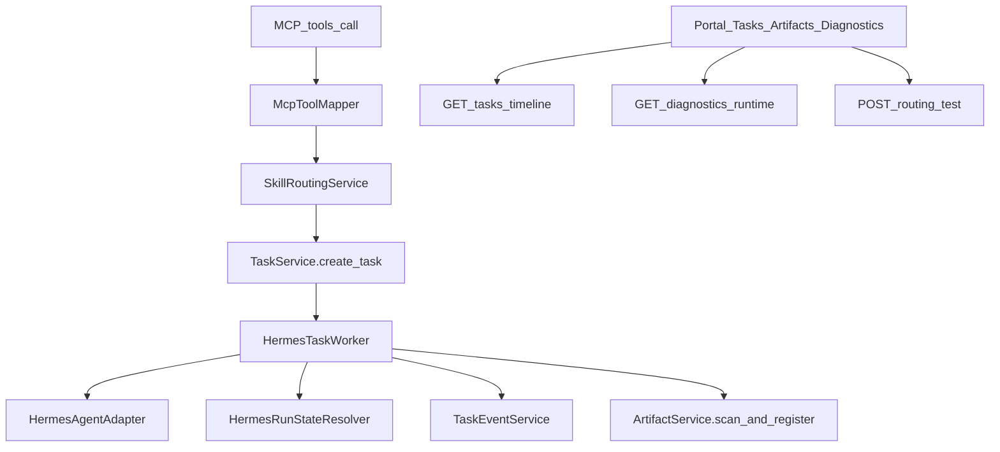

# v4.1 Hermes MCP Skill 路由与交付加固实施计划

## 前端表现变化

### 1. Portal - Hermes 任务页（`/hermes/tasks`）

**总结**: 任务页从「右侧固定详情栏 + 原始事件列表」升级为「Drawer 详情 + 结构化 Timeline + 多维筛选 + 一键复制运维信息」

**元素级变化**:
- 筛选区: **新增** Tool 名称、Agent ID、Workspace ID 输入/下拉过滤（原先仅 status 筛选）
- 任务行点击: 详情由右侧固定 panel -> **Task Detail Drawer**（侧滑抽屉，可关闭）
- Timeline 面板: **新增**，按 `event_seq` 展示带 title、timestamp、payload 的时间线（调用 `GET /hermes/tasks/{id}/timeline`）
- Events Viewer: 由仅显示 `event_type` -> **可展开 payload**、显示 `hermes_event_seq`、支持 SSE 续传提示
- 详情区字段: **新增** 展示 `profile_id`、`workspace_id`、`installation_id`
- 复制按钮组: **新增**，复制 `task_id` / `hermes_run_id` / `event_url` / `artifact_url`
- Cancel / Retry: 保持，Retry 失败提示对齐 `hermes_task:retry` 权限

**改动后示意**:
```
/hermes/tasks
+-- [Status v] [Tool v] [Agent v] [Workspace v]     [刷新] --+
| 任务列表                                                    |
| TASK-001 | writer... | writer-9601 | running | ...        |
+-------------------------------------------------------------+
        |
        v (点击行)
+-- Task Detail Drawer --------------------------------------+
| Status: running    [复制 task_id] [复制 run_id] [复制 URLs] |
| Agent / Profile / Workspace / Installation                  |
| -- Timeline ---------------------------------------------- |
| 09:00 任务创建 (task.created)                               |
| 09:03 Hermes Run 创建 (hermes.run.created)                  |
| -- Events (SSE) ------------------------------------------ |
| [展开 payload]                                              |
| [Cancel] [Retry]                                            |
+-------------------------------------------------------------+
```

### 2. Portal - Hermes 产物页（`/hermes/artifacts`）

**总结**: 产物页从「底部文本预览」升级为「Preview Drawer + 批量 ZIP 下载 + 更丰富筛选与元数据」

**元素级变化**:
- 筛选区: **新增** `agent_id`、`content_type` 过滤；保留 `task_id` / `skill_id`
- 表格列: **新增** `title`（来自 manifest）、`sha256`、来源 `task_id` / `run_id` 链接
- Preview: 页面底部 `<pre>` -> **Artifact Preview Drawer**（侧滑）
- 预览内容: JSON **格式化**、Markdown **渲染**、CSV 文本、HTML escape；超大文件显示 truncated 提示
- Batch Download: **新增**「按 task 批量下载」按钮（调用已有 `POST /tasks/{task_id}/artifacts/download`）
- 不支持预览类型（pdf/docx 等）: 显示可操作提示「请下载查看」

### 3. Portal - 安装记录页（`/hermes/installations`）

**总结**: 安装页从「只读列表」升级为「路由运维台」，可配置 default/priority 并做 Routing Test

**元素级变化**:
- 表格列: **新增** `is_default` 徽标、`priority`、`routing_scope`
- 路径状态: `profile_root_path` / `workspace_root_path` 旁 **新增** exists/missing 状态点（来自 diagnostics 或 routing-test 返回）
- 行操作: **新增**「设为默认」「编辑 priority」；保留 Sync / Uninstall
- Routing Test 面板: **新增**，输入 `tool_name` + 可选 routing 参数，展示 matched installation 与 `reason`
- 主导航: 可选增加「Hermes 安装」入口（当前仅有路由无 nav）

### 4. Portal - 新增 Diagnostics 页（`/hermes/diagnostics`）

**总结**: **新增** 运维诊断页，管理员/运营可一眼判断 Worker、队列、Agent、路径是否正常

**元素级变化**:
- 导航: **新增**「Hermes 诊断」入口（admin/operator 可见）
- Worker 卡片: enabled、interval、batch_size、lock_timeout
- Queue 卡片: queued / running / failed_last_24h / timeout_last_24h
- Agents 表格: agent_id、base_url、health、profile_root_path_exists、workspace_root_path_exists、last_error
- 近期异常: 最近失败 task、最近 artifact scan failed 列表
- 空/权限不足: 明确引导「需要 org admin 或 operator 权限」

**改动后导航**:
```
[工作区] [实例] [Hermes 任务] [Hermes 产物] [Hermes 诊断*] [AI 专家中心] ...
                              * admin/operator only
```

### 5. 后端 API 变化（无直接 UI 但影响联调）

**总结**: MCP `tools/call` 支持 `_routing` 选路；任务/产物/诊断新增聚合接口；错误码与权限点补齐

---

## 现状与差距（基于代码审查）

v4.0 已具备：`McpToolMapper` + `TaskService` + `HermesTaskWorker` + `HermesAgentAdapter` + SSE + Artifact scan/download + Portal 基础 Tasks/Artifacts 页。

| 领域 | 现状 | v4.1 缺口 |
|------|------|-----------|
| 路由 | [`mcp_tool_mapper.py`](nodeskclaw-backend/app/services/hermes_skill/mcp_tool_mapper.py) `call_tool()` 用 `scalar_one_or_none()` 取单个 installation | 多安装会异常或随机；无 `SkillRoutingService`、无 `_routing` |
| Run 状态 | [`hermes_task_worker.py`](nodeskclaw-backend/app/services/hermes_skill/hermes_task_worker.py) stream 正常结束时直接标 completed | 可能忽略 `hermes.run.failed`；无 `HermesRunStateResolver` |
| event_seq | Worker 将 Hermes `event_seq` 传入 `write_event()` | 与 `task.created(0)`/`task.queued(1)` 冲突风险 |
| Artifact | [`artifact_service.py`](nodeskclaw-backend/app/services/hermes_skill/artifact_service.py) 有 scan/preview/batch download | 无 `outputs/manifest.json` 解析；缺 `title`/`artifact_type` 列；预览上限 512KB |
| API | batch download 已有 [`artifacts_router.py`](nodeskclaw-backend/app/api/hermes_skill/artifacts_router.py) `POST /tasks/{task_id}/artifacts/download` | 缺 timeline、diagnostics、routing-test；retry 权限用 `hermes_task:create` |
| DB | [`skill_installation.py`](nodeskclaw-backend/app/models/hermes_skill/skill_installation.py) 无路由字段 | 需 migration |
| Portal | [`TasksView.vue`](nodeskclaw-portal/src/views/hermes/TasksView.vue) 等 v4.0 基础版 | 缺 Drawer/Timeline/Diagnostics/Routing Test |



---

## 实施步骤

### Epic 1: Skill Routing（P0）

**涉及文件**:
- 新增: [`nodeskclaw-backend/app/services/hermes_skill/skill_routing_service.py`](nodeskclaw-backend/app/services/hermes_skill/skill_routing_service.py)
- 修改: [`mcp_tool_mapper.py`](nodeskclaw-backend/app/services/hermes_skill/mcp_tool_mapper.py) — `call_tool()` 剥离 `_routing`、调用 routing、审计 `hermes.skill.routing.resolved/failed`
- 修改: [`skill_installation.py`](nodeskclaw-backend/app/models/hermes_skill/skill_installation.py) + schema — 新增 `is_default`/`priority`/`routing_scope`/`routing_metadata`
- 修改: [`installations_router.py`](nodeskclaw-backend/app/api/hermes_skill/installations_router.py) — `PATCH /skill-installations/{id}` 更新路由字段；`POST /skill-installations/routing-test`
- 修改: [`permission_checker.py`](nodeskclaw-backend/app/services/hermes_skill/permission_checker.py) — 注册 `skill:manage_routing`
- 修改: [`errors.py`](nodeskclaw-backend/app/services/mcp_skill_gateway/errors.py) — 映射 `installation_ambiguous` 等 message_key

**核心逻辑**:
1. `SkillRoutingService.resolve(tool_name, org_id, user_id, workspace_id, routing)` 按 PRD §6.4 优先级决策
2. `McpToolMapper.call_tool()` 从 `arguments` 弹出 `_routing`，校验后传给 routing；`create_task` 的 `arguments` 不含 `_routing`
3. 设置 `is_default=true` 时，同 org+skill 其他 installation 自动清 default（Partial Unique Index 或事务内更新）
4. `routing-test` 只解析不创建 task，返回 `matched`/`reason`/`installation_id`

### Epic 2: HermesRunStateResolver（P0）

**涉及文件**:
- 新增: [`hermes_run_state_resolver.py`](nodeskclaw-backend/app/services/hermes_skill/hermes_run_state_resolver.py)
- 修改: [`hermes_task_worker.py`](nodeskclaw-backend/app/services/hermes_skill/hermes_task_worker.py) — `_execute_task()` 维护 `seen_failed/seen_completed/seen_cancelled`；stream 结束后走 resolver 而非直接 completed
- 修改: [`hermes_agent_adapter.py`](nodeskclaw-backend/app/services/hermes_skill/hermes_agent_adapter.py) — `convert_events()` 逻辑收敛到 resolver（adapter 仅做 HTTP）
- 修改: [`hermes_task_worker.py`](nodeskclaw-backend/app/services/hermes_skill/hermes_task_worker.py) — `cancel_requested` 任务跳过 `submit_run`

**终态规则**（PRD §7.5）:
- stream 正常结束: `seen_failed` -> `mark_failed`；`seen_cancelled` -> cancel；`seen_completed` -> `mark_completed`；否则 `get_run_status` 兜底
- `unknown` 状态保持 `running`，不直接 failed

### Epic 3: TaskEventService event_seq 隔离（P0）

**涉及文件**:
- 修改: [`task_event_service.py`](nodeskclaw-backend/app/services/hermes_skill/task_event_service.py) — `write_event()` 增加 `source`/`source_event_seq`；禁止外部写 backend `event_seq`；unique 冲突 retry 最多 3 次
- 修改: [`hermes_task_worker.py`](nodeskclaw-backend/app/services/hermes_skill/hermes_task_worker.py) — 写 Hermes 事件时不传 `event_seq`
- 修改: [`tasks_router.py`](nodeskclaw-backend/app/api/hermes_skill/tasks_router.py) — `stream_task_events()` 读取 HTTP 头 `Last-Event-ID`（兼容现有 query `last_event_id`）

### Epic 4: Artifact Delivery 增强（P1）

**涉及文件**:
- 新增: [`output_manifest_parser.py`](nodeskclaw-backend/app/services/hermes_skill/output_manifest_parser.py)（或合入 artifact_service）
- 修改: [`hermes_artifact.py`](nodeskclaw-backend/app/models/hermes_skill/hermes_artifact.py) — 新增 `title`/`description`/`artifact_type`
- 修改: [`artifact_service.py`](nodeskclaw-backend/app/services/hermes_skill/artifact_service.py) — `scan_and_register()` 读 `outputs/manifest.json`；title 优先级链（§10.3）；`preview()` 增强 JSON 格式化/2MB 截断/HTML escape
- 修改: [`artifacts_router.py`](nodeskclaw-backend/app/api/hermes_skill/artifacts_router.py) — batch download 补 `hermes_artifact:batch_download` 权限与 `artifact.batch_downloaded` 审计
- 修改: [`path_guard.py`](nodeskclaw-backend/app/services/hermes_skill/path_guard.py) — symlink 先判 `path.is_symlink()`；ZIP entry 校验补空名/控制字符/`C:\` 模式

### Epic 5: Timeline + Diagnostics API（P1）

**涉及文件**:
- 新增: [`runtime_diagnostics_service.py`](nodeskclaw-backend/app/services/hermes_skill/runtime_diagnostics_service.py)
- 新增: [`diagnostics_router.py`](nodeskclaw-backend/app/api/hermes_skill/diagnostics_router.py)
- 修改: [`tasks_router.py`](nodeskclaw-backend/app/api/hermes_skill/tasks_router.py) — `GET /tasks/{task_id}/timeline`（聚合 events + 可读 title）
- 修改: [`router.py`](nodeskclaw-backend/app/api/hermes_skill/router.py) — 挂载 diagnostics
- 修改: [`tasks_router.py`](nodeskclaw-backend/app/api/hermes_skill/tasks_router.py) — `retry_task` 改用 `hermes_task:retry`；写 `hermes.task.retried` 审计

`RuntimeDiagnosticsService` 汇总: settings 中 worker 配置、queue 计数（按 status + 24h 窗口）、hermes_agent 实例 health/path 检查、artifact 24h 统计、最近失败 task / scan failed。

### Epic 6: 数据库迁移（与 Epic 1/4 同步）

**命令**: `uv run alembic revision --autogenerate -m "hermes_v41_routing_delivery_hardening"`

**预期变更**:
- `hermes_skill_installations`: `is_default`, `priority`, `routing_scope`, `routing_metadata` + 索引 `ix_hermes_skill_installations_routing`
- `hermes_artifacts`: `title`, `description`, `artifact_type`（`preview_supported`/`source_run_id`/`metadata_json` 已存在则跳过）
- 确认 `uq_hermes_task_events_task_seq` 已存在（v4.0 迁移 `8e08c3453daf`）

**验收**: `upgrade head` -> `downgrade -1` -> `upgrade head`

### Epic 7: Portal 运维闭环（P1）

**涉及文件**:
- 新增: [`nodeskclaw-portal/src/api/hermes/diagnostics.ts`](nodeskclaw-portal/src/api/hermes/diagnostics.ts)
- 新增: [`nodeskclaw-portal/src/views/hermes/DiagnosticsView.vue`](nodeskclaw-portal/src/views/hermes/DiagnosticsView.vue)
- 修改: [`tasks.ts`](nodeskclaw-portal/src/api/hermes/tasks.ts) — `getTaskTimeline`
- 修改: [`artifacts.ts`](nodeskclaw-portal/src/api/hermes/artifacts.ts) — `batchDownloadTaskArtifacts`
- 修改: [`installations.ts`](nodeskclaw-portal/src/api/hermes/installations.ts) — `routingTest`、`updateInstallationRouting`
- 修改: [`TasksView.vue`](nodeskclaw-portal/src/views/hermes/TasksView.vue)、[`ArtifactsView.vue`](nodeskclaw-portal/src/views/hermes/ArtifactsView.vue)、[`InstallationsView.vue`](nodeskclaw-portal/src/views/hermes/InstallationsView.vue)
- 修改: [`hermes.ts`](nodeskclaw-portal/src/router/hermes.ts)、[`App.vue`](nodeskclaw-portal/src/App.vue)、i18n

复用项目已有 Drawer 模式（如 `AuditDetailDrawer.vue`），禁止原生 `<select>`，图标用 `lucide-vue-next`。

### Epic 8: 测试（TDD，贯穿各 Epic）

**新增/强化测试文件**（PRD §17）:
- `test_skill_routing_service.py`
- `test_mcp_tools_call_routing.py`
- `test_hermes_run_state_resolver.py`
- `test_task_event_seq.py`
- `test_task_timeline_api.py`
- `test_runtime_diagnostics_api.py`
- `test_artifact_manifest.py`
- `test_path_guard_symlink.py`
- 更新 `test_artifact_batch_download.py`、`test_hermes_task_worker.py`

**验收命令**:
```bash
cd nodeskclaw-backend && uv run pytest tests/hermes_skill -q
```

注: Windows 下部分 path_guard symlink 测试需 `pytest.mark.skipif(sys.platform == "win32")` 或仅在 Linux CI 跑，避免误报。

---

## 推荐分支与提交

分支: `feat/hermes-v4.1-routing-delivery-hardening`

提交拆分（与 PRD §20 对齐）:
1. `feat(hermes): 新增 SkillRoutingService 与 installation 路由字段`
2. `feat(hermes): MCP tools/call 支持 _routing 显式选路`
3. `fix(hermes): HermesRunStateResolver 修复 failed 误标 completed`
4. `fix(hermes): 隔离 Hermes event_seq 与 backend event_seq`
5. `feat(hermes): 新增 Task Timeline API`
6. `feat(hermes): Artifact manifest 解析与预览增强`
7. `fix(hermes): PathGuard symlink 与 ZIP entry 加固`
8. `feat(hermes): 新增 Runtime Diagnostics API`
9. `feat(portal): Hermes 运维闭环页面（Timeline/Diagnostics/Routing Test）`
10. `test(hermes): 补齐 v4.1 路由运行时产物诊断测试`

---

## 风险与依赖

- **文档**: 设计细节以 [`docs_prd/team_v4.1_mcp-skill-routing-and-delivery-hardening.md`](docs_prd/team_v4.1_mcp-skill-routing-and-delivery-hardening.md) 为准；EE 架构文档需在实现同期更新（`ee/docs/后端架构设计.md`）
- **多 Agent 默认路由**: `is_default` 需业务规则保证同 skill 仅一个 default，避免 ambiguous
- **autogenerate 噪声**: 与 v4.0 相同，生成迁移后必须手工剔除无关 DROP，只保留 Hermes 相关列/索引
- **权限种子**: 新权限点需在 org role 默认矩阵或 seed 中注册，否则 Portal 按钮会一直 disabled
