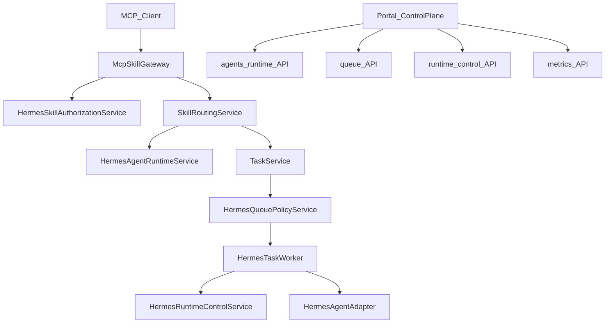

# v4.2 Hermes Runtime 治理与控制面实施计划

## 前端表现变化

### 1. Portal - 新增 Hermes Runtime 页（`/hermes/runtime`）

**总结**: 从「Diagnostics 只读观测」升级为「可暂停/恢复 Worker、清理僵死锁、查看控制状态」的运行时控制面

**元素级变化**:
- 导航: **新增**「Hermes 运行时」入口（admin/operator 可见）
- Worker 卡片: 在只读 enabled/interval 基础上 **新增** Pause / Resume 按钮、当前 `worker.paused` 状态徽标
- Queue 卡片: **新增** queue.paused 状态、Pause Queue / Resume Queue 按钮
- 控制区: **新增**「清理僵死锁」按钮（调用 `POST /runtime/locks/clear-stale`）
- 最近失败任务: 保留 Diagnostics 能力，**新增** 行级 Requeue / Mark Failed 快捷操作

**改动后示意**:
```
/hermes/runtime
+-- Worker [运行中]  [暂停 Worker] [恢复 Worker] ----------+
| Queue  [正常]     [暂停入队]   [恢复入队]               |
| [清理僵死锁]                                            |
| 最近失败任务 -> [Requeue] [标为失败]                    |
+---------------------------------------------------------+
```

### 2. Portal - 新增 Hermes Agents 页（`/hermes/agents`）

**总结**: **新增** Agent 运行时治理页，支持健康检查与 enable/disable/maintenance/drain

**元素级变化**:
- Agent 表格: **新增** runtime_status、accepting_tasks、running/queued 任务数、max_concurrent、路径存在性、last_error
- 行操作: **新增** Health Check、启用、停用、维护、Drain、恢复
- 维护弹窗: **新增** maintenance_reason 输入

### 3. Portal - 新增 Hermes Queue 页（`/hermes/queue`）

**总结**: **新增** 队列治理页，支持 priority 调整与 stuck/failed 任务恢复

**元素级变化**:
- 统计条: queued / accepted / running / failed / timeout 计数
- 任务表: **新增** priority 列、queue_reason、retry_count；筛选 agent/skill/user/status
- 行操作: **新增** 调整优先级、Requeue、Mark Failed、Cancel（权限 gated）

### 4. Portal - 新增 Skill Authorization 页（`/hermes/skill-authorizations`）

**总结**: **新增** Skill 授权专页，支持 user/role/workspace 批量授权

**元素级变化**:
- Skill 选择器 + 授权列表（subject_type、can_list/can_invoke/can_install/can_manage）
- **新增** 批量授权 / 批量撤销面板（多用户选择）
- workspace manager 仅可见本 workspace 范围授权

### 5. Portal - 新增 Hermes Metrics 页（`/hermes/metrics`）

**总结**: **新增** 运行指标页，展示成功率、耗时、Agent/Skill 失败排行

**元素级变化**:
- 时间范围选择（今日/7天/30天）
- 概览卡片: 任务数、成功率、平均耗时、队列积压
- 排行表: 失败 Top Agent、失败 Top Skill、Artifact/下载统计

### 6. 增强现有页面

**TasksView** (`nodeskclaw-portal/src/views/hermes/TasksView.vue`):
- 列表 **新增** priority、retry_count 列
- 详情抽屉 **新增** Requeue、Mark Failed、调整 Priority（admin/operator）
- 筛选 **新增** user_id

**DiagnosticsView**: 保留只读快照，控制动作迁移至 Runtime 页，避免重复

**App.vue 导航**: Hermes 区从 4 项扩展为 Runtime / Agents / Queue / Tasks / Artifacts / Metrics / Authorizations / 专家中心（Skills/Installations 可收进二级或保留直链）

---

## 现状与差距（基于代码审查）

v4.1 已具备：`SkillRoutingService`、`HermesTaskWorker`（FIFO by `created_at`）、`RuntimeDiagnosticsService`（只读）、`PermissionChecker`（含 `hermes_runtime:diagnostics`）、Portal Tasks/Diagnostics/Installations。

| 领域 | 现状 | v4.2 缺口 |
|------|------|-----------|
| Agent Runtime | Diagnostics 从 installation 推导静态路径 | 无 `hermes_agent_runtime_states`、无 health check、无 enable/drain API |
| Queue | Worker `order_by(created_at)` | 无 priority/concurrency/retry_policy、无 queue pause |
| Control Plane | 仅 `HERMES_TASK_WORKER_ENABLED` 全局开关 | 无 `hermes_runtime_controls`、无运行时 pause/resume/requeue/mark-failed |
| Authorization | `OrgMemberSkillGrant` + `mcp_tool_mapper.list_tools` 全员 grant 过滤 | admin/operator 被误过滤；无 role/workspace 授权 API |
| Metrics | 无 | 无 `HermesRuntimeMetricsService` 与 Metrics API |
| Task 模型 | 无 `priority`/`retry_count` 等 | 需扩展 `HermesTask` + migration |



---

## 实施步骤

### Epic 1: Agent Runtime State（P0）

**涉及文件**:
- 新增 Model: [`nodeskclaw-backend/app/models/hermes_skill/hermes_agent_runtime_state.py`](nodeskclaw-backend/app/models/hermes_skill/hermes_agent_runtime_state.py)
- 新增 Service: [`hermes_agent_runtime_service.py`](nodeskclaw-backend/app/services/hermes_skill/hermes_agent_runtime_service.py)
- 新增 Router: [`agents_runtime_router.py`](nodeskclaw-backend/app/api/hermes_skill/agents_runtime_router.py)
- 修改: [`skill_routing_service.py`](nodeskclaw-backend/app/services/hermes_skill/skill_routing_service.py) — `_list_installed` / `_select_installation` 排除 `accepting_tasks=false` 或 `runtime_status in (disabled, maintenance, draining)`
- 修改: [`runtime_diagnostics_service.py`](nodeskclaw-backend/app/services/hermes_skill/runtime_diagnostics_service.py) — 改读 `HermesAgentRuntimeService` 聚合数据（health、running count、base_url）
- 修改: [`permission_checker.py`](nodeskclaw-backend/app/services/hermes_skill/permission_checker.py) — 注册 `hermes_agent:view/manage/health_check/drain`
- 修改: [`router.py`](nodeskclaw-backend/app/api/hermes_skill/router.py) — 挂载 agents runtime 路由

**核心逻辑**:
1. `HermesAgentRuntimeService.get_or_create_state(org_id, agent_id)` — 首次从 Instance + installation 初始化 `max_concurrent_tasks`（默认读 `HERMES_QUEUE_AGENT_MAX_RUNNING`）
2. `health_check(agent_id)` — 顺序：Instance 存在 → base_url `GET /health` 或 `/v1/health` → profile/workspace 路径存在 → 更新 `last_health_status`
3. `enable/disable/maintenance/drain/resume` — 更新 `runtime_status` + `accepting_tasks`；draining 时 `accepting_tasks=false` 但不清 running
4. `count_running_tasks(agent_id)` — 从 `hermes_tasks` 聚合 `status=running`
5. 所有写操作写 `SkillAuditLogger`（`hermes.agent.*`）

### Epic 2: Queue Policy 与 Worker 调度（P0）

**涉及文件**:
- 修改 Model: [`hermes_task.py`](nodeskclaw-backend/app/models/hermes_skill/hermes_task.py) — 新增 PRD §7.3 / §12.3 调度字段
- 新增 Service: [`hermes_queue_policy_service.py`](nodeskclaw-backend/app/services/hermes_skill/hermes_queue_policy_service.py)
- 修改: [`task_service.py`](nodeskclaw-backend/app/services/hermes_skill/task_service.py) — `create_task` 前调用 `can_enqueue`；设置 `priority`/`queue_entered_at`/`max_retry` 默认值
- 修改: [`hermes_task_worker.py`](nodeskclaw-backend/app/services/hermes_skill/hermes_task_worker.py) — `_fetch_and_lock` 改为 `priority DESC, scheduled_at ASC NULLS FIRST, created_at ASC`；拉取前读 `HermesQueuePolicyService.can_dispatch`；失败终态后按 `retry_policy` 自动 requeue（写 `TASK_RETRYING` 事件）
- 修改: [`config.py`](nodeskclaw-backend/app/core/config.py) — 新增 `HERMES_QUEUE_*`、`HERMES_TASK_DEFAULT_MAX_RETRY`、`HERMES_TASK_RETRY_BACKOFF_SECONDS`
- 新增 Router: [`queue_router.py`](nodeskclaw-backend/app/api/hermes_skill/queue_router.py)
- 修改: [`tasks_router.py`](nodeskclaw-backend/app/api/hermes_skill/tasks_router.py) — `POST .../requeue`、`POST .../priority`、`POST .../mark-failed`（与 PRD §9.4 对齐，复用 `HermesRuntimeControlService` 或委托 queue policy）

**核心逻辑**:
1. `can_enqueue(org, user, agent, skill)` — org queued 上限、agent/skill/user running 上限、agent `accepting_tasks`
2. `can_dispatch(task)` — `not_before`、runtime control `queue.paused`、并发槽位
3. 自动 retry: `mark_failed` 后若 `retry_count < max_retry`，设置 `status=queued`、`not_before=now+backoff`、`retry_count+=1`

### Epic 3: Runtime Control Plane（P0）

**涉及文件**:
- 新增 Model: [`hermes_runtime_control.py`](nodeskclaw-backend/app/models/hermes_skill/hermes_runtime_control.py)
- 新增 Service: [`hermes_runtime_control_service.py`](nodeskclaw-backend/app/services/hermes_skill/hermes_runtime_control_service.py)
- 新增 Router: [`runtime_control_router.py`](nodeskclaw-backend/app/api/hermes_skill/runtime_control_router.py)
- 修改: [`hermes_task_worker.py`](nodeskclaw-backend/app/services/hermes_skill/hermes_task_worker.py) — `_poll_once` 开头读 `worker.paused`，为 true 则跳过 fetch
- 修改: [`permission_checker.py`](nodeskclaw-backend/app/services/hermes_skill/permission_checker.py) — `hermes_runtime:control`、`hermes_queue:view/manage/requeue`

**核心逻辑**:
1. `hermes_runtime_controls` 键值存储：`worker.paused`、`queue.paused`（Partial Unique Index on `org_id + control_key`）
2. `clear_stale_locks(org_id)` — 将 `locked_at < now - lock_timeout` 且仍 queued/accepted 的 task 释放 worker_id/locked_at
3. `requeue_task` — failed/timeout/stuck running → queued，清 lock，写 `hermes.task.requeued`
4. `mark_task_failed` — 强制终止 running，写 `hermes.task.marked_failed`

### Epic 4: Skill Authorization 闭环（P1）

**涉及文件**:
- 新增 Model: [`hermes_skill_authorization_grant.py`](nodeskclaw-backend/app/models/hermes_skill/hermes_skill_authorization_grant.py)
- 新增 Service: [`hermes_skill_authorization_service.py`](nodeskclaw-backend/app/services/hermes_skill/hermes_skill_authorization_service.py)
- 新增 Router: [`authorizations_router.py`](nodeskclaw-backend/app/api/hermes_skill/authorizations_router.py)
- 修改: [`mcp_tool_mapper.py`](nodeskclaw-backend/app/services/hermes_skill/mcp_tool_mapper.py) — `list_tools`：admin/operator 跳过 `OrgMemberSkillGrant` 子查询；member 走 `HermesSkillAuthorizationService.can_list`
- 修改: [`mcp_tool_mapper.py`](nodeskclaw-backend/app/services/hermes_skill/mcp_tool_mapper.py) — `call_tool`：`can_invoke` 统一走 authorization service（保留 `require_invoke_skill` 兼容 `OrgMemberSkillGrant`）
- 修改: [`permission_checker.py`](nodeskclaw-backend/app/services/hermes_skill/permission_checker.py) — `skill:authorize`、`skill:bulk_authorize`

**兼容策略**: 新表 `hermes_skill_authorization_grants` 承载 role/workspace/org 授权；`OrgMemberSkillGrant` 保留，authorization service **双读** user 级 grant，避免破坏现有成员管理页。

### Epic 5: Runtime Metrics（P1）

**涉及文件**:
- 新增 Model（可选首期）: [`hermes_runtime_metric_snapshot.py`](nodeskclaw-backend/app/models/hermes_skill/hermes_runtime_metric_snapshot.py)
- 新增 Service: [`hermes_runtime_metrics_service.py`](nodeskclaw-backend/app/services/hermes_skill/hermes_runtime_metrics_service.py)
- 新增 Router: [`metrics_router.py`](nodeskclaw-backend/app/api/hermes_skill/metrics_router.py)

**实现策略**: v4.2 首期从 `hermes_tasks` + `hermes_artifacts` + audit 表 **实时聚合**（按 org/agent/skill/user + 时间范围）；snapshot 表 + 定时 rollup 作为性能优化可二期补齐，API 契约先按 PRD §10.3 返回。

### Epic 6: 数据库迁移（与 Epic 1–5 同步）

**命令**: `uv run alembic revision --autogenerate -m "hermes_v42_runtime_governance"`

**预期变更**（生成后手工剔除无关 DROP）:
- 新表: `hermes_agent_runtime_states`、`hermes_runtime_controls`、`hermes_skill_authorization_grants`、（可选）`hermes_runtime_metric_snapshots`
- 扩展: `hermes_tasks` 调度字段（§12.3）
- 索引: runtime states `(org_id, agent_id)`、`(org_id, runtime_status)`；controls partial unique `(org_id, control_key) WHERE deleted_at IS NULL`

**验收**: `upgrade head` → `downgrade -1` → `upgrade head`

### Epic 7: Portal 控制面（P1）

**涉及文件**:
- 新增 API: `agents.ts`、`runtime.ts`、`queue.ts`、`authorizations.ts`、`metrics.ts`
- 新增 Views: `RuntimeView.vue`、`AgentsView.vue`、`QueueView.vue`、`SkillAuthorizationsView.vue`、`MetricsView.vue`
- 修改: [`hermes.ts`](nodeskclaw-portal/src/router/hermes.ts)、[`App.vue`](nodeskclaw-portal/src/App.vue)、[`TasksView.vue`](nodeskclaw-portal/src/views/hermes/TasksView.vue)
- 修改 i18n: [`zh-CN.ts`](nodeskclaw-portal/src/i18n/locales/zh-CN.ts)、[`en-US.ts`](nodeskclaw-portal/src/i18n/locales/en-US.ts)

复用现有 `Sheet` 抽屉模式；禁止原生 `<select>`；控制按钮按 `hermes_runtime:control` 等权限 disabled + tooltip。

### Epic 8: 测试（TDD，贯穿各 Epic）

**新增测试**（PRD §16.1）:
- `test_agent_runtime_service.py`
- `test_queue_policy_service.py`
- `test_runtime_control_service.py`
- `test_skill_authorization_service.py`
- `test_tools_list_authorization.py`
- `test_worker_concurrency_policy.py`
- `test_task_requeue.py`
- `test_runtime_metrics_service.py`
- `test_runtime_control_api.py`

**验收命令**:
```bash
cd nodeskclaw-backend && uv run pytest tests/hermes_skill -q
```

注: Windows 上 symlink/path_guard 既有失败需 `skipif` 或仅在 Linux CI 跑；v4.2 新增测试应独立通过。

---

## 关键集成点

| 调用链 | 变更 |
|--------|------|
| `McpToolMapper.list_tools` | admin/operator bypass grant；viewer 仅 can_list |
| `McpToolMapper.call_tool` → `SkillRoutingService` | 过滤 non-accepting agent |
| `TaskService.create_task` | `QueuePolicyService.can_enqueue` |
| `HermesTaskWorker._fetch_and_lock` | priority 排序 + runtime control + concurrency |
| `HermesTaskWorker` 失败终态 | 自动 retry per `retry_policy` |
| `RuntimeDiagnosticsService` | 委托 AgentRuntimeService |

---

## 推荐分支与提交

分支: `feat/hermes-v4.2-runtime-governance-control-plane`

提交拆分（对齐 PRD §19）:
1. `feat(hermes): 新增 Agent Runtime State 服务与 API`
2. `feat(hermes): 新增 Queue Policy 服务与任务调度字段`
3. `feat(hermes): 支持 Runtime Worker pause/resume 与僵死锁清理`
4. `feat(hermes): 新增 task requeue 与 priority 控制`
5. `feat(hermes): 新增 Skill Authorization 授权服务`
6. `fix(hermes): admin/operator tools/list 绕过 member grant 过滤`
7. `feat(hermes): 新增 Runtime Metrics 服务与 API`
8. `feat(portal): 新增 Hermes Runtime 控制面页面`
9. `test(hermes): 补齐 v4.2 治理与控制面测试`

---

## 风险与依赖

- **文档**: 设计细节以 [`docs_prd/team_v4.2_hermes-runtime-governance-and-control-plane.md`](docs_prd/team_v4.2_hermes-runtime-governance-and-control-plane.md) 为准；EE 架构文档需同期更新（`ee/docs/后端架构设计.md`）
- **Agent health 端点**: DeskClaw/Hermes Agent 可能只有 `/health` 或 `/v1/health`，adapter 需双路径 fallback（读 `hermes_agent_adapter` 现有 base_url 解析逻辑）
- **授权双读**: `OrgMemberSkillGrant` 与 `hermes_skill_authorization_grants` 并存，authorization service 必须单一入口避免遗漏
- **Metrics 性能**: 大 org 实时聚合可能慢，首期限制默认 7 天窗口 + 必要 DB 索引（`hermes_tasks(org_id, status, created_at)`）
- **权限种子**: 新权限点需写入 `permission_checker` 默认矩阵，否则 Portal 按钮长期 disabled
- **autogenerate 噪声**: 与 v4.1 相同，迁移生成后只保留 Hermes 相关表/列
