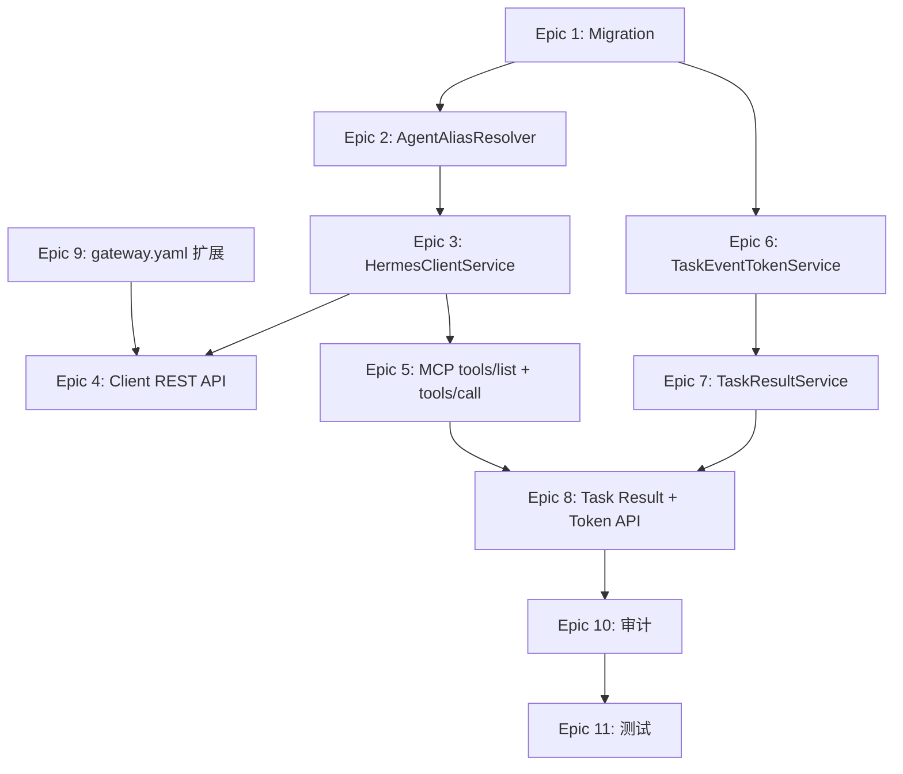

# v4.3 Hermes MCP Gateway Desktop Client Contract 实施计划

> **面向 AI 代理的工作者：** 必需子技能：使用 superpowers:subagent-driven-development（推荐）或 superpowers:executing-plans 逐任务实现此计划。步骤使用复选框语法跟踪进度。

**目标：** 为 copilot-desktop 提供稳定的 Hermes MCP Gateway 接入契约，支持 Agent Alias 路由发现、Client Bootstrap、Readiness Check、Task Events Token、Task Result 聚合，完成从 Desktop 登录到获取任务产物的完整闭环。

**架构：** 在现有 MCP Gateway handler + SkillRoutingService 基础上，新增 AgentAliasResolver 层（alias → agent_id/profile/workspace 解析），新增 HermesClientService 统一 Desktop 交互逻辑，新增 TaskEventTokenService 和 TaskResultService 支撑 Desktop 轻量化事件订阅与结果获取。数据模型扩展 HermesTask（client_context/routing_metadata）+ 新建 hermes_task_event_tokens 表。

**技术栈：** Python 3.12 / FastAPI / SQLAlchemy asyncpg / Alembic / JSONB / SSE / JWT short-lived token

**前置版本：** v4.2 Runtime Governance (migration HEAD: `d2e3f4a5b6c7`)

**分支：** `feat/hermes-v4.3-desktop-client-contract`

---

## 前端表现变化

本次改动无前端表现变化。v4.3 为纯后端 API 契约层，Portal/Admin 前端无界面变更。

---

## 文件结构

### 新建文件

| 文件 | 职责 |
|------|------|
| `app/services/hermes_skill/agent_alias_resolver.py` | Agent Alias → agent_id/profile/workspace 解析 |
| `app/services/hermes_skill/hermes_client_service.py` | Desktop Client 交互聚合（bootstrap/agents/tools/readiness） |
| `app/services/hermes_skill/task_event_token_service.py` | SSE token 签发/验证/撤销 |
| `app/services/hermes_skill/task_result_service.py` | Task Result 聚合（primary artifact 选择） |
| `app/api/hermes_skill/client_router.py` | Desktop Client REST API（bootstrap/agents/tools/readiness-check） |
| `app/api/hermes_skill/task_result_router.py` | Task Result + Events Token API |
| `app/models/hermes_skill/hermes_task_event_token.py` | SSE Token 数据模型 |
| `alembic/versions/e3f4a5b6c7d8_hermes_v43_desktop_client_contract.py` | v4.3 迁移 |
| `tests/hermes_skill/test_agent_alias_resolver.py` | AgentAliasResolver 单测 |
| `tests/hermes_skill/test_client_bootstrap.py` | Bootstrap API 测试 |
| `tests/hermes_skill/test_client_tools_api.py` | Client Tools API 测试 |
| `tests/hermes_skill/test_readiness_check.py` | Readiness Check 测试 |
| `tests/hermes_skill/test_task_events_token.py` | Events Token 测试 |
| `tests/hermes_skill/test_task_result_api.py` | Task Result API 测试 |
| `tests/hermes_skill/test_mcp_tools_list_agent_filter.py` | tools/list agent 过滤测试 |
| `tests/hermes_skill/test_mcp_tools_call_agent_alias.py` | tools/call alias routing 测试 |

### 修改文件

| 文件 | 改动 |
|------|------|
| `app/services/mcp_skill_gateway/constants.py` | MCP descriptor 增加 `approvalCenterPath`，name 改为 "Hermes MCP Gateway" |
| `app/api/router.py` | system_info 返回新 descriptor；挂载 client_router、task_result_router |
| `app/api/hermes_skill/router.py` | include 新子路由 |
| `app/services/mcp_skill_gateway/handler.py` | tools/list 增加 agent_alias/profile 过滤；tools/call structuredContent 增加 event_token_url/result_url |
| `app/services/hermes_skill/mcp_tool_mapper.py` | list_tools 增加 agent/profile 过滤参数；call_tool 写入 client_context/routing_metadata |
| `app/services/hermes_skill/skill_routing_service.py` | extract_routing 支持 agent_alias 字段 |
| `app/services/hermes_skill/manifest_parser.py` | gateway.yaml 解析增加 ui_schema/examples/primary_artifact_policy |
| `app/services/hermes_skill/skill_scanner.py` | 扫描时将 ui_schema/examples/primary_artifact_policy 写入 extra_metadata |
| `app/models/hermes_skill/hermes_task.py` | HermesTask 新增 client_context/routing_metadata 字段 |
| `app/api/hermes_skill/tasks_router.py` | stream_task_events 支持 ?token= query 认证 |
| `app/api/mcp_skill_gateway/router.py` | MCP health endpoint 增加 version 字段 |
| `app/models/hermes_skill/__init__.py` | 导出新 model |

---

## 依赖关系图



---

## Epic 1: 数据模型 + Migration

**文件：**
- 修改：`app/models/hermes_skill/hermes_task.py`
- 创建：`app/models/hermes_skill/hermes_task_event_token.py`
- 修改：`app/models/hermes_skill/__init__.py`
- 创建：`alembic/versions/e3f4a5b6c7d8_hermes_v43_desktop_client_contract.py`（autogenerate）

**HermesTask 新增字段：**

```python
client_context = mapped_column(JSONB, nullable=True)
routing_metadata = mapped_column(JSONB, nullable=True)
```

**HermesTaskEventToken 新表：**

```python
class HermesTaskEventToken(BaseModel):
    __tablename__ = "hermes_task_event_tokens"

    org_id = mapped_column(String(36), ForeignKey("organizations.id"), nullable=False)
    task_id = mapped_column(String(36), nullable=False, index=True)
    user_id = mapped_column(String(36), nullable=False)
    token_hash = mapped_column(String(128), nullable=False, unique=True)
    scope = mapped_column(String(64), nullable=False, default="task_events_read")
    expires_at = mapped_column(DateTime(timezone=True), nullable=False)
    used_count = mapped_column(Integer, default=0)
    revoked_at = mapped_column(DateTime(timezone=True), nullable=True)
```

**索引：**
- `(org_id, task_id)`
- `token_hash` UNIQUE
- `expires_at`

**Commit：** `feat(hermes): v4.3 数据模型 — HermesTask 扩展 + hermes_task_event_tokens 表`

---

## Epic 2: AgentAliasResolver

**文件：**
- 创建：`app/services/hermes_skill/agent_alias_resolver.py`

**核心逻辑：**

```python
@dataclass
class AliasResolution:
    agent_id: str
    agent_alias: str
    profile_id: str | None
    workspace_id: str | None
    runtime_status: str
    accepting_tasks: bool
    reason: str  # matched_by_alias / matched_by_name / matched_by_slug / matched_by_agent_id

class AgentAliasResolver:
    async def resolve(self, org_id: str, alias: str, db: AsyncSession) -> AliasResolution | None
    async def list_available_agents(self, org_id: str, db: AsyncSession) -> list[AliasResolution]
```

**解析顺序**（PRD 6.1）：
1. `Instance.advanced_config` -> `agent_alias` 字段
2. `Instance.advanced_config` -> `hermes_agent_alias` 字段
3. `Instance.name` 精确匹配
4. `Instance.slug` 精确匹配
5. `HermesAgentRuntimeState.agent_alias`（目前模型无此字段，先按 agent_id 关联 Instance 查找）
6. fallback: alias 直接作为 agent_id 匹配

**过滤条件：**
- Instance 未软删除
- HermesAgentRuntimeState.runtime_status in (`enabled`, `maintenance`)
- 关联查询 Instance ↔ HermesAgentRuntimeState（通过 agent_id = instance.id）

**Commit：** `feat(hermes): AgentAliasResolver — alias 到 Agent 的多策略解析`

---

## Epic 3: HermesClientService

**文件：**
- 创建：`app/services/hermes_skill/hermes_client_service.py`

**职责：**

```python
class DesktopContext:
    device_id: str | None
    profile_name: str | None
    client: str | None
    proxy_version: str | None

class HermesClientService:
    def parse_desktop_headers(self, request: Request) -> DesktopContext
    async def build_bootstrap(self, user, org, desktop_ctx) -> dict
    async def list_client_agents(self, org_id, user_id, db) -> list[dict]
    async def get_client_agent(self, org_id, user_id, alias, db) -> dict | None
    async def list_client_tools(self, org_id, user_id, filters, db) -> dict
    async def run_readiness_check(self, org_id, user_id, params, db) -> dict
```

**Desktop Headers 解析：**
- `X-NoDeskClaw-Desktop-Device-Id`
- `X-NoDeskClaw-Hermes-Profile`
- `X-NoDeskClaw-Client`
- `X-NoDeskClaw-MCP-Proxy-Version`

**Bootstrap 返回结构：** 严格按 PRD 5.3 schema。

**Commit：** `feat(hermes): HermesClientService — Desktop 交互聚合`

---

## Epic 4: Client REST API

**文件：**
- 创建：`app/api/hermes_skill/client_router.py`
- 修改：`app/api/hermes_skill/router.py`（include_router）

**端点：**

| Method | Path | 认证 | 权限 |
|--------|------|------|------|
| GET | `/hermes/client/bootstrap` | require_org_member | 无额外 |
| GET | `/hermes/client/agents` | require_org_member | hermes_agent:view |
| GET | `/hermes/client/agents/{agent_alias}` | require_org_member | hermes_agent:view |
| GET | `/hermes/client/tools` | require_org_member | skill:view + skill:invoke |
| POST | `/hermes/client/readiness-check` | require_org_member | skill:view |

**Client Tools 过滤参数（Query）：**
- `agent_alias`, `agent_id`, `profile`, `workspace_id`, `category`, `keyword`

**Readiness Check 请求体：**

```python
class ReadinessCheckRequest(BaseModel):
    agent_alias: str | None = None
    tool_name: str | None = None
    profile: str | None = None
    workspace_id: str | None = None
```

**Commit：** `feat(hermes): Desktop Client REST API — bootstrap/agents/tools/readiness-check`

---

## Epic 5: MCP tools/list + tools/call 扩展

**文件：**
- 修改：`app/services/mcp_skill_gateway/handler.py`
- 修改：`app/services/hermes_skill/mcp_tool_mapper.py`
- 修改：`app/services/hermes_skill/skill_routing_service.py`

### tools/list 扩展

在 `_handle_tools_list` 中：
- 从 `params` 取 `agent_alias` / `profile`
- 若 params 未传但 request headers 有 `X-NoDeskClaw-Hermes-Profile`，fallback
- 传入 `McpToolMapper.list_tools(org_id, user_id, agent_alias=..., profile=...)`
- `McpToolMapper` 内部调用 `AgentAliasResolver.resolve()` 获取 agent_id，过滤 installations

### tools/call 扩展

在 `_handle_tools_call` 中：
- `SkillRoutingService.extract_routing()` 增加对 `_routing.agent_alias` 的处理
- 若传了 `agent_alias` 但没传 `agent_id`，先调 `AgentAliasResolver.resolve()` 获取 agent_id
- `McpToolMapper.call_tool()` 将解析结果写入 `routing_metadata` 和 `client_context`
- structuredContent 返回增加 `event_token_url` 和 `result_url` 字段

### structuredContent 新增字段

```python
{
    "event_token_url": f"/api/v1/hermes/tasks/{task_id}/events-token",
    "result_url": f"/api/v1/hermes/tasks/{task_id}/result",
    # 保留已有：task_id, task_no, event_url, artifact_url, agent_id, ...
}
```

**Commit 1：** `feat(hermes): tools/list 支持 agent_alias/profile 过滤`
**Commit 2：** `feat(hermes): tools/call 支持 _routing.agent_alias + structuredContent 增强`

---

## Epic 6: TaskEventTokenService

**文件：**
- 创建：`app/services/hermes_skill/task_event_token_service.py`

```python
class TaskEventTokenService:
    async def create_token(self, task_id, user_id, org_id, db, ttl_seconds=300) -> dict
    async def verify_token(self, raw_token, task_id, db) -> tuple[bool, str | None]
    async def revoke_token(self, token_hash, db) -> None
```

**Token 格式：** `sse_{secrets.token_urlsafe(32)}`
**存储：** SHA-256 hash 入库，原始 token 仅返回一次
**校验：** hash 匹配 + expires_at 未过期 + revoked_at is None + task_id 匹配 + org_id 匹配

**Commit：** `feat(hermes): TaskEventTokenService — SSE 短时效 token`

---

## Epic 7: TaskResultService

**文件：**
- 创建：`app/services/hermes_skill/task_result_service.py`

```python
class TaskResultService:
    async def get_result(self, task_id, org_id, db) -> dict
    def _select_primary_artifact(self, artifacts: list) -> dict | None
```

**Primary Artifact 选择规则**（PRD 5.10）：
1. manifest 中 primary=true
2. gateway.yaml primary_artifact_policy 匹配
3. markdown 类型优先
4. 文件名匹配 article.md / output.md / result.md
5. 最大非空文本产物

**Result 返回结构：** 严格按 PRD 5.10 schema（task + primary_artifact + artifacts + timeline + result_summary）。

**Commit：** `feat(hermes): TaskResultService — Task Result 聚合 + primary artifact 选择`

---

## Epic 8: Task Result + Events Token API

**文件：**
- 创建：`app/api/hermes_skill/task_result_router.py`
- 修改：`app/api/hermes_skill/router.py`
- 修改：`app/api/hermes_skill/tasks_router.py`

**端点：**

| Method | Path | 认证 | 权限 |
|--------|------|------|------|
| POST | `/hermes/tasks/{task_id}/events-token` | require_org_member | hermes_task:view |
| GET | `/hermes/tasks/{task_id}/result` | require_org_member | hermes_task:view + hermes_artifact:view |

**SSE ?token= 支持：**

修改 `tasks_router.py` 的 `stream_task_events`：
- 若 `Authorization` header 缺失，检查 `?token=` query 参数
- 调用 `TaskEventTokenService.verify_token()` 校验
- 校验通过后正常流式返回
- 校验失败返回 401

**Commit：** `feat(hermes): Task Events Token + Task Result API`

---

## Epic 9: gateway.yaml 扩展

**文件：**
- 修改：`app/services/hermes_skill/manifest_parser.py`
- 修改：`app/services/hermes_skill/skill_scanner.py`

**ManifestParser 新增解析字段：**

```python
# ParsedGatewayConfig 新增
ui_schema: dict | None = None
examples: list[dict] | None = None
primary_artifact_policy: dict | None = None
```

**SkillScanner 持久化到 extra_metadata：**

```python
skill.extra_metadata = {
    "ui_schema": gateway_config.ui_schema,
    "examples": gateway_config.examples,
    "primary_artifact_policy": gateway_config.primary_artifact_policy,
}
```

**Client Tools API 返回时读取 extra_metadata 填充响应字段。**

**Commit：** `feat(hermes): gateway.yaml 扩展 — 解析 ui_schema/examples/primary_artifact_policy`

---

## Epic 10: System Info + MCP Health + 审计

**文件：**
- 修改：`app/services/mcp_skill_gateway/constants.py`
- 修改：`app/api/mcp_skill_gateway/router.py`

### System Info MCP Descriptor

```python
def build_mcp_descriptor() -> dict:
    return {
        "enabled": True,
        "name": "Hermes MCP Gateway",  # 改名
        "transport": "streamable_http",
        "endpoint": "/api/v1/hermes/mcp",
        "healthEndpoint": "/api/v1/hermes/mcp/health",  # 改路径
        "requiresAuth": True,
        "protocolVersion": "2025-06-18",
        "approvalCenterPath": "/hermes/skill-authorizations",  # 新增
    }
```

### MCP Health 端点

修改现有 `/mcp/health`，新增 `/hermes/mcp/health`：

```python
@router.get("/hermes/mcp/health")
async def hermes_mcp_health():
    return {
        "status": "ok",
        "service": "hermes-mcp-gateway",
        "version": "team_v4.3",
        "protocolVersion": "2025-06-18",
    }
```

### 审计事件

在 `HermesClientService` 和相关路由中调用 `SkillAuditLogger.log()` 写入：

```text
hermes.client.bootstrap.viewed
hermes.client.agent.resolved
hermes.client.tools.listed
hermes.client.readiness_checked
hermes.task.events_token.created
hermes.task.result.viewed
hermes.skill.routing.alias_resolved
hermes.skill.routing.alias_failed
```

**Commit：** `feat(hermes): MCP descriptor 升级 + health endpoint + 审计事件`

---

## Epic 11: 测试

**文件：** 见文件结构中 `tests/hermes_skill/test_*.py`

测试覆盖要点：
- AgentAliasResolver: 各策略解析、未找到返回 None、disabled agent 过滤
- Client Bootstrap: header 解析、返回结构完整性
- Client Tools: 过滤逻辑（agent_alias/profile/category/keyword）
- Readiness Check: 全 pass、各项 fail 场景
- tools/list agent 过滤: 传 params vs header fallback
- tools/call alias routing: _routing.agent_alias 解析、structuredContent 字段
- Events Token: 签发/校验/过期/撤销
- Task Result: primary artifact 选择规则（5 条优先级）

**Commit：** `test(hermes): Desktop Client Contract 测试套件`

---

## 实施顺序

1. Epic 1（Migration）— 先跑通数据模型
2. Epic 2（AgentAliasResolver）— 核心路由能力
3. Epic 6（TaskEventTokenService）— 独立 service
4. Epic 9（gateway.yaml 扩展）— 独立 parser 改动
5. Epic 3（HermesClientService）— 依赖 Epic 2
6. Epic 7（TaskResultService）— 依赖 Epic 6
7. Epic 4（Client REST API）— 依赖 Epic 3
8. Epic 5（MCP tools/list + tools/call）— 依赖 Epic 2、3
9. Epic 8（Task Result + Token API）— 依赖 Epic 6、7
10. Epic 10（System Info + Health + 审计）— 独立
11. Epic 11（测试）— 最后整体补充

---

## 不做 / 边界

- 不改 Portal/Admin 前端界面
- 不做 Desktop 本地文件管理
- 不做 Postman Collection（PRD 建议但为 docs 层面，按需后续补充）
- 不破坏 v4.2 Runtime/Queue/Metrics/Artifact 功能
- HermesAgentRuntimeState 不新增 `agent_alias` 列（用 Instance.advanced_config 覆盖，避免模型膨胀）
