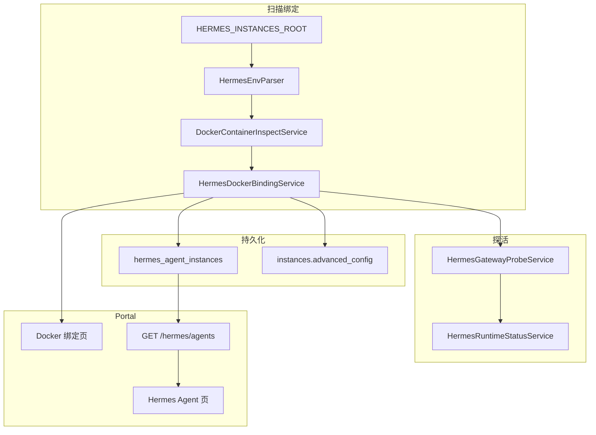

# v4.4 Hermes Agent Bind 实施计划

## 背景与根因

当前绑定链路（[`docker_attach_service.py`](nodeskclaw-backend/app/services/docker_attach_service.py) + [`docker_instance_layout_resolver.py`](nodeskclaw-backend/app/services/docker_instance_layout_resolver.py)）只解析 `HERMES_WEBUI_PORT`，`layout_to_advanced_config()` 不写入 `gateway_url`；[`HermesAgentAdapter._get_base_url()`](nodeskclaw-backend/app/services/hermes_skill/hermes_agent_adapter.py) 因此落到 WebUI/`ingress_domain`。

Hermes MCP > Hermes Agent 页（[`AgentsView.vue`](nodeskclaw-portal/src/views/hermes/AgentsView.vue)）调用 `GET /hermes/agents/runtime`，而 [`HermesAgentRuntimeService._discover_agent_ids()`](nodeskclaw-backend/app/services/hermes_skill/hermes_agent_runtime_service.py) 仅发现 **已安装 Skill 的 agent_id**，与已绑定的 `hermes-webui-expert` 外部实例无关 → 页面常显示「暂无 Agent」。

PRD 目标：以 `HERMES_GATEWAY_PORT → 8642` 作为 Runtime 真实 endpoint，目录扫描 + Docker inspect + Gateway 探活 → 持久化 → Portal 展示。



---

## 前端表现变化

### 1. 创建实例页 — Docker 绑定表格与确认区

**总结**: 绑定列表从「只展示 WebUI 端口/地址」→「同时展示 Gateway 端口、Gateway 地址、Gateway/Runtime/MCP 状态与错误提示」

**元素级变化**:
- 绑定表格: **新增** Gateway 端口、Gateway 地址、Gateway 状态、Runtime 状态、MCP 状态列；保留现有 Profile/容器名/Docker/Health/WebUI 列
- 关联确认区: **新增** Gateway 地址、Gateway 状态、Runtime 状态、MCP 状态、最后探活时间
- 错误提示: `.env` 缺 `HERMES_GATEWAY_PORT` 时 **新增** 黄色/红色配置错误文案；Gateway 不通时 **新增** 可操作提示（检查端口映射到 8642）
- 操作: **新增**「刷新状态」「诊断」按钮（单实例探活 / 跳转诊断）
- 状态 Badge: `ready/online` 绿色、`degraded/timeout/unauthorized` 黄色、`offline/unavailable` 红色、`unconfigured` 灰色

**改动前**（绑定确认区）:
```
容器名: hermes-common-writer
WebUI: http://host:8900
```

**改动后**:
```
容器名: hermes-common-writer
WebUI:  http://host:8900
Gateway: http://host:18900  [online]
Runtime: ready   MCP: ready
最后探活: 2026-06-16 10:00:00
```

### 2. Hermes MCP > Hermes Agent 页

**总结**: 「暂无 Agent」→ 展示已扫描/绑定的 Docker 专家实例（common-writer 等），数据源从 Skill Installation 改为 Gateway Runtime 列表

**元素级变化**:
- 空状态: 无数据时文案改为引导「扫描已有容器」（链到创建实例绑定或调用 scan-existing）
- 列表卡片: **新增** Profile、容器名、Docker 状态、Gateway 状态、Runtime 状态、MCP 状态、WebUI/Gateway 地址、最后探活
- 刷新按钮: 点击后先 `POST /hermes/agents/probe-all` 再 `GET /hermes/agents`
- 操作: **新增** 打开 WebUI（外链）、单实例刷新、查看诊断
- 移除/降级: 原 enable/disable/drain 治理操作保留在 [`/hermes/agents/runtime`](nodeskclaw-portal/src/router/hermes.ts) 或仅当 `instance_id` 存在时显示

### 3. Hermes MCP > Hermes 运行时页

**总结**: 在现有 Worker/队列控制之上 **新增** Agent Runtime 聚合统计区

**元素级变化**:
- **新增** 统计卡片: 全部 / Ready / Degraded / Unavailable / Unconfigured 实例数
- **新增** 实例列表: 实例名、Gateway URL、Runtime 状态、MCP 状态、最近错误
- 批量刷新: 调用 `probe-all` 后刷新统计

---

## 技术方案

### Epic 1: 数据模型与配置

**新增 Model** [`HermesAgentInstance`](nodeskclaw-backend/app/models/hermes_skill/hermes_agent_instance.py)（表 `hermes_agent_instances`），字段对齐 PRD §7.1：

- 核心: `org_id`, `profile_name`, `container_name`, `container_id`, `image`
- Docker: `docker_status`, `docker_health`
- 网络: `host_ip`, `webui_port`, `webui_url`, `gateway_port`, `gateway_url`, `gateway_status`
- 状态: `runtime_status`, `mcp_status`（与 v4.2 `hermes_agent_runtime_states.runtime_status` 语义不同，API 层用 `gateway_runtime_status` 或文档区分）
- 路径: `instance_dir`, `data_dir`, `env_file`, `compose_file`, `compose_project`
- 关联: `instance_id`（可空 FK → `instances.id`，Portal 绑定后回填）
- 审计: `managed_mode`, `last_probe_at`, `last_seen_at`, `last_error`

**唯一约束**（Partial Unique Index）: `(org_id, profile_name)`, `(org_id, container_name)`

**Alembic**: `uv run alembic revision --autogenerate -m "hermes v4.4 agent instances gateway runtime"`

**配置项**（[`config.py`](nodeskclaw-backend/app/core/config.py)）:
- `HERMES_INSTANCES_ROOT`（默认复用 `get_docker_attach_scan_dirs()` 首项或 `DOCKER_DATA_DIR/instances`）
- `HERMES_DEFAULT_GATEWAY_INTERNAL_PORT=8642`
- `HERMES_AGENT_HOST_IP`（默认回落 `DOCKER_PUBLIC_HOST` 或 `host.docker.internal`/`localhost`）
- `HERMES_GATEWAY_PROBE_TIMEOUT_SECONDS=3`
- `HERMES_GATEWAY_PROBE_CONCURRENCY=5`
- `HERMES_AUTO_PROBE_AFTER_SCAN=true`

在 [`models/hermes_skill/__init__.py`](nodeskclaw-backend/app/models/hermes_skill/__init__.py) 注册新 Model。

---

### Epic 2: 服务层（落地于 `hermes_external/`，与现有外部 Docker 逻辑同包）

| 服务 | 文件 | 职责 |
|------|------|------|
| `HermesEnvParser` | `hermes_env_parser.py` | 解析 `.env` 白名单字段；缺 `HERMES_GATEWAY_PORT` 抛 `HERMES_GATEWAY_PORT_MISSING` |
| `DockerContainerInspectService` | `docker_container_inspect_service.py` | 复用/抽取 `status_service._docker_inspect`；校验 `gateway_port:8642` 端口映射 |
| `HermesGatewayProbeService` | `hermes_gateway_probe_service.py` | 多路径探活 `/health` → `/api/health` → `/v1/health` → `/`；3s 超时；并发限制 5 |
| `HermesRuntimeStatusService` | `hermes_runtime_status_service.py` | PRD §9.1/9.2 状态机 |
| `HermesAgentDiagnosticsService` | `hermes_agent_diagnostics_service.py` | PRD §11.6 checks 列表 |
| `HermesDockerBindingService` | `hermes_docker_binding_service.py` | 目录扫描 → env → inspect → upsert → 可选探活 |

**扩展现有解析**:
- [`docker_instance_layout_resolver.py`](nodeskclaw-backend/app/services/docker_instance_layout_resolver.py): `_read_env_port` 泛化为读 `HERMES_GATEWAY_PORT`；`DockerInstanceLayout` 增加 `gateway_host_port`, `gateway_url`；`layout_to_advanced_config` 写入 `gateway` 块 + 顶层 `gateway_url`/`hermes_base_url`
- [`docker_attach_service.attach_existing_container()`](nodeskclaw-backend/app/services/docker_attach_service.py): attach 成功后调用 `HermesDockerBindingService.upsert_from_layout()` 并关联 `instance_id`
- [`AttachableContainerInfo`](nodeskclaw-backend/app/schemas/docker_attach.py): 增加 gateway 相关字段供前端表格展示

---

### Epic 3: REST API

**新路由** [`agents_bind_router.py`](nodeskclaw-backend/app/api/hermes_skill/agents_bind_router.py)，挂载于 [`router.py`](nodeskclaw-backend/app/api/hermes_skill/router.py)。

**路由注册顺序**（静态路径优先，避免与 `agents_runtime_router` 的 `{agent_id}` 冲突）:

| 方法 | 路径 | 权限 |
|------|------|------|
| POST | `/agents/scan-existing` | admin/owner + `hermes_agent:manage` |
| POST | `/agents/probe-all` | 同上 |
| GET | `/agents` | `hermes_agent:view` |
| GET | `/agents/{profile_name}` | view |
| POST | `/agents/{profile_name}/probe` | manage |
| GET | `/agents/{profile_name}/diagnostics` | view |

**Schema**: [`schemas/hermes_skill/hermes_agent_instance.py`](nodeskclaw-backend/app/schemas/hermes_skill/hermes_agent_instance.py)

**错误码**（i18n message_key）: `HERMES_ENV_NOT_FOUND`, `HERMES_GATEWAY_PORT_MISSING`, `HERMES_CONTAINER_NOT_FOUND`, `HERMES_CONTAINER_NOT_RUNNING`, `HERMES_GATEWAY_PORT_NOT_MAPPED`, `HERMES_GATEWAY_PROBE_FAILED`, `HERMES_GATEWAY_UNAUTHORIZED`

**保留** v4.2 治理 API `GET /hermes/agents/runtime` 不变；v4.4 列表走 `GET /hermes/agents`。

---

### Epic 4: 与 v4.2/v4.3 桥接（最小必要）

- [`HermesAgentAdapter._get_base_url()`](nodeskclaw-backend/app/services/hermes_skill/hermes_agent_adapter.py): 外部 Docker 实例（`binding_type=external_docker`）优先读 `advanced_config.gateway_url` / `hermes_agent_instances.gateway_url`
- [`HermesAgentRuntimeService.health_check()`](nodeskclaw-backend/app/services/hermes_skill/hermes_agent_runtime_service.py): 对外部实例探活 Gateway 而非 WebUI
- [`AgentAliasResolver`](nodeskclaw-backend/app/services/hermes_skill/agent_alias_resolver.py): `list_available_agents` 合并 `hermes_agent_instances`（`runtime_status=ready` 且有关联 `instance_id`）— 使 v4.3 Desktop Client 能发现已绑定专家
- [`runtime_diagnostics_service`](nodeskclaw-backend/app/services/hermes_skill/runtime_diagnostics_service.py): agents 段补充 gateway 探活结果（DiagnosticsView 不再只有 path 检查）

**不改动**: copilot-docker 部署、容器内 8642 默认端口、Skill 安装主流程。

---

### Epic 5: Portal 前端

| 文件 | 改动 |
|------|------|
| 新建 [`api/hermes/agentInstances.ts`](nodeskclaw-portal/src/api/hermes/agentInstances.ts) | scan/list/get/probe/probeAll/diagnostics |
| [`AgentsView.vue`](nodeskclaw-portal/src/views/hermes/AgentsView.vue) | 切换数据源；Gateway/Runtime 状态 UI |
| [`CreateInstance.vue`](nodeskclaw-portal/src/views/CreateInstance.vue) | 表格/确认区 Gateway 字段；错误态 |
| [`RuntimeView.vue`](nodeskclaw-portal/src/views/hermes/RuntimeView.vue) | 聚合统计 + 实例 Runtime 列表 |
| [`zh-CN.ts` / `en-US.ts`](nodeskclaw-portal/src/i18n/locales/) | 新增 hermes.agentInstances.* / createInstance.attachGateway* 词条 |

---

### Epic 6: 测试

| 测试文件 | 覆盖 |
|----------|------|
| `test_hermes_env_parser.py` | 引号/注释/缺端口 |
| `test_hermes_runtime_status_service.py` | PRD §9 状态矩阵 |
| `test_hermes_gateway_probe_service.py` | mock httpx：online/unauthorized/timeout |
| `test_hermes_docker_binding_service.py` | 扫描 upsert（tmp dir + mock docker） |
| `test_agents_bind_api.py` | API 契约 + 权限 + 错误码 |

---

### Epic 7: 文档

- 更新 [`nodeskclaw-backend/README.md`](nodeskclaw-backend/README.md)：新增 v4.4 环境变量与 API 摘要
- PRD 已在 [`docs_prd/team_v4.4_hermes-docker-instance.md`](docs_prd/team_v4.4_hermes-docker-instance.md)；若本地有 `ee/docs/`，同步更新后端架构设计 Hermes 章节（CE 仓库不新建 docs 目录）

---

## 实施顺序

1. Model + Migration + Config
2. EnvParser + StatusService + GatewayProbe（可单测）
3. DockerBindingService + 扩展 layout_resolver / docker_attach
4. agents_bind_router API
5. Adapter / AliasResolver / Diagnostics 桥接
6. Portal 三页 + i18n
7. 集成测试 + README

---

## 风险与决策

| 点 | 处理 |
|----|------|
| `runtime_status` 字段重名 | DB 用 `gateway_runtime_status` 或 API 响应字段名 `runtime_status`（文档注明与 v4.2 治理状态不同） |
| 无 Docker 环境 CI | 单测 mock subprocess/httpx；集成测试用 fixture .env + fake inspect JSON |
| `GET /agents` vs `/agents/runtime` 并存 | AgentsView 用 v4.4；治理操作保留 runtime 路由，UI 加链接说明 |
| Windows 开发机无 `/data/copilot-docker` | 配置 `HERMES_INSTANCES_ROOT` 指向测试目录；单测用 `tmp_path` |

---

## 验收对照（PRD §20）

- 扫描 `common-writer` 后列表含 webui_url + gateway_url
- Gateway 探活成功 → `gateway_status=online`, `runtime_status=ready`, `mcp_status=ready`
- Hermes Agent 页显示已绑定实例，不再空白
- 缺 `HERMES_GATEWAY_PORT` → `unconfigured` + 明确错误文案
