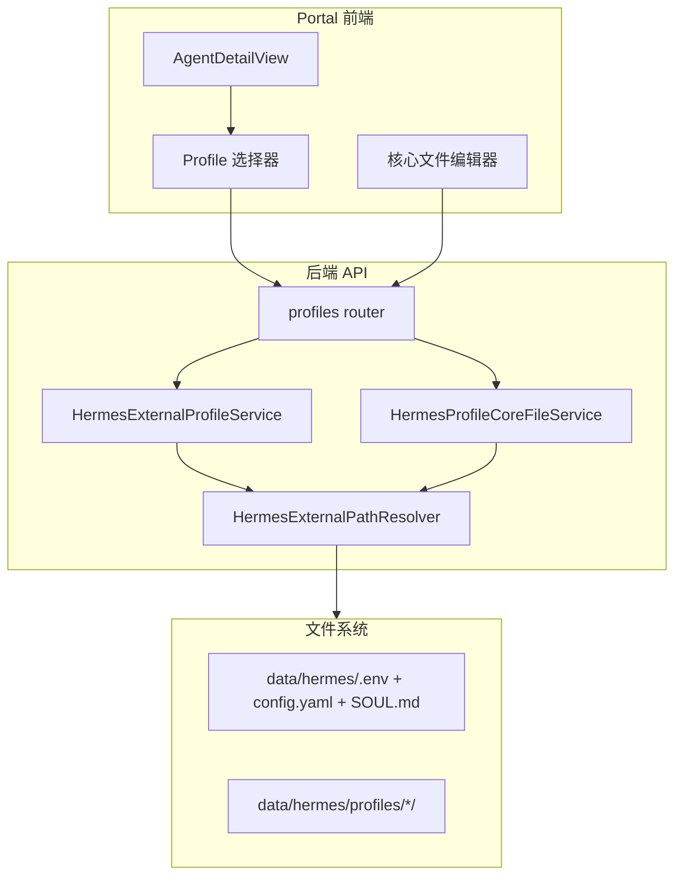

# v4.5 Hermes Docker 多 Profile 与核心配置文件管理 — 实施计划

## 前端表现变化

### 1. AI 员工列表页 → 新增"详情"入口

**总结**: AI 员工卡片新增"详情"按钮，点击进入该实例的详情页（含 Profile 管理）

**元素级变化**:
- 每个 Agent 卡片操作区: **新增**"详情"按钮，点击跳转到 `/hermes/agents/:profileName` 详情页
- 详情页左侧导航: **新增** 概览、运行状态、模型配置、技能清单、文件、备份 6 个 Tab

**改动后**:
```
+- Agent 卡片 -------------------------+
| common-writer [Docker: running]       |
| ...existing badges and info...        |
| [WebUI] [探活] [测试调用] [诊断] [详情] |  <-- 新增"详情"
+---------------------------------------+
```

### 2. AI 员工详情页 — 模型配置

**总结**: 新增 Profile 选择器 + 三页签（环境变量 / 配置文件 / 角色定义）编辑器页面

**元素级变化**:
- Profile 选择器: **新增**，下拉选择 default / writer / researcher 等，来源为 API 动态扫描
- 三个 Tab 页签: **新增** "环境变量"、"配置文件"、"角色定义"
- 文件路径提示: **新增**，每个页签顶部显示当前文件绝对路径
- 代码编辑区: **新增**，textarea/monospace 编辑器，显示文件内容
- 操作按钮: **新增** "重载"、"校验"、"保存"、"保存并重启" 4 个按钮

**改动后**:
```
+- AI 员工详情: common-writer ----------------+
| [概览] [运行状态] [模型配置] [技能] [文件] [备份] |
|                                              |
| Profile: [default v]  [+ 创建] [刷新]         |
|                                              |
| [环境变量] [配置文件] [角色定义]                 |
| -------------------------------------------- |
| 当前文件: /data/.../data/hermes/.env           |
| +------------------------------------------+ |
| | API_SERVER_ENABLED=true                   | |
| | API_SERVER_HOST=0.0.0.0                   | |
| | ...                                       | |
| +------------------------------------------+ |
| [重载] [校验]           [保存] [保存并重启]     |
+----------------------------------------------+
```

---

## 架构概述

在现有 `hermes_external` 服务层和 `external_docker` API 路由基础上扩展，不改变现有容器绑定逻辑。



---

## 文件清单

### 后端 — 新建

| 文件 | 职责 |
|------|------|
| `nodeskclaw-backend/app/services/hermes_external/profile_service.py` | Profile 列表扫描、创建、删除 |
| `nodeskclaw-backend/app/services/hermes_external/core_file_service.py` | 核心文件读/写/校验/备份 |
| `nodeskclaw-backend/app/api/external_docker_profiles.py` | Profile + CoreFile API 路由 |
| `nodeskclaw-backend/app/schemas/external_docker_profiles.py` | Profile 相关 Pydantic schema |

### 后端 — 修改

| 文件 | 改动 |
|------|------|
| [`nodeskclaw-backend/app/services/hermes_external/path_resolver.py`](nodeskclaw-backend/app/services/hermes_external/path_resolver.py) | `resolve_profile()` 方法、`validate_profile_name()` 方法 |
| [`nodeskclaw-backend/app/api/router.py`](nodeskclaw-backend/app/api/router.py) | 注册新的 profiles router |

### 前端 — 新建

| 文件 | 职责 |
|------|------|
| `nodeskclaw-portal/src/views/hermes/AgentDetailView.vue` | AI 员工详情页（Tab 布局 + Profile 选择器） |
| `nodeskclaw-portal/src/views/hermes/AgentProfileConfigView.vue` | 模型配置页（三页签编辑器） |
| `nodeskclaw-portal/src/api/hermes/agentProfiles.ts` | Profile 列表 + CoreFile CRUD API |

### 前端 — 修改

| 文件 | 改动 |
|------|------|
| [`nodeskclaw-portal/src/router/hermes.ts`](nodeskclaw-portal/src/router/hermes.ts) | 新增 `/hermes/agents/:profileName` 详情路由 |
| [`nodeskclaw-portal/src/views/hermes/AgentsView.vue`](nodeskclaw-portal/src/views/hermes/AgentsView.vue) | 卡片新增"详情"按钮 |
| [`nodeskclaw-portal/src/i18n/locales/zh-CN.ts`](nodeskclaw-portal/src/i18n/locales/zh-CN.ts) | 新增 hermes.agents.detail / profiles 相关词条 |
| [`nodeskclaw-portal/src/i18n/locales/en-US.ts`](nodeskclaw-portal/src/i18n/locales/en-US.ts) | 同步英文词条 |

---

## 实施任务

### Task 1: PathResolver 扩展 — `resolve_profile()` + `validate_profile_name()`

**修改文件**: `nodeskclaw-backend/app/services/hermes_external/path_resolver.py`

- 新增 `@dataclass HermesProfilePaths`，包含 `profile`、`profile_type`、`profile_dir`、`env_file`、`config_file`、`soul_file`、`skills_dir`、`workspace_dir`、`backups_dir`
- 新增 `resolve_profile(instance, profile_name)` 方法：
  - `default` -> `host_data_dir`
  - 其他 -> `host_data_dir / "profiles" / profile_name`
- 新增 `validate_profile_name(name)` 方法：只允许 `[a-z0-9_-]+`，禁止 `..`、`/`、空格、中文

### Task 2: ProfileService — 列表扫描 / 创建 / 删除

**新建文件**: `nodeskclaw-backend/app/services/hermes_external/profile_service.py`

- `list_profiles(instance)` — 返回 default + profiles/* 动态扫描结果
- `get_profile(instance, profile_name)` — 获取单个 profile 信息
- `create_profile(instance, profile_name, from_profile=None)` — 创建（可选从已有 profile 复制）
- `delete_profile(instance, profile_name)` — 删除扩展 profile（禁止删除 default）
- 每个 profile 返回 `status`: `config_only` / `missing_files`

### Task 3: CoreFileService — 读/写/校验/备份

**新建文件**: `nodeskclaw-backend/app/services/hermes_external/core_file_service.py`

- `read_core_file(instance, profile, kind)` — 读取 .env / config.yaml / SOUL.md
- `validate_core_file(kind, content)` — env: KEY=VALUE 格式校验; config: YAML 格式校验; soul: 非空校验
- `save_core_file(instance, profile, kind, content, restart_after_save)` — 备份旧文件 + 写入新内容 + 可选重启
- 备份路径按 PRD 规定：default 放 `backups/core-files/default/`，扩展放 `profiles/<p>/backups/core-files/`

### Task 4: Schema 定义

**新建文件**: `nodeskclaw-backend/app/schemas/external_docker_profiles.py`

Pydantic models:
- `ProfileListItem`: profile, profile_type, profile_dir, env_exists, config_exists, soul_exists, status
- `ProfileListResponse`: items
- `CoreFileReadResponse`: profile, kind, file_name, file_path, exists, content, requires_restart, readonly
- `CoreFileValidateRequest/Response`: content / valid, message
- `CoreFileSaveRequest`: content, restart_after_save
- `CoreFileSaveResponse`: success, profile, kind, file_path, backup_file, restarted, message

### Task 5: API 路由 — Profiles + CoreFiles

**新建文件**: `nodeskclaw-backend/app/api/external_docker_profiles.py`

端点（挂在 `/instances` prefix 下）:
- `GET /{instance_id}/external-docker/profiles` — Profile 列表
- `POST /{instance_id}/external-docker/profiles` — 创建 Profile
- `DELETE /{instance_id}/external-docker/profiles/{profile}` — 删除 Profile
- `GET /{instance_id}/external-docker/profiles/{profile}/core-files/{kind}` — 读取核心文件
- `POST /{instance_id}/external-docker/profiles/{profile}/core-files/{kind}/validate` — 校验
- `PUT /{instance_id}/external-docker/profiles/{profile}/core-files/{kind}` — 保存

其中 `kind` 枚举: `env` / `config` / `soul`

**修改文件**: `nodeskclaw-backend/app/api/router.py` — 注册新 router

### Task 6: 前端 API 层

**新建文件**: `nodeskclaw-portal/src/api/hermes/agentProfiles.ts`

函数:
- `listProfiles(instanceId)`
- `createProfile(instanceId, name, fromProfile?)`
- `deleteProfile(instanceId, profile)`
- `readCoreFile(instanceId, profile, kind)`
- `validateCoreFile(instanceId, profile, kind, content)`
- `saveCoreFile(instanceId, profile, kind, content, restartAfterSave)`

### Task 7: 前端路由 + AgentsView 详情入口

**修改文件**:
- `nodeskclaw-portal/src/router/hermes.ts` — 新增 `{ path: '/hermes/agents/:profileName', name: 'HermesAgentDetail', component: ... }`
- `nodeskclaw-portal/src/views/hermes/AgentsView.vue` — 每个 agent 卡片新增"详情"按钮，`router.push({ name: 'HermesAgentDetail', params: { profileName } })`

### Task 8: 前端 AgentDetailView — 详情页框架

**新建文件**: `nodeskclaw-portal/src/views/hermes/AgentDetailView.vue`

- 顶部显示 agent 基础信息（profile_name, container_name, 状态 badge）
- Tab 导航: 概览 / 运行状态 / 模型配置 / 技能清单 / 文件 / 备份
- 默认 Tab = 概览（复用现有概览数据）
- Profile 选择器只在"模型配置"/"技能清单"/"文件"/"备份" Tab 中显示
- Profile 参数同步到 URL query `?profile=xxx`

### Task 9: 前端 AgentProfileConfigView — 模型配置三页签

**新建文件**: `nodeskclaw-portal/src/views/hermes/AgentProfileConfigView.vue`

- Profile 选择器（使用 `listProfiles` 拉取列表）
- 三个 Tab: 环境变量 / 配置文件 / 角色定义
- 每个 Tab 顶部显示文件绝对路径
- 代码编辑区（monospace textarea，未来可升级为 Monaco）
- 操作按钮: 重载 / 校验 / 保存 / 保存并重启
- 校验结果以 toast 或 inline message 反馈
- 保存时弹确认框（保存并重启额外提示"容器将重启"）

### Task 10: i18n 词条

**修改文件**: `zh-CN.ts` / `en-US.ts`

新增词条:
```
hermes.agents.detail / goDetail
hermes.profiles.title / selector / default / create / delete / refresh
hermes.profiles.coreFiles.env / config / soul
hermes.profiles.coreFiles.reload / validate / save / saveAndRestart
hermes.profiles.coreFiles.filePath / validateSuccess / validateFailed
hermes.profiles.coreFiles.saveSuccess / saveAndRestartSuccess
hermes.profiles.coreFiles.confirmRestart
```

---

## 兼容性保证

- 现有 API（`/{instance_id}/external-docker/model-config` 等）保留不动，等价 `profile=default`
- 新 API 路径独立: `/{instance_id}/external-docker/profiles/...`
- `HermesDockerBindingService` 的 `scan_existing()`、`probe_one()` 等不受影响
- `HermesExternalPathResolver.resolve()` 不修改，新增 `resolve_profile()` 独立方法

## 安全要求

- CoreFile 读写需 `InstanceRole.admin` 权限
- `.env` 文件中的 `API_SERVER_KEY`、`*_API_KEY`、`PASSWORD`、`SECRET`、`TOKEN` 字段在摘要模式脱敏
- raw 编辑只对管理员开放
- `validate_profile_name()` 防止路径穿越（`..`、绝对路径、软链接）
- 审计记录所有核心文件操作（不记录 content）
