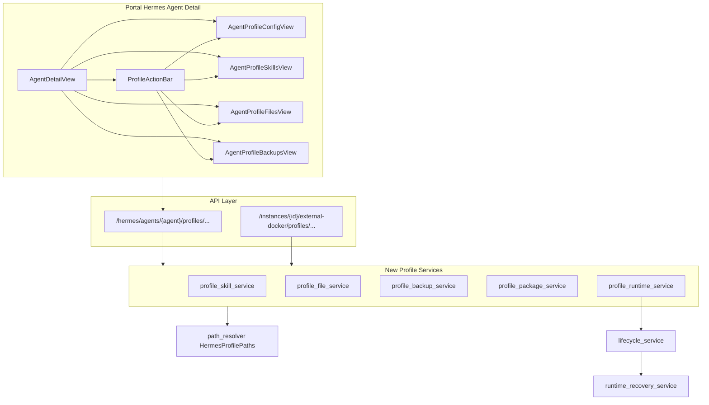

# v4.6 Hermes Docker Profile 完整管理实施计划

## 现状与差距

**已完成（v4.5 / v4.5.1）**：
- 后端：[`profile_service.py`](nodeskclaw-backend/app/services/hermes_external/profile_service.py)、[`core_file_service.py`](nodeskclaw-backend/app/services/hermes_external/core_file_service.py)、[`path_resolver.py`](nodeskclaw-backend/app/services/hermes_external/path_resolver.py)、[`runtime_recovery_service.py`](nodeskclaw-backend/app/services/hermes_external/runtime_recovery_service.py)
- API：[`agents_bind_router.py`](nodeskclaw-backend/app/api/hermes_skill/agents_bind_router.py)（Agent 维度）、[`external_docker_profiles.py`](nodeskclaw-backend/app/api/external_docker_profiles.py)（Instance 维度）
- 前端：[`AgentProfileConfigView.vue`](nodeskclaw-portal/src/views/hermes/AgentProfileConfigView.vue)（模型配置三页签 + 创建/删除/dirty guard）

**v4.6 缺口**（PRD [`docs_prd/team_v4.6_complete-multi-profiles.md`](docs_prd/team_v4.6_complete-multi-profiles.md)）：
- per-profile 技能清单 / 文件 / 备份
- clone / export / import
- 运行 Profile 切换（`activate`）
- 详情页 skills / files / backups Tab 仍为 coming soon
- `active_profile` 检测未读 `.active_profile` 文件

**可复用实例级逻辑**（需改为 Profile 作用域）：
- [`skill_service.py`](nodeskclaw-backend/app/services/hermes_external/skill_service.py) — 内置包、zip 上传、Git 安装、启用/禁用
- [`file_service.py`](nodeskclaw-backend/app/services/hermes_external/file_service.py) — scope 列表
- [`backup_service.py`](nodeskclaw-backend/app/services/hermes_external/backup_service.py) — tar/zip 备份模式
- [`expert_filesystem.safe_extract_zip`](nodeskclaw-backend/app/services/hermes_expert/expert_filesystem.py) — zip slip 防护
- 前端参考：[`ExternalDockerSkills.vue`](nodeskclaw-portal/src/views/external-docker/ExternalDockerSkills.vue)、[`ExternalDockerFiles.vue`](nodeskclaw-portal/src/views/external-docker/ExternalDockerFiles.vue)、[`ExternalDockerBackups.vue`](nodeskclaw-portal/src/views/external-docker/ExternalDockerBackups.vue)



---

## 前端表现变化

### 1. AI 员工详情页 — 统一 Profile 操作区

**总结**：模型配置 / 技能 / 文件 / 备份四个 Tab 顶部新增统一 Profile 操作栏，支持设为运行、克隆、导出、导入、删除、刷新。

**元素级变化**：
- Profile 操作栏组件：**新增**，位于四个 Profile 相关 Tab 顶部
- 当前 Profile 信息区：**新增** 显示 Profile 名、状态徽标（绿/灰/黄/红）、目录路径
- 「设为运行」按钮：**新增**；`active_runtime` / `missing_files` / `invalid` 时 disabled
- 「克隆」按钮：**新增**，打开克隆弹窗（目标名、是否含 skills/workspace）
- 「导出」按钮：**新增**，打开导出弹窗
- 「导入」按钮：**新增**，打开 zip 上传弹窗
- 「删除」「刷新」：从模型配置页**提升到**操作栏，四 Tab 共用
- 详情页顶部横幅：继续显示「当前运行 Profile / Runtime Model」（激活后自动刷新）

**改动后示意**：
```
┌─ common-writer 详情 ─────────────────────────────┐
│ 当前运行 Profile: writer-zh  Runtime Model: ...   │
│ [概览][运行状态][模型配置][技能清单][文件][备份]    │
├─ Profile 操作区 ─────────────────────────────────┤
│ 当前 Profile: writer-zh  [config_only]            │
│ /data/.../profiles/writer-zh                      │
│ [设为运行][克隆][导出][导入][删除][刷新]            │
├─ （Tab 内容：技能表格 / 文件列表 / 备份列表等）      │
└──────────────────────────────────────────────────┘
```

### 2. 技能清单 Tab

**总结**：coming soon 占位 -> 完整技能表格，支持安装/上传/Git/启用/禁用/删除。

**元素级变化**：
- coming soon 虚线框：**删除**
- 技能表格：**新增**（名称、来源、状态、路径、更新时间、操作列）
- 安装内置技能 / 上传 zip / Git 安装：**新增** 按钮与弹窗
- 启用 / 禁用 / 删除：**新增** 行内操作

### 3. 文件 Tab

**总结**：coming soon -> workspace/system 文件浏览与文本编辑。

**元素级变化**：
- scope 切换（workspace / system）：**新增** 自定义 dropdown
- 路径面包屑 + 文件列表：**新增**
- 文本预览/编辑区：**新增**（1MB 限制提示）
- 新建目录、保存、删除：**新增**

### 4. 备份 Tab

**总结**：coming soon -> 备份列表 + 创建/恢复/删除/下载。

**元素级变化**：
- 备份列表表格：**新增**
- 创建备份弹窗（含 skills/workspace 选项、备注）：**新增**
- 恢复弹窗（恢复前自动备份提示、是否重启）：**新增**
- 删除需输入 backup_id 确认：**新增**

### 5. 模型配置 Tab

**总结**：Profile 选择器与创建/删除操作迁移到统一操作栏，页内只保留三核心文件编辑。

**元素级变化**：
- 顶部 Profile 下拉 + 创建/删除区块：**移除**（迁至 `ProfileActionBar`）
- 三页签编辑器、dirty guard、保存并重启：**保留**

---

## 后端实施

### 阶段 A：Schema 与路径基础

**位置**：[`app/schemas/external_docker_profiles.py`](nodeskclaw-backend/app/schemas/external_docker_profiles.py)（或新建 `profile_extended.py`）

**新增模型**（按 PRD 第 6–12 节）：
- 技能：`ProfileSkillsResponse`、`ProfileSkillItem`、`ProfileSkillBuiltinRequest`、`ProfileSkillGitRequest` 等
- 文件：`ProfileFilesResponse`、`ProfileFileReadResponse`、`ProfileFileWriteRequest`、`ProfileFileMkdirRequest`、`ProfileFileDeleteRequest`
- 备份：`ProfileBackupListResponse`、`ProfileBackupCreateRequest`、`ProfileBackupRestoreRequest`、`ProfileBackupDeleteRequest`
- 包管理：`ProfileCloneRequest`、`ProfileExportRequest`、`ProfileImport`（multipart）、`ProfileActivateRequest` 及各 Response

**修改**：[`profile_service._detect_active_profile`](nodeskclaw-backend/app/services/hermes_external/profile_service.py)
- 优先读取 `data/hermes/.active_profile` 确定 `active_profile`
- fallback 保留 v4.5.1 启发式（`API_SERVER_MODEL_NAME` 匹配 agent profile_name）

### 阶段 B：五个 Profile 服务（PRD 第 15 节）

| 新服务 | 职责 | 路径锚点 |
|--------|------|----------|
| `profile_skill_service.py` | 列表、builtin/upload/git、enable/disable、delete、rescan | `HermesProfilePaths.skills_dir` |
| `profile_file_service.py` | list/read/write/mkdir/delete | workspace=`profile_dir/workspace`；system=`profile_dir`（default 时 `host_data_dir`） |
| `profile_backup_service.py` | 创建 zip、列表、恢复、删除、下载 | `profile_dir/backups/` 或 `host_data_dir/backups/profiles/<profile>/` |
| `profile_package_service.py` | clone、export zip、import zip + `manifest.json` | 复用 `safe_extract_zip`、路径校验 |
| `profile_runtime_service.py` | `activate_profile` | 同步三核心文件到 `data/hermes/`、写 `.active_profile`、可选 restart + `wait_for_runtime_recovery` |

**安全约束（所有服务共用）**：
- 通过 [`path_resolver.validate_profile_path`](nodeskclaw-backend/app/services/hermes_external/path_resolver.py) / `ensure_profile_dir_safe` 防越界与 symlink
- 文件写入禁止通过 file API 修改 `.env` / `config.yaml` / `SOUL.md`（仍走 core_file API）
- zip 操作统一 zip slip 检查；审计/日志脱敏敏感 KEY

**技能服务实现要点**：
- 从 [`skill_service.py`](nodeskclaw-backend/app/services/hermes_external/skill_service.py) 抽取 `_install_skill_dir`、`_backup_skill_dir`、Git clone 逻辑，目标目录改为 `pp.skills_dir`
- MVP 启用/禁用：`.disabled` 文件（PRD 6.6）
- 内置包源：`RESOURCES_ROOT / "skill-bundles"`（与实例级一致）
- Git 安装：复用 `_clone_skill_repo`；域名白名单新增配置项 `HERMES_GIT_ALLOWED_HOSTS`（逗号分隔，默认可先仅校验 http/https + 可选 host 列表）

**备份/导出 zip 内容**（PRD 8.1 / 10.1）：
```
manifest.json, .env, config.yaml, SOUL.md, skills/, workspace/
```
排除：`backups/`, `sessions/`, `logs/`, `cache/`

**激活流程**（PRD 12.2）：
1. 校验 profile 状态非 `missing_files` / `invalid`
2. 校验三核心文件存在且通过 `core_file_service.validate_core_file`
3. 备份当前 `data/hermes` 三核心文件
4. 若 target 为扩展 Profile：复制其三核心文件到 `data/hermes/`；若为 `default`：跳过复制（已是运行目录）
5. 写入 `data/hermes/.active_profile`
6. `restart_after_activate` 时走 `lifecycle_service.restart` + `wait_for_runtime_recovery`
7. 返回 `active_profile`、`previous_active_profile`、`runtime_status`

**禁止**：Profile 页面/API 不得写入实例根 `.env`（`docker_env_file`）

### 阶段 C：API 路由

**Agent 维度** — 扩展 [`agents_bind_router.py`](nodeskclaw-backend/app/api/hermes_skill/agents_bind_router.py)：
- 复用已有 `_resolve_bound_instance` / `_host_data_dir_context` 双路径模式
- 新增 PRD 第 16 节全部端点（skills / files / backups / clone / export / import / activate）
- viewer 读、admin 写；所有写操作 `SkillAuditLogger`（事件名见 PRD Task 10）

**Instance 维度** — 扩展 [`external_docker_profiles.py`](nodeskclaw-backend/app/api/external_docker_profiles.py)：
- 与 Agent 路由对称挂载，供实例详情页未来接入（Portal v4.6 主路径仍走 Agent API）

**下载端点**：
- `GET .../backups/{backup_id}/download`
- `GET .../exports/{export_id}/download`
- 使用 `FileResponse`，路径经 profile 备份目录校验

### 阶段 D：测试

**位置**：[`tests/hermes_skill/`](nodeskclaw-backend/tests/hermes_skill/)

| 用例 | 验证点 |
|------|--------|
| default vs extended skills 目录隔离 | 两个 Profile 列表 skills 不同 |
| zip upload zip slip | 恶意 zip 拒绝 |
| file path escape | `../` 拒绝 |
| backup create + restore | 恢复后核心文件一致 |
| clone / export / import roundtrip | manifest + 核心文件 |
| activate extended profile | `.active_profile` 写入、三文件同步、`active_runtime` 切换 |
| activate missing_files | 400 拒绝 |
| delete default / active_runtime | 仍被禁止 |

---

## 前端实施

### 阶段 E：API 层

扩展 [`agentProfiles.ts`](nodeskclaw-portal/src/api/hermes/agentProfiles.ts)：
- `ProfileListResponse` 已有；补充 skills/files/backups/clone/export/import/activate 全套函数
- `deleteProfile` 已支持 `confirm_profile`；新增 `activateProfile`、`cloneProfile`、`exportProfile`、`importProfile` 等
- 下载 backup/export：blob 下载辅助函数

### 阶段 F：共享组件

新建 [`ProfileActionBar.vue`](nodeskclaw-portal/src/views/hermes/ProfileActionBar.vue)：
- props：`agentProfileName`、`selectedProfile`（v-model）、`profileItem`、`activeProfile`、`runtimeModelName`
- emits：`refresh`、`profileChange`、各操作完成
- 按钮 disabled 规则按 PRD 13.1 表格
- 内嵌克隆/导出/导入弹窗（或拆分子 dialog 组件）

### 阶段 G：四个 Profile 子页面

| 组件 | 基于参考 | 要点 |
|------|----------|------|
| `AgentProfileSkillsView.vue` | `ExternalDockerSkills.vue` | 调用 profile skills API；去掉 instanceId inject |
| `AgentProfileFilesView.vue` | `ExternalDockerFiles.vue` | scope dropdown、面包屑、文本编辑 |
| `AgentProfileBackupsView.vue` | `ExternalDockerBackups.vue` | 创建/恢复/删除/下载 |
| `AgentProfileConfigView.vue` | 现有 | 移除重复 Profile 操作区，嵌入 `ProfileActionBar` |

### 阶段 H：详情页集成

修改 [`AgentDetailView.vue`](nodeskclaw-portal/src/views/hermes/AgentDetailView.vue)：
- skills/files/backups Tab 挂载对应子组件
- Profile 选择 `selectedProfile` 四 Tab 共享（query `?profile=` 保持）
- Tab 切换 dirty guard：模型配置 dirty 时拦截（已有）；后续可扩展文件编辑 dirty
- 激活成功后刷新 agent 探活状态 + Profile 列表

### 阶段 I：i18n

更新 [`zh-CN.ts`](nodeskclaw-portal/src/i18n/locales/zh-CN.ts) / [`en-US.ts`](nodeskclaw-portal/src/i18n/locales/en-US.ts)：
- `hermes.profiles.actionBar.*`（设为运行、克隆、导出、导入）
- `hermes.profiles.skills.*`、`hermes.profiles.files.*`、`hermes.profiles.backups.*`
- 弹窗文案、错误提示、分步进度（激活/恢复后等待 Runtime）

---

## 实施顺序建议

按 PRD Task 1–10 依赖顺序分批提交（每批可独立验证）：

1. **后端技能服务 + API + 测试** -> 前端技能 Tab
2. **后端文件服务 + API + 测试** -> 前端文件 Tab
3. **后端备份服务 + API + 测试** -> 前端备份 Tab
4. **后端 package 服务（clone/export/import）+ 测试**
5. **后端 runtime 服务（activate）+ profile_service 状态修复 + 测试**
6. **ProfileActionBar + 四 Tab 集成 + i18n**
7. **全链路验收**（PRD 第 18 节 12 条）

---

## 文档与规范

- 实现前在 `ee/docs/` 补充 v4.6 设计章节（API 清单、激活策略、目录约定）；CE 仓库不新建 `docs/`
- 遵循现有 i18n、`message_key` 错误契约、软删除不适用（纯文件系统操作）
- 不修改 copilot-docker 部署脚本；不触碰实例根 `.env`

---

## 风险与决策

| 项 | 说明 |
|----|------|
| 激活不同步 skills/workspace | PRD MVP 仅同步三核心文件 + `.active_profile`；skills 仍在各 profile 目录，Gateway 读 `data/hermes/skills` — **激活后 skills 可能仍是 default 目录内容**。若需同步 skills，需在 activate 中额外复制 `skills/`（PRD 未要求，实施时保持 PRD 范围） |
| Git 白名单 | PRD 要求域名白名单但未给配置；新增 `HERMES_GIT_ALLOWED_HOSTS` 环境变量 |
| 实例详情页 external-docker | v4.6 Portal 主入口是 Hermes Agent 详情；实例级 external-docker 多 Profile 接入可列为 follow-up |
| 文件上传 | PRD 13.3 MVP 可不做上传；首版实现 list/read/write/mkdir/delete |
