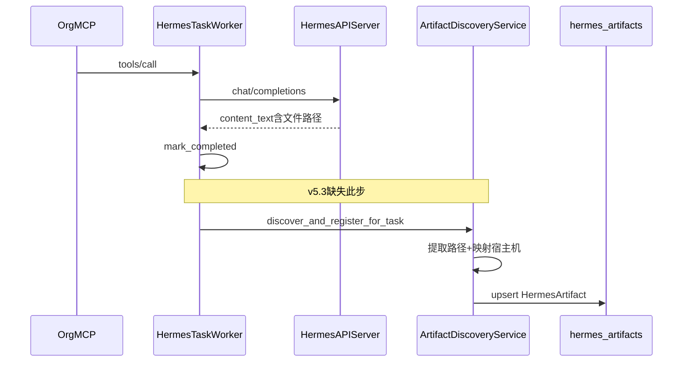

# v5.3.1 Hotfix：Hermes API_SERVER Artifact Discovery 实施计划

## 问题与根因

v5.3 的 [`hermes_task_worker._execute_api_server_task`](nodeskclaw-backend/app/services/hermes_skill/hermes_task_worker.py) 在 `mark_completed` 后直接返回，**未调用** artifact 扫描；而现有 [`ArtifactService.scan_and_register`](nodeskclaw-backend/app/services/hermes_skill/artifact_service.py) 只扫描 `workspace_root/.nodeskclaw/runs/{task_id}/outputs`，与 Hermes 实例 workspace（`/data/hermes/workspace/...`）路径模型不兼容。



---

## 前端表现变化

### 1. Portal Hermes 任务列表 — 任务详情抽屉 Artifacts 区域

**总结**: 产物区从「仅显示文件名列表」→「完整产物卡片 + 空状态引导 + 手动重新扫描」

**元素级变化**:
- Artifacts 标题区: 增加 loading 态（`Loader2` 旋转图标）与产物数量 `({{ n }})`
- 空状态文案: 无产物时仍显示 `hermes.tasks.noArtifacts`；若 `result_summary` 含 `/data/hermes/workspace/` → **新增**黄色提示条，文案「任务结果中包含生成文件路径，但尚未登记为产物…」
- 「重新扫描产物」按钮: **新增**，位于 Artifacts 区标题旁；点击后 disabled + loading，调用 rescan API
- 产物列表: 从单行 `file_name · size` → **卡片式**，展示文件名、类型、大小、相对路径、`来源：{hermes_instance_name}`（从 `metadata_json` 读取）
- 预览/下载按钮: **新增**，复用 [`ArtifactsView.vue`](nodeskclaw-portal/src/views/hermes/ArtifactsView.vue) 的 `previewArtifact` / `downloadArtifact` 调用
- Rescan 成功后: 自动刷新 artifacts 列表；`artifact_count > 0` 显示卡片，`= 0` 回退空状态

**改动前**:
```
┌─ 任务详情抽屉 ─────────────────────┐
│ ... 时间线 ...                      │
│ 产物 (0)                            │
│   暂无产物                          │
└────────────────────────────────────┘
```

**改动后**（有路径但未登记）:
```
┌─ 任务详情抽屉 ─────────────────────┐
│ ... 时间线 ...                      │
│ 产物 (0)          [重新扫描产物]    │
│ ┌─ 提示条 ─────────────────────┐   │
│ │ 结果含文件路径，尚未登记…     │   │
│ └──────────────────────────────┘   │
│   暂无产物                          │
└────────────────────────────────────┘
```

**改动后**（扫描成功）:
```
│ 产物 (1)                            │
│ ┌─ 芯智科技-客户画像.md ─────────┐ │
│ │ markdown · 32 KB              │ │
│ │ reports/sale/xxx.md           │ │
│ │ 来源：common-writer           │ │
│ │ [预览] [下载]                 │ │
│ └───────────────────────────────┘ │
```

涉及文件: [`TasksView.vue`](nodeskclaw-portal/src/views/hermes/TasksView.vue)、[`tasks.ts`](nodeskclaw-portal/src/api/hermes/tasks.ts)、[`artifacts.ts`](nodeskclaw-portal/src/api/hermes/artifacts.ts)、[`zh-CN.ts`](nodeskclaw-portal/src/i18n/locales/zh-CN.ts)、[`en-US.ts`](nodeskclaw-portal/src/i18n/locales/en-US.ts)

---

## 后端实施

### 1. 新增 `ArtifactDiscoveryService`

文件: [`nodeskclaw-backend/app/services/hermes_skill/artifact_discovery_service.py`](nodeskclaw-backend/app/services/hermes_skill/artifact_discovery_service.py)

核心职责（对齐 PRD §11）:

| 步骤 | 实现要点 |
|------|----------|
| 读取 route | 复用 worker 逻辑：`task.routing_metadata.route_snapshot`，fallback `routing_metadata` 本身；再 fallback `installation.routing_metadata`（通过 `task.installation_id`） |
| 路由过滤 | 仅 `route_type == "hermes_api_server"` 时继续，否则返回 `[]` |
| 实例解析 | `HermesAgentInstance.data_dir`（来自绑定记录）→ `host_workspace_root = Path(data_dir) / "workspace"`（与 [`path_resolver.py`](nodeskclaw-backend/app/services/hermes_external/path_resolver.py) 一致） |
| 路径提取 | 正则 `CONTAINER_WORKSPACE_PATH_RE`，前缀限定 `/data/hermes/workspace/`；strip 尾部标点；支持 markdown 反引号/引号 |
| 路径映射 | `relative = container_path.relative_to(container_root)` → `host_path = host_workspace_root / relative` |
| 安全校验 | `PathGuard.validate_file_for_download` + `relative_to(host_workspace_root)` 防穿越 |
| 元数据 | 复用 [`guess_artifact_type`](nodeskclaw-backend/app/services/hermes_skill/output_manifest_parser.py)、`ArtifactService._guess_content_type`、sha256 分块计算 |
| Upsert | 查重 `org_id + task_id + relative_path`（无 DB 唯一约束，service 层幂等）；`force_rescan` 时更新 size/sha256 |
| 入库字段 | 写 `file_path`(宿主机)、`relative_path`、`file_name`、`content_type`、`artifact_type`、`metadata_json`（含 `source: hermes_api_server_workspace`、`container_path`、`hermes_instance_name`、`runtime_skill_id`、`discovered_from`） |
| 事件 | **复用现有** `EventType.ARTIFACT_SCAN_STARTED` / `ARTIFACT_CREATED` / `ARTIFACT_SCAN_COMPLETED` / `ARTIFACT_SCAN_FAILED`（不新增枚举，避免 Alembic）；空结果在 `ARTIFACT_SCAN_COMPLETED` payload 写 `reason: no_artifact_path_found` |

**result_text 来源优先级**:
1. 显式参数 `result_text`（worker 传入完整 `content_text`，**不依赖** 截断后的 `result_summary[:500]`）
2. `task.result_summary`
3. `task.arguments` 等可扩展字段（如有）

**配置项**（写入 [`config.py`](nodeskclaw-backend/app/core/config.py)）:
- `HERMES_ARTIFACT_DISCOVERY_ENABLED`（默认 `true`）
- `HERMES_ARTIFACT_DISCOVERY_CONTAINER_WORKSPACE_ROOT`（默认 `/data/hermes/workspace`）
- `HERMES_ARTIFACT_DISCOVERY_MAX_FILE_SIZE_MB`（默认 `200`，复用或独立）
- `HERMES_ARTIFACT_DISCOVERY_ENABLE_MTIME_FALLBACK`（默认 `false`）

mtime 兜底（PRD §7.3）仅在 `ENABLE_MTIME_FALLBACK=true` 时启用。

### 2. Worker 集成

修改 [`hermes_task_worker.py`](nodeskclaw-backend/app/services/hermes_skill/hermes_task_worker.py) 的 `_execute_api_server_task`：

在 `mark_completed` **之后**、`dispatch_status = finished` 之前：

```python
if settings.HERMES_ARTIFACT_DISCOVERY_ENABLED:
    try:
        await ArtifactDiscoveryService(db).discover_and_register_for_task(
            task=task,
            result_text=content_text,  # 完整响应，非 [:500]
            force_rescan=False,
        )
    except Exception as exc:
        logger.error(...)
        await event_service.write_event(..., ARTIFACT_SCAN_FAILED, ...)
```

**禁止**因 discovery 失败调用 `mark_failed`；任务保持 `completed`。

### 3. 扩展 `ArtifactService` 下载/预览兼容

修改 [`artifact_service.py`](nodeskclaw-backend/app/services/hermes_skill/artifact_service.py) 的 `resolve_and_validate`：

- 若 `artifact.metadata_json.source == "hermes_api_server_workspace"`（或存在 `container_path`）：
  - 用 `metadata_json.host_workspace_root` 或从 task route_snapshot 重新解析 host root
  - 调用 `PathGuard.validate_file_for_download(file_path, host_workspace_root)`
  - **跳过** `validate_within_outputs_dir`（该函数仅适用于 `.nodeskclaw/runs/.../outputs` 路径）

否则保持现有 outputs 目录校验逻辑不变。

### 4. Rescan API

新增 schema: [`nodeskclaw-backend/app/schemas/hermes_skill/artifact_rescan.py`](nodeskclaw-backend/app/schemas/hermes_skill/artifact_rescan.py)

在 [`tasks_router.py`](nodeskclaw-backend/app/api/hermes_skill/tasks_router.py) 新增:

```http
POST /api/v1/hermes/tasks/{task_id}/artifacts/rescan
Body: { "force": true }  // 可选
```

- 鉴权: `require_org_member` + `hermes_task:view`
- 写操作限制: 任务创建者 **或** org `admin`/`operator`（[`OrgMembership.role`](nodeskclaw-backend/app/models/org_membership.py)）；项目无 `hermes_task:manage` 权限码，用角色替代 PRD 中的 manage 语义
- 仅 `status == completed` 可 rescan
- 调用 `ArtifactDiscoveryService.discover_and_register_for_task(force_rescan=body.force)`
- 响应结构按 PRD §17.2（`task_id`、`artifact_count`、`artifacts[]`、`warning` 可选）

现有 `GET /tasks/{task_id}/artifacts` 与 `GET /artifacts?task_id=` **不改契约**，扫描入库后即可返回数据。

---

## 测试计划

### 后端单元测试 — `tests/hermes_skill/test_artifact_discovery_service.py`

覆盖 PRD §30.1 全部用例：路径提取（markdown/纯文本/引号）、非 workspace 路径忽略、容器→宿主机映射、路径穿越拒绝、markdown 登记、upsert 幂等、无路径返回空、缺失文件写 failed event。

### Worker 集成 — 扩展 `test_hermes_task_worker.py` 或 `test_runtime_skill_registration.py`

- `hermes_api_server` 完成后自动调用 discovery（mock 文件系统）
- discovery 抛异常时任务仍为 `completed`
- 使用 `route_snapshot` 中的实例信息解析路径

### API 测试

- rescan completed 任务成功入库
- 非创建者/非 operator 拒绝 rescan（403）
- `GET tasks/{id}/artifacts` 返回登记记录

---

## 数据模型

**无需 Alembic 迁移**：[`HermesArtifact`](nodeskclaw-backend/app/models/hermes_skill/hermes_artifact.py) 已有 `relative_path`、`metadata_json`；`container_path` 写入 `metadata_json`。

---

## 实施顺序

1. `config.py` 配置项 + `artifact_discovery_service.py`（含路径提取/映射/upsert）
2. `artifact_service.py` 下载路径校验分支
3. `hermes_task_worker.py` 自动 discovery 挂钩
4. `artifact_rescan.py` + `tasks_router.py` rescan 端点
5. Portal API + `TasksView.vue` 产物区增强 + i18n
6. 单元/集成测试

---

## 验收对照（PRD §28–29）

| 步骤 | 验证方式 |
|------|----------|
| 历史任务补录 | `POST .../artifacts/rescan` on `871dac86-...` → `artifact_count >= 1` |
| 查询接口 | `GET tasks/{id}/artifacts` 与 `GET artifacts?task_id=` 均有记录 |
| 新任务自动登记 | MCP 调用 `hermes_common_writer__customer-profiling` 完成后无需 rescan 即有 artifact |
| 主任务不受影响 | discovery 失败时 task 仍 `completed`，仅有 `artifact.scan.failed` 事件 |

---

## 风险与约束

- **`result_summary` 仅 500 字符**：worker 自动扫描必须传完整 `content_text`；手动 rescan 仅能解析 `result_summary` 内可见路径（PRD 验收样例路径在 500 字内可覆盖）
- **宿主机文件可达性**：后端需能访问 `HermesAgentInstance.data_dir` 对应 NFS/本地路径；与 v5.3 绑定扫描前提一致
- **不实施范围**：hermes-agent、批量 rescan 脚本、mtime 兜底默认关闭
