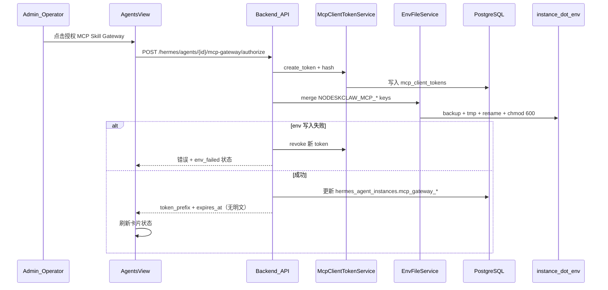

# v5.4 Hermes Agents MCP Token 授权实施计划

## 现状与范围

**已实现（不改动语义）**
- 出站 MCP Gateway：`GET /hermes/agents/{agent_profile}/mcp-gateway`（[`agent_mcp_gateway_router.py`](nodeskclaw-backend/app/api/hermes_skill/agent_mcp_gateway_router.py)）— 实例对外暴露 Skills
- MCP Skill Gateway JSON-RPC：`POST /api/v1/hermes/mcp`（[`mcp_skill_gateway/handler.py`](nodeskclaw-backend/app/services/mcp_skill_gateway/handler.py)）— 仅支持用户 JWT Bearer

**v5.4 缺口（全部待建）**
- `mcp_client_tokens` 表、`hermes_agent_instances.mcp_gateway_*` 字段
- `ndsk_mcp_*` Token 鉴权
- authorize / status / revoke 三个 API
- `.env` 原子 merge 写入
- [`AgentsView.vue`](nodeskclaw-portal/src/views/hermes/AgentsView.vue) 卡片 UI

**路由约定**：新 API 使用 `agent_id`（UUID，[`HermesAgentInstance.id`](nodeskclaw-backend/app/models/hermes_skill/hermes_agent_instance.py)），与现有 `agent_profile` 路由不冲突（多 `/status`、`/authorize` 路径段）。



---

## 前端表现变化

### 1. `/hermes/agents` 实例卡片 — MCP 授权状态与操作

**总结**：每个 Hermes 实例卡片从「仅展示 Docker/API/Runtime 状态」变为「额外展示 MCP Skill Gateway 入站授权状态，并提供一键授权/重新授权/撤销」。

**元素级变化**：
- MCP 状态 Badge：**新增**，位于现有 Docker/API Server/Agent/Runtime Badge 行末尾，文案按状态映射（未授权 / 已授权 / Env 已写入 / Token 已过期 / Token 已撤销 / Env 写入失败）
- 「授权 MCP Skill Gateway」按钮：**新增**，卡片操作区（探活/测试调用旁），未授权时显示
- 「重新授权」按钮：**新增**，已授权或 Token 已撤销时替换主按钮文案
- 「续期授权」按钮：**新增**，Token 已过期时显示
- 「重新写入 .env」按钮：**新增**，`env_failed` 状态时显示（`write_env=true, force_rotate=false`）
- 「撤销授权」按钮：**新增**，已授权相关状态下显示，点击后二次确认
- 授权确认弹窗：**新增**，展示实例名、Profile、Workspace、MCP URL、有效期（默认 180 天）、是否写入 `.env`；高级区可选 `allowed_skills` 多选（默认空=全部可见 Skill）
- Token 展示：**仅** `token_prefix`（如 `ndsk_mcp_common_writer_9b43a3d5`），**不展示**完整 token；授权成功 toast 提示前缀与过期时间
- 错误提示：授权/env 失败时 toast 显示 `message_key` 翻译后的可操作文案（含 `last_error` 摘要）

**改动前**（卡片操作区）:
```
┌─ common-writer ─────────────────────────────┐
│ [Docker] [API Server] [Agent] [Runtime]      │
│ WebUI / Gateway / Model / Key ...            │
│ [打开 WebUI] [刷新状态] [测试调用] [诊断] [详情] │
└──────────────────────────────────────────────┘
```

**改动后**（未授权）:
```
┌─ common-writer ─────────────────────────────┐
│ [Docker] ... [Runtime] [MCP: 未授权]         │
│ ...                                          │
│ [授权 MCP Skill Gateway] [撤销授权 hidden]    │
│ [打开 WebUI] [刷新状态] [测试调用] [诊断] [详情] │
└──────────────────────────────────────────────┘
```

**改动后**（已授权且 env 已写入）:
```
┌─ common-writer ─────────────────────────────┐
│ ... [MCP: Env 已写入]                        │
│ prefix: ndsk_mcp_common_writer_9b43a3d5      │
│ [重新授权] [撤销授权] ...                     │
└──────────────────────────────────────────────┘
```

### 2. 详情页

**总结**：本次不改 [`AgentDetailView.vue`](nodeskclaw-portal/src/views/hermes/AgentDetailView.vue) 出站 [`AgentMcpGatewayCard`](nodeskclaw-portal/src/views/hermes/AgentMcpGatewayCard.vue)；入站授权仅在列表页完成（符合 PRD §13）。

---

## 后端实施

### Task 1：数据模型与迁移

**新建** [`app/models/mcp_client_token.py`](nodeskclaw-backend/app/models/mcp_client_token.py)
- 继承 `BaseModel`（含 `deleted_at` 软删除，符合项目规范）
- 字段按 PRD §7，补充 `updated_at`（`BaseModel` 自带）
- `token_hash`：SHA256（对齐 [`api_key_auth.py`](nodeskclaw-backend/app/services/gateway/security/api_key_auth.py)）
- Partial unique index：`hermes_agent_id` 活跃 token 唯一（`postgresql_where=deleted_at IS NULL AND revoked_at IS NULL`）

**扩展** [`hermes_agent_instance.py`](nodeskclaw-backend/app/models/hermes_skill/hermes_agent_instance.py)：
- `mcp_gateway_enabled`, `mcp_gateway_token_id`, `mcp_gateway_token_prefix`, `mcp_gateway_url`, `mcp_gateway_env_synced`, `mcp_gateway_last_authorized_at`, `mcp_gateway_last_error`

**迁移**：`uv run alembic revision --autogenerate -m "add mcp client tokens and hermes agent mcp gateway fields"`

### Task 2：McpClientTokenService

**新建** [`app/services/mcp_skill_gateway/mcp_client_token_service.py`](nodeskclaw-backend/app/services/mcp_skill_gateway/mcp_client_token_service.py)

| 方法 | 职责 |
|------|------|
| `create_token(...)` | 生成 `ndsk_mcp_{instance_slug}_{random}.{secret}`，仅存 hash+prefix，返回明文一次 |
| `verify_token(plain)` | 校验 hash、未撤销、未过期，更新 `last_used_at` |
| `revoke_token(id)` | 设置 `revoked_at` |
| `get_active_token(agent_id)` | 查活跃 token 记录 |

默认 scopes（PRD §8）：
```json
["mcp:tools:list", "mcp:tools:call", "skill:view", "skill:invoke"]
```

`service_account_user_id`：设为 `created_by`（授权操作的管理员），供 MCP handler 加载 `User` 做权限链路。

`allowed_skills` 为空时：授权时快照当前操作者可见的 org MCP exposed skills（复用 [`McpToolMapper.list_tools`](nodeskclaw-backend/app/services/hermes_skill/mcp_tool_mapper.py) 逻辑提取 skill_id 列表写入 token）。

### Task 3：EnvFileService

**新建** [`app/services/hermes_agents/env_file_service.py`](nodeskclaw-backend/app/services/hermes_agents/env_file_service.py)

- `read_env` / `merge_env` / `backup_env`（`.env.bak.YYYYMMDD_HHMMSS`）/ `atomic_write_env`（tmp + rename）
- 仅 merge 四个 key：`NODESKCLAW_MCP_URL`, `NODESKCLAW_MCP_TOKEN`, `NODESKCLAW_MCP_ENABLED`, `NODESKCLAW_MCP_NAME`
- 写入后 `chmod 600`；日志禁止输出 token 值
- env 路径：优先 `record.env_file`，回退 `{record.instance_dir}/.env`

**MCP URL 构建**：`_rewrite_docker_callback_url(settings.AGENT_API_BASE_URL)` + `/hermes/mcp`（复用 [`deploy_service._rewrite_docker_callback_url`](nodeskclaw-backend/app/services/deploy_service.py)），确保 Docker 容器可达。

### Task 4：McpGatewayAuthorizationService

**新建** [`app/services/hermes_agents/mcp_gateway_authorization_service.py`](nodeskclaw-backend/app/services/hermes_agents/mcp_gateway_authorization_service.py)

编排 PRD §12 伪代码：
- `authorize(agent_id, body, current_user)` — `force_rotate` 时 revoke 旧 token 再创建
- `get_status(agent_id)` — 计算 UI 状态枚举
- `revoke(agent_id, remove_env_keys=True)` — revoke token + 可选清除 `.env` 中 NODESKCLAW_MCP_* keys

状态计算逻辑：

| 条件 | UI status |
|------|-----------|
| 无 token / disabled | `none` |
| token revoked | `revoked` |
| token expired | `expired` |
| enabled 但 env_synced=false 或 last_error | `env_failed` |
| enabled + env_synced | `env_synced` |
| enabled 未写 env | `authorized` |

失败回滚：`.env` 写入异常 → revoke 新 token → 写 `mcp_gateway_last_error`。

### Task 5：MCP Gateway 鉴权改造

**修改** [`auth.py`](nodeskclaw-backend/app/services/mcp_skill_gateway/auth.py)：
- 扩展 `McpAuthContext`：增加 `auth_type`, `mcp_client_token_id`, `profile`, `workspace_id`, `scopes`, `allowed_skills`, `allowed_tools`
- `token.startswith("ndsk_mcp_")` → `resolve_mcp_client_token`
- 保留 JWT 路径不变

**修改** [`handler.py`](nodeskclaw-backend/app/services/mcp_skill_gateway/handler.py)：
- `_collect_tools` / `_handle_tools_call`：当 `auth_type=mcp_client_token` 时，用 token 的 `profile`/`workspace_id` 作为默认上下文；`allowed_skills` 非空时过滤 skill tools
- 写操作审批：mcp_client_token 可跳过或按 scopes 限制（默认 scopes 不含写工具审批 bypass，保持安全默认拒绝）

### Task 6：REST API

**新建** [`app/api/hermes_skill/mcp_gateway_authorization_router.py`](nodeskclaw-backend/app/api/hermes_skill/mcp_gateway_authorization_router.py)

| 方法 | 路径 | 权限 |
|------|------|------|
| POST | `/hermes/agents/{agent_id}/mcp-gateway/authorize` | `hermes_agent:manage`（admin/operator） |
| GET | `/hermes/agents/{agent_id}/mcp-gateway/status` | `hermes_agent:view` |
| POST | `/hermes/agents/{agent_id}/mcp-gateway/revoke` | `hermes_agent:manage` |

- Pydantic schemas：[`app/schemas/hermes_skill/mcp_gateway_authorization.py`](nodeskclaw-backend/app/schemas/hermes_skill/mcp_gateway_authorization.py)（新建）
- 注册到 [`router.py`](nodeskclaw-backend/app/api/hermes_skill/router.py)
- 错误契约：`error_code` + `message_key` + `message`

**列表 API 扩展**（减少 N+1）：
- [`HermesAgentInstanceSummary`](nodeskclaw-backend/app/schemas/hermes_skill/hermes_agent_instance.py) 增加 `mcp_gateway_status`, `mcp_gateway_token_prefix`, `mcp_gateway_url`, `mcp_gateway_expires_at`, `mcp_gateway_env_synced`
- [`to_api_dict`](nodeskclaw-backend/app/services/hermes_external/hermes_docker_binding_service.py) 或 authorization service 填充上述字段

### Task 7：审计日志

复用 [`SkillAuditLogger`](nodeskclaw-backend/app/services/hermes_skill/skill_audit_logger.py)，`target_type` 用 `hermes_agent`，actions：
- `mcp_gateway.token.created` / `token.revoked` / `env.updated` / `env.update_failed` / `authorize.completed` / `authorize.failed`

---

## 前端实施

### Task 8：API 层

**扩展** [`agentInstances.ts`](nodeskclaw-portal/src/api/hermes/agentInstances.ts) 或新建 `agentMcpClientGateway.ts`：
- `authorizeHermesMcpGateway(agentId, body)`
- `getHermesMcpGatewayStatus(agentId)`
- `revokeHermesMcpGateway(agentId, { remove_env_keys? })`
- 扩展 `HermesAgentInstance` 接口字段

### Task 9：组件

在 [`nodeskclaw-portal/src/views/hermes/`](nodeskclaw-portal/src/views/hermes/) 新建：

| 组件 | 职责 |
|------|------|
| `McpGatewayStatusBadge.vue` | 状态 → 颜色 + i18n 文案 |
| `McpGatewayAuthorizeDialog.vue` | 确认弹窗；参考 [`RuntimeSkillRegisterToMcpDialog.vue`](nodeskclaw-portal/src/views/hermes/RuntimeSkillRegisterToMcpDialog.vue) overlay 模式 |
| `McpGatewayAuthorizeButton.vue` | 按钮文案切换 + 打开弹窗 + 调 API |

**修改** [`AgentsView.vue`](nodeskclaw-portal/src/views/hermes/AgentsView.vue)：
- Badge 行插入 `McpGatewayStatusBadge`
- 操作区插入授权/撤销按钮组
- 授权成功后 `fetchAgents()` 刷新

### Task 10：i18n

[`zh-CN.ts`](nodeskclaw-portal/src/i18n/locales/zh-CN.ts) / [`en-US.ts`](nodeskclaw-portal/src/i18n/locales/en-US.ts) 在 `hermes.agents` 下新增 `mcpClientGateway.*`（与现有出站 `mcpGateway` 区分）：
- 状态标签、按钮、弹窗字段、成功/失败 toast、撤销确认

---

## 测试

| 范围 | 文件建议 |
|------|----------|
| Token 创建/hash/撤销/过期 | `tests/mcp_skill_gateway/test_mcp_client_token_service.py` |
| .env merge/备份/原子写/chmod | `tests/hermes_skill/test_env_file_service.py` |
| 授权编排 + env 失败回滚 | `tests/hermes_skill/test_mcp_gateway_authorization_service.py` |
| ndsk_mcp_* 鉴权 + tools/list | `tests/mcp_skill_gateway/test_mcp_client_token_auth.py` |
| API 集成 | `tests/hermes_skill/test_mcp_gateway_authorization_api.py` |

关键断言：
- DB 无 token 明文；日志无完整 token
- 普通 member 调 authorize 返回 403
- revoke 后 `verify_token` 失败

---

## 风险与决策

1. **与出站 MCP Gateway 命名**：前端 i18n 用「MCP Skill Gateway 授权（入站）」与详情页「MCP Gateway（出站）」区分，避免用户混淆。
2. **`allowed_skills` 选择器**：首版弹窗高级区调用 `GET /orgs/{org_id}/mcp-skills`（[`memberManagement.ts`](nodeskclaw-portal/src/stores/memberManagement.ts) 已有模式）做多选；默认折叠且空=全部。
3. **容器内 Hermes 未自动 reload**：PRD 明确不在 scope；授权成功 toast 可加说明「需 Hermes 侧读取 .env 后生效（后续版本支持自动注册）」。
4. **Gene/Skill 模板**：本次为管理面授权，无需改 Gene 模板。

---

## 验收对照（PRD §17）

- 管理员可为实例创建 MCP Token，`.env` 写入四个 key，DB 无明文
- `/hermes/agents` 展示 MCP 状态，按钮文案随状态切换
- 撤销后 MCP Gateway 拒绝该 token
- 页面仅展示 `token_prefix`
