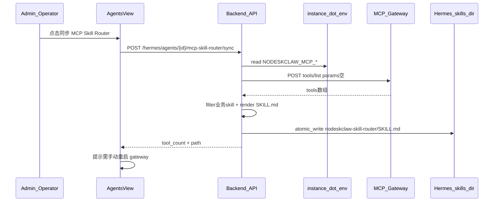

# v5.5 MCP Skill Router 实施计划

## 现状与依赖

**v5.4 已具备（直接复用）**
- MCP 授权：[`mcp_gateway_authorization_service.py`](nodeskclaw-backend/app/services/hermes_agents/mcp_gateway_authorization_service.py)、[`env_file_service.py`](nodeskclaw-backend/app/services/hermes_agents/env_file_service.py)
- 实例 `.env` 写入 `NODESKCLAW_MCP_URL` / `TOKEN` / `ENABLED` / `NAME`
- 前端：[`AgentsView.vue`](nodeskclaw-portal/src/views/hermes/AgentsView.vue) + `McpGateway*` 组件

**v5.5 缺口（全部待建）**
- `hermes_agent_instances.mcp_router_*` 字段
- `McpSkillRouterService` / `RouterSkillTemplateService`
- sync / status / delete API
- 前端 Router 状态 Badge + 同步按钮/弹窗



---

## 前端表现变化

### 1. `/hermes/agents` 实例卡片 — Router 同步状态与操作

**总结**：在 v5.4 MCP 授权状态旁，新增 Router 同步状态与「同步 MCP Skill Router」按钮；MCP 未授权时按钮禁用并提示先授权。

**元素级变化**：
- Router 状态 Badge：**新增**，位于 MCP Gateway Badge 之后，文案：`Router: 未同步` / `Router: 已同步 · N tools` / `Router: 同步失败` / `Router: MCP 未授权`
- 「同步 MCP Skill Router」按钮：**新增**，操作区（MCP 授权按钮旁）；MCP 未 `env_synced` 时 **disabled**，hover 提示先执行「授权 MCP Skill Gateway」
- 已同步时按钮文案变为「重新同步 Router」；失败时变为「重试同步」
- 同步确认弹窗：**新增**，说明将从 common-skills 读取 `tools/list`、生成 `nodeskclaw-skill-router/SKILL.md`、不重启容器；展示目标路径预览
- 成功 toast：**新增**，含 `tool_count` 与「请重启 Hermes gateway 后测试自然语言」指引
- 失败 toast：展示 `message_key` 翻译（MCP 未授权 / tools 为空 / 写入失败 / 连接失败）

**改动后**（MCP 已授权、Router 未同步）:
```
┌─ common-writer ─────────────────────────────┐
│ ... [MCP: Env 已写入] [Router: 未同步]       │
│ [授权 MCP...] [同步 MCP Skill Router] ...    │
└──────────────────────────────────────────────┘
```

**改动后**（Router 已同步 4 tools）:
```
┌─ common-writer ─────────────────────────────┐
│ ... [MCP: Env 已写入] [Router: 已同步 · 4 tools] │
│ [重新同步 Router] ...                        │
└──────────────────────────────────────────────┘
```

### 2. 详情页

**总结**：本次不改 [`AgentDetailView.vue`](nodeskclaw-portal/src/views/hermes/AgentDetailView.vue)；Router 同步仅在列表页完成（与 PRD §17 一致）。

---

## 后端实施

### Task 1：数据模型与迁移

**扩展** [`hermes_agent_instance.py`](nodeskclaw-backend/app/models/hermes_skill/hermes_agent_instance.py)：
- `mcp_router_enabled`, `mcp_router_skill_name`（默认 `nodeskclaw-skill-router`）
- `mcp_router_skill_path`, `mcp_router_tool_count`, `mcp_router_last_synced_at`, `mcp_router_last_error`

**新增（推荐）** [`hermes_mcp_router_sync_log.py`](nodeskclaw-backend/app/models/hermes_skill/hermes_mcp_router_sync_log.py)：
- PRD §8 可选表，用于保存 `tool_snapshot`（仅 name/description/inputSchema，无 token）
- 继承 `BaseModel` 软删除

**迁移**：`uv run alembic revision --autogenerate -m "add mcp router fields and sync logs"`（Review 后剔除 autogenerate 噪声）

### Task 2：RouterSkillTemplateService

**新建** [`router_skill_template_service.py`](nodeskclaw-backend/app/services/hermes_agents/router_skill_template_service.py)

| 方法 | 职责 |
|------|------|
| `render_router_skill_md(mcp_name, tools)` | 按 PRD §11 模板生成完整 `SKILL.md` |
| `render_tool_section(tool)` | 单工具段：display_title、trigger_rules |
| `extract_trigger_rules(description, tool_name)` | 从 description 提取或生成适合场景 bullet |
| `tool_display_title(tool_name)` | 如 `customer-profiling` → 「客户画像与销售机会分析」 |

**安全断言**：生成内容不得包含 `ndsk_mcp_`、`Bearer`、`Authorization`、`NODESKCLAW_MCP_TOKEN`

### Task 3：工具过滤与 MCP 客户端

**新建** [`mcp_tools_list_client.py`](nodeskclaw-backend/app/services/hermes_agents/mcp_tools_list_client.py)（或内嵌于 router service）

```python
# PRD §10.1 默认 skill_only
def is_business_skill_tool(name: str) -> bool:
    # 排除 hermes.instances.* / hermes.instance.* / hermes.skills.* / genehub.*
```

- `fetch_mcp_tools_list(url, token, params={})`：`httpx.AsyncClient` POST JSON-RPC，`X-Client: nodeskclaw-router-sync`
- 日志脱敏：禁止输出完整 token
- 错误映射：`errors.mcp_router.mcp_unreachable` / `tools_empty` / `mcp_unauthorized`

**注意**：必须使用 `params: {}`（PRD §5.3），避免 agent_alias/profile 过滤导致空列表。

### Task 4：路径解析

**新建** `resolve_router_skill_path(record, profile)` in [`mcp_skill_router_service.py`](nodeskclaw-backend/app/services/hermes_agents/mcp_skill_router_service.py)

优先级（PRD §14）：
1. 若 `record.instance_id` 已绑定 → [`HermesExternalPathResolver.resolve_profile()`](nodeskclaw-backend/app/services/hermes_external/path_resolver.py) → `{profile_dir}/skills/nodeskclaw-skill-router/SKILL.md`
2. 否则用 `record.data_dir` 或 `.env` 中 `HERMES_DATA_DIR`（[`hermes_env_parser`](nodeskclaw-backend/app/services/hermes_external/hermes_env_parser.py)）
3. 回退 `{record.instance_dir}/data/hermes/skills/...`

### Task 5：文件写入

**扩展** [`env_file_service.py`](nodeskclaw-backend/app/services/hermes_agents/env_file_service.py) 或新建 `skill_file_service.py`：
- `atomic_write_text_file(path, content, *, mode=0o644, backup=True)` — tmp + rename + `SKILL.md.bak.YYYYMMDD_HHMMSS`
- `remove_directory(path)` — delete API 用

与 `.env` 写入区分：Router `SKILL.md` 权限 **644**（PRD §13），非 600。

### Task 6：McpSkillRouterService 编排

**新建** [`mcp_skill_router_service.py`](nodeskclaw-backend/app/services/hermes_agents/mcp_skill_router_service.py)

| 方法 | 职责 |
|------|------|
| `sync(agent_id, body, user)` | 主流程（PRD §15 伪代码） |
| `get_status(agent_id, profile)` | 读 DB + 检查文件 `exists` |
| `delete(agent_id, profile)` | 删除 skill 目录，重置状态 |
| `enrich_agent_summary(record, summary)` | 列表 API 附带 router 字段 |
| `compute_ui_status(record)` | `none` / `mcp_unauthorized` / `synced` / `failed` |

**sync 前置检查**：
- 读 `.env`：`NODESKCLAW_MCP_ENABLED=true` 且 `NODESKCLAW_MCP_TOKEN` 存在
- 否则 `errors.mcp_router.mcp_not_authorized`（文案：请先授权 MCP Skill Gateway）

**sync 逻辑**：
1. `tools = fetch_mcp_tools_list(...)`
2. `filter` 按 `tool_filter` / `include_registry_tools`
3. 空列表 → `errors.mcp_router.tools_empty`
4. `force=false` 且文件已存在 → 409 或 PRD 默认 `force=true` 直接覆盖
5. 写 `SKILL.md`，更新 `mcp_router_*`，写 sync_log + SkillAuditLogger

**审计事件**（PRD §21）：`mcp_router.sync.started/completed/failed`、`mcp_router.skill_file.written/deleted`

### Task 7：REST API

**新建** [`mcp_skill_router_router.py`](nodeskclaw-backend/app/api/hermes_skill/mcp_skill_router_router.py)

| 方法 | 路径 | 权限 |
|------|------|------|
| POST | `/hermes/agents/{agent_id}/mcp-skill-router/sync` | `hermes_agent:manage` |
| GET | `/hermes/agents/{agent_id}/mcp-skill-router/status` | `hermes_agent:view` |
| POST | `/hermes/agents/{agent_id}/mcp-skill-router/delete` | `hermes_agent:manage` |

- Schemas：[`mcp_skill_router.py`](nodeskclaw-backend/app/schemas/hermes_skill/mcp_skill_router.py)
- 注册到 [`router.py`](nodeskclaw-backend/app/api/hermes_skill/router.py)（与 v5.4 `mcp_gateway_authorization_router` 并列）

**列表 API 扩展**：
- [`HermesAgentInstanceSummary`](nodeskclaw-backend/app/schemas/hermes_skill/hermes_agent_instance.py) 增加 `mcp_router_status`, `mcp_router_tool_count`, `mcp_router_skill_path`, `mcp_router_last_synced_at`, `mcp_router_last_error`
- [`agents_bind_router.py`](nodeskclaw-backend/app/api/hermes_skill/agents_bind_router.py) 调用 `enrich_agent_summary`

---

## 前端实施

### Task 8：API 层

**新建** [`agentMcpSkillRouter.ts`](nodeskclaw-portal/src/api/hermes/agentMcpSkillRouter.ts)：
- `syncHermesMcpSkillRouter(agentId, body)`
- `getHermesMcpSkillRouterStatus(agentId, profile?)`
- `deleteHermesMcpSkillRouter(agentId, body?)`

**扩展** [`agentInstances.ts`](nodeskclaw-portal/src/api/hermes/agentInstances.ts) 接口字段

### Task 9：组件

| 组件 | 路径 | 职责 |
|------|------|------|
| `McpRouterStatusBadge.vue` | `views/hermes/` | Router 状态 → 颜色 + i18n |
| `McpRouterSyncDialog.vue` | `views/hermes/` | 确认弹窗；参考 [`McpGatewayAuthorizeDialog.vue`](nodeskclaw-portal/src/views/hermes/McpGatewayAuthorizeDialog.vue) |
| `McpRouterSyncButton.vue` | `views/hermes/` | 按钮文案切换、禁用逻辑、调 API |

**修改** [`AgentsView.vue`](nodeskclaw-portal/src/views/hermes/AgentsView.vue)：插入 Badge + 按钮组

### Task 10：i18n

[`zh-CN.ts`](nodeskclaw-portal/src/i18n/locales/zh-CN.ts) / [`en-US.ts`](nodeskclaw-portal/src/i18n/locales/en-US.ts) 在 `hermes.agents.mcpSkillRouter.*` 下新增状态、按钮、弹窗、错误词条

---

## 测试

| 范围 | 文件 |
|------|------|
| 业务 tool 过滤 | `tests/hermes_skill/test_mcp_skill_router_filter.py` |
| SKILL.md 生成（无 token） | `tests/hermes_skill/test_router_skill_template_service.py` |
| 文件原子写入/备份 | 扩展 `test_env_file_service.py` 或新建 |
| sync 编排（mock httpx） | `tests/hermes_skill/test_mcp_skill_router_service.py` |
| API 集成 | `tests/hermes_skill/test_mcp_skill_router_api.py` |

关键断言：
- `SKILL.md` 不含 `ndsk_mcp_` / `Bearer`
- `tools/list` 使用空 `params`
- MCP 未授权时 sync 返回 400 + 明确 `message_key`
- member 角色 sync 返回 403

---

## 风险与决策

1. **MCP URL 可达性**：`.env` 中 URL 面向容器（`host.docker.internal`）；后端同步时直接读 `.env` 调用。若 Linux 部署环境不通，需在运维文档说明或后续 hotfix 增加「后端回退 URL」——v5.5 按 PRD 先用 `.env` 值。
2. **不重启 gateway**：同步成功 toast 必须提示用户手动重启（复用实例已有重启/探活入口，不新增自动重启）。
3. **Gene/Skill 模板**：本次为实例目录写文件，无需改 Gene 模板。
4. **sync_logs 表**：建议实现，便于排查 `tools/list` 快照；不含 token。

---

## 验收对照（PRD §23）

- 能读 `common-writer` `.env` MCP 配置并 `tools/list`
- 生成 `nodeskclaw-skill-router/SKILL.md`，不含 token
- 卡片展示 Router 状态与 tool_count
- MCP 未授权时按钮禁用
- 用户重启 gateway 后可用自然语言触发远程 skill（手工验收）
