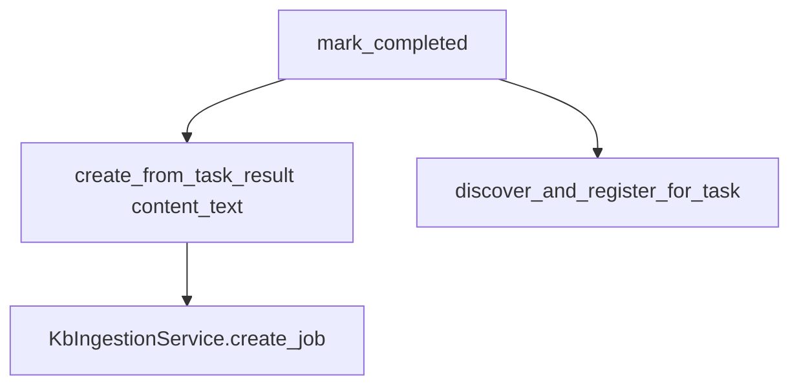
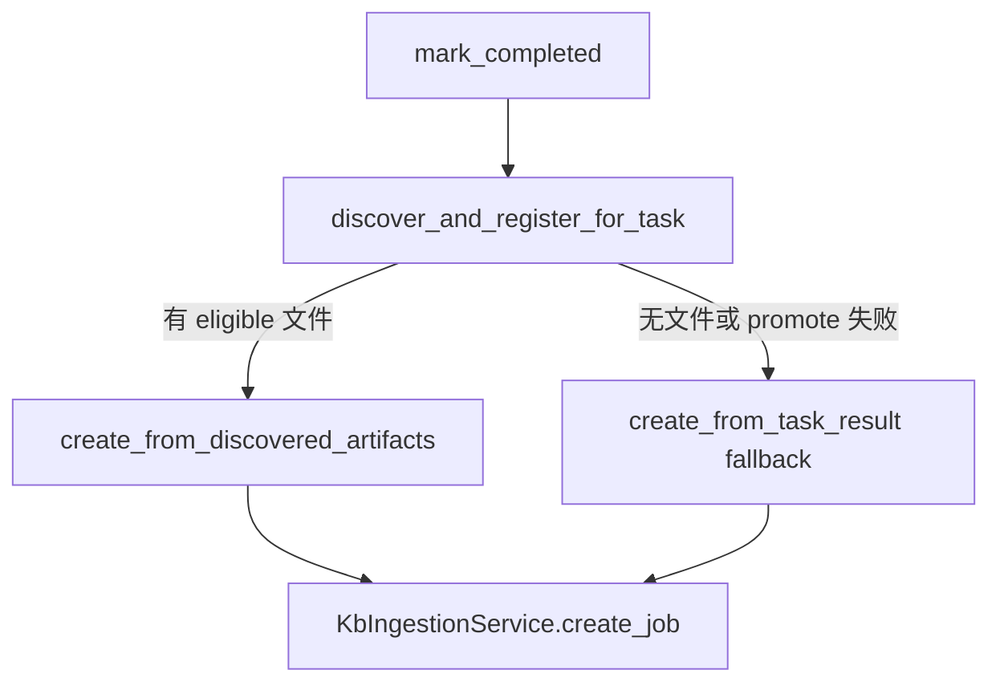

# v5.6.2 KB Ingestion 绑定真实报告修复

## 前端表现变化

### 1. `/hermes/kb-ingestion` 知识库入库审核页

**总结**: 新任务入库对象从 `unknown_客户画像_*.md` 物化副本 → 改为真实导出的 `*_客户画像报告.md`

**元素级变化**:
- 入库任务列表文件名: 显示 Hermes runtime 真实导出报告名（如 `陕西天基通信科技有限责任公司_客户画像报告.md`），不再优先出现 `unknown_*` 物化副本
- 任务关联 Tool 名称、KB 状态、tags: 不变，但绑定的 `artifact_id` 指向 promote 后的中心产物
- 历史 unknown 任务: 列表仍可能保留旧记录（PRD 非目标：不自动删历史产物），新任务不再产生

### 2. `/hermes/artifacts` 产物列表页

**总结**: 产物卡片新增 source（来源）与 kb_status（知识库状态）标识，便于区分 promoted 真实报告 vs fallback 物化

**元素级变化**:
- 产物行/卡片: **新增** `source` 徽标（如 `promoted` / `materialized_fallback` / `discovery`）
- 产物行/卡片: **新增** `kb_status` 徽标（`pending_review` / `indexed` / `none` 等，复用任务详情已有配色逻辑）
- 新完成任务: 中心产物通常只有 1 份真实报告（不再同时生成 unknown 副本文档进入 KB 队列）

**改动后**（新任务，customer-profiling）:
```
┌─ 产物列表 ─────────────────────────────────────┐
│ 陕西天基通信科技有限责任公司_客户画像报告.md      │
│ markdown · 27.4 KB                             │
│ [promoted] [pending_review]                      │
└──────────────────────────────────────────────────┘

┌─ KB 入库 ────────────────────────────────────────┐
│ 陕西天基通信科技有限责任公司_客户画像报告.md      │
│ general · pending_review · customer-profiling    │
└──────────────────────────────────────────────────┘
```

### 3. `/hermes/tasks` 任务详情抽屉 - 中心产物库卡片

**总结**: `ServerArtifactsCard` 展示的 `server_artifacts` 将指向 promote 后的真实报告（行为随后端 `task.server_artifacts` 自动修正，卡片本身可小幅补充 source 展示）

**元素级变化**:
- 中心产物库条目名称: 从 unknown 物化文件名 → 真实报告文件名
- 建议导入路径: 显示 `workspace/exports/xxx.md`（由 promote 逻辑生成）
- KB 状态徽标: 显示 `pending_review`（promote 成功且 kb_ingest.enabled 时）

---

## 问题根因（证据）

当前 Worker 在 [`hermes_task_worker.py`](nodeskclaw-backend/app/services/hermes_skill/hermes_task_worker.py) 中顺序为：



- `create_from_task_result()`（[`server_artifact_service.py`](nodeskclaw-backend/app/services/mcp_skill_gateway/server_artifact_service.py)）是唯一自动创建 KB job 的入口
- `discover_and_register_for_task()`（[`artifact_discovery_service.py`](nodeskclaw-backend/app/services/hermes_skill/artifact_discovery_service.py)）返回 `list[HermesArtifact]`，但**不 promote、不建 KB job**
- 结果：KB job 绑定 `source=materialized` 的 `unknown_*` 副本，真实 `exports/*.md` 只在产物列表可见

---

## 目标流程



关键规则（PRD §7.1）：
- Discovery 先于 materialize
- promote 成功则**跳过** `create_from_task_result`
- 各步骤失败隔离，不影响任务 `completed` 状态

---

## 后端改动

### Task 1：调整 Worker 完成路径

**文件**: [`nodeskclaw-backend/app/services/hermes_skill/hermes_task_worker.py`](nodeskclaw-backend/app/services/hermes_skill/hermes_task_worker.py)

在 `mark_completed` 之后，将现有「先 materialize、后 discovery」块替换为：

1. 从 `task.routing_metadata["output_policy"]` 读取策略（保持与 [`mcp_tool_mapper.py`](nodeskclaw-backend/app/services/hermes_skill/mcp_tool_mapper.py) 写入方式一致）
2. 若 `HERMES_ARTIFACT_DISCOVERY_ENABLED`：调用 `ArtifactDiscoveryService.discover_and_register_for_task(task, result_text=content_text)`，收集 `discovered_artifacts`
3. 若有 `output_policy` 且 `discovered_artifacts` 非空：调用 `ServerArtifactService.create_from_discovered_artifacts(...)`
4. 若 `server_artifacts` 仍为空且 fallback 允许：调用 `create_from_task_result(...)`（现有逻辑）
5. 统一更新 `task.server_artifacts` / `artifact_status` / `kb_status` / `result_summary`（复用现有 `append_artifact_links`）
6. 审计：`mcp_artifact.discovery.promote.*` / `mcp_artifact.materialize.fallback.*`

**配置**（PRD §12，hotfix 可先硬编码 true，同时在 [`config.py`](nodeskclaw-backend/app/core/config.py) 增加开关便于回滚）：
- `HERMES_ARTIFACT_PROMOTE_DISCOVERED_ENABLED`（默认 true）
- `HERMES_ARTIFACT_MATERIALIZE_FALLBACK_ENABLED`（默认 true）
- `HERMES_ARTIFACT_PROMOTE_MODE`（`all_documents` | `primary_only`，默认 `all_documents`）

### Task 2：新增 `create_from_discovered_artifacts`

**文件**: [`nodeskclaw-backend/app/services/mcp_skill_gateway/server_artifact_service.py`](nodeskclaw-backend/app/services/mcp_skill_gateway/server_artifact_service.py)

新增方法与辅助函数：

| 职责 | 说明 |
|------|------|
| `_filter_promotable_artifacts` | 过滤 eligible：同 task/org、未删除、`storage_type != object_store` 或 `object_key` 为空、本地文件存在且 size>0、扩展名 `.md/.txt/.json/.csv`、`content_type` 为 text/* 或 application/json |
| `_rank_artifacts` | `primary_only` 时按 PRD §7.2.5 优先级（路径命中 > 关键词 > markdown > 体积 > mtime）取 Top 1 |
| `_build_suggested_path_from_relative_path` | `exports/xxx.md` → `workspace/exports/xxx.md`（PRD §7.2.4） |
| promote 主流程 | 读取 `artifact.file_path` → `ArtifactStoreService.store()` → **原地更新** `HermesArtifact`（`storage_type=object_store`、`object_key`、`source=materialized`、`metadata_json.source=hermes_api_server_workspace_promoted`、保留 `original_file_path`） |
| KB job | 调用 `KbIngestionService.create_job(artifact, policy)` |
| 返回 | `list[to_server_artifact_dict(...)]` |

安全：复用 discovery 阶段已通过的路径；promote 读取前再次 `PathGuard.validate_file_for_download`（与 discovery 一致）。

**不新建第二条 artifact 记录**：在同一 `HermesArtifact` 行上从 `discovery/local` 升级为 `object_store`，避免 `/hermes/artifacts` 出现第三份重复。

### Task 3：增强 fallback 文件名提取

**文件**: [`nodeskclaw-backend/app/services/mcp_skill_gateway/artifact_materializer.py`](nodeskclaw-backend/app/services/mcp_skill_gateway/artifact_materializer.py)

- 新增 `extract_company_from_task(task)`（PRD §7.4）：从 `arguments` / `context` / `prompt` / `request_summary` 正则提取公司名
- `render_filename()` 中 `{company}` 改用 `extract_company_from_task(task)`，减少 `unknown_*` fallback 文件名

### Task 4：KB ingestion 去重状态同步（小改）

**文件**: [`nodeskclaw-backend/app/services/mcp_skill_gateway/kb_ingestion_service.py`](nodeskclaw-backend/app/services/mcp_skill_gateway/kb_ingestion_service.py)

当 sha256 去重命中已有 job 时：
- 不再让 artifact 保持 `pending_review` 却无对应新 job
- 将 `artifact.kb_status` 同步为已有 job 的 `status`（或 `indexed`）

可在 `create_from_discovered_artifacts` / `create_from_task_result` 调用后统一处理，控制 hotfix 范围不必引入完整 `KbJobCreateResult` dataclass。

---

## 前端改动（用户选定范围）

### Task 5a：产物列表 source / kb_status

**文件**:
- [`nodeskclaw-portal/src/views/hermes/ArtifactsView.vue`](nodeskclaw-portal/src/views/hermes/ArtifactsView.vue)
- [`nodeskclaw-portal/src/api/hermes/artifacts.ts`](nodeskclaw-portal/src/api/hermes/artifacts.ts)（确认 `Artifact` 类型含 `source`、`kb_status`、`metadata_json`）

展示规则：
- `metadata_json.source == hermes_api_server_workspace_promoted` → 徽标 `promoted`
- `source == materialized` 且文件名 `unknown_*` → `materialized_fallback`
- 其余 `discovery` 保持 `discovery` 标签
- `kb_status` 复用 [`ServerArtifactsCard.vue`](nodeskclaw-portal/src/views/hermes/ServerArtifactsCard.vue) 的配色映射

### Task 5b：i18n

**文件**: [`zh-CN.ts`](nodeskclaw-portal/src/i18n/locales/zh-CN.ts) / [`en-US.ts`](nodeskclaw-portal/src/i18n/locales/en-US.ts)

新增 `hermes.artifacts.source.*`、`hermes.artifacts.kbStatus.*` 词条。

### Task 5c：任务详情中心产物（可选小改）

[`ServerArtifactsCard.vue`](nodeskclaw-portal/src/views/hermes/ServerArtifactsCard.vue) 若 API 返回 `type`/`name` 已正确，主要验证即可；如需可加一行 source 说明。

---

## 测试

**新增/扩展** [`nodeskclaw-backend/tests/mcp_skill_gateway/test_mcp_artifact_bridge.py`](nodeskclaw-backend/tests/mcp_skill_gateway/test_mcp_artifact_bridge.py) 或新文件 `test_v5_6_2_artifact_promote.py`：

| Case | 期望 |
|------|------|
| Case 1：discovery 返回真实 `.md` | `create_from_discovered_artifacts` 被调用；`create_from_task_result` 不调用；`server_artifacts[0].name` 为真实文件名 |
| Case 2：discovery 返回 `[]` | fallback `create_from_task_result` 成功 |
| Case 3：promote 读文件失败 | 记录失败日志；fallback materialize 成功 |
| Case 4：`extract_company_from_task` | `prompt` 仅含公司名时，文件名不含 `unknown` |
| Case 5：KB sha256 去重 | artifact.kb_status 与已有 job 一致 |

Worker 集成测试可 mock `ArtifactDiscoveryService` + `ServerArtifactService`，避免依赖真实 Hermes 实例文件系统。

---

## 文档

更新 [`docs/backend/mcp_skill_gateway.md`](docs/backend/mcp_skill_gateway.md)：
- Worker 流程图改为 discovery-first
- 补充 `create_from_discovered_artifacts` 职责
- 标注 KB job 绑定规则：promote 优先，content_text 仅 fallback

---

## 不在本次范围（PRD 其余项，可后续迭代）

- Router Skill 模板参数增强（[`router_skill_template_service.py`](nodeskclaw-backend/app/services/hermes_agents/router_skill_template_service.py)）— PRD Task 4
- 历史数据修复脚本 `scripts/fix_v5_6_unknown_artifacts.py` — PRD Task 6 / §11（提供 SQL + manual `kb-ingest` API 即可运维处理历史任务）
- Alembic 迁移：无 schema 变更，**不需要**新 migration

---

## 部署与验证

1. 重启 backend + hermes worker（无 DB migration）
2. 触发一次 `customer-profiling` MCP 任务，确认：
   - `/hermes/tasks/{id}` 中心产物为真实报告名
   - `/hermes/kb-ingestion` 出现对应真实报告 job
   - 不再为新任务创建 `unknown_*` KB job（除非 discovery 关闭且无真实文件）
3. 跑 `uv run pytest tests/mcp_skill_gateway/ tests/hermes_skill/test_artifact_discovery_service.py`
