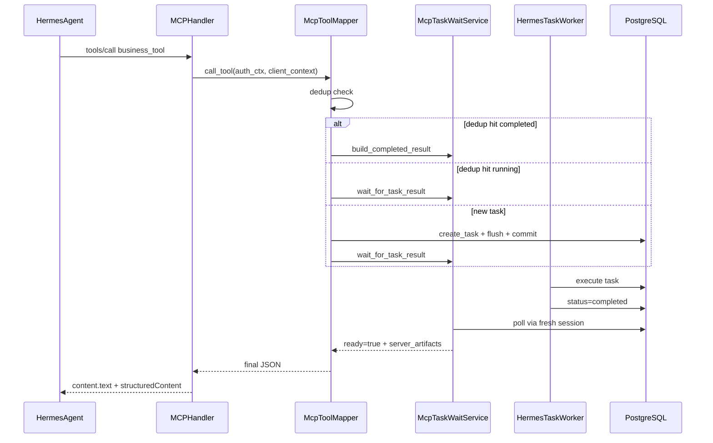

# NoDeskClaw v5.7.1 — MCP Gateway 阻塞式 Wait Hotfix

按 PRD [docs_prd/team_v5.7.1_hotfix_mcp-gateway-task-wait.md](docs_prd/team_v5.7.1_hotfix_mcp-gateway-task-wait.md) 实施。v5.7 已交付 task 查询 tools、dedup、access service、Router 异步规则；本 hotfix 核心变更是 **业务 tool 默认不再立即返回 queued，而是在 Gateway 内 wait 完成后返回最终 JSON**。

**阻塞等待超时时长**：按你确认使用 **900 秒**（`MCP_TASK_WAIT_TIMEOUT_SECONDS=900`）。部署时需确保 Nginx `proxy_read_timeout` 与 Hermes MCP client timeout ≥ 930s。

## 前端表现变化

本次改动无前端表现变化（不改 Hermes WebUI，不改 NoDeskClaw Portal）。

**用户体验差异**（Hermes WebUI 会话内）：
- **改动前**：调用客户画像等业务 tool 后几秒内返回「任务已创建 / queued」，Agent 自行猜端口或重复调用
- **改动后**：同一次 MCP `tools/call` 连接保持最多约 15 分钟，完成后直接返回报告摘要与 `server_artifacts`；仅 wait 超时时才提示调用 `nodeskclaw_task_wait`

## 现状与差距

| 能力 | v5.7 现状 | v5.7.1 目标 |
|------|-----------|-------------|
| 业务 tool 返回 | 立即 queued + `event_url/result_url` | wait 模式返回 `ready=true` + 最终结果 |
| Task commit 时机 | handler 末尾统一 `commit` | **create 后立刻 commit**，再 wait |
| Wait 实现 | `builtin_task_tool_executor._task_wait` 用 `db.refresh` 轮询 | 新增 `McpTaskWaitService`（EventBus + fresh session DB poll） |
| Dedup 命中 | 返回已有 task 元信息（仍 queued） | 未完成 → wait 已有 task；已完成 → 直接返回 result |
| Handler 文案 | 固定「任务已创建」 | 按 `ready/status` 动态生成中文摘要 |
| Router Skill | 指导 Agent 轮询 `task_timeline/result` | 改为 Gateway 托管等待，超时才用 `task_wait` |

关键现有文件：
- [mcp_tool_mapper.py](nodeskclaw-backend/app/services/hermes_skill/mcp_tool_mapper.py) — `call_tool` / `_build_task_response` / dedup
- [handler.py](nodeskclaw-backend/app/services/mcp_skill_gateway/handler.py) — `_hermes_skill_tool_call_success`、末尾 `db.commit()`
- [event_bus.py](nodeskclaw-backend/app/services/hermes_skill/event_bus.py) — `TaskEventService.write_event` 已 `notify(task_id)`
- [deps.py](nodeskclaw-backend/app/core/deps.py) — `async_session_factory`（`expire_on_commit=False`）

## 目标数据流



## 实施步骤

### 1. 配置项扩展（[config.py](nodeskclaw-backend/app/core/config.py)）

在现有 `MCP_TASK_*` 段补充/调整（保留 v5.7 已有项）：

| 配置 | 值 | 说明 |
|------|-----|------|
| `MCP_TASK_WAIT_TIMEOUT_SECONDS` | **900** | 业务 tool 阻塞等待默认超时 |
| `MCP_TASK_WAIT_DEFAULT_MODE` | `wait` | 默认执行模式 |
| `MCP_TASK_WAIT_POLL_INTERVAL_SECONDS` | `3` | EventBus/DB 轮询间隔 |
| `MCP_TASK_WAIT_MAX_TIMEOUT_SECONDS` | `900` | 单次 wait 上限 |
| `MCP_TASK_WAIT_FOR_MCP_CLIENT_TOKEN` | `true` | MCP token 默认 wait |
| `MCP_TASK_WAIT_FOR_USER_JWT` | `false` | Portal JWT 调用仍 queued |
| `MCP_TASK_WAIT_RETURN_TIMELINE` | `true` | 返回 timeline |
| `MCP_TASK_WAIT_RETURN_ARTIFACTS` | `true` | 返回 server_artifacts |
| `MCP_TASK_WAIT_INCLUDE_PRIMARY_PREVIEW` | `false` | 不在业务 result 内嵌全文 |

保留 `MCP_TASK_WAIT_MAX_SECONDS=60` 供内置 `nodeskclaw_task_wait` tool 的 per-call 上限（PRD 12.1 默认 120、max 300，需同步调整 tool schema 默认值/上限）。

### 2. 新增 execution_mode 解析（新文件 `mcp_execution_mode.py` 或置于 wait service 模块）

```python
def resolve_mcp_execution_mode(
    auth_ctx: McpAuthContext | None,
    skill: HermesSkill,
    output_policy: dict,
    arguments: dict,
) -> str:  # "wait" | "queued"
```

规则（PRD 8.3）：
1. `MCP_TASK_WAIT_ENABLED=false` → `queued`
2. `source_type != hermes_api_server` → `queued`
3. `arguments._wait is False` → `queued`；`True` → `wait`
4. `auth_type=mcp_client_token` 且 `MCP_TASK_WAIT_FOR_MCP_CLIENT_TOKEN` → `wait`
5. `auth_type=user_jwt` 且 `MCP_TASK_WAIT_FOR_USER_JWT` → `wait`，否则 `queued`
6. `output_policy.artifact_mode=pull_only` → 倾向 `wait`

在 `call_tool` 入口从 `arguments` 剥离 `_wait`（不参与 jsonschema 校验与 dedup fingerprint）。

### 3. 新增 McpTaskWaitService（[mcp_task_wait_service.py](nodeskclaw-backend/app/services/mcp_skill_gateway/mcp_task_wait_service.py)）

核心方法：

```python
async def wait_for_task_result(
    task_id: str,
    org_id: str,
    *,
    timeout_seconds: int | None = None,
    poll_interval_seconds: int | None = None,
    include_timeline: bool = True,
    include_artifacts: bool = True,
) -> dict
```

实现要点：
- **fresh session**：每次 poll 使用 `async_session_factory()` 读 Task 状态，避免长事务与 stale object
- **混合等待**：`EventBus.get_instance().wait(task_id, timeout=poll_interval)` → 超时后 DB 查状态
- **terminal 处理**：`completed` → `TaskResultService.get_result` 构建；`failed/timeout/cancelled` → `ready=false, isError=true`
- **wait timeout**：`ready=false, wait_timeout=true, next_tool=nodeskclaw_task_wait, poll_after_seconds=15`
- 返回结构含 `tool_name/task_id/task_no/status/ready/result_summary/server_artifacts/timeline/kb_status/artifact_mode` 等，不含 `object_key/file_path`

辅助方法：`_build_completed_result`、`_build_failed_result`、`_build_still_running_result`、`_load_task`

### 4. 改造 McpToolMapper.call_tool（[mcp_tool_mapper.py](nodeskclaw-backend/app/services/hermes_skill/mcp_tool_mapper.py)）

**Dedup 增强**（PRD 十三）：
- 命中 `queued/accepted/running` + wait 模式 → **不创建新 Task**，直接 `McpTaskWaitService.wait_for_task_result(existing.id)`
- 命中 `completed` + wait 模式 → 直接 `_build_completed_result`，返回 `deduped=true, ready=true`
- 命中 + queued 模式 → 保持现有 `_build_task_response`

**新建 Task 流程**：
```python
task = await TaskService(...).create_task(...)
# audit logs ...
await self.db.flush()
task_id, task_no = task.id, task.task_no
mode = resolve_mcp_execution_mode(auth_ctx, skill, output_policy, raw_args)

if mode == "wait":
    await self.db.commit()  # 关键：Worker 可见
    wait_result = await McpTaskWaitService().wait_for_task_result(task_id, org_id, ...)
    return _merge_tool_context(wait_result, tool_name, agent_alias, ...)

return _build_queued_response(...)  # 保持 v5.7 queued 字段
```

**wait 模式响应**：省略或降级 `event_url/event_token_url/result_url/artifact_url`（PRD 11.2），避免误导 Agent。

返回值增加 `committed=True` 标记，供 handler 判断是否在 mapper 内已 commit。

### 5. Handler 改造（[handler.py](nodeskclaw-backend/app/services/mcp_skill_gateway/handler.py)）

- 新增 `_build_hermes_skill_text(result: dict) -> str`（PRD 11.1 伪代码）
- 改造 `_hermes_skill_tool_call_success`：用动态文案替换固定「任务已创建」；`isError` 根据 `result.get("isError")` 或 failed status 设置
- `mapper.call_tool` 返回 `committed=True` 时，handler 仍 `commit()` 处理 audit/mcp_call_log（无 pending task insert 亦可安全 commit）
- `log_mcp_call.result_summary` 增加 `ready/wait_timeout/deduped` 字段

### 6. 重构 nodeskclaw_task_wait 内置工具

[builtin_task_tool_executor.py](nodeskclaw-backend/app/services/mcp_skill_gateway/builtin_task_tool_executor.py)：
- `_task_wait` 改为委托 `McpTaskWaitService.wait_for_task_result`（去掉 `db.refresh` 循环）
- 超时字段对齐 PRD：`default=120, max=300`；`next_tool=nodeskclaw_task_wait` / `next_action` 与 business wait 一致

[builtin_task_tools.py](nodeskclaw-backend/app/services/mcp_skill_gateway/builtin_task_tools.py)：同步 inputSchema 默认值/上限。

### 7. Router Skill 模板更新（[router_skill_template_service.py](nodeskclaw-backend/app/services/hermes_agents/router_skill_template_service.py)）

替换/补充 v5.7「异步任务处理规则」为 v5.7.1 规则（PRD 十八）：
- 远程 business skill **默认由 Gateway 托管等待**
- `ready=true` → 直接展示结果，禁止猜 localhost/4030/8642/REST
- `ready=false` + `next_tool=nodeskclaw_task_wait` → 只能调用 `task_wait`，禁止重复调用业务 tool
- 保留「最终结果展示规则」，强调 `server_artifacts` 为空时的说明

### 8. 测试

新增/扩展：

| 文件 | 场景 |
|------|------|
| `tests/mcp_skill_gateway/test_mcp_task_wait_service.py` | completed / failed / wait_timeout / EventBus 通知 |
| `tests/mcp_skill_gateway/test_mcp_execution_mode.py` | mcp_client_token→wait、user_jwt→queued、`_wait=false` |
| `tests/hermes_skill/test_mcp_tool_mapper_blocking_wait.py` | create→commit→wait、dedup+wait、queued 模式兼容 |
| 更新 `test_mcp_task_dedup.py` | dedup 命中 running 走 wait 而非返回 queued |
| 更新 `test_mcp_task_tools.py` | `nodeskclaw_task_wait` 委托 wait service |

Mock 策略：`McpTaskWaitService` 与 `TaskResultService` 单元 mock；集成测试 mock wait 返回 completed payload。

### 9. 验证

```bash
cd nodeskclaw-backend
uv run ruff check app/services/mcp_skill_gateway/ app/services/hermes_skill/mcp_tool_mapper.py
uv run pytest tests/mcp_skill_gateway/test_mcp_task_wait_service.py tests/mcp_skill_gateway/test_mcp_execution_mode.py tests/hermes_skill/test_mcp_tool_mapper_blocking_wait.py tests/mcp_skill_gateway/test_mcp_task_dedup.py tests/mcp_skill_gateway/test_mcp_task_tools.py -q
```

## 范围外（不写代码，上线时人工执行）

- Router Skill 同步到已安装 Hermes Agent（`mcp-skill-router/sync`）
- Nginx / Uvicorn / Hermes MCP client 超时调至 ≥ 930s
- 端到端 Hermes WebUI 验证（PRD 20.6）

## 风险与缓解

| 风险 | 缓解 |
|------|------|
| 未 commit 就 wait 导致 Worker 看不到 Task | create 后 `flush+commit` 再 wait |
| HTTP 代理提前断连 | 超时 900s + 运维配置 proxy_read_timeout |
| handler 与 mapper 双 commit | mapper 返回 `committed` 标记；wait 用独立 session |
| v5.7 Router 规则与 v5.7.1 冲突 | 模板替换为 blocking wait 规则 |
