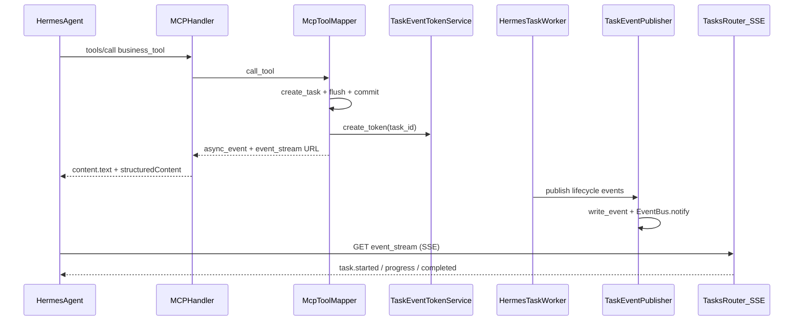

# NoDeskClaw v5.7.2 — MCP Task SSE 原生模式

按 [docs_prd/team_v5.7.2_hotfix_mcp-task-sse.md](docs_prd/team_v5.7.2_hotfix_mcp-task-sse.md) 实施。**范围：nodeskclaw-backend only**（Agent 侧 SSE wait loop 不在本次 commit）。

## 前端表现变化

本次改动无 Portal / Admin UI 变化。

**Hermes WebUI 会话内体验差异**：

**总结**：业务 tool 调用从「HTTP 长连接阻塞 / 120s 超时后 Agent 乱重试」→「几秒内返回 task_id + 强语义提示，任务进度通过 SSE 推送，完成后一次性拿到结果」

**元素级变化**：
- 业务 tool 首次响应时间：从最长 900s 阻塞 → **立即返回**（status=running/queued）
- Agent 可见文案：从「任务已创建 / 等待超时请 task_wait」→ **「任务 TASK-xxxx 已启动，请勿重复调用，请等待事件流完成」**
- 任务进度反馈：从无实时进度 → **SSE 推送 stage/progress/timeline/artifact.ready**
- 长任务（>3min）：从 MCP Client 120s 断连报错 → **无 HTTP timeout 压力**（连接已释放）
- fallback 路径：SSE 不可用时仍可用 `nodeskclaw_task_wait`（poll_tool），行为与 v5.7.1 一致

**改动前**（v5.7.1 阻塞 wait）：
```
Agent --tools/call--> Gateway [====阻塞 up to 900s====] --> 结果 / 或 Client 120s 断连
```

**改动后**（v5.7.2 async_event）：
```
Agent --tools/call--> Gateway --> 立即返回 {task_id, event_stream, wait_strategy}
Agent --GET event_stream (SSE)--> 实时 progress --> task.completed 含 result
```

---

## 现状与可复用基础

| 能力 | 现状 | v5.7.2 动作 |
|------|------|-------------|
| SSE 端点 | 已有 `GET /api/v1/hermes/tasks/{id}/events`（[tasks_router.py](nodeskclaw-backend/app/api/hermes_skill/tasks_router.py)） | 增强事件映射 + 终态 result  enrichment |
| 事件持久化 | `TaskEventService.write_event` + DB `HermesTaskEvent` | 包装为 `TaskEventPublisher` |
| 进程内唤醒 | `EventBus.notify/wait`（[event_bus.py](nodeskclaw-backend/app/services/hermes_skill/event_bus.py)） | 保持不变 |
| MCP 阻塞 wait | `McpToolMapper` + `McpTaskWaitService`（v5.7.1） | **默认关闭**，保留 opt-in fallback |
| SSE 认证 | JWT 或 `?token=`（[task_event_token_service.py](nodeskclaw-backend/app/services/hermes_skill/task_event_token_service.py)） | **tools/call 时自动签发 token**（MCP Client 无 JWT） |
| Token TTL | 默认 300s | 延长至与长任务匹配（建议 900s） |

PRD 中的 `/api/v1/tasks/{id}/events` 与现有 `/api/v1/hermes/tasks/{id}/events` 不一致——**沿用现有 Hermes 路径**，`event_stream` 字段返回完整可订阅 URL（含 token）。

---

## 目标数据流



---

## 实施步骤

### 1. 配置扩展（[config.py](nodeskclaw-backend/app/core/config.py) + [.env.example](nodeskclaw-backend/.env.example)）

新增/调整：

| 配置 | 建议值 | 说明 |
|------|--------|------|
| `MCP_TASK_DEFAULT_EXECUTION_MODE` | `async_event` | 取代 v5.7.1 默认 `wait` |
| `MCP_TASK_SSE_ENABLED` | `true` | SSE 模式总开关 |
| `MCP_TASK_SSE_TOKEN_TTL_SECONDS` | `900` | 与长任务对齐，避免 token 先于 task 过期 |
| `MCP_TASK_SSE_INCLUDE_RESULT_ON_COMPLETE` | `true` | 终态 SSE 事件内嵌 result summary + artifacts |
| `MCP_TASK_WAIT_DEFAULT_MODE` | `queued` | 回退：不再默认阻塞 |
| `MCP_TASK_WAIT_FOR_MCP_CLIENT_TOKEN` | `false` | MCP token 默认走 async_event |

保留 `MCP_TASK_WAIT_ENABLED` + `nodeskclaw_task_wait` 供 `wait_strategy.fallback=poll`。

### 2. 执行模式三态（[mcp_execution_mode.py](nodeskclaw-backend/app/services/mcp_skill_gateway/mcp_execution_mode.py)）

扩展 `resolve_mcp_execution_mode()` 返回值：

- `async_event` — v5.7.2 默认（hermes_api_server + mcp_client_token）
- `queued` — 立即返回元信息，无 SSE token（JWT / 显式 `_wait=false`）
- `wait` — **legacy opt-in**（`_wait=true` 或配置显式开启），保留 v5.7.1 阻塞路径

规则优先级：`MCP_TASK_SSE_ENABLED=false` → queued；`_wait=true` → wait；`_wait=false` → queued/async_event 按 auth 配置。

### 3. 新增 TaskEventPublisher（新文件 `task_event_publisher.py`）

位置建议：`app/services/hermes_skill/task_event_publisher.py`

```python
class TaskEventPublisher:
    async def publish(self, db, task_id, org_id, event_type, payload) -> HermesTaskEvent
    async def publish_progress(self, db, task_id, org_id, *, stage, progress, message)
    async def publish_artifact_ready(self, db, task_id, org_id, artifact: dict)
    async def publish_completed_with_result(self, db, task_id, org_id, result: dict)
```

实现：委托现有 `TaskEventService.write_event()`（已含 `EventBus.notify`），不重复造轮。

**Hook 点**（[hermes_task_worker.py](nodeskclaw-backend/app/services/hermes_skill/hermes_task_worker.py)）：
- `TASK_STARTED` → 可选 `publish_progress`（stage 从 Hermes delta payload 提取）
- `ARTIFACT_CREATED` → `publish_artifact_ready`
- `TASK_COMPLETED` → `publish_completed_with_result`（调用 `TaskResultService.get_result` 构建 PRD `result` 字段）

不在 DB 新增 EventType enum（避免 migration）；PRD 事件名在 **SSE 格式化层映射**（见步骤 5）。

### 4. 改造 McpToolMapper.call_tool（[mcp_tool_mapper.py](nodeskclaw-backend/app/services/hermes_skill/mcp_tool_mapper.py)）

**async_event 路径**（替代默认 `_finalize_wait_response` 阻塞）：

1. create_task → flush → **commit**（Worker 可见）
2. `TaskEventTokenService.create_token()` — actor 用 `auth_ctx.user.id` 或 MCP token 关联 user
3. 返回 PRD 契约字段：

```python
{
  "task_id", "task_no", "status": "running",
  "execution_mode": "async_event",
  "event_stream": "/api/v1/hermes/tasks/{id}/events?token={raw}",
  "event_token_url": "/api/v1/hermes/tasks/{id}/events-token",  # 保留 REST 刷新
  "wait_strategy": {"type": "sse", "fallback": "poll", "poll_tool": "nodeskclaw_task_wait"},
  "message": "任务已启动，请等待事件流通知完成",
  "retryable": False,
  "result_url", "artifact_mode", ...
}
```

**Dedup 行为**：
- 命中 **running** + async_event → 返回已有 task 的 event_stream（重新 mint token），`deduped=true`，**不阻塞 wait**
- 命中 **completed** → 直接返回 `ready=true` + result（同 v5.7.1，无需 SSE）
- legacy `wait` 模式 → 保留 `_finalize_wait_response`

新增 `_build_async_event_response()`，与 `_build_task_response()` / `_merge_wait_result()` 并列。

### 5. SSE 流增强（[tasks_router.py](nodeskclaw-backend/app/api/hermes_skill/tasks_router.py)）

抽取 `TaskEventStreamFormatter`（新模块或同 publisher 文件）：

| DB EventType | SSE `event:` 名 | 说明 |
|--------------|-----------------|------|
| `task.started` | `task.started` | 直接映射 |
| `hermes.run.delta` | `task.progress` | 从 payload 提取 stage/progress/message |
| （聚合） | `task.timeline` | 每 N 个事件或终态前 emit 一次 stages 快照 |
| `artifact.created` | `task.artifact.ready` | 含 artifact 元信息 |
| `task.completed` | `task.completed` | enrichment：`result.summary` + `result.artifacts` |
| `task.failed` / `task.timeout` | `task.failed` | 含 error |

**终态 enrichment**：当检测到 terminal status，SSE 在关闭前额外 yield 一条 `task.completed`/`task.failed`（若 DB 事件 payload 尚未含 result，调用 `TaskResultService` 补全）。

**断线重连**：保持现有 `Last-Event-ID` + `start_after_seq` 逻辑。

**Heartbeat**：已有 `: heartbeat\n\n`（`HERMES_TASK_SSE_HEARTBEAT_SECONDS=30`），满足 PRD >10min 要求。

可选：将 `_event_generator()` 重构为使用 [task_event_service.stream_events()](nodeskclaw-backend/app/services/hermes_skill/task_event_service.py) 减少重复。

### 6. Handler 文案（[handler.py](nodeskclaw-backend/app/services/mcp_skill_gateway/handler.py)）

扩展 `_build_hermes_skill_text()`：

- `execution_mode=async_event` → PRD 强语义：
  > 任务 {task_no} 已启动。请不要重复调用该工具。系统将通过事件流返回任务进度和最终结果。请等待任务完成事件。
- `ready=true` / completed dedup → 保持 v5.7.1 完成摘要
- `wait_timeout` → 保留 task_wait 提示（legacy wait 路径）

`log_mcp_call.result_summary` 增加 `execution_mode` / `event_stream`（脱敏 token）。

### 7. Router Skill 规则（[router_skill_template_service.py](nodeskclaw-backend/app/services/hermes_agents/router_skill_template_service.py)）

替换 v5.7.1「Gateway 托管阻塞等待」为 v5.7.2 规则：

- 收到 `execution_mode=async_event` → **禁止 retry 原 tool**
- 应订阅 `event_stream`，等待 `task.completed`
- SSE 不可用 → 仅允许 `nodeskclaw_task_wait` / `nodeskclaw_task_result`
- 保留禁止 localhost/REST 直连规则

同步更新 `FORBIDDEN_CONTENT_FRAGMENTS` 测试约束（[test_router_skill_template_service.py](nodeskclaw-backend/tests/hermes_skill/test_router_skill_template_service.py)）。

### 8. Fallback 兼容

- `nodeskclaw_task_wait` / `McpTaskWaitService`：**不删除**，作为 `wait_strategy.fallback=poll`
- `MCP_TASK_WAIT_ENABLED=false` 时隐藏 task_wait tool（已有逻辑）
- 配置 `MCP_TASK_DEFAULT_EXECUTION_MODE=wait` 可回滚 v5.7.1 行为

PRD 9.2「Redis/Kafka 事件持久化」：**不实施**——已有 PostgreSQL `HermesTaskEvent` 持久化 + Gateway 重启后 SSE 可通过 `Last-Event-ID` 续传。

### 9. 测试

| 文件 | 场景 |
|------|------|
| `test_mcp_execution_mode.py` | 新增 async_event 默认、mcp_client_token→async_event、`_wait=true`→wait legacy |
| `test_mcp_tool_mapper_async_event.py`（新） | create→commit→返回 event_stream；dedup running→复用 task；dedup completed→ready |
| `test_task_event_publisher.py`（新） | publish_progress / publish_completed_with_result |
| `test_task_events_sse.py`（新或扩展现有） | SSE event 名映射、task.completed enrichment、Last-Event-ID |
| `test_mcp_task_tools.py` | fallback task_wait 仍可用 |
| 更新 `test_mcp_tool_mapper_blocking_wait.py` | 仅覆盖 legacy wait opt-in |

Mock 策略：Publisher / TokenService 单元 mock；SSE 用 `TestClient` + async generator 断言 event 行。

### 10. 验证

```bash
cd nodeskclaw-backend
uv run ruff check app/services/mcp_skill_gateway/ app/services/hermes_skill/ app/api/hermes_skill/tasks_router.py
uv run pytest tests/mcp_skill_gateway/test_mcp_execution_mode.py tests/hermes_skill/test_mcp_tool_mapper_async_event.py tests/hermes_skill/test_task_event_publisher.py tests/hermes_skill/test_task_events_token.py tests/mcp_skill_gateway/test_mcp_task_tools.py -q
```

---

## 范围外（本次不做）

- Hermes Agent 运行时 SSE 订阅 / wait loop（用户确认另开任务）
- MCP Gateway 层新增 SSE JSON-RPC 端点（REST SSE + token 已足够）
- Redis/Kafka 事件总线
- Nginx / MCP Client timeout 运维变更（v5.7.2 后阻塞 wait 不再是主路径，但 Agent 实现 SSE 前仍需协调）

## 风险与缓解

| 风险 | 缓解 |
|------|------|
| MCP Client 尚不会订阅 SSE | structuredContent 含 `wait_strategy.fallback=poll` + Router Skill 规则；保留 task_wait |
| SSE token 300s 过期 | `MCP_TASK_SSE_TOKEN_TTL_SECONDS=900` |
| 阻塞 wait 与 async_event 行为冲突 | 三态 execution_mode + 配置默认 async_event |
| SSE 事件名与 DB EventType 不一致 | 格式化层映射，不改 DB enum |
