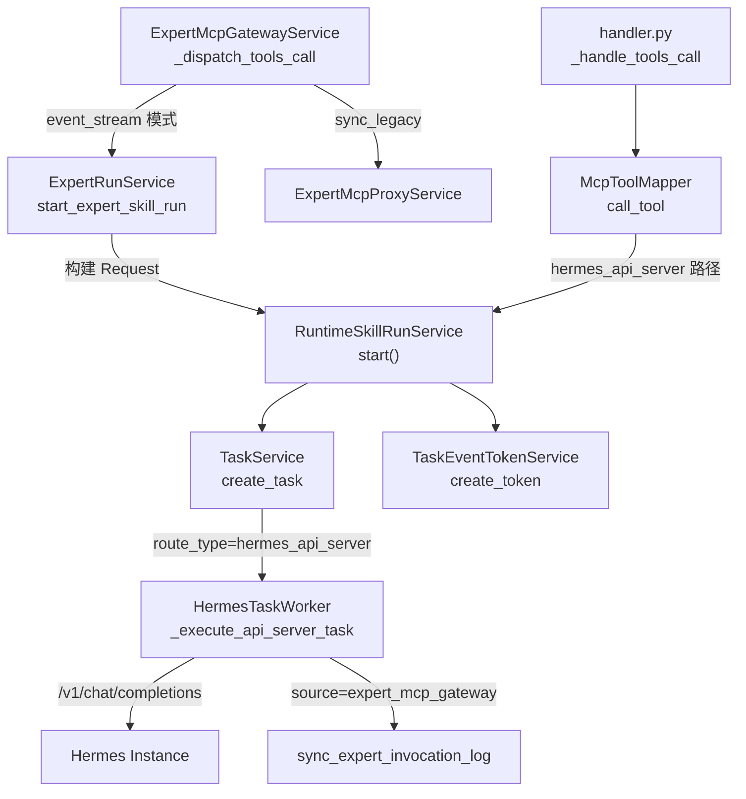

# v6.3.2 Hotfix 实施计划

## 前端表现变化

### Expert tools/call 返回格式变化

**总结**: Expert 入口 `tools/call` 返回的 `structuredContent` 从 camelCase 改为与组织 MCP 一致的 snake_case；SSE 端点从 `/v1/runs` 改为 `/api/v1/hermes/tasks/{id}/events`。

**元素级变化**:

- `structuredContent.taskId` -> **删除**，替换为 `task_id`
- `structuredContent.taskNo` -> **删除**，替换为 `task_no`
- `structuredContent.eventSseUrl` -> **删除**，替换为 `event_stream`（含 token 的完整路径）
- `structuredContent.eventUrl` -> **删除**，替换为 `event_url`
- `structuredContent.artifactUrl` -> **删除**，替换为 `artifact_url`
- `structuredContent.invocationId` -> **删除**，替换为 `invocation_id`
- `structuredContent.orchestrationMode: "agent_event_stream"` -> **删除**，替换为 `execution_mode: "async_event"`
- `structuredContent.skillName` -> **删除**，替换为 `skill_name`
- **新增** `result_url`、`event_token_url`、`wait_strategy`、`committed`、`artifact_mode`、`server_artifacts`（与组织 MCP 一致）
- **新增** `entrypoint: "expert_mcp_gateway"`、`task_source: "expert_mcp"`、`catalog_kind`、`catalog_slug`、`agent_profile`、`runtime_skill_id`

### Expert tools/list annotations 增强

**总结**: Expert 技能描述中新增执行模式元数据，hermes-agent 可据此识别"调用后与组织 MCP 共用 SSE"。

**元素级变化**:

- annotations **新增**: `executionMode: "async_event"`、`routeType: "hermes_api_server"`、`upstreamToolName`、`sseTimelineEnabled: true`、`artifactMode: "pull_only"`

---

## 技术实施步骤

### Step 1 (F1): 新增 RuntimeSkillRunService + Schema

**新增文件**:

- [app/schemas/hermes_skill/runtime_skill_run.py](nodeskclaw-backend/app/schemas/hermes_skill/runtime_skill_run.py)
- [app/services/hermes_skill/runtime_skill_run_service.py](nodeskclaw-backend/app/services/hermes_skill/runtime_skill_run_service.py)

**`StartRuntimeSkillRunRequest`** (dataclass):

```python
@dataclass
class StartRuntimeSkillRunRequest:
    org_id: str
    user_id: str
    tool_name: str                    # hermes_{profile}__{skill}
    runtime_skill_id: str             # 短 skill 名
    agent_profile: str
    hermes_agent_instance_id: str
    agent_id: str | None
    arguments: dict[str, Any]
    client_context: dict[str, Any]
    output_policy: dict[str, Any]
    timeout_seconds: int | None
    request_trace_id: str | None
    request_snapshot: dict | None
    route_diagnostics: dict | None
    task_source: str                  # org_mcp | expert_mcp
    installation_id: str | None
```

**`RuntimeSkillRunResult`** (dataclass):

```python
@dataclass
class RuntimeSkillRunResult:
    task: HermesTask
    sse_token: str
    structured_content: dict[str, Any]
```

**`RuntimeSkillRunService.start()`** 方法逻辑:

1. 构建 `route_snapshot`:

```python
route_snapshot = {
    "route_type": "hermes_api_server",
    "force_instance": True,
    "hermes_agent_instance_id": req.hermes_agent_instance_id,
    "agent_profile": req.agent_profile,
    "runtime_skill_id": req.runtime_skill_id,
    "hermes_instance_name": req.agent_profile,
    "timeout_seconds": req.timeout_seconds or 900,
}
```

Expert 入口附加审计字段从 `req.client_context` 中提取（catalog_kind/catalog_slug 等）。

2. 构建 `execution_contract`:

```python
execution_contract = {
    "mode": "async_event",
    "timeline_provider": "nodeskclaw_task_events",
    "runtime_invocation": "chat_completions",
    "desktop_route_override_allowed": False,
}
```

3. 调用 `TaskService.create_task()` 创建 HermesTask
4. 写入 `request_trace_id`、`request_snapshot`、`route_diagnostics`
5. 调用 `TaskEventTokenService.create_token()` 创建 SSE token
6. 构建统一 snake_case `structured_content`（字段集合见 PRD 第 6 节）
7. 返回 `RuntimeSkillRunResult`

**日志输出**:

```
runtime_skill_run.start
runtime_skill_run.task_created
runtime_skill_run.token_created
```

---

### Step 2 (F2): McpToolMapper 改用 RuntimeSkillRunService

**修改文件**: [app/services/hermes_skill/mcp_tool_mapper.py](nodeskclaw-backend/app/services/hermes_skill/mcp_tool_mapper.py)

**变更范围**: `call_tool()` 方法中 `hermes_api_server` source_type 路径

**当前流程** (需要改的部分):

1. 构建 routing_metadata + execution_contract (行 419-475) -- 移入 RuntimeSkillRunService
2. 创建 task (行 535-551) -- 移入 RuntimeSkillRunService
3. `_build_async_event_response` (行 750-804) -- 移入 RuntimeSkillRunService

**重构后流程**:

1. 路由解析、权限、授权、输入校验 -- 不变
2. Dedup 检查 -- 不变（dedup 命中走旧逻辑返回已有任务）
3. Dedup 未命中 → 构建 `StartRuntimeSkillRunRequest`:
   - `org_id`, `user_id` 从参数获取
   - `tool_name` 从参数获取
   - `runtime_skill_id` 从 `installation.routing_metadata` 获取
   - `agent_profile` 从 `installation.profile_id` 获取
   - `hermes_agent_instance_id` 从 `installation.routing_metadata` 获取
   - `agent_id` 从 `installation.agent_id` 获取
   - `task_source = "org_mcp"`
   - `installation_id = installation.id`
4. 调用 `RuntimeSkillRunService(self.db).start(request)`
5. 审计日志 -- 使用 `result.task` 的信息
6. 响应:
   - async_event: 合并 `result.structured_content` + MCP 上下文字段 (`agent_alias`, `installation_id`, `routing_reason` 等)
   - wait: 使用 `result.task.id` 走 `McpTaskWaitService`

**保持不变**:

- `list_tools()` 逻辑不变
- dedup 命中时的 `_finalize_async_event_response` / `_finalize_wait_response` 不变
- 非 `hermes_api_server` source_type 路径不变
- `_build_task_response` (非 async_event 的 fallback) 不变

**可删除**:

- `_build_async_event_response` 方法的**核心逻辑**可简化（SSE token 创建和 structuredContent 拼装已在 RuntimeSkillRunService 中）

---

### Step 3 (F3): ExpertRunService 改用 hermes_api_server + RuntimeSkillRunService

**修改文件**: [app/services/expert_gateway/expert_run_service.py](nodeskclaw-backend/app/services/expert_gateway/expert_run_service.py)

**当前问题**:

- `_build_expert_route_snapshot` 使用 `route_type: "expert_agent_event_stream"` (行 294)
- `_build_team_route_snapshot` 同上 (行 321)
- `_create_task_run` 不写 `execution_contract` 到 routing_metadata
- `structured_content` 使用 camelCase (行 259-275)

**重构方案**:

1. 删除 `_build_expert_route_snapshot`、`_build_team_route_snapshot`、`_build_execution_contract`、`_create_task_run` -- 逻辑全部收敛到 RuntimeSkillRunService

2. `start_expert_skill_run` 改为:
   - 保持: resolve execution agent、创建 ExpertInvocationLog
   - 新增: 构建 `StartRuntimeSkillRunRequest`，`task_source="expert_mcp"`, `installation_id=None`
   - 调用 `RuntimeSkillRunService(self.db).start(request)`
   - 保持: `attach_task(log, result.task)`
   - 变更: 使用 `result.structured_content`（snake_case）+ Expert 专用字段 (`invocation_id`, `catalog_kind`, `catalog_slug`, `skill_name`)
   - 构建 MCP 成功响应

3. `start_team_skill_run` 同理

4. `_build_mcp_accepted_result` 改为使用 snake_case `structured_content`:
   - 删除 camelCase 字段 (`invocationId`, `skillName`, `kind` 等)
   - 改为 snake_case: `invocation_id`, `skill_name`, `catalog_kind`, `catalog_slug`
   - `content[0].text` 文案保持不变

5. 删除 `StartExpertRunResult` dataclass（不再需要，使用 RuntimeSkillRunResult）

**不变的路径**:

- `sync_legacy` Header → 继续走 `ExpertMcpProxyService.call_upstream_tool`（在 `expert_mcp_gateway_service.py` 中判断）
- `gateway_sequential` 团队编排 → 继续走 `ExpertTeamOrchestrator`
- `_build_client_context` 逻辑保留，作为 `client_context` 传入 RuntimeSkillRunService

---

### Step 4 (F4): Expert tools/list 增强元数据 (可选但推荐)

**修改文件**: [app/services/expert_gateway/expert_skill_service.py](nodeskclaw-backend/app/services/expert_gateway/expert_skill_service.py)

**变更位置**: `build_tool_descriptor` 静态方法 (行 253-279)

在 `annotations` 中追加:

```python
"executionMode": "async_event",
"routeType": "hermes_api_server",
"upstreamToolName": skill.upstream_tool_name,
"sseTimelineEnabled": True,
```

需要方法签名变更：增加接收 `skill.upstream_tool_name` 的能力（当前已可通过 `skill` 参数获取）。

---

### Step 5 (F6): Worker 对 Expert 来源 hermes_api_server 任务的日志对齐

**修改文件**: [app/services/hermes_skill/hermes_task_worker.py](nodeskclaw-backend/app/services/hermes_skill/hermes_task_worker.py)

**变更 1**: `_execute_api_server_task` 结束时同步 ExpertInvocationLog

当前 `_execute_api_server_task` (行 525-797) 不调用 `_sync_expert_invocation_log`，因为之前 Expert 任务不走这个路径。v6.3.2 后 Expert 任务也走 `hermes_api_server`，需要在任务完成后检查 `client_context.source`:

```python
# 在 _execute_api_server_task 末尾（行 789 之后、方法返回前）
client_source = (task.client_context or {}).get("source")
if client_source == "expert_mcp_gateway":
    await self._sync_expert_invocation_log(db, task.id)
```

**变更 2**: `worker.dispatch.begin` 日志增加 `client_source`

在行 213-220 的日志中追加 `client_source` 字段:

```python
logger.info(
    "worker.dispatch.begin trace_id=%s task_id=%s task_no=%s tool=%s route_type=%s "
    "runtime_invocation=%s execution_mode=%s client_source=%s",
    ...,
    (task.client_context or {}).get("source", ""),
)
```

---

### Step 6 (F7): 测试

**新增测试文件**:

1. `tests/hermes_skill/test_runtime_skill_run_service.py` -- RuntimeSkillRunService 单元测试
   - route_snapshot 包含 hermes_api_server、force_instance
   - execution_contract 包含 chat_completions
   - structured_content 只含 snake_case 字段
   - task_source 区分 org_mcp / expert_mcp

2. `tests/expert_gateway/test_expert_runtime_skill_unified_route.py` -- Expert 路由统一
   - Expert tools/call → route_type=hermes_api_server
   - execution_contract.runtime_invocation=chat_completions
   - hermes_run_id is null (不走 /v1/runs)

3. `tests/expert_gateway/test_expert_structured_content_snake_case.py` -- Expert 返回格式
   - 包含 task_id, event_stream, result_url
   - 不含 taskId, eventSseUrl
   - invocation_id (非 invocationId)

4. `tests/mcp_skill_gateway/test_mcp_expert_response_parity.py` -- 双入口一致性
   - 两入口核心字段集合一致
   - Expert 无 org Skill Grant 仍可调用
   - sync_legacy 走旧路径不创建 hermes_api_server 任务

---

### Step 7: 文档更新

更新三份模块文档:

- [docs/backend/expert_mcp_gateway.md](docs/backend/expert_mcp_gateway.md) -- Expert route_type 变更、structuredContent 格式
- [docs/backend/hermes_skill.md](docs/backend/hermes_skill.md) -- RuntimeSkillRunService 新增、Worker 日志对齐
- [docs/backend/mcp_skill_gateway.md](docs/backend/mcp_skill_gateway.md) -- McpToolMapper 委托关系变更

---

## 改动调用链总览



## 不改动的内容

- Expert / 组织 MCP 对外 URL 不变
- tools/list 的 name 命名规则不变（Expert 短名、组织 MCP 长名）
- sync_legacy 同步路径不变
- gateway_sequential 团队编排不变
- Expert 权限表与组织 Skill Grant 表不合并
- 前端 UI 布局不变
- Gene 模板 / Channel 插件 / DeskClaw Pod 不变