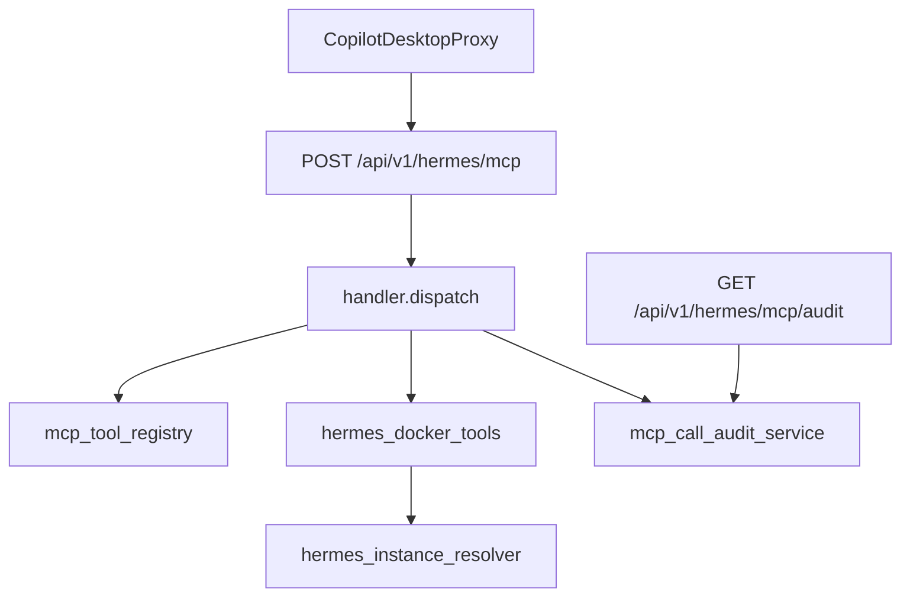

# v6.6.1 nodeskclaw MCP Gateway 运营化实施计划

## 前端表现变化

本次改动无前端表现变化。所有能力通过 MCP JSON-RPC（`/api/v1/hermes/mcp`）与 REST 审计查询接口（`/api/v1/hermes/mcp/audit`）暴露，供 Copilot Desktop 诊断页与运维人员使用。

---

## v6.6 已完成 vs v6.6.1 缺口

| 能力 | v6.6 现状 | v6.6.1 需补 |
|------|-----------|-------------|
| tools/list 治理字段 | 仅 name/description/inputSchema | 增加 `annotations`（category/permission/riskLevel/requiresApproval/enabled） |
| 错误码 | 旧码（MCP_UNAUTHORIZED/-32001 等） | 统一 v6.6.1 错误码体系（-32010~-32060 + business errorCode） |
| tools/call 成功响应 | `structuredContent` + 固定 text | `content[].text` 为 JSON 字符串 + `isError: false` |
| tools/call 失败响应 | `error.message` = errorCode | `error.message` 人类可读 + `data.errorCode` + 上下文（如 instance_ref） |
| Health | count only | 增加 protocolVersion、read/write/admin 分层计数 |
| instance_ref | 4 步精确匹配，无 default/ambiguous | 5 步解析 + AMBIGUOUS/FORBIDDEN/NOT_FOUND 专用错误 |
| 工具输出 | 缺 management_mode/status/image | 补齐 PRD 7.6 字段 |
| 审计表 | 基础字段，status=ok/failed | 增加 client_name/permission/risk_level/result_summary；status 改为 success/failed |
| 审计查询 | 无 | `GET /api/v1/hermes/mcp/audit` |
| system/info | 无 top-level service | 增加 `"service": "nodeskclaw"`（PRD 7.1） |

**已有可复用模块**（增量改造，不做大目录搬迁）：

- [`nodeskclaw-backend/app/services/mcp_skill_gateway/hermes_docker_tools.py`](nodeskclaw-backend/app/services/mcp_skill_gateway/hermes_docker_tools.py) — 三工具实现
- [`nodeskclaw-backend/app/services/mcp_skill_gateway/handler.py`](nodeskclaw-backend/app/services/mcp_skill_gateway/handler.py) — JSON-RPC 分发 + 审计写入
- [`nodeskclaw-backend/app/services/mcp_skill_gateway/audit_service.py`](nodeskclaw-backend/app/services/mcp_skill_gateway/audit_service.py) — 脱敏 + 写库
- [`nodeskclaw-backend/app/models/mcp_call_log.py`](nodeskclaw-backend/app/models/mcp_call_log.py) — 审计 Model
- [`nodeskclaw-backend/app/api/mcp_skill_gateway/router.py`](nodeskclaw-backend/app/api/mcp_skill_gateway/router.py) — MCP 路由

---

## 架构（v6.6.1 目标）



---

## 实施步骤

### Step 1: 工具注册表 + 治理字段（tools/list 标准化）

**新增** [`nodeskclaw-backend/app/services/mcp_skill_gateway/mcp_tool_registry.py`](nodeskclaw-backend/app/services/mcp_skill_gateway/mcp_tool_registry.py)

- 集中定义所有工具元数据：`name`、`description`、`inputSchema`、`category`、`permission`、`riskLevel`、`requiresApproval`、`enabled`
- **v6.6.1 仅暴露 3 个 read 工具**（enabled=true）
- write/admin/GeneHub 工具定义保留在 registry 内但 `list_enabled_tools()` 不返回（或 `enabled=false` 且不进入 call 路径）
- `build_tool_descriptor()` 输出 MCP 标准结构 + `annotations` 块

**修改** [`hermes_docker_tools.py`](nodeskclaw-backend/app/services/mcp_skill_gateway/hermes_docker_tools.py)

- `list_tools()` 改为从 registry 读取
- `call_tool()` 通过 registry 查 permission/riskLevel，write/admin 返回 `MCP_TOOL_DISABLED`

---

### Step 2: 统一错误码体系

**重构** [`nodeskclaw-backend/app/services/mcp_skill_gateway/errors.py`](nodeskclaw-backend/app/services/mcp_skill_gateway/errors.py)

按 PRD 7.11 实现：

| JSON-RPC code | business errorCode | 场景 |
|---------------|-------------------|------|
| -32010 | MCP_AUTH_REQUIRED | 未登录 |
| -32011 | MCP_AUTH_EXPIRED | token 过期 |
| -32012 | MCP_ORG_FORBIDDEN | 无组织上下文 |
| -32020 | MCP_TOOL_NOT_FOUND | 工具不存在 |
| -32021 | MCP_TOOL_DISABLED | write/admin 未开放 |
| -32022 | MCP_TOOL_PERMISSION_DENIED | Skill Hub 权限不足 |
| -32030 | MCP_INVALID_ARGUMENTS | 参数校验失败 |
| -32040 | HERMES_INSTANCE_NOT_FOUND | instance_ref 无匹配 |
| -32041 | HERMES_INSTANCE_AMBIGUOUS | 多实例匹配 |
| -32042 | HERMES_INSTANCE_FORBIDDEN | 无实例访问权 |
| -32050 | HERMES_RUNTIME_UNAVAILABLE | Docker/WebUI 不可用 |
| -32051 | HERMES_SKILLS_LIST_FAILED | skills 读取失败 |
| -32060 | MCP_INTERNAL_ERROR | 内部错误 |

新增 `mcp_error_v2(jsonrpc_id, error_code, message, *, data: dict)` — `error.message` 为人类可读文案，`error.data.errorCode` 为 business code，可附加 `instance_ref` 等上下文。

**修改** [`handler.py`](nodeskclaw-backend/app/services/mcp_skill_gateway/handler.py) 与 [`auth.py`](nodeskclaw-backend/app/services/mcp_skill_gateway/auth.py) — 全部错误路径走新 helper，禁止裸异常/traceback 泄漏。

---

### Step 3: instance_ref 解析器标准化

**新增** [`nodeskclaw-backend/app/services/mcp_skill_gateway/hermes_instance_resolver.py`](nodeskclaw-backend/app/services/mcp_skill_gateway/hermes_instance_resolver.py)

从 `hermes_docker_tools.py` 抽出并增强：

**解析顺序**（PRD 7.7）：
1. `instance_id` 精确匹配
2. `container_name` 精确匹配
3. `profile` 精确匹配
4. `alias` 精确匹配（slug/name/advanced_config.aliases）
5. **默认实例**：`instance_ref` 为空时
   - 取当前用户可访问（viewer+）的 external_docker 实例
   - 若仅 1 个 → 使用该实例
   - 否则查 [`DesktopHermesProfile`](nodeskclaw-backend/app/models/desktop_hermes_profile.py)（user+org，active，最近 last_seen_at）的 `profile_name` 映射到 instance profile
   - 仍多个 → `HERMES_INSTANCE_AMBIGUOUS`
   - 零个 → `HERMES_INSTANCE_NOT_FOUND`

**歧义检测**：每一步若同一 ref 命中多个 instance → 立即抛 `HERMES_INSTANCE_AMBIGUOUS`（带 matching instance_ids 摘要，不含敏感信息）。

**权限顺序**：先 resolve，再 `instance_member_service.check_instance_access()`；ForbiddenError 映射为 `HERMES_INSTANCE_FORBIDDEN`（与 NOT_FOUND 区分）。

---

### Step 4: 工具输出字段补齐

**修改** [`hermes_docker_tools.py`](nodeskclaw-backend/app/services/mcp_skill_gateway/hermes_docker_tools.py) 中三个 handler：

| 工具 | 新增/调整字段 |
|------|--------------|
| `hermes.instances.list` | `management_mode`（来自 `get_lifecycle_config().lifecycle_mode`） |
| `hermes.instance.status` | `status`（display_status）、`image`（docker inspect 已有） |
| `hermes.skills.list` | 保持 PRD 结构，skills 读取失败映射 `HERMES_SKILLS_LIST_FAILED` |

复用现有 [`status_service.get_status()`](nodeskclaw-backend/app/services/hermes_external/status_service.py) 与 [`get_lifecycle_config()`](nodeskclaw-backend/app/services/hermes_external/_common.py)。

---

### Step 5: tools/call 响应格式对齐

**修改** [`handler.py`](nodeskclaw-backend/app/services/mcp_skill_gateway/handler.py) `_handle_tools_call` 成功路径：

```python
{
  "content": [{"type": "text", "text": json.dumps(result, ensure_ascii=False)}],
  "isError": false
}
```

移除对外暴露的 `structuredContent`（Copilot Desktop v6.6.1 按 PRD 解析 content text JSON）。

失败路径统一走 Step 2 的 `mcp_error_v2`。

---

### Step 6: 审计模型扩展 + 迁移

**修改** [`nodeskclaw-backend/app/models/mcp_call_log.py`](nodeskclaw-backend/app/models/mcp_call_log.py) 新增列：

- `client_name` TEXT nullable（从 initialize params.clientInfo.name 写入 session，tools/call 时读取）
- `permission` TEXT nullable
- `risk_level` TEXT nullable
- `result_summary` JSONB nullable（如 instances_count、skills_count，不含完整 payload）

**修改** [`session.py`](nodeskclaw-backend/app/services/mcp_skill_gateway/session.py) — session 存储 clientInfo。

**修改** [`audit_service.py`](nodeskclaw-backend/app/services/mcp_skill_gateway/audit_service.py)：
- status 值：`success` / `failed`（替换 ok/failed）
- 写入 permission、risk_level、client_name、result_summary
- 新增 `sanitize_result_summary()` 摘要化结果

**生成 Alembic 迁移**（仅 ADD COLUMN，不含 autogenerate 漂移的其他表变更）。

---

### Step 7: 审计查询 API

**新增** [`nodeskclaw-backend/app/schemas/hermes_mcp.py`](nodeskclaw-backend/app/schemas/hermes_mcp.py) — `McpCallLogItem`、`McpCallLogListResponse`

**修改** [`nodeskclaw-backend/app/api/mcp_skill_gateway/router.py`](nodeskclaw-backend/app/api/mcp_skill_gateway/router.py) 新增：

```http
GET /api/v1/hermes/mcp/audit
```

- 认证：`get_current_user` + org 上下文
- 权限：组织 admin 查全 org；普通成员仅查 `user_id = self`
- 查询参数：`tool_name`、`instance_id`、`status`、`from`、`to`、`limit`、`offset`
- 返回 `{ items: [...], total: N }`（PRD 7.10 字段子集）

**新增** [`audit_service.list_mcp_calls()`](nodeskclaw-backend/app/services/mcp_skill_gateway/audit_service.py) 分页查询逻辑。

---

### Step 8: Health + system/info 增强

**修改** [`router.py`](nodeskclaw-backend/app/api/mcp_skill_gateway/router.py) `mcp_health`：

```json
{
  "ok": true,
  "service": "nodeskclaw-mcp-skill-gateway",
  "status": "running",
  "protocolVersion": "2025-06-18",
  "tools": { "count": 3, "read": 3, "write": 0, "admin": 0 }
}
```

计数来自 registry 按 permission 分组（不依赖 DB 登录态）。

**修改** [`router.py` system_info](nodeskclaw-backend/app/api/router.py) — 响应增加 `"service": "nodeskclaw"`（保留现有 edition/version/features/mcp/genehub）。

---

### Step 9: 测试补齐（PRD 第 10 节）

在 [`nodeskclaw-backend/tests/mcp_skill_gateway/`](nodeskclaw-backend/tests/mcp_skill_gateway/) 新增/更新：

| 测试文件 | 覆盖点 |
|---------|--------|
| `test_mcp_tools_list.py` | annotations 五字段齐全 |
| `test_mcp_tools_call_*.py` | 三工具成功响应 JSON 格式 |
| `test_mcp_instance_resolver.py` | NOT_FOUND / AMBIGUOUS / default / forbidden |
| `test_mcp_tool_permission_denied.py` | write tool → MCP_TOOL_DISABLED |
| `test_mcp_call_audit_success.py` | tools/call 写 audit + 字段完整 |
| `test_mcp_call_audit_failed.py` | 失败写 audit + error_code |
| `test_mcp_audit_redaction.py` | token/password 不入库 |
| `test_mcp_audit_api.py` | GET audit 分页与权限 |
| `test_mcp_health.py` | read/write/admin 计数 |
| `test_system_info_mcp_descriptor.py` | service 字段 |

更新现有测试中对旧 errorCode（MCP_UNAUTHORIZED 等）的断言。

---

## 文件变更清单

| 操作 | 文件 |
|------|------|
| 新增 | `app/services/mcp_skill_gateway/mcp_tool_registry.py` |
| 新增 | `app/services/mcp_skill_gateway/hermes_instance_resolver.py` |
| 新增 | `app/schemas/hermes_mcp.py` |
| 新增 | `alembic/versions/xxx_extend_mcp_call_logs_v661.py` |
| 修改 | `app/models/mcp_call_log.py` |
| 修改 | `app/services/mcp_skill_gateway/errors.py` |
| 修改 | `app/services/mcp_skill_gateway/hermes_docker_tools.py` |
| 修改 | `app/services/mcp_skill_gateway/handler.py` |
| 修改 | `app/services/mcp_skill_gateway/audit_service.py` |
| 修改 | `app/services/mcp_skill_gateway/session.py` |
| 修改 | `app/services/mcp_skill_gateway/auth.py` |
| 修改 | `app/api/mcp_skill_gateway/router.py` |
| 修改 | `app/api/router.py`（system/info） |
| 新增/修改 | `tests/mcp_skill_gateway/*.py` |

**不做**（PRD 非目标）：GeneHub 本地落盘、write/admin 工具开放、审批流、marketplace UI、大规模模块重命名（如不强制新建 `hermes_mcp.py`，继续在现有 router 上扩展）。

---

## 验收对照（PRD 第 11 节）

| # | 验收项 | 覆盖 Step |
|---|--------|-----------|
| 1-4 | system/info / health / initialize / tools/list >= 3 | 8, 现有 + 1 |
| 5 | tools/list 含治理 annotations | 1 |
| 6-8 | 三 read tools 可调用且输出符合 PRD | 3, 4, 5 |
| 9-11 | auth / forbidden / not_found 稳定错误码 | 2, 3 |
| 12-13 | 每次 call 写 audit + 脱敏 | 6, 7 |
| 14 | write/admin 不可调用 | 1, 2 |
| 15 | Desktop 诊断可读 tools/list + invoke | 1, 5, 8 |

---

## 部署注意

迁移完成后需执行：

```bash
cd nodeskclaw-backend
uv run alembic upgrade head
```
