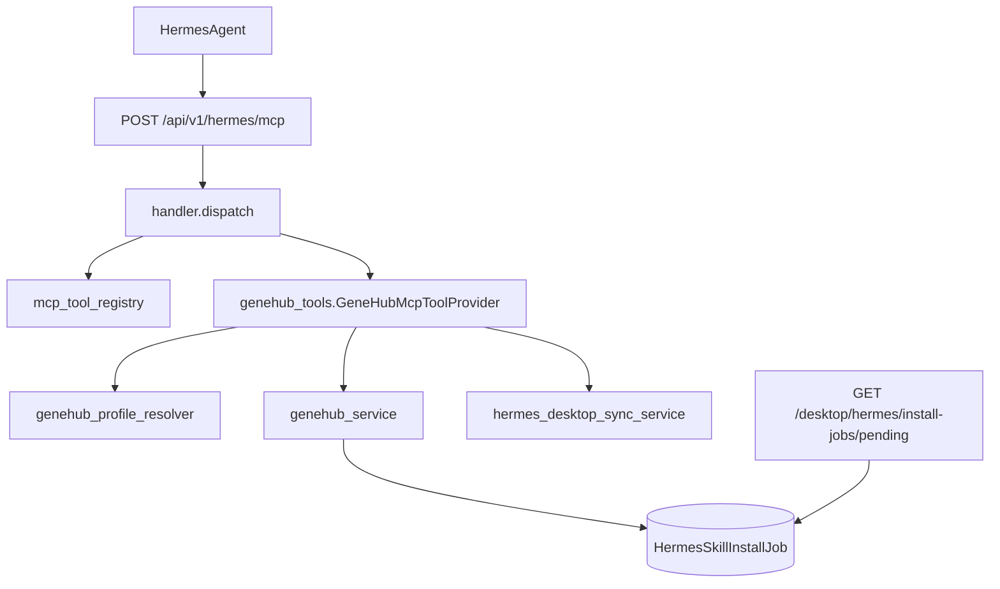

# v6.6.2 GeneHub MCP Registration 实施计划

## 前端表现变化

本次改动无前端表现变化。GeneHub MCP 能力通过 `/api/v1/hermes/mcp` JSON-RPC 暴露给 Copilot Desktop / Hermes Agent；Desktop 侧继续走现有 `/api/v1/desktop/*` REST 拉取 pending job、claim、bundle、status 回写。

---

## 现状与缺口（基于代码调研）

| 层级 | v6.6.1 现状 | v6.6.2 需补 |
|------|-------------|-------------|
| Registry | 4 个 GeneHub 工具 `enabled=False`，inputSchema 不完整 | 全部 `enabled=True`，补 PRD 输入 schema |
| Runtime | [`hermes_docker_tools.py`](nodeskclaw-backend/app/services/mcp_skill_gateway/hermes_docker_tools.py) 入口硬拒绝 `MCP_NOT_IMPLEMENTED` | 新增 [`genehub_tools.py`](nodeskclaw-backend/app/services/mcp_skill_gateway/genehub_tools.py) 独立 Provider |
| Handler | GeneHub 与 Hermes 同走 `HermesDockerToolProvider`，且 write 工具被 `permission != read` 拦截 | 分流到 `GeneHubMcpToolProvider`；`register_to_hermes` 允许 write |
| 业务服务 | REST 链路完整（[`genehub_service.py`](nodeskclaw-backend/app/services/genehub_service.py)、[`hermes_desktop_sync_service.py`](nodeskclaw-backend/app/services/hermes_desktop_sync_service.py)） | 补 MCP 层封装：detail、registration status、MCP 幂等 register |
| 数据模型 | [`HermesSkillInstallJob`](nodeskclaw-backend/app/models/hermes_skill_install_job.py) 缺 `source` 字段 | 新增 `source` 列 + Alembic 迁移 |
| Desktop API | 无 `GET /hermes/install-jobs/{job_id}` | PRD §7 建议新增 GET + ignore/cancel |
| 错误码 | 无 `GENEHUB_*` | 扩展 [`errors.py`](nodeskclaw-backend/app/services/mcp_skill_gateway/errors.py) |
| 测试 | 仅 `test_call_tool_rejects_genehub_tools` | PRD §14 全套 GeneHub MCP 测试 |

**可复用能力（不重建）**：
- `genehub_service.list_desktop_visible_skills()` — search 底层
- `genehub_service.create_self_service_job()` + `_find_active_job()` — register 底层（已有 active job 幂等）
- `genehub_service.resolve_user_gene_permissions()` — 权限判断
- `handler._handle_tools_call()` 审计路径 — GeneHub 走同一路径写 `mcp_call_logs`
- v6.6.1 `mcp_error_v2` / `map_app_error` / annotations 机制

---

## 目标架构



---

## 实施步骤

### Step 1: Registry 启用 + Schema 补齐

**修改** [`mcp_tool_registry.py`](nodeskclaw-backend/app/services/mcp_skill_gateway/mcp_tool_registry.py)

- 4 个 GeneHub 工具 `enabled=True`
- `register_to_hermes` 保持 `permission=write`、`requiresApproval=true`
- 补全 `inputSchema`（对齐 PRD §6）：
  - `genehub.skills.search`: `query`, `profile_id`, `category`, `tag`（均可选）
  - `genehub.skill.detail`: `gene_slug`（必填）, `profile_id`（可选）
  - `genehub.skill.register_to_hermes`: `gene_slug`（必填）, `profile_id`, `version`, `action`
  - `genehub.registration.status`: `job_id` 或 `gene_slug`+`profile_id`（二选一，用 JSON Schema `oneOf` 或 handler 层校验）

**验收**：`tools/list` 返回 7 个 enabled 工具（3 Hermes read + 3 GeneHub read + 1 GeneHub write），GeneHub 工具含完整 annotations。

---

### Step 2: GeneHub 错误码

**修改** [`errors.py`](nodeskclaw-backend/app/services/mcp_skill_gateway/errors.py)

新增 business errorCode 与 JSON-RPC code（建议 `-32070` ~ `-32079` 段）：

| errorCode | 场景 |
|-----------|------|
| `GENEHUB_SKILL_NOT_FOUND` | gene_slug 不存在或未发布 |
| `GENEHUB_SKILL_FORBIDDEN` | skill 对用户不可见 |
| `GENEHUB_PROFILE_NOT_FOUND` | profile_id 无效 |
| `GENEHUB_PROFILE_FORBIDDEN` | 无 profile 访问权 |
| `GENEHUB_INSTALL_NOT_ALLOWED` | 无 canInstall/canUpdate |
| `GENEHUB_JOB_NOT_FOUND` | job_id 不存在或无权 |
| `GENEHUB_JOB_STATUS_UNAVAILABLE` | 状态不可查询 |

**修改** `_MESSAGE_KEY_MAP` — 映射现有 service 抛出的 key：
- `errors.genehub.skill_not_found` → `GENEHUB_SKILL_NOT_FOUND`
- `errors.genehub.install_job_permission_denied` → `GENEHUB_INSTALL_NOT_ALLOWED`
- `errors.genehub.install_job_not_found` → `GENEHUB_JOB_NOT_FOUND`
- `errors.desktop.profile_not_found` → `GENEHUB_PROFILE_NOT_FOUND`
- `errors.desktop.profile_forbidden` → `GENEHUB_PROFILE_FORBIDDEN`

`mcp_error_v2` 的 `data` 附加 `gene_slug` / `profile_id` / `job_id` 上下文（handler/provider 传入）。

---

### Step 3: Desktop Profile 解析器

**新增** [`genehub_profile_resolver.py`](nodeskclaw-backend/app/services/mcp_skill_gateway/genehub_profile_resolver.py)

职责（对齐 PRD §6 与现有 [`DesktopHermesProfile`](nodeskclaw-backend/app/models/desktop_hermes_profile.py)）：

1. `profile_id` 为空 → 取当前用户 org 下 `status=active` 的 profile，按 `last_seen_at desc` 取最近一个
2. `profile_id` 非空 → 先按 UUID 匹配 `DesktopHermesProfile.id`；未命中再按 `profile_name` 匹配（兼容 PRD 示例 `"default"`）
3. 校验 `user_id + org_id` 归属；Forbidden 映射 `GENEHUB_PROFILE_FORBIDDEN`

导出 `resolve_desktop_profile(ref, org_id, user, db) -> DesktopHermesProfile`。

---

### Step 4: genehub_service MCP 层封装

**修改** [`genehub_service.py`](nodeskclaw-backend/app/services/genehub_service.py)

新增公开函数（REST/MCP 共用）：

| 函数 | 用途 |
|------|------|
| `get_desktop_skill_detail()` | 单 skill 详情 + `manifest_preview`（has_skill/file_count/has_scripts/requires_signature），**不返回 bundle/script 全文** |
| `create_mcp_registration_job()` | 封装 register 幂等规则（PRD §6.3）：active job 直接返回；已安装同版本返回 `status=installed`；旧版本创建 `update` job；否则 `install`；`source=mcp_agent_request` |
| `get_registration_status()` | 按 `job_id` 或 `gene_slug+profile_id` 查询；普通用户限 self；org admin 可查 org 内 job |

**修改** [`_create_install_job()`](nodeskclaw-backend/app/services/genehub_service.py) — 接受并写入 `source` 参数。

**新增/扩展 schemas** [`schemas/genehub.py`](nodeskclaw-backend/app/schemas/genehub.py)：
- `GeneHubSkillPermissions`（can_install/can_update/can_uninstall）
- `GeneHubManifestPreview`
- `McpRegistrationInfo`（registration.status 输出结构）
- `DesktopInstallJobDetail`（Desktop GET job 详情）

权限对象映射：从 `resolve_user_gene_permissions()` 的 entitlement permission 集合转为 PRD 的 `permissions` 对象。

---

### Step 5: InstallJob 模型 + 迁移

**修改** [`hermes_skill_install_job.py`](nodeskclaw-backend/app/models/hermes_skill_install_job.py)

- 新增 `source: Mapped[str]`（nullable，默认 `desktop_manual` 兼容旧数据）
- 枚举：`desktop_manual` / `server_assigned` / `mcp_agent_request`

**生成 Alembic 迁移**（`alembic revision -m "add install job source"` + ADD COLUMN，review 无漂移）。

`assigned_at` 复用 `created_at`；`updated_at` 已有；输出层映射 PRD 字段名。

---

### Step 6: GeneHub MCP Provider

**新增** [`genehub_tools.py`](nodeskclaw-backend/app/services/mcp_skill_gateway/genehub_tools.py)

```python
class GeneHubMcpToolProvider:
    async def call_tool(tool_name, arguments, org_id, user_id) -> dict
```

四个 handler：
- `_skills_search()` → `list_desktop_visible_skills()` + PRD 输出格式
- `_skill_detail()` → `get_desktop_skill_detail()`
- `_register_to_hermes()` → `create_mcp_registration_job()`（**只创建 job，不写本地**）
- `_registration_status()` → `get_registration_status()`

**新增** `summarize_genehub_result()` — 审计摘要（gene_slug/job_id/job_status，不含 bundle）。

**修改** [`hermes_docker_tools.py`](nodeskclaw-backend/app/services/mcp_skill_gateway/hermes_docker_tools.py) — 移除 GeneHub 硬拒绝；`is_genehub_tool()` 保留供 handler 分流。

---

### Step 7: Handler 分流 + 审计

**修改** [`handler.py`](nodeskclaw-backend/app/services/mcp_skill_gateway/handler.py)

- 新增 `_is_genehub_gateway_tool()`，GeneHub 工具走 `GeneHubMcpToolProvider`
- Hermes Docker 工具仍走 `HermesDockerToolProvider`
- GeneHub 审计：`permission`/`risk_level` 从 registry 读取；`result_summary` 用 `summarize_genehub_result()`
- `requiresApproval=true` **不阻断** MCP 调用（审批在 Desktop 确认安装，PRD §5 说明）

**修改** [`mcp_health`](nodeskclaw-backend/app/api/mcp_skill_gateway/router.py) — 计数自动随 registry 更新（read=6, write=1, count=7）。

---

### Step 8: Desktop API 增强（PRD §7）

**修改** [`desktop_genehub.py`](nodeskclaw-backend/app/api/desktop_genehub.py)

新增：
- `GET /api/v1/desktop/hermes/install-jobs/{job_id}` — 返回 job 详情（gene_slug、status、error 等）
- `POST /api/v1/desktop/hermes/install-jobs/{job_id}/ignore` — 将 pending job 标记 `cancelled`（用户暂不安装）

**修改** [`hermes_desktop_sync_service.py`](nodeskclaw-backend/app/services/hermes_desktop_sync_service.py) — 暴露 `get_install_job_detail()`、`cancel_install_job()`（复用 `_get_user_job` 权限校验）。

---

### Step 9: 测试（PRD §14）

**目录** [`tests/mcp_skill_gateway/`](nodeskclaw-backend/tests/mcp_skill_gateway/)

| 文件 | 覆盖 |
|------|------|
| `test_genehub_skills_search.py` | search 成功、profile 不存在、forbidden |
| `test_genehub_skill_detail.py` | detail 成功、manifest_preview、无 bundle |
| `test_genehub_register_to_hermes.py` | 创建 job、幂等 active job、已安装同版本、update job |
| `test_genehub_registration_status.py` | 按 job_id / gene_slug 查询 |
| `test_genehub_tool_auth_required.py` | 未登录 -32010 |
| `test_genehub_skill_forbidden.py` / `test_genehub_profile_forbidden.py` | 权限错误码稳定 |
| `test_genehub_register_duplicate_job.py` | 重复 pending job 不新建 |
| `test_genehub_mcp_audit_*.py` | 成功/失败审计 + 脱敏 |

**更新**现有测试：
- `test_mcp_tools_list.py` — enabled 工具数 3→7
- `test_mcp_health.py` — read/write 计数
- `test_hermes_docker_tools.py` — 移除/改写 genehub reject 用例
- `test_mcp_tool_permission_denied.py` — Hermes write 仍 disabled；GeneHub register 可调用

---

## 文件变更清单

| 操作 | 文件 |
|------|------|
| 新增 | `app/services/mcp_skill_gateway/genehub_tools.py` |
| 新增 | `app/services/mcp_skill_gateway/genehub_profile_resolver.py` |
| 新增 | `alembic/versions/*_add_install_job_source.py` |
| 新增 | `tests/mcp_skill_gateway/test_genehub_*.py`（10+ 文件） |
| 修改 | `app/services/mcp_skill_gateway/mcp_tool_registry.py` |
| 修改 | `app/services/mcp_skill_gateway/errors.py` |
| 修改 | `app/services/mcp_skill_gateway/handler.py` |
| 修改 | `app/services/mcp_skill_gateway/hermes_docker_tools.py` |
| 修改 | `app/services/genehub_service.py` |
| 修改 | `app/services/hermes_desktop_sync_service.py` |
| 修改 | `app/models/hermes_skill_install_job.py` |
| 修改 | `app/schemas/genehub.py` |
| 修改 | `app/api/desktop_genehub.py` |

**明确不做**（PRD §4）：本地 ~/.hermes 写入、install_git/zip、instance restart、审批流 UI、Marketplace 页面。

---

## 验收对照（PRD §15）

| # | 验收项 | 覆盖 Step |
|---|--------|-----------|
| 1 | tools/list 含 GeneHub tools + annotations | 1 |
| 2-3 | search / detail 返回可见 skill | 4, 6 |
| 4-5 | register 创建 job、不直接安装 | 4, 6 |
| 6-8 | Desktop pending → installed；status 可查 | 5, 8, 6 |
| 9 | 全量 audit + 脱敏 | 6, 7 |
| 10 | 无权限稳定 JSON-RPC error | 2, 3, 6 |

---

## 部署注意

```bash
cd nodeskclaw-backend
uv run alembic upgrade head
uv run pytest tests/mcp_skill_gateway/ -q
```

需确认 `GENEHUB_DESKTOP_SYNC_ENABLED=true` 环境变量已配置，否则 Desktop 侧 job 拉取不可用（MCP 创建 job 仍应成功）。
