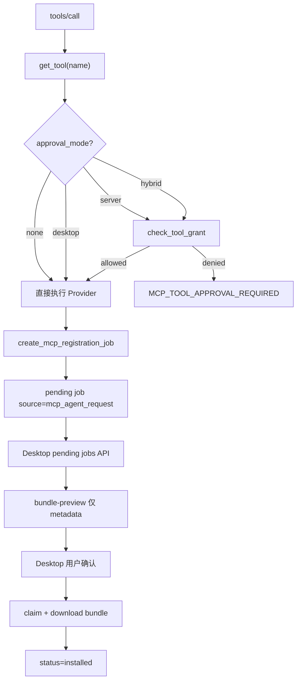

# v6.7.1 GeneHub MCP Registration Hardening 实施计划

## 前端表现变化

**本次改动无 nodeskclaw 管理端/门户前端表现变化。**

变化发生在 Copilot Desktop 与 Hermes Agent 的协作链路（后端 API + MCP 行为）：

- Agent 调用 `genehub.skill.register_to_hermes` 后：**不再**收到 `MCP_TOOL_APPROVAL_REQUIRED`，而是直接拿到 `pending` job
- Desktop 拉取 pending jobs 时：可看到 `source=mcp_agent_request`、`profileName`、时间戳、错误信息等完整字段
- Desktop 在用户确认前：可调用 **bundle-preview** 预览 manifest 元数据（不下载正文、不改变 job 状态）
- Desktop 忽略安装请求后：job 变为 `cancelled`，Agent 查询 `registration.status` 可看到 `cancelled`

---

## 现状与缺口（基于代码调研）

| 领域 | 现状 | PRD 要求 |
|---|---|---|
| `is_genehub_registry_tool` | **已存在**（[`mcp_tool_registry.py`](nodeskclaw-backend/app/services/mcp_skill_gateway/mcp_tool_registry.py)） | 保持可用 |
| `approval_mode` | `ToolDefinition` 无此字段；`register_to_hermes` 设 `requires_approval=True` | `approvalMode=desktop`，不走 server approval |
| `check_tool_grant` | 凡 `requires_approval=True` 均走 server grant | `desktop` 模式直接放行 |
| `create_mcp_registration_job` | 已创建 `source=mcp_agent_request` job | 返回字段需补 `source`、`desktop_confirmation_required`、server `profile_id` |
| pending jobs API | 仅 `status=pending`，字段缺 `source/profile_name/timestamps` | 返回完整 `DesktopPendingJobInfo` |
| bundle-preview | **不存在** | 新增 GET，pending 可调用，不 claim |
| ignore API | 路由存在，无 request body，无 audit/finished_at | 支持 reason + client_report |
| registration.status | `McpRegistrationInfo` 缺 `source/finished_at` | 补全 |
| MCP audit | `mcp_call_logs` 无 `approval_mode`；register summary 不完整 | 补字段与 redaction |

---

## 架构：审批模式分流



---

## 实施步骤

### Phase 1：MCP Tool Registry + Approval 边界（P0 阻断修复）

**文件：[`mcp_tool_registry.py`](nodeskclaw-backend/app/services/mcp_skill_gateway/mcp_tool_registry.py)**

- 扩展 `ToolDefinition`：
  - `approval_mode: Literal["none", "server", "desktop", "hybrid"]`
  - `desktop_confirmation_required: bool`
- 更新 GeneHub 工具配置（按 PRD 6.1）：
  - read tools：`approval_mode=none`，`requires_approval=false`
  - `genehub.skill.register_to_hermes`：`approval_mode=desktop`，`requires_approval=false`，`desktop_confirmation_required=true`
- 新增 `is_desktop_confirmation_tool(name)` helper
- 更新 `build_tool_descriptor()`：`annotations` 输出 `approvalMode`、`desktopConfirmationRequired`（read 工具 `authorized=true`；desktop 工具标注 `grantStatus=desktop_pending` 或等价语义，不走 server grant）

**文件：[`approval_service.py`](nodeskclaw-backend/app/services/mcp_skill_gateway/approval_service.py)**

- `check_tool_grant()` 入口增加 `approval_mode` 分支：
  - `none` / `desktop` → 直接 `GrantCheckResult(allowed=True)`
  - `server` / `hybrid` → 保持 v6.7 现有逻辑
- `get_grant_annotation()` 同步：desktop 模式不查 `mcp_tool_grants`

**文件：[`handler.py`](nodeskclaw-backend/app/services/mcp_skill_gateway/handler.py)**

- `_enforce_tool_grant()` 改为读取 `tool.approval_mode`（而非仅 `requires_approval`）
- `_collect_tools()` 对 desktop 模式工具使用专用 annotation（不显示 `grantStatus=missing` 误导 Agent）
- `log_mcp_call()` 调用处传入 `approval_mode`（见 Phase 5）

**验收点**：`register_to_hermes` 不再返回 `MCP_TOOL_APPROVAL_REQUIRED`；现有 Hermes server approval 工具行为不变。

---

### Phase 2：MCP register_to_hermes 输出与幂等增强

**文件：[`schemas/genehub.py`](nodeskclaw-backend/app/schemas/genehub.py)**

- 扩展 `McpRegistrationJobResult`：
  - `source: str`
  - `profile_name: str`
  - `desktop_confirmation_required: bool`
  - `profile_id` 改为 **server profile UUID**（不再用 profile_name 填充）
- 扩展 `McpRegistrationInfo`：`source`、`profile_name`、`finished_at`

**文件：[`genehub_service.py`](nodeskclaw-backend/app/services/genehub_service.py) `create_mcp_registration_job()`**

- 返回结构对齐 PRD 6.3 输出示例
- 幂等规则补强（PRD 6.3）：
  - active job 状态覆盖 `pending/claimed/downloading/validating/installing`（复用 `ACTIVE_JOB_STATUSES`）
  - 已 installed 同版本 → 返回 `installed` 不新建
  - 版本旧 → 创建 `update` job
- `_job_to_registration_info()` 补 `source`、`finished_at`、`profile_name`

**文件：[`genehub_tools.py`](nodeskclaw-backend/app/services/mcp_skill_gateway/genehub_tools.py)**

- `summarize_genehub_result()` 对 register 补：`source`、`desktop_confirmation_required`

---

### Phase 3：Desktop API 字段增强 + 新接口

**文件：[`schemas/genehub.py`](nodeskclaw-backend/app/schemas/genehub.py)**

- 重写/扩展 `DesktopPendingJobInfo`（PRD 6.4 全字段）
- 扩展 `DesktopInstallJobDetail`（PRD 6.5，含 `desktop_confirmation_required`）
- 新增：
  - `DesktopBundlePreviewInfo`、`BundlePreviewFile`、`BundlePreviewScript`、`BundleValidationPreview`
  - `DesktopIgnoreInstallJobRequest`（reason + client_report）
- 扩展 `DesktopInstallJobStatusUpdate`：支持 `cancelled` 状态

**文件：[`hermes_desktop_sync_service.py`](nodeskclaw-backend/app/services/hermes_desktop_sync_service.py)**

- `get_pending_jobs()`：
  - 查询范围从仅 `pending` 扩展为 `ACTIVE_JOB_STATUSES`（或 PRD 定义的 pending+active）
  - 映射完整字段：`source`、`requested_by`、`profile_name`、时间戳、`error_*`、`client_report`
  - `profile_id` 返回 **server profile id**
- `get_install_job_detail()`：补 `profile_name`（server id 单独字段）、`finished_at`、`requested_by`、`client_report`、`desktop_confirmation_required`（`source==mcp_agent_request` 时为 true）
- **新增** `get_job_bundle_preview()`：
  - 允许 `pending` 状态调用
  - 复用 [`genehub_bundle_service.py`](nodeskclaw-backend/app/services/genehub_bundle_service.py) 构建 bundle，但**剥离** `files[].content` / `scripts[].content`
  - 只返回 path/size/sha256/kind + validation_preview
  - 不修改 job status
- `cancel_install_job()`：
  - 接收 `reason` + `client_report`
  - 设置 `finished_at`
  - 写入 `SkillAuditLogger` timeline
- `update_job_status()`：
  - 支持 `cancelled` 客户端上报（如需要）
  - `cancelled` / `installed` / `failed` 均写 `finished_at`
- `sync_installed_skills()`：
  - 校验 `profile_id` 必须是 server UUID（已有）
  - 新增：校验 profile 属于请求 `device_id`（扩展 `DesktopInstalledSkillSync` 加 `device_id` 字段）
  - 拒绝 localProfileId 误用（profile 查不到 → `GENEHUB_PROFILE_NOT_FOUND`）

**文件：[`desktop_genehub.py`](nodeskclaw-backend/app/api/desktop_genehub.py)**

- 新增 `GET /hermes/install-jobs/{job_id}/bundle-preview`
- 更新 `POST /hermes/install-jobs/{job_id}/ignore` 接收 request body
- 保持 `GET .../bundle` 仅 claimed 后可下载（现有 `CLAIMABLE_STATUSES` 逻辑不变）

**文件：[`errors.py`](nodeskclaw-backend/app/services/mcp_skill_gateway/errors.py)**（MCP 错误码）

- 新增/确认：`GENEHUB_BUNDLE_PREVIEW_UNAVAILABLE`、`GENEHUB_JOB_NOT_PENDING` 等，并接入 `_MESSAGE_KEY_MAP`

---

### Phase 4：Bundle Preview 实现细节

**文件：[`genehub_bundle_service.py`](nodeskclaw-backend/app/services/genehub_bundle_service.py)**

- 抽取 `build_bundle_metadata_preview(manifest) -> DesktopBundlePreviewInfo`：
  - 从现有 `build_bundle_from_manifest()` 派生
  - files/scripts 只保留 `relative_path`、`size`、`sha256`、`kind`/`entry`/`risk_level`
  - 计算 `validation_preview`（has_skill、signature_present、path_warnings 等）
- **禁止**在 preview 路径返回 `content` 字段

---

### Phase 5：审计增强

**方案**：`mcp_call_logs` 新增可选列 `approval_mode`（Alembic autogenerate）

**文件：[`mcp_call_log.py`](nodeskclaw-backend/app/models/mcp_call_log.py)**、[`audit_service.py`](nodeskclaw-backend/app/services/mcp_skill_gateway/audit_service.py)**、[`handler.py`](nodeskclaw-backend/app/services/mcp_skill_gateway/handler.py)**

- `log_mcp_call()` 增加 `approval_mode` 参数
- register 成功 `result_summary` 包含：`gene_slug`、`job_id`、`job_status`、`source`、`desktop_confirmation_required`
- 继续 redact：`token`、`password`、`bundle content`、`script content`

---

### Phase 6：测试

**新增测试文件**（按 PRD 10）：

| 文件 | 覆盖点 |
|---|---|
| `test_genehub_desktop_confirmation_mode.py` | register 不走 server approval |
| `test_mcp_registry_genehub_helper.py` | `is_genehub_registry_tool` / `is_desktop_confirmation_tool` |
| `test_mcp_approval_mode_desktop.py` | approval_mode 分支 |
| `test_register_to_hermes_no_server_approval.py` | 端到端无 `MCP_TOOL_APPROVAL_REQUIRED` |
| `test_desktop_pending_jobs_schema.py` | pending API 字段完整性 |
| `test_desktop_bundle_preview.py` | pending 可 preview、不 claim、无正文 |
| `test_desktop_ignore_install_job.py` | ignore → cancelled + audit |
| `test_desktop_installed_skills_sync_profile_id.py` | server profile id 校验 |
| `test_register_to_hermes_audit_desktop_confirmation.py` | audit 字段 |

**更新现有测试**：

- [`test_genehub_register_to_hermes.py`](nodeskclaw-backend/tests/mcp_skill_gateway/test_genehub_register_to_hermes.py)：移除 `check_tool_grant` mock（验证真实 desktop 路径）
- [`test_mcp_tools_list.py`](nodeskclaw-backend/tests/mcp_skill_gateway/test_mcp_tools_list.py)：GeneHub register tool annotations 改为 `approvalMode=desktop`
- [`test_desktop_genehub_contract.py`](nodeskclaw-backend/tests/test_desktop_genehub_contract.py)：补 bundle-preview / ignore body 契约

**验证命令**：

```bash
cd nodeskclaw-backend
uv run pytest tests/mcp_skill_gateway/ tests/test_desktop_genehub_contract.py -q
uv run ruff check app/services/mcp_skill_gateway/ app/services/genehub_service.py app/services/hermes_desktop_sync_service.py app/api/desktop_genehub.py
```

---

## 关键设计决策

1. **`desktop_confirmation_required` 不落库**：从 `job.source == mcp_agent_request` 派生，避免 migration；若后续需要 per-job 覆盖再加列。
2. **Hermes 写工具保持 v6.7 状态**：v6.7.1 非目标列出的 `uninstall/restart` 指本版本不新增开放；不回退 v6.7 已实现的 server approval 路径。
3. **bundle-preview 与 bundle download 严格分离**：preview 服务函数独立，禁止复用 `get_job_bundle()` 以免误改 status。
4. **`profile_id` 语义统一**：所有 API/MCP 输出中 `profile_id` = server UUID，`profile_name` = 用户可读名称（如 `default`）。

---

## 风险与注意事项

- **多 Agent 并行**：`register_to_hermes` 幂等依赖 `ACTIVE_JOB_STATUSES` 查询，需确认 partial unique index 不冲突（当前无 user+profile+gene 唯一约束，靠 service 层去重）。
- **EE 文档**：按 `docs-first-workflow` 规则，实现前需在 `ee/docs/` 更新后端架构设计中 GeneHub Desktop Sync 章节（本计划执行时同步）。
- **copilot-desktop 配合**：bundle-preview、serverProfileId sync 需 Desktop v6.7.1 客户端同步升级，nodeskclaw 仅提供 API 契约。
